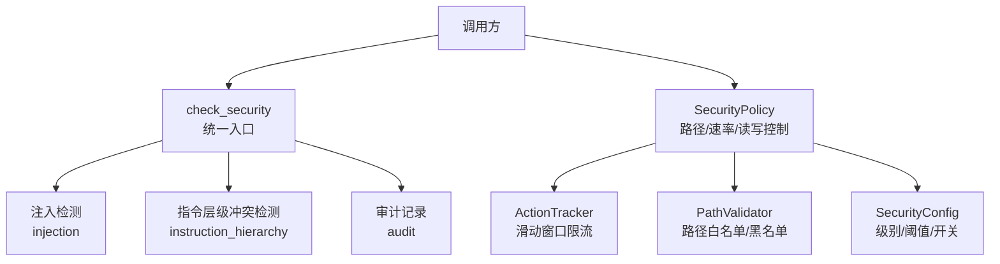
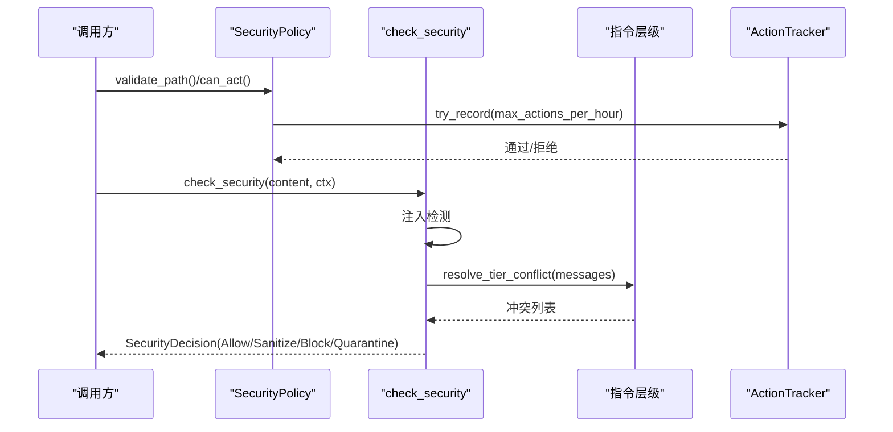
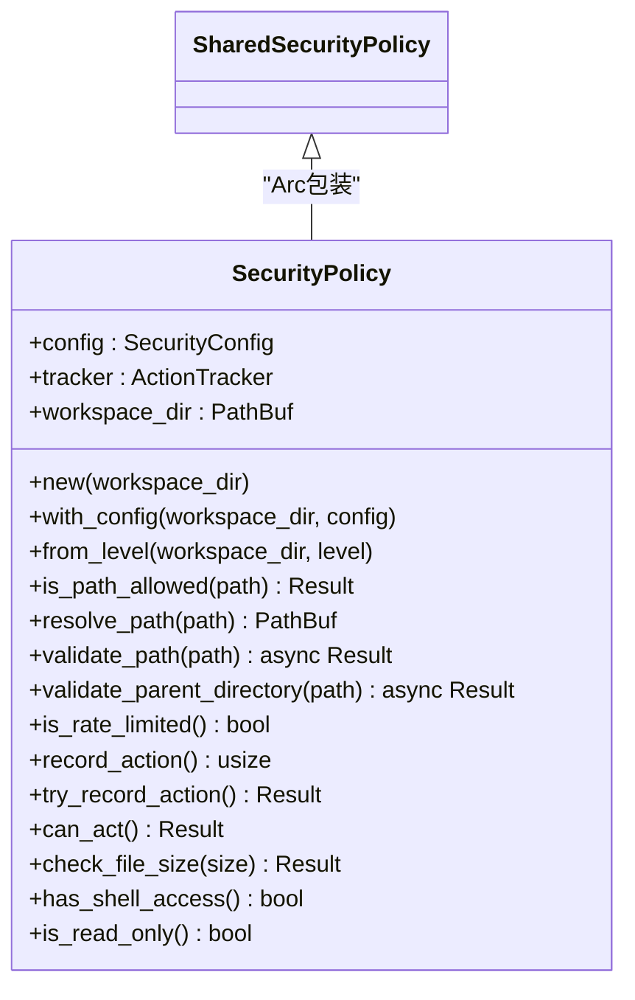
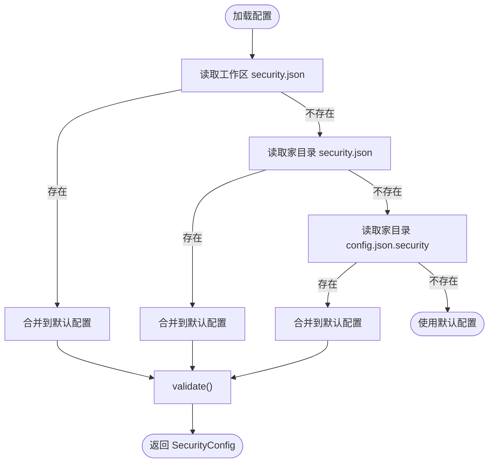
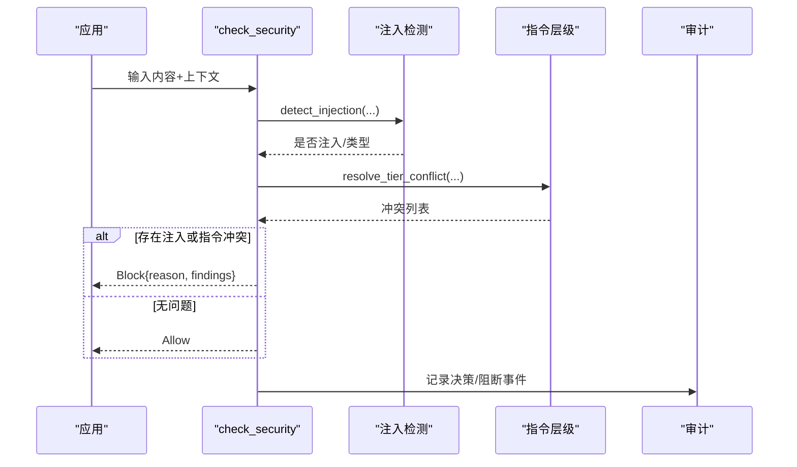
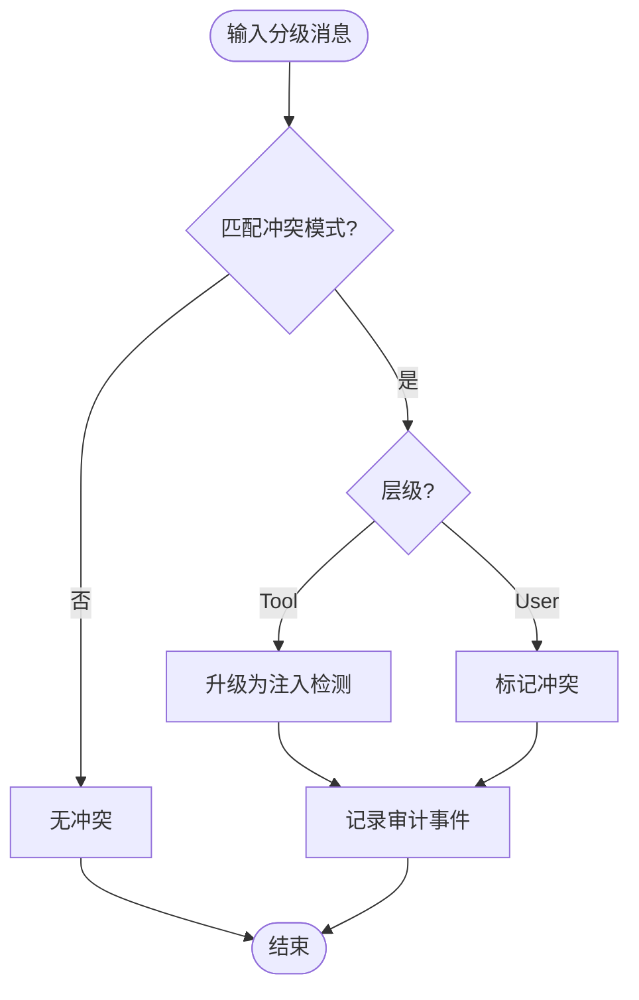
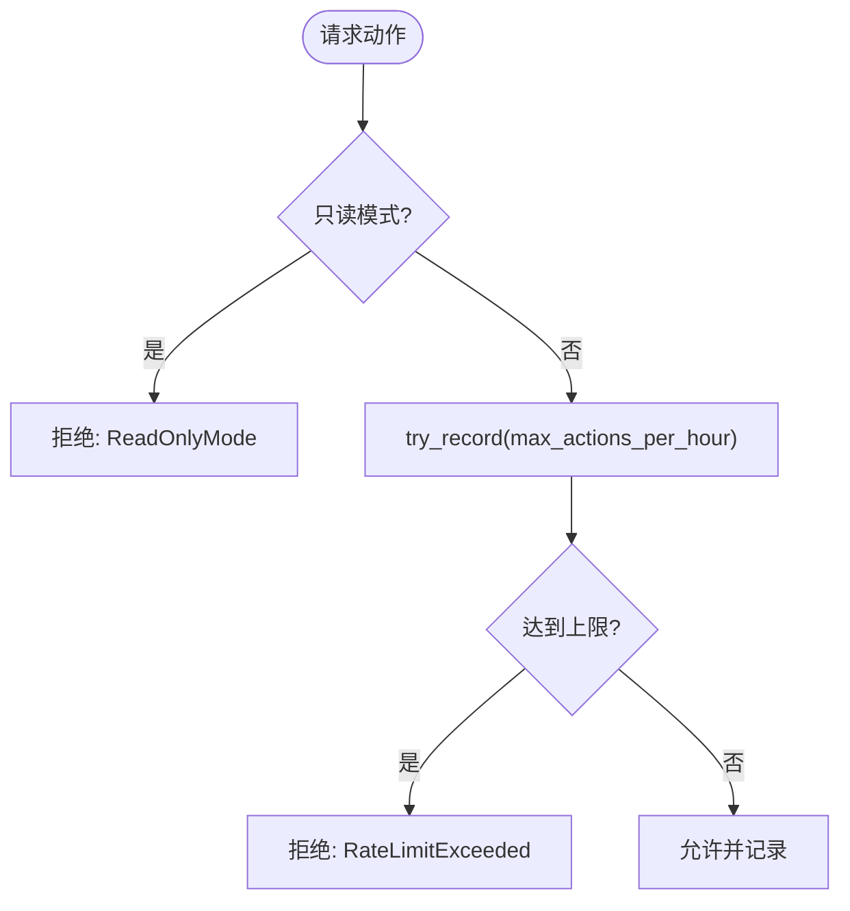
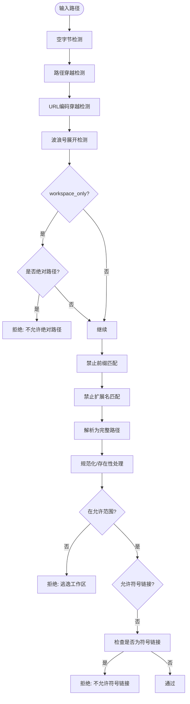
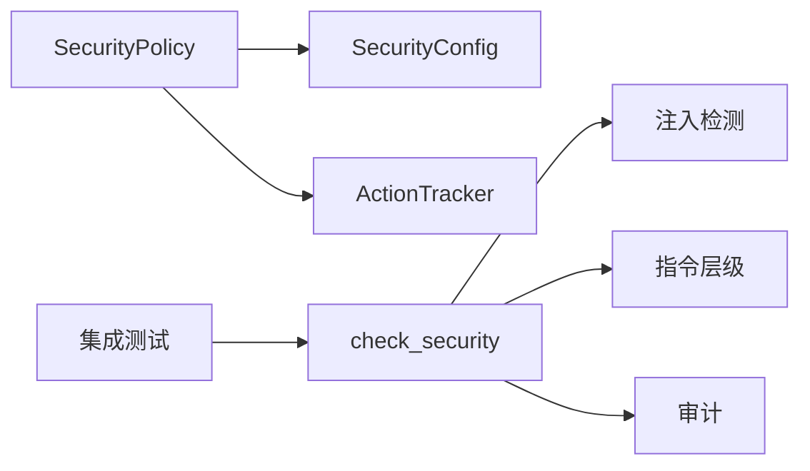

# 安全策略引擎

<cite>
**本文引用的文件**
- [agent-diva-core/src/security/mod.rs](file://agent-diva-core/src/security/mod.rs)
- [agent-diva-core/src/security/policy.rs](file://agent-diva-core/src/security/policy.rs)
- [agent-diva-core/src/security/config.rs](file://agent-diva-core/src/security/config.rs)
- [agent-diva-core/src/security/decision.rs](file://agent-diva-core/src/security/decision.rs)
- [agent-diva-core/src/security/check.rs](file://agent-diva-core/src/security/check.rs)
- [agent-diva-core/src/security/instruction_hierarchy.rs](file://agent-diva-core/src/security/instruction_hierarchy.rs)
- [agent-diva-core/src/security/rate_limit.rs](file://agent-diva-core/src/security/rate_limit.rs)
- [agent-diva-core/tests/security_integration.rs](file://agent-diva-core/tests/security_integration.rs)
</cite>

## 目录
1. [简介](#简介)
2. [项目结构](#项目结构)
3. [核心组件](#核心组件)
4. [架构总览](#架构总览)
5. [详细组件分析](#详细组件分析)
6. [依赖关系分析](#依赖关系分析)
7. [性能考量](#性能考量)
8. [故障排查指南](#故障排查指南)
9. [结论](#结论)
10. [附录：配置示例与扩展指南](#附录：配置示例与扩展指南)

## 简介
本文件面向开发者，系统化阐述 Agent Diva 的安全策略引擎，重点覆盖 SecurityPolicy 与 SharedSecurityPolicy 的实现机制、策略配置与安全级别（Standard、Strict、Permissive、Paranoid）的行为差异、策略加载与验证流程、以及决策制定与执行路径。文档同时提供策略冲突解决机制、动态更新方式、以及自定义与扩展建议，帮助你在不同场景下正确配置和扩展安全能力。

## 项目结构
安全子系统位于 agent-diva-core 的 security 模块中，采用分层与职责分离的设计：
- 配置层：SecurityConfig、SecurityLevel 定义默认值、合并与校验规则
- 策略层：SecurityPolicy 统一协调路径校验、速率限制、读写模式等
- 决策层：SecurityDecision、SecurityFinding、SecurityKind 统一表达检查结果
- 检查链：check_security 串联注入检测、指令层级冲突检测并产出最终决策
- 辅助能力：指令层级（instruction_hierarchy）、速率限制（rate_limit）、路径校验（path）、PII、工具结果过滤等

图表来源
- [agent-diva-core/src/security/check.rs:1-117](file://agent-diva-core/src/security/check.rs#L1-L117)
- [agent-diva-core/src/security/policy.rs:14-288](file://agent-diva-core/src/security/policy.rs#L14-L288)
- [agent-diva-core/src/security/config.rs:11-178](file://agent-diva-core/src/security/config.rs#L11-L178)
- [agent-diva-core/src/security/rate_limit.rs:1-90](file://agent-diva-core/src/security/rate_limit.rs#L1-L90)

章节来源
- [agent-diva-core/src/security/mod.rs:1-69](file://agent-diva-core/src/security/mod.rs#L1-L69)

## 核心组件
- SecurityPolicy：统一安全策略对象，封装配置、工作区根路径、速率限制器，并提供路径校验、解析、父目录校验、动作计数与读写模式判断等能力
- SharedSecurityPolicy：对 SecurityPolicy 的 Arc 包装，便于线程间共享
- SecurityConfig / SecurityLevel：策略配置与预设级别，支持从配置文件加载、合并与校验
- check_security：统一安全检查入口，组合注入检测与指令层级冲突检测，输出统一决策
- instruction_hierarchy：基于分层的指令优先级体系，检测低层级消息尝试覆盖高层级指令的模式
- rate_limit：滑动窗口速率限制器，用于限制单位时间内的安全相关操作次数
- decision：统一的决策模型（Allow/Sanitize/Block/Quarantine），以及发现项与上下文

章节来源
- [agent-diva-core/src/security/policy.rs:14-298](file://agent-diva-core/src/security/policy.rs#L14-L298)
- [agent-diva-core/src/security/config.rs:11-178](file://agent-diva-core/src/security/config.rs#L11-L178)
- [agent-diva-core/src/security/check.rs:1-117](file://agent-diva-core/src/security/check.rs#L1-L117)
- [agent-diva-core/src/security/instruction_hierarchy.rs:1-267](file://agent-diva-core/src/security/instruction_hierarchy.rs#L1-L267)
- [agent-diva-core/src/security/rate_limit.rs:1-90](file://agent-diva-core/src/security/rate_limit.rs#L1-L90)
- [agent-diva-core/src/security/decision.rs:1-77](file://agent-diva-core/src/security/decision.rs#L1-L77)

## 架构总览
安全策略引擎由“配置—策略—检查—决策”四层构成：
- 配置层：SecurityConfig 提供默认值、级别预设、文件加载与合并、字段校验
- 策略层：SecurityPolicy 将配置落地为可执行的策略（路径、速率、读写模式）
- 检查层：check_security 串联注入检测与指令层级冲突检测，形成统一决策
- 决策层：SecurityDecision 表达允许、清洗、阻断或隔离，附带发现项与上下文

图表来源
- [agent-diva-core/src/security/policy.rs:173-273](file://agent-diva-core/src/security/policy.rs#L173-L273)
- [agent-diva-core/src/security/check.rs:32-117](file://agent-diva-core/src/security/check.rs#L32-L117)
- [agent-diva-core/src/security/instruction_hierarchy.rs:208-267](file://agent-diva-core/src/security/instruction_hierarchy.rs#L208-L267)
- [agent-diva-core/src/security/rate_limit.rs:52-63](file://agent-diva-core/src/security/rate_limit.rs#L52-L63)

## 详细组件分析

### SecurityPolicy 与 SharedSecurityPolicy
- 职责：聚合 SecurityConfig、ActionTracker 与工作区根路径，提供路径校验、解析、父目录校验、速率限制与读写模式判断
- 关键方法：
  - from_level/with_config/new：构造策略实例
  - is_path_allowed/validate_path/is_resolved_path_allowed：多层路径校验与解析
  - can_act/try_record_action/is_rate_limited：速率限制与读写模式保护
  - has_shell_access：根据级别决定是否允许 shell 访问
- SharedSecurityPolicy：Arc<SecurityPolicy>，用于跨线程共享同一份策略

图表来源
- [agent-diva-core/src/security/policy.rs:14-298](file://agent-diva-core/src/security/policy.rs#L14-L298)

章节来源
- [agent-diva-core/src/security/policy.rs:14-298](file://agent-diva-core/src/security/policy.rs#L14-L298)

### SecurityConfig 与 SecurityLevel
- SecurityLevel 预设：
  - Permissive：宽松限制，适合开发环境；默认不强制 workspace_only；允许 shell 访问
  - Standard：标准限制，默认启用 workspace_only；中等速率限制
  - Strict：严格模式，额外校验；更严格的速率限制
  - Paranoid：只读模式，禁止修改
- 配置加载顺序（预算相关覆盖）：
  1) 工作区 .agent-diva/security.json
  2) 用户目录 .agent-diva/security.json
  3) 用户目录 .agent-diva/config.json 中的 security 嵌套段
- 合并与校验：
  - merge：非默认值覆盖基础配置
  - validate：确保 max_actions_per_hour > 0、global_tool_timeout_secs > 0、injection_block_threshold ∈ [0,1] 等

图表来源
- [agent-diva-core/src/security/config.rs:181-231](file://agent-diva-core/src/security/config.rs#L181-L231)
- [agent-diva-core/src/security/config.rs:249-273](file://agent-diva-core/src/security/config.rs#L249-L273)

章节来源
- [agent-diva-core/src/security/config.rs:11-178](file://agent-diva-core/src/security/config.rs#L11-L178)
- [agent-diva-core/src/security/config.rs:181-325](file://agent-diva-core/src/security/config.rs#L181-L325)

### 决策模型与统一入口 check_security
- SecurityDecision：统一表达 Allow/Sanitize/Block/Quarantine，附带发现项与原因
- check_security：
  - 注入检测：识别越狱、角色覆盖、工具输出注入等
  - 指令层级冲突检测：检测低层级消息试图覆盖高层级指令的模式
  - 审计：记录决策与阻断事件
  - 决策优先级：注入或指令冲突优先 Block，否则 Allow

图表来源
- [agent-diva-core/src/security/check.rs:32-117](file://agent-diva-core/src/security/check.rs#L32-L117)
- [agent-diva-core/src/security/decision.rs:13-77](file://agent-diva-core/src/security/decision.rs#L13-L77)

章节来源
- [agent-diva-core/src/security/check.rs:1-203](file://agent-diva-core/src/security/check.rs#L1-L203)
- [agent-diva-core/src/security/decision.rs:1-128](file://agent-diva-core/src/security/decision.rs#L1-L128)

### 指令层级与冲突解决
- 层级定义：System（最高）> User > Tool（最低）
- 冲突检测：扫描 User/Tool 层级中试图覆盖 System 的模式（如忽略系统提示、覆盖指令等）
- 解决策略：
  - Tool 层级冲突：升级至注入检测子系统
  - User 层级冲突：标记并记录
- 审计：记录冲突数量与严重性

图表来源
- [agent-diva-core/src/security/instruction_hierarchy.rs:109-267](file://agent-diva-core/src/security/instruction_hierarchy.rs#L109-L267)

章节来源
- [agent-diva-core/src/security/instruction_hierarchy.rs:1-594](file://agent-diva-core/src/security/instruction_hierarchy.rs#L1-L594)

### 速率限制与读写模式
- ActionTracker：滑动窗口记录动作时间戳，支持 count/try_record/is_rate_limited/reset
- SecurityPolicy.can_act：先判断只读模式，再尝试记录动作，超过阈值则拒绝
- 级别影响：不同级别默认最大动作数不同；Paranoid 开启只读模式

图表来源
- [agent-diva-core/src/security/policy.rs:237-273](file://agent-diva-core/src/security/policy.rs#L237-L273)
- [agent-diva-core/src/security/rate_limit.rs:32-63](file://agent-diva-core/src/security/rate_limit.rs#L32-L63)
- [agent-diva-core/src/security/config.rs:27-49](file://agent-diva-core/src/security/config.rs#L27-L49)

章节来源
- [agent-diva-core/src/security/rate_limit.rs:1-181](file://agent-diva-core/src/security/rate_limit.rs#L1-L181)
- [agent-diva-core/src/security/policy.rs:237-273](file://agent-diva-core/src/security/policy.rs#L237-L273)

### 路径校验与解析
- 多层校验：空字节、路径穿越、URL编码穿越、波浪号展开、绝对路径限制、禁止前缀、禁止扩展名
- 解析与范围检查：相对路径解析到工作区，必要时规范化并检查是否在允许范围内
- 符号链接限制：可按配置禁用符号链接
- 父目录校验：创建父目录后规范化并再次校验范围

图表来源
- [agent-diva-core/src/security/policy.rs:84-201](file://agent-diva-core/src/security/policy.rs#L84-L201)

章节来源
- [agent-diva-core/src/security/policy.rs:84-233](file://agent-diva-core/src/security/policy.rs#L84-L233)

## 依赖关系分析
- SecurityPolicy 依赖：
  - SecurityConfig：级别、阈值、开关
  - ActionTracker：速率限制
  - PathValidator：路径校验（通过 policy 内部逻辑调用）
- check_security 依赖：
  - injection 检测
  - instruction_hierarchy 冲突检测
  - audit 审计
- 测试覆盖：
  - 端到端集成测试验证 clean 输入、PII 形状文本不被改写、注入检测、工具输出上下文

图表来源
- [agent-diva-core/src/security/policy.rs:14-298](file://agent-diva-core/src/security/policy.rs#L14-L298)
- [agent-diva-core/src/security/check.rs:1-117](file://agent-diva-core/src/security/check.rs#L1-L117)
- [agent-diva-core/tests/security_integration.rs:1-79](file://agent-diva-core/tests/security_integration.rs#L1-L79)

章节来源
- [agent-diva-core/tests/security_integration.rs:1-79](file://agent-diva-core/tests/security_integration.rs#L1-L79)

## 性能考量
- 滑动窗口限流：ActionTracker 使用 Mutex 保护时间戳向量，定期清理过期条目，避免内存增长
- 正则冲突检测：指令层级冲突使用预编译 RegexSet，减少重复编译开销
- 路径校验：仅在必要时进行规范化与文件系统元数据查询，降低 IO 成本
- 配置合并：按需从多个位置加载并合并，缺失或格式错误时回退到默认值，避免启动阻塞

[本节为通用指导，无需特定文件引用]

## 故障排查指南
- 常见错误类型：
  - InvalidPathFormat：包含空字节、URL编码穿越、波浪号展开、父目录无效等
  - ForbiddenComponent/ForbiddenExtension：检测到禁止组件或扩展名
  - PathNotAllowed：匹配到禁止前缀
  - PathEscapesWorkspace：解析后的路径不在允许范围内
  - SymlinkNotAllowed：检测到符号链接且不允许
  - ReadOnlyMode：只读模式下尝试写操作
  - RateLimitExceeded：超过每小时最大动作数
- 定位步骤：
  - 查看 SecurityDecision 的 reason 与 findings
  - 检查 SecurityConfig 的级别与阈值设置
  - 确认工作区根路径与 allowed_roots 配置
  - 审查注入检测与指令层级冲突日志

章节来源
- [agent-diva-core/src/security/policy.rs:84-273](file://agent-diva-core/src/security/policy.rs#L84-L273)
- [agent-diva-core/src/security/check.rs:119-149](file://agent-diva-core/src/security/check.rs#L119-L149)

## 结论
Agent Diva 的安全策略引擎通过清晰的层次化设计与统一的决策模型，实现了从配置到执行的可控、可观测、可扩展的安全保障。SecurityPolicy 作为中枢协调路径、速率与读写控制；check_security 将注入检测与指令层级冲突整合为一致决策；SecurityConfig 提供灵活的加载与合并机制。不同安全级别满足从开发到生产的多场景需求，配合审计与测试，确保策略行为可预期、可追溯。

[本节为总结性内容，无需特定文件引用]

## 附录：配置示例与扩展指南

### 安全级别行为与配置选项
- Permissive：
  - 默认不强制 workspace_only
  - 允许 shell 访问
  - 较高动作上限
- Standard：
  - 默认启用 workspace_only
  - 中等动作上限
- Strict：
  - 更严格的动作上限
  - 强化校验
- Paranoid：
  - 只读模式，禁止修改
  - 较低动作上限

章节来源
- [agent-diva-core/src/security/config.rs:11-49](file://agent-diva-core/src/security/config.rs#L11-L49)
- [agent-diva-core/src/security/policy.rs:68-72](file://agent-diva-core/src/security/policy.rs#L68-L72)

### 策略加载与验证流程
- 加载顺序：工作区 security.json → 家目录 security.json → 家目录 config.json 的 security 段
- 合并规则：非默认值覆盖基础配置
- 校验要点：max_actions_per_hour > 0、global_tool_timeout_secs > 0、injection_block_threshold ∈ [0,1]

章节来源
- [agent-diva-core/src/security/config.rs:181-231](file://agent-diva-core/src/security/config.rs#L181-L231)
- [agent-diva-core/src/security/config.rs:249-273](file://agent-diva-core/src/security/config.rs#L249-L273)

### 策略冲突解决机制
- 指令层级冲突：检测低层级消息覆盖高层级指令的模式，Tool 层级冲突升级至注入检测，User 层级冲突标记并审计
- 决策优先级：注入或指令冲突优先 Block，否则 Allow

章节来源
- [agent-diva-core/src/security/instruction_hierarchy.rs:208-267](file://agent-diva-core/src/security/instruction_hierarchy.rs#L208-L267)
- [agent-diva-core/src/security/check.rs:92-117](file://agent-diva-core/src/security/check.rs#L92-L117)

### 动态策略更新
- 运行时覆盖：通过 load_budget_overrides_for_workspace 在工作区或家目录放置 security.json，实现预算与超时等字段的动态覆盖
- 合并生效：新配置与默认配置合并后生效，未提供的字段保持原值

章节来源
- [agent-diva-core/src/security/config.rs:181-231](file://agent-diva-core/src/security/config.rs#L181-L231)

### 自定义与扩展指南
- 扩展路径校验：在 SecurityPolicy::is_path_allowed 中添加新的检查层（例如新增禁止前缀或扩展名）
- 扩展注入检测：在 check_security 中接入新的注入特征或阈值调整
- 扩展指令层级：在 instruction_hierarchy 中增加新的冲突模式或调整解决策略
- 扩展速率限制：调整 ActionTracker 的窗口大小或并发策略
- 扩展审计：在 check_security 与 instruction_hierarchy 中追加审计事件，便于追踪

章节来源
- [agent-diva-core/src/security/policy.rs:84-137](file://agent-diva-core/src/security/policy.rs#L84-L137)
- [agent-diva-core/src/security/check.rs:32-117](file://agent-diva-core/src/security/check.rs#L32-L117)
- [agent-diva-core/src/security/instruction_hierarchy.rs:138-195](file://agent-diva-core/src/security/instruction_hierarchy.rs#L138-L195)
- [agent-diva-core/src/security/rate_limit.rs:15-63](file://agent-diva-core/src/security/rate_limit.rs#L15-L63)