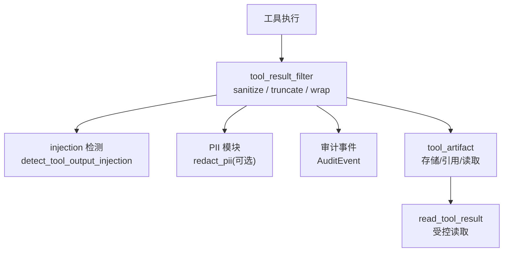
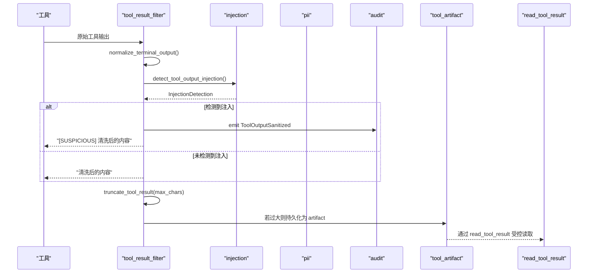
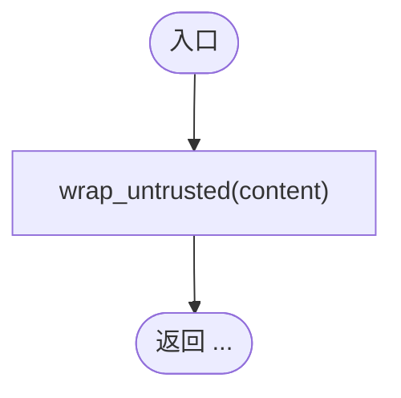
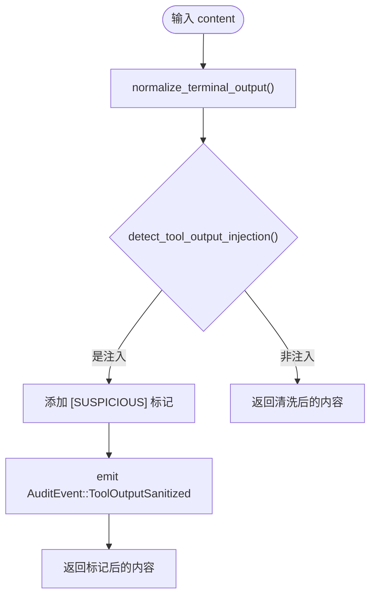
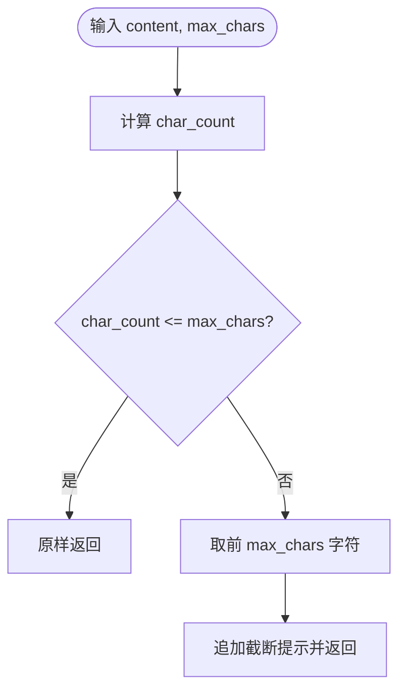
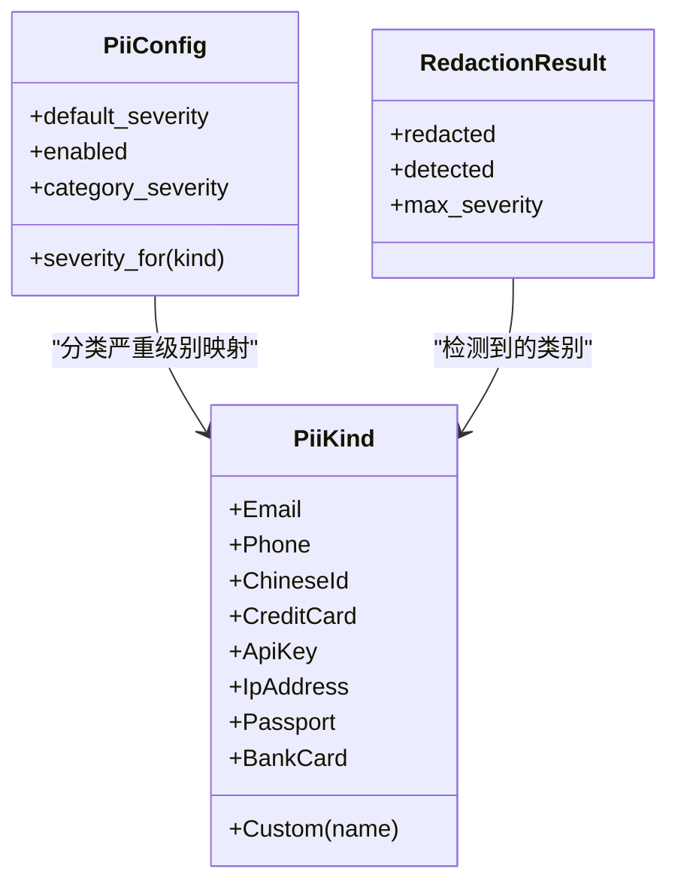
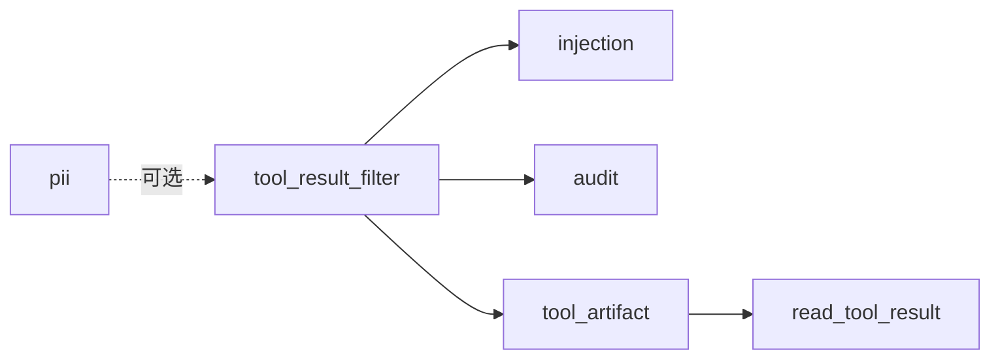

# 工具结果过滤

<cite>
**本文引用的文件**
- [agent-diva-core/src/security/tool_result_filter.rs](file://agent-diva-core/src/security/tool_result_filter.rs)
- [agent-diva-core/src/security/injection.rs](file://agent-diva-core/src/security/injection.rs)
- [agent-diva-core/src/security/pii.rs](file://agent-diva-core/src/security/pii.rs)
- [agent-diva-core/src/audit.rs](file://agent-diva-core/src/audit.rs)
- [agent-diva-agent/src/tool_results.rs](file://agent-diva-agent/src/tool_results.rs)
- [agent-diva-core/src/tool_artifact/mod.rs](file://agent-diva-core/src/tool_artifact/mod.rs)
- [agent-diva-tools/src/read_tool_result.rs](file://agent-diva-tools/src/read_tool_result.rs)
</cite>

## 目录
1. [简介](#简介)
2. [项目结构](#项目结构)
3. [核心组件](#核心组件)
4. [架构总览](#架构总览)
5. [详细组件分析](#详细组件分析)
6. [依赖关系分析](#依赖关系分析)
7. [性能考量](#性能考量)
8. [故障排查指南](#故障排查指南)
9. [结论](#结论)
10. [附录：配置与最佳实践](#附录配置与最佳实践)

## 简介
本文件系统性说明 Agent Diva 的“工具结果过滤系统”，重点围绕以下能力：
- 安全边界包装：将不可信内容用 `<untrusted>` 标签包裹，明确来源边界。
- 注入检测与标记：识别提示词注入等可疑模式，并添加 `[SUSPICIOUS]` 标记。
- 输出截断：限制工具结果长度，防止上下文窗口耗尽攻击。
- PII 检测与脱敏：支持多种 PiiKind 类型识别、校验与替换策略（默认关闭运行时替换）。
- 审计与可观测性：对注入和 PII 处理进行审计事件记录。

该机制在工具执行后、进入 LLM 上下文前形成“纵深防御”管线，确保外部输入不被误当作系统指令，同时控制上下文大小与敏感信息泄露风险。

## 项目结构
与工具结果过滤相关的核心代码集中在 agent-diva-core 的安全模块中，并在 agent 层集成到工具结果规范化流程。

图表来源
- [agent-diva-core/src/security/tool_result_filter.rs:1-132](file://agent-diva-core/src/security/tool_result_filter.rs#L1-L132)
- [agent-diva-core/src/security/injection.rs:299-409](file://agent-diva-core/src/security/injection.rs#L299-L409)
- [agent-diva-core/src/security/pii.rs:302-627](file://agent-diva-core/src/security/pii.rs#L302-L627)
- [agent-diva-core/src/tool_artifact/mod.rs:70-120](file://agent-diva-core/src/tool_artifact/mod.rs#L70-L120)
- [agent-diva-tools/src/read_tool_result.rs:1-49](file://agent-diva-tools/src/read_tool_result.rs#L1-L49)

章节来源
- [agent-diva-core/src/security/tool_result_filter.rs:1-132](file://agent-diva-core/src/security/tool_result_filter.rs#L1-L132)
- [agent-diva-core/src/security/injection.rs:299-409](file://agent-diva-core/src/security/injection.rs#L299-L409)
- [agent-diva-core/src/security/pii.rs:302-627](file://agent-diva-core/src/security/pii.rs#L302-L627)
- [agent-diva-core/src/tool_artifact/mod.rs:70-120](file://agent-diva-core/src/tool_artifact/mod.rs#L70-L120)
- [agent-diva-tools/src/read_tool_result.rs:1-49](file://agent-diva-tools/src/read_tool_result.rs#L1-L49)

## 核心组件
- 工具结果过滤器：提供三个关键函数
  - wrap_untrusted：为内容添加不可信边界标签。
  - sanitize_tool_output：清理终端转义序列，调用注入检测，必要时标注可疑内容。
  - truncate_tool_result：按字符数上限截断，并追加截断提示。
- 注入检测器：基于规则与启发式判断工具输出是否包含注入意图。
- PII 模块：多类别个人身份信息检测与替换（默认关闭运行时替换，避免误伤业务数据）。
- 审计模块：记录工具输出被标记或 PII 被替换的事件。
- 工具产物与读取：大结果持久化为 artifact，并提供带边界的读取工具。

章节来源
- [agent-diva-core/src/security/tool_result_filter.rs:35-132](file://agent-diva-core/src/security/tool_result_filter.rs#L35-L132)
- [agent-diva-core/src/security/injection.rs:299-409](file://agent-diva-core/src/security/injection.rs#L299-L409)
- [agent-diva-core/src/security/pii.rs:33-120](file://agent-diva-core/src/security/pii.rs#L33-L120)
- [agent-diva-core/src/audit.rs](file://agent-diva-core/src/audit.rs)
- [agent-diva-core/src/tool_artifact/mod.rs:70-120](file://agent-diva-core/src/tool_artifact/mod.rs#L70-L120)
- [agent-diva-tools/src/read_tool_result.rs:1-49](file://agent-diva-tools/src/read_tool_result.rs#L1-L49)

## 架构总览
工具结果在进入 LLM 上下文前，会经过“包装—清洗—截断—审计—产物化”的流水线。

图表来源
- [agent-diva-core/src/security/tool_result_filter.rs:61-132](file://agent-diva-core/src/security/tool_result_filter.rs#L61-L132)
- [agent-diva-core/src/security/injection.rs:299-409](file://agent-diva-core/src/security/injection.rs#L299-L409)
- [agent-diva-core/src/tool_artifact/mod.rs:70-120](file://agent-diva-core/src/tool_artifact/mod.rs#L70-L120)
- [agent-diva-tools/src/read_tool_result.rs:1-49](file://agent-diva-tools/src/read_tool_result.rs#L1-L49)

## 详细组件分析

### 安全边界包装：wrap_untrusted
- 作用：为所有工具输出添加 `<untrusted>` 开始与结束标签，向 LLM 明示该内容来自外部不可信源，不应被视为系统指令。
- 行为：简单字符串拼接；空内容也会产生成对的标签。
- 适用场景：所有工具结果进入模型前的统一边界设置。

图表来源
- [agent-diva-core/src/security/tool_result_filter.rs:35-55](file://agent-diva-core/src/security/tool_result_filter.rs#L35-L55)

章节来源
- [agent-diva-core/src/security/tool_result_filter.rs:35-55](file://agent-diva-core/src/security/tool_result_filter.rs#L35-L55)

### 注入检测与清洗：sanitize_tool_output
- 预处理：移除 ANSI 终端转义序列，过滤控制字符，仅保留可见字符与必要空白。
- 注入检测：调用 injection 模块的 detect_tool_output_injection，使用针对工具输出的上下文阈值。
- 标记策略：若判定为注入，则在内容前添加 `[SUSPICIOUS]` 标记，并记录审计事件。
- 注意：不直接丢弃内容，交由上层决定是否阻断。

图表来源
- [agent-diva-core/src/security/tool_result_filter.rs:61-112](file://agent-diva-core/src/security/tool_result_filter.rs#L61-L112)
- [agent-diva-core/src/security/injection.rs:299-409](file://agent-diva-core/src/security/injection.rs#L299-L409)

章节来源
- [agent-diva-core/src/security/tool_result_filter.rs:61-112](file://agent-diva-core/src/security/tool_result_filter.rs#L61-L112)
- [agent-diva-core/src/security/injection.rs:299-409](file://agent-diva-core/src/security/injection.rs#L299-L409)

### 输出截断：truncate_tool_result
- 目的：防止超长工具结果导致上下文窗口耗尽。
- 行为：统计字符数，超过上限时截取前 N 个字符，并追加截断提示行。
- 安全性：按 Unicode 字符边界截取，保证 UTF-8 有效性。

图表来源
- [agent-diva-core/src/security/tool_result_filter.rs:118-132](file://agent-diva-core/src/security/tool_result_filter.rs#L118-L132)

章节来源
- [agent-diva-core/src/security/tool_result_filter.rs:118-132](file://agent-diva-core/src/security/tool_result_filter.rs#L118-L132)

### PII 检测与脱敏：PiiKind 与 redact_pii
- 支持类别（PiiKind）：Email、Phone、ChineseId、CreditCard、ApiKey、IpAddress、Passport、BankCard、Custom。
- 默认策略：默认关闭运行时替换（enabled: false），以避免误伤业务数据（如记录 ID、长数字串）。
- 校验增强：
  - 中国身份证：加权求和模 11 校验位验证。
  - 信用卡/银行卡：Luhn 算法校验。
  - IPv4：逐段范围校验，排除版本字符串中的误报。
  - 保护内存记录 ID：避免将稳定标识符误判为电话或卡号。
- 严重级别：Warning（替换为 `[REDACTED:Kind]`）、Error（拒绝消息，不替换）。
- 自定义规则：可通过 add_custom_rule 注册正则规则（当前为 Laputa 集成桩）。

图表来源
- [agent-diva-core/src/security/pii.rs:33-120](file://agent-diva-core/src/security/pii.rs#L33-L120)
- [agent-diva-core/src/security/pii.rs:80-120](file://agent-diva-core/src/security/pii.rs#L80-L120)

章节来源
- [agent-diva-core/src/security/pii.rs:33-120](file://agent-diva-core/src/security/pii.rs#L33-L120)
- [agent-diva-core/src/security/pii.rs:302-627](file://agent-diva-core/src/security/pii.rs#L302-L627)

### 审计事件
- 工具输出注入：当 sanitize_tool_output 检测到注入时，发出 ToolOutputSanitized 审计事件，包含置信度与匹配模式。
- PII 替换：当启用 PII 替换时，按类别发出 PiiRedacted 事件，记录严重级别与数量。

章节来源
- [agent-diva-core/src/security/tool_result_filter.rs:76-96](file://agent-diva-core/src/security/tool_result_filter.rs#L76-L96)
- [agent-diva-core/src/security/pii.rs:606-620](file://agent-diva-core/src/security/pii.rs#L606-L620)

### 工具产物与读取
- 大结果持久化：当工具结果超过内联阈值时，持久化为 artifact，并通过引用传递。
- 受控读取：read_tool_result 工具支持按字符范围读取，避免一次性加载超大内容。

章节来源
- [agent-diva-agent/src/tool_results.rs:20-52](file://agent-diva-agent/src/tool_results.rs#L20-L52)
- [agent-diva-core/src/tool_artifact/mod.rs:70-120](file://agent-diva-core/src/tool_artifact/mod.rs#L70-L120)
- [agent-diva-tools/src/read_tool_result.rs:1-49](file://agent-diva-tools/src/read_tool_result.rs#L1-L49)

## 依赖关系分析
- tool_result_filter 依赖 injection 模块进行注入检测，依赖 audit 模块记录事件。
- pii 模块独立于工具结果过滤器，可在其他路径启用（默认关闭）。
- tool_artifact 与 read_tool_result 配合实现大结果的存储与受控读取。

图表来源
- [agent-diva-core/src/security/tool_result_filter.rs:27-29](file://agent-diva-core/src/security/tool_result_filter.rs#L27-L29)
- [agent-diva-core/src/security/injection.rs:299-409](file://agent-diva-core/src/security/injection.rs#L299-L409)
- [agent-diva-core/src/security/pii.rs:302-627](file://agent-diva-core/src/security/pii.rs#L302-L627)
- [agent-diva-core/src/tool_artifact/mod.rs:70-120](file://agent-diva-core/src/tool_artifact/mod.rs#L70-L120)
- [agent-diva-tools/src/read_tool_result.rs:1-49](file://agent-diva-tools/src/read_tool_result.rs#L1-L49)

章节来源
- [agent-diva-core/src/security/tool_result_filter.rs:27-29](file://agent-diva-core/src/security/tool_result_filter.rs#L27-L29)
- [agent-diva-core/src/security/injection.rs:299-409](file://agent-diva-core/src/security/injection.rs#L299-L409)
- [agent-diva-core/src/security/pii.rs:302-627](file://agent-diva-core/src/security/pii.rs#L302-L627)
- [agent-diva-core/src/tool_artifact/mod.rs:70-120](file://agent-diva-core/src/tool_artifact/mod.rs#L70-L120)
- [agent-diva-tools/src/read_tool_result.rs:1-49](file://agent-diva-tools/src/read_tool_result.rs#L1-L49)

## 性能考量
- 正则复用：ANSI 清理与 PII 模式均使用 OnceLock 缓存编译后的正则，降低重复开销。
- 字符计数与截取：truncate_tool_result 使用 chars().count() 与 take()，保证 Unicode 安全但存在线性复杂度；建议结合 artifact 机制减少大文本传输。
- 注入检测：基于规则集与熵值评估，适合中等规模输入；对极长输入建议先截断再检测。
- PII 检测：默认关闭以减少运行时成本；开启时需权衡误报与性能。

[本节为通用指导，不直接分析具体文件]

## 故障排查指南
- 工具结果过长导致上下文溢出：检查 MAX_TOOL_RESULT_CHARS 与 truncate_tool_result 的使用；确认是否已启用 artifact 持久化与 read_tool_result 的分页读取。
- 注入误报：查看 sanitize_tool_output 的审计事件，确认匹配的模式与置信度；必要时调整注入规则或上下文阈值。
- PII 误删：确认 PiiConfig.enabled 状态；如需保留业务数据（如记录 ID），保持默认关闭或在 category_severity 中精细控制。
- 终端输出异常：检查 ANSI 清理逻辑是否正确移除了控制字符；确保过滤后仍保留换行与制表符。

章节来源
- [agent-diva-core/src/security/tool_result_filter.rs:61-132](file://agent-diva-core/src/security/tool_result_filter.rs#L61-L132)
- [agent-diva-core/src/security/pii.rs:302-627](file://agent-diva-core/src/security/pii.rs#L302-L627)
- [agent-diva-core/src/tool_artifact/mod.rs:70-120](file://agent-diva-core/src/tool_artifact/mod.rs#L70-L120)
- [agent-diva-tools/src/read_tool_result.rs:1-49](file://agent-diva-tools/src/read_tool_result.rs#L1-L49)

## 结论
Agent Diva 的工具结果过滤系统在“包装—清洗—截断—审计—产物化”的多层防护下，有效降低了注入攻击与上下文耗尽风险，同时在默认关闭 PII 替换的前提下兼顾了业务数据的可用性。通过可配置的严重级别、自定义规则与审计事件，团队可以在安全与可用性之间取得平衡。

[本节为总结，不直接分析具体文件]

## 附录：配置与最佳实践

### 过滤规则配置要点
- 安全边界：始终对所有工具结果调用 wrap_untrusted，确保 LLM 能区分系统与外部内容。
- 注入检测：使用 sanitize_tool_output 进行清洗与标记；结合审计事件监控可疑输出。
- 输出截断：根据模型上下文限制设置合适的 max_chars；对超大结果优先使用 artifact 与 read_tool_result。
- PII 策略：默认关闭运行时替换；仅在测试或特定环境启用，并通过 category_severity 精细化控制。

章节来源
- [agent-diva-core/src/security/tool_result_filter.rs:35-132](file://agent-diva-core/src/security/tool_result_filter.rs#L35-L132)
- [agent-diva-core/src/security/pii.rs:88-120](file://agent-diva-core/src/security/pii.rs#L88-L120)

### 自定义过滤器开发建议
- 扩展注入检测：在 injection 模块中添加新规则或提高特定模式的权重。
- 扩展 PII 规则：通过 add_custom_rule 注册新的正则模式，并指定严重级别。
- 审计增强：在关键路径增加更多审计事件，便于追踪与回溯。

章节来源
- [agent-diva-core/src/security/injection.rs:299-409](file://agent-diva-core/src/security/injection.rs#L299-L409)
- [agent-diva-core/src/security/pii.rs:146-161](file://agent-diva-core/src/security/pii.rs#L146-L161)

### 敏感数据处理最佳实践
- 默认关闭 PII 替换，避免误伤业务数据（如记录 ID、长数字串）。
- 对需要脱敏的场景，显式启用 PII 检测并按类别设置严重级别。
- 对超大结果使用 artifact 与分页读取，减少内存与上下文压力。
- 利用审计事件持续观察注入与 PII 处理效果，及时调整策略。

章节来源
- [agent-diva-core/src/security/pii.rs:100-120](file://agent-diva-core/src/security/pii.rs#L100-L120)
- [agent-diva-core/src/tool_artifact/mod.rs:70-120](file://agent-diva-core/src/tool_artifact/mod.rs#L70-L120)
- [agent-diva-tools/src/read_tool_result.rs:1-49](file://agent-diva-tools/src/read_tool_result.rs#L1-L49)