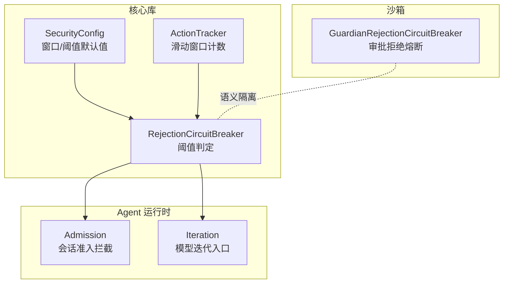
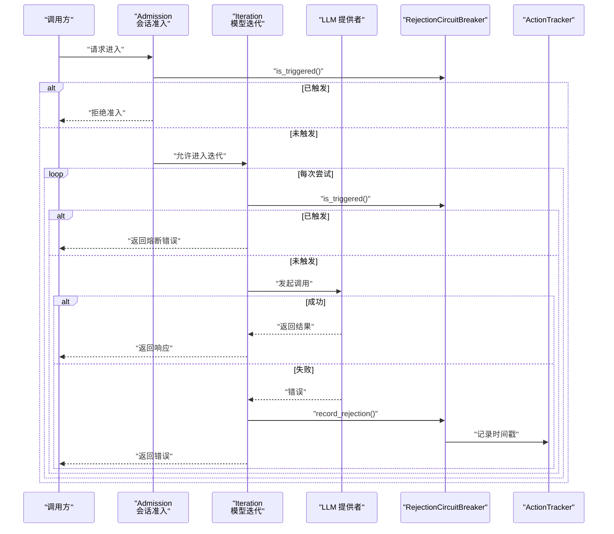
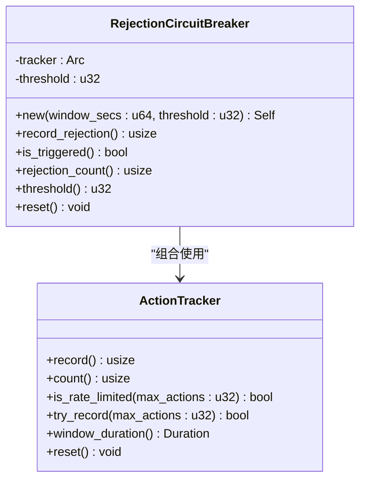
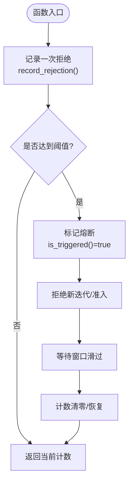
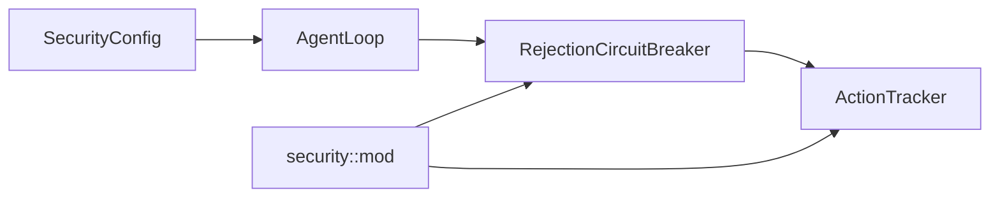

# 拒绝熔断器

<cite>
**本文引用的文件**
- [agent-diva-core/src/security/rejection_circuit.rs](file://agent-diva-core/src/security/rejection_circuit.rs)
- [agent-diva-core/src/security/rate_limit.rs](file://agent-diva-core/src/security/rate_limit.rs)
- [agent-diva-core/src/security/config.rs](file://agent-diva-core/src/security/config.rs)
- [agent-diva-core/src/security/mod.rs](file://agent-diva-core/src/security/mod.rs)
- [agent-diva-agent/src/agent_loop.rs](file://agent-diva-agent/src/agent_loop.rs)
- [agent-diva-agent/src/agent_loop/turn/admission.rs](file://agent-diva-agent/src/agent_loop/turn/admission.rs)
- [agent-diva-agent/src/agent_loop/turn/iteration.rs](file://agent-diva-agent/src/agent_loop/turn/iteration.rs)
- [agent-diva-sandbox/src/guardian.rs](file://agent-diva-sandbox/src/guardian.rs)
</cite>

## 目录
1. [简介](#简介)
2. [项目结构](#项目结构)
3. [核心组件](#核心组件)
4. [架构总览](#架构总览)
5. [详细组件分析](#详细组件分析)
6. [依赖关系分析](#依赖关系分析)
7. [性能与超时](#性能与超时)
8. [监控指标与可观测性](#监控指标与可观测性)
9. [配置与调优](#配置与调优)
10. [故障恢复策略](#故障恢复策略)
11. [故障场景处理指南](#故障场景处理指南)
12. [结论](#结论)

## 简介
本文件聚焦 Agent Diva 的“拒绝熔断器”（RejectionCircuitBreaker），用于在模型/提供者连续拒绝（如速率限制、上下文长度超限、鉴权失败等）时，快速阻断新一轮模型迭代，避免死循环和资源耗尽。该熔断器基于滑动窗口计数与阈值判定，具备自动恢复能力；同时提供手动重置接口以支持运维干预。

## 项目结构
- 核心实现位于 agent-diva-core 的安全模块中，包含：
  - 滑动窗口动作追踪器 ActionTracker
  - 拒绝熔断器 RejectionCircuitBreaker
  - 安全配置 SecurityConfig（含窗口与阈值默认值及合并逻辑）
- Agent 侧将熔断器接入会话准入与迭代流程，形成“检测—触发—恢复”的闭环控制。
- 沙箱侧存在另一套审批型拒绝熔断器 GuardianRejectionCircuitBreaker，语义隔离于模型调用链路。

**图示来源**
- [agent-diva-core/src/security/rejection_circuit.rs:1-56](file://agent-diva-core/src/security/rejection_circuit.rs#L1-L56)
- [agent-diva-core/src/security/rate_limit.rs:1-84](file://agent-diva-core/src/security/rate_limit.rs#L1-L84)
- [agent-diva-core/src/security/config.rs:117-136](file://agent-diva-core/src/security/config.rs#L117-L136)
- [agent-diva-agent/src/agent_loop/turn/admission.rs:95-112](file://agent-diva-agent/src/agent_loop/turn/admission.rs#L95-L112)
- [agent-diva-agent/src/agent_loop/turn/iteration.rs:180-198](file://agent-diva-agent/src/agent_loop/turn/iteration.rs#L180-L198)
- [agent-diva-sandbox/src/guardian.rs:497-565](file://agent-diva-sandbox/src/guardian.rs#L497-L565)

**章节来源**
- [agent-diva-core/src/security/rejection_circuit.rs:1-56](file://agent-diva-core/src/security/rejection_circuit.rs#L1-L56)
- [agent-diva-core/src/security/rate_limit.rs:1-84](file://agent-diva-core/src/security/rate_limit.rs#L1-L84)
- [agent-diva-core/src/security/config.rs:117-136](file://agent-diva-core/src/security/config.rs#L117-L136)
- [agent-diva-agent/src/agent_loop/turn/admission.rs:95-112](file://agent-diva-agent/src/agent_loop/turn/admission.rs#L95-L112)
- [agent-diva-agent/src/agent_loop/turn/iteration.rs:180-198](file://agent-diva-agent/src/agent_loop/turn/iteration.rs#L180-L198)
- [agent-diva-sandbox/src/guardian.rs:497-565](file://agent-diva-sandbox/src/guardian.rs#L497-L565)

## 核心组件
- RejectionCircuitBreaker
  - 职责：统计滑动窗口内的拒绝次数，达到阈值即触发熔断，阻止新迭代。
  - 关键方法：record_rejection、is_triggered、rejection_count、threshold、reset。
- ActionTracker
  - 职责：维护时间戳序列并清理过期项，提供计数与限流判断。
  - 关键方法：record、count、is_rate_limited、try_record、window_duration、reset。
- SecurityConfig
  - 职责：定义 rejection_circuit_window_secs 与 rejection_circuit_threshold 的默认值与合并规则。
  - 默认值：窗口 60 秒，阈值 50（足够大以避免误触发）。

**章节来源**
- [agent-diva-core/src/security/rejection_circuit.rs:15-56](file://agent-diva-core/src/security/rejection_circuit.rs#L15-L56)
- [agent-diva-core/src/security/rate_limit.rs:6-84](file://agent-diva-core/src/security/rate_limit.rs#L6-L84)
- [agent-diva-core/src/security/config.rs:117-136](file://agent-diva-core/src/security/config.rs#L117-L136)

## 架构总览
下图展示从“会话准入”到“模型迭代”的完整熔断路径，以及错误回路上对拒绝次数的累计与熔断判定。

**图示来源**
- [agent-diva-agent/src/agent_loop/turn/admission.rs:95-112](file://agent-diva-agent/src/agent_loop/turn/admission.rs#L95-L112)
- [agent-diva-agent/src/agent_loop/turn/iteration.rs:180-198](file://agent-diva-agent/src/agent_loop/turn/iteration.rs#L180-L198)
- [agent-diva-agent/src/agent_loop/turn/iteration.rs:378-390](file://agent-diva-agent/src/agent_loop/turn/iteration.rs#L378-L390)
- [agent-diva-core/src/security/rejection_circuit.rs:31-56](file://agent-diva-core/src/security/rejection_circuit.rs#L31-L56)
- [agent-diva-core/src/security/rate_limit.rs:32-50](file://agent-diva-core/src/security/rate_limit.rs#L32-L50)

## 详细组件分析

### RejectionCircuitBreaker 类图

**图示来源**
- [agent-diva-core/src/security/rejection_circuit.rs:15-56](file://agent-diva-core/src/security/rejection_circuit.rs#L15-L56)
- [agent-diva-core/src/security/rate_limit.rs:6-84](file://agent-diva-core/src/security/rate_limit.rs#L6-L84)

**章节来源**
- [agent-diva-core/src/security/rejection_circuit.rs:15-56](file://agent-diva-core/src/security/rejection_circuit.rs#L15-L56)
- [agent-diva-core/src/security/rate_limit.rs:6-84](file://agent-diva-core/src/security/rate_limit.rs#L6-L84)

### 熔断触发流程图（算法级）

**图示来源**
- [agent-diva-core/src/security/rejection_circuit.rs:31-56](file://agent-diva-core/src/security/rejection_circuit.rs#L31-L56)
- [agent-diva-core/src/security/rate_limit.rs:32-50](file://agent-diva-core/src/security/rate_limit.rs#L32-L50)

**章节来源**
- [agent-diva-core/src/security/rejection_circuit.rs:31-56](file://agent-diva-core/src/security/rejection_circuit.rs#L31-L56)
- [agent-diva-core/src/security/rate_limit.rs:32-50](file://agent-diva-core/src/security/rate_limit.rs#L32-L50)

### 与 Agent 运行时的集成点
- 会话准入拦截：当熔断器处于触发态时，直接拒绝新的 turn 准入，防止继续消耗资源。
- 模型迭代入口：每次迭代前检查熔断状态；若触发则立即返回错误，避免无意义重试。
- 错误回路：当 provider 调用失败时，记录一次拒绝，推动熔断器向触发态演进。

**章节来源**
- [agent-diva-agent/src/agent_loop/turn/admission.rs:95-112](file://agent-diva-agent/src/agent_loop/turn/admission.rs#L95-L112)
- [agent-diva-agent/src/agent_loop/turn/iteration.rs:180-198](file://agent-diva-agent/src/agent_loop/turn/iteration.rs#L180-L198)
- [agent-diva-agent/src/agent_loop/turn/iteration.rs:378-390](file://agent-diva-agent/src/agent_loop/turn/iteration.rs#L378-L390)

### 与沙箱审批熔断器的差异
- 模型调用熔断器（RejectionCircuitBreaker）：针对 provider 拒绝（速率限制、上下文超限、鉴权失败等），通过滑动窗口+阈值保护系统。
- 审批熔断器（GuardianRejectionCircuitBreaker）：针对命令审批被拒的场景，影响执行决策（如将自动批准降级为拒绝或需人工审批）。

**章节来源**
- [agent-diva-core/src/security/rejection_circuit.rs:1-8](file://agent-diva-core/src/security/rejection_circuit.rs#L1-L8)
- [agent-diva-sandbox/src/guardian.rs:497-565](file://agent-diva-sandbox/src/guardian.rs#L497-L565)

## 依赖关系分析
- RejectionCircuitBreaker 依赖 ActionTracker 进行滑动窗口计数。
- AgentLoop 在构造时从 SecurityConfig 读取窗口与阈值，实例化 RejectionCircuitBreaker。
- 安全模块统一导出 RejectionCircuitBreaker 与 ActionTracker，供上层使用。

**图示来源**
- [agent-diva-core/src/security/config.rs:117-136](file://agent-diva-core/src/security/config.rs#L117-L136)
- [agent-diva-agent/src/agent_loop.rs:540-544](file://agent-diva-agent/src/agent_loop.rs#L540-L544)
- [agent-diva-agent/src/agent_loop.rs:725-728](file://agent-diva-agent/src/agent_loop.rs#L725-L728)
- [agent-diva-core/src/security/mod.rs:58-59](file://agent-diva-core/src/security/mod.rs#L58-L59)

**章节来源**
- [agent-diva-core/src/security/mod.rs:58-59](file://agent-diva-core/src/security/mod.rs#L58-L59)
- [agent-diva-agent/src/agent_loop.rs:540-544](file://agent-diva-agent/src/agent_loop.rs#L540-L544)
- [agent-diva-agent/src/agent_loop.rs:725-728](file://agent-diva-agent/src/agent_loop.rs#L725-L728)

## 性能与超时
- 滑动窗口清理：ActionTracker 在 record/count 时清理过期时间戳，避免内存增长；清理复杂度与窗口内事件数线性相关。
- 并发安全：使用 Mutex 保护时间戳向量，保证多线程环境下的正确性。
- 超时处理：熔断器本身不引入额外超时；整体超时由工具/全局超时配置控制，熔断器仅做“拒绝新工作”的快速短路。

**章节来源**
- [agent-diva-core/src/security/rate_limit.rs:32-84](file://agent-diva-core/src/security/rate_limit.rs#L32-L84)
- [agent-diva-core/src/security/config.rs:138-140](file://agent-diva-core/src/security/config.rs#L138-L140)

## 监控指标与可观测性
- 日志与事件：
  - 迭代入口在熔断触发时输出告警日志，包含 session_id、当前拒绝计数与阈值。
  - 每次 provider 失败会记录拒绝计数与阈值，便于定位风暴规模。
- 可观测字段：
  - rejection_count：当前窗口内拒绝次数
  - threshold：配置的阈值
  - is_triggered：是否处于熔断态
- 建议采集指标（可在上层扩展）：
  - 熔断触发次数、持续时间
  - 拒绝率（单位时间内拒绝次数/总调用次数）
  - 平均恢复时间（从触发到自然恢复）

**章节来源**
- [agent-diva-agent/src/agent_loop/turn/iteration.rs:190-197](file://agent-diva-agent/src/agent_loop/turn/iteration.rs#L190-L197)
- [agent-diva-agent/src/agent_loop/turn/iteration.rs:380-388](file://agent-diva-agent/src/agent_loop/turn/iteration.rs#L380-L388)

## 配置与调优
- 配置键
  - rejection_circuit_window_secs：滑动窗口大小（秒），默认 60
  - rejection_circuit_threshold：窗口内允许的拒绝次数上限，默认 50
- 配置来源
  - 通过 workspace 下的 security.json 覆盖默认值
  - AgentLoop 构造时读取并传入 RejectionCircuitBreaker::new
- 调优建议
  - 高抖动环境：适当增大 window_secs，平滑瞬时峰值
  - 严格保护：降低 threshold，更快进入熔断
  - 观察期：先保持默认，结合日志与指标逐步调整

**章节来源**
- [agent-diva-core/src/security/config.rs:117-136](file://agent-diva-core/src/security/config.rs#L117-L136)
- [agent-diva-agent/src/agent_loop.rs:540-544](file://agent-diva-agent/src/agent_loop.rs#L540-L544)
- [agent-diva-agent/src/agent_loop.rs:725-728](file://agent-diva-agent/src/agent_loop.rs#L725-L728)

## 故障恢复策略
- 自动恢复：滑动窗口滑过使计数归零，熔断器自动退出触发态，后续请求恢复正常。
- 手动恢复：调用 reset 强制清除所有跟踪的拒绝，立即恢复服务。
- 与审批熔断的区别：审批熔断可通过“批准”事件重置；模型调用熔断主要依赖窗口滑过或手动 reset。

**章节来源**
- [agent-diva-core/src/security/rejection_circuit.rs:52-56](file://agent-diva-core/src/security/rejection_circuit.rs#L52-L56)
- [agent-diva-sandbox/src/guardian.rs:532-539](file://agent-diva-sandbox/src/guardian.rs#L532-L539)

## 故障场景处理指南
- 场景一：Provider 持续返回速率限制
  - 现象：短时间内大量拒绝，计数器快速上升
  - 处理：确认上游限流策略；必要时提高阈值或扩大窗口；观察日志中的 rejection_count 与 threshold
- 场景二：上下文长度超限导致反复失败
  - 现象：provider 报错上下文过大，触发多次拒绝
  - 处理：结合上下文压缩与微压缩策略；在熔断触发后等待窗口恢复，避免无效重试
- 场景三：鉴权失败或网络抖动
  - 现象：偶发错误累积导致熔断
  - 处理：检查认证配置与网络稳定性；必要时手动 reset 加速恢复

**章节来源**
- [agent-diva-agent/src/agent_loop/turn/iteration.rs:190-197](file://agent-diva-agent/src/agent_loop/turn/iteration.rs#L190-L197)
- [agent-diva-agent/src/agent_loop/turn/iteration.rs:378-390](file://agent-diva-agent/src/agent_loop/turn/iteration.rs#L378-L390)

## 结论
RejectionCircuitBreaker 通过“滑动窗口计数 + 阈值判定”提供了轻量而高效的拒绝风暴防护，能够在模型/提供者连续拒绝时快速阻断新迭代，防止级联故障与资源耗尽。配合 SecurityConfig 的可配置窗口与阈值，以及 Agent 侧的准入与迭代拦截，形成了完整的“检测—触发—恢复”闭环。建议在真实环境中结合日志与指标持续调优，确保既不过度敏感也不漏报风险。