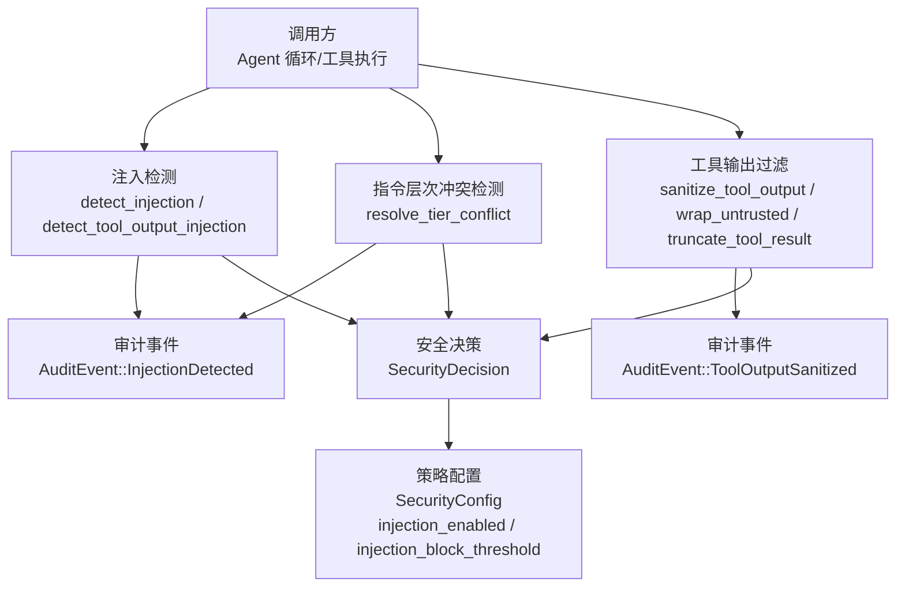
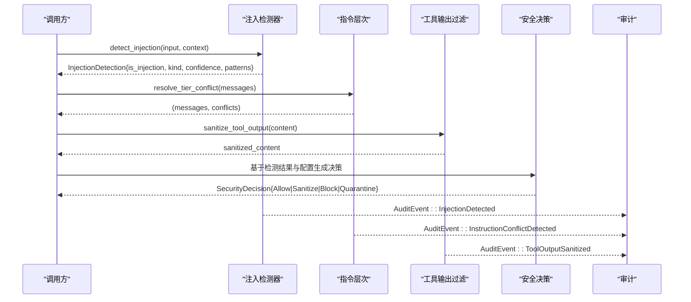
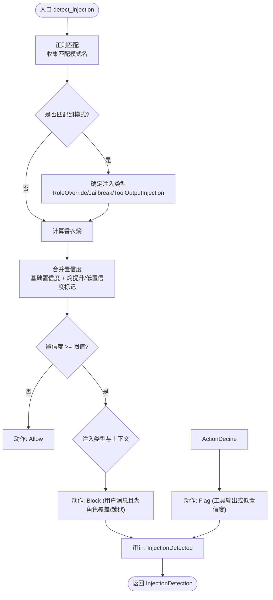
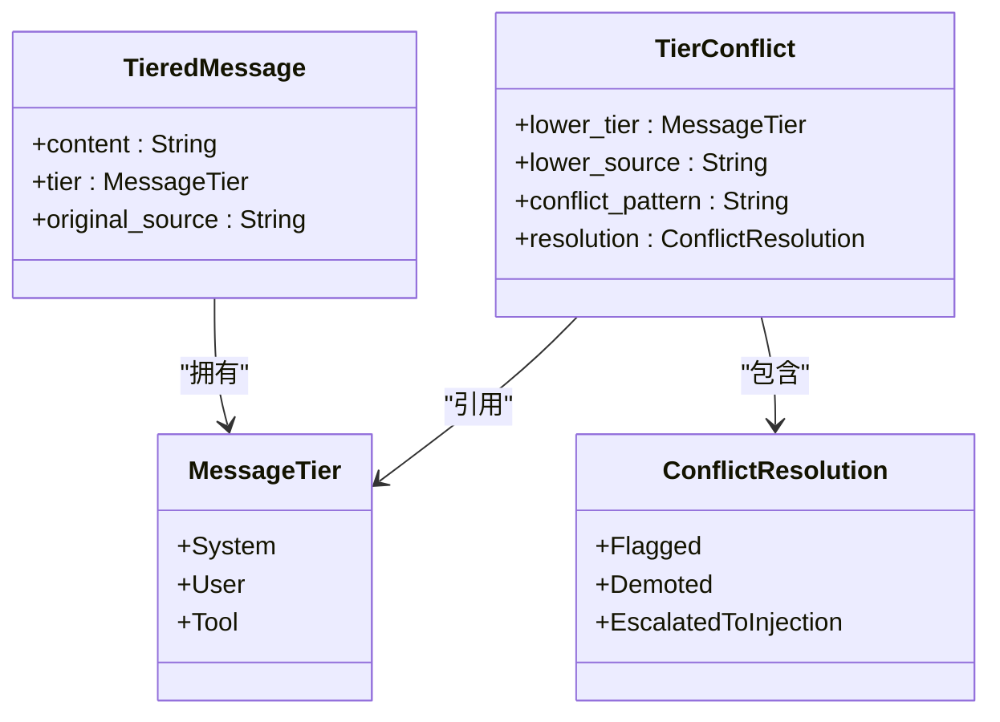
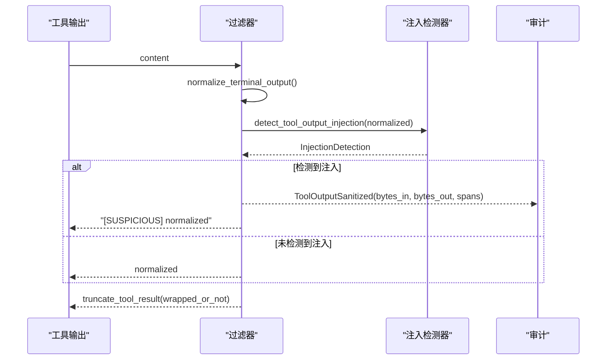
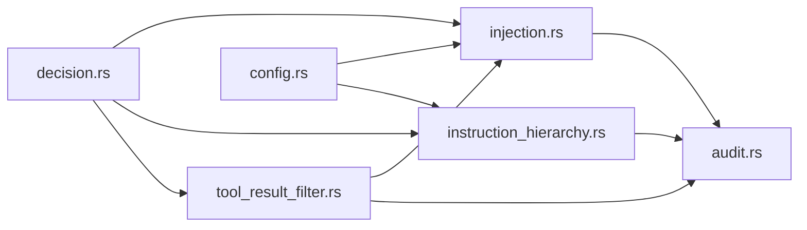

# 注入攻击防护

<cite>
**本文引用的文件**
- [injection.rs](file://agent-diva-core/src/security/injection.rs)
- [instruction_hierarchy.rs](file://agent-diva-core/src/security/instruction_hierarchy.rs)
- [tool_result_filter.rs](file://agent-diva-core/src/security/tool_result_filter.rs)
- [config.rs](file://agent-diva-core/src/security/config.rs)
- [decision.rs](file://agent-diva-core/src/security/decision.rs)
- [audit.rs](file://agent-diva-core/src/audit.rs)
- [mod.rs](file://agent-diva-core/src/security/mod.rs)
</cite>

## 目录
1. [简介](#简介)
2. [项目结构](#项目结构)
3. [核心组件](#核心组件)
4. [架构总览](#架构总览)
5. [详细组件分析](#详细组件分析)
6. [依赖关系分析](#依赖关系分析)
7. [性能考量](#性能考量)
8. [故障排查指南](#故障排查指南)
9. [结论](#结论)
10. [附录](#附录)

## 简介
本文件面向 Agent Diva 的“注入攻击防护”子系统，聚焦以下目标：
- 深入解析注入检测机制，尤其是 detect_injection 与 detect_tool_output_injection 的实现原理。
- 说明三类注入的检测算法与防护策略：Prompt Injection、Tool Output Injection、Instruction Injection。
- 解释指令层次结构（Instruction Hierarchy）的管理与冲突解决机制。
- 提供注入攻击识别模式、防护配置与响应处理流程。
- 给出具体攻击案例与防护措施配置示例。

## 项目结构
注入防护相关能力集中在 agent-diva-core 的安全模块中，关键文件如下：
- 注入检测与分类：injection.rs
- 指令层次与冲突检测：instruction_hierarchy.rs
- 工具输出过滤与包装：tool_result_filter.rs
- 安全策略与阈值配置：config.rs
- 统一安全决策模型：decision.rs
- 审计事件与严重级别：audit.rs
- 安全模块对外导出：mod.rs

图表来源
- [injection.rs:299-409](file://agent-diva-core/src/security/injection.rs#L299-L409)
- [instruction_hierarchy.rs:208-267](file://agent-diva-core/src/security/instruction_hierarchy.rs#L208-L267)
- [tool_result_filter.rs:61-132](file://agent-diva-core/src/security/tool_result_filter.rs#L61-L132)
- [config.rs:51-178](file://agent-diva-core/src/security/config.rs#L51-L178)
- [decision.rs:12-76](file://agent-diva-core/src/security/decision.rs#L12-L76)
- [audit.rs:56-136](file://agent-diva-core/src/audit.rs#L56-L136)

章节来源
- [mod.rs:26-68](file://agent-diva-core/src/security/mod.rs#L26-L68)

## 核心组件
- 注入检测器（injection.rs）
  - 三层防御：静态正则匹配、香农熵分析、模型分类占位接口。
  - 支持三种注入类型：RoleOverride、ToolOutputInjection、Jailbreak。
  - 提供 detect_injection(input, context) 与 detect_tool_output_injection(output)。
  - 根据置信度与上下文决定动作：Allow、Flag、Block。
- 指令层次（instruction_hierarchy.rs）
  - 将消息分为 System(最高)、User、Tool(最低) 三个层级。
  - 扫描低层级消息是否尝试覆盖高层级指令，并记录冲突与处置方式。
- 工具输出过滤（tool_result_filter.rs）
  - 对工具输出进行清洗：去 ANSI 控制码、标记可疑内容、截断超长结果、包裹 <untrusted> 标签。
  - 复用 detect_tool_output_injection 进行注入检测。
- 安全配置（config.rs）
  - 提供 SecurityLevel 预设与安全策略参数，包括 injection_enabled、injection_block_threshold 等。
- 统一决策（decision.rs）
  - 抽象 Allow/Sanitize/Block/Quarantine 四种决策，便于上层统一处理。
- 审计事件（audit.rs）
  - 标准化审计事件，如 InjectionDetected、ToolOutputSanitized、MessageBlocked 等。

章节来源
- [injection.rs:38-93](file://agent-diva-core/src/security/injection.rs#L38-L93)
- [injection.rs:299-409](file://agent-diva-core/src/security/injection.rs#L299-L409)
- [instruction_hierarchy.rs:45-132](file://agent-diva-core/src/security/instruction_hierarchy.rs#L45-L132)
- [tool_result_filter.rs:35-132](file://agent-diva-core/src/security/tool_result_filter.rs#L35-L132)
- [config.rs:51-178](file://agent-diva-core/src/security/config.rs#L51-L178)
- [decision.rs:12-76](file://agent-diva-core/src/security/decision.rs#L12-L76)
- [audit.rs:56-136](file://agent-diva-core/src/audit.rs#L56-L136)

## 架构总览
注入防护采用“分层检测 + 统一决策 + 审计可观测”的架构：
- 输入进入后，先经注入检测器判定是否为注入及类型；同时指令层次模块检查是否存在跨层覆盖意图；工具输出在进入 LLM 前被过滤与包装。
- 各模块产出结构化结果，结合安全配置中的阈值，生成统一的安全决策。
- 所有关键事件通过审计模块记录，便于追踪与告警。

图表来源
- [injection.rs:299-409](file://agent-diva-core/src/security/injection.rs#L299-L409)
- [instruction_hierarchy.rs:208-267](file://agent-diva-core/src/security/instruction_hierarchy.rs#L208-L267)
- [tool_result_filter.rs:61-132](file://agent-diva-core/src/security/tool_result_filter.rs#L61-L132)
- [decision.rs:12-76](file://agent-diva-core/src/security/decision.rs#L12-L76)
- [audit.rs:56-136](file://agent-diva-core/src/audit.rs#L56-L136)

## 详细组件分析

### 注入检测器（injection.rs）
- 静态正则匹配（Layer 1）
  - 预编译 RegexSet，包含角色覆盖、工具输出注入、越狱绕过等模式族。
  - 按组索引区分 RoleOverride、ToolOutputInjection、Jailbreak。
- 香农熵分析（Layer 2）
  - 计算文本信息熵，高熵提示可能存在 base64/ROT13/hex 等编码载荷。
  - 当存在模式匹配时提升置信度；无匹配但高熵则低置信度标记。
- 模型分类（Layer 3）
  - 预留接口，当前返回 None，便于未来接入 LLM 辅助分类。
- 置信度与动作
  - 综合模式匹配、熵、模型置信度得出最终置信度。
  - 依据注入类型与上下文决定 Allow/Flag/Block。
- 审计
  - 检测到注入时发出 AuditEvent::InjectionDetected，包含 layer、pattern、severity。

图表来源
- [injection.rs:99-249](file://agent-diva-core/src/security/injection.rs#L99-L249)
- [injection.rs:255-293](file://agent-diva-core/src/security/injection.rs#L255-L293)
- [injection.rs:299-409](file://agent-diva-core/src/security/injection.rs#L299-L409)

章节来源
- [injection.rs:38-93](file://agent-diva-core/src/security/injection.rs#L38-L93)
- [injection.rs:99-249](file://agent-diva-core/src/security/injection.rs#L99-L249)
- [injection.rs:255-293](file://agent-diva-core/src/security/injection.rs#L255-L293)
- [injection.rs:299-409](file://agent-diva-core/src/security/injection.rs#L299-L409)

### 指令层次（instruction_hierarchy.rs）
- 层级定义
  - System(0) > User(1) > Tool(2)，System 指令不可被低层级覆盖。
- 冲突检测
  - 对 User/Tool 层级消息扫描“忽略系统提示/覆盖指令/忘记指令”等模式。
  - 若 Tool 层级尝试覆盖，升级为注入检测；User 层级仅标记。
- 审计与返回
  - 返回原始消息与冲突列表，不修改内容；并发出审计事件。

图表来源
- [instruction_hierarchy.rs:45-132](file://agent-diva-core/src/security/instruction_hierarchy.rs#L45-L132)
- [instruction_hierarchy.rs:138-195](file://agent-diva-core/src/security/instruction_hierarchy.rs#L138-L195)
- [instruction_hierarchy.rs:208-267](file://agent-diva-core/src/security/instruction_hierarchy.rs#L208-L267)

章节来源
- [instruction_hierarchy.rs:45-132](file://agent-diva-core/src/security/instruction_hierarchy.rs#L45-L132)
- [instruction_hierarchy.rs:138-195](file://agent-diva-core/src/security/instruction_hierarchy.rs#L138-L195)
- [instruction_hierarchy.rs:208-267](file://agent-diva-core/src/security/instruction_hierarchy.rs#L208-L267)

### 工具输出过滤（tool_result_filter.rs）
- 清洗与包装
  - 去除 ANSI 控制码，过滤不可见字符。
  - 使用 <untrusted>...</untrusted> 包裹，明确外部来源。
- 注入检测与标记
  - 调用 detect_tool_output_injection，若检测到注入，则在内容前添加 [SUSPICIOUS] 标记。
  - 发出审计事件 ToolOutputSanitized，记录 bytes_in/out 与 suspicious_spans。
- 截断保护
  - 超过最大字符数时截断并附加提示，防止上下文窗口耗尽攻击。

图表来源
- [tool_result_filter.rs:61-132](file://agent-diva-core/src/security/tool_result_filter.rs#L61-L132)
- [injection.rs:403-409](file://agent-diva-core/src/security/injection.rs#L403-L409)
- [audit.rs:130-136](file://agent-diva-core/src/audit.rs#L130-L136)

章节来源
- [tool_result_filter.rs:35-132](file://agent-diva-core/src/security/tool_result_filter.rs#L35-L132)

### 安全配置与决策（config.rs, decision.rs）
- 配置项
  - injection_enabled：开关注入检测。
  - injection_block_threshold：触发阻断的置信度阈值（0.0–1.0）。
  - 其他：全局工具超时、令牌预算、拒绝熔断窗口等。
- 决策模型
  - SecurityDecision 统一表达 Allow/Sanitize/Block/Quarantine。
  - SecurityFinding 描述发现项（类型、严重级别、跨度、原因、上下文）。

章节来源
- [config.rs:51-178](file://agent-diva-core/src/security/config.rs#L51-L178)
- [decision.rs:12-76](file://agent-diva-core/src/security/decision.rs#L12-L76)

## 依赖关系分析
- 注入检测器依赖正则库与审计模块，输出 InjectionDetection。
- 指令层次依赖正则库与审计模块，输出冲突列表。
- 工具输出过滤依赖注入检测器与审计模块，输出清洗后的内容。
- 安全配置影响注入检测阈值与行为开关。
- 统一决策模型整合各模块结果，供上层调用者采取一致行动。

图表来源
- [injection.rs:299-409](file://agent-diva-core/src/security/injection.rs#L299-L409)
- [instruction_hierarchy.rs:208-267](file://agent-diva-core/src/security/instruction_hierarchy.rs#L208-L267)
- [tool_result_filter.rs:61-132](file://agent-diva-core/src/security/tool_result_filter.rs#L61-L132)
- [config.rs:51-178](file://agent-diva-core/src/security/config.rs#L51-L178)
- [decision.rs:12-76](file://agent-diva-core/src/security/decision.rs#L12-L76)
- [audit.rs:56-136](file://agent-diva-core/src/audit.rs#L56-L136)

章节来源
- [mod.rs:26-68](file://agent-diva-core/src/security/mod.rs#L26-L68)

## 性能考量
- 正则集一次性编译并缓存，避免重复开销。
- 香农熵计算为 O(n)，适用于大文本；仅在必要时参与置信度调整。
- 工具输出过滤在截断前进行清洗，减少后续处理成本。
- 审计事件以结构化 JSON 行输出，便于高效消费。

[本节为通用性能讨论，不直接分析具体文件]

## 故障排查指南
- 注入检测误报/漏报
  - 检查注入检测器的正则模式族是否覆盖新变种；必要时扩展模式或调整置信度阈值。
  - 关注审计日志中的 InjectionDetected，核对 layer 与 pattern。
- 指令层次冲突
  - 查看 InstructionConflictDetected 事件，确认 lower_tier/higher_tier 与 action。
  - 若频繁冲突，审查上游消息来源与层级标注是否正确。
- 工具输出过长或被截断
  - 调整 MAX_TOOL_RESULT_CHARS 或调用方的 max_chars 参数。
  - 关注 ToolOutputSanitized 事件，确认是否因注入标记导致截断。
- 配置校验失败
  - 确保 injection_block_threshold 在 0.0–1.0 范围内；global_tool_timeout_secs > 0。
  - 检查 workspace_only、forbidden_paths 等是否符合预期。

章节来源
- [audit.rs:56-136](file://agent-diva-core/src/audit.rs#L56-L136)
- [config.rs:249-273](file://agent-diva-core/src/security/config.rs#L249-L273)
- [tool_result_filter.rs:118-132](file://agent-diva-core/src/security/tool_result_filter.rs#L118-L132)

## 结论
Agent Diva 的注入防护体系通过“静态模式 + 熵分析 + 指令层次 + 工具输出过滤”的多层机制，有效识别并缓解 Prompt Injection、Tool Output Injection、Instruction Injection 等威胁。配合统一决策与审计事件，系统具备可观测性与可扩展性。建议在生产环境中合理配置 injection_enabled 与 injection_block_threshold，并结合审计日志持续优化模式与阈值。

[本节为总结，不直接分析具体文件]

## 附录

### 注入类型与检测要点
- Prompt Injection（角色覆盖/越狱）
  - 典型模式：忽略先前指令、扮演系统管理员、DAN/虚构场景等。
  - 检测：正则匹配 + 熵分析；高置信度时直接 Block（用户消息）。
- Tool Output Injection（工具输出注入）
  - 典型模式：工具结果中包含“忽略工具结果/新指令/脚本标签/base64”等。
  - 检测：复用 detect_tool_output_injection；输出标记 [SUSPICIOUS] 并审计。
- Instruction Injection（指令层次冲突）
  - 典型模式：低层级消息试图覆盖高层级指令（忽略系统提示/覆盖指令/忘记指令）。
  - 检测：指令层次模块扫描并记录冲突；Tool 层级冲突升级至注入检测。

章节来源
- [injection.rs:99-249](file://agent-diva-core/src/security/injection.rs#L99-L249)
- [instruction_hierarchy.rs:138-195](file://agent-diva-core/src/security/instruction_hierarchy.rs#L138-L195)

### 防护配置示例
- 启用注入检测并设置阻断阈值
  - 在安全配置中设置 injection_enabled = true，injection_block_threshold = 0.8。
  - 验证配置：validate() 会检查阈值范围与工具超时合法性。
- 限制工具输出大小
  - 使用 truncate_tool_result 限制工具输出长度，防止上下文耗尽。
- 包裹不可信内容
  - 对所有工具输出使用 wrap_untrusted，明确外部来源。

章节来源
- [config.rs:51-178](file://agent-diva-core/src/security/config.rs#L51-L178)
- [tool_result_filter.rs:35-132](file://agent-diva-core/src/security/tool_result_filter.rs#L35-L132)

### 注入攻击案例与响应
- 案例：用户消息尝试覆盖系统角色
  - 输入特征：忽略先前指令/扮演系统管理员。
  - 检测：正则匹配命中 RoleOverride；置信度高。
  - 响应：Block（用户消息），审计 InjectionDetected。
- 案例：工具输出嵌入隐藏指令
  - 输入特征：工具结果包含“忽略工具结果/新指令/脚本标签”。
  - 检测：正则匹配命中 ToolOutputInjection；熵可能较高。
  - 响应：标记 [SUSPICIOUS]，审计 ToolOutputSanitized，交由上层决定是否阻断。
- 案例：指令层次冲突
  - 输入特征：User/Tool 层级消息包含“忽略系统提示/覆盖指令”。
  - 检测：指令层次模块命中冲突模式；Tool 层级升级为注入检测。
  - 响应：记录冲突并审计，上层可据此采取阻断或隔离措施。

章节来源
- [injection.rs:299-409](file://agent-diva-core/src/security/injection.rs#L299-L409)
- [instruction_hierarchy.rs:208-267](file://agent-diva-core/src/security/instruction_hierarchy.rs#L208-L267)
- [tool_result_filter.rs:61-132](file://agent-diva-core/src/security/tool_result_filter.rs#L61-L132)
- [audit.rs:56-136](file://agent-diva-core/src/audit.rs#L56-L136)