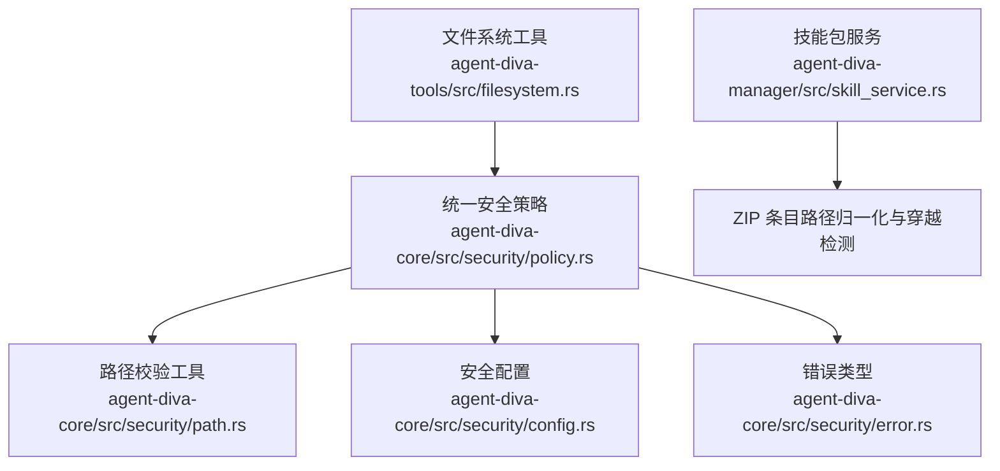
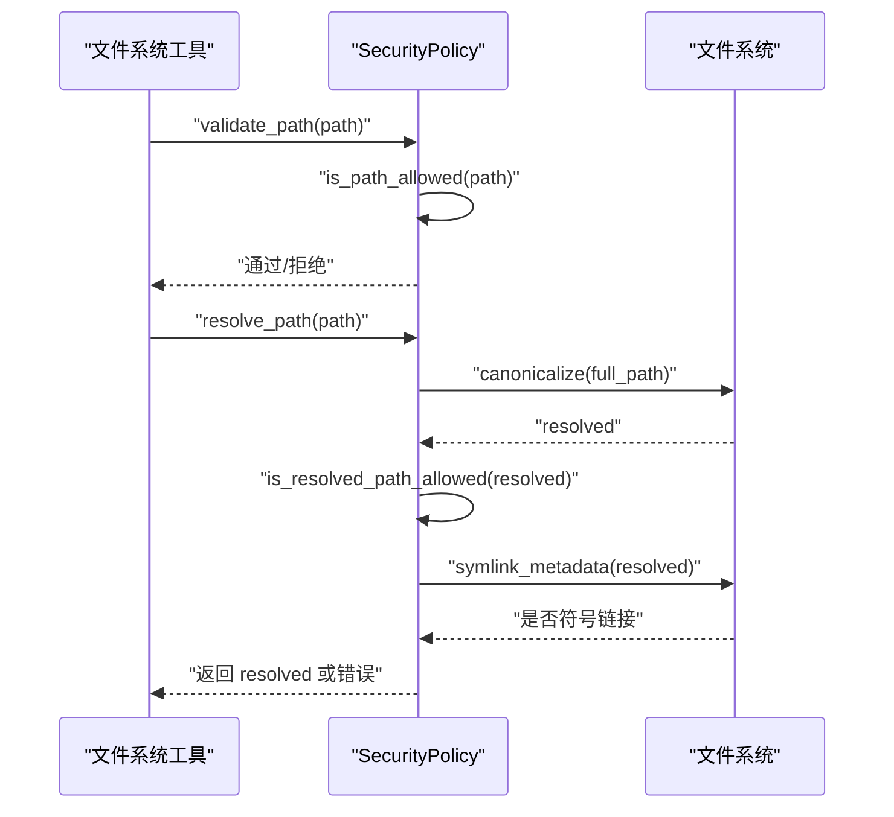
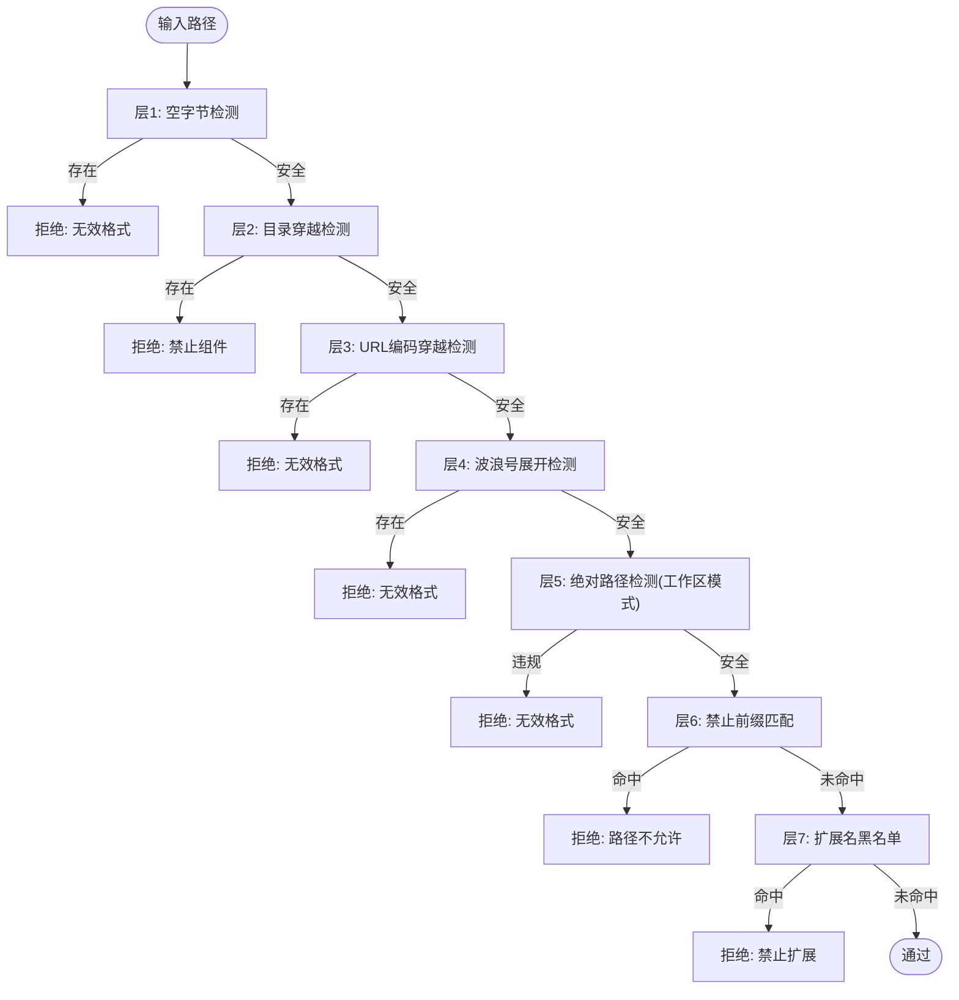
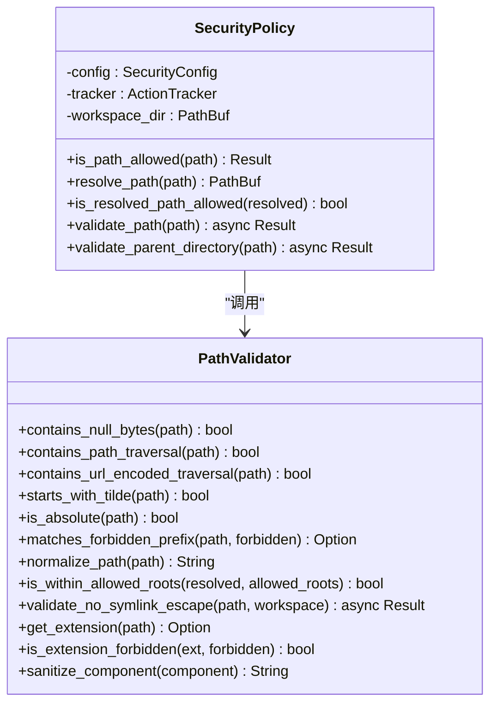
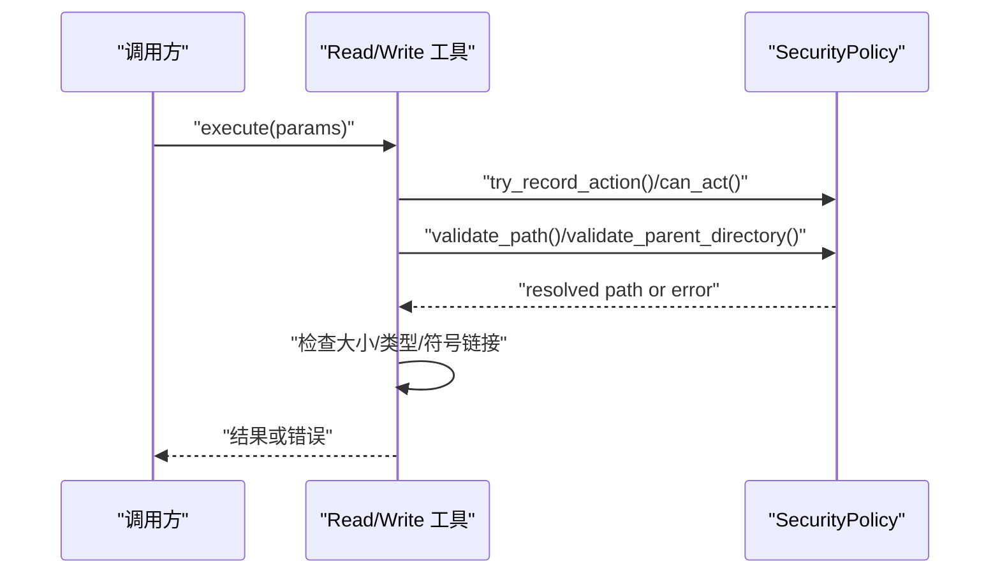
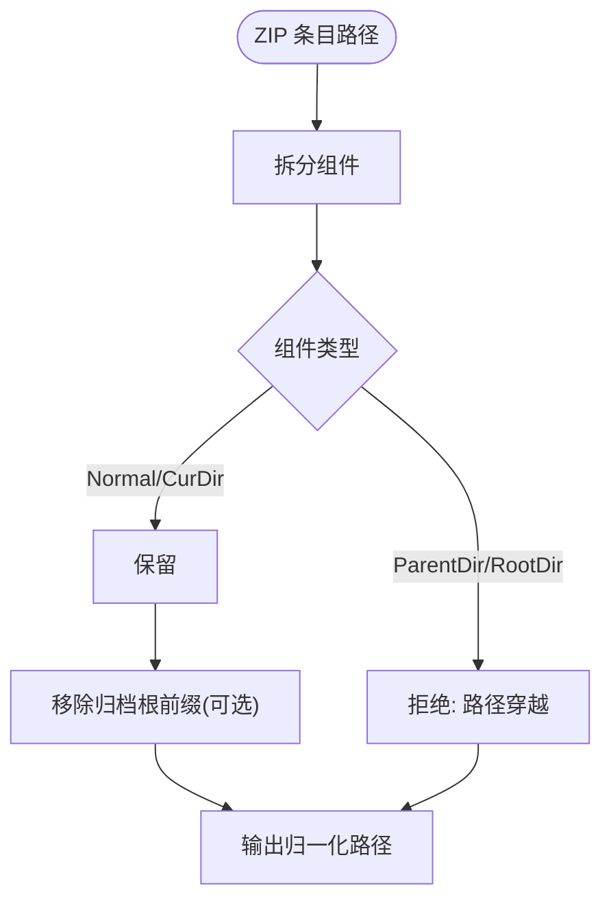
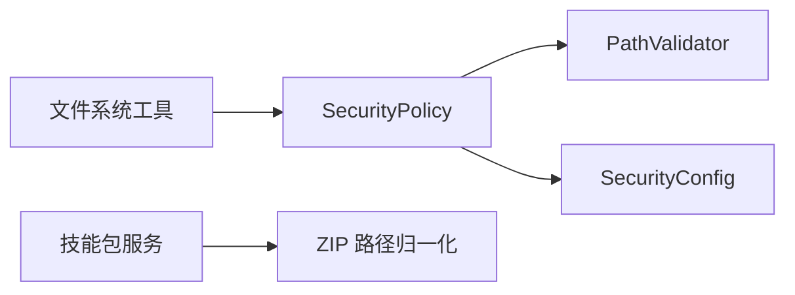

# 路径验证

<cite>
**本文引用的文件**
- [agent-diva-core/src/security/path.rs](file://agent-diva-core/src/security/path.rs)
- [agent-diva-core/src/security/policy.rs](file://agent-diva-core/src/security/policy.rs)
- [agent-diva-core/src/security/config.rs](file://agent-diva-core/src/security/config.rs)
- [agent-diva-core/src/security/error.rs](file://agent-diva-core/src/security/error.rs)
- [agent-diva-tools/src/filesystem.rs](file://agent-diva-tools/src/filesystem.rs)
- [agent-diva-manager/src/skill_service.rs](file://agent-diva-manager/src/skill_service.rs)
</cite>

## 目录
1. [简介](#简介)
2. [项目结构](#项目结构)
3. [核心组件](#核心组件)
4. [架构总览](#架构总览)
5. [详细组件分析](#详细组件分析)
6. [依赖关系分析](#依赖关系分析)
7. [性能考虑](#性能考虑)
8. [故障排查指南](#故障排查指南)
9. [结论](#结论)
10. [附录](#附录)

## 简介
本文件面向 Agent Diva 的路径验证系统，聚焦 PathValidator 的实现机制与集成方式，覆盖路径规范化、目录遍历防护、权限检查、工作区路径验证、技能包路径检查、文件访问控制、白名单/黑名单规则、异常处理策略、配置选项与安全边界，以及常见路径攻击的防护方案。文档以代码为依据，提供可追溯的源码引用与可视化图示，帮助读者理解并安全使用路径验证能力。

## 项目结构
路径验证的核心位于 agent-diva-core 的安全子系统，围绕以下模块组织：
- 路径校验工具：PathValidator（纯函数式工具）
- 统一安全策略：SecurityPolicy（编排校验流程、速率限制、工作区边界）
- 安全配置：SecurityConfig（级别预设、白名单/黑名单、大小限制、符号链接策略等）
- 错误类型：SecurityError（统一的错误语义与用户消息）
- 工具层集成：filesystem 工具在读写操作前调用 SecurityPolicy.validate_path / validate_parent_directory
- 技能包服务：skill_service 对 ZIP 条目进行路径归一化与穿越检测

**图表来源**
- [agent-diva-tools/src/filesystem.rs:80-120](file://agent-diva-tools/src/filesystem.rs#L80-L120)
- [agent-diva-core/src/security/policy.rs:74-201](file://agent-diva-core/src/security/policy.rs#L74-L201)
- [agent-diva-core/src/security/path.rs:8-149](file://agent-diva-core/src/security/path.rs#L8-L149)
- [agent-diva-core/src/security/config.rs:51-178](file://agent-diva-core/src/security/config.rs#L51-L178)
- [agent-diva-core/src/security/error.rs:8-61](file://agent-diva-core/src/security/error.rs#L8-L61)
- [agent-diva-manager/src/skill_service.rs:300-318](file://agent-diva-manager/src/skill_service.rs#L300-L318)

**章节来源**
- [agent-diva-core/src/security/path.rs:1-210](file://agent-diva-core/src/security/path.rs#L1-L210)
- [agent-diva-core/src/security/policy.rs:1-364](file://agent-diva-core/src/security/policy.rs#L1-L364)
- [agent-diva-core/src/security/config.rs:1-472](file://agent-diva-core/src/security/config.rs#L1-L472)
- [agent-diva-core/src/security/error.rs:1-163](file://agent-diva-core/src/security/error.rs#L1-L163)
- [agent-diva-tools/src/filesystem.rs:80-279](file://agent-diva-tools/src/filesystem.rs#L80-L279)
- [agent-diva-manager/src/skill_service.rs:300-454](file://agent-diva-manager/src/skill_service.rs#L300-L454)

## 核心组件
- PathValidator：提供无副作用的路径安全检查原语，包括空字节、目录穿越、URL 编码穿越、波浪号展开、绝对路径判断、禁止前缀匹配、扩展名黑名单、路径规范化与允许根范围检查、符号链接逃逸检测等。
- SecurityPolicy：将配置、路径校验、速率限制与工作区边界整合为统一入口，提供 is_path_allowed、resolve_path、validate_path、validate_parent_directory、is_resolved_path_allowed 等方法。
- SecurityConfig：定义安全级别、工作区限制、禁止路径/扩展名、最大文件大小、符号链接策略、PII/注入检测开关与阈值、全局工具超时、令牌预算等。
- SecurityError：统一错误模型，包含路径不允许、越界、受限组件、速率限制、只读模式、符号链接限制、格式非法、文件过大、扩展名禁止、PII/注入检测等，并提供用户友好消息与重试性判断。

**章节来源**
- [agent-diva-core/src/security/path.rs:8-149](file://agent-diva-core/src/security/path.rs#L8-L149)
- [agent-diva-core/src/security/policy.rs:14-288](file://agent-diva-core/src/security/policy.rs#L14-L288)
- [agent-diva-core/src/security/config.rs:11-178](file://agent-diva-core/src/security/config.rs#L11-L178)
- [agent-diva-core/src/security/error.rs:8-117](file://agent-diva-core/src/security/error.rs#L8-L117)

## 架构总览
路径验证采用“前置静态检查 + 解析后动态校验”的分层架构：
- 前置静态检查（is_path_allowed）：在不触碰文件系统的前提下，快速拒绝明显恶意输入（空字节、穿越、URL 编码穿越、波浪号、绝对路径限制、禁止前缀、禁止扩展）。
- 路径解析与规范化（resolve_path + canonicalize）：将相对路径解析到工作区或保留绝对路径，随后尝试规范化以消除 .. 和符号链接歧义。
- 工作区边界检查（is_resolved_path_allowed）：确保最终路径在工作区内或允许的额外根中。
- 符号链接策略：根据配置决定是否允许符号链接，并在写入前再次检查目标是否为符号链接。
- 父目录创建与 TOCTOU 安全：写操作先创建父目录，再规范化父目录并校验其在工作区内，避免竞态条件。

**图表来源**
- [agent-diva-tools/src/filesystem.rs:80-120](file://agent-diva-tools/src/filesystem.rs#L80-L120)
- [agent-diva-core/src/security/policy.rs:172-201](file://agent-diva-core/src/security/policy.rs#L172-L201)
- [agent-diva-core/src/security/path.rs:62-84](file://agent-diva-core/src/security/path.rs#L62-L84)

**章节来源**
- [agent-diva-core/src/security/policy.rs:74-233](file://agent-diva-core/src/security/policy.rs#L74-L233)
- [agent-diva-core/src/security/path.rs:62-123](file://agent-diva-core/src/security/path.rs#L62-L123)

## 详细组件分析

### PathValidator：八层路径校验原语
- 层1：空字节检测，防止截断与注入。
- 层2：目录穿越检测，基于路径组件识别 ParentDir。
- 层3：URL 编码穿越检测，覆盖 ..%2f、%2f..、..%5c、%5c.. 等变体。
- 层4：波浪号展开检测，拒绝 ~user 形式。
- 层5：绝对路径检测，配合工作区模式限制。
- 层6：禁止前缀匹配，支持跨平台路径归一化比较。
- 层7：扩展名黑名单，忽略大小写与点号差异。
- 层8：允许根范围检查，结合 canonicalize 做稳健的前缀匹配；并提供符号链接逃逸检测，遍历父链并校验解析结果是否仍在工作区。

**图表来源**
- [agent-diva-core/src/security/path.rs:8-149](file://agent-diva-core/src/security/path.rs#L8-L149)
- [agent-diva-core/src/security/policy.rs:84-137](file://agent-diva-core/src/security/policy.rs#L84-L137)

**章节来源**
- [agent-diva-core/src/security/path.rs:8-149](file://agent-diva-core/src/security/path.rs#L8-L149)

### SecurityPolicy：统一路径验证与边界控制
- is_path_allowed：串联层1-7，快速拒绝恶意输入。
- resolve_path：相对路径拼接工作区，绝对路径保持原样。
- is_resolved_path_allowed：规范化后检查是否在工作区或允许根内。
- validate_path：完整流程，包含基本校验、解析、规范化、工作区边界、符号链接策略。
- validate_parent_directory：写操作的 TOCTOU 安全父目录校验，创建后规范化并检查。

**图表来源**
- [agent-diva-core/src/security/policy.rs:14-288](file://agent-diva-core/src/security/policy.rs#L14-L288)
- [agent-diva-core/src/security/path.rs:8-149](file://agent-diva-core/src/security/path.rs#L8-L149)

**章节来源**
- [agent-diva-core/src/security/policy.rs:74-233](file://agent-diva-core/src/security/policy.rs#L74-L233)

### SecurityConfig：配置项与安全边界
- 安全级别：Permissive、Standard、Strict、Paranoid，影响默认工作区限制、速率上限、只读模式。
- 工作区限制：workspace_only 控制是否仅允许工作区内路径。
- 禁止列表：forbidden_paths、forbidden_extensions。
- 允许根：allowed_roots，用于在白名单模式下允许特定外部目录。
- 文件大小：max_file_size 限制读取/写入大小。
- 符号链接：allow_symlinks 控制是否允许符号链接。
- PII/注入检测：开关与阈值。
- 其他：全局工具超时、令牌预算、拒绝断路器窗口与阈值。

**章节来源**
- [agent-diva-core/src/security/config.rs:11-178](file://agent-diva-core/src/security/config.rs#L11-L178)

### 工具层集成：文件访问控制
- ReadFileTool：在执行前调用 try_record_action 与 validate_path，随后检查元数据与文件大小，按偏移/限制流式读取或整体读取，并进行内容清理与截断。
- WriteFileTool：执行 can_act，is_path_allowed，resolve_path，validate_parent_directory（TOCTOU 安全），再检查目标是否为符号链接，最后写入。
- EditFileTool：类似流程，确保编辑操作受相同安全约束。

**图表来源**
- [agent-diva-tools/src/filesystem.rs:80-279](file://agent-diva-tools/src/filesystem.rs#L80-L279)
- [agent-diva-core/src/security/policy.rs:172-233](file://agent-diva-core/src/security/policy.rs#L172-L233)

**章节来源**
- [agent-diva-tools/src/filesystem.rs:80-279](file://agent-diva-tools/src/filesystem.rs#L80-L279)

### 技能包路径检查：ZIP 条目归一化与穿越防护
- normalize_archive_path：逐组件过滤，仅允许 Normal 与 CurDir 组件，拒绝 ParentDir 与 RootDir，从而防止 ZIP 条目中的 ../ 逃逸。
- 安装与上传：对 SKILL.md 的存在性与最小长度进行检查，拒绝历史目录伪造与穿越条目。

**图表来源**
- [agent-diva-manager/src/skill_service.rs:300-318](file://agent-diva-manager/src/skill_service.rs#L300-L318)

**章节来源**
- [agent-diva-manager/src/skill_service.rs:300-454](file://agent-diva-manager/src/skill_service.rs#L300-L454)

## 依赖关系分析
- SecurityPolicy 依赖 PathValidator 提供的原子校验方法，组合成完整的验证流水线。
- SecurityPolicy 依赖 SecurityConfig 决定行为策略（工作区限制、禁止列表、符号链接策略、文件大小限制等）。
- 工具层（filesystem）依赖 SecurityPolicy 作为唯一入口，确保所有文件操作都经过统一安全校验。
- 技能包服务独立于 core 安全策略，但遵循相同的“拒绝穿越”原则，通过组件级过滤实现强约束。

**图表来源**
- [agent-diva-tools/src/filesystem.rs:80-279](file://agent-diva-tools/src/filesystem.rs#L80-L279)
- [agent-diva-core/src/security/policy.rs:74-233](file://agent-diva-core/src/security/policy.rs#L74-L233)
- [agent-diva-core/src/security/path.rs:8-149](file://agent-diva-core/src/security/path.rs#L8-L149)
- [agent-diva-core/src/security/config.rs:51-178](file://agent-diva-core/src/security/config.rs#L51-L178)
- [agent-diva-manager/src/skill_service.rs:300-318](file://agent-diva-manager/src/skill_service.rs#L300-L318)

**章节来源**
- [agent-diva-core/src/security/policy.rs:74-233](file://agent-diva-core/src/security/policy.rs#L74-L233)
- [agent-diva-core/src/security/path.rs:8-149](file://agent-diva-core/src/security/path.rs#L8-L149)
- [agent-diva-core/src/security/config.rs:51-178](file://agent-diva-core/src/security/config.rs#L51-L178)
- [agent-diva-tools/src/filesystem.rs:80-279](file://agent-diva-tools/src/filesystem.rs#L80-L279)
- [agent-diva-manager/src/skill_service.rs:300-318](file://agent-diva-manager/src/skill_service.rs#L300-L318)

## 性能考虑
- 前置静态检查优先：is_path_allowed 在 I/O 之前完成大部分危险输入的快速拒绝，减少不必要的文件系统访问。
- 规范化与 canonicalize：仅在必要时调用，且对不存在的路径回退到原始路径，避免阻塞写操作。
- 父目录创建与规范化：write 路径在创建后立刻规范化父目录，确保后续校验准确，同时避免竞态。
- 符号链接检查：按需调用 symlink_metadata，避免全量扫描。
- 速率限制：ActionTracker 维护滑动窗口计数，防止高频文件操作导致资源耗尽。
- 文件大小限制：在读取前检查元数据大小，结合流式读取降低内存占用。

[本节为通用性能指导，不直接分析具体文件]

## 故障排查指南
- 路径不允许：检查 forbidden_paths 与 forbidden_extensions 配置，确认路径不在禁止列表中。
- 路径逃逸工作区：确认 workspace_only 开启时，路径解析后确实在工作区或 allowed_roots 中。
- 符号链接不允许：若 allow_symlinks 关闭，确保目标不是符号链接。
- 速率限制超限：调整 max_actions_per_hour 或等待窗口滑过。
- 只读模式：Paranoid 级别或 read_only=true 会阻止写操作。
- 文件过大：调整 max_file_size 或分块读取。
- 技能包上传失败：检查 ZIP 条目是否包含 ParentDir，确保 SKILL.md 存在且满足最小字符数。

**章节来源**
- [agent-diva-core/src/security/error.rs:8-117](file://agent-diva-core/src/security/error.rs#L8-L117)
- [agent-diva-core/src/security/config.rs:142-178](file://agent-diva-core/src/security/config.rs#L142-L178)
- [agent-diva-manager/src/skill_service.rs:300-454](file://agent-diva-manager/src/skill_service.rs#L300-L454)

## 结论
Agent Diva 的路径验证系统通过分层校验、严格的工作区边界控制、细粒度的白名单/黑名单配置与健壮的异常处理，有效防御目录穿越、符号链接逃逸、非法扩展名与越界访问等风险。工具层统一接入 SecurityPolicy，确保所有文件操作均受一致安全策略约束；技能包服务通过组件级过滤进一步加固 ZIP 解压场景的安全性。建议在生产环境启用 Standard/Strict/Paranoid 级别，合理配置 forbidden_paths/forbidden_extensions/allowed_roots，并结合速率限制与文件大小限制保障系统稳定性。

[本节为总结性内容，不直接分析具体文件]

## 附录

### 配置选项速览
- 安全级别：Permissive、Standard、Strict、Paranoid
- 工作区限制：workspace_only
- 禁止列表：forbidden_paths、forbidden_extensions
- 允许根：allowed_roots
- 文件大小：max_file_size
- 符号链接：allow_symlinks
- PII/注入检测：pii_enabled、injection_enabled、injection_block_threshold
- 其他：global_tool_timeout_secs、token_budget_limit、per_task_token_budget、rejection_circuit_window_secs、rejection_circuit_threshold

**章节来源**
- [agent-diva-core/src/security/config.rs:11-178](file://agent-diva-core/src/security/config.rs#L11-L178)

### 常见路径攻击与防护
- 目录穿越（../）：层2检测与技能包组件过滤双重防护。
- URL 编码穿越（..%2f、%2f..、..%5c、%5c..）：层3检测。
- 符号链接逃逸：层8与 validate_no_symlink_escape 遍历父链校验。
- 绝对路径逃逸：工作区模式与 is_resolved_path_allowed 限制。
- 禁止前缀/扩展名：层6/层7与配置驱动。
- 空字节注入：层1检测。
- 波浪号展开：层4检测。

**章节来源**
- [agent-diva-core/src/security/path.rs:8-149](file://agent-diva-core/src/security/path.rs#L8-L149)
- [agent-diva-core/src/security/policy.rs:84-201](file://agent-diva-core/src/security/policy.rs#L84-L201)
- [agent-diva-manager/src/skill_service.rs:300-318](file://agent-diva-manager/src/skill_service.rs#L300-L318)