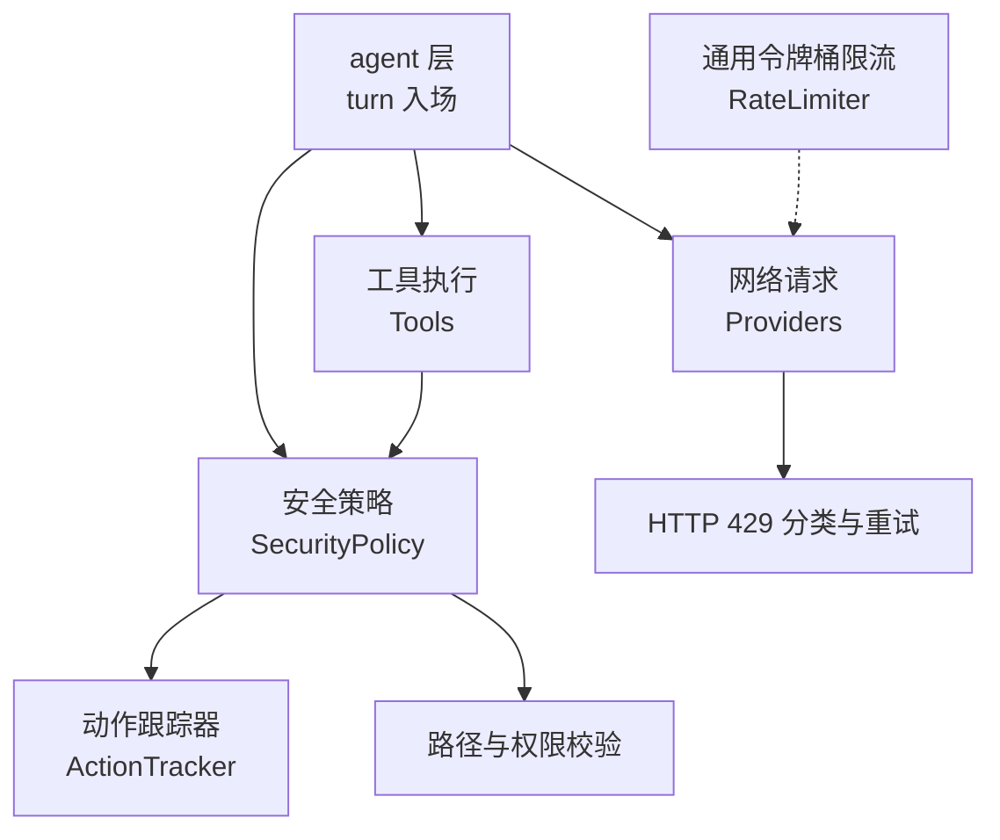
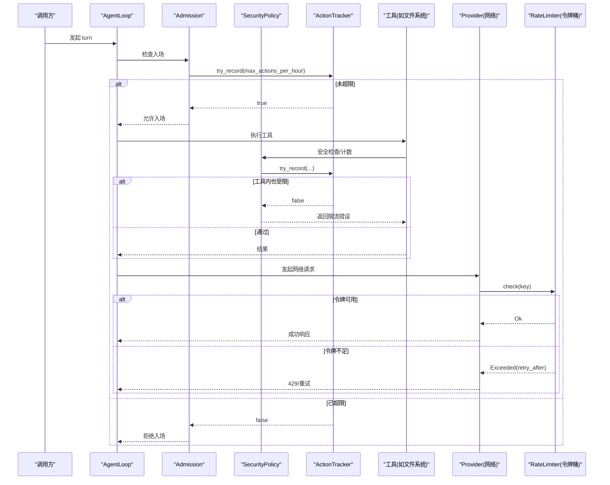
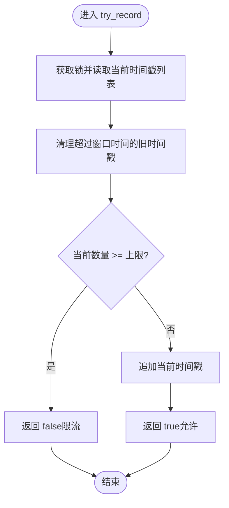
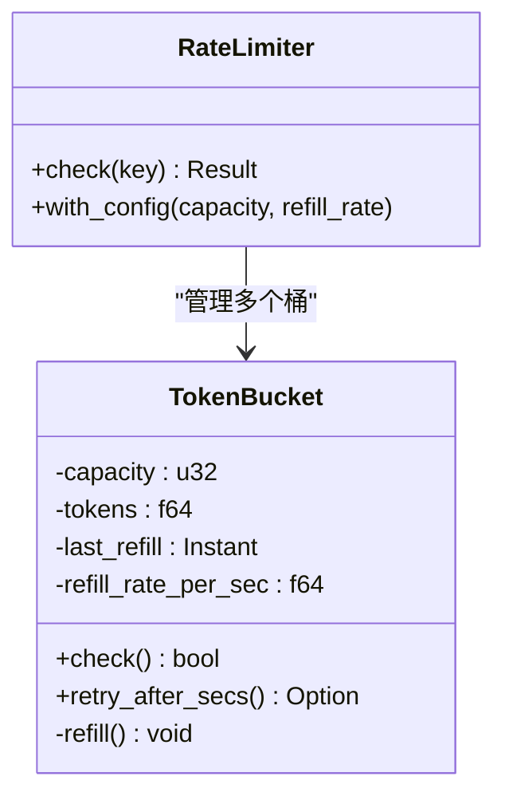
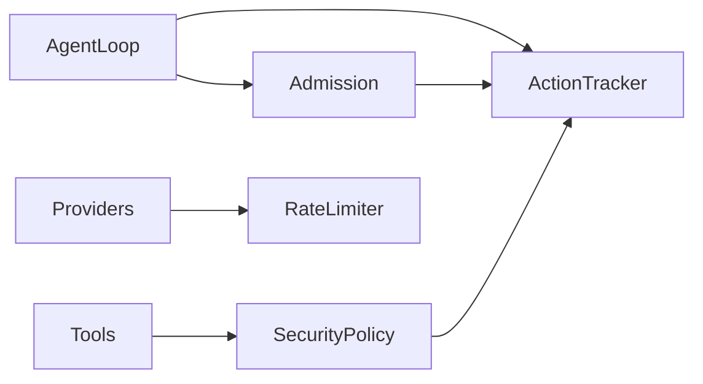

# 速率限制

<cite>
**本文引用的文件**
- [agent-diva-core/src/security/rate_limit.rs](file://agent-diva-core/src/security/rate_limit.rs)
- [agent-diva-core/src/security/policy.rs](file://agent-diva-core/src/security/policy.rs)
- [agent-diva-core/src/security/config.rs](file://agent-diva-core/src/security/config.rs)
- [agent-diva-core/src/security/error.rs](file://agent-diva-core/src/security/error.rs)
- [agent-diva-core/src/rate_limiter.rs](file://agent-diva-core/src/rate_limiter.rs)
- [agent-diva-agent/src/agent_loop.rs](file://agent-diva-agent/src/agent_loop.rs)
- [agent-diva-agent/src/agent_loop/turn/admission.rs](file://agent-diva-agent/src/agent_loop/turn/admission.rs)
- [agent-diva-tools/src/filesystem.rs](file://agent-diva-tools/src/filesystem.rs)
- [agent-diva-providers/src/retry.rs](file://agent-diva-providers/src/retry.rs)
</cite>

## 目录
1. [简介](#简介)
2. [项目结构](#项目结构)
3. [核心组件](#核心组件)
4. [架构总览](#架构总览)
5. [详细组件分析](#详细组件分析)
6. [依赖关系分析](#依赖关系分析)
7. [性能考量](#性能考量)
8. [故障排查指南](#故障排查指南)
9. [结论](#结论)
10. [附录](#附录)

## 简介
本文件面向 Agent Diva 的速率限制系统，重点阐述 ActionTracker 的实现机制与在 turn 入场、工具调用、网络请求等场景中的使用方式。文档覆盖以下方面：
- 请求频率控制：滑动窗口计数与令牌桶两种策略
- 资源访问限制：安全策略与安全级别对动作上限的影响
- 并发控制：线程安全与异步限流
- 配置选项与限制策略：安全级别预设、max_actions_per_hour、令牌桶容量与填充率
- 超限处理：错误类型、可重试判定、重试退避
- 监控指标与告警：可观测性建议与日志要点
- 性能优化建议：内存占用、锁粒度、回填计算
- 配置示例与故障排查：从默认到严格模式的调优路径

## 项目结构
Agent Diva 的速率限制能力由 core 层提供基础原语（ActionTracker、RateLimiter），由 agent 层在 turn 入场时进行进程级限流，由 tools 层在工具执行前进行安全策略校验与动作计数，由 providers 层在网络请求失败时进行 429 分类与指数退避重试。

图表来源
- [agent-diva-agent/src/agent_loop.rs:120-153](file://agent-diva-agent/src/agent_loop.rs#L120-L153)
- [agent-diva-core/src/security/policy.rs:14-51](file://agent-diva-core/src/security/policy.rs#L14-L51)
- [agent-diva-core/src/security/rate_limit.rs:6-13](file://agent-diva-core/src/security/rate_limit.rs#L6-L13)
- [agent-diva-core/src/rate_limiter.rs:125-165](file://agent-diva-core/src/rate_limiter.rs#L125-L165)
- [agent-diva-providers/src/retry.rs:49-75](file://agent-diva-providers/src/retry.rs#L49-L75)

章节来源
- [agent-diva-agent/src/agent_loop.rs:120-153](file://agent-diva-agent/src/agent_loop.rs#L120-L153)
- [agent-diva-core/src/security/policy.rs:14-51](file://agent-diva-core/src/security/policy.rs#L14-L51)
- [agent-diva-core/src/security/rate_limit.rs:6-13](file://agent-diva-core/src/security/rate_limit.rs#L6-L13)
- [agent-diva-core/src/rate_limiter.rs:125-165](file://agent-diva-core/src/rate_limiter.rs#L125-L165)
- [agent-diva-providers/src/retry.rs:49-75](file://agent-diva-providers/src/retry.rs#L49-L75)

## 核心组件
- ActionTracker：基于滑动窗口的进程级动作计数器，用于 turn 入场与工具调用前的“每小时最大动作数”限制。支持记录、查询、尝试记录与清理过期时间戳。
- SecurityPolicy：统一的安全策略，整合配置、路径校验与动作计数；对外暴露 try_record_action 等接口供工具调用。
- RateLimiter：基于令牌桶的 per-key 异步限流器，适用于 provider 或模型维度的请求节流，支持容量、填充率与 retry_after 计算。
- SecurityError：限流相关错误类型，包含 RateLimitExceeded 与 ActionBudgetExhausted，并定义 is_retryable 语义。
- Providers 重试：将 HTTP 429 识别为 RateLimited，结合指数退避与抖动实现稳健重试。

章节来源
- [agent-diva-core/src/security/rate_limit.rs:6-84](file://agent-diva-core/src/security/rate_limit.rs#L6-L84)
- [agent-diva-core/src/security/policy.rs:14-51](file://agent-diva-core/src/security/policy.rs#L14-L51)
- [agent-diva-core/src/rate_limiter.rs:19-165](file://agent-diva-core/src/rate_limiter.rs#L19-L165)
- [agent-diva-core/src/security/error.rs:23-33](file://agent-diva-core/src/security/error.rs#L23-L33)
- [agent-diva-providers/src/retry.rs:49-75](file://agent-diva-providers/src/retry.rs#L49-L75)

## 架构总览
下图展示一次 turn 从入厂到工具执行、再到网络请求的完整限流链路。

图表来源
- [agent-diva-agent/src/agent_loop.rs:120-153](file://agent-diva-agent/src/agent_loop.rs#L120-L153)
- [agent-diva-agent/src/agent_loop/turn/admission.rs:96-103](file://agent-diva-agent/src/agent_loop/turn/admission.rs#L96-L103)
- [agent-diva-core/src/security/policy.rs:14-51](file://agent-diva-core/src/security/policy.rs#L14-L51)
- [agent-diva-core/src/security/rate_limit.rs:32-63](file://agent-diva-core/src/security/rate_limit.rs#L32-L63)
- [agent-diva-core/src/rate_limiter.rs:148-165](file://agent-diva-core/src/rate_limiter.rs#L148-L165)
- [agent-diva-providers/src/retry.rs:49-75](file://agent-diva-providers/src/retry.rs#L49-L75)

## 详细组件分析

### ActionTracker 滑动窗口限流
- 设计要点
  - 以 Vec<Instant> 记录窗口内的动作时间戳，按 window_secs 清理过期项。
  - 提供 record/count/is_rate_limited/try_record/reset 等方法。
  - 使用 parking_lot::Mutex 保证并发安全，支持 Clone。
- 复杂度
  - 每次操作需清理过期项，最坏 O(n)，n 为窗口内动作数。
  - 空间复杂度 O(n)。
- 适用场景
  - 进程级 turn 入场限流（每小时最大动作数）。
  - 工具调用前的安全策略计数。
- 关键流程

图表来源
- [agent-diva-core/src/security/rate_limit.rs:52-72](file://agent-diva-core/src/security/rate_limit.rs#L52-L72)

章节来源
- [agent-diva-core/src/security/rate_limit.rs:6-84](file://agent-diva-core/src/security/rate_limit.rs#L6-L84)

### SecurityPolicy 安全策略与动作计数
- 职责
  - 聚合 SecurityConfig、ActionTracker、PathValidator。
  - 提供路径校验、工作区隔离、只读模式判断。
  - 暴露 try_record_action 等接口，驱动 ActionTracker 计数。
- 与限流的耦合
  - 工具在执行前调用策略进行安全检查与动作计数。
  - 若达到 max_actions_per_hour，则返回限流错误。
- 典型调用点
  - 文件系统工具在执行读写前进行策略校验与计数。

章节来源
- [agent-diva-core/src/security/policy.rs:14-51](file://agent-diva-core/src/security/policy.rs#L14-L51)
- [agent-diva-tools/src/filesystem.rs:652-687](file://agent-diva-tools/src/filesystem.rs#L652-L687)

### 令牌桶 RateLimiter（per-key 异步限流）
- 设计要点
  - 每个 key 对应一个 TokenBucket，维护 capacity、tokens、last_refill、refill_rate_per_sec。
  - check 方法先回填再扣减，返回 Result<(), RateLimitError>。
  - 支持 retry_after_secs 计算，便于上层退避。
- 复杂度
  - 单次 check 摊销 O(1)，HashMap 查找均摊 O(1)。
- 适用场景
  - Provider 或模型维度的请求节流，避免突发流量打满下游。
- 关键流程

图表来源
- [agent-diva-core/src/rate_limiter.rs:31-84](file://agent-diva-core/src/rate_limiter.rs#L31-L84)
- [agent-diva-core/src/rate_limiter.rs:125-165](file://agent-diva-core/src/rate_limiter.rs#L125-L165)

章节来源
- [agent-diva-core/src/rate_limiter.rs:19-165](file://agent-diva-core/src/rate_limiter.rs#L19-L165)

### Turn 入场限流（admission）
- 行为
  - 在 turn 入场阶段检查进程级滑动窗口是否耗尽（max_actions_per_hour）。
  - 若耗尽，直接拒绝新 turn 入场，快速失败。
- 集成点
  - AgentLoop 持有 turn_rate_limiter（ActionTracker）与阈值。
  - admission 模块在入口处调用 try_record。

章节来源
- [agent-diva-agent/src/agent_loop.rs:120-153](file://agent-diva-agent/src/agent_loop.rs#L120-L153)
- [agent-diva-agent/src/agent_loop/turn/admission.rs:96-103](file://agent-diva-agent/src/agent_loop/turn/admission.rs#L96-L103)

### 工具调用限流（以文件系统为例）
- 行为
  - 工具在执行前通过 SecurityPolicy 进行路径校验与动作计数。
  - 当达到 max_actions_per_hour，返回限流相关错误信息。
- 测试覆盖
  - 验证在设置较小阈值后，第三次调用被限流。

章节来源
- [agent-diva-tools/src/filesystem.rs:652-687](file://agent-diva-tools/src/filesystem.rs#L652-L687)
- [agent-diva-core/src/security/policy.rs:14-51](file://agent-diva-core/src/security/policy.rs#L14-L51)

### 网络请求限流与重试（Provider）
- 行为
  - 将 HTTP 429 识别为 RateLimited，结合指数退避与抖动进行重试。
  - 可与 RateLimiter 配合，实现 per-provider/per-model 的平滑节流。
- 关键点
  - classify_response_status 对状态码进行分类。
  - backoff_delay 提供带抖动的指数退避。

章节来源
- [agent-diva-providers/src/retry.rs:49-75](file://agent-diva-providers/src/retry.rs#L49-L75)
- [agent-diva-core/src/rate_limiter.rs:148-165](file://agent-diva-core/src/rate_limiter.rs#L148-L165)

## 依赖关系分析
- AgentLoop 依赖 ActionTracker 进行 turn 入场限流。
- SecurityPolicy 组合 ActionTracker 与 PathValidator，统一对外提供安全与限流能力。
- Tools 通过 SecurityPolicy 进行动作计数与路径校验。
- Providers 通过 RateLimiter 与重试逻辑进行网络请求节流与恢复。

图表来源
- [agent-diva-agent/src/agent_loop.rs:120-153](file://agent-diva-agent/src/agent_loop.rs#L120-L153)
- [agent-diva-core/src/security/policy.rs:14-51](file://agent-diva-core/src/security/policy.rs#L14-L51)
- [agent-diva-core/src/security/rate_limit.rs:6-13](file://agent-diva-core/src/security/rate_limit.rs#L6-L13)
- [agent-diva-core/src/rate_limiter.rs:125-165](file://agent-diva-core/src/rate_limiter.rs#L125-L165)

章节来源
- [agent-diva-agent/src/agent_loop.rs:120-153](file://agent-diva-agent/src/agent_loop.rs#L120-L153)
- [agent-diva-core/src/security/policy.rs:14-51](file://agent-diva-core/src/security/policy.rs#L14-L51)
- [agent-diva-core/src/security/rate_limit.rs:6-13](file://agent-diva-core/src/security/rate_limit.rs#L6-L13)
- [agent-diva-core/src/rate_limiter.rs:125-165](file://agent-diva-core/src/rate_limiter.rs#L125-L165)

## 性能考量
- 滑动窗口清理
  - 每次操作都会清理过期时间戳，建议在高频场景下评估窗口大小与动作密度，必要时可引入惰性清理或分片存储以降低 O(n) 开销。
- 锁粒度
  - ActionTracker 使用 Mutex 保护时间戳列表，尽量将计数与业务逻辑解耦，减少持锁时间。
- 令牌桶回填
  - 回填计算采用增量方式，注意浮点精度与边界条件（零填充率、超长 elapsed）。
- 内存占用
  - 高吞吐场景下，滑动窗口可能累积大量时间戳，应定期 reset 或调整 window_secs。
- 并发与异步
  - RateLimiter 使用 tokio::sync::Mutex，适合异步任务；ActionTracker 使用同步锁，适合短临界区。

[本节为通用指导，不直接分析具体文件]

## 故障排查指南
- 现象：频繁出现“Too many file operations”或“Rate limit exceeded”
  - 检查 SecurityLevel 与 max_actions_per_hour 配置是否过严。
  - 确认是否在工具层重复计数导致提前触发。
- 现象：Provider 返回 429
  - 查看重试逻辑是否正确识别 429，并应用指数退避。
  - 考虑为不同 provider/model 配置独立的 RateLimiter key。
- 现象：turn 入场被拒绝
  - 检查 admission 分支是否因 max_actions_per_hour 耗尽而拒绝。
  - 适当提高阈值或降低单位时间内 turn 数量。
- 定位手段
  - 关注限流错误类型与消息，区分 SecurityError 与 ProviderError。
  - 结合日志输出（如重试次数、retry_after）定位瓶颈。

章节来源
- [agent-diva-core/src/security/error.rs:23-33](file://agent-diva-core/src/security/error.rs#L23-L33)
- [agent-diva-core/src/security/error.rs:76-84](file://agent-diva-core/src/security/error.rs#L76-L84)
- [agent-diva-providers/src/retry.rs:49-75](file://agent-diva-providers/src/retry.rs#L49-L75)
- [agent-diva-agent/src/agent_loop/turn/admission.rs:96-103](file://agent-diva-agent/src/agent_loop/turn/admission.rs#L96-L103)

## 结论
Agent Diva 的速率限制体系以 ActionTracker 为核心，结合 SecurityPolicy 与 RateLimiter，实现了从 turn 入场、工具调用到网络请求的多层次限流。通过安全级别与配置项，可在开发、标准、严格与只读模式下灵活调节限流强度；通过令牌桶与指数退避，保障在高负载下的稳定性与可恢复性。建议在生产环境中结合监控与日志持续观察限流效果，并根据实际负载动态调优。

[本节为总结，不直接分析具体文件]

## 附录

### 配置选项与默认值
- 安全级别预设
  - Permissive：宽松，默认每小时动作上限较高
  - Standard：标准，默认每小时动作上限适中
  - Strict：严格，默认每小时动作上限较低
  - Paranoid：只读模式，禁止写操作
- 关键字段
  - max_actions_per_hour：每小时最大动作数，影响 ActionTracker 阈值
  - workspace_only：是否仅允许工作区内路径
  - read_only：是否启用只读模式
  - global_tool_timeout_secs：全局工具超时秒数
- 合并与验证
  - 支持从配置文件合并，并对非法值进行校验（如阈值为 0）

章节来源
- [agent-diva-core/src/security/config.rs:11-49](file://agent-diva-core/src/security/config.rs#L11-L49)
- [agent-diva-core/src/security/config.rs:233-273](file://agent-diva-core/src/security/config.rs#L233-L273)
- [agent-diva-core/src/security/config.rs:275-312](file://agent-diva-core/src/security/config.rs#L275-L312)

### 不同类型操作的速率限制规则
- 文件操作
  - 通过 SecurityPolicy 进行路径校验与动作计数，达到阈值即限流。
- 网络请求
  - Provider 层将 429 识别为 RateLimited，并结合 RateLimiter 与指数退避进行重试。
- 工具调用
  - 工具在执行前调用 SecurityPolicy 进行计数与校验，防止过度消耗。

章节来源
- [agent-diva-tools/src/filesystem.rs:652-687](file://agent-diva-tools/src/filesystem.rs#L652-L687)
- [agent-diva-providers/src/retry.rs:49-75](file://agent-diva-providers/src/retry.rs#L49-L75)
- [agent-diva-core/src/security/policy.rs:14-51](file://agent-diva-core/src/security/policy.rs#L14-L51)

### 监控指标与告警建议
- 指标
  - 每秒/每分钟动作数、限流触发次数、重试次数、retry_after 分布
- 告警
  - 当限流触发率超过阈值时告警，提示调整 max_actions_per_hour 或优化上游流量
  - Provider 429 比例异常升高时告警，提示下游服务压力或配额问题
- 日志
  - 记录 Admission 拒绝原因、工具限流错误、Provider 重试与退避参数

[本节为通用指导，不直接分析具体文件]

### 性能优化建议
- 合理设置滑动窗口大小与阈值，平衡准确性与性能
- 对高频路径引入惰性清理或分片存储，降低 O(n) 清理成本
- 为不同 provider/model 配置独立 RateLimiter key，避免相互干扰
- 监控内存占用，定期 reset 或回收历史数据

[本节为通用指导，不直接分析具体文件]

### 配置示例（说明性）
- 标准模式
  - level: standard
  - max_actions_per_hour: 100
  - workspace_only: true
- 严格模式
  - level: strict
  - max_actions_per_hour: 50
  - workspace_only: true
- 只读模式
  - level: paranoid
  - read_only: true
  - max_actions_per_hour: 20

章节来源
- [agent-diva-core/src/security/config.rs:11-49](file://agent-diva-core/src/security/config.rs#L11-L49)
- [agent-diva-core/src/security/config.rs:233-273](file://agent-diva-core/src/security/config.rs#L233-L273)