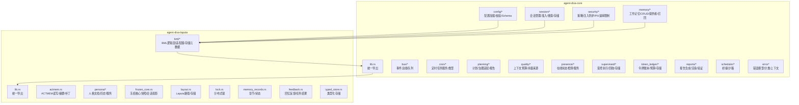
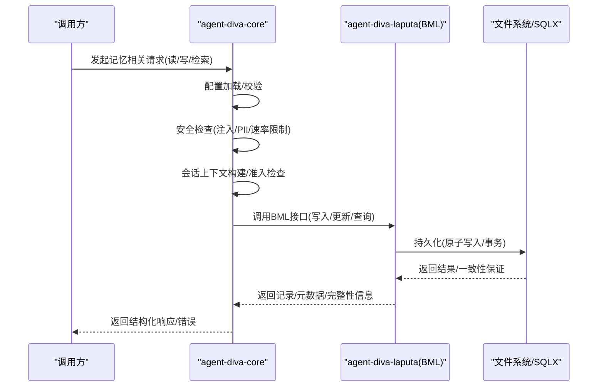
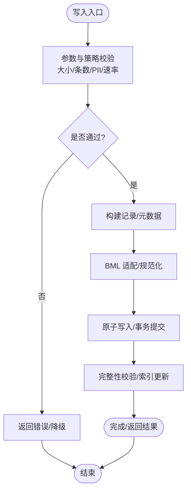
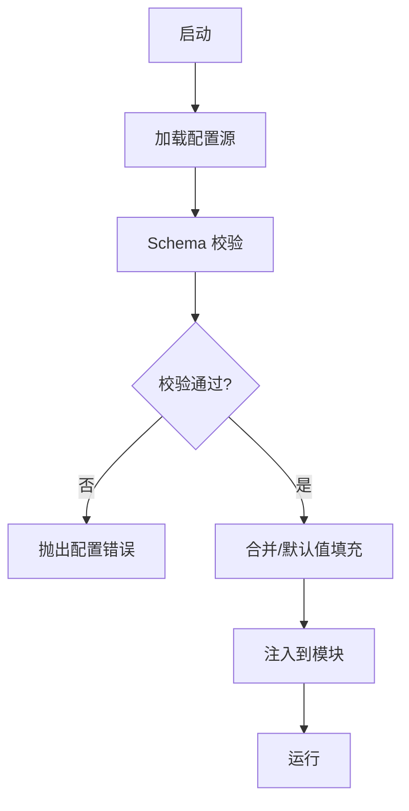
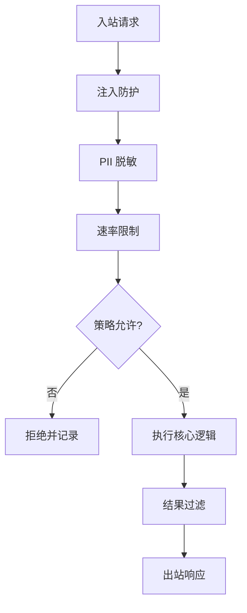
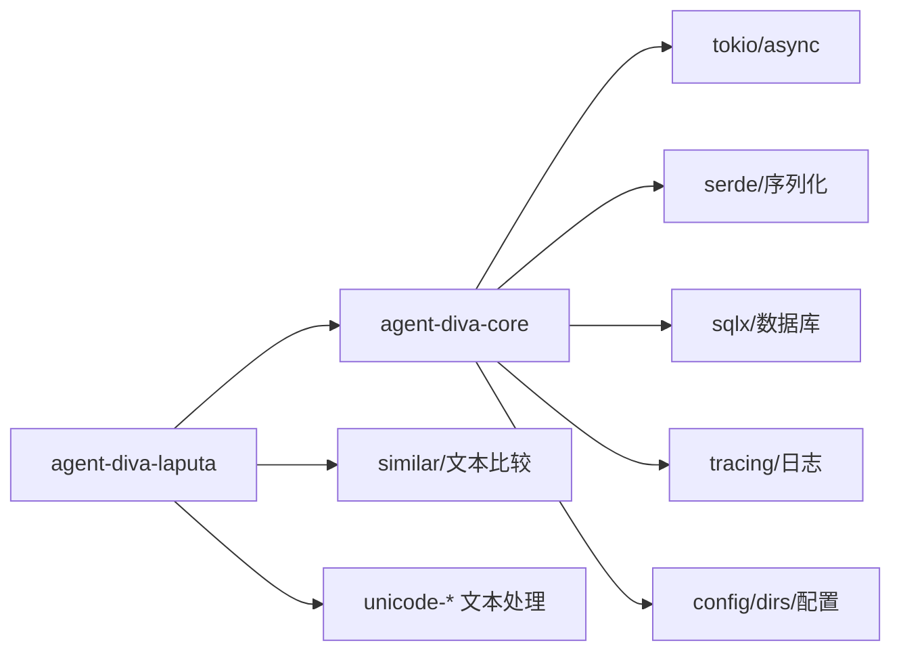

# 核心模块

<cite>
**本文引用的文件**
- [agent-diva-core/src/lib.rs](file://agent-diva-core/src/lib.rs)
- [agent-diva-core/Cargo.toml](file://agent-diva-core/Cargo.toml)
- [agent-diva-laputa/src/lib.rs](file://agent-diva-laputa/src/lib.rs)
- [agent-diva-laputa/Cargo.toml](file://agent-diva-laputa/Cargo.toml)
</cite>

## 目录
1. [简介](#简介)
2. [项目结构](#项目结构)
3. [核心组件](#核心组件)
4. [架构总览](#架构总览)
5. [详细组件分析](#详细组件分析)
6. [依赖关系分析](#依赖关系分析)
7. [性能考量](#性能考量)
8. [故障排查指南](#故障排查指南)
9. [结论](#结论)
10. [附录](#附录)

## 简介
本文件聚焦 agent-diva-core 与 agent-diva-laputa 两大核心模块，围绕记忆系统（BML/Laputa）、会话管理、配置管理、安全控制等关键子系统，提供面向开发者的深入技术文档。内容涵盖各模块的职责边界、接口契约、数据流转、错误处理、性能优化与最佳实践，并通过图示帮助理解模块间的协作关系。

## 项目结构
agent-diva-core 作为基础库，暴露统一的类型、错误模型、日志、审计、配置、计划、会话、安全、质量、调度等能力；agent-diva-laputa 在 core 之上实现“以文件为权威”的记忆层 BML（含 ACTMEM、MemRules、Persona 工作区、Frozen Core 快照与回忆反馈读取），并提供存储布局、锁、类型化存储等能力。

图表来源
- [agent-diva-core/src/lib.rs:1-43](file://agent-diva-core/src/lib.rs#L1-L43)
- [agent-diva-laputa/src/lib.rs:1-56](file://agent-diva-laputa/src/lib.rs#L1-L56)

章节来源
- [agent-diva-core/src/lib.rs:1-43](file://agent-diva-core/src/lib.rs#L1-L43)
- [agent-diva-laputa/src/lib.rs:1-56](file://agent-diva-laputa/src/lib.rs#L1-L56)

## 核心组件
- 记忆系统（BML/Laputa）：以文件为权威的持久化记忆层，包含 BML 逻辑层、ACTMEM、MemRules、Persona 工作区、Frozen Core 快照与回忆反馈读取。对外暴露统一的写入/读取/检索/迁移接口，并维护存储完整性与元数据。
- 会话管理：负责会话的创建、准入、搜索与持久化，结合治理与安全策略进行资源隔离与访问控制。
- 配置管理：基于 config/dirs 等库，提供多源配置加载、Schema 校验与环境差异化的能力。
- 安全控制：覆盖指令注入防护、PII 脱敏、速率限制、拒绝熔断、工具结果过滤、权限与策略决策等。
- 辅助能力：事件总线、定时任务、在线状态、计划与报告、令牌账本与上下文预算、受控执行与调度等。

章节来源
- [agent-diva-core/src/lib.rs:1-43](file://agent-diva-core/src/lib.rs#L1-L43)
- [agent-diva-laputa/src/lib.rs:1-56](file://agent-diva-laputa/src/lib.rs#L1-L56)

## 架构总览
下图展示 Laputa 记忆系统与 core 子系统的交互：上层通过 Laputa 的 BML 接口进行记忆读写，core 中的会话、安全、配置等模块对记忆操作施加约束与上下文。

图表来源
- [agent-diva-core/src/lib.rs:1-43](file://agent-diva-core/src/lib.rs#L1-L43)
- [agent-diva-laputa/src/lib.rs:1-56](file://agent-diva-laputa/src/lib.rs#L1-L56)

## 详细组件分析

### 记忆系统（BML/Laputa）
- 职责边界
  - BML 逻辑层：定义跨工作区的记忆首页、记录、搜索命中、元数据与完整性校验；提供记忆记录的标准化适配与迁移能力。
  - ACTMEM：工作记忆环形缓冲与摘要，支持补丁与最终响应回溯。
  - MemRules：认知规则与记忆策略，驱动记忆写入/召回行为。
  - Persona：人格文档与工作区，支持变更请求、历史版本与服务化封装。
  - Frozen Core：会话级冻结核心快照与释放，用于上下文预算与稳定投影。
  - 存储与布局：LaputaPaths/LaputaStorage 抽象物理布局；typed_store 提供类型化存储；atomic_write 保障原子性。
- 关键接口与数据结构（概念说明）
  - 写入/更新：接受记录与元数据，进行规范化、去重、容量与大小限制，落盘并返回一致性结果。
  - 检索/召回：按标签/时间/语义维度检索，返回命中列表与片段。
  - 迁移：提供旧格式到当前格式的迁移与对比能力。
  - 完整性：校验记录数量、内容大小、索引一致性与元数据正确性。
- 数据流与约束
  - 写入路径：应用 -> core 安全/配置/会话 -> Laputa BML -> 存储（原子写入/事务）。
  - 读取路径：应用 -> core 上下文 -> Laputa BML -> 存储 -> 返回。
  - 约束：最大记录数、最大内容字节、环容量、字符上限、PII 脱敏、速率限制。
- 错误处理
  - 使用 LaputaError/Result 统一错误模型；区分 IO、序列化、校验、权限、容量超限等错误类别。
  - 失败时回滚或降级（如只读模式、跳过非关键记录）。
- 性能优化建议
  - 批量写入与合并，减少磁盘 I/O。
  - 利用 typed_store 的类型化缓存与索引加速检索。
  - 合理设置 ACTMEM 环容量与 Frozen Core 预算，避免上下文膨胀。
  - 使用原子写入与事务确保一致性的同时降低锁竞争。

图表来源
- [agent-diva-laputa/src/lib.rs:1-56](file://agent-diva-laputa/src/lib.rs#L1-L56)

章节来源
- [agent-diva-laputa/src/lib.rs:1-56](file://agent-diva-laputa/src/lib.rs#L1-L56)

### 会话管理
- 职责边界
  - 会话生命周期：创建、准入、活跃期管理、关闭与清理。
  - 准入与搜索：基于策略与上下文进行准入判定；提供会话检索与定位。
  - 存储：会话状态持久化与恢复。
- 关键流程（概念说明）
  - 新建会话：初始化上下文、绑定工作区、加载配置与安全策略。
  - 准入检查：依据治理策略、资源配额、速率限制决定是否允许进入。
  - 运行期：维护会话状态、审计日志、令牌账本与上下文预算。
  - 关闭：保存状态、释放资源、归档审计。
- 错误处理
  - 针对非法上下文、配额耗尽、权限不足等场景返回明确错误，便于上层重试或降级。
- 性能考量
  - 会话状态增量更新，避免全量重写。
  - 搜索采用索引与分页，减少扫描开销。

```mermaid
sequenceDiagram
participant Client as "调用方"
participant Session as "会话管理"
participant Policy as "治理/安全"
participant Store as "会话存储"
Client->>Session : 创建会话
Session->>Policy : 准入检查(策略/配额)
Policy-->>Session : 通过/拒绝
alt 通过
Session->>Store : 持久化初始状态
Store-->>Session : 成功
Session-->>Client : 会话ID/上下文
else 拒绝
Session-->>Client : 错误(原因)
end
```

图表来源
- [agent-diva-core/src/lib.rs:1-43](file://agent-diva-core/src/lib.rs#L1-L43)

章节来源
- [agent-diva-core/src/lib.rs:1-43](file://agent-diva-core/src/lib.rs#L1-L43)

### 配置管理
- 职责边界
  - 多源配置加载：环境变量、配置文件、运行时参数。
  - Schema 校验：强类型校验与默认值填充。
  - 环境差异化：不同部署环境的配置切换。
- 关键流程（概念说明）
  - 启动阶段：加载配置 -> 校验 -> 合并 -> 注入到各模块。
  - 热更新：支持部分配置项的动态刷新（若实现）。
- 错误处理
  - 缺失必填项、类型不匹配、路径不可达等错误需明确提示。
- 性能考量
  - 配置解析缓存，避免重复 IO。
  - 大对象配置分块加载。

图表来源
- [agent-diva-core/Cargo.toml:33-38](file://agent-diva-core/Cargo.toml#L33-L38)

章节来源
- [agent-diva-core/Cargo.toml:33-38](file://agent-diva-core/Cargo.toml#L33-L38)

### 安全控制
- 职责边界
  - 指令注入防护：对输入/输出进行白名单/黑名单校验与转义。
  - PII 脱敏：识别并遮蔽敏感信息。
  - 速率限制：按会话/用户/全局维度限流。
  - 拒绝熔断：异常率过高时快速失败，保护系统稳定性。
  - 工具结果过滤：对工具返回数据进行清洗与裁剪。
  - 策略决策：结合治理策略决定允许/拒绝的操作。
- 关键流程（概念说明）
  - 入站：请求 -> 注入防护 -> PII 脱敏 -> 速率限制 -> 策略决策。
  - 出站：响应 -> 结果过滤 -> 审计记录。
- 错误处理
  - 明确区分违规类型（注入、越权、超限），返回可操作的错误码与修复建议。
- 性能考量
  - 正则与匹配规则预编译与缓存。
  - 限流采用令牌桶/漏桶算法，低开销高吞吐。

图表来源
- [agent-diva-core/src/lib.rs:1-43](file://agent-diva-core/src/lib.rs#L1-L43)

章节来源
- [agent-diva-core/src/lib.rs:1-43](file://agent-diva-core/src/lib.rs#L1-L43)

### 其他核心子系统概览
- 事件总线与队列：解耦模块间通信，支持异步事件分发与背压控制。
- 定时任务：基于 cron 表达式调度周期性任务，具备失败重试与幂等设计。
- 在线状态检测：感知节点/进程存活，支撑健康检查与自愈。
- 计划与报告：将复杂任务分解为可执行的计划，并生成可读报告。
- 令牌账本与上下文预算：跟踪 token 消耗与上下文窗口，防止溢出。
- 受控执行与调度：在沙箱中执行高风险任务，具备回收与审计。

章节来源
- [agent-diva-core/src/lib.rs:1-43](file://agent-diva-core/src/lib.rs#L1-L43)

## 依赖关系分析
- 模块耦合
  - Laputa 依赖 core 提供的错误模型、配置、会话、安全等能力；core 不反向依赖 Laputa，保持基础库的独立性。
- 外部依赖
  - core 使用 tokio、serde、sqlx、tracing、config、dirs、chrono、uuid 等广泛生态库。
  - Laputa 在 core 基础上引入 similar、unicode-normalization、unicode-segmentation 等文本处理库。
- 潜在风险
  - 过度依赖 sqlx 可能带来编译时间与二进制体积增长，可按需启用特性。
  - 大量正则与字符串处理需注意性能与内存占用。

图表来源
- [agent-diva-core/Cargo.toml:12-55](file://agent-diva-core/Cargo.toml#L12-L55)
- [agent-diva-laputa/Cargo.toml:11-25](file://agent-diva-laputa/Cargo.toml#L11-L25)

章节来源
- [agent-diva-core/Cargo.toml:12-55](file://agent-diva-core/Cargo.toml#L12-L55)
- [agent-diva-laputa/Cargo.toml:11-25](file://agent-diva-laputa/Cargo.toml#L11-L25)

## 性能考量
- 记忆系统
  - 使用原子写入与事务减少锁竞争与不一致。
  - 批量写入与合并，降低 I/O 次数。
  - 合理设置 ACTMEM 环容量与 Frozen Core 预算，避免上下文过大导致延迟上升。
- 配置管理
  - 配置解析缓存，避免重复 IO。
  - 大配置分块加载，减少内存峰值。
- 安全控制
  - 预编译正则与规则集，提升匹配效率。
  - 限流算法选择令牌桶/漏桶，兼顾公平与吞吐。
- 并发与异步
  - 充分利用 tokio 异步运行时，避免阻塞 I/O。
  - 使用 futures 组合器编排异步任务，提高并发度。

[本节为通用指导，无需具体文件引用]

## 故障排查指南
- 常见问题定位
  - 配置错误：检查必填项、类型、路径可达性；查看配置加载日志。
  - 会话准入失败：核对治理策略、配额与速率限制；检查会话状态存储。
  - 记忆写入失败：确认文件大小、记录数量、PII 脱敏与权限；查看原子写入与事务日志。
  - 安全拦截：审查注入防护规则、PII 规则与结果过滤策略；调整白名单/黑名单。
- 调试建议
  - 开启 tracing 的详细级别，定位关键路径。
  - 使用审计日志追踪关键操作（会话、记忆、安全决策）。
  - 对高频路径添加性能埋点，观察延迟与吞吐。

章节来源
- [agent-diva-core/src/lib.rs:1-43](file://agent-diva-core/src/lib.rs#L1-L43)

## 结论
agent-diva-core 提供了稳定的基础能力与清晰的模块边界，agent-diva-laputa 在其上实现了以文件为权威的强一致记忆层。通过会话管理、配置管理、安全控制等子系统协同，系统具备良好的可扩展性、可观测性与可靠性。开发者应遵循接口契约与最佳实践，关注性能与错误处理，持续优化上下文预算与存储策略。

[本节为总结，无需具体文件引用]

## 附录
- 代码示例路径（仅路径，不含代码内容）
  - 记忆写入与检索：参考 Laputa BML 统一导出中的写入/检索接口定义与使用方式。
  - 会话创建与准入：参考 core 会话模块的创建与准入流程。
  - 配置加载与校验：参考 core 配置模块的加载与 Schema 校验流程。
  - 安全策略决策：参考 core 安全模块的策略决策与结果过滤流程。
- 配置示例要点
  - 指定配置源优先级（环境变量 > 配置文件 > 默认值）。
  - 设置记忆容量上限、ACTMEM 环大小、Frozen Core 预算。
  - 配置速率限制阈值与安全规则（注入防护、PII 脱敏）。
- 最佳实践
  - 小步提交与幂等写入，确保记忆一致性。
  - 分层校验：入站先安全后业务，出站先过滤后审计。
  - 监控与告警：对关键指标（延迟、错误率、配额使用）建立监控。

[本节为补充信息，无需具体文件引用]