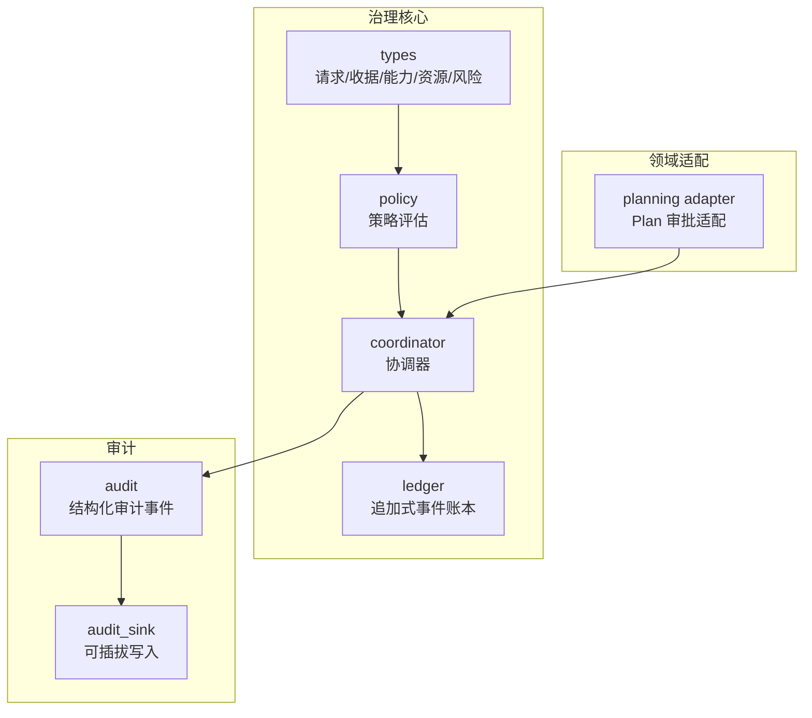
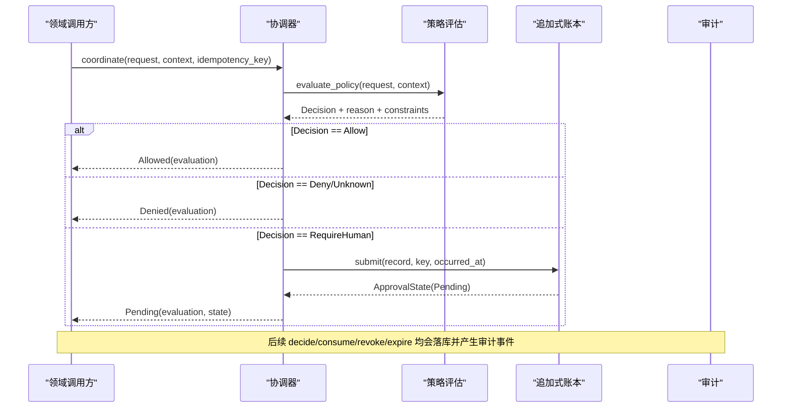
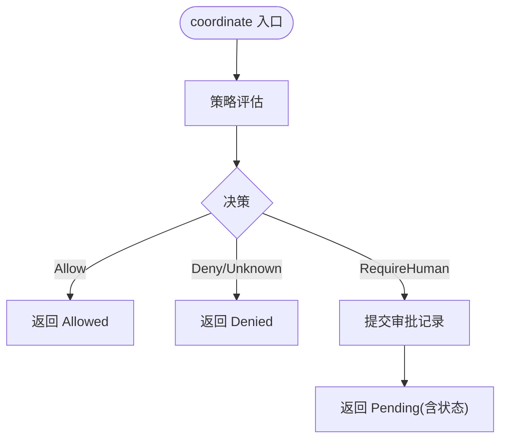
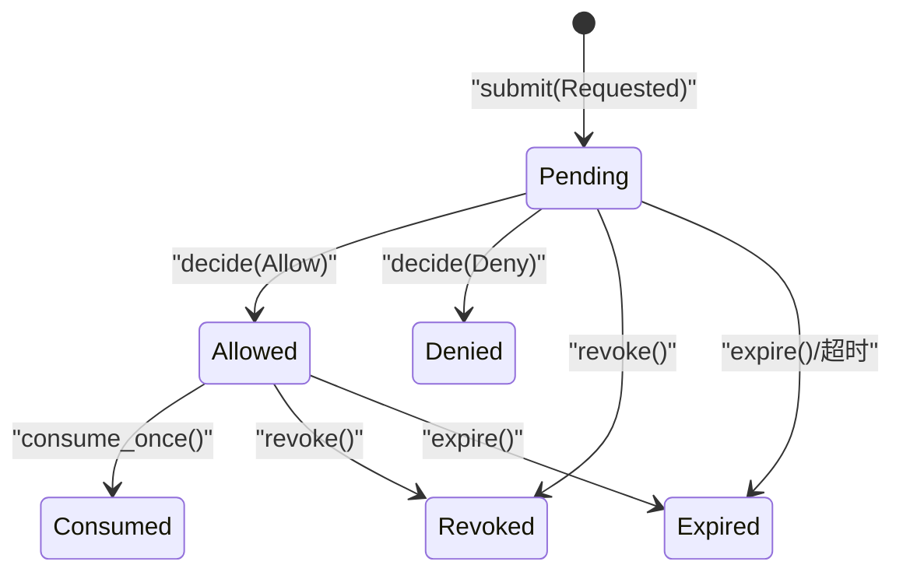
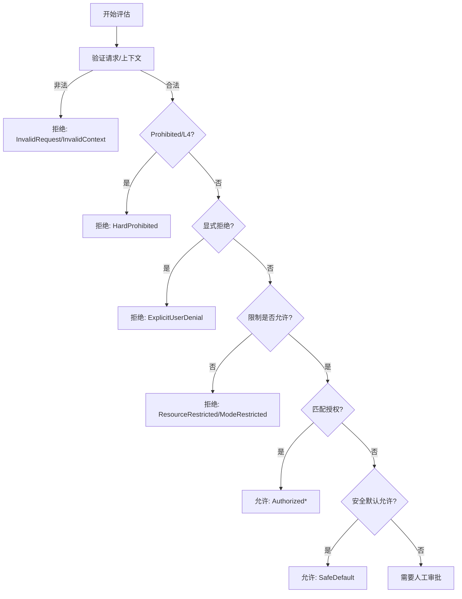
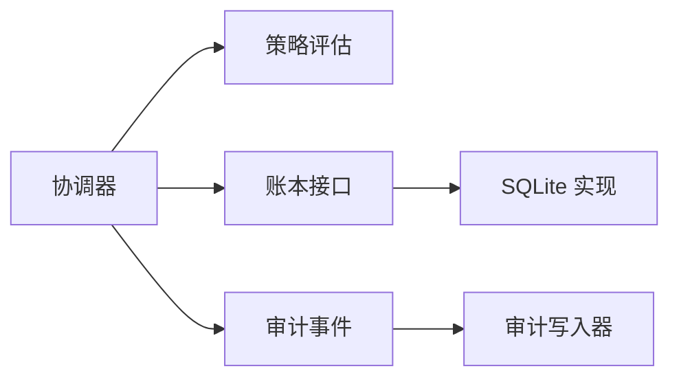

# 治理系统

<cite>
**本文引用的文件**
- [agent-diva-core/src/governance/mod.rs](file://agent-diva-core/src/governance/mod.rs)
- [agent-diva-core/src/governance/coordinator.rs](file://agent-diva-core/src/governance/coordinator.rs)
- [agent-diva-core/src/governance/ledger.rs](file://agent-diva-core/src/governance/ledger.rs)
- [agent-diva-core/src/governance/policy.rs](file://agent-diva-core/src/governance/policy.rs)
- [agent-diva-core/src/governance/types.rs](file://agent-diva-core/src/governance/types.rs)
- [agent-diva-core/src/planning/governance_adapter.rs](file://agent-diva-core/src/planning/governance_adapter.rs)
- [agent-diva-core/src/audit.rs](file://agent-diva-core/src/audit.rs)
- [agent-diva-core/src/audit_sink.rs](file://agent-diva-core/src/audit_sink.rs)
</cite>

## 目录
1. [简介](#简介)
2. [项目结构](#项目结构)
3. [核心组件](#核心组件)
4. [架构总览](#架构总览)
5. [详细组件分析](#详细组件分析)
6. [依赖关系分析](#依赖关系分析)
7. [性能与一致性特性](#性能与一致性特性)
8. [故障排查指南](#故障排查指南)
9. [结论](#结论)
10. [附录：配置、规则与审计示例](#附录配置规则与审计示例)

## 简介
本文件面向开发者，系统化说明 Agent Diva 治理系统的实现与使用。重点覆盖：
- 治理协调器：统一入口，负责策略评估、持久化审批与幂等控制。
- 决策账本：基于追加式事件日志的不可变存储，支持状态回放、分页与恢复。
- 政策评估机制：确定性、无副作用的策略引擎，提供可审计的决策理由与约束。
- 治理规则定义、执行与审计流程：从请求到决策、审批、消费的全链路追踪。
- 追溯性、一致性与可恢复性：通过版本、幂等键、事件回放保障。
- 配置与规则编写、审计日志分析方法论与实践建议。

## 项目结构
治理子系统位于 agent-diva-core 的 governance 模块，围绕“策略评估 + 协调器 + 追加式账本”的三层设计组织代码：
- types：稳定的请求、收据、能力、资源、风险等基础类型与校验。
- policy：纯函数策略评估，输出决策、原因与约束。
- coordinator：将策略评估结果与持久化审批结合，暴露统一的协调接口。
- ledger：追加式事件存储（SQLite），维护状态机与回放能力。
- planning/governance_adapter：兼容旧版 Plan 审批的适配层。
- audit / audit_sink：全局审计事件与可插拔写入后端。

图表来源
- [agent-diva-core/src/governance/mod.rs:1-17](file://agent-diva-core/src/governance/mod.rs#L1-L17)
- [agent-diva-core/src/governance/coordinator.rs:1-186](file://agent-diva-core/src/governance/coordinator.rs#L1-L186)
- [agent-diva-core/src/governance/ledger.rs:1-313](file://agent-diva-core/src/governance/ledger.rs#L1-L313)
- [agent-diva-core/src/governance/policy.rs:1-205](file://agent-diva-core/src/governance/policy.rs#L1-L205)
- [agent-diva-core/src/governance/types.rs:1-161](file://agent-diva-core/src/governance/types.rs#L1-L161)
- [agent-diva-core/src/planning/governance_adapter.rs:1-78](file://agent-diva-core/src/planning/governance_adapter.rs#L1-L78)
- [agent-diva-core/src/audit.rs:1-253](file://agent-diva-core/src/audit.rs#L1-L253)
- [agent-diva-core/src/audit_sink.rs:1-94](file://agent-diva-core/src/audit_sink.rs#L1-L94)

章节来源
- [agent-diva-core/src/governance/mod.rs:1-17](file://agent-diva-core/src/governance/mod.rs#L1-L17)

## 核心组件
- 治理协调器 ApprovalCoordinator：统一入口，封装策略评估与持久化审批，提供提交、决策、撤销、过期、消费、查询等原子操作。
- 决策账本 GovernanceLedger：追加式事件存储，定义稳定错误与分页接口；SqliteGovernanceLedger 提供 SQLite 实现与状态回放。
- 策略评估 evaluate_policy：纯函数，依据请求、上下文、限制与授权矩阵得出 Allow/Deny/RequireHuman，并附带原因与约束。
- 类型体系：ApprovalRequest、ApprovalReceipt、Capability、ResourceScope、RiskClass、Decision 等，提供强校验与向后兼容未知值处理。
- 计划适配：将旧版 Plan 审批请求适配为通用治理请求，绑定修订边界与策略元数据。
- 审计：结构化审计事件与可插拔 sink，确保审计失败不影响业务逻辑。

章节来源
- [agent-diva-core/src/governance/coordinator.rs:1-186](file://agent-diva-core/src/governance/coordinator.rs#L1-L186)
- [agent-diva-core/src/governance/ledger.rs:244-313](file://agent-diva-core/src/governance/ledger.rs#L244-L313)
- [agent-diva-core/src/governance/policy.rs:98-205](file://agent-diva-core/src/governance/policy.rs#L98-L205)
- [agent-diva-core/src/governance/types.rs:121-161](file://agent-diva-core/src/governance/types.rs#L121-L161)
- [agent-diva-core/src/planning/governance_adapter.rs:30-78](file://agent-diva-core/src/planning/governance_adapter.rs#L30-L78)
- [agent-diva-core/src/audit.rs:224-253](file://agent-diva-core/src/audit.rs#L224-L253)
- [agent-diva-core/src/audit_sink.rs:59-94](file://agent-diva-core/src/audit_sink.rs#L59-L94)

## 架构总览
治理系统采用“策略即纯函数 + 协调器编排 + 追加式事件账本”的架构：
- 所有高风险或需要人类审批的操作先经策略评估，仅当 RequireHuman 时才进入持久化审批队列。
- 协调器保证幂等提交与 CAS 版本控制，避免重复审批与并发冲突。
- 账本以不可变事件形式记录 Requested/Allowed/Denied/Revoked/Consumed/Expired，支持按时间回放得到当前状态。
- 审计事件通过 tracing 管道输出，并可路由至文件或其他 sink，便于观测与取证。

图表来源
- [agent-diva-core/src/governance/coordinator.rs:73-186](file://agent-diva-core/src/governance/coordinator.rs#L73-L186)
- [agent-diva-core/src/governance/ledger.rs:485-574](file://agent-diva-core/src/governance/ledger.rs#L485-L574)
- [agent-diva-core/src/governance/policy.rs:98-205](file://agent-diva-core/src/governance/policy.rs#L98-L205)

## 详细组件分析

### 治理协调器 ApprovalCoordinator
职责与行为：
- coordinate：对请求进行策略评估，仅在 RequireHuman 时提交到账本并返回 Pending；Allow/Deny 不创建审批记录。
- decide：以 CAS 方式提交人类决策（允许/拒绝），生成 Allowed/Denied 事件。
- consume_once：在受保护副作用前消费一次性许可，确保只执行一次。
- revoke/expire：撤销或显式过期未消费或已允许的审批。
- states_page/events_page：分页读取聚合状态与原始事件，用于 UI 展示与恢复。

关键设计点：
- 幂等提交：通过 idempotency_key + operation_fingerprint 防止重复提交与内容篡改。
- 版本控制：每次写操作携带 expected_version，冲突时返回 VersionConflict。
- 安全默认：仅 RequireHuman 才落库，降低审计噪音与存储压力。

图表来源
- [agent-diva-core/src/governance/coordinator.rs:73-186](file://agent-diva-core/src/governance/coordinator.rs#L73-L186)

章节来源
- [agent-diva-core/src/governance/coordinator.rs:13-186](file://agent-diva-core/src/governance/coordinator.rs#L13-L186)

### 决策账本 GovernanceLedger（SQLite 实现）
数据结构与状态机：
- 事件类型：Requested、Allowed、Denied、Revoked、Consumed、Expired。
- 聚合状态：ApprovalState = {request, status, version, receipt}。
- 状态转换：Pending -> Allowed/Denied/Revoked/Expired -> Consumed（仅 Once 许可）。

持久化与一致性：
- 追加式 JSON 事件表，禁止更新与删除触发器保障不可变性。
- 唯一索引 (idempotency_key) 与 (request_id, version) 保证幂等与版本唯一。
- 通过 replay 从事件流推导状态，支持断点续读与恢复。

图表来源
- [agent-diva-core/src/governance/ledger.rs:119-186](file://agent-diva-core/src/governance/ledger.rs#L119-L186)
- [agent-diva-core/src/governance/ledger.rs:485-715](file://agent-diva-core/src/governance/ledger.rs#L485-L715)

章节来源
- [agent-diva-core/src/governance/ledger.rs:1-313](file://agent-diva-core/src/governance/ledger.rs#L1-L313)
- [agent-diva-core/src/governance/ledger.rs:314-795](file://agent-diva-core/src/governance/ledger.rs#L314-L795)

### 策略评估 evaluate_policy
输入：
- ApprovalRequest：包含能力、资源、风险、摘要、策略版本、时间窗口、证据引用等。
- PolicyContext：自主级别、显式用户决策、限制列表、授权收据集合。

评估优先级（简化）：
1. 请求/上下文合法性检查（时间窗口、未知值）。
2. 硬拒绝：风险为 Prohibited 或自主级别 L4。
3. 显式拒绝优先于任何授权。
4. 限制（资源/模式）若不允许则拒绝。
5. 匹配授权：Once/Session/Rule 三种授予范围，需满足自主级别要求。
6. 安全默认：L1 下低风险 Inspect/PlanMutate 可直接允许。
7. 否则 RequireHuman。

输出：
- Decision、PolicyReasonCode、约束列表（资源、策略版本、会话、请求 ID、过期时间）、证据引用。

图表来源
- [agent-diva-core/src/governance/policy.rs:98-205](file://agent-diva-core/src/governance/policy.rs#L98-L205)
- [agent-diva-core/src/governance/policy.rs:207-346](file://agent-diva-core/src/governance/policy.rs#L207-L346)

章节来源
- [agent-diva-core/src/governance/policy.rs:1-360](file://agent-diva-core/src/governance/policy.rs#L1-L360)

### 类型与校验
- 能力与资源映射：Capability 与 ResourceKind 有严格匹配矩阵，未知组合默认拒绝。
- 风险等级：Low/Moderate/High/Critical/Prohibited，影响安全默认与授权级别。
- 摘要 ContentDigest：绑定不可变内容，防止篡改。
- 审计关联 AuditCorrelation：request_id、turn_id、session_id、trace_id 贯穿全链路。
- 批准范围 ApprovalGrant：Once（一次性）、Session（会话级）、Rule（规则级）。

章节来源
- [agent-diva-core/src/governance/types.rs:27-161](file://agent-diva-core/src/governance/types.rs#L27-L161)
- [agent-diva-core/src/governance/types.rs:204-311](file://agent-diva-core/src/governance/types.rs#L204-L311)

### 计划审批适配
将旧版 Plan 审批请求包装为通用治理请求：
- 设置 Capability=PlanExecute，ResourceKind=Plan，resource.boundary=revision:<expected_revision>。
- 保留原 payload，便于领域逻辑继续工作。
- 将历史成功收据转换为治理收据，保持向后兼容。

章节来源
- [agent-diva-core/src/planning/governance_adapter.rs:15-78](file://agent-diva-core/src/planning/governance_adapter.rs#L15-L78)

## 依赖关系分析
- 协调器依赖策略评估与账本接口，屏蔽底层存储细节。
- 账本实现依赖 SQLx 与 JSON 序列化，通过触发器与唯一索引保障不可变与幂等。
- 策略评估依赖类型校验与能力-资源矩阵，不访问 I/O。
- 审计模块通过 tracing 输出，sink 可插拔，默认支持 JSONL 文件滚动。

图表来源
- [agent-diva-core/src/governance/coordinator.rs:1-186](file://agent-diva-core/src/governance/coordinator.rs#L1-L186)
- [agent-diva-core/src/governance/ledger.rs:314-482](file://agent-diva-core/src/governance/ledger.rs#L314-L482)
- [agent-diva-core/src/audit.rs:224-253](file://agent-diva-core/src/audit.rs#L224-L253)
- [agent-diva-core/src/audit_sink.rs:150-258](file://agent-diva-core/src/audit_sink.rs#L150-L258)

章节来源
- [agent-diva-core/src/governance/mod.rs:1-17](file://agent-diva-core/src/governance/mod.rs#L1-L17)

## 性能与一致性特性
- 幂等提交：通过 idempotency_key + operation_fingerprint 去重，避免重复审批与冲突。
- 版本控制：CAS 语义，期望版本不匹配返回 VersionConflict。
- 追加式存储：不可变事件表，支持高效回放与分页。
- 安全默认：仅 RequireHuman 才落库，减少不必要持久化开销。
- 审计非阻塞：审计失败被吞掉，不影响主流程。

章节来源
- [agent-diva-core/src/governance/ledger.rs:371-426](file://agent-diva-core/src/governance/ledger.rs#L371-L426)
- [agent-diva-core/src/governance/ledger.rs:485-715](file://agent-diva-core/src/governance/ledger.rs#L485-L715)
- [agent-diva-core/src/audit_sink.rs:17-21](file://agent-diva-core/src/audit_sink.rs#L17-L21)

## 故障排查指南
常见错误与定位：
- IdempotencyConflict：同一幂等键对应不同操作指纹，检查调用方是否正确复用 key。
- VersionConflict：并发提交导致版本不一致，重试时需获取最新状态。
- InvalidTransition：状态机不允许的转换（如已消费后撤销）。
- Expired：请求或收据过期，检查时间窗口与决策时间。
- AlreadyConsumed：一次性许可已被消费，避免重复执行副作用。
- NotFound：请求不存在，核对 request_id。

审计与日志：
- 通过 target="audit" 过滤结构化事件，结合 trace_id 串联调用链。
- 使用 JSONL 文件滚动查看每日审计，注意 timestamp 字段。

章节来源
- [agent-diva-core/src/governance/ledger.rs:188-236](file://agent-diva-core/src/governance/ledger.rs#L188-L236)
- [agent-diva-core/src/audit.rs:224-253](file://agent-diva-core/src/audit.rs#L224-L253)
- [agent-diva-core/src/audit_sink.rs:150-258](file://agent-diva-core/src/audit_sink.rs#L150-L258)

## 结论
Agent Diva 治理系统通过纯函数策略评估、协调器编排与追加式事件账本，实现了高可靠、可追溯、可恢复的审批与决策机制。其设计强调：
- 安全默认与失败关闭：未知或非法输入一律拒绝。
- 幂等与版本控制：避免重复与并发冲突。
- 可审计与可观测：结构化审计事件与可插拔 sink。
- 领域解耦：通用请求/收据抽象，适配多领域（Plan、Sandbox、Memory）。

## 附录：配置、规则与审计示例

### 治理配置要点
- 自主级别 AutonomyLevel：L0-L4，决定安全默认与授权范围。
- 限制 Restrictions：资源/模式维度，可动态拒绝。
- 授权 Receipts：Once/Session/Rule，需与请求能力、资源、策略版本匹配。
- 时间窗口：created_at/expires_at 与 evaluated_at/decided_at 必须合理。

章节来源
- [agent-diva-core/src/governance/policy.rs:11-50](file://agent-diva-core/src/governance/policy.rs#L11-L50)
- [agent-diva-core/src/governance/types.rs:121-161](file://agent-diva-core/src/governance/types.rs#L121-L161)

### 政策规则编写建议
- 明确能力-资源映射，未知组合默认拒绝。
- 高风险操作（Critical/Prohibited）应强制 RequireHuman。
- 合理使用 Session/Rule 授权以降低审批频率，但需确保作用域正确。
- 在 L1 下谨慎启用安全默认，仅允许低风险 Inspect/PlanMutate。

章节来源
- [agent-diva-core/src/governance/policy.rs:285-346](file://agent-diva-core/src/governance/policy.rs#L285-L346)

### 审计日志分析
- 使用 target="audit" 过滤事件，关注 DecisionPoint、SecurityPolicyDecision、ToolDenied 等。
- 通过 trace_id 关联跨模块调用。
- JSONL 文件按日滚动，便于归档与分析。

章节来源
- [agent-diva-core/src/audit.rs:33-222](file://agent-diva-core/src/audit.rs#L33-L222)
- [agent-diva-core/src/audit_sink.rs:150-258](file://agent-diva-core/src/audit_sink.rs#L150-L258)