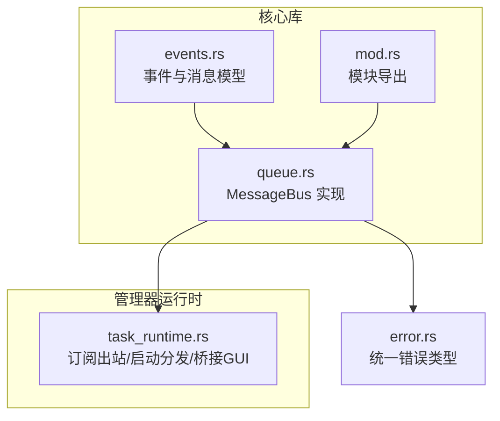
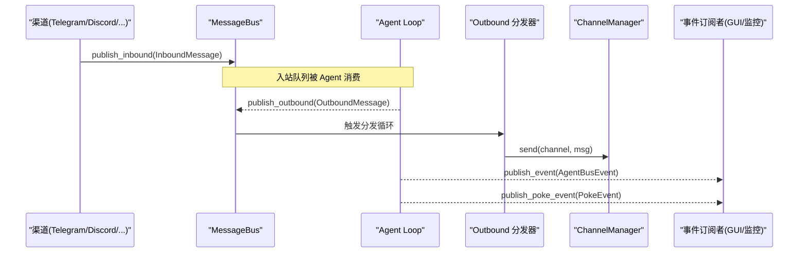
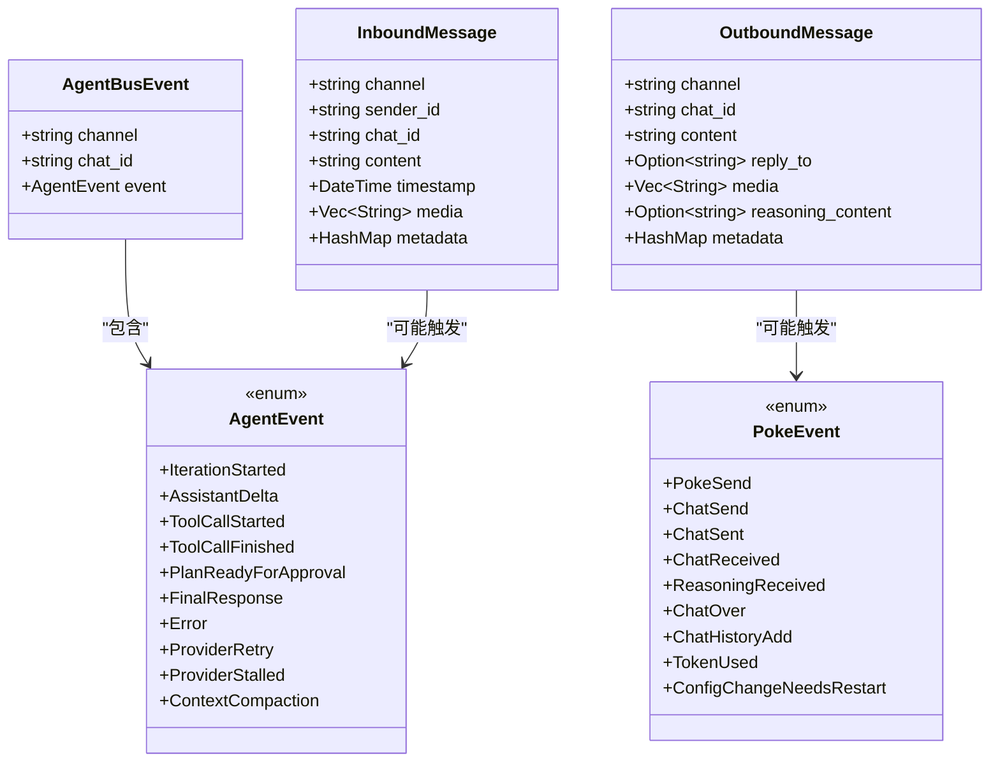
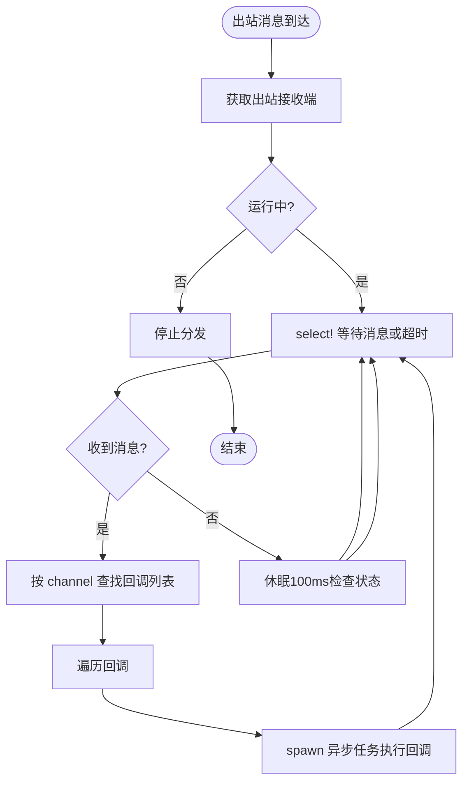
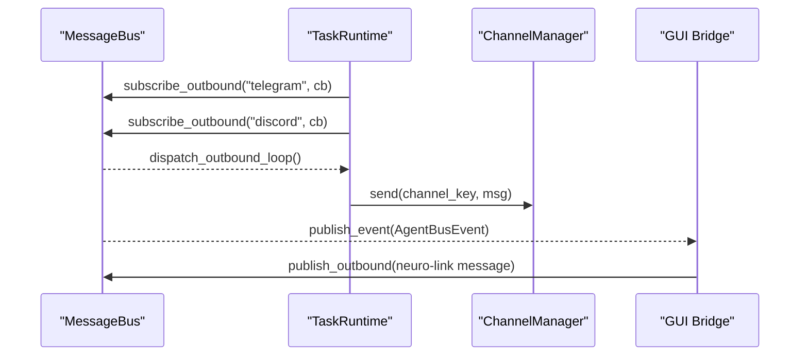
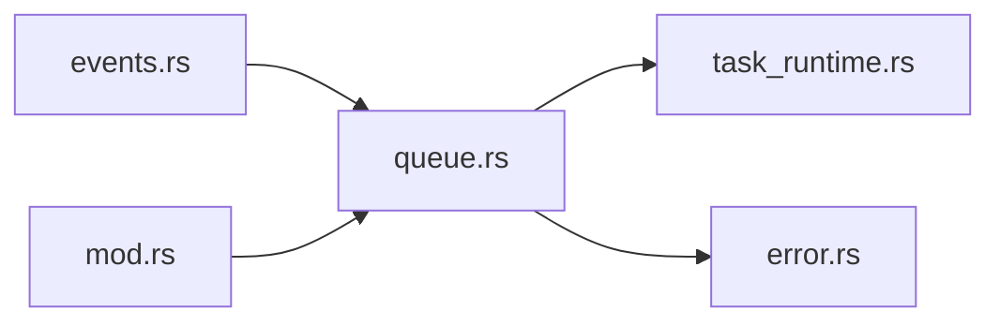

# 消息总线

<cite>
**本文引用的文件**
- [agent-diva-core/src/bus/mod.rs](file://agent-diva-core/src/bus/mod.rs)
- [agent-diva-core/src/bus/events.rs](file://agent-diva-core/src/bus/events.rs)
- [agent-diva-core/src/bus/queue.rs](file://agent-diva-core/src/bus/queue.rs)
- [agent-diva-manager/src/runtime/task_runtime.rs](file://agent-diva-manager/src/runtime/task_runtime.rs)
- [agent-diva-core/src/error.rs](file://agent-diva-core/src/error.rs)
</cite>

## 目录
1. [简介](#简介)
2. [项目结构](#项目结构)
3. [核心组件](#核心组件)
4. [架构总览](#架构总览)
5. [详细组件分析](#详细组件分析)
6. [依赖关系分析](#依赖关系分析)
7. [性能考虑](#性能考虑)
8. [故障排除指南](#故障排除指南)
9. [结论](#结论)
10. [附录：使用手册与示例](#附录使用手册与示例)

## 简介
本文件面向开发者，系统化说明 Agent Diva 的消息总线（MessageBus）设计、事件驱动架构、消息队列管理与事件分发机制。重点覆盖：
- 事件的定义与发布订阅模式
- 异步消息处理流程
- 可靠性保证、顺序控制与错误重试策略
- 具体事件处理示例、性能调优建议与故障排除方法

消息总线位于 agent-diva-core 的 bus 模块中，通过双通道（入站/出站）将聊天渠道与 Agent 核心解耦，并通过广播通道对外暴露事件流，供 GUI、网关、子系统等消费。

## 项目结构
消息总线相关代码集中在以下位置：
- 事件类型与消息模型：agent-diva-core/src/bus/events.rs
- 消息总线实现与分发循环：agent-diva-core/src/bus/queue.rs
- 模块导出与重命名：agent-diva-core/src/bus/mod.rs
- 运行时集成（订阅出站、启动分发器、桥接 GUI）：agent-diva-manager/src/runtime/task_runtime.rs
- 统一错误类型：agent-diva-core/src/error.rs

图表来源
- [agent-diva-core/src/bus/events.rs:1-436](file://agent-diva-core/src/bus/events.rs#L1-L436)
- [agent-diva-core/src/bus/queue.rs:1-381](file://agent-diva-core/src/bus/queue.rs#L1-L381)
- [agent-diva-core/src/bus/mod.rs:1-14](file://agent-diva-core/src/bus/mod.rs#L1-L14)
- [agent-diva-manager/src/runtime/task_runtime.rs:170-361](file://agent-diva-manager/src/runtime/task_runtime.rs#L170-L361)
- [agent-diva-core/src/error.rs:1-73](file://agent-diva-core/src/error.rs#L1-L73)

章节来源
- [agent-diva-core/src/bus/mod.rs:1-14](file://agent-diva-core/src/bus/mod.rs#L1-L14)
- [agent-diva-core/src/bus/events.rs:1-436](file://agent-diva-core/src/bus/events.rs#L1-L436)
- [agent-diva-core/src/bus/queue.rs:1-381](file://agent-diva-core/src/bus/queue.rs#L1-L381)
- [agent-diva-manager/src/runtime/task_runtime.rs:170-361](file://agent-diva-manager/src/runtime/task_runtime.rs#L170-L361)
- [agent-diva-core/src/error.rs:1-73](file://agent-diva-core/src/error.rs#L1-L73)

## 核心组件
- 事件与消息模型
  - InboundMessage：从渠道进入的消息，包含 channel、sender_id、chat_id、content、timestamp、media、metadata。
  - OutboundMessage：Agent 产生的回复消息，包含 channel、chat_id、content、reply_to、media、reasoning_content、metadata。
  - AgentEvent：Agent 运行时的流式事件集合（如迭代开始、助手增量文本、工具调用生命周期、计划状态更新、最终响应、错误、提供者重试/停滞、上下文压缩等）。
  - AgentBusEvent：带 channel/chat_id 上下文的 AgentEvent 包装，便于路由与追踪。
  - PokeEvent：系统级生命周期与审计事件（发送/接收、历史追加、Token 消耗、配置热更需重启等）。

- MessageBus
  - 双通道：inbound/outbound 使用无界 mpsc 通道，提供 publish_inbound/publish_outbound。
  - 事件广播：event_tx/poke_event_tx 为 broadcast 通道，支持多订阅者。
  - 出站分发：dispatch_outbound_loop 后台任务，按 channel 查找已注册的回调并异步执行。
  - 订阅管理：subscribe_outbound 按 channel 注册回调；take_inbound_receiver/take_outbound_receiver 用于获取唯一接收端。

章节来源
- [agent-diva-core/src/bus/events.rs:12-153](file://agent-diva-core/src/bus/events.rs#L12-L153)
- [agent-diva-core/src/bus/events.rs:155-213](file://agent-diva-core/src/bus/events.rs#L155-L213)
- [agent-diva-core/src/bus/events.rs:342-436](file://agent-diva-core/src/bus/events.rs#L342-L436)
- [agent-diva-core/src/bus/queue.rs:19-184](file://agent-diva-core/src/bus/queue.rs#L19-L184)

## 架构总览
消息总线采用“事件驱动 + 发布/订阅 + 异步分发”的架构：
- 渠道侧将入站消息推送到 bus.inbound，由上层 Agent Loop 消费并处理。
- Agent 处理后产生 OutboundMessage，写入 bus.outbound。
- dispatch_outbound_loop 在后台按 channel 分发给已注册的回调（例如 ChannelManager.send）。
- AgentEvent/PokeEvent 通过 broadcast 通道广播给所有订阅者（如 GUI、监控、日志等）。

图表来源
- [agent-diva-core/src/bus/queue.rs:105-184](file://agent-diva-core/src/bus/queue.rs#L105-L184)
- [agent-diva-manager/src/runtime/task_runtime.rs:173-202](file://agent-diva-manager/src/runtime/task_runtime.rs#L173-L202)
- [agent-diva-core/src/bus/events.rs:147-153](file://agent-diva-core/src/bus/events.rs#L147-L153)

## 详细组件分析

### 事件模型与语义
- AgentEvent 覆盖完整对话生命周期：迭代、增量文本、工具调用、计划步骤/Todo 变更、最终响应、错误、提供者重试/停滞、上下文压缩等。
- AgentBusEvent 携带 channel/chat_id 上下文，使事件可路由到特定会话。
- InboundMessage/OutboundMessage 是跨渠道的统一消息格式，支持媒体与元数据扩展。
- PokeEvent 提供系统级审计与监控点，包括 Token 使用、配置变更提示等。

图表来源
- [agent-diva-core/src/bus/events.rs:12-153](file://agent-diva-core/src/bus/events.rs#L12-L153)
- [agent-diva-core/src/bus/events.rs:155-213](file://agent-diva-core/src/bus/events.rs#L155-L213)
- [agent-diva-core/src/bus/events.rs:342-436](file://agent-diva-core/src/bus/events.rs#L342-L436)

章节来源
- [agent-diva-core/src/bus/events.rs:12-153](file://agent-diva-core/src/bus/events.rs#L12-L153)
- [agent-diva-core/src/bus/events.rs:155-213](file://agent-diva-core/src/bus/events.rs#L155-L213)
- [agent-diva-core/src/bus/events.rs:342-436](file://agent-diva-core/src/bus/events.rs#L342-L436)

### 消息队列与分发机制
- 入站队列：publish_inbound 将消息送入 inbound mpsc 通道，由上层 Agent Loop 消费。
- 出站队列：publish_outbound 将消息送入 outbound mpsc 通道，由 dispatch_outbound_loop 消费。
- 分发循环：
  - 通过 take_outbound_receiver 获取唯一接收端，避免重复消费。
  - 使用 tokio::select! 监听出站消息与运行状态切换。
  - 对每个 OutboundMessage，按 channel 查找已注册回调，并 spawn 独立任务执行，避免阻塞分发器。
- 事件广播：
  - publish_event/publish_poke_event 将事件发送到 broadcast 通道，忽略无消费者的错误。
  - subscribe_events/subscribe_poke_events 返回 Receiver 供订阅者消费。

图表来源
- [agent-diva-core/src/bus/queue.rs:132-184](file://agent-diva-core/src/bus/queue.rs#L132-L184)

章节来源
- [agent-diva-core/src/bus/queue.rs:95-184](file://agent-diva-core/src/bus/queue.rs#L95-L184)

### 发布/订阅与事件流
- 事件通道：
  - AgentBusEvent：业务事件流，携带 channel/chat_id。
  - PokeEvent：系统事件流，用于审计、监控、配置提示。
- 订阅方式：
  - 订阅事件：subscribe_events()/subscribe_poke_events()。
  - 订阅出站消息：subscribe_outbound(channel, callback)，按 channel 路由。
- 典型集成：
  - 管理器运行时根据配置订阅出站消息，转发到 ChannelManager.send。
  - 管理器运行时监听 AgentBusEvent，过滤 gui 频道并将 FinalResponse 转换为神经链接头像消息，再 publish_outbound。

图表来源
- [agent-diva-manager/src/runtime/task_runtime.rs:173-202](file://agent-diva-manager/src/runtime/task_runtime.rs#L173-L202)
- [agent-diva-manager/src/runtime/task_runtime.rs:204-247](file://agent-diva-manager/src/runtime/task_runtime.rs#L204-L247)
- [agent-diva-core/src/bus/queue.rs:119-184](file://agent-diva-core/src/bus/queue.rs#L119-L184)

章节来源
- [agent-diva-manager/src/runtime/task_runtime.rs:173-247](file://agent-diva-manager/src/runtime/task_runtime.rs#L173-L247)
- [agent-diva-core/src/bus/queue.rs:61-93](file://agent-diva-core/src/bus/queue.rs#L61-L93)

### 可靠性、顺序与重试策略
- 可靠性
  - 入站/出站通道基于无界 mpsc，发送失败时返回 Error::Channel，调用方可据此记录日志或告警。
  - 事件广播忽略无消费者错误，适合“尽力而为”的监控/审计场景。
- 顺序控制
  - 出站分发在同一循环内按消息到达顺序处理；同一 channel 的多个回调按注册顺序依次 spawn，但各回调并发执行，不保证跨回调的顺序。
  - 入站消息由上层 Agent Loop 串行消费（文档约定），确保单会话内的顺序性。
- 重试策略
  - 当前 MessageBus 层未内置重试逻辑；重试由上层决定（例如 ChannelManager.send 失败后重试或退避）。
  - AgentEvent::ProviderRetry 提供提供者侧重试信息（attempt/max_retries/delay_ms/reason），可用于 UI 展示或监控。
  - 调度器子系统（非 MessageBus）具备持久化重试能力（claim_next/fail/retry_failed），可作为参考。

章节来源
- [agent-diva-core/src/bus/queue.rs:105-117](file://agent-diva-core/src/bus/queue.rs#L105-L117)
- [agent-diva-core/src/bus/events.rs:118-145](file://agent-diva-core/src/bus/events.rs#L118-L145)
- [agent-diva-core/src/scheduler/bridge.rs:319-357](file://agent-diva-core/src/scheduler/bridge.rs#L319-L357)

### 错误处理与诊断
- 错误类型
  - Error::Channel：通道关闭或发送失败。
  - Error::Provider：提供者错误。
  - Error::Internal：内部错误（含数据库错误转换）。
- 诊断要点
  - 出站分发失败：查看 ChannelManager.send 的错误日志。
  - 事件丢失：确认订阅者是否及时消费 broadcast 通道，必要时增加缓冲或背压。
  - 会话顺序：确认 Agent Loop 串行消费入站消息，避免并行导致乱序。

章节来源
- [agent-diva-core/src/error.rs:1-73](file://agent-diva-core/src/error.rs#L1-L73)
- [agent-diva-manager/src/runtime/task_runtime.rs:173-192](file://agent-diva-manager/src/runtime/task_runtime.rs#L173-L192)

## 依赖关系分析
- 模块内依赖
  - queue.rs 依赖 events.rs 中的消息与事件类型。
  - mod.rs 仅做 re-export，简化外部使用。
- 运行时集成
  - task_runtime.rs 订阅出站消息并转发至 ChannelManager，同时监听事件流以桥接 GUI。
- 错误体系
  - queue.rs 使用 crate::Result 与 Error::Channel 表达通道错误。

图表来源
- [agent-diva-core/src/bus/events.rs:1-436](file://agent-diva-core/src/bus/events.rs#L1-L436)
- [agent-diva-core/src/bus/queue.rs:1-381](file://agent-diva-core/src/bus/queue.rs#L1-L381)
- [agent-diva-core/src/bus/mod.rs:1-14](file://agent-diva-core/src/bus/mod.rs#L1-L14)
- [agent-diva-manager/src/runtime/task_runtime.rs:170-361](file://agent-diva-manager/src/runtime/task_runtime.rs#L170-L361)
- [agent-diva-core/src/error.rs:1-73](file://agent-diva-core/src/error.rs#L1-L73)

章节来源
- [agent-diva-core/src/bus/mod.rs:1-14](file://agent-diva-core/src/bus/mod.rs#L1-L14)
- [agent-diva-core/src/bus/queue.rs:1-381](file://agent-diva-core/src/bus/queue.rs#L1-L381)
- [agent-diva-manager/src/runtime/task_runtime.rs:170-361](file://agent-diva-manager/src/runtime/task_runtime.rs#L170-L361)
- [agent-diva-core/src/error.rs:1-73](file://agent-diva-core/src/error.rs#L1-L73)

## 性能考虑
- 通道选择
  - 使用无界 mpsc 通道，避免背压导致的阻塞；在高吞吐场景下注意内存占用。
- 分发开销
  - 每个 OutboundMessage 会为每个回调 spawn 一个任务，避免阻塞分发器；回调应轻量且快速完成。
- 事件广播
  - broadcast 通道容量有限（默认 1024），若消费者慢可能导致丢弃；建议在关键路径上增加缓冲或限速。
- 运行时优化
  - 合理配置订阅的 channel 数量，减少不必要的回调。
  - 对高频事件（如 AssistantDelta）进行合并或节流，降低下游压力。

[本节为通用性能指导，无需特定文件引用]

## 故障排除指南
- 出站消息未送达
  - 检查是否已调用 subscribe_outbound 并为对应 channel 注册回调。
  - 确认 dispatch_outbound_loop 已启动（spawn_outbound_dispatch）。
  - 查看 ChannelManager.send 的错误日志。
- 事件丢失
  - 确认订阅者及时消费 broadcast 通道，必要时增加缓冲或调整消费者优先级。
- 通道错误
  - 捕获 Error::Channel，记录 channel 名称与上下文，必要时重启分发器或重建通道。
- 顺序问题
  - 确认 Agent Loop 串行消费入站消息；避免对同一会话的多实例并行处理。
- 提供者重试
  - 关注 AgentEvent::ProviderRetry，结合 attempt/max_retries/delay_ms 判断是否需要降级或告警。

章节来源
- [agent-diva-manager/src/runtime/task_runtime.rs:173-202](file://agent-diva-manager/src/runtime/task_runtime.rs#L173-L202)
- [agent-diva-core/src/bus/queue.rs:105-117](file://agent-diva-core/src/bus/queue.rs#L105-L117)
- [agent-diva-core/src/bus/events.rs:118-145](file://agent-diva-core/src/bus/events.rs#L118-L145)

## 结论
Agent Diva 的消息总线通过清晰的事件模型、双通道设计与广播机制，实现了渠道与 Agent 核心的解耦与高效通信。其异步分发、订阅回调与事件流为构建可扩展、可观测的系统提供了坚实基础。对于可靠性与顺序性，当前实现侧重于高性能与低耦合，复杂的重试与持久化可由上层或子系统补充。

[本节为总结性内容，无需特定文件引用]

## 附录：使用手册与示例

### 基本用法
- 创建与启动
  - 创建 MessageBus 实例。
  - 启动出站分发循环：spawn_outbound_dispatch(bus)。
- 订阅出站消息
  - 为每个需要处理的 channel 调用 subscribe_outbound(channel, callback)。
  - 在回调中调用 ChannelManager.send 发送消息。
- 发布事件
  - 使用 publish_event(channel, chat_id, event) 发布业务事件。
  - 使用 publish_poke_event(event) 发布系统事件。
- 消费事件
  - 使用 subscribe_events()/subscribe_poke_events() 获取 Receiver 并循环消费。

章节来源
- [agent-diva-core/src/bus/queue.rs:41-93](file://agent-diva-core/src/bus/queue.rs#L41-L93)
- [agent-diva-manager/src/runtime/task_runtime.rs:173-202](file://agent-diva-manager/src/runtime/task_runtime.rs#L173-L202)

### 事件处理示例
- 监听 GUI 的最终响应并转发到神经链接头像通道
  - 订阅事件流，过滤 channel == "gui" 且 event 为 FinalResponse。
  - 构造 OutboundMessage（channel="neuro-link"），附加必要元数据。
  - 调用 publish_outbound 发送。
- 订阅出站消息并转发到渠道
  - 订阅配置的 channel，回调中调用 ChannelManager.send。
  - 记录错误日志以便排查。

章节来源
- [agent-diva-manager/src/runtime/task_runtime.rs:204-247](file://agent-diva-manager/src/runtime/task_runtime.rs#L204-L247)
- [agent-diva-manager/src/runtime/task_runtime.rs:173-192](file://agent-diva-manager/src/runtime/task_runtime.rs#L173-L192)

### 可靠性与顺序最佳实践
- 出站回调应幂等，避免重复发送造成副作用。
- 对高频事件进行合并或节流，降低下游压力。
- 对关键事件（如 ChatSent、TokenUsed）进行持久化或指标上报。
- 对失败发送进行指数退避重试（由上层实现），并在达到最大重试次数后告警。

[本节为通用最佳实践，无需特定文件引用]