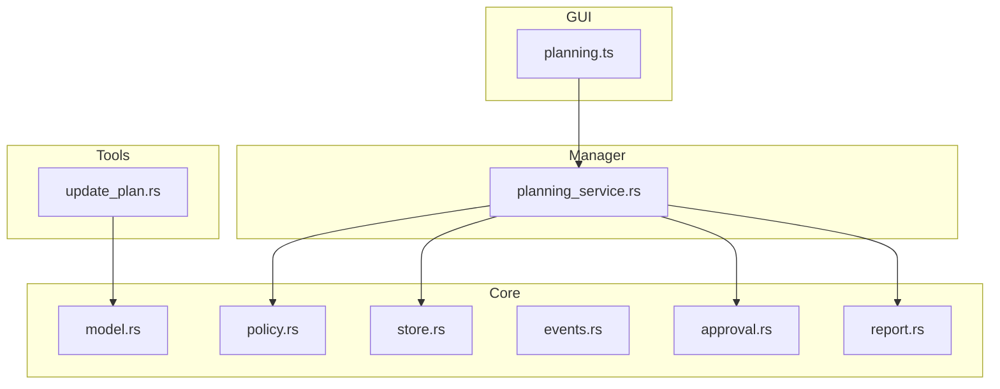
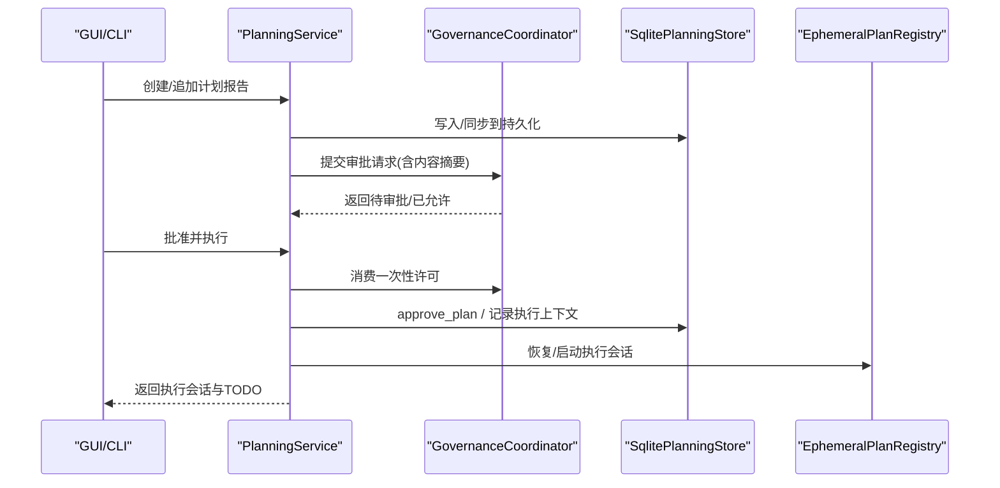
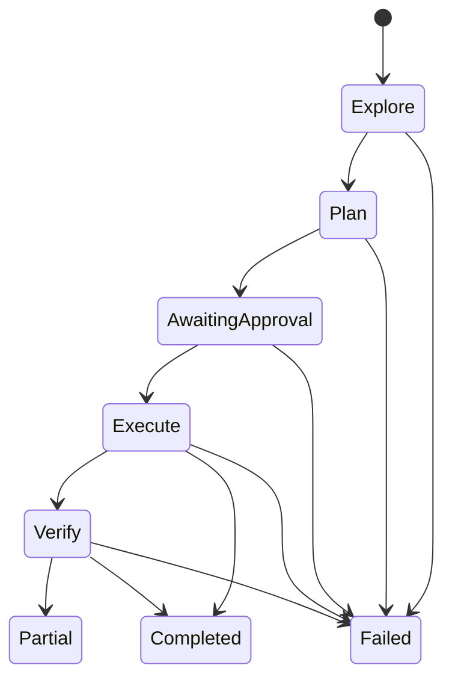
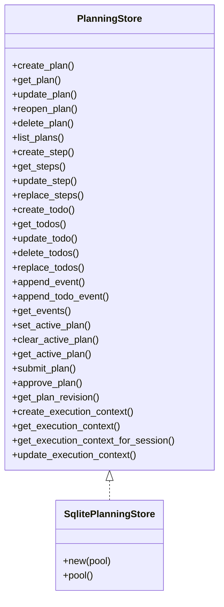
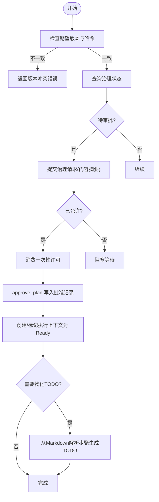
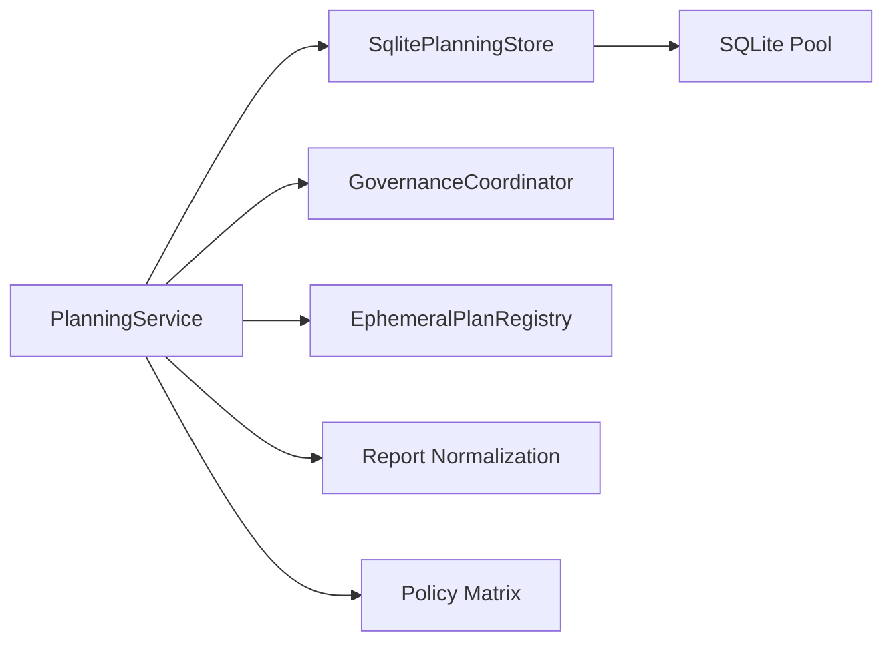
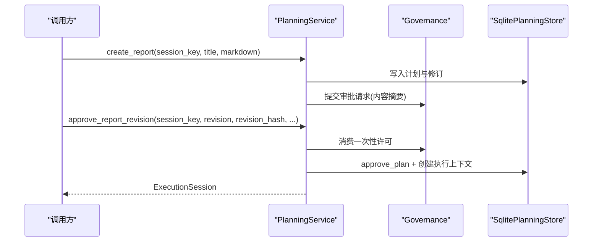

# 规划系统

<cite>
**本文引用的文件**
- [agent-diva-core/src/planning/mod.rs](file://agent-diva-core/src/planning/mod.rs)
- [agent-diva-core/src/planning/model.rs](file://agent-diva-core/src/planning/model.rs)
- [agent-diva-core/src/planning/store.rs](file://agent-diva-core/src/planning/store.rs)
- [agent-diva-core/src/planning/events.rs](file://agent-diva-core/src/planning/events.rs)
- [agent-diva-core/src/planning/approval.rs](file://agent-diva-core/src/planning/approval.rs)
- [agent-diva-core/src/planning/policy.rs](file://agent-diva-core/src/planning/policy.rs)
- [agent-diva-core/src/planning/report.rs](file://agent-diva-core/src/planning/report.rs)
- [agent-diva-manager/src/planning_service.rs](file://agent-diva-manager/src/planning_service.rs)
- [agent-diva-tools/src/update_plan.rs](file://agent-diva-tools/src/update_plan.rs)
- [agent-diva-gui/src/api/planning.ts](file://agent-diva-gui/src/api/planning.ts)
</cite>

## 目录
1. [简介](#简介)
2. [项目结构](#项目结构)
3. [核心组件](#核心组件)
4. [架构总览](#架构总览)
5. [详细组件分析](#详细组件分析)
6. [依赖关系分析](#依赖关系分析)
7. [性能与可靠性](#性能与可靠性)
8. [故障排查指南](#故障排查指南)
9. [结论](#结论)
10. [附录：API 与集成示例](#附录api-与集成示例)

## 简介
本技术文档面向开发者，系统性阐述 Agent Diva 的规划子系统：任务规划、计划执行、进度跟踪与报告生成机制。重点覆盖规划的创建、更新、撤销与恢复流程；解释状态机、依赖管理与冲突解决策略；并提供具体操作示例、API 接口与集成方式。

## 项目结构
规划子系统由 core 层（领域模型、存储、事件、审批、报告）、manager 层（服务编排与治理）、tools 层（轻量级 TODO 工具）以及 GUI 前端类型定义组成。核心模块职责如下：
- 领域模型与生命周期：model.rs、policy.rs
- 持久化与事件日志：store.rs、events.rs
- 审批与版本控制：approval.rs、report.rs
- 服务编排与治理集成：planning_service.rs
- 普通对话中的轻量 TODO：update_plan.rs
- 前端 DTO 与校验：planning.ts

图表来源
- [agent-diva-core/src/planning/model.rs:1-309](file://agent-diva-core/src/planning/model.rs#L1-L309)
- [agent-diva-core/src/planning/policy.rs:1-293](file://agent-diva-core/src/planning/policy.rs#L1-L293)
- [agent-diva-core/src/planning/store.rs:1-800](file://agent-diva-core/src/planning/store.rs#L1-L800)
- [agent-diva-core/src/planning/events.rs:1-180](file://agent-diva-core/src/planning/events.rs#L1-L180)
- [agent-diva-core/src/planning/approval.rs:1-84](file://agent-diva-core/src/planning/approval.rs#L1-L84)
- [agent-diva-core/src/planning/report.rs:1-606](file://agent-diva-core/src/planning/report.rs#L1-L606)
- [agent-diva-manager/src/planning_service.rs:1-800](file://agent-diva-manager/src/planning_service.rs#L1-L800)
- [agent-diva-tools/src/update_plan.rs:1-280](file://agent-diva-tools/src/update_plan.rs#L1-L280)
- [agent-diva-gui/src/api/planning.ts:1-152](file://agent-diva-gui/src/api/planning.ts#L1-L152)

章节来源
- [agent-diva-core/src/planning/mod.rs:1-27](file://agent-diva-core/src/planning/mod.rs#L1-L27)

## 核心组件
- 领域模型：Plan、PlanStep、TodoItem、TodoList、各阶段/状态枚举
- 存储抽象与 SQLite 实现：PlanningStore 及 SqlitePlanningStore
- 事件日志：PlanEvent、TodoEvent（追加式审计）
- 审批契约：PlanSubmission、ApprovalRequest、ApprovalReceipt、TodoPolicy
- 报告与执行上下文：PlanReport、PlanRevision、PersistedExecutionContext、ExecutionSession
- 能力与状态机：PlanPhase -> PlanModeState 映射、能力矩阵、合法迁移
- 服务编排：PlanningService（创建/追加/批准/恢复/撤销/过期）
- 轻量 TODO 工具：update_plan（仅用于普通对话展示）
- 前端 DTO：PlanSummary/Detail/RuntimeState 等

章节来源
- [agent-diva-core/src/planning/model.rs:1-309](file://agent-diva-core/src/planning/model.rs#L1-L309)
- [agent-diva-core/src/planning/store.rs:1-800](file://agent-diva-core/src/planning/store.rs#L1-L800)
- [agent-diva-core/src/planning/events.rs:1-180](file://agent-diva-core/src/planning/events.rs#L1-L180)
- [agent-diva-core/src/planning/approval.rs:1-84](file://agent-diva-core/src/planning/approval.rs#L1-L84)
- [agent-diva-core/src/planning/report.rs:1-606](file://agent-diva-core/src/planning/report.rs#L1-L606)
- [agent-diva-core/src/planning/policy.rs:1-293](file://agent-diva-core/src/planning/policy.rs#L1-L293)
- [agent-diva-manager/src/planning_service.rs:1-800](file://agent-diva-manager/src/planning_service.rs#L1-L800)
- [agent-diva-tools/src/update_plan.rs:1-280](file://agent-diva-tools/src/update_plan.rs#L1-L280)
- [agent-diva-gui/src/api/planning.ts:1-152](file://agent-diva-gui/src/api/planning.ts#L1-L152)

## 架构总览
规划系统采用“领域模型 + 持久化 + 事件日志 + 治理审批”的分层架构。服务层负责编排工作流，将用户或代理的操作转化为对存储的变更，并通过治理协调器进行高权限操作的授权与消费。

图表来源
- [agent-diva-manager/src/planning_service.rs:135-402](file://agent-diva-manager/src/planning_service.rs#L135-L402)
- [agent-diva-core/src/planning/store.rs:292-800](file://agent-diva-core/src/planning/store.rs#L292-L800)
- [agent-diva-core/src/planning/report.rs:1-606](file://agent-diva-core/src/planning/report.rs#L1-L606)

## 详细组件分析

### 领域模型与状态机
- 计划阶段 PlanPhase：Explore → Plan → AwaitingApproval → Execute → Verify → Completed/Failed/Partial
- 运行模式 PlanModeState：Exploring/Drafting/AwaitingApproval/Executing/Verifying/Closed
- 能力矩阵：不同阶段允许的 ToolCapability（Inspect、PlanningRecord、WorkItem、WorkspaceWrite、Execute、External），未知能力一律拒绝
- 迁移合法性：is_valid_transition 严格限制阶段跳转，失败关闭

图表来源
- [agent-diva-core/src/planning/policy.rs:1-293](file://agent-diva-core/src/planning/policy.rs#L1-L293)
- [agent-diva-core/src/planning/model.rs:15-53](file://agent-diva-core/src/planning/model.rs#L15-L53)

章节来源
- [agent-diva-core/src/planning/policy.rs:1-293](file://agent-diva-core/src/planning/policy.rs#L1-L293)
- [agent-diva-core/src/planning/model.rs:1-309](file://agent-diva-core/src/planning/model.rs#L1-L309)

### 存储与事件日志
- 存储抽象 PlanningStore：提供 plan/step/todo CRUD、事件追加、活跃计划管理、提交与批准、执行上下文持久化
- SQLite 实现：自动建表、外键约束、WAL 模式、繁忙超时配置；删除过期计划（30天未更新）
- 事件日志：PlanEvent/TodoEvent 追加式存储，支持审计与回放；TodoList 修订号基于事件推导

图表来源
- [agent-diva-core/src/planning/store.rs:61-126](file://agent-diva-core/src/planning/store.rs#L61-L126)
- [agent-diva-core/src/planning/store.rs:132-276](file://agent-diva-core/src/planning/store.rs#L132-L276)

章节来源
- [agent-diva-core/src/planning/store.rs:1-800](file://agent-diva-core/src/planning/store.rs#L1-L800)
- [agent-diva-core/src/planning/events.rs:1-180](file://agent-diva-core/src/planning/events.rs#L1-L180)

### 审批与版本控制
- PlanSubmission：提交前元数据（范围、验证方法、开放问题处理）
- ApprovalRequest：期望版本、审批人、TODO 策略、是否物化 TODO
- TodoPolicy：Never/Optional/Always，决定执行时是否生成 TODO
- 版本冲突：revision_hash 绑定 Markdown 内容，批准时必须一致；reopened 会递增 revision 使旧快照不可再批

图表来源
- [agent-diva-manager/src/planning_service.rs:174-402](file://agent-diva-manager/src/planning_service.rs#L174-L402)
- [agent-diva-core/src/planning/approval.rs:1-84](file://agent-diva-core/src/planning/approval.rs#L1-L84)
- [agent-diva-core/src/planning/report.rs:479-486](file://agent-diva-core/src/planning/report.rs#L479-L486)

章节来源
- [agent-diva-core/src/planning/approval.rs:1-84](file://agent-diva-core/src/planning/approval.rs#L1-L84)
- [agent-diva-manager/src/planning_service.rs:174-402](file://agent-diva-manager/src/planning_service.rs#L174-L402)
- [agent-diva-core/src/planning/report.rs:1-606](file://agent-diva-core/src/planning/report.rs#L1-L606)

### 报告生成与规范化
- 报告 Markdown 必须包含标题与必需章节（目标、范围、计划步骤、风险与假设、验证方法）
- 支持中英混排与多种别名，normalize_report_markdown 可修复标题、补全 H1、标准化章节头
- extract_proposed_plan/strip_proposed_plan_block 支持 Codex 风格标签块
- 通过 revision_hash 保证批准绑定精确内容

章节来源
- [agent-diva-core/src/planning/report.rs:1-606](file://agent-diva-core/src/planning/report.rs#L1-L606)

### 服务编排与恢复
- 创建/追加报告：validate_report_markdown + 解析 + 注册 + 同步持久化 + 确保治理待审批
- 批准执行：版本与哈希校验、治理状态检查、消费许可、写入批准、初始化执行上下文、可选物化 TODO
- 恢复未完成：扫描 plan_governance 表，根据治理状态恢复或清理；若已消费但上下文未就绪，则补全
- 撤销/过期：通过治理 API 撤销或过期许可

章节来源
- [agent-diva-manager/src/planning_service.rs:114-800](file://agent-diva-manager/src/planning_service.rs#L114-L800)

### 普通对话中的轻量 TODO
- update_plan 工具：仅做参数校验与提示，不写持久化、不执行步骤
- 约束：最多 20 项、仅一个 in_progress、单步长度限制、解释文本长度限制

章节来源
- [agent-diva-tools/src/update_plan.rs:1-280](file://agent-diva-tools/src/update_plan.rs#L1-L280)
- [agent-diva-core/src/planning/update_plan.rs:1-174](file://agent-diva-core/src/planning/update_plan.rs#L1-L174)

## 依赖关系分析
- PlanningService 依赖：
  - SqlitePlanningStore（持久化）
  - Governance Coordinator（审批与消费）
  - EphemeralPlanRegistry（进程内运行时投影）
- Store 依赖：
  - sqlx::SqlitePool（数据库连接池）
  - serde_json（事件与上下文序列化）
- Report 依赖：
  - 章节识别与归一化逻辑（中/英别名）
- Policy 依赖：
  - PlanPhase -> PlanModeState 映射与能力矩阵

图表来源
- [agent-diva-manager/src/planning_service.rs:1-800](file://agent-diva-manager/src/planning_service.rs#L1-L800)
- [agent-diva-core/src/planning/store.rs:1-800](file://agent-diva-core/src/planning/store.rs#L1-L800)
- [agent-diva-core/src/planning/report.rs:1-606](file://agent-diva-core/src/planning/report.rs#L1-L606)
- [agent-diva-core/src/planning/policy.rs:1-293](file://agent-diva-core/src/planning/policy.rs#L1-L293)

章节来源
- [agent-diva-manager/src/planning_service.rs:1-800](file://agent-diva-manager/src/planning_service.rs#L1-L800)
- [agent-diva-core/src/planning/store.rs:1-800](file://agent-diva-core/src/planning/store.rs#L1-L800)

## 性能与可靠性
- 数据库优化：启用 WAL、外键约束、busy_timeout 5s，减少锁竞争
- 批量替换：steps/todos 使用事务原子替换，避免中间态
- 过期清理：自动删除 30 天未更新的计划，降低存储压力
- 幂等与恢复：批准与执行上下文持久化，重启后可恢复；治理消费一次性与 idempotency key 防重放
- 容量限制：update_plan 工具限制条目数与长度，防止滥用

[本节为通用指导，无需特定文件引用]

## 故障排查指南
- 版本冲突：批准时报“plan report revision conflict”，需确认 expected_revision 与 revision_hash 匹配
- 不可批准阶段：计划不在 AwaitingApproval 或无提交记录，无法批准
- TODO 已物化：对已物化的计划禁止删除/替换 TODO
- 非法迁移：尝试非法阶段跳转会抛出 InvalidTransition
- 恢复异常：若已消费但无执行上下文，需检查 plan_governance 与 execution context 一致性

章节来源
- [agent-diva-manager/src/planning_service.rs:174-402](file://agent-diva-manager/src/planning_service.rs#L174-L402)
- [agent-diva-core/src/planning/store.rs:387-439](file://agent-diva-core/src/planning/store.rs#L387-L439)
- [agent-diva-core/src/planning/policy.rs:87-120](file://agent-diva-core/src/planning/policy.rs#L87-L120)

## 结论
Agent Diva 规划系统以严格的阶段状态机、追加式事件日志与治理审批为核心，实现了可审计、可恢复、可回滚的计划生命周期。通过 Markdown 报告与版本哈希绑定，确保了批准的精确性；通过 SQLite 持久化与恢复机制，提升了鲁棒性。结合轻量 TODO 工具与前端 DTO，提供了良好的开发体验与集成能力。

[本节为总结，无需特定文件引用]

## 附录：API 与集成示例

### 关键数据结构（前端 DTO）
- PlanSummary/PlanDetail/StepDetail/TodoDetail：描述计划及其步骤、待办
- PlanRuntimeState：运行时视图，包含阶段、状态、执行 ID、初始化状态等
- PlanApprovalResult/PlanApprovalReceipt：批准结果与回执
- PlanStreamEvent：流式事件推送

章节来源
- [agent-diva-gui/src/api/planning.ts:1-152](file://agent-diva-gui/src/api/planning.ts#L1-L152)

### 典型操作流程（序列图）

图表来源
- [agent-diva-manager/src/planning_service.rs:135-402](file://agent-diva-manager/src/planning_service.rs#L135-L402)
- [agent-diva-core/src/planning/store.rs:292-800](file://agent-diva-core/src/planning/store.rs#L292-L800)

### 状态机与迁移规则
- 合法迁移：Explore→Plan→AwaitingApproval→Execute→Verify→Completed/Partial；任意非终态可进入 Failed
- 能力矩阵：在 Executing 阶段允许 Inspect/PlanningRecord/WorkItem/WorkspaceWrite/Execute/External；Verifying 允许 Inspect/PlanningRecord/Execute；Closed 拒绝所有

章节来源
- [agent-diva-core/src/planning/policy.rs:1-293](file://agent-diva-core/src/planning/policy.rs#L1-L293)

### 冲突解决策略
- 版本冲突：批准时比较 expected_revision 与 revision_hash，不一致即拒绝
- 撤销/过期：通过治理 API 撤销或过期许可，阻止后续执行
- 恢复：服务启动后扫描未完成状态，补齐执行上下文或清理无效记录

章节来源
- [agent-diva-manager/src/planning_service.rs:492-635](file://agent-diva-manager/src/planning_service.rs#L492-L635)
- [agent-diva-core/src/planning/report.rs:479-486](file://agent-diva-core/src/planning/report.rs#L479-L486)