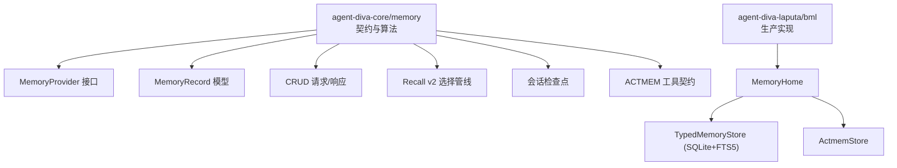
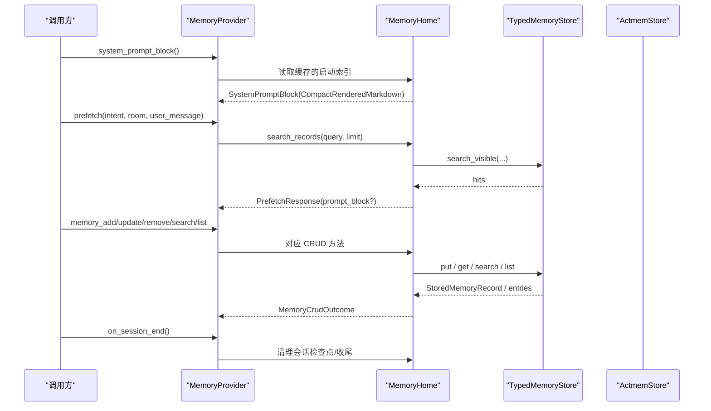
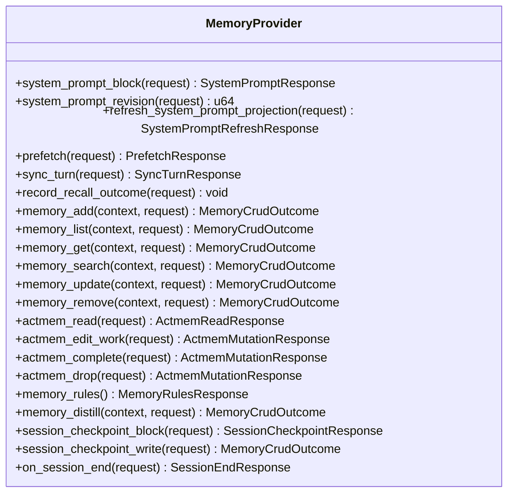
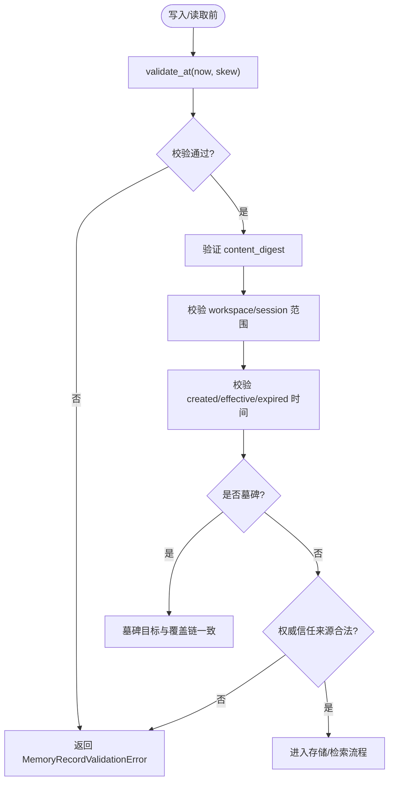
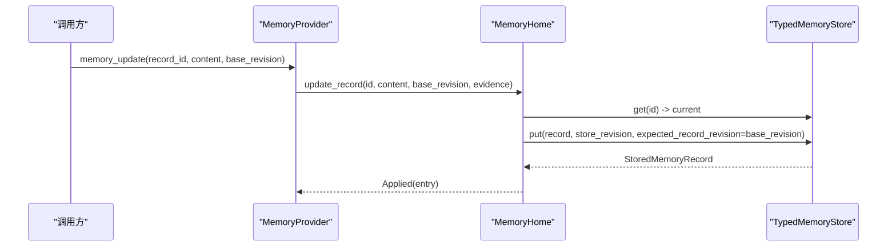
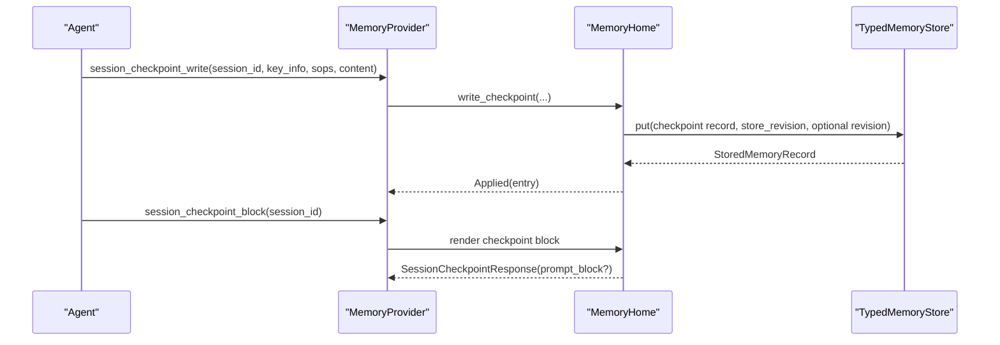
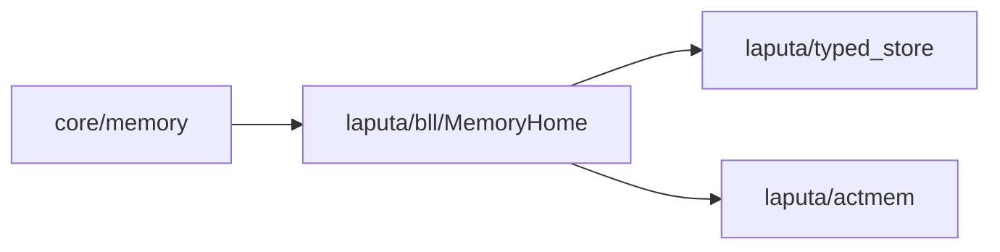

# BML 存储层

<cite>
**本文引用的文件**
- [agent-diva-core/src/memory/mod.rs](file://agent-diva-core/src/memory/mod.rs)
- [agent-diva-core/src/memory/provider.rs](file://agent-diva-core/src/memory/provider.rs)
- [agent-diva-core/src/memory/record.rs](file://agent-diva-core/src/memory/record.rs)
- [agent-diva-core/src/memory/crud.rs](file://agent-diva-core/src/memory/crud.rs)
- [agent-diva-core/src/memory/recall.rs](file://agent-diva-core/src/memory/recall.rs)
- [agent-diva-core/src/memory/working.rs](file://agent-diva-core/src/memory/working.rs)
- [agent-diva-core/src/memory/actmem.rs](file://agent-diva-core/src/memory/actmem.rs)
- [agent-diva-laputa/src/bml/mod.rs](file://agent-diva-laputa/src/bml/mod.rs)
- [agent-diva-laputa/src/bml/memory_home.rs](file://agent-diva-laputa/src/bml/memory_home.rs)
- [agent-diva-laputa/src/typed_store.rs](file://agent-diva-laputa/src/typed_store.rs)
</cite>

## 目录
1. [简介](#简介)
2. [项目结构](#项目结构)
3. [核心组件](#核心组件)
4. [架构总览](#架构总览)
5. [详细组件分析](#详细组件分析)
6. [依赖关系分析](#依赖关系分析)
7. [性能考量](#性能考量)
8. [故障排查指南](#故障排查指南)
9. [结论](#结论)
10. [附录：API 使用示例与配置](#附录api-使用示例与配置)

## 简介
本文件面向开发者，系统性说明 BML（行为记忆层）存储层的设计与实现。重点包括：
- MemoryProvider 接口契约、生命周期钩子与启动注入机制
- 持久化数据模型、CRUD 操作、索引与查询优化
- 会话工作区检查点、系统提示词注入与唤醒包处理
- 扩展存储后端与性能调优建议
- 错误处理模式与可观测性

BML 在 agent-diva-core 中定义领域契约（MemoryProvider、记录模型、召回管线等），在 agent-diva-laputa 中提供生产级实现（MemoryHome + TypedMemoryStore，基于 SQLite + FTS5）。

## 项目结构
BML 由“核心契约”和“生产实现”两部分组成：
- 核心契约位于 agent-diva-core/memory，包含 Provider 接口、记录模型、CRUD 请求/响应、Recall v2 选择管线、会话检查点与 ACTMEM 工具契约。
- 生产实现位于 agent-diva-laputa/bml，暴露 MemoryHome 作为机器级权威存储，并通过 TypedMemoryStore 管理 SQLite 数据库与 FTS5 全文检索。

图表来源
- [agent-diva-core/src/memory/mod.rs:1-47](file://agent-diva-core/src/memory/mod.rs#L1-L47)
- [agent-diva-core/src/memory/provider.rs:414-617](file://agent-diva-core/src/memory/provider.rs#L414-L617)
- [agent-diva-core/src/memory/record.rs:103-120](file://agent-diva-core/src/memory/record.rs#L103-L120)
- [agent-diva-core/src/memory/crud.rs:11-103](file://agent-diva-core/src/memory/crud.rs#L11-L103)
- [agent-diva-core/src/memory/recall.rs:214-359](file://agent-diva-core/src/memory/recall.rs#L214-L359)
- [agent-diva-core/src/memory/working.rs:20-52](file://agent-diva-core/src/memory/working.rs#L20-L52)
- [agent-diva-core/src/memory/actmem.rs:3-51](file://agent-diva-core/src/memory/actmem.rs#L3-L51)
- [agent-diva-laputa/src/bml/mod.rs:1-37](file://agent-diva-laputa/src/bml/mod.rs#L1-L37)
- [agent-diva-laputa/src/bml/memory_home.rs:85-125](file://agent-diva-laputa/src/bml/memory_home.rs#L85-L125)
- [agent-diva-laputa/src/typed_store.rs:476-506](file://agent-diva-laputa/src/typed_store.rs#L476-L506)

章节来源
- [agent-diva-core/src/memory/mod.rs:1-47](file://agent-diva-core/src/memory/mod.rs#L1-L47)
- [agent-diva-laputa/src/bml/mod.rs:1-37](file://agent-diva-laputa/src/bml/mod.rs#L1-L37)

## 核心组件
- MemoryProvider：Agent-Diva 与任意长时记忆后端的稳定边界，封装启动注入、预取、回合同步、会话结束等生命周期钩子，以及直接 CRUD 与 ACTMEM 能力。
- MemoryRecord：稳定的归一化记录模型，包含种类、可信度、敏感度、信任等级、范围、时间戳、证据引用、覆盖链与墓碑标记。
- CRUD：面向 Agent 的直接记忆写入/读取/搜索/更新/删除的领域请求与结果。
- Recall v2：确定性候选选择与预算管线，负责过滤、评分、去重、多样性、令牌预算控制与输出块生成。
- 会话检查点：会话内临时状态，支持渲染为结构化 Markdown 并注入到当前回合上下文。
- ACTMEM：Provider 中立的工作项、脉冲、回顾与胶囊读取/编辑契约。

章节来源
- [agent-diva-core/src/memory/provider.rs:414-617](file://agent-diva-core/src/memory/provider.rs#L414-L617)
- [agent-diva-core/src/memory/record.rs:103-120](file://agent-diva-core/src/memory/record.rs#L103-L120)
- [agent-diva-core/src/memory/crud.rs:11-103](file://agent-diva-core/src/memory/crud.rs#L11-L103)
- [agent-diva-core/src/memory/recall.rs:214-359](file://agent-diva-core/src/memory/recall.rs#L214-L359)
- [agent-diva-core/src/memory/working.rs:20-52](file://agent-diva-core/src/memory/working.rs#L20-L52)
- [agent-diva-core/src/memory/actmem.rs:3-51](file://agent-diva-core/src/memory/actmem.rs#L3-L51)

## 架构总览
BML 采用“契约-实现”分层：
- 契约层（core）：定义 MemoryProvider、记录模型、CRUD、Recall v2、会话检查点与 ACTMEM 契约。
- 实现层（laputa）：MemoryHome 作为机器级权威，组合 TypedMemoryStore（SQLite + FTS5）与 ActmemStore，实现 Provider 的所有方法。

图表来源
- [agent-diva-core/src/memory/provider.rs:414-617](file://agent-diva-core/src/memory/provider.rs#L414-L617)
- [agent-diva-laputa/src/bml/memory_home.rs:494-800](file://agent-diva-laputa/src/bml/memory_home.rs#L494-L800)
- [agent-diva-laputa/src/typed_store.rs:881-1023](file://agent-diva-laputa/src/typed_store.rs#L881-L1023)

## 详细组件分析

### MemoryProvider 接口与生命周期
- 启动注入：system_prompt_block 必须同步且无副作用；支持 system_prompt_revision 与 refresh_system_prompt_projection 以刷新缓存投影。
- 预取：prefetch 用于回合中的意图感知召回，返回可选 prompt_block；失败应降级而非抛错。
- 回合同步：sync_turn 用于成功回合后的持久化；默认 Noop，可由实现按需落盘。
- 会话结束：on_session_end 幂等执行收尾，如清理会话检查点。
- 直接 CRUD：memory_add/list/get/search/update/remove，默认不支持，需实现覆盖。
- ACTMEM：actmem_read/edit_work/complete/drop，默认不可用。
- 规则与经验蒸馏：memory_rules、memory_distill、session_checkpoint_*。

图表来源
- [agent-diva-core/src/memory/provider.rs:414-617](file://agent-diva-core/src/memory/provider.rs#L414-L617)

章节来源
- [agent-diva-core/src/memory/provider.rs:22-390](file://agent-diva-core/src/memory/provider.rs#L22-L390)
- [agent-diva-core/src/memory/provider.rs:414-617](file://agent-diva-core/src/memory/provider.rs#L414-L617)

### 数据存储模型与完整性
- MemoryRecord：包含 id、kind、content、provenance、evidence_refs、confidence_bps、sensitivity、trust、scope、时间戳、supersedes、tombstone。
- 校验：validate_at 检查必填字段、内容摘要一致性、时间合法性、覆盖链与墓碑约束、权威来源限制等。
- L1 索引：render_l1_index_block 仅注入紧凑索引行，完整条目通过 memory_search/list 获取。
- 安全转义：escape_memory_for_prompt 将内容包裹于非执行数据边界，防止提示注入。

图表来源
- [agent-diva-core/src/memory/record.rs:193-288](file://agent-diva-core/src/memory/record.rs#L193-L288)
- [agent-diva-core/src/memory/record.rs:291-350](file://agent-diva-core/src/memory/record.rs#L291-L350)

章节来源
- [agent-diva-core/src/memory/record.rs:103-120](file://agent-diva-core/src/memory/record.rs#L103-L120)
- [agent-diva-core/src/memory/record.rs:193-288](file://agent-diva-core/src/memory/record.rs#L193-L288)
- [agent-diva-core/src/memory/record.rs:291-350](file://agent-diva-core/src/memory/record.rs#L291-L350)

### CRUD 操作与事务语义
- add：创建 LongTerm 记录，生成唯一 id 与 digest，写入后刷新启动索引。
- update：CAS 更新，要求 base_revision 匹配，更新 provenance 与 effective_at。
- remove：软删除，写入墓碑记录，标记 supersedes 与 tombstone。
- list/get/search：只读路径，过滤被覆盖/墓碑记录，返回可见条目。
- 事务与并发：TypedMemoryStore 使用 store_revision 与 record_revision CAS，写锁串行化写路径，避免竞争。

图表来源
- [agent-diva-laputa/src/bml/memory_home.rs:238-282](file://agent-diva-laputa/src/bml/memory_home.rs#L238-L282)
- [agent-diva-laputa/src/typed_store.rs:881-1023](file://agent-diva-laputa/src/typed_store.rs#L881-L1023)

章节来源
- [agent-diva-core/src/memory/crud.rs:11-103](file://agent-diva-core/src/memory/crud.rs#L11-L103)
- [agent-diva-laputa/src/bml/memory_home.rs:205-346](file://agent-diva-laputa/src/bml/memory_home.rs#L205-L346)
- [agent-diva-laputa/src/typed_store.rs:881-1023](file://agent-diva-laputa/src/typed_store.rs#L881-L1023)

### 索引机制与查询优化
- L1 启动索引：DEFAULT_L1_INDEX_LINES 限制注入行数，仅首行预览，避免大内容注入。
- 全文检索：FTS5 支持 search_visible，按 scope 过滤，结合 superseded/tombstone 过滤可见性。
- 预取优化：prefetch 使用用户消息或 intent 作为 query，limit 默认较小，快速返回相关片段。
- 去重与多样性：Recall v2 对候选进行内容摘要去重与类别多样化，提升注入质量。

章节来源
- [agent-diva-core/src/memory/record.rs:314-350](file://agent-diva-core/src/memory/record.rs#L314-L350)
- [agent-diva-core/src/memory/recall.rs:214-359](file://agent-diva-core/src/memory/recall.rs#L214-L359)
- [agent-diva-laputa/src/bml/memory_home.rs:394-437](file://agent-diva-laputa/src/bml/memory_home.rs#L394-L437)

### 会话生命周期管理
- 检查点写入：SessionCheckpointWriteRequest 将 key_info、related_sops、content 渲染为结构化块，写入 session-scoped 记录。
- 检查点读取：SessionCheckpointRequest 渲染当前会话检查点块，供回合注入。
- 会话结束：on_session_end 可清理会话检查点或执行其他收尾逻辑。

图表来源
- [agent-diva-core/src/memory/working.rs:20-76](file://agent-diva-core/src/memory/working.rs#L20-L76)
- [agent-diva-laputa/src/bml/memory_home.rs:439-491](file://agent-diva-laputa/src/bml/memory_home.rs#L439-L491)

章节来源
- [agent-diva-core/src/memory/working.rs:20-76](file://agent-diva-core/src/memory/working.rs#L20-L76)
- [agent-diva-laputa/src/bml/memory_home.rs:439-491](file://agent-diva-laputa/src/bml/memory_home.rs#L439-L491)

### 系统提示词注入与唤醒包处理
- StartupContextSnapshot：聚合 memory/soul/wakeup/wakeup_pack，渲染为 CompactRenderedMarkdown。
- 降级策略：当无法生成可用唤醒包时，返回 Degraded 状态并注入降级提示。
- 启动索引：MemoryHome 维护 startup_markdown 与 startup_revision，写入后原子更新。

章节来源
- [agent-diva-core/src/memory/provider.rs:127-180](file://agent-diva-core/src/memory/provider.rs#L127-L180)
- [agent-diva-core/src/memory/provider.rs:237-279](file://agent-diva-core/src/memory/provider.rs#L237-L279)
- [agent-diva-laputa/src/bml/memory_home.rs:394-418](file://agent-diva-laputa/src/bml/memory_home.rs#L394-L418)

### ACTMEM 与规则
- ACTMEM：读取 Pulse/Recap/Work/Head/Capsules，编辑 Work 项，完成/丢弃 Open 项。
- MEMRULES：读取/写入规则文档，作为写入时的行为约束。

章节来源
- [agent-diva-core/src/memory/actmem.rs:3-51](file://agent-diva-core/src/memory/actmem.rs#L3-L51)
- [agent-diva-laputa/src/bml/memory_home.rs:348-372](file://agent-diva-laputa/src/bml/memory_home.rs#L348-L372)
- [agent-diva-laputa/src/bml/memory_home.rs:712-796](file://agent-diva-laputa/src/bml/memory_home.rs#L712-L796)

## 依赖关系分析
- core/memory 提供稳定契约，不依赖具体存储实现。
- laputa/bml 依赖 core/memory 契约，组合 TypedMemoryStore 与 ActmemStore 实现 MemoryProvider。
- TypedMemoryStore 管理 SQLite schema、元数据、容量限制、并发写锁与 CAS 语义。

图表来源
- [agent-diva-core/src/memory/mod.rs:1-47](file://agent-diva-core/src/memory/mod.rs#L1-L47)
- [agent-diva-laputa/src/bml/mod.rs:1-37](file://agent-diva-laputa/src/bml/mod.rs#L1-L37)
- [agent-diva-laputa/src/typed_store.rs:476-506](file://agent-diva-laputa/src/typed_store.rs#L476-L506)

章节来源
- [agent-diva-core/src/memory/mod.rs:1-47](file://agent-diva-core/src/memory/mod.rs#L1-L47)
- [agent-diva-laputa/src/bml/mod.rs:1-37](file://agent-diva-laputa/src/bml/mod.rs#L1-L37)

## 性能考量
- 启动索引预算：DEFAULT_L1_INDEX_LINES 限制注入行数，避免上下文膨胀。
- 预取限制：prefetch 默认 limit 较小，减少不必要 I/O。
- 去重与多样性：Recall v2 基于内容摘要去重并按类别多样化，提高注入质量与稳定性。
- 令牌预算：ConservativeRecallTokenEstimator 保守估算，确保注入不超过预算。
- 写路径串行化：TypedMemoryStore 使用写锁与 store_revision CAS，避免并发冲突。
- 容量限制：MAX_MEMORY_RECORDS 与 MAX_MEMORY_CONTENT_BYTES 防止存储膨胀。

章节来源
- [agent-diva-core/src/memory/record.rs:314-350](file://agent-diva-core/src/memory/record.rs#L314-L350)
- [agent-diva-core/src/memory/recall.rs:199-212](file://agent-diva-core/src/memory/recall.rs#L199-L212)
- [agent-diva-core/src/memory/recall.rs:214-359](file://agent-diva-core/src/memory/recall.rs#L214-L359)
- [agent-diva-laputa/src/typed_store.rs:881-1023](file://agent-diva-laputa/src/typed_store.rs#L881-L1023)

## 故障排查指南
- 启动注入降级：若 wakeup 生成失败，返回 Degraded 状态并注入降级提示，检查上游数据源与缓存。
- 预取失败：返回 Failed 状态与原因，检查 FTS5 索引与数据库可用性。
- 更新/删除冲突：RevisionConflict 表示 base_revision 不匹配，需重新读取最新记录。
- 容量超限：CapacityExceeded 表明记录数或内容字节超过上限，需清理或归档历史。
- 会话检查点无效：空 session_id 或校验失败，检查输入与时间窗口。

章节来源
- [agent-diva-core/src/memory/provider.rs:22-65](file://agent-diva-core/src/memory/provider.rs#L22-L65)
- [agent-diva-laputa/src/bml/memory_home.rs:39-70](file://agent-diva-laputa/src/bml/memory_home.rs#L39-L70)
- [agent-diva-laputa/src/typed_store.rs:881-1023](file://agent-diva-laputa/src/typed_store.rs#L881-L1023)

## 结论
BML 存储层通过清晰的契约与稳健的实现，提供了可扩展、可观测、高性能的记忆管理能力。MemoryProvider 抽象屏蔽了底层存储细节，Recall v2 保证了注入质量与预算可控，会话检查点与 ACTMEM 增强了运行时灵活性。开发者可基于此扩展新的存储后端或优化现有实现。

## 附录：API 使用示例与配置
以下示例展示典型用法与关键配置点，具体实现请参考对应源码路径。

- 启动注入
  - 调用 system_prompt_block，获取 CompactRenderedMarkdown 块。
  - 参考：[agent-diva-core/src/memory/provider.rs:414-432](file://agent-diva-core/src/memory/provider.rs#L414-L432)

- 预取召回
  - 构造 PrefetchRequest(intent, current_room, user_message)，调用 prefetch。
  - 参考：[agent-diva-core/src/memory/provider.rs:281-314](file://agent-diva-core/src/memory/provider.rs#L281-L314)

- 直接 CRUD
  - memory_add：提交事实或偏好，可选 evidence_refs。
  - memory_update：CAS 更新，需提供 base_revision。
  - memory_remove：软删除，需提供 reason 与 base_revision。
  - 参考：[agent-diva-core/src/memory/crud.rs:11-103](file://agent-diva-core/src/memory/crud.rs#L11-L103)

- 会话检查点
  - 写入：SessionCheckpointWriteRequest(key_info, related_sops, content)。
  - 读取：SessionCheckpointRequest(workspace_root, session_id)。
  - 参考：[agent-diva-core/src/memory/working.rs:20-76](file://agent-diva-core/src/memory/working.rs#L20-L76)

- 规则与 ACTMEM
  - 读取/写入 MEMRULES，读取/编辑 ACTMEM Work/Pulse/Recap。
  - 参考：[agent-diva-core/src/memory/actmem.rs:3-51](file://agent-diva-core/src/memory/actmem.rs#L3-L51)
  - 参考：[agent-diva-laputa/src/bml/memory_home.rs:348-372](file://agent-diva-laputa/src/bml/memory_home.rs#L348-L372)

- 配置选项
  - L1 索引行数：DEFAULT_L1_INDEX_LINES（可通过 with_l1_budget 调整）。
  - 令牌预算：RecallRequest.token_budget。
  - 最大候选：RecallRequest.max_candidates。
  - 参考：[agent-diva-core/src/memory/record.rs:314-317](file://agent-diva-core/src/memory/record.rs#L314-L317)
  - 参考：[agent-diva-core/src/memory/recall.rs:58-68](file://agent-diva-core/src/memory/recall.rs#L58-L68)

- 错误处理模式
  - 使用确定性状态枚举（PrefetchStatus、SyncTurnStatus、SessionEndStatus）表达结果。
  - 失败优先降级而非抛错，保证回合继续。
  - 参考：[agent-diva-core/src/memory/provider.rs:77-111](file://agent-diva-core/src/memory/provider.rs#L77-L111)