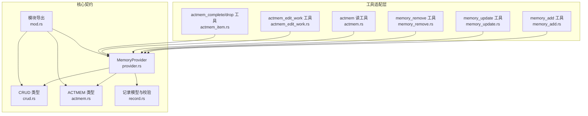
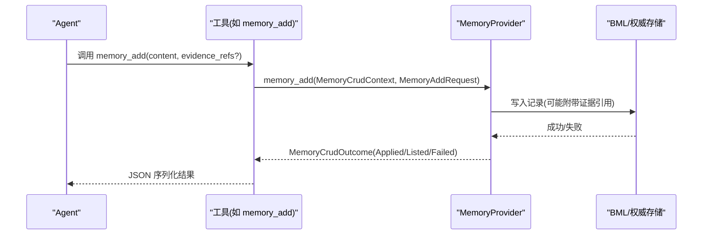
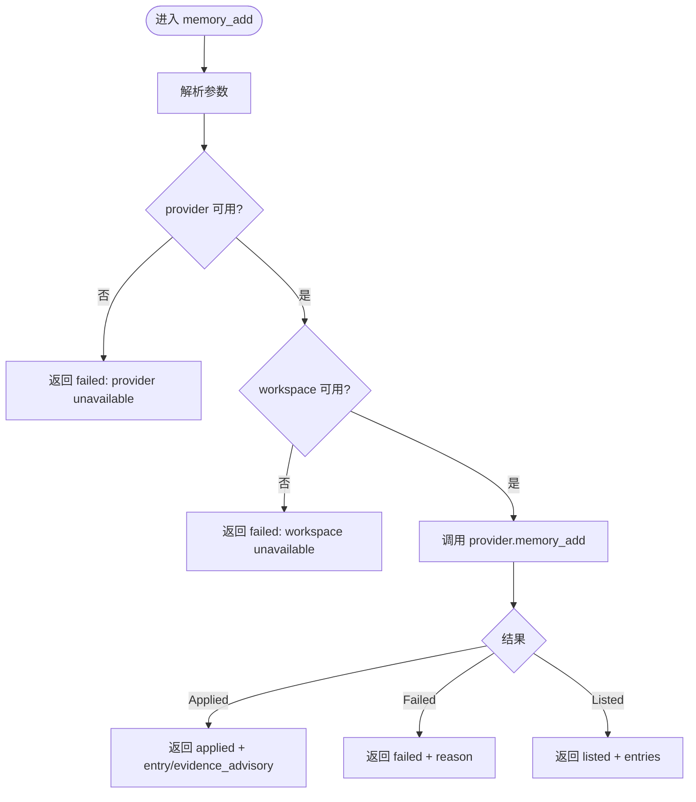
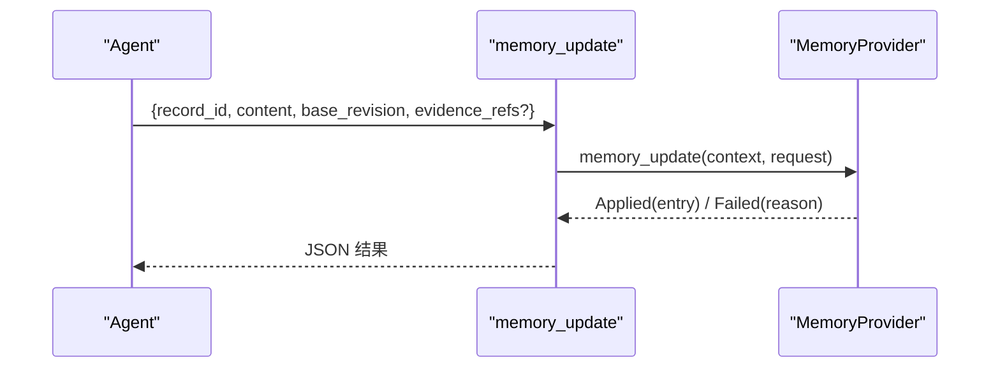
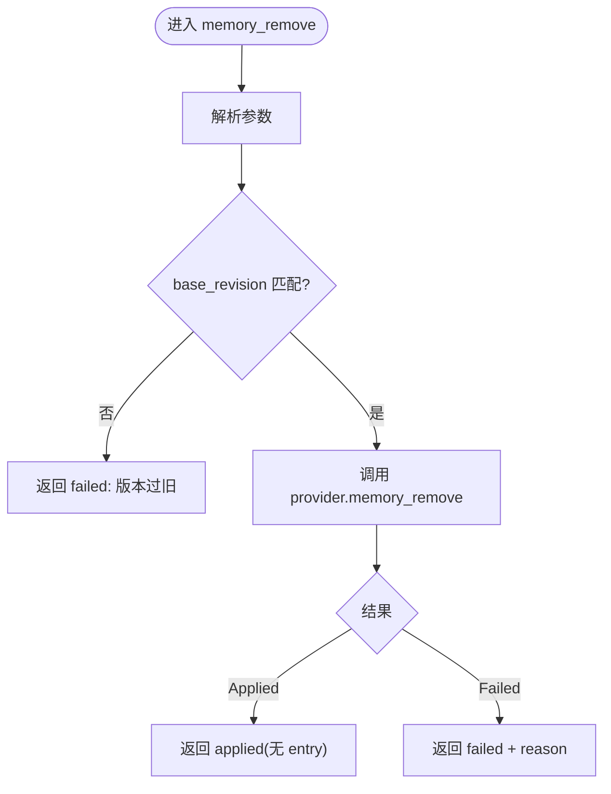
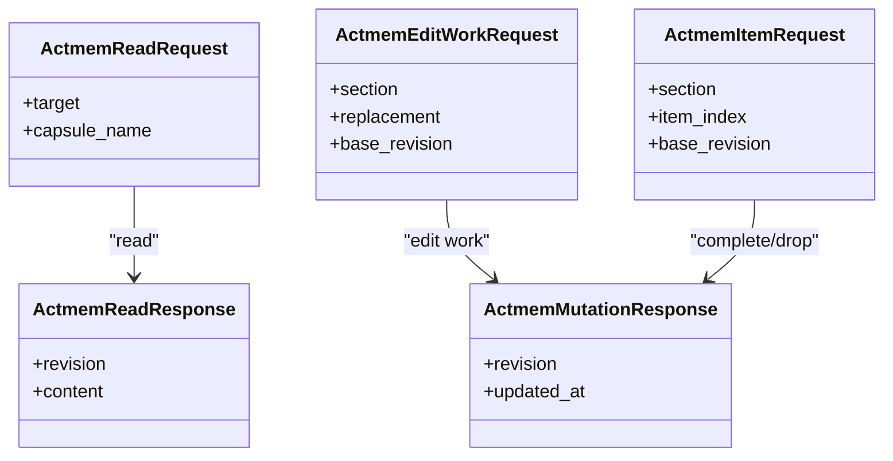
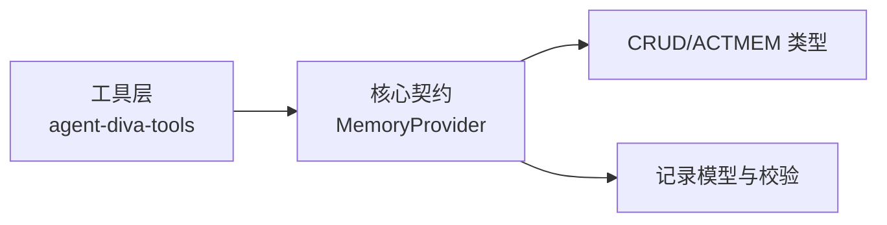

# 记忆 CRUD 操作

<cite>
**本文引用的文件**
- [agent-diva-core/src/memory/crud.rs](file://agent-diva-core/src/memory/crud.rs)
- [agent-diva-core/src/memory/actmem.rs](file://agent-diva-core/src/memory/actmem.rs)
- [agent-diva-core/src/memory/provider.rs](file://agent-diva-core/src/memory/provider.rs)
- [agent-diva-core/src/memory/mod.rs](file://agent-diva-core/src/memory/mod.rs)
- [agent-diva-core/src/memory/record.rs](file://agent-diva-core/src/memory/record.rs)
- [agent-diva-tools/src/memory_add.rs](file://agent-diva-tools/src/memory_add.rs)
- [agent-diva-tools/src/memory_update.rs](file://agent-diva-tools/src/memory_update.rs)
- [agent-diva-tools/src/memory_remove.rs](file://agent-diva-tools/src/memory_remove.rs)
- [agent-diva-tools/src/actmem.rs](file://agent-diva-tools/src/actmem.rs)
- [agent-diva-tools/src/actmem_edit_work.rs](file://agent-diva-tools/src/actmem_edit_work.rs)
- [agent-diva-tools/src/actmem_item.rs](file://agent-diva-tools/src/actmem_item.rs)
</cite>

## 目录
1. [简介](#简介)
2. [项目结构](#项目结构)
3. [核心组件](#核心组件)
4. [架构总览](#架构总览)
5. [详细组件分析](#详细组件分析)
6. [依赖关系分析](#依赖关系分析)
7. [性能与并发特性](#性能与并发特性)
8. [故障排查指南](#故障排查指南)
9. [结论](#结论)
10. [附录：API 参考与调用示例](#附录api-参考与调用示例)

## 简介
本文件面向开发者，系统化说明 Agent-Diva 的记忆 CRUD 能力与 ACTMEM 操作，覆盖增删改查接口、请求/响应结构、验证规则、事务与并发控制（基于版本号的比较交换）、以及批量处理能力。文档同时提供 API 调用示例、参数说明和返回值格式，帮助正确实现记忆管理功能。

## 项目结构
记忆系统由“核心契约 + 工具适配层”组成：
- 核心契约位于 agent-diva-core/memory，定义 MemoryProvider 接口、CRUD 请求/响应、ACTMEM 读写契约、记录模型与校验。
- 工具适配层位于 agent-diva-tools，将 MemoryProvider 暴露为可被 Agent 调用的工具（如 memory_add、memory_update、memory_remove、actmem_*）。

**图表来源**
- [agent-diva-core/src/memory/provider.rs:414-617](file://agent-diva-core/src/memory/provider.rs#L414-L617)
- [agent-diva-core/src/memory/crud.rs:11-143](file://agent-diva-core/src/memory/crud.rs#L11-L143)
- [agent-diva-core/src/memory/actmem.rs:3-50](file://agent-diva-core/src/memory/actmem.rs#L3-L50)
- [agent-diva-core/src/memory/record.rs:103-288](file://agent-diva-core/src/memory/record.rs#L103-L288)
- [agent-diva-core/src/memory/mod.rs:6-46](file://agent-diva-core/src/memory/mod.rs#L6-L46)
- [agent-diva-tools/src/memory_add.rs:41-88](file://agent-diva-tools/src/memory_add.rs#L41-L88)
- [agent-diva-tools/src/memory_update.rs:41-79](file://agent-diva-tools/src/memory_update.rs#L41-L79)
- [agent-diva-tools/src/memory_remove.rs:41-79](file://agent-diva-tools/src/memory_remove.rs#L41-L79)
- [agent-diva-tools/src/actmem.rs:32-66](file://agent-diva-tools/src/actmem.rs#L32-L66)
- [agent-diva-tools/src/actmem_edit_work.rs:32-63](file://agent-diva-tools/src/actmem_edit_work.rs#L32-L63)
- [agent-diva-tools/src/actmem_item.rs:51-108](file://agent-diva-tools/src/actmem_item.rs#L51-L108)

**章节来源**
- [agent-diva-core/src/memory/mod.rs:1-46](file://agent-diva-core/src/memory/mod.rs#L1-L46)

## 核心组件
- MemoryProvider：统一抽象，包含启动提示注入、预取召回、回合同步、会话结束钩子，以及记忆 CRUD 与 ACTMEM 读写方法。默认实现返回“不支持”，具体后端需覆写。
- CRUD 请求/响应：
  - MemoryAddRequest：低风险的即时写入（用户确认的事实或偏好），可选证据引用。
  - MemoryUpdateRequest：直接对 BML 的 CAS 更新，需要 record_id、content、base_revision、可选 evidence_refs。
  - MemoryRemoveRequest：直接对 BML 的 CAS 软删除，需要 record_id、reason、base_revision。
  - MemoryListRequest/MemorySearchRequest/MemoryGetRequest：列表、搜索、按 id 获取。
  - MemoryCrudOutcome：统一结果枚举，包含 Applied/Listed/Failed。
  - MemoryEntry：可见记录的投影字段（id、content、trust、provenance、evidence_refs、revision、created_at、updated_at）。
- ACTMEM 契约：
  - ActmemReadTarget：pulse/recap/work/head/capsules/capsule。
  - ActmemReadRequest/Response：读取有界投影。
  - ActmemEditWorkRequest：替换 Work 某小节（带 base_revision）。
  - ActmemItemRequest：完成或删除某项（带 base_revision）。
  - ActmemMutationResponse：变更后的 revision 与 updated_at。
  - MemoryRulesResponse：记忆写作手册内容。
- 记录模型与校验：
  - MemoryRecord：稳定记录结构，含 kind、provenance、scope、信任等级、时间戳、失效策略等。
  - 校验规则：必填字段、摘要一致性、置信度范围、时间合法性、自覆盖检查、墓碑约束、权威来源限制、工作区隔离等。

**章节来源**
- [agent-diva-core/src/memory/provider.rs:414-617](file://agent-diva-core/src/memory/provider.rs#L414-L617)
- [agent-diva-core/src/memory/crud.rs:11-143](file://agent-diva-core/src/memory/crud.rs#L11-L143)
- [agent-diva-core/src/memory/actmem.rs:3-50](file://agent-diva-core/src/memory/actmem.rs#L3-L50)
- [agent-diva-core/src/memory/record.rs:103-288](file://agent-diva-core/src/memory/record.rs#L103-L288)

## 架构总览
Agent 通过工具调用记忆能力；工具解析参数并委托给 MemoryProvider；Provider 负责持久化到 BML 或其他权威存储，并以统一的 MemoryCrudOutcome 返回结果。ACTMEM 提供运行时工作区视图的只读与受限修改能力。

**图表来源**
- [agent-diva-tools/src/memory_add.rs:41-88](file://agent-diva-tools/src/memory_add.rs#L41-L88)
- [agent-diva-core/src/memory/provider.rs:471-481](file://agent-diva-core/src/memory/provider.rs#L471-L481)
- [agent-diva-core/src/memory/crud.rs:11-127](file://agent-diva-core/src/memory/crud.rs#L11-L127)

## 详细组件分析

### 记忆写入：memory_add
- 作用：低风险即时写入用户确认的事实或偏好。
- 关键参数：content（必填）、evidence_refs（可选）。
- 执行流程：工具解析请求 -> 检查 provider/workspace -> 调用 provider.memory_add -> 返回统一结果。
- 错误处理：未配置 provider 或 workspace 时返回 Failed；参数解析失败返回 ToolError；底层异常包装为 ExecutionFailed。
- 并发与一致性：写入由 Provider 实现保证；若需强一致，建议使用 update/remove 的 CAS 机制。

**图表来源**
- [agent-diva-tools/src/memory_add.rs:41-88](file://agent-diva-tools/src/memory_add.rs#L41-L88)
- [agent-diva-core/src/memory/crud.rs:105-136](file://agent-diva-core/src/memory/crud.rs#L105-L136)

**章节来源**
- [agent-diva-tools/src/memory_add.rs:1-114](file://agent-diva-tools/src/memory_add.rs#L1-L114)
- [agent-diva-core/src/memory/crud.rs:11-19](file://agent-diva-core/src/memory/crud.rs#L11-L19)

### 记忆更新：memory_update（CAS）
- 作用：基于 base_revision 的直接更新，避免并发覆盖。
- 关键参数：record_id、content、base_revision（必填）、evidence_refs（可选）。
- 行为：若 base_revision 不匹配则拒绝，不改变 BML。
- 错误处理：同 memory_add 的错误路径。

**图表来源**
- [agent-diva-tools/src/memory_update.rs:41-79](file://agent-diva-tools/src/memory_update.rs#L41-L79)
- [agent-diva-core/src/memory/crud.rs:44-56](file://agent-diva-core/src/memory/crud.rs#L44-L56)

**章节来源**
- [agent-diva-tools/src/memory_update.rs:1-105](file://agent-diva-tools/src/memory_update.rs#L1-L105)
- [agent-diva-core/src/memory/crud.rs:44-56](file://agent-diva-core/src/memory/crud.rs#L44-L56)

### 记忆删除：memory_remove（CAS 软删除）
- 作用：基于 base_revision 的软删除，生成墓碑以隐藏记录。
- 关键参数：record_id、reason、base_revision（必填）。
- 行为：若 base_revision 不匹配则拒绝；成功后立即隐藏该记录。
- 错误处理：同 memory_add/update。

**图表来源**
- [agent-diva-tools/src/memory_remove.rs:41-79](file://agent-diva-tools/src/memory_remove.rs#L41-L79)
- [agent-diva-core/src/memory/crud.rs:58-67](file://agent-diva-core/src/memory/crud.rs#L58-L67)

**章节来源**
- [agent-diva-tools/src/memory_remove.rs:1-105](file://agent-diva-tools/src/memory_remove.rs#L1-L105)
- [agent-diva-core/src/memory/crud.rs:58-67](file://agent-diva-core/src/memory/crud.rs#L58-L67)

### 记忆查询：list/get/search
- memory_list：列出已应用的记忆投影，支持 limit。
- memory_get：按稳定 id 获取单条可见记录。
- memory_search：在应用权威中按全文检索，支持 limit。
- 这些方法默认返回“不支持”，需 Provider 实现。

**章节来源**
- [agent-diva-core/src/memory/crud.rs:21-42](file://agent-diva-core/src/memory/crud.rs#L21-L42)
- [agent-diva-core/src/memory/provider.rs:483-508](file://agent-diva-core/src/memory/provider.rs#L483-L508)

### ACTMEM 操作
- actmem_read：读取有界投影（pulse/recap/work/head/capsules/capsule）。
- actmem_edit_work：以 base_revision 替换 Work 某小节（Goal/Open/Next/Constraints/Pointers）。
- actmem_complete / actmem_drop：完成或删除某项，使用 base_revision 进行 CAS。
- 所有写操作均返回新的 revision 与 updated_at，便于后续并发控制。

**图表来源**
- [agent-diva-core/src/memory/actmem.rs:3-50](file://agent-diva-core/src/memory/actmem.rs#L3-L50)
- [agent-diva-tools/src/actmem.rs:32-66](file://agent-diva-tools/src/actmem.rs#L32-L66)
- [agent-diva-tools/src/actmem_edit_work.rs:32-63](file://agent-diva-tools/src/actmem_edit_work.rs#L32-L63)
- [agent-diva-tools/src/actmem_item.rs:51-108](file://agent-diva-tools/src/actmem_item.rs#L51-L108)

**章节来源**
- [agent-diva-core/src/memory/actmem.rs:1-51](file://agent-diva-core/src/memory/actmem.rs#L1-L51)
- [agent-diva-tools/src/actmem.rs:1-68](file://agent-diva-tools/src/actmem.rs#L1-L68)
- [agent-diva-tools/src/actmem_edit_work.rs:1-65](file://agent-diva-tools/src/actmem_edit_work.rs#L1-L65)
- [agent-diva-tools/src/actmem_item.rs:1-110](file://agent-diva-tools/src/actmem_item.rs#L1-L110)

### 记忆验证规则
- 记录级校验：
  - 必填字段：id、scope.tenant_id、scope.workspace_id、provenance.source_id 等。
  - 摘要一致性：非墓碑记录的 content 必须与 provenance.content_digest 匹配。
  - 置信度范围：0~10000 bps。
  - 时间约束：created_at 不得晚于当前时间（允许时钟偏差），effective_at 不得早于 created_at，expires_at 必须晚于 effective_at。
  - 覆盖与墓碑：禁止自覆盖；墓碑必须指向被覆盖记录且不含内容。
  - 权威来源限制：trust=applied_authority 的记录仅允许特定来源；证据来源也受限制。
  - 工作区隔离：跨工作区的记录会被拒绝。
- 工具级校验：
  - 参数解析失败会返回 ToolError::InvalidArguments。
  - 缺少 provider/workspace 会返回明确的 failed 原因。

**章节来源**
- [agent-diva-core/src/memory/record.rs:103-288](file://agent-diva-core/src/memory/record.rs#L103-L288)
- [agent-diva-tools/src/memory_add.rs:64-88](file://agent-diva-tools/src/memory_add.rs#L64-L88)
- [agent-diva-tools/src/memory_update.rs:55-79](file://agent-diva-tools/src/memory_update.rs#L55-L79)
- [agent-diva-tools/src/memory_remove.rs:55-79](file://agent-diva-tools/src/memory_remove.rs#L55-L79)

### 事务处理与并发控制
- 比较交换（CAS）：
  - memory_update 与 memory_remove 要求 base_revision，确保并发安全；版本不匹配即拒绝。
  - ACTMEM 的 edit_work、complete、drop 同样基于 base_revision 进行 CAS。
- 幂等与状态：
  - Provider 默认返回“不支持”，实现方可选择幂等语义（例如重复删除视为成功）。
  - 会话结束钩子 on_session_end 应幂等，避免重复处理。
- 回退与降级：
  - 启动阶段若不可用，返回 Degraded 并给出原因；不应静默回退到次要数据源。
  - 预取召回失败应返回 PrefetchStatus::Failed，而非顶层错误，以便回合继续。

**章节来源**
- [agent-diva-core/src/memory/provider.rs:22-33](file://agent-diva-core/src/memory/provider.rs#L22-L33)
- [agent-diva-core/src/memory/provider.rs:77-98](file://agent-diva-core/src/memory/provider.rs#L77-L98)
- [agent-diva-core/src/memory/provider.rs:414-617](file://agent-diva-core/src/memory/provider.rs#L414-L617)
- [agent-diva-core/src/memory/crud.rs:44-67](file://agent-diva-core/src/memory/crud.rs#L44-L67)
- [agent-diva-core/src/memory/actmem.rs:26-44](file://agent-diva-core/src/memory/actmem.rs#L26-L44)

### 批量处理能力
- 当前公开接口以单条记录为主（add/update/remove/get/list/search）。
- 批量能力可通过多次调用工具实现；Provider 可在内部合并写入以提升吞吐，但对外仍遵循单条契约。
- 对于 ACTMEM，Work 小节整体替换（edit_work）可实现局部批式更新。

**章节来源**
- [agent-diva-core/src/memory/crud.rs:11-67](file://agent-diva-core/src/memory/crud.rs#L11-L67)
- [agent-diva-core/src/memory/actmem.rs:26-44](file://agent-diva-core/src/memory/actmem.rs#L26-L44)

## 依赖关系分析
- 工具层依赖 core 的 MemoryProvider 与 CRUD/ACTMEM 类型。
- Provider 是核心契约，解耦了传输与存储细节。
- 记录模型与校验独立于工具层，确保写入数据的完整性与一致性。

**图表来源**
- [agent-diva-core/src/memory/provider.rs:414-617](file://agent-diva-core/src/memory/provider.rs#L414-L617)
- [agent-diva-core/src/memory/crud.rs:11-143](file://agent-diva-core/src/memory/crud.rs#L11-L143)
- [agent-diva-core/src/memory/actmem.rs:3-50](file://agent-diva-core/src/memory/actmem.rs#L3-L50)
- [agent-diva-core/src/memory/record.rs:103-288](file://agent-diva-core/src/memory/record.rs#L103-L288)

**章节来源**
- [agent-diva-core/src/memory/mod.rs:6-46](file://agent-diva-core/src/memory/mod.rs#L6-L46)

## 性能与并发特性
- 并发控制：通过 base_revision 的 CAS 避免覆盖冲突；适用于 update/remove 与 ACTMEM 写操作。
- 启动与召回：
  - system_prompt_block 同步且无副作用，适合快速构建系统提示。
  - prefetch 异步，失败应降级而不中断回合。
- 写入路径：
  - sync_turn 用于回合后持久化，失败应尽可能报告为 Failed 而非抛错，保障会话继续。
- 索引与检索：
  - L1 索引块仅注入少量指针，完整条目通过 memory_search/list 获取，减少上下文开销。

**章节来源**
- [agent-diva-core/src/memory/provider.rs:391-413](file://agent-diva-core/src/memory/provider.rs#L391-L413)
- [agent-diva-core/src/memory/record.rs:314-350](file://agent-diva-core/src/memory/record.rs#L314-L350)

## 故障排查指南
- 常见错误与定位：
  - “memory provider unavailable”：工具未注入 provider，检查初始化与依赖注入。
  - “memory workspace unavailable”：未传入 workspace_root，检查 MemoryCrudContext。
  - “invalid arguments”：JSON 参数不符合 schema，检查必填字段与类型。
  - “stale revision”：update/remove/base_revision 不匹配，先读取最新 revision 再重试。
  - “not supported by this memory provider”：Provider 未实现对应方法，需扩展实现。
- 调试建议：
  - 打印 MemoryCrudOutcome 的 status 与 reason。
  - 对 ACTMEM 写操作，记录返回的 revision 与 updated_at，确认变更生效。
  - 对记录校验失败，检查 content 与 digest、时间戳、信任等级与工作区归属。

**章节来源**
- [agent-diva-tools/src/memory_add.rs:64-88](file://agent-diva-tools/src/memory_add.rs#L64-L88)
- [agent-diva-tools/src/memory_update.rs:55-79](file://agent-diva-tools/src/memory_update.rs#L55-L79)
- [agent-diva-tools/src/memory_remove.rs:55-79](file://agent-diva-tools/src/memory_remove.rs#L55-L79)
- [agent-diva-core/src/memory/crud.rs:105-136](file://agent-diva-core/src/memory/crud.rs#L105-L136)
- [agent-diva-core/src/memory/record.rs:153-288](file://agent-diva-core/src/memory/record.rs#L153-L288)

## 结论
Agent-Diva 的记忆 CRUD 与 ACTMEM 能力通过稳定的 Provider 契约暴露，结合 CAS 与严格的记录校验，提供了高可靠、可审计、可并发控制的记忆管理能力。开发者应优先使用 memory_update/memory_remove 的 base_revision 进行并发安全更新，并通过 memory_search/list 进行高效检索。ACTMEM 提供运行时工作区的受限读写，适合任务编排与短期协作。

## 附录：API 参考与调用示例

### 通用约定
- 所有工具返回 JSON 字符串，包含 MemoryCrudOutcome 或对应响应结构。
- 错误分为两类：
  - 工具层错误：ToolError（如 InvalidArguments、ExecutionFailed）。
  - 领域错误：MemoryCrudOutcome::Failed{ reason }。

### memory_add
- 用途：新增一条记忆。
- 请求体字段：
  - content: string（必填）
  - evidence_refs: array（可选）
- 返回：
  - status: "applied" | "listed" | "failed"
  - applied.entry: MemoryEntry（可选）
  - applied.evidence_advisory: string（可选）
  - failed.reason: string
- 示例（概念性）：
  - 输入：{"content": "用户偏好蓝色", "evidence_refs": []}
  - 输出：{"status": "applied", "entry": {...}}

**章节来源**
- [agent-diva-core/src/memory/crud.rs:11-19](file://agent-diva-core/src/memory/crud.rs#L11-L19)
- [agent-diva-core/src/memory/crud.rs:105-136](file://agent-diva-core/src/memory/crud.rs#L105-L136)
- [agent-diva-tools/src/memory_add.rs:41-88](file://agent-diva-tools/src/memory_add.rs#L41-L88)

### memory_update
- 用途：基于版本号的更新。
- 请求体字段：
  - record_id: string（必填）
  - content: string（必填）
  - base_revision: integer（必填，最小值 1）
  - evidence_refs: array（可选）
- 返回：同 MemoryCrudOutcome。
- 示例（概念性）：
  - 输入：{"record_id": "rec-1", "content": "用户偏好蓝色（修正）", "base_revision": 3}
  - 输出：{"status": "applied", "entry": {...}}

**章节来源**
- [agent-diva-core/src/memory/crud.rs:44-56](file://agent-diva-core/src/memory/crud.rs#L44-L56)
- [agent-diva-core/src/memory/crud.rs:105-136](file://agent-diva-core/src/memory/crud.rs#L105-L136)
- [agent-diva-tools/src/memory_update.rs:41-79](file://agent-diva-tools/src/memory_update.rs#L41-L79)

### memory_remove
- 用途：基于版本号的软删除。
- 请求体字段：
  - record_id: string（必填）
  - reason: string（必填）
  - base_revision: integer（必填，最小值 1）
- 返回：同 MemoryCrudOutcome。
- 示例（概念性）：
  - 输入：{"record_id": "rec-1", "reason": "过时信息", "base_revision": 4}
  - 输出：{"status": "applied"}

**章节来源**
- [agent-diva-core/src/memory/crud.rs:58-67](file://agent-diva-core/src/memory/crud.rs#L58-L67)
- [agent-diva-core/src/memory/crud.rs:105-136](file://agent-diva-core/src/memory/crud.rs#L105-L136)
- [agent-diva-tools/src/memory_remove.rs:41-79](file://agent-diva-tools/src/memory_remove.rs#L41-L79)

### memory_list / memory_search / memory_get
- memory_list：
  - 请求：limit（可选）
  - 返回：{"status": "listed", "entries": [...]}
- memory_search：
  - 请求：query（必填）、limit（可选）
  - 返回：{"status": "listed", "entries": [...]}
- memory_get：
  - 请求：record_id（必填）
  - 返回：{"status": "applied", "entry": {...}} 或 failed

**章节来源**
- [agent-diva-core/src/memory/crud.rs:21-42](file://agent-diva-core/src/memory/crud.rs#L21-L42)
- [agent-diva-core/src/memory/crud.rs:105-136](file://agent-diva-core/src/memory/crud.rs#L105-L136)

### ACTMEM 读
- actmem：
  - 请求：target（enum: pulse/recap/work/head/capsules/capsule）、capsule_name（可选）
  - 返回：{"revision": number, "content": string}

**章节来源**
- [agent-diva-core/src/memory/actmem.rs:3-24](file://agent-diva-core/src/memory/actmem.rs#L3-L24)
- [agent-diva-tools/src/actmem.rs:32-66](file://agent-diva-tools/src/actmem.rs#L32-L66)

### ACTMEM 写
- actmem_edit_work：
  - 请求：section（enum: Goal/Open/Next/Constraints/Pointers）、replacement（string）、base_revision（integer）
  - 返回：{"revision": number, "updated_at": string}
- actmem_complete / actmem_drop：
  - 请求：section、item_index（zero-based）、base_revision
  - 返回：同上

**章节来源**
- [agent-diva-core/src/memory/actmem.rs:26-44](file://agent-diva-core/src/memory/actmem.rs#L26-L44)
- [agent-diva-tools/src/actmem_edit_work.rs:32-63](file://agent-diva-tools/src/actmem_edit_work.rs#L32-L63)
- [agent-diva-tools/src/actmem_item.rs:51-108](file://agent-diva-tools/src/actmem_item.rs#L51-L108)