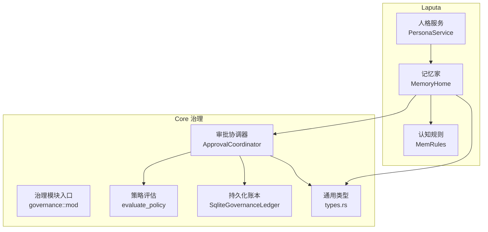
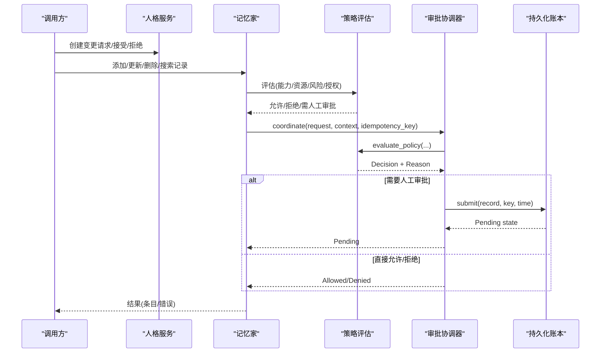
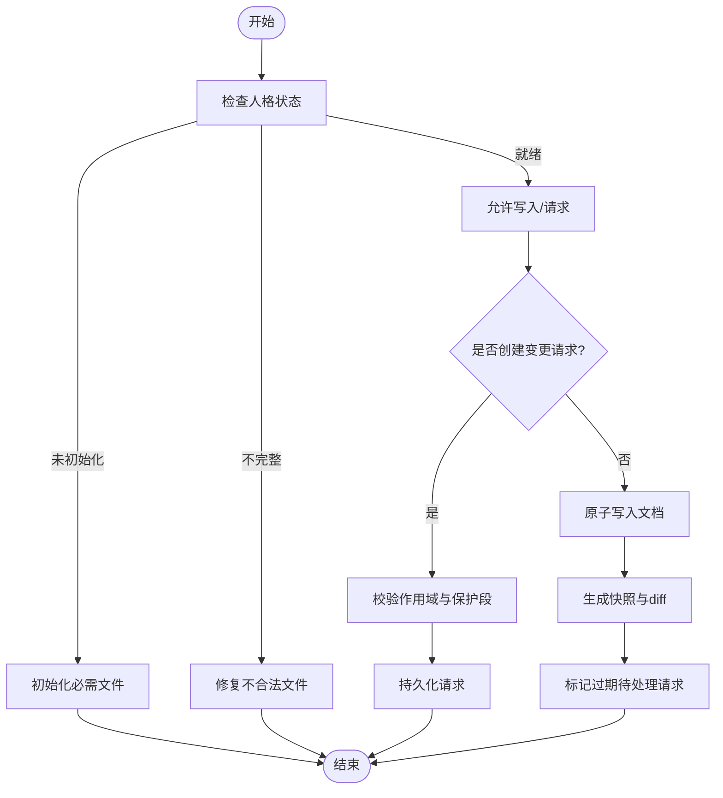
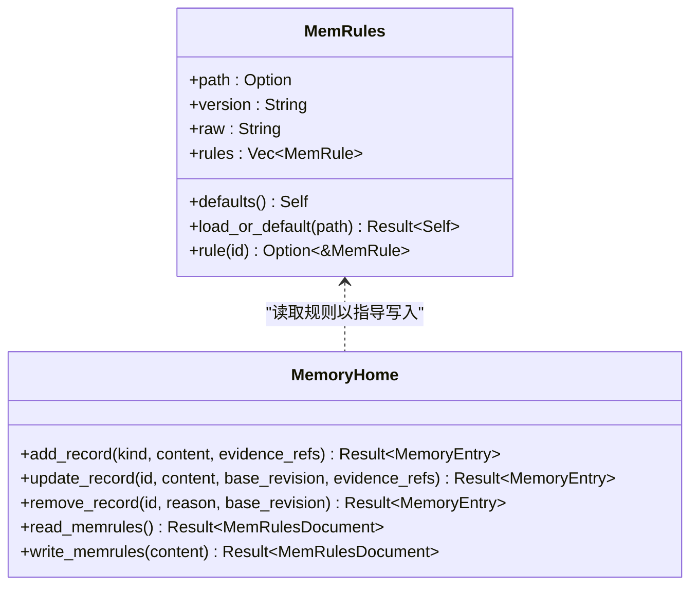
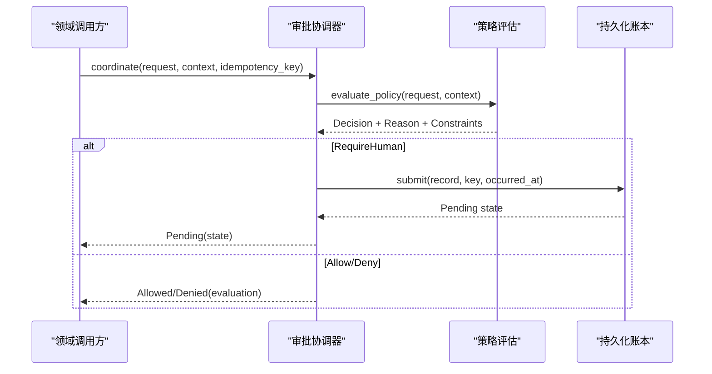
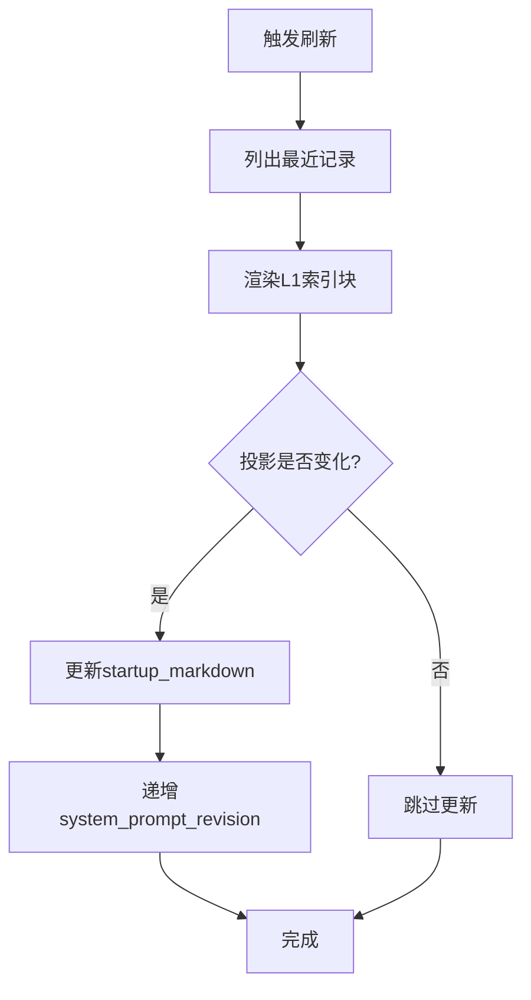
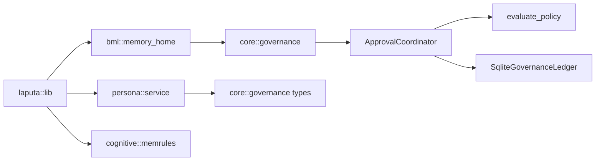

# Laputa 治理层

<cite>
**本文引用的文件**
- [agent-diva-laputa/src/lib.rs](file://agent-diva-laputa/src/lib.rs)
- [agent-diva-laputa/src/persona/mod.rs](file://agent-diva-laputa/src/persona/mod.rs)
- [agent-diva-laputa/src/persona/service.rs](file://agent-diva-laputa/src/persona/service.rs)
- [agent-diva-laputa/src/bml/mod.rs](file://agent-diva-laputa/src/bml/mod.rs)
- [agent-diva-laputa/src/bml/memory_home.rs](file://agent-diva-laputa/src/bml/memory_home.rs)
- [agent-diva-laputa/src/cognitive/mod.rs](file://agent-diva-laputa/src/cognitive/mod.rs)
- [agent-diva-laputa/src/cognitive/memrules.rs](file://agent-diva-laputa/src/cognitive/memrules.rs)
- [agent-diva-core/src/governance/mod.rs](file://agent-diva-core/src/governance/mod.rs)
- [agent-diva-core/src/governance/coordinator.rs](file://agent-diva-core/src/governance/coordinator.rs)
- [agent-diva-core/src/governance/types.rs](file://agent-diva-core/src/governance/types.rs)
- [agent-diva-core/src/governance/policy.rs](file://agent-diva-core/src/governance/policy.rs)
- [agent-diva-core/src/governance/ledger.rs](file://agent-diva-core/src/governance/ledger.rs)
</cite>

## 目录
1. [简介](#简介)
2. [项目结构](#项目结构)
3. [核心组件](#核心组件)
4. [架构总览](#架构总览)
5. [详细组件分析](#详细组件分析)
6. [依赖关系分析](#依赖关系分析)
7. [性能考量](#性能考量)
8. [故障恢复指南](#故障恢复指南)
9. [结论](#结论)
10. [附录：配置与API模式](#附录配置与api模式)

## 简介
本文件面向开发者，系统化阐述 Laputa 治理层的实现与使用方式。重点覆盖以下主题：
- 人格治理：人格工作区、变更请求、历史快照与权限边界
- 认知同步：MEMRULES 规则解析、启动索引刷新、系统提示注入
- 权限控制：领域中立审批协调器、策略评估、持久化账本与审计
- 记忆规则执行：BML 写入边界、证据链约束、信任与范围
- 领域权威边界：安全策略、能力-资源矩阵、失败关闭默认
- 配置示例、API 调用模式与故障恢复机制

Laputa 将“机器级记忆家”“人格 Markdown 工作区”“冻结核心快照”“无负载召回反馈读取器”等权威集中管理，并通过 BML 逻辑层暴露受控的存储 API。

**章节来源**
- [agent-diva-laputa/src/lib.rs:1-56](file://agent-diva-laputa/src/lib.rs#L1-L56)

## 项目结构
Laputa 治理层由 agent-diva-laputa 与 agent-diva-core 协作构成：
- Laputa 负责“文件即权威”的边界：BML 逻辑层、人格 Markdown 工作区、冻结核心、无负载反馈读取器
- Core 提供跨域通用的治理协议：审批协调器、策略评估、持久化账本、类型契约

**图表来源**
- [agent-diva-laputa/src/persona/service.rs:1-120](file://agent-diva-laputa/src/persona/service.rs#L1-L120)
- [agent-diva-laputa/src/bml/memory_home.rs:85-177](file://agent-diva-laputa/src/bml/memory_home.rs#L85-L177)
- [agent-diva-laputa/src/cognitive/memrules.rs:76-107](file://agent-diva-laputa/src/cognitive/memrules.rs#L76-L107)
- [agent-diva-core/src/governance/mod.rs:1-17](file://agent-diva-core/src/governance/mod.rs#L1-L17)
- [agent-diva-core/src/governance/coordinator.rs:49-186](file://agent-diva-core/src/governance/coordinator.rs#L49-L186)
- [agent-diva-core/src/governance/policy.rs:98-205](file://agent-diva-core/src/governance/policy.rs#L98-L205)
- [agent-diva-core/src/governance/ledger.rs:244-312](file://agent-diva-core/src/governance/ledger.rs#L244-L312)
- [agent-diva-core/src/governance/types.rs:121-161](file://agent-diva-core/src/governance/types.rs#L121-L161)

**章节来源**
- [agent-diva-laputa/src/lib.rs:10-56](file://agent-diva-laputa/src/lib.rs#L10-L56)
- [agent-diva-core/src/governance/mod.rs:1-17](file://agent-diva-core/src/governance/mod.rs#L1-L17)

## 核心组件
- 人格服务 PersonaService：机器级人格 Markdown 工作区的权威入口，负责初始化、状态检查、文档读写、变更请求、历史快照与冲突处理
- 记忆家 MemoryHome：机器级 BML 逻辑层权威，封装 SQLite+FTS5 存储、启动索引、系统提示块、会话检查点、GC 与搜索
- 认知规则 MemRules：解析 MEMRULES.MD（或内置默认），为记忆写入路径提供政策参考
- 治理协调器 ApprovalCoordinator：跨域（计划、沙箱、记忆）统一的审批协调边界，结合策略评估与持久化账本
- 策略评估 evaluate_policy：纯函数决策引擎，基于能力-资源矩阵、自主级别、限制与授权进行判定
- 持久化账本 SqliteGovernanceLedger：追加式事件日志，支持幂等提交、CAS 版本、事件回放与分页

**章节来源**
- [agent-diva-laputa/src/persona/service.rs:19-121](file://agent-diva-laputa/src/persona/service.rs#L19-L121)
- [agent-diva-laputa/src/bml/memory_home.rs:85-177](file://agent-diva-laputa/src/bml/memory_home.rs#L85-L177)
- [agent-diva-laputa/src/cognitive/memrules.rs:76-107](file://agent-diva-laputa/src/cognitive/memrules.rs#L76-L107)
- [agent-diva-core/src/governance/coordinator.rs:49-186](file://agent-diva-core/src/governance/coordinator.rs#L49-L186)
- [agent-diva-core/src/governance/policy.rs:98-205](file://agent-diva-core/src/governance/policy.rs#L98-L205)
- [agent-diva-core/src/governance/ledger.rs:244-312](file://agent-diva-core/src/governance/ledger.rs#L244-L312)

## 架构总览
Laputa 治理层通过“文件即权威”的边界，将人格、记忆与规则统一在可审计、可恢复的框架内；Core 治理层提供跨域的审批与策略能力。

**图表来源**
- [agent-diva-laputa/src/persona/service.rs:258-385](file://agent-diva-laputa/src/persona/service.rs#L258-L385)
- [agent-diva-laputa/src/bml/memory_home.rs:205-346](file://agent-diva-laputa/src/bml/memory_home.rs#L205-L346)
- [agent-diva-core/src/governance/coordinator.rs:73-131](file://agent-diva-core/src/governance/coordinator.rs#L73-L131)
- [agent-diva-core/src/governance/policy.rs:98-205](file://agent-diva-core/src/governance/policy.rs#L98-L205)
- [agent-diva-core/src/governance/ledger.rs:486-518](file://agent-diva-core/src/governance/ledger.rs#L486-L518)

## 详细组件分析

### 人格治理：工作区、变更请求与历史
- 工作区组织：根目录包含 persona、history、requests；原子写入保证一致性
- 状态机：Uninitialized / Incomplete / Ready；必需文件缺失或不合法时处于 Incomplete
- 变更流程：Agent/AutoDream 创建变更请求 -> 人类接受/拒绝 -> 应用并生成历史快照与差异
- 保护规则：USER Preferences 与 WORLD 用户保护段不可被特定角色修改；WORLD 入口门限校验
- 冲突处理：基于 base_revision 与 content_hash 的乐观锁；并发写导致 RevisionConflict

**图表来源**
- [agent-diva-laputa/src/persona/service.rs:42-121](file://agent-diva-laputa/src/persona/service.rs#L42-L121)
- [agent-diva-laputa/src/persona/service.rs:123-200](file://agent-diva-laputa/src/persona/service.rs#L123-L200)
- [agent-diva-laputa/src/persona/service.rs:258-385](file://agent-diva-laputa/src/persona/service.rs#L258-L385)
- [agent-diva-laputa/src/persona/service.rs:492-580](file://agent-diva-laputa/src/persona/service.rs#L492-L580)
- [agent-diva-laputa/src/persona/service.rs:612-645](file://agent-diva-laputa/src/persona/service.rs#L612-L645)

**章节来源**
- [agent-diva-laputa/src/persona/service.rs:19-121](file://agent-diva-laputa/src/persona/service.rs#L19-L121)
- [agent-diva-laputa/src/persona/service.rs:258-385](file://agent-diva-laputa/src/persona/service.rs#L258-L385)
- [agent-diva-laputa/src/persona/service.rs:492-580](file://agent-diva-laputa/src/persona/service.rs#L492-L580)
- [agent-diva-laputa/src/persona/service.rs:612-645](file://agent-diva-laputa/src/persona/service.rs#L612-L645)

### 记忆规则执行：MEMRULES 与 BML 写入边界
- MEMRULES 解析：从磁盘加载或回退到内置默认；提取 R1-R7 规则用于指导记忆写入
- BML 写入边界：生产环境仅允许 LongTerm 记录写入；非 BML 模块禁止直接调用原始写入 API
- 证据链约束：R1 强调 evidence_refs 为主事实来源；无证据写入保留为建议性
- 用户权威：R4 用户确认信息优先；直接写入 BML 并做版本检查
- 范围与可见性：R5 约束 scope/time/confidence/provenance/visibility
- 世界边界：R6/R7 限制 WORLD 入口与整体注入

**图表来源**
- [agent-diva-laputa/src/cognitive/memrules.rs:76-107](file://agent-diva-laputa/src/cognitive/memrules.rs#L76-L107)
- [agent-diva-laputa/src/bml/memory_home.rs:205-346](file://agent-diva-laputa/src/bml/memory_home.rs#L205-L346)
- [agent-diva-laputa/src/bml/memory_home.rs:348-372](file://agent-diva-laputa/src/bml/memory_home.rs#L348-L372)

**章节来源**
- [agent-diva-laputa/src/cognitive/memrules.rs:1-219](file://agent-diva-laputa/src/cognitive/memrules.rs#L1-L219)
- [agent-diva-laputa/src/bml/memory_home.rs:205-346](file://agent-diva-laputa/src/bml/memory_home.rs#L205-L346)
- [agent-diva-laputa/src/bml/mod.rs:1-37](file://agent-diva-laputa/src/bml/mod.rs#L1-L37)

### 权限控制：审批协调器、策略评估与持久化账本
- 审批协调器：对每个领域请求进行策略评估，必要时持久化待审批状态，支持幂等提交与 CAS 版本
- 策略评估：严格优先级顺序（硬禁止 > 显式拒绝 > 上下文无效 > 能力-资源匹配 > 限制 > 授权 > 安全默认 > 需人工审批）
- 持久化账本：追加式事件日志，支持提交、决定、撤销、消费一次、过期、状态查询与事件分页

**图表来源**
- [agent-diva-core/src/governance/coordinator.rs:73-131](file://agent-diva-core/src/governance/coordinator.rs#L73-L131)
- [agent-diva-core/src/governance/policy.rs:98-205](file://agent-diva-core/src/governance/policy.rs#L98-L205)
- [agent-diva-core/src/governance/ledger.rs:486-518](file://agent-diva-core/src/governance/ledger.rs#L486-L518)

**章节来源**
- [agent-diva-core/src/governance/coordinator.rs:1-186](file://agent-diva-core/src/governance/coordinator.rs#L1-L186)
- [agent-diva-core/src/governance/policy.rs:1-678](file://agent-diva-core/src/governance/policy.rs#L1-L678)
- [agent-diva-core/src/governance/ledger.rs:1-800](file://agent-diva-core/src/governance/ledger.rs#L1-L800)
- [agent-diva-core/src/governance/types.rs:1-548](file://agent-diva-core/src/governance/types.rs#L1-L548)

### 认知同步：启动索引与系统提示
- 启动索引：MemoryHome 维护 L1 索引行预算，定期刷新并渲染为紧凑 Markdown 片段
- 系统提示块：system_prompt_block 返回当前投影；revision 变化驱动上层刷新
- 刷新流程：list_records -> render_l1_index_block -> 比较旧投影 -> 更新原子变量与 revision

**图表来源**
- [agent-diva-laputa/src/bml/memory_home.rs:394-418](file://agent-diva-laputa/src/bml/memory_home.rs#L394-L418)
- [agent-diva-laputa/src/bml/memory_home.rs:494-532](file://agent-diva-laputa/src/bml/memory_home.rs#L494-L532)

**章节来源**
- [agent-diva-laputa/src/bml/memory_home.rs:394-418](file://agent-diva-laputa/src/bml/memory_home.rs#L394-L418)
- [agent-diva-laputa/src/bml/memory_home.rs:494-532](file://agent-diva-laputa/src/bml/memory_home.rs#L494-L532)

### 领域权威边界与安全策略
- 能力-资源矩阵：Capability 与 ResourceKind 必须匹配，否则失败关闭
- 自主级别：L0/L1/L2/L3/L4 决定授权范围与安全默认；L4 一律拒绝
- 限制与授权：Restriction 与 ApprovalReceipt 共同影响决策；未知值失败关闭
- 证据与审计：所有决策附带原因码与约束；账本事件可回放与分页

**章节来源**
- [agent-diva-core/src/governance/policy.rs:285-346](file://agent-diva-core/src/governance/policy.rs#L285-L346)
- [agent-diva-core/src/governance/types.rs:27-83](file://agent-diva-core/src/governance/types.rs#L27-L83)
- [agent-diva-core/src/governance/ledger.rs:119-186](file://agent-diva-core/src/governance/ledger.rs#L119-L186)

## 依赖关系分析
- Laputa 依赖 Core 治理类型与策略评估，但不直接持有领域载荷
- MemoryHome 依赖 ActmemStore 与 TypedMemoryStore，提供统一的 MemoryProvider 接口
- PersonaService 依赖原子写入与 Markdown 工具，确保工作区一致性与可追溯性
- 审批协调器依赖策略评估与持久化账本，屏蔽领域差异

**图表来源**
- [agent-diva-laputa/src/lib.rs:10-56](file://agent-diva-laputa/src/lib.rs#L10-L56)
- [agent-diva-core/src/governance/mod.rs:1-17](file://agent-diva-core/src/governance/mod.rs#L1-L17)
- [agent-diva-core/src/governance/coordinator.rs:49-186](file://agent-diva-core/src/governance/coordinator.rs#L49-L186)
- [agent-diva-core/src/governance/ledger.rs:244-312](file://agent-diva-core/src/governance/ledger.rs#L244-L312)

**章节来源**
- [agent-diva-laputa/src/lib.rs:10-56](file://agent-diva-laputa/src/lib.rs#L10-L56)
- [agent-diva-core/src/governance/mod.rs:1-17](file://agent-diva-core/src/governance/mod.rs#L1-L17)

## 性能考量
- 启动索引预算：MemoryHome 通过 l1_index_lines 控制 L1 索引行数，避免过大上下文
- 懒加载存储：TypedMemoryStore 仅在数据库存在时打开，减少冷启动开销
- 幂等与去重：审批账本通过 idempotency_key 与 operation_fingerprint 避免重复事件
- 只读优化：system_prompt_block 返回内存中的 Markdown 投影，避免频繁 I/O
- 搜索限制：search_records 默认限制命中数量，防止响应膨胀

[本节为通用性能建议，不直接分析具体文件]

## 故障恢复指南
- 人格工作区不一致：
  - 现象：status 显示 Incomplete，reason 为 empty/history_mismatch/missing
  - 恢复：使用 repair 接口修复不合法文件；确保 history 与最新文档一致
- 记忆写入冲突：
  - 现象：RevisionConflict（expected vs actual）
  - 恢复：重新获取当前 revision 后重试；检查 tombstone 与 supersedes
- 审批状态异常：
  - 现象：InvalidTransition/AlreadyConsumed/Expired
  - 恢复：通过 states_page/events_page 回放事件；使用 consume_once/expiry/revoke 修正
- 启动索引失效：
  - 现象：system_prompt_projection 未更新
  - 恢复：调用 refresh_system_prompt_projection；检查 list_records 与 render_l1_index_block

**章节来源**
- [agent-diva-laputa/src/persona/service.rs:42-121](file://agent-diva-laputa/src/persona/service.rs#L42-L121)
- [agent-diva-laputa/src/persona/service.rs:492-580](file://agent-diva-laputa/src/persona/service.rs#L492-L580)
- [agent-diva-laputa/src/bml/memory_home.rs:238-346](file://agent-diva-laputa/src/bml/memory_home.rs#L238-L346)
- [agent-diva-core/src/governance/ledger.rs:520-715](file://agent-diva-core/src/governance/ledger.rs#L520-L715)

## 结论
Laputa 治理层通过“文件即权威”与“领域中立审批”的结合，实现了人格、记忆与规则的强一致与可审计。开发者可在安全边界内扩展记忆功能，遵循 MEMRULES 约束、能力-资源矩阵与策略评估，利用审批协调器与持久化账本保障幂等与可恢复性。

[本节为总结性内容，不直接分析具体文件]

## 附录：配置与API模式

### 人格工作区配置
- 根目录：config_dir/persona
- 子目录：history/{kind}/log.jsonl、requests/*.json
- 必需文件：依据 PersonaKind::REQUIRED；未初始化时进入 Uninitialized
- 原子写入：使用 atomic_write 保证文件一致性

**章节来源**
- [agent-diva-laputa/src/persona/service.rs:24-36](file://agent-diva-laputa/src/persona/service.rs#L24-L36)
- [agent-diva-laputa/src/persona/service.rs:492-580](file://agent-diva-laputa/src/persona/service.rs#L492-L580)

### 记忆规则配置
- 文件位置：config_dir/memory/MEMRULES.MD
- 行为：缺失时使用内置默认；解析 version 与规则列表
- 写入：仅通过 MemoryHome.write_memrules；禁止工具或 API 直接编辑

**章节来源**
- [agent-diva-laputa/src/cognitive/memrules.rs:76-107](file://agent-diva-laputa/src/cognitive/memrules.rs#L76-L107)
- [agent-diva-laputa/src/bml/memory_home.rs:348-372](file://agent-diva-laputa/src/bml/memory_home.rs#L348-L372)

### 记忆 CRUD API 模式
- 添加长期记忆：add_long_term(content, evidence_refs)
- 更新记忆：update_record(id, content, base_revision, evidence_refs)
- 删除记忆：remove_record(id, reason, base_revision)
- 搜索记忆：search_records(query, limit)
- 会话检查点：write_checkpoint(session_id, key_info, related_sops, content)

**章节来源**
- [agent-diva-laputa/src/bml/memory_home.rs:205-346](file://agent-diva-laputa/src/bml/memory_home.rs#L205-L346)
- [agent-diva-laputa/src/bml/memory_home.rs:439-491](file://agent-diva-laputa/src/bml/memory_home.rs#L439-L491)

### 审批协调 API 模式
- 提交请求：coordinate(request, context, idempotency_key)
- 决定：decide(request_id, expected_version, idempotency_key, receipt)
- 消费一次：consume_once(request_id, expected_version, idempotency_key, occurred_at)
- 撤销/过期：revoke/expire(...)
- 查询：state(states_page/events_page)

**章节来源**
- [agent-diva-core/src/governance/coordinator.rs:73-186](file://agent-diva-core/src/governance/coordinator.rs#L73-L186)
- [agent-diva-core/src/governance/ledger.rs:486-715](file://agent-diva-core/src/governance/ledger.rs#L486-L715)