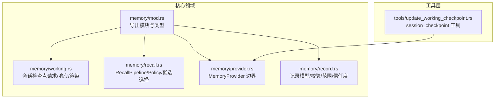
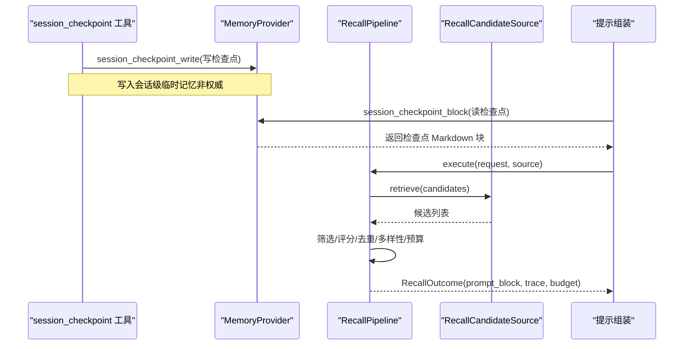
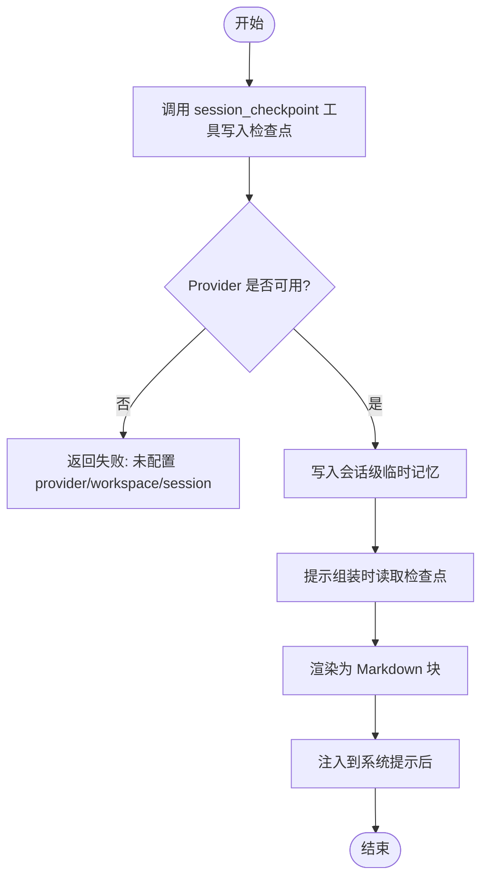
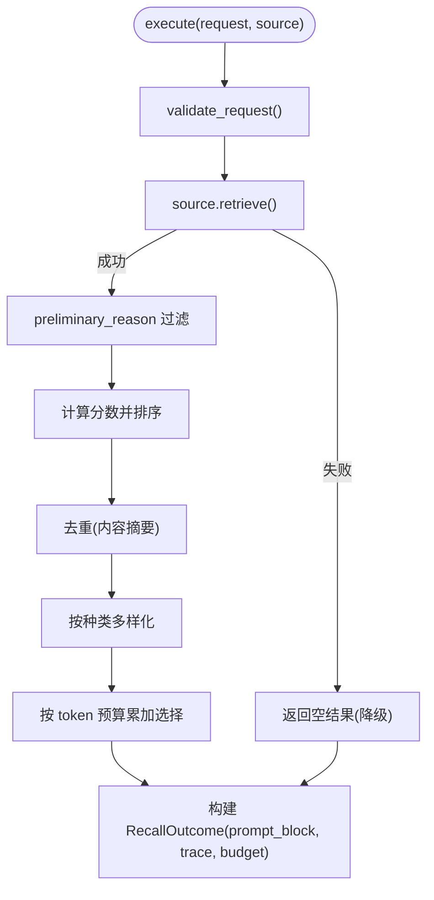
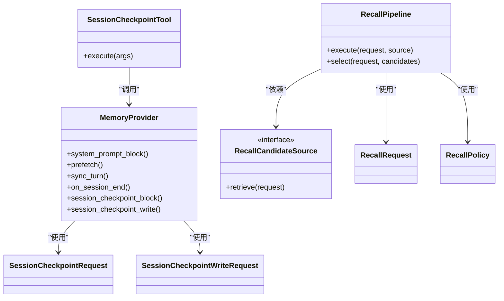

# 工作记忆

<cite>
**本文引用的文件**
- [agent-diva-core/src/memory/mod.rs](file://agent-diva-core/src/memory/mod.rs)
- [agent-diva-core/src/memory/working.rs](file://agent-diva-core/src/memory/working.rs)
- [agent-diva-core/src/memory/recall.rs](file://agent-diva-core/src/memory/recall.rs)
- [agent-diva-core/src/memory/provider.rs](file://agent-diva-core/src/memory/provider.rs)
- [agent-diva-core/src/memory/record.rs](file://agent-diva-core/src/memory/record.rs)
- [agent-diva-tools/src/update_working_checkpoint.rs](file://agent-diva-tools/src/update_working_checkpoint.rs)
</cite>

## 目录
1. [简介](#简介)
2. [项目结构](#项目结构)
3. [核心组件](#核心组件)
4. [架构总览](#架构总览)
5. [详细组件分析](#详细组件分析)
6. [依赖关系分析](#依赖关系分析)
7. [性能考虑](#性能考虑)
8. [故障排查指南](#故障排查指南)
9. [结论](#结论)
10. [附录：使用示例与配置调优](#附录使用示例与配置调优)

## 简介
本文件面向开发者，系统化说明 Agent-Diva 的工作记忆模块，重点覆盖：
- 会话级临时记忆（Session Checkpoint）的写入、注入与清理
- 检查点管理（SessionCheckpointRequest/Write/Response）的生命周期与内存策略
- 记忆召回机制（RecallPipeline、RecallPolicy、RecallCandidateSource）的选择流程、预算控制与可观测性
- 工作记忆的内存管理与自动清理策略
- 具体使用示例、配置选项与性能调优建议

该模块通过稳定的领域契约将“提示组装/循环执行”与“长期记忆后端”解耦，确保工作记忆在会话内可见、会话结束即清空的短期特性，同时为长期记忆提供确定性的召回与预算控制。

## 项目结构
工作记忆相关代码主要位于 agent-diva-core 的 memory 子模块，并通过 provider 边界暴露给上层调用；工具层提供 session_checkpoint 工具用于写入工作记忆。

图表来源
- [agent-diva-core/src/memory/mod.rs:1-47](file://agent-diva-core/src/memory/mod.rs#L1-L47)
- [agent-diva-core/src/memory/working.rs:1-123](file://agent-diva-core/src/memory/working.rs#L1-L123)
- [agent-diva-core/src/memory/recall.rs:1-200](file://agent-diva-core/src/memory/recall.rs#L1-L200)
- [agent-diva-core/src/memory/provider.rs:1-120](file://agent-diva-core/src/memory/provider.rs#L1-L120)
- [agent-diva-core/src/memory/record.rs:1-120](file://agent-diva-core/src/memory/record.rs#L1-L120)
- [agent-diva-tools/src/update_working_checkpoint.rs:1-126](file://agent-diva-tools/src/update_working_checkpoint.rs#L1-L126)

章节来源
- [agent-diva-core/src/memory/mod.rs:1-47](file://agent-diva-core/src/memory/mod.rs#L1-L47)

## 核心组件
- 会话检查点（Working Memory）
  - SessionCheckpointRequest：读取当前会话检查点以注入到上下文
  - SessionCheckpointWriteRequest：写入会话检查点（键信息、相关SOP、内容）
  - render_session_checkpoint_block：将结构化检查点渲染为 Markdown 块
  - L0_MEMORY_POLICY：指导模型如何分层管理记忆（仅持久化经动作验证的事实、会话进度不进入长期记忆、最小指针原则）

- 记忆召回（Recall v2）
  - RecallPolicy：允许的信任级别与敏感度白名单
  - RecallRequest：一次召回的请求体（查询、作用域、审计关联、时间、token 预算、候选上限、策略）
  - RecallPipeline：无状态编排器，负责检索、筛选、评分、去重、多样性、预算分配与输出 prompt_block
  - RecallCandidateSource：异步只读候选源接口（实现由后端提供）
  - RecallTokenEstimator：可替换的 token 估算器（默认保守估算）
  - RecallOutcome/Trace/BudgetUsage：结果、轨迹与预算使用统计

- Provider 边界
  - MemoryProvider：统一抽象启动提示、预取、同步、会话结束等能力
  - session_checkpoint_block / session_checkpoint_write：工作记忆的读取与写入
  - prefetch/sync_turn/on_session_end：生命周期钩子

- 记录模型
  - MemoryRecord/Kind/Sensitivity/Trust/Scope：标准化记录、分类、敏感度、信任度与作用域
  - 校验与完整性：记录有效性、过期、墓碑、替代关系等

章节来源
- [agent-diva-core/src/memory/working.rs:10-76](file://agent-diva-core/src/memory/working.rs#L10-L76)
- [agent-diva-core/src/memory/recall.rs:37-156](file://agent-diva-core/src/memory/recall.rs#L37-L156)
- [agent-diva-core/src/memory/provider.rs:414-617](file://agent-diva-core/src/memory/provider.rs#L414-L617)
- [agent-diva-core/src/memory/record.rs:14-120](file://agent-diva-core/src/memory/record.rs#L14-L120)

## 架构总览
工作记忆在“会话内可见、会话结束即清”的短期语义下运行，并通过 Provider 边界与长期记忆系统解耦。召回管线对候选进行确定性筛选与预算控制，最终生成可直接注入提示的 Markdown 片段。

图表来源
- [agent-diva-tools/src/update_working_checkpoint.rs:97-125](file://agent-diva-tools/src/update_working_checkpoint.rs#L97-L125)
- [agent-diva-core/src/memory/provider.rs:586-609](file://agent-diva-core/src/memory/provider.rs#L586-L609)
- [agent-diva-core/src/memory/recall.rs:214-359](file://agent-diva-core/src/memory/recall.rs#L214-L359)

## 详细组件分析

### 会话检查点（Session Checkpoint）
- 写入
  - 工具参数：key_info（必填）、related_sops、content
  - 工具将参数封装为 SessionCheckpointWriteRequest 并调用 MemoryProvider.session_checkpoint_write
  - 写入是即时且非权威的，不会成为长期权威数据
- 读取与注入
  - 提示组装阶段调用 MemoryProvider.session_checkpoint_block，传入 SessionCheckpointRequest（workspace_root、session_id）
  - 若存在检查点，返回包含检查点内容的 Markdown 块注入到系统提示之后
- 渲染
  - render_session_checkpoint_block 将结构化数据渲染为“## Session Checkpoint”区块，按 key_info、related_sops、state 顺序组织
- 生命周期与清理
  - 会话结束时由 on_session_end 触发清理（provider 实现负责清空或释放），保证会话间隔离

图表来源
- [agent-diva-tools/src/update_working_checkpoint.rs:54-125](file://agent-diva-tools/src/update_working_checkpoint.rs#L54-L125)
- [agent-diva-core/src/memory/provider.rs:586-609](file://agent-diva-core/src/memory/provider.rs#L586-L609)
- [agent-diva-core/src/memory/working.rs:54-76](file://agent-diva-core/src/memory/working.rs#L54-L76)

章节来源
- [agent-diva-tools/src/update_working_checkpoint.rs:54-125](file://agent-diva-tools/src/update_working_checkpoint.rs#L54-L125)
- [agent-diva-core/src/memory/working.rs:20-76](file://agent-diva-core/src/memory/working.rs#L20-L76)
- [agent-diva-core/src/memory/provider.rs:586-609](file://agent-diva-core/src/memory/provider.rs#L586-L609)

### 记忆召回管线（RecallPipeline）
- 输入
  - RecallRequest：query、scope（tenant/workspace/session）、correlation、now、token_budget、max_candidates、policy
- 处理流程
  - 校验请求（必需字段、策略合法性、候选上限）
  - 从 RecallCandidateSource 获取候选
  - 初步过滤：无效、作用域不匹配、会话不匹配、过期、墓碑、信任/敏感度拒绝
  - 计算分数：相关性、重要性、新鲜度、人格相关度加权
  - 去重：基于内容摘要避免重复
  - 多样性：按记录种类分散选择
  - 预算控制：按 token 预算累加，超出则拒绝
  - 输出：selected_records、prompt_block、trace、budget
- 可观测性
  - RecallTrace 记录每个候选的决策与原因
  - compare_recall_shadow 对比旧版与新版召回差异（digest/token 估算/数量差）

图表来源
- [agent-diva-core/src/memory/recall.rs:214-359](file://agent-diva-core/src/memory/recall.rs#L214-L359)
- [agent-diva-core/src/memory/recall.rs:509-583](file://agent-diva-core/src/memory/recall.rs#L509-L583)
- [agent-diva-core/src/memory/recall.rs:362-398](file://agent-diva-core/src/memory/recall.rs#L362-L398)

章节来源
- [agent-diva-core/src/memory/recall.rs:37-156](file://agent-diva-core/src/memory/recall.rs#L37-L156)
- [agent-diva-core/src/memory/recall.rs:214-359](file://agent-diva-core/src/memory/recall.rs#L214-L359)
- [agent-diva-core/src/memory/recall.rs:509-583](file://agent-diva-core/src/memory/recall.rs#L509-L583)

### 召回策略（RecallPolicy）
- 默认策略 default_prompt()：仅允许 AppliedAuthority 信任级别，以及 Public/Internal/Private 敏感度
- 用途：限制注入到提示的记忆范围，遵循最小权限原则

章节来源
- [agent-diva-core/src/memory/recall.rs:37-56](file://agent-diva-core/src/memory/recall.rs#L37-L56)

### Provider 边界与生命周期
- system_prompt_block：同步，仅读取本地缓存，不执行 I/O
- prefetch：异步，意图感知召回，失败应返回 PrefetchStatus 而非抛错
- sync_turn：异步，成功后持久化证据/历史
- on_session_end：异步，会话结束清理（包括工作记忆）
- session_checkpoint_block/write：工作记忆的读取与写入

章节来源
- [agent-diva-core/src/memory/provider.rs:414-617](file://agent-diva-core/src/memory/provider.rs#L414-L617)

### 记录模型与校验
- MemoryRecord：包含 id、kind、content、provenance、evidence_refs、confidence_bps、sensitivity、trust、scope、时间戳、supersedes、tombstone
- MemoryRecordKind：包含 SessionCheckpoint（别名 working_memory）
- 校验：validate_at 支持时钟偏差、有效期、创建/生效时间顺序、自替代、墓碑约束等

章节来源
- [agent-diva-core/src/memory/record.rs:14-120](file://agent-diva-core/src/memory/record.rs#L14-L120)
- [agent-diva-core/src/memory/record.rs:193-200](file://agent-diva-core/src/memory/record.rs#L193-L200)

## 依赖关系分析
- 工具层依赖 Provider 边界，不直接依赖后端实现
- 召回管线依赖 RecallCandidateSource 与 RecallTokenEstimator，保持可插拔
- 工作记忆通过 Provider 的 session_checkpoint_* 方法接入后端
- 记录模型被 recall 与 provider 共同引用，确保一致性

图表来源
- [agent-diva-tools/src/update_working_checkpoint.rs:16-125](file://agent-diva-tools/src/update_working_checkpoint.rs#L16-L125)
- [agent-diva-core/src/memory/provider.rs:414-617](file://agent-diva-core/src/memory/provider.rs#L414-L617)
- [agent-diva-core/src/memory/recall.rs:214-359](file://agent-diva-core/src/memory/recall.rs#L214-L359)

章节来源
- [agent-diva-core/src/memory/provider.rs:414-617](file://agent-diva-core/src/memory/provider.rs#L414-L617)
- [agent-diva-core/src/memory/recall.rs:214-359](file://agent-diva-core/src/memory/recall.rs#L214-L359)
- [agent-diva-tools/src/update_working_checkpoint.rs:16-125](file://agent-diva-tools/src/update_working_checkpoint.rs#L16-L125)

## 性能考虑
- 预算控制
  - 使用 token_budget 限制注入内容大小，避免提示过大导致延迟与成本上升
  - 使用 ConservativeRecallTokenEstimator 做保守估算，降低高估风险
- 候选上限
  - max_candidates 限制检索规模，减少后续处理开销
- 去重与多样性
  - 基于内容摘要去重，避免冗余
  - 按记录种类多样化，提升召回质量
- 降级策略
  - 检索失败返回空结果（Degraded），不影响主流程继续
- 评估与对比
  - compare_recall_shadow 可用于离线对比新旧召回效果（token 估算、内容变化）

[本节为通用性能讨论，不直接分析具体文件]

## 故障排查指南
- 工具不可用
  - 现象：session_checkpoint 工具返回失败，提示未配置 provider/workspace/session
  - 排查：确认工具装配时已绑定 provider、workspace 与 session_id
- 会话检查点未注入
  - 现象：提示中未见检查点内容
  - 排查：确认 provider.session_checkpoint_block 返回了非空 prompt_block；检查 session_id 是否正确
- 召回结果为空
  - 现象：RecallOutcome 为空，status=Degraded/Failed
  - 排查：检查 RecallCandidateSource 是否可用；确认 RecallPolicy 是否过严；核对 token_budget 与 max_candidates
- 记录校验失败
  - 现象：记录被拒绝（Invalid/Expired/Tombstoned/WorkspaceMismatch）
  - 排查：依据 RecallSelectionReason 定位原因；检查记录的时间戳、作用域、信任/敏感度设置

章节来源
- [agent-diva-tools/src/update_working_checkpoint.rs:97-125](file://agent-diva-tools/src/update_working_checkpoint.rs#L97-L125)
- [agent-diva-core/src/memory/recall.rs:509-583](file://agent-diva-core/src/memory/recall.rs#L509-L583)
- [agent-diva-core/src/memory/provider.rs:414-617](file://agent-diva-core/src/memory/provider.rs#L414-L617)

## 结论
工作记忆模块通过清晰的边界与契约实现了会话级临时记忆的稳定管理：写入简单、注入可控、清理可靠；召回管线提供确定性选择与预算控制，便于优化提示质量与成本。结合 Provider 抽象，后端实现可灵活扩展，同时保持上层调用稳定。

[本节为总结性内容，不直接分析具体文件]

## 附录：使用示例与配置调优

### 使用示例
- 写入工作记忆
  - 调用 session_checkpoint 工具，传入 key_info、related_sops、content
  - 工具将构造 SessionCheckpointWriteRequest 并调用 provider.session_checkpoint_write
- 读取工作记忆
  - 提示组装阶段调用 provider.session_checkpoint_block，传入 workspace_root 与 session_id
  - 若存在检查点，返回 Markdown 块注入到系统提示之后
- 执行召回
  - 构造 RecallRequest（query、scope、correlation、now、token_budget、max_candidates、policy）
  - 调用 RecallPipeline.execute(request, source)，得到 RecallOutcome（selected_records、prompt_block、trace、budget）

章节来源
- [agent-diva-tools/src/update_working_checkpoint.rs:54-125](file://agent-diva-tools/src/update_working_checkpoint.rs#L54-L125)
- [agent-diva-core/src/memory/provider.rs:586-609](file://agent-diva-core/src/memory/provider.rs#L586-L609)
- [agent-diva-core/src/memory/recall.rs:58-68](file://agent-diva-core/src/memory/recall.rs#L58-L68)
- [agent-diva-core/src/memory/recall.rs:214-359](file://agent-diva-core/src/memory/recall.rs#L214-L359)

### 配置选项
- 召回策略
  - RecallPolicy::default_prompt()：限制信任与敏感度，遵循最小权限
- 预算与上限
  - token_budget：控制注入 token 总量
  - max_candidates：限制候选数量
- 作用域
  - scope.tenant_id/workspace_id/session_id：确保跨租户/工作区/会话隔离

章节来源
- [agent-diva-core/src/memory/recall.rs:37-68](file://agent-diva-core/src/memory/recall.rs#L37-L68)

### 性能调优建议
- 合理设置 token_budget 与 max_candidates，平衡召回质量与延迟
- 使用保守 token 估算器，避免高估导致预算浪费
- 利用 compare_recall_shadow 对比新旧召回，评估改进效果
- 在 provider 侧实现高效的候选检索与缓存，减少 I/O 开销
- 确保 on_session_end 及时清理工作记忆，避免内存泄漏

[本节为通用调优建议，不直接分析具体文件]