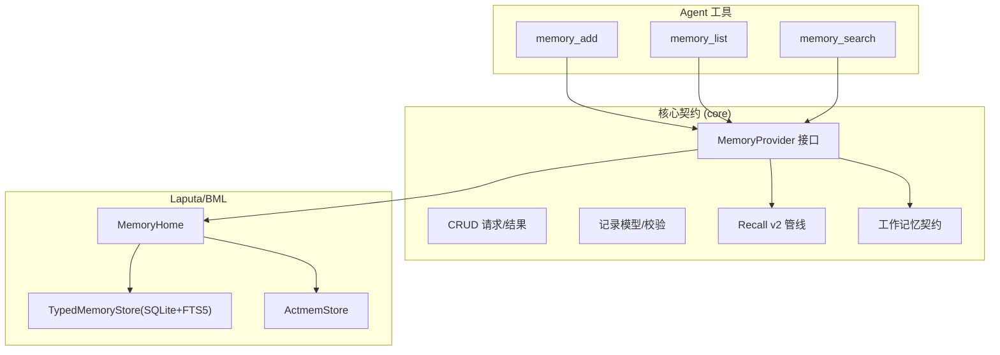
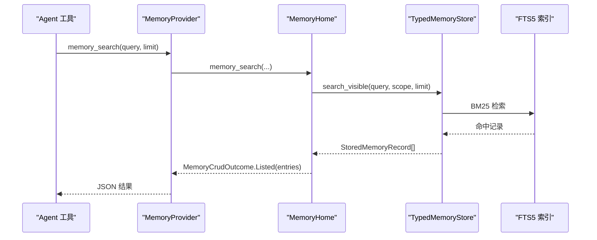
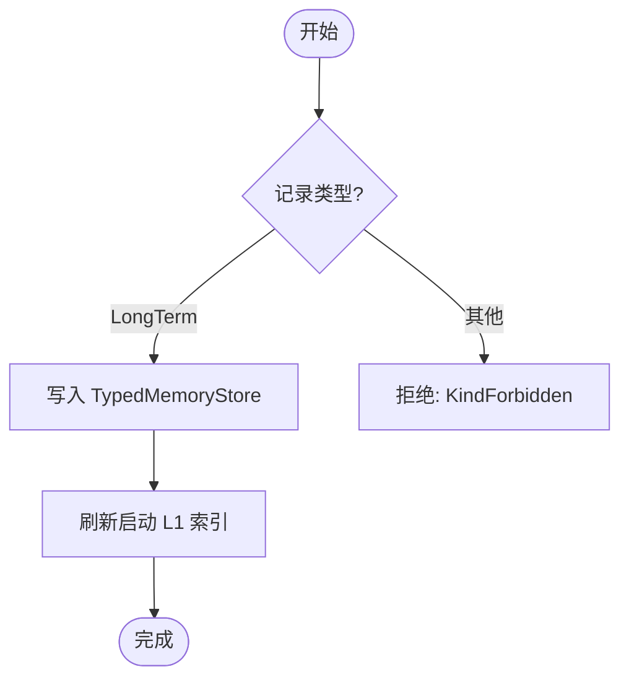
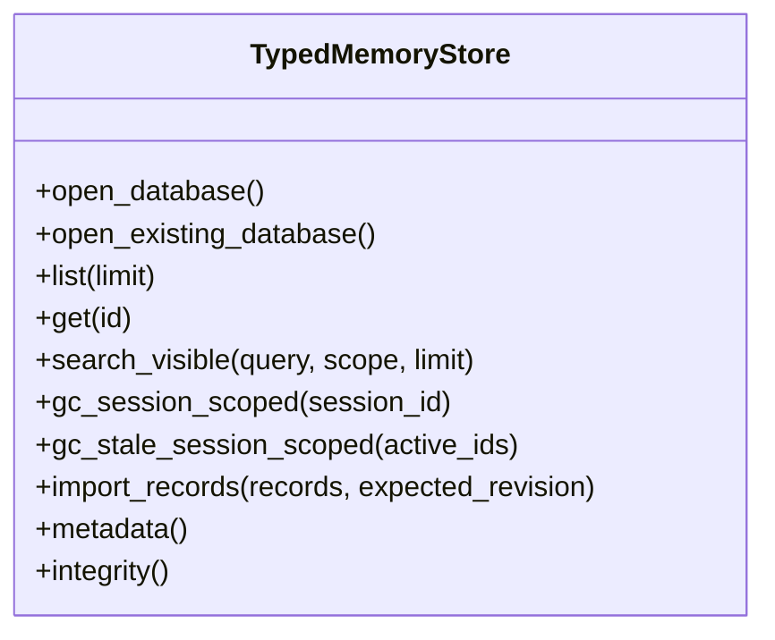
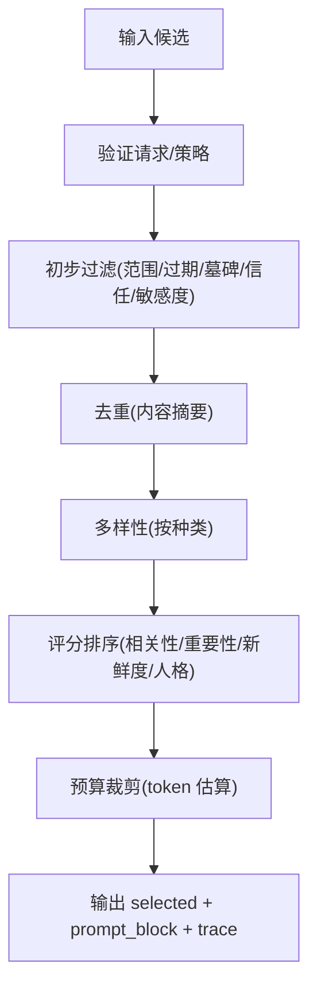
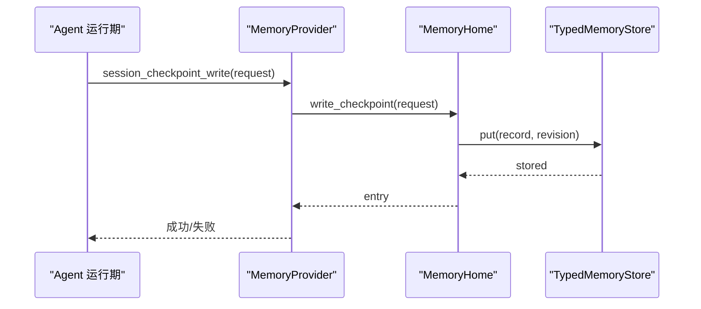
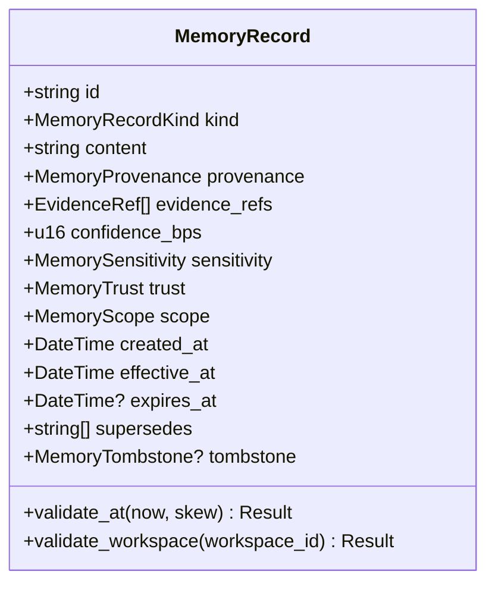
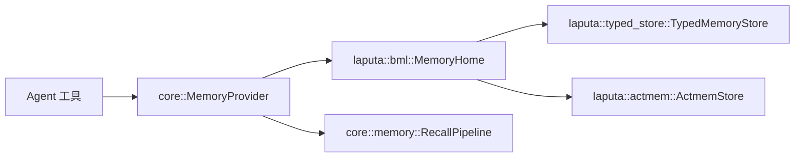

# 记忆系统

<cite>
**本文引用的文件**
- [agent-diva-core/src/memory/mod.rs](file://agent-diva-core/src/memory/mod.rs)
- [agent-diva-core/src/memory/provider.rs](file://agent-diva-core/src/memory/provider.rs)
- [agent-diva-core/src/memory/crud.rs](file://agent-diva-core/src/memory/crud.rs)
- [agent-diva-core/src/memory/record.rs](file://agent-diva-core/src/memory/record.rs)
- [agent-diva-core/src/memory/recall.rs](file://agent-diva-core/src/memory/recall.rs)
- [agent-diva-core/src/memory/working.rs](file://agent-diva-core/src/memory/working.rs)
- [agent-diva-laputa/src/bml/mod.rs](file://agent-diva-laputa/src/bml/mod.rs)
- [agent-diva-laputa/src/bml/memory_home.rs](file://agent-diva-laputa/src/bml/memory_home.rs)
- [agent-diva-laputa/src/lib.rs](file://agent-diva-laputa/src/lib.rs)
- [agent-diva-laputa/src/typed_store.rs](file://agent-diva-laputa/src/typed_store.rs)
- [agent-diva-tools/src/memory_add.rs](file://agent-diva-tools/src/memory_add.rs)
- [agent-diva-tools/src/memory_search.rs](file://agent-diva-tools/src/memory_search.rs)
- [agent-diva-tools/src/memory_list.rs](file://agent-diva-tools/src/memory_list.rs)
</cite>

## 目录
1. [简介](#简介)
2. [项目结构](#项目结构)
3. [核心组件](#核心组件)
4. [架构总览](#架构总览)
5. [详细组件分析](#详细组件分析)
6. [依赖关系分析](#依赖关系分析)
7. [性能与容量](#性能与容量)
8. [故障排查指南](#故障排查指南)
9. [结论](#结论)
10. [附录：API 使用示例与配置](#附录api-使用示例与配置)

## 简介
本文件面向开发者，系统性说明 Agent Diva 的记忆系统分层架构与实现要点。重点覆盖：
- BML（行为记忆层）与 Laputa（治理层）的职责边界与协作方式
- 记忆的 CRUD、语义搜索、工作记忆管理与召回机制
- 记忆生命周期管理、存储策略与性能优化
- API 调用路径、错误处理模式与扩展点

该设计将“写入权威”与“读取索引/提示注入”解耦，通过稳定契约暴露给上层 Agent 工具与运行时，确保可替换后端、可审计、可扩展。

## 项目结构
记忆系统横跨三个主要模块：
- agent-diva-core：定义领域契约（记录模型、CRUD 请求/结果、Provider 接口、Recall v2 管线、工作记忆契约）
- agent-diva-laputa：提供生产级 BML 实现（MemoryHome、TypedMemoryStore、ACTMEM、规则文档等）
- agent-diva-tools：对外暴露的 Agent 工具（memory_add、memory_list、memory_search 等），通过 Provider 调用底层能力

图表来源
- [agent-diva-tools/src/memory_add.rs:41-88](file://agent-diva-tools/src/memory_add.rs#L41-L88)
- [agent-diva-tools/src/memory_list.rs:41-79](file://agent-diva-tools/src/memory_list.rs#L41-L79)
- [agent-diva-tools/src/memory_search.rs:41-79](file://agent-diva-tools/src/memory_search.rs#L41-L79)
- [agent-diva-core/src/memory/provider.rs:414-617](file://agent-diva-core/src/memory/provider.rs#L414-L617)
- [agent-diva-laputa/src/bml/memory_home.rs:494-800](file://agent-diva-laputa/src/bml/memory_home.rs#L494-L800)
- [agent-diva-laputa/src/typed_store.rs:135-143](file://agent-diva-laputa/src/typed_store.rs#L135-L143)

章节来源
- [agent-diva-core/src/memory/mod.rs:1-47](file://agent-diva-core/src/memory/mod.rs#L1-L47)
- [agent-diva-laputa/src/bml/mod.rs:1-37](file://agent-diva-laputa/src/bml/mod.rs#L1-L37)
- [agent-diva-laputa/src/lib.rs:1-56](file://agent-diva-laputa/src/lib.rs#L1-L56)

## 核心组件
- MemoryProvider（核心契约）：统一启动提示注入、意图预取、回合同步、会话结束钩子以及 CRUD/ACTMEM/工作记忆等能力边界。默认方法返回“不支持”，由具体实现覆盖。
- MemoryHome（BML 权威）：机器级 SQLite + FTS5 存储入口，负责长期记忆写入、更新、软删除、列表、搜索、启动 L1 索引刷新、会话检查点写入等。
- TypedMemoryStore（持久化层）：按工作区隔离的 SQLite 存储，维护 schema、记录、supersedes、FTS5 索引、容量限制、迁移与完整性。
- Recall v2（召回管线）：确定性候选选择、预算控制、去重、多样性、评分与追踪，输出结构化 prompt block 与审计 trace。
- 工作记忆（Session Checkpoint）：会话内临时状态，渲染为 Markdown 块注入上下文，会话结束时清理。
- 记录模型与校验：统一的 MemoryRecord、信任/敏感度/范围/时间戳/证据引用与完整性校验。

章节来源
- [agent-diva-core/src/memory/provider.rs:414-617](file://agent-diva-core/src/memory/provider.rs#L414-L617)
- [agent-diva-laputa/src/bml/memory_home.rs:85-177](file://agent-diva-laputa/src/bml/memory_home.rs#L85-L177)
- [agent-diva-laputa/src/typed_store.rs:135-143](file://agent-diva-laputa/src/typed_store.rs#L135-L143)
- [agent-diva-core/src/memory/recall.rs:214-359](file://agent-diva-core/src/memory/recall.rs#L214-L359)
- [agent-diva-core/src/memory/working.rs:1-76](file://agent-diva-core/src/memory/working.rs#L1-L76)
- [agent-diva-core/src/memory/record.rs:103-120](file://agent-diva-core/src/memory/record.rs#L103-L120)

## 架构总览
BML 作为唯一的生产写入权威，对外暴露稳定的 Provider 接口；上层 Agent 工具仅通过 Provider 访问记忆能力。Laputa 在 BML 之上提供治理与存储细节（SQLite/FTS5、ACTMEM、规则文档）。Recall v2 在读取侧提供可审计、可控预算的召回流程，避免直接泄露内容到提示中。

图表来源
- [agent-diva-tools/src/memory_search.rs:55-79](file://agent-diva-tools/src/memory_search.rs#L55-L79)
- [agent-diva-core/src/memory/provider.rs:501-508](file://agent-diva-core/src/memory/provider.rs#L501-L508)
- [agent-diva-laputa/src/bml/memory_home.rs:640-663](file://agent-diva-laputa/src/bml/memory_home.rs#L640-L663)
- [agent-diva-laputa/src/typed_store.rs:537-551](file://agent-diva-laputa/src/typed_store.rs#L537-L551)

## 详细组件分析

### BML 权威：MemoryHome
职责
- 长期记忆写入（add/update/remove）
- 列表与可见性过滤（排除被墓碑替代的记录）
- 语义搜索（基于 FTS5）
- 启动 L1 索引刷新（最小指针原则）
- 会话检查点写入（session-scoped）
- ACTMEM 读写与工作项操作
- MEMRULES 文档读写

关键约束
- 生产环境只允许 LongTerm 类型写入
- 更新/删除采用 CAS（base_revision）
- 删除以墓碑形式记录 supersedes，并携带原因摘要
- 启动 L1 索引仅包含条目指针，不注入完整内容

图表来源
- [agent-diva-laputa/src/bml/memory_home.rs:205-236](file://agent-diva-laputa/src/bml/memory_home.rs#L205-L236)
- [agent-diva-laputa/src/bml/memory_home.rs:238-282](file://agent-diva-laputa/src/bml/memory_home.rs#L238-L282)
- [agent-diva-laputa/src/bml/memory_home.rs:284-346](file://agent-diva-laputa/src/bml/memory_home.rs#L284-L346)
- [agent-diva-laputa/src/bml/memory_home.rs:394-418](file://agent-diva-laputa/src/bml/memory_home.rs#L394-L418)

章节来源
- [agent-diva-laputa/src/bml/memory_home.rs:85-177](file://agent-diva-laputa/src/bml/memory_home.rs#L85-L177)
- [agent-diva-laputa/src/bml/memory_home.rs:494-800](file://agent-diva-laputa/src/bml/memory_home.rs#L494-L800)

### 存储层：TypedMemoryStore
职责
- 打开/初始化 SQLite（WAL、外键、FTS5）
- 记录增删改查、事务导入、墓碑与 supersedes 维护
- 会话级 GC（物理删除 session-scoped 数据）
- 启动时清理过期会话数据
- 工作区身份迁移与回滚
- 容量限制与完整性报告

关键点
- 读路径通过 superseded_target_ids 过滤被墓碑替代的记录
- 会话检查点属于非权威数据，使用物理删除而非墓碑
- FTS5 不可用时降级为不可用错误

图表来源
- [agent-diva-laputa/src/typed_store.rs:135-143](file://agent-diva-laputa/src/typed_store.rs#L135-L143)
- [agent-diva-laputa/src/typed_store.rs:615-638](file://agent-diva-laputa/src/typed_store.rs#L615-L638)
- [agent-diva-laputa/src/typed_store.rs:640-662](file://agent-diva-laputa/src/typed_store.rs#L640-L662)
- [agent-diva-laputa/src/typed_store.rs:673-743](file://agent-diva-laputa/src/typed_store.rs#L673-L743)
- [agent-diva-laputa/src/typed_store.rs:745-800](file://agent-diva-laputa/src/typed_store.rs#L745-L800)

章节来源
- [agent-diva-laputa/src/typed_store.rs:1-143](file://agent-diva-laputa/src/typed_store.rs#L1-L143)
- [agent-diva-laputa/src/typed_store.rs:452-589](file://agent-diva-laputa/src/typed_store.rs#L452-L589)

### 召回管线：Recall v2
职责
- 接收候选集合，执行策略过滤（信任/敏感度/范围/过期/墓碑/重复/超预算）
- 评分排序（相关性、重要性、新鲜度、人格相关）
- 多样性打散（按记录种类）
- 预算控制（token 估算与上限）
- 生成 prompt block 与审计 trace

图表来源
- [agent-diva-core/src/memory/recall.rs:214-359](file://agent-diva-core/src/memory/recall.rs#L214-L359)
- [agent-diva-core/src/memory/recall.rs:400-489](file://agent-diva-core/src/memory/recall.rs#L400-L489)
- [agent-diva-core/src/memory/recall.rs:509-583](file://agent-diva-core/src/memory/recall.rs#L509-L583)

章节来源
- [agent-diva-core/src/memory/recall.rs:1-213](file://agent-diva-core/src/memory/recall.rs#L1-L213)
- [agent-diva-core/src/memory/recall.rs:360-663](file://agent-diva-core/src/memory/recall.rs#L360-L663)

### 工作记忆：Session Checkpoint
职责
- 渲染会话检查点 Markdown 块（关键信息、相关 SOP、状态）
- 写入会话级检查点（session-scoped，非权威）
- 会话结束清理（物理删除）

图表来源
- [agent-diva-core/src/memory/working.rs:20-76](file://agent-diva-core/src/memory/working.rs#L20-L76)
- [agent-diva-laputa/src/bml/memory_home.rs:439-491](file://agent-diva-laputa/src/bml/memory_home.rs#L439-L491)
- [agent-diva-laputa/src/typed_store.rs:673-693](file://agent-diva-laputa/src/typed_store.rs#L673-L693)

章节来源
- [agent-diva-core/src/memory/working.rs:1-123](file://agent-diva-core/src/memory/working.rs#L1-L123)
- [agent-diva-laputa/src/bml/memory_home.rs:439-491](file://agent-diva-laputa/src/bml/memory_home.rs#L439-L491)

### 记录模型与校验
职责
- 统一记录结构（id、kind、content、provenance、evidence_refs、confidence_bps、sensitivity、trust、scope、时间戳、supersedes、tombstone）
- 严格校验（字段必填、时间顺序、内容摘要一致、信任/敏感度合法、工作区匹配、墓碑约束等）
- 安全转义（escape_memory_for_prompt）防止提示注入

图表来源
- [agent-diva-core/src/memory/record.rs:103-120](file://agent-diva-core/src/memory/record.rs#L103-L120)
- [agent-diva-core/src/memory/record.rs:193-289](file://agent-diva-core/src/memory/record.rs#L193-L289)
- [agent-diva-core/src/memory/record.rs:291-312](file://agent-diva-core/src/memory/record.rs#L291-L312)

章节来源
- [agent-diva-core/src/memory/record.rs:1-192](file://agent-diva-core/src/memory/record.rs#L1-L192)
- [agent-diva-core/src/memory/record.rs:291-385](file://agent-diva-core/src/memory/record.rs#L291-L385)

## 依赖关系分析
- Agent 工具依赖 core 的 Provider 接口，不感知具体存储
- MemoryHome 实现 Provider，组合 TypedMemoryStore 与 ActmemStore
- TypedMemoryStore 依赖 SQLite/FTS5，提供幂等导入、容量限制、GC、迁移
- Recall v2 独立于存储，仅消费标准化候选并产出审计轨迹

图表来源
- [agent-diva-tools/src/memory_add.rs:41-88](file://agent-diva-tools/src/memory_add.rs#L41-L88)
- [agent-diva-core/src/memory/provider.rs:414-617](file://agent-diva-core/src/memory/provider.rs#L414-L617)
- [agent-diva-laputa/src/bml/memory_home.rs:494-800](file://agent-diva-laputa/src/bml/memory_home.rs#L494-L800)
- [agent-diva-laputa/src/typed_store.rs:135-143](file://agent-diva-laputa/src/typed_store.rs#L135-L143)

章节来源
- [agent-diva-core/src/memory/mod.rs:1-47](file://agent-diva-core/src/memory/mod.rs#L1-L47)
- [agent-diva-laputa/src/bml/mod.rs:1-37](file://agent-diva-laputa/src/bml/mod.rs#L1-L37)

## 性能与容量
- 存储容量
  - 最大记录数：10,000
  - 最大内容字节：32 MiB
  - 这些常量用于容量超限保护与完整性统计
- 并发与锁
  - 写路径使用进程内互斥保证串行化
  - SQLite 连接池大小 4，启用 WAL 提升并发读
- 索引与检索
  - FTS5 支持全文检索；若不可用则返回明确错误
  - 读路径会过滤被墓碑替代的记录，避免陈旧数据
- 启动 L1 索引
  - 仅注入最多 N 行指针（默认 30），减少提示体积
  - 写入后异步刷新内存缓存，避免重复渲染
- 会话清理
  - 会话结束或启动时清理 session-scoped 数据，释放空间
- 预算控制
  - Recall v2 使用保守 token 估算，按预算裁剪候选

章节来源
- [agent-diva-laputa/src/typed_store.rs:26-29](file://agent-diva-laputa/src/typed_store.rs#L26-L29)
- [agent-diva-laputa/src/typed_store.rs:452-474](file://agent-diva-laputa/src/typed_store.rs#L452-L474)
- [agent-diva-laputa/src/typed_store.rs:537-551](file://agent-diva-laputa/src/typed_store.rs#L537-L551)
- [agent-diva-laputa/src/bml/memory_home.rs:394-418](file://agent-diva-laputa/src/bml/memory_home.rs#L394-L418)
- [agent-diva-core/src/memory/recall.rs:199-212](file://agent-diva-core/src/memory/recall.rs#L199-L212)
- [agent-diva-core/src/memory/recall.rs:309-337](file://agent-diva-core/src/memory/recall.rs#L309-L337)

## 故障排查指南
常见错误与定位
- 存储不可用/FTS 不可用
  - 现象：搜索/预热失败
  - 定位：检查 SQLite 构建是否启用 FTS5；查看错误码
- 工作区不匹配
  - 现象：导入/打开数据库时报错
  - 定位：确认 workspace_id 与数据库元数据一致
- 版本冲突
  - 现象：更新/删除时报 RevisionConflict
  - 定位：调用前需先 list/get 获取最新 revision
- 类型禁止
  - 现象：写入非 LongTerm 类型被拒
  - 定位：仅允许 LongTerm 写入生产 BML
- 会话数据残留
  - 现象：重启后仍有旧会话数据
  - 定位：确保 on_session_end 或启动 GC 正确执行

章节来源
- [agent-diva-laputa/src/typed_store.rs:31-76](file://agent-diva-laputa/src/typed_store.rs#L31-L76)
- [agent-diva-laputa/src/bml/memory_home.rs:39-70](file://agent-diva-laputa/src/bml/memory_home.rs#L39-L70)
- [agent-diva-laputa/src/bml/memory_home.rs:238-282](file://agent-diva-laputa/src/bml/memory_home.rs#L238-L282)
- [agent-diva-laputa/src/bml/memory_home.rs:284-346](file://agent-diva-laputa/src/bml/memory_home.rs#L284-L346)
- [agent-diva-laputa/src/typed_store.rs:673-743](file://agent-diva-laputa/src/typed_store.rs#L673-L743)

## 结论
Agent Diva 的记忆系统通过清晰的层次划分实现了高内聚、低耦合：
- core 提供稳定契约与算法（CRUD、Recall v2、工作记忆）
- laputa 提供生产级 BML 实现（SQLite+FTS5、ACTMEM、规则文档）
- tools 以工具形式暴露能力，便于 Agent 按需调用
该设计在保证安全与可审计的前提下，兼顾了可扩展性与性能，适合在多会话、多工作区场景下稳定运行。

## 附录：API 使用示例与配置

### 工具调用示例（JSON）
- 添加记忆
  - 工具名：memory_add
  - 参数：{ "content": "用户偏好：喜欢深色主题" }
  - 说明：低风险的即时写入；建议先搜索避免重复
- 列出记忆
  - 工具名：memory_list
  - 参数：{ "limit": 50 }
  - 说明：返回可见的长期记录及当前 revision，用于后续更新/删除
- 搜索记忆
  - 工具名：memory_search
  - 参数：{ "query": "项目状态", "limit": 20 }
  - 说明：对已应用权威进行全文检索

章节来源
- [agent-diva-tools/src/memory_add.rs:51-88](file://agent-diva-tools/src/memory_add.rs#L51-L88)
- [agent-diva-tools/src/memory_list.rs:51-79](file://agent-diva-tools/src/memory_list.rs#L51-L79)
- [agent-diva-tools/src/memory_search.rs:51-79](file://agent-diva-tools/src/memory_search.rs#L51-L79)

### Provider 接口要点
- system_prompt_block：同步返回启动提示块（紧凑 Markdown）
- prefetch：意图感知预取，失败应降级而非中断回合
- sync_turn：回合后持久化证据/历史
- on_session_end：会话结束清理（幂等）
- memory_*：CRUD 默认返回“不支持”，由实现覆盖

章节来源
- [agent-diva-core/src/memory/provider.rs:414-617](file://agent-diva-core/src/memory/provider.rs#L414-L617)

### 配置与存储位置
- 机器级记忆数据库路径：config_dir/memory/memory.sqlite3
- 规则文档：config_dir/memory/MEMRULES.MD
- 工作区本地存储：workspace/.laputa/memory.sqlite3
- 容量限制：MAX_MEMORY_RECORDS=10000，MAX_MEMORY_CONTENT_BYTES=32MiB

章节来源
- [agent-diva-laputa/src/bml/memory_home.rs:35-38](file://agent-diva-laputa/src/bml/memory_home.rs#L35-L38)
- [agent-diva-laputa/src/typed_store.rs:26-29](file://agent-diva-laputa/src/typed_store.rs#L26-L29)