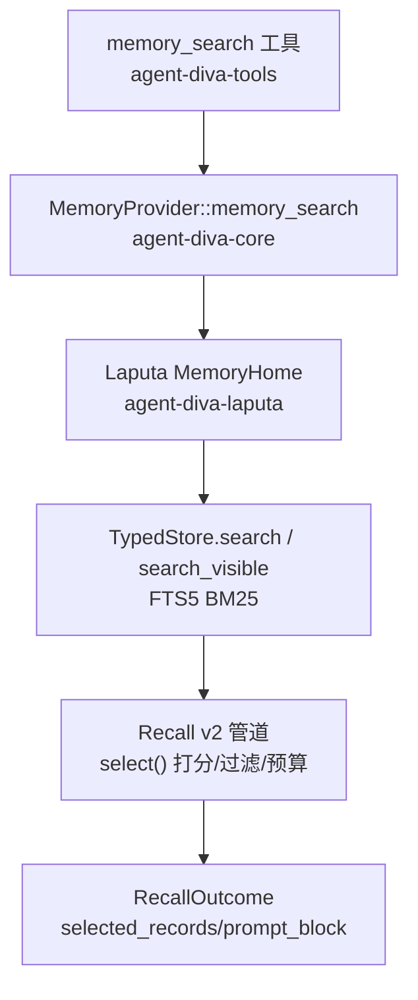
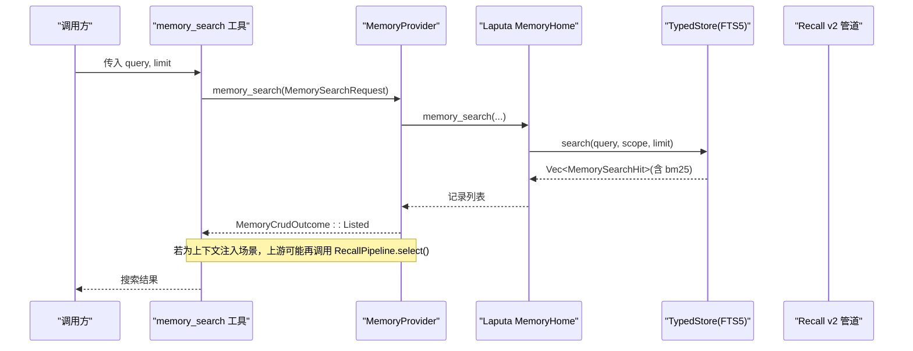
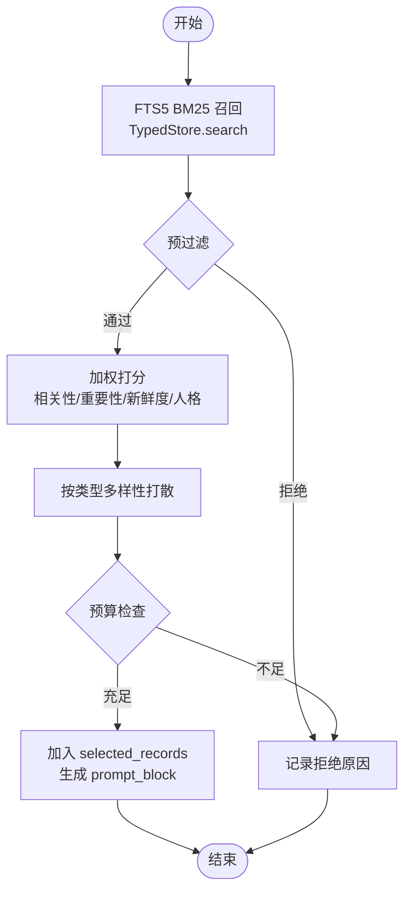
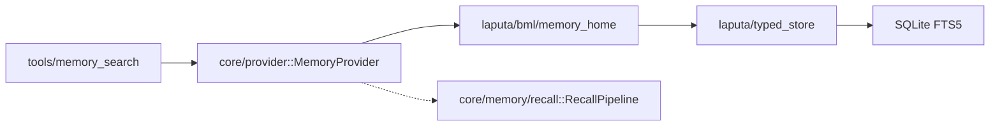

# 语义搜索

<cite>
**本文引用的文件**
- [agent-diva-core/src/memory/recall.rs](file://agent-diva-core/src/memory/recall.rs)
- [agent-diva-core/src/memory/provider.rs](file://agent-diva-core/src/memory/provider.rs)
- [agent-diva-core/src/memory/mod.rs](file://agent-diva-core/src/memory/mod.rs)
- [agent-diva-laputa/src/typed_store.rs](file://agent-diva-laputa/src/typed_store.rs)
- [agent-diva-laputa/src/bml/memory_home.rs](file://agent-diva-laputa/src/bml/memory_home.rs)
- [agent-diva-tools/src/memory_search.rs](file://agent-diva-tools/src/memory_search.rs)
</cite>

## 目录
1. [简介](#简介)
2. [项目结构](#项目结构)
3. [核心组件](#核心组件)
4. [架构总览](#架构总览)
5. [详细组件分析](#详细组件分析)
6. [依赖关系分析](#依赖关系分析)
7. [性能考量](#性能考量)
8. [故障排查指南](#故障排查指南)
9. [结论](#结论)
10. [附录：API 使用与配置示例](#附录api-使用与配置示例)

## 简介
本文件面向开发者，系统性说明 Agent-Diva 中的“语义搜索”能力。当前实现以“全文检索 + 确定性评分排序”为主：底层通过 SQLite FTS5 进行关键词召回（BM25），上层 Recall v2 管道对候选进行严格过滤、去重、多样性打散与预算控制，最终输出可注入系统提示的“记忆块”。文档重点覆盖：
- 向量检索现状与定位（当前未启用向量嵌入）
- 相似度计算与排序策略（BM25 排名 + Recall 加权打分）
- 搜索结果排序与预算控制
- 关键数据结构：RecallCandidate、RecallDecision、RecallOutcome
- 索引构建与查询优化
- 搜索 API 调用方式、参数与结果过滤方法

## 项目结构
语义搜索涉及三层职责：
- 工具层：对外暴露 memory_search 工具，接收用户查询并转发到 MemoryProvider
- 提供者层：MemoryProvider::memory_search 将请求路由到 Laputa 存储
- 存储层：SQLite FTS5 执行 BM25 检索，返回带排名的候选；Recall v2 管道负责筛选、打分、预算控制与输出

**图表来源**
- [agent-diva-tools/src/memory_search.rs:41-79](file://agent-diva-tools/src/memory_search.rs#L41-L79)
- [agent-diva-core/src/memory/provider.rs:502-508](file://agent-diva-core/src/memory/provider.rs#L502-L508)
- [agent-diva-laputa/src/bml/memory_home.rs:640-663](file://agent-diva-laputa/src/bml/memory_home.rs#L640-L663)
- [agent-diva-laputa/src/typed_store.rs:1119-1205](file://agent-diva-laputa/src/typed_store.rs#L1119-L1205)
- [agent-diva-core/src/memory/recall.rs:218-359](file://agent-diva-core/src/memory/recall.rs#L218-L359)

**章节来源**
- [agent-diva-tools/src/memory_search.rs:41-79](file://agent-diva-tools/src/memory_search.rs#L41-L79)
- [agent-diva-core/src/memory/provider.rs:502-508](file://agent-diva-core/src/memory/provider.rs#L502-L508)
- [agent-diva-laputa/src/bml/memory_home.rs:640-663](file://agent-diva-laputa/src/bml/memory_home.rs#L640-L663)
- [agent-diva-laputa/src/typed_store.rs:1119-1205](file://agent-diva-laputa/src/typed_store.rs#L1119-L1205)
- [agent-diva-core/src/memory/recall.rs:218-359](file://agent-diva-core/src/memory/recall.rs#L218-L359)

## 核心组件
- 工具层：memory_search 工具封装了 JSON 参数解析、provider 调用与错误处理
- 提供者接口：MemoryProvider 定义 memory_search 等 CRUD 能力，默认返回 unsupported
- 存储层：Laputa TypedStore 提供 search/search_visible 基于 FTS5 的 BM25 检索
- Recall v2：统一的选择与预算管道，负责过滤、去重、多样性、打分与 token 预算控制，产出 RecallOutcome

**章节来源**
- [agent-diva-tools/src/memory_search.rs:41-79](file://agent-diva-tools/src/memory_search.rs#L41-L79)
- [agent-diva-core/src/memory/provider.rs:415-508](file://agent-diva-core/src/memory/provider.rs#L415-L508)
- [agent-diva-laputa/src/typed_store.rs:1119-1205](file://agent-diva-laputa/src/typed_store.rs#L1119-L1205)
- [agent-diva-core/src/memory/recall.rs:218-359](file://agent-diva-core/src/memory/recall.rs#L218-L359)

## 架构总览
下图展示一次“语义搜索”从工具调用到最终输出的完整流程。注意：当前 memory_search 走的是 BM25 全文检索路径；Recall v2 用于“上下文注入”的候选选择与预算控制，二者在系统中协同但职责不同。

**图表来源**
- [agent-diva-tools/src/memory_search.rs:55-79](file://agent-diva-tools/src/memory_search.rs#L55-L79)
- [agent-diva-core/src/memory/provider.rs:502-508](file://agent-diva-core/src/memory/provider.rs#L502-L508)
- [agent-diva-laputa/src/bml/memory_home.rs:640-663](file://agent-diva-laputa/src/bml/memory_home.rs#L640-L663)
- [agent-diva-laputa/src/typed_store.rs:1119-1205](file://agent-diva-laputa/src/typed_store.rs#L1119-L1205)

## 详细组件分析

### 数据模型：RecallCandidate、RecallDecision、RecallOutcome
- RecallCandidate：包含一条 MemoryRecord 以及检索侧的元数据（relevance_bps、retrieval_source）。它代表“被召回的候选”，不等同于最终选中。
- RecallDecision：每个候选的最终决策，仅 Selected 或 Rejected。
- RecallOutcome：一次 Recall 执行的稳定输出，包含状态、失败分类、选中的记录列表、可注入的 prompt_block、预算使用情况与逐条 trace。

这些类型是 Recall v2 管道的输入/输出契约，便于跨模块稳定序列化与审计追踪。

**章节来源**
- [agent-diva-core/src/memory/recall.rs:70-156](file://agent-diva-core/src/memory/recall.rs#L70-L156)

### 相似度计算与排序
- 检索阶段（FTS5/BM25）：由 TypedStore 的 search/search_visible 使用 SQL 的 bm25(memory_fts) 计算相关性分数，并按 rank 排序返回候选。该阶段属于“召回层”，不决定最终是否进入上下文。
- 选择阶段（Recall v2）：对候选进行严格过滤（工作区/会话/信任/敏感度/过期/墓碑/重复/替代）、多样性打散、加权打分与 token 预算控制。打分权重包括相关性、重要性、新鲜度、人格相关度，最终按分数降序、时间、ID 确定顺序。

**图表来源**
- [agent-diva-laputa/src/typed_store.rs:1119-1205](file://agent-diva-laputa/src/typed_store.rs#L1119-L1205)
- [agent-diva-core/src/memory/recall.rs:252-359](file://agent-diva-core/src/memory/recall.rs#L252-L359)

**章节来源**
- [agent-diva-laputa/src/typed_store.rs:1119-1205](file://agent-diva-laputa/src/typed_store.rs#L1119-L1205)
- [agent-diva-core/src/memory/recall.rs:406-473](file://agent-diva-core/src/memory/recall.rs#L406-L473)
- [agent-diva-core/src/memory/recall.rs:585-597](file://agent-diva-core/src/memory/recall.rs#L585-L597)

### 索引构建与查询优化
- 索引：Laputa 使用 SQLite FTS5 表 memory_fts 进行全文检索。search/search_visible 通过 MATCH 子句匹配查询，并按 bm25(memory_fts) 排序。
- 可见性：search_visible 放宽 session_id 条件，允许“工作区全局 + 精确会话”的可见性形状，满足 Recall 的可见性需求。
- 限制：limit 上限为 100，避免单次扫描过大。
- 优化建议：
  - 合理构造查询词，利用 FTS5 语法提升召回质量
  - 结合 Recall 的 policy（信任/敏感度）与工作区/会话范围缩小候选集
  - 控制 max_candidates 与 token_budget，减少无效渲染

**章节来源**
- [agent-diva-laputa/src/typed_store.rs:1119-1205](file://agent-diva-laputa/src/typed_store.rs#L1119-L1205)

### 搜索算法与预算控制
- 预过滤：校验 relevance_bps 范围、记录有效性、租户/工作区/会话匹配、过期、墓碑、信任与敏感度策略。
- 去重与替代：根据 supersedes 关系与 content_digest 去重。
- 多样性：按记录类型（身份、关系、偏好等）优先保留不同类型，避免同质化。
- 预算：估算头部与每条记录的 token 数，超过 budget 即停止追加。
- 输出：生成 prompt_block 与 selected_records，并附带逐条 trace 用于审计。

**章节来源**
- [agent-diva-core/src/memory/recall.rs:252-359](file://agent-diva-core/src/memory/recall.rs#L252-L359)
- [agent-diva-core/src/memory/recall.rs:532-583](file://agent-diva-core/src/memory/recall.rs#L532-L583)

### 工具层：memory_search 的使用
- 名称：memory_search
- 参数：query（必填）、limit（可选，默认 20）
- 行为：调用 MemoryProvider::memory_search，返回 MemoryCrudOutcome；若 provider 不可用或 workspace 缺失，返回失败信息
- 适用场景：用户询问“是否记住了某事”或在对话中需要检索记忆时使用

**章节来源**
- [agent-diva-tools/src/memory_search.rs:41-79](file://agent-diva-tools/src/memory_search.rs#L41-L79)
- [agent-diva-laputa/src/bml/memory_home.rs:640-663](file://agent-diva-laputa/src/bml/memory_home.rs#L640-L663)

## 依赖关系分析
- 工具层依赖 core 的 MemoryProvider 接口
- Laputa 实现 MemoryProvider，并委托 TypedStore 进行 FTS5 检索
- Recall v2 作为独立管道，可与检索层组合使用（例如在上下文注入时）

**图表来源**
- [agent-diva-tools/src/memory_search.rs:41-79](file://agent-diva-tools/src/memory_search.rs#L41-L79)
- [agent-diva-core/src/memory/provider.rs:415-508](file://agent-diva-core/src/memory/provider.rs#L415-L508)
- [agent-diva-laputa/src/bml/memory_home.rs:640-663](file://agent-diva-laputa/src/bml/memory_home.rs#L640-L663)
- [agent-diva-laputa/src/typed_store.rs:1119-1205](file://agent-diva-laputa/src/typed_store.rs#L1119-L1205)
- [agent-diva-core/src/memory/recall.rs:218-359](file://agent-diva-core/src/memory/recall.rs#L218-L359)

**章节来源**
- [agent-diva-core/src/memory/mod.rs:1-47](file://agent-diva-core/src/memory/mod.rs#L1-L47)

## 性能考量
- 检索阶段：FTS5 BM25 在 SQLite 内完成，适合中等规模语料；注意查询词设计与 limit 控制
- 选择阶段：Recall v2 的过滤与打分是 CPU 密集但线性复杂度，主要开销来自字符串估计与排序
- 预算控制：token 估算采用保守公式（字符数/3 向上取整），避免超预算
- 可扩展性：如需引入向量检索，可在 RecallCandidateSource 中扩展多路召回，并在 select 中融合 BM25 与向量相似度

[本节为通用指导，无需特定文件引用]

## 故障排查指南
- 空查询：memory_search 会直接返回失败，需确保 query 非空
- 工作区不匹配：TypedStore 会拒绝跨工作区的查询
- 提供者不可用：工具层会返回 provider/workspace unavailable
- Recall 降级：当检索源不可用时，RecallPipeline.execute 返回 Degraded 状态与 RetrievalUnavailable
- 预算不足：Recall 会在达到 token_budget 时停止追加，trace 中记录 OverBudget

**章节来源**
- [agent-diva-laputa/src/bml/memory_home.rs:640-663](file://agent-diva-laputa/src/bml/memory_home.rs#L640-L663)
- [agent-diva-laputa/src/typed_store.rs:1119-1180](file://agent-diva-laputa/src/typed_store.rs#L1119-L1180)
- [agent-diva-core/src/memory/recall.rs:218-234](file://agent-diva-core/src/memory/recall.rs#L218-L234)
- [agent-diva-core/src/memory/recall.rs:325-333](file://agent-diva-core/src/memory/recall.rs#L325-L333)

## 结论
Agent-Diva 的语义搜索当前以“FTS5 BM25 召回 + Recall v2 确定性选择”为核心：检索层保证高效召回，选择层保障安全、多样与预算可控。对于需要更高语义匹配的演进方向，可在 RecallCandidateSource 中引入向量召回并与现有 BM25 融合，同时保持 Recall 的过滤与预算机制不变。

[本节为总结，无需特定文件引用]

## 附录：API 使用与配置示例

### 调用 memory_search 工具
- 工具名：memory_search
- 必需参数：query（字符串）
- 可选参数：limit（整数，默认 20）
- 返回值：MemoryCrudOutcome，成功时为 Listed，包含记录列表；失败时包含 reason

示例调用（JSON 形式）：
- {"query": "项目状态", "limit": 10}

**章节来源**
- [agent-diva-tools/src/memory_search.rs:51-79](file://agent-diva-tools/src/memory_search.rs#L51-L79)
- [agent-diva-laputa/src/bml/memory_home.rs:640-663](file://agent-diva-laputa/src/bml/memory_home.rs#L640-L663)

### 配置 Recall 策略（上下文注入）
- RecallPolicy：设置 allowed_trust 与 allowed_sensitivity，控制哪些信任级别与敏感度可进入提示
- RecallRequest：包含 query、scope（tenant_id/workspace_id/session_id）、correlation、now、token_budget、max_candidates、policy
- 典型配置：
  - token_budget：限制注入记忆的 token 总量
  - max_candidates：限制参与选择的候选数量
  - policy：最小权限原则，默认仅允许已应用权威与公开/内部/私密敏感度

**章节来源**
- [agent-diva-core/src/memory/recall.rs:37-68](file://agent-diva-core/src/memory/recall.rs#L37-L68)
- [agent-diva-core/src/memory/recall.rs:509-530](file://agent-diva-core/src/memory/recall.rs#L509-L530)

### 结果过滤方法
- 工作区/会话：Recall 会拒绝不在同一租户/工作区或会话不匹配的候选
- 信任/敏感度：依据 RecallPolicy 过滤
- 过期/墓碑/替代/重复：自动拒绝
- 预算：超出 token_budget 的候选将被拒绝
- 多样性：同类型记录会被打散，避免单一类型主导

**章节来源**
- [agent-diva-core/src/memory/recall.rs:270-337](file://agent-diva-core/src/memory/recall.rs#L270-L337)
- [agent-diva-core/src/memory/recall.rs:532-583](file://agent-diva-core/src/memory/recall.rs#L532-L583)