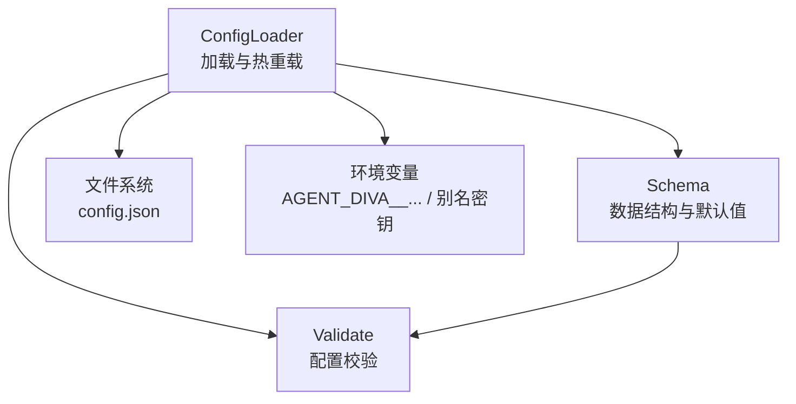
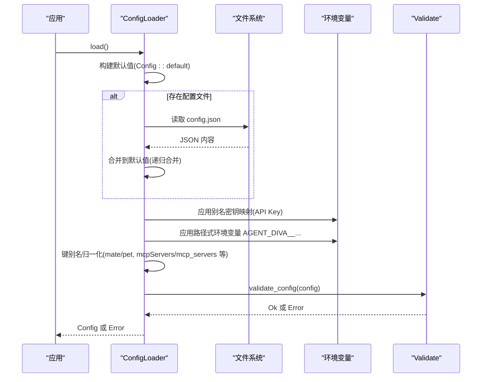
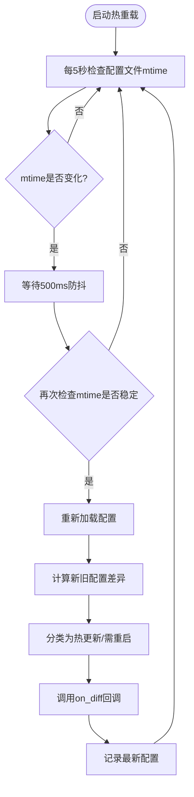
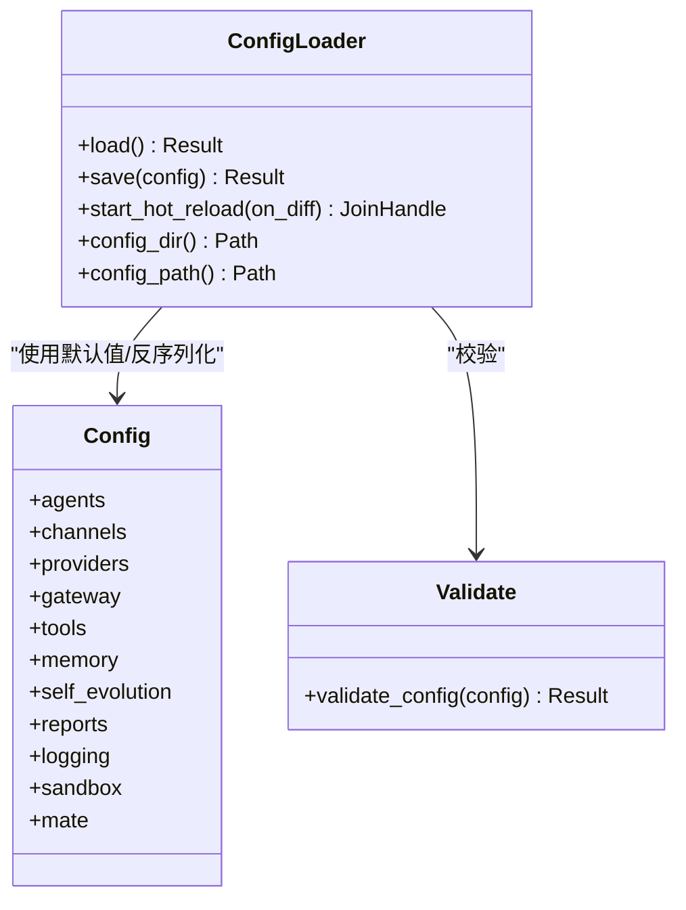

# 配置管理

<cite>
**本文引用的文件**
- [agent-diva-core/src/config/mod.rs](file://agent-diva-core/src/config/mod.rs)
- [agent-diva-core/src/config/loader.rs](file://agent-diva-core/src/config/loader.rs)
- [agent-diva-core/src/config/schema.rs](file://agent-diva-core/src/config/schema.rs)
- [agent-diva-core/src/config/validate.rs](file://agent-diva-core/src/config/validate.rs)
</cite>

## 目录
1. [简介](#简介)
2. [项目结构](#项目结构)
3. [核心组件](#核心组件)
4. [架构总览](#架构总览)
5. [详细组件分析](#详细组件分析)
6. [依赖关系分析](#依赖关系分析)
7. [性能考量](#性能考量)
8. [故障排查指南](#故障排查指南)
9. [结论](#结论)
10. [附录：配置示例与最佳实践](#附录：配置示例与最佳实践)

## 简介
本文件面向开发者，系统性说明 Agent Diva 的配置管理系统，包括：
- 配置结构定义（JSON Schema）
- 动态加载机制（默认值、配置文件合并、环境变量覆盖、键别名归一化）
- 配置验证规则
- 热重载能力（运行时可热更新字段 vs 需重启字段）
- 继承关系、默认值处理与迁移策略（键别名、旧字段迁移）
- 环境变量支持与优先级规则
- 使用指南、示例与最佳实践

## 项目结构
配置系统位于 core 模块的 config 子模块中，采用分层设计：
- schema：定义所有配置项的数据结构与默认值
- loader：负责从默认值、配置文件、环境变量进行合并加载，并提供热重载
- validate：集中校验配置合法性
- mod：对外暴露公共类型与入口

图表来源
- [agent-diva-core/src/config/loader.rs:12-74](file://agent-diva-core/src/config/loader.rs#L12-L74)
- [agent-diva-core/src/config/schema.rs:278-309](file://agent-diva-core/src/config/schema.rs#L278-L309)
- [agent-diva-core/src/config/validate.rs:5-99](file://agent-diva-core/src/config/validate.rs#L5-L99)

章节来源
- [agent-diva-core/src/config/mod.rs:1-12](file://agent-diva-core/src/config/mod.rs#L1-L12)

## 核心组件
- ConfigLoader：提供 load/save/start_hot_reload 等方法，实现配置加载、持久化与热重载。
- Config（schema）：根配置对象，聚合 agents/channels/providers/gateway/tools/memory/self_evolution/reports/logging/sandbox/mate 等子配置。
- Validate：对关键配置项执行范围、枚举、必填等校验。
- 热重载：基于文件 mtime 轮询 + 防抖，计算 diff，区分 hot_reload 与 restart_required 两类变更。

章节来源
- [agent-diva-core/src/config/loader.rs:12-178](file://agent-diva-core/src/config/loader.rs#L12-L178)
- [agent-diva-core/src/config/schema.rs:278-309](file://agent-diva-core/src/config/schema.rs#L278-L309)
- [agent-diva-core/src/config/validate.rs:5-99](file://agent-diva-core/src/config/validate.rs#L5-L99)

## 架构总览
配置加载流程遵循“默认值 → 配置文件 → 环境变量 → 键别名归一化 → 反序列化为强类型 → 校验”的顺序。热重载在后台任务中按固定间隔检测文件修改时间，防抖后重新加载并计算差异，调用回调通知上层。

图表来源
- [agent-diva-core/src/config/loader.rs:57-74](file://agent-diva-core/src/config/loader.rs#L57-L74)
- [agent-diva-core/src/config/loader.rs:371-463](file://agent-diva-core/src/config/loader.rs#L371-L463)
- [agent-diva-core/src/config/validate.rs:5-99](file://agent-diva-core/src/config/validate.rs#L5-L99)

## 详细组件分析

### 配置结构定义（Schema）
- 根配置 Config：包含 agents、channels、providers、gateway、tools、memory、self_evolution、reports、logging、sandbox、mate 等子配置。
- 各子配置均有明确的默认值与可选字段，便于最小化配置即可运行。
- 重要子配置要点：
  - AgentsDefaults：workspace、provider、model、max_tokens、temperature、max_tool_iterations、reasoning_effort、thinking_mode。
  - ChannelsConfig：多通道（Telegram/Discord/WhatsApp/Feishu/DingTalk/Email/Slack/QQ/Matrix/Irc/Mattermost/Nextcloud Talk/NeuroLink）。
  - ProvidersConfig：内置提供商列表及自定义提供商扩展。
  - ToolsConfig：内置工具开关、Web 搜索/抓取、执行超时、MCP 服务器、上下文压缩预算。
  - MateConfig：桌面虚拟人（VRM）、TTS/ASR 提供商与参数。
  - SandboxConfig：沙箱模式、网络访问、审批策略、保护路径等。
  - LoggingConfig：日志级别、格式、目录、保留天数、模块覆盖。
  - ReportsConfig/LlmCurationConfig：报告生成与 LLM 策展开关与限制。

章节来源
- [agent-diva-core/src/config/schema.rs:278-309](file://agent-diva-core/src/config/schema.rs#L278-L309)
- [agent-diva-core/src/config/schema.rs:559-603](file://agent-diva-core/src/config/schema.rs#L559-L603)
- [agent-diva-core/src/config/schema.rs:605-642](file://agent-diva-core/src/config/schema.rs#L605-L642)
- [agent-diva-core/src/config/schema.rs:1193-1224](file://agent-diva-core/src/config/schema.rs#L1193-L1224)
- [agent-diva-core/src/config/schema.rs:1419-1437](file://agent-diva-core/src/config/schema.rs#L1419-L1437)
- [agent-diva-core/src/config/schema.rs:1617-1735](file://agent-diva-core/src/config/schema.rs#L1617-L1735)
- [agent-diva-core/src/config/schema.rs:49-95](file://agent-diva-core/src/config/schema.rs#L49-L95)
- [agent-diva-core/src/config/schema.rs:511-557](file://agent-diva-core/src/config/schema.rs#L511-L557)
- [agent-diva-core/src/config/schema.rs:378-444](file://agent-diva-core/src/config/schema.rs#L378-L444)

### 动态加载机制
- 默认值：从 Config::default 开始，确保所有字段都有合理初始值。
- 配置文件合并：若存在 config.json，则递归合并到默认值上，同名对象字段逐层合并，非对象直接覆盖。
- 环境变量覆盖：
  - 别名密钥映射：如 OPENAI_API_KEY → providers.openai.api_key 等。
  - 路径式变量：以 AGENT_DIVA__ 为前缀，双下划线分隔层级，自动转为小写路径并写入对应节点；支持 JSON/布尔/整数/浮点/字符串解析。
- 键别名归一化：将历史/别名键统一为标准键，例如：
  - channels.neuro-link 接受 neuro_link、generic_pipe
  - tools.mcpServers 接受 mcp_servers
  - tools.mcpManager 接受 mcp_manager
  - 顶层 pet 迁移为 mate
- 反序列化与校验：合并后的 JSON 反序列化为强类型 Config，再执行 validate_config。

章节来源
- [agent-diva-core/src/config/loader.rs:57-74](file://agent-diva-core/src/config/loader.rs#L57-L74)
- [agent-diva-core/src/config/loader.rs:308-323](file://agent-diva-core/src/config/loader.rs#L308-L323)
- [agent-diva-core/src/config/loader.rs:325-416](file://agent-diva-core/src/config/loader.rs#L325-L416)
- [agent-diva-core/src/config/loader.rs:418-463](file://agent-diva-core/src/config/loader.rs#L418-L463)

### 配置验证规则
- agents.defaults.workspace 非空
- agents.defaults.max_tokens > 0
- agents.defaults.temperature ∈ [0.0, 2.0]
- agents.defaults.max_tool_iterations > 0
- agents.defaults.reasoning_effort ∈ {low, medium, high}（可选）
- tools.mcp_servers.* 必须设置 command 或 url 之一
- tools.web.search.provider ∈ {brave, bocha, zhipu}，且 max_results 受 provider 限制
- mate.asr_provider ∈ {web_speech, siliconflow}（可选）
- mate.tts_provider ∈ {browser, openai, siliconflow, minimax}（可选）
- mate.tts_speed > 0，mate.tts_volume ∈ [0.0, 2.0]
- reports.llm_curation 内部校验（timeout/max_input_tokens/max_output_tokens/fallback）

章节来源
- [agent-diva-core/src/config/validate.rs:5-99](file://agent-diva-core/src/config/validate.rs#L5-L99)

### 热重载功能
- 启动方式：start_hot_reload(on_diff)，后台任务每 5 秒检查一次配置文件 mtime。
- 防抖：检测到变化后等待 500ms 再次确认，避免编辑器自动保存导致的多次触发。
- 差异计算：compute_diff(old, new) 将两个配置序列化为 JSON Value 并递归比较，收集 ChangedField。
- 分类策略：classify_field 将变更分为 hot_reload（可在运行时生效）与 restart_required（需重启进程）。
  - 允许热更新的字段包括：agents.defaults.model/temperature/max_tool_iterations/reasoning_effort、tools.budget、tools.exec.timeout、tools.web.search.enabled、tools.web.fetch.enabled、sandbox.mode、sandbox.approval_policy、logging.level。
- 回调接口：on_diff(diff, new_config) 由上层决定如何应用变更（例如刷新工具、调整日志级别、切换模型等）。

图表来源
- [agent-diva-core/src/config/loader.rs:94-172](file://agent-diva-core/src/config/loader.rs#L94-L172)
- [agent-diva-core/src/config/loader.rs:214-306](file://agent-diva-core/src/config/loader.rs#L214-L306)

章节来源
- [agent-diva-core/src/config/loader.rs:94-172](file://agent-diva-core/src/config/loader.rs#L94-L172)
- [agent-diva-core/src/config/loader.rs:180-306](file://agent-diva-core/src/config/loader.rs#L180-L306)

### 继承关系、默认值与迁移策略
- 继承关系：默认值作为基线，配置文件覆盖，环境变量最高优先级；键别名归一化保证向后兼容。
- 默认值：每个配置项均提供合理默认值，减少用户配置负担。
- 迁移策略：
  - 键别名：pet → mate；neuro_link/neuro-link/generic_pipe 统一；mcpServers/mcp_servers；mcpManager/mcp_manager。
  - 测试用例覆盖了这些迁移行为，确保旧配置仍可正确解析并输出标准键。

章节来源
- [agent-diva-core/src/config/loader.rs:429-463](file://agent-diva-core/src/config/loader.rs#L429-L463)
- [agent-diva-core/src/config/loader.rs:728-754](file://agent-diva-core/src/config/loader.rs#L728-L754)

## 依赖关系分析
- ConfigLoader 依赖 schema::Config 提供默认值与类型定义。
- ConfigLoader 依赖 validate::validate_config 完成最终校验。
- 热重载依赖 tokio 异步任务与系统文件 mtime 监控。
- 环境变量通过 std::env 读取，并通过路径映射写入 JSON Value 树。

图表来源
- [agent-diva-core/src/config/loader.rs:12-178](file://agent-diva-core/src/config/loader.rs#L12-L178)
- [agent-diva-core/src/config/schema.rs:278-309](file://agent-diva-core/src/config/schema.rs#L278-L309)
- [agent-diva-core/src/config/validate.rs:5-99](file://agent-diva-core/src/config/validate.rs#L5-L99)

章节来源
- [agent-diva-core/src/config/loader.rs:12-178](file://agent-diva-core/src/config/loader.rs#L12-L178)
- [agent-diva-core/src/config/schema.rs:278-309](file://agent-diva-core/src/config/schema.rs#L278-L309)
- [agent-diva-core/src/config/validate.rs:5-99](file://agent-diva-core/src/config/validate.rs#L5-L99)

## 性能考量
- 热重载轮询间隔为 5 秒，适合大多数场景；如需更灵敏响应，可调整轮询周期（当前实现固定）。
- 防抖 500ms 有效降低频繁保存带来的重复加载开销。
- 差异计算采用 JSON Value 递归对比，复杂度与配置树大小线性相关；对于大型配置仍保持高效。
- 环境变量解析支持多种类型，避免额外转换成本。

[本节为通用指导，不直接分析具体文件]

## 故障排查指南
- 常见错误来源：
  - 环境变量拼写错误或路径不正确（AGENT_DIVA__ 前缀与层级分隔符 __）
  - 配置文件 JSON 语法错误
  - 校验失败（如 temperature 超出范围、MCP 未设置传输方式等）
- 定位方法：
  - 查看加载流程日志（热重载会打印变更统计）
  - 检查 validate_config 返回的错误信息
  - 使用 with_file/with_dir 指定配置路径，隔离问题环境
- 建议：
  - 先启用最小配置，逐步添加字段
  - 使用环境变量覆盖敏感信息（API Key），避免写入配置文件
  - 关注热重载分类：hot_reload 字段可立即生效，restart_required 字段需重启服务

章节来源
- [agent-diva-core/src/config/loader.rs:94-172](file://agent-diva-core/src/config/loader.rs#L94-L172)
- [agent-diva-core/src/config/validate.rs:5-99](file://agent-diva-core/src/config/validate.rs#L5-L99)

## 结论
Agent Diva 的配置系统提供了清晰的结构定义、灵活的加载机制、严格的校验与实用的热重载能力。通过默认值、配置文件与环境变量的组合，以及键别名归一化与迁移策略，既保证了易用性又兼顾了演进兼容性。开发者应优先使用环境变量注入敏感信息，合理使用热更新字段提升运维效率，并在变更涉及重启字段时规划重启窗口。

[本节为总结性内容，不直接分析具体文件]

## 附录：配置示例与最佳实践

### 配置文件位置与命名
- 默认配置目录：~/.agent-diva
- 配置文件名：config.json
- 可通过 ConfigLoader::with_dir 或 with_file 自定义路径

章节来源
- [agent-diva-core/src/config/loader.rs:20-55](file://agent-diva-core/src/config/loader.rs#L20-L55)

### 环境变量支持
- 别名密钥映射：OPENAI_API_KEY、ANTHROPIC_API_KEY 等将映射到 providers.*.api_key
- 路径式变量：AGENT_DIVA__AGENTS__DEFAULTS__MODEL=xxx 将设置 agents.defaults.model
- 类型解析：支持 JSON、布尔、整数、浮点、字符串

章节来源
- [agent-diva-core/src/config/loader.rs:371-416](file://agent-diva-core/src/config/loader.rs#L371-L416)

### 配置优先级
- 顺序：默认值 → 配置文件 → 环境变量（含别名与路径式）→ 键别名归一化
- 结果：最终得到强类型 Config，再执行校验

章节来源
- [agent-diva-core/src/config/loader.rs:57-74](file://agent-diva-core/src/config/loader.rs#L57-L74)

### 热更新与重启要求
- 热更新字段：agents.defaults.model/temperature/max_tool_iterations/reasoning_effort、tools.budget、tools.exec.timeout、tools.web.search.enabled、tools.web.fetch.enabled、sandbox.mode、sandbox.approval_policy、logging.level
- 其他字段：需要重启进程才能生效

章节来源
- [agent-diva-core/src/config/loader.rs:214-239](file://agent-diva-core/src/config/loader.rs#L214-L239)

### 迁移与别名
- pet → mate
- neuro_link/neuro-link/generic_pipe → neuro-link
- mcpServers/mcp_servers → mcp_servers
- mcpManager/mcp_manager → mcp_manager

章节来源
- [agent-diva-core/src/config/loader.rs:429-463](file://agent-diva-core/src/config/loader.rs#L429-L463)

### 最佳实践
- 使用环境变量管理敏感信息（API Key）
- 仅将必要字段写入配置文件，其余使用默认值
- 利用热更新字段实现快速调优（如温度、日志级别）
- 变更涉及重启字段时，提前规划重启窗口
- 定期审查 validate_config 错误，确保配置合法

[本节为通用指导，不直接分析具体文件]