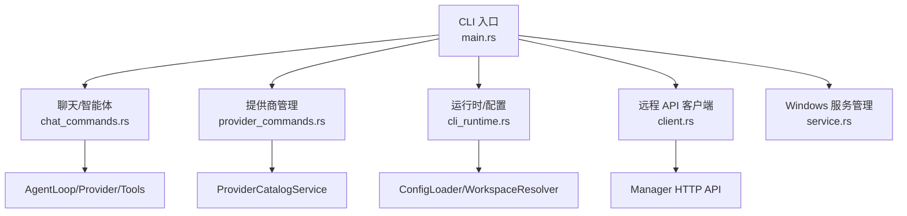
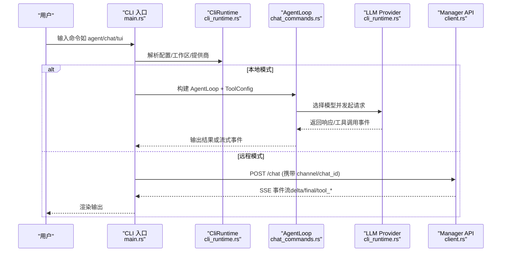
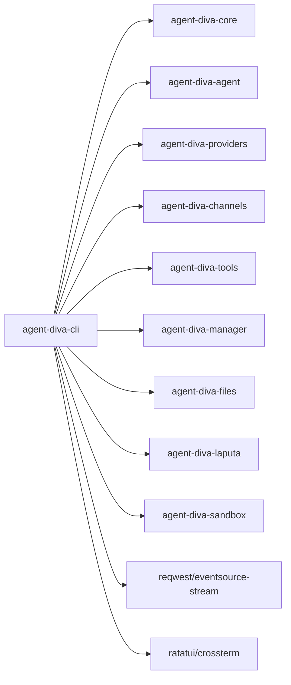

# CLI 命令行工具

<cite>
**本文引用的文件**
- [main.rs](file://agent-diva-cli/src/main.rs)
- [chat_commands.rs](file://agent-diva-cli/src/chat_commands.rs)
- [provider_commands.rs](file://agent-diva-cli/src/provider_commands.rs)
- [cli_runtime.rs](file://agent-diva-cli/src/cli_runtime.rs)
- [client.rs](file://agent-diva-cli/src/client.rs)
- [service.rs](file://agent-diva-cli/src/service.rs)
- [Cargo.toml](file://agent-diva-cli/Cargo.toml)
- [config_commands.rs](file://agent-diva-cli/tests/config_commands.rs)
- [workspace_commands.rs](file://agent-diva-cli/tests/workspace_commands.rs)
</cite>

## 目录
1. [简介](#简介)
2. [项目结构](#项目结构)
3. [核心命令总览](#核心命令总览)
4. [架构概览](#架构概览)
5. [详细命令说明](#详细命令说明)
6. [依赖关系分析](#依赖关系分析)
7. [性能与使用建议](#性能与使用建议)
8. [故障排查指南](#故障排查指南)
9. [结论](#结论)
10. [附录：常用场景示例](#附录：常用场景示例)

## 简介
本文件面向 agent-diva 的 CLI 命令行工具，系统性介绍所有命令、参数选项、交互模式、远程模式与 API 客户端使用方法，并提供常见使用场景的完整命令示例。CLI 提供智能体交互（agent）、聊天模式（chat）、网关管理（gateway）、提供商管理（provider）、配置管理（config）、定时任务（cron）、工作区管理（workspace）、待办事项（todo）、面具管理（mask）等能力，并支持本地运行与通过 Manager 的远程模式。

## 项目结构
CLI 入口位于 agent-diva-cli 包中，采用 clap 解析子命令，内部按职责拆分为多个模块：
- 主程序与命令路由：main.rs
- 聊天/智能体流程：chat_commands.rs
- 提供商管理：provider_commands.rs
- 运行时与配置路径：cli_runtime.rs
- 远程 API 客户端：client.rs
- Windows 服务管理：service.rs
- 测试用例：tests/*

图表来源
- [main.rs:59-205](file://agent-diva-cli/src/main.rs#L59-L205)
- [chat_commands.rs:79-144](file://agent-diva-cli/src/chat_commands.rs#L79-L144)
- [provider_commands.rs:25-153](file://agent-diva-cli/src/provider_commands.rs#L25-L153)
- [cli_runtime.rs:117-227](file://agent-diva-cli/src/cli_runtime.rs#L117-L227)
- [client.rs:43-54](file://agent-diva-cli/src/client.rs#L43-L54)

章节来源
- [main.rs:59-205](file://agent-diva-cli/src/main.rs#L59-L205)
- [Cargo.toml:1-24](file://agent-diva-cli/Cargo.toml#L1-L24)

## 核心命令总览
- 全局选项
  - --config <path>：指定配置文件路径
  - --config-dir <dir>：指定配置目录
  - -w, --workspace <path>：临时覆盖工作区路径
  - --remote：切换到远程模式（连接 Manager）
  - --api-url <url>：设置远程 API 地址（默认 http://localhost:3000/api）

- 顶层命令
  - onboard：初始化向导
  - gateway：启动网关（当前仅支持前台运行）
  - agent：发送消息给智能体（支持流式日志、Markdown 输出、审批队列模式、JSON 输出）
  - chat：轻量交互式聊天循环（支持 /quit /clear /new /stop /thinking /compact /mask）
  - approvals：审批中心（list / decide / cancel / review）
  - tui：终端 TUI 聊天界面
  - status：系统状态报告
  - channels：渠道管理（login / status）
  - provider：提供商管理（list / status / set / models / login）
  - config：配置管理（path / init / refresh / validate / doctor / show）
  - service：Windows 服务管理（install / start / stop / restart / uninstall / status）
  - cron：定时任务（add / list / remove / enable / run）
  - workspace：工作区管理（create / list / switch / delete）
  - todo：待办事项管理
  - mask：面具管理

章节来源
- [main.rs:59-205](file://agent-diva-cli/src/main.rs#L59-L205)
- [main.rs:258-388](file://agent-diva-cli/src/main.rs#L258-L388)
- [main.rs:396-439](file://agent-diva-cli/src/main.rs#L396-L439)

## 架构概览
CLI 在本地模式下直接构建 AgentLoop，加载配置与工作区，选择模型与提供商，并通过内置工具链执行任务；在远程模式下通过 ApiClient 调用 Manager 的 HTTP API，接收事件流（delta/final/tool_start/tool_finish/error 等）。

图表来源
- [main.rs:450-553](file://agent-diva-cli/src/main.rs#L450-L553)
- [chat_commands.rs:79-144](file://agent-diva-cli/src/chat_commands.rs#L79-L144)
- [client.rs:152-262](file://agent-diva-cli/src/client.rs#L152-L262)

## 详细命令说明

### agent 命令
- 功能：向智能体发送单条消息，支持本地或远程执行，支持流式日志、Markdown 输出、会话保持、审批队列模式与 JSON 结构化输出。
- 关键参数
  - --message：消息内容
  - -m, --model：指定模型
  - -s, --session：会话键（用于上下文延续）
  - --markdown / --no-markdown：是否以 Markdown 友好格式输出
  - --logs / --no-logs：是否显示推理与工具调用日志
  - --approval-mode：headless 审批模式（fail | queue）
  - --json：输出结构化 JSON
  - 全局：--remote / --api-url
- 行为要点
  - 本地模式：构建 AgentLoop，处理 direct/streaming，必要时拒绝未处理的审批请求。
  - 远程模式：通过 ApiClient.chat_with_target 发送消息，轮询审批队列，遇到需要交互的审批时根据 mode 决定排队或取消。
- 输出格式
  - 文本模式：打印“Response:”后跟最终回复；可选显示工具调用日志。
  - JSON 模式：当启用 --json 且出现审批相关错误时，输出 ApprovalCliResult 结构。

章节来源
- [main.rs:98-127](file://agent-diva-cli/src/main.rs#L98-L127)
- [main.rs:489-537](file://agent-diva-cli/src/main.rs#L489-L537)
- [chat_commands.rs:375-448](file://agent-diva-cli/src/chat_commands.rs#L375-L448)
- [chat_commands.rs:466-550](file://agent-diva-cli/src/chat_commands.rs#L466-L550)
- [chat_commands.rs:552-663](file://agent-diva-cli/src/chat_commands.rs#L552-L663)

### chat 命令
- 功能：轻量交互式聊天循环，支持命令控制会话、思考模式、压缩、面具切换等。
- 关键参数
  - -m, --model：指定模型
  - -s, --session：会话键
  - --markdown / --no-markdown
  - --logs / --no-logs
  - 全局：--remote / --api-url
- 交互命令
  - /quit：退出
  - /clear：清屏
  - /new：新建会话
  - /stop：停止当前会话（本地模式）
  - /thinking auto|on|off：切换思考模式
  - /compact：压缩会话上下文（本地模式）
  - /mask list/wear/off/status/reload：面具管理
- 行为要点
  - 本地模式：构建 AgentLoop，维护会话，支持 ask_user 问答。
  - 远程模式：通过 ApiClient.chat_with_target 进行对话。

章节来源
- [main.rs:128-148](file://agent-diva-cli/src/main.rs#L128-L148)
- [main.rs:538-553](file://agent-diva-cli/src/main.rs#L538-L553)
- [chat_commands.rs:665-778](file://agent-diva-cli/src/chat_commands.rs#L665-L778)
- [chat_commands.rs:780-800](file://agent-diva-cli/src/chat_commands.rs#L780-L800)

### gateway 命令
- 功能：启动网关进程（当前实现为前台运行）。
- 子命令
  - run：前台运行网关
- 行为要点
  - 非结构化输出时打印启动信息。

章节来源
- [main.rs:93-97](file://agent-diva-cli/src/main.rs#L93-L97)
- [main.rs:258-263](file://agent-diva-cli/src/main.rs#L258-L263)
- [main.rs:481-488](file://agent-diva-cli/src/main.rs#L481-L488)

### approvals 命令
- 功能：查看、决策、取消审批请求，或交互式审查。
- 子命令
  - list：列出审批（可过滤状态、会话），支持 --json
  - decide：对指定请求做出决策（allow-once/allow-session/allow-rule/deny），支持 --json
  - cancel：取消一个待处理请求，支持 --json
  - review：交互式审查当前待处理请求
- 行为要点
  - 通过 ApiClient 访问 Manager 的审批接口，支持分页拉取。

章节来源
- [main.rs:149-153](file://agent-diva-cli/src/main.rs#L149-L153)
- [main.rs:207-242](file://agent-diva-cli/src/main.rs#L207-L242)
- [main.rs:554-635](file://agent-diva-cli/src/main.rs#L554-L635)
- [client.rs:56-150](file://agent-diva-cli/src/client.rs#L56-L150)

### tui 命令
- 功能：启动终端 TUI 聊天界面。
- 关键参数
  - -m, --model
  - -s, --session
  - 全局：--remote / --api-url
- 行为要点
  - 本地模式：进入 TUI 循环；远程模式：通过 ApiClient 进行对话。

章节来源
- [main.rs:154-162](file://agent-diva-cli/src/main.rs#L154-L162)
- [main.rs:636-645](file://agent-diva-cli/src/main.rs#L636-L645)

### status 命令
- 功能：输出系统状态报告（包含配置路径、默认模型/提供商、日志、提供商、渠道、定时任务、MCP 服务器、医生诊断摘要）。
- 关键参数
  - --json：输出结构化 JSON

章节来源
- [main.rs:163-164](file://agent-diva-cli/src/main.rs#L163-L164)
- [main.rs:646-651](file://agent-diva-cli/src/main.rs#L646-L651)
- [cli_runtime.rs:793-800](file://agent-diva-cli/src/cli_runtime.rs#L793-L800)

### channels 命令
- 功能：渠道登录与状态查询。
- 子命令
  - login：登录指定渠道
  - status：渠道状态（支持 --json）

章节来源
- [main.rs:165-169](file://agent-diva-cli/src/main.rs#L165-L169)
- [main.rs:265-272](file://agent-diva-cli/src/main.rs#L265-L272)
- [main.rs:652-665](file://agent-diva-cli/src/main.rs#L652-L665)

### provider 命令
- 功能：提供商管理与模型发现。
- 子命令
  - list：列出可管理提供商（支持 --json）
  - status：当前提供商与模型状态（支持 --json）
  - set：设置默认提供商/模型与凭据（支持 --json）
  - models：获取提供商可用模型（支持 --json，静态回退）
  - login：占位实现（提示未实现）
- 行为要点
  - 通过 ProviderCatalogService 解析提供商视图与模型目录。

章节来源
- [main.rs:170-174](file://agent-diva-cli/src/main.rs#L170-L174)
- [main.rs:274-319](file://agent-diva-cli/src/main.rs#L274-L319)
- [main.rs:666-688](file://agent-diva-cli/src/main.rs#L666-L688)
- [provider_commands.rs:25-234](file://agent-diva-cli/src/provider_commands.rs#L25-L234)

### config 命令
- 功能：配置路径、初始化、刷新、校验、医生诊断、显示有效配置（敏感字段脱敏）。
- 子命令
  - path：打印解析后的配置与运行时路径（支持 --json）
  - init：非交互式初始化（基于 onboard 语义）
  - refresh：刷新配置与工作区模板
  - validate：校验配置结构与语义规则（支持 --json）
  - doctor：校验+运行时就绪检查（支持 --json）
  - show：显示当前有效配置（pretty/json，敏感字段自动脱敏）
- 行为要点
  - 脱敏逻辑会识别 api_key/token/secret/password 等关键字段并替换为 "***REDACTED***"。

章节来源
- [main.rs:175-184](file://agent-diva-cli/src/main.rs#L175-L184)
- [main.rs:396-439](file://agent-diva-cli/src/main.rs#L396-L439)
- [main.rs:689-696](file://agent-diva-cli/src/main.rs#L689-L696)
- [cli_runtime.rs:435-468](file://agent-diva-cli/src/cli_runtime.rs#L435-L468)

### service 命令
- 功能：Windows 服务安装、启停、重启、卸载、状态查询（仅 Windows 平台）。
- 子命令
  - install：安装或更新服务定义（--auto-start / --dry-run）
  - start：启动服务（--dry-run）
  - stop：停止服务（--dry-run）
  - restart：重启服务（--dry-run）
  - uninstall：卸载服务（--dry-run）
  - status：服务状态（--json / --dry-run）
- 行为要点
  - 非 Windows 平台将报错提示不支持。

章节来源
- [main.rs:180-184](file://agent-diva-cli/src/main.rs#L180-L184)
- [main.rs:697-703](file://agent-diva-cli/src/main.rs#L697-L703)
- [service.rs:5-67](file://agent-diva-cli/src/service.rs#L5-L67)
- [service.rs:69-401](file://agent-diva-cli/src/service.rs#L69-L401)

### cron 命令
- 功能：定时任务管理（添加、列表、移除、启用/禁用、手动运行）。
- 子命令
  - add：添加任务（name/message/every/cron_expr/at/timezone/deliver/to/channel）
  - list：列出任务（--all）
  - remove：移除任务
  - enable：启用/禁用任务
  - run：手动运行任务（--force）
- 行为要点
  - 任务存储于配置目录下的 jobs.json。

章节来源
- [main.rs:185-189](file://agent-diva-cli/src/main.rs#L185-L189)
- [main.rs:321-381](file://agent-diva-cli/src/main.rs#L321-L381)
- [main.rs:704-748](file://agent-diva-cli/src/main.rs#L704-L748)
- [cli_runtime.rs:196-201](file://agent-diva-cli/src/cli_runtime.rs#L196-L201)

### workspace 命令
- 功能：命名工作区管理（创建、列表、切换、删除）。
- 子命令
  - create：创建工作区
  - list：列出受管工作区
  - switch：切换工作区（写入配置）
  - delete：删除工作区（--force）
- 行为要点
  - 列表不会创建 workspaces 目录；删除受保护的工作区（当前活动工作区）会被拒绝。

章节来源
- [main.rs:190-194](file://agent-diva-cli/src/main.rs#L190-L194)
- [main.rs:749-754](file://agent-diva-cli/src/main.rs#L749-L754)
- [workspace_commands.rs:35-191](file://agent-diva-cli/tests/workspace_commands.rs#L35-L191)
- [workspace_commands.rs:193-337](file://agent-diva-cli/tests/workspace_commands.rs#L193-L337)

### todo 命令
- 功能：待办事项管理（数据根目录为工作区下的 todos）。
- 行为要点
  - 通过 commands::todo::run 执行具体子命令。

章节来源
- [main.rs:195-199](file://agent-diva-cli/src/main.rs#L195-L199)
- [main.rs:755-763](file://agent-diva-cli/src/main.rs#L755-L763)

### mask 命令
- 功能：面具管理（注册、穿戴、状态、重载等）。
- 行为要点
  - 通过 commands::mask::run 执行具体子命令；聊天模式中支持 /mask 子命令。

章节来源
- [main.rs:200-204](file://agent-diva-cli/src/main.rs#L200-L204)
- [main.rs:764-769](file://agent-diva-cli/src/main.rs#L764-L769)
- [chat_commands.rs:780-800](file://agent-diva-cli/src/chat_commands.rs#L780-L800)

## 依赖关系分析
CLI 依赖的核心模块与外部库：
- agent-diva-core：配置、工作区、定时任务、治理、安全等
- agent-diva-agent：AgentLoop、工具配置、掩码等
- agent-diva-providers：提供商目录、模型发现、构建 LLMProvider
- agent-diva-channels：多渠道接入
- agent-diva-tools：内置工具集
- agent-diva-manager：网关运行与管理器集成
- agent-diva-files：文件管理
- agent-diva-laputa：记忆/经验等
- agent-diva-sandbox：命令审批与安全策略
- reqwest/eventsource-stream：HTTP 与 SSE 事件流
- ratatui/crossterm：TUI 终端界面
- clap/console/dialoguer：CLI 解析与交互

图表来源
- [Cargo.toml:15-24](file://agent-diva-cli/Cargo.toml#L15-L24)

章节来源
- [Cargo.toml:15-24](file://agent-diva-cli/Cargo.toml#L15-L24)

## 性能与使用建议
- 流式输出：开启 --logs 可获得推理与工具调用的实时反馈，适合调试与长任务观察。
- 会话复用：通过 --session 保持上下文，减少重复上下文构建开销。
- 远程模式：在高并发或分布式环境中，优先使用 --remote 将计算负载转移到 Manager。
- 审批队列：headless 环境建议使用 --approval-mode=queue，避免阻塞；需配合 approvals 命令处理。
- 配置优化：定期运行 config doctor 检查缺失字段与警告，确保提供商与渠道就绪。

[本节为通用指导，不直接分析具体文件]

## 故障排查指南
- 提供商未配置或缺少字段
  - 现象：provider list/status 显示 missing fields 或未就绪
  - 处理：使用 provider set 设置 api_key 与 api_base；或通过 provider models 确认模型可用性
- 远程模式连接失败
  - 现象：API 调用错误或无法获取审批队列
  - 处理：检查 --api-url 是否正确；确认 Manager 服务已启动并可访问
- 审批阻塞
  - 现象：agent 在非交互模式下因需要审批而失败
  - 处理：使用 approvals list 查看并 decide/cancel；或在 headless 模式使用 queue 模式
- 配置敏感信息泄露
  - 现象：config show 输出包含密钥
  - 处理：CLI 会自动脱敏；若仍出现，请检查自定义输出逻辑
- 工作区操作异常
  - 现象：删除当前活动工作区被拒绝；列表为空
  - 处理：先切换工作区再删除；确认 workspaces 目录是否存在

章节来源
- [provider_commands.rs:25-153](file://agent-diva-cli/src/provider_commands.rs#L25-L153)
- [client.rs:56-150](file://agent-diva-cli/src/client.rs#L56-L150)
- [cli_runtime.rs:435-468](file://agent-diva-cli/src/cli_runtime.rs#L435-L468)
- [workspace_commands.rs:193-337](file://agent-diva-cli/tests/workspace_commands.rs#L193-L337)

## 结论
agent-diva CLI 提供了完整的智能体交互、聊天、网关、提供商、配置、定时任务、工作区、待办与面具管理能力，支持本地与远程两种运行模式，具备完善的审批机制与结构化输出。通过合理配置与参数选择，可在开发、测试与生产环境中高效使用。

[本节为总结性内容，不直接分析具体文件]

## 附录：常用场景示例
以下为常见使用场景的命令示例（以描述为主，不包含代码片段）：
- 初始化配置
  - 使用 onboard 或 config init 引导设置提供商、模型与工作区
- 单次智能体交互
  - 使用 agent --message "你的问题"，可选择 --model、--session、--logs、--markdown、--json
- 交互式聊天
  - 使用 chat 进入循环，支持 /quit /clear /new /stop /thinking /compact /mask
- 远程模式对话
  - 使用 agent/chat/tui 并加上 --remote 与 --api-url 指向 Manager
- 提供商管理
  - 使用 provider list 查看可用提供商；provider set 设置默认提供商与模型；provider models 获取模型列表
- 配置健康检查
  - 使用 config doctor --json 获取诊断报告；config show 查看有效配置（敏感字段已脱敏）
- 定时任务
  - 使用 cron add 添加任务（支持 every/cron_expr/at）；cron list 查看；cron run 手动触发
- 工作区管理
  - 使用 workspace create/list/switch/delete 管理工作区；注意删除当前活动工作区会被拒绝
- 审批中心
  - 使用 approvals list 查看待处理；decide 或 cancel 处理；review 交互式审查

章节来源
- [main.rs:59-205](file://agent-diva-cli/src/main.rs#L59-L205)
- [main.rs:258-388](file://agent-diva-cli/src/main.rs#L258-L388)
- [main.rs:396-439](file://agent-diva-cli/src/main.rs#L396-L439)
- [config_commands.rs:39-182](file://agent-diva-cli/tests/config_commands.rs#L39-L182)
- [workspace_commands.rs:35-191](file://agent-diva-cli/tests/workspace_commands.rs#L35-L191)