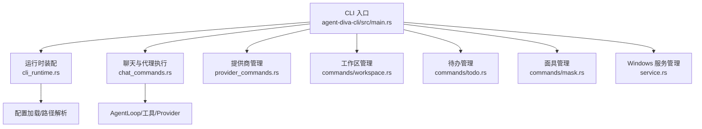
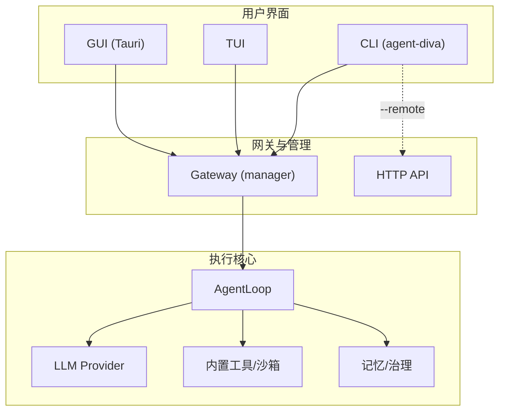
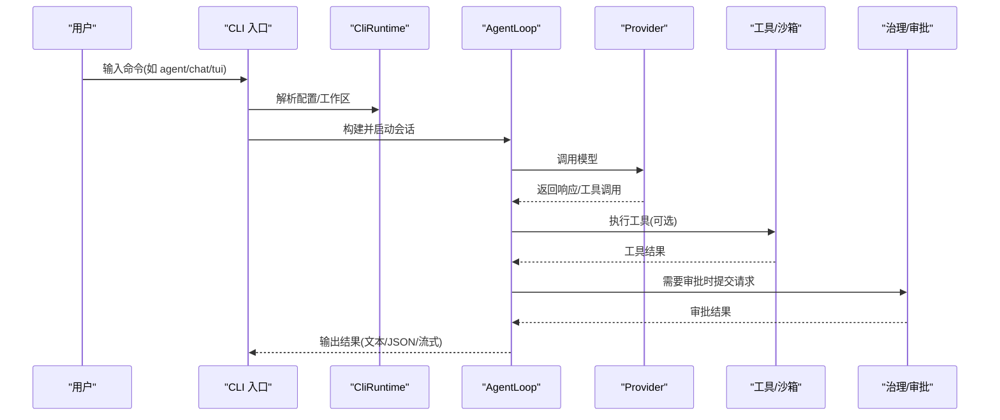
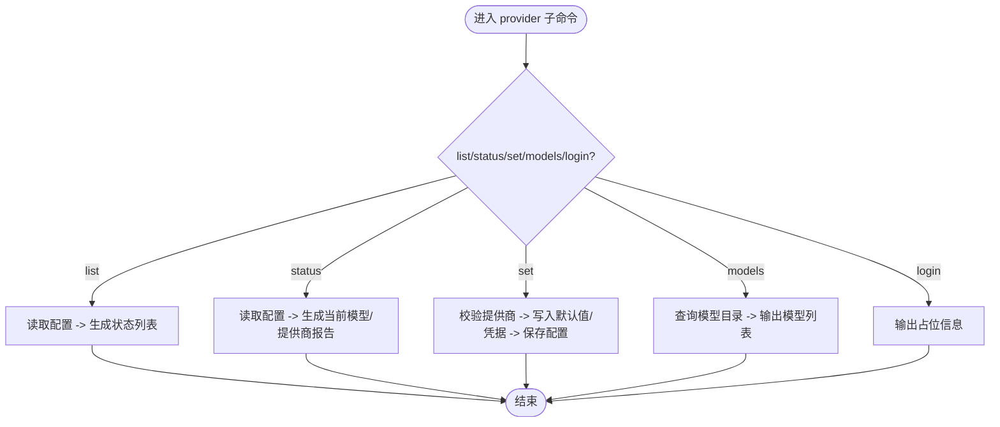
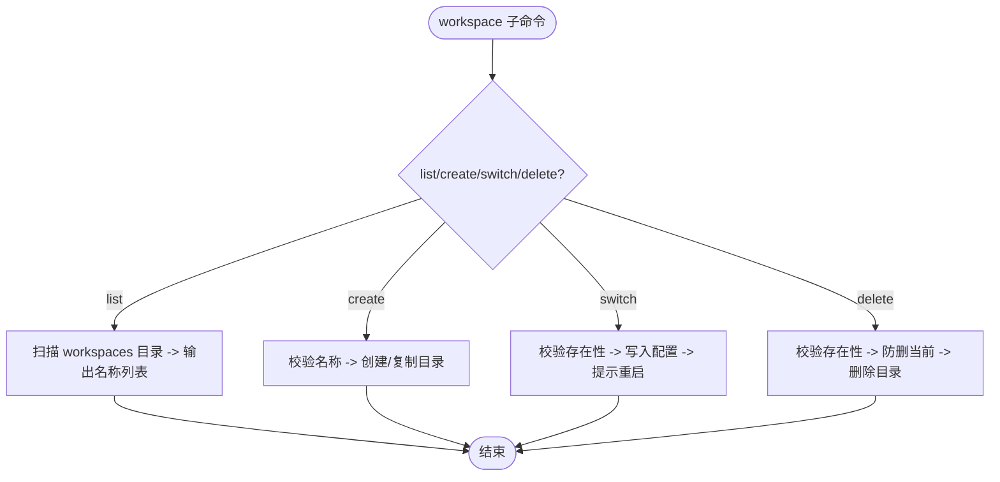
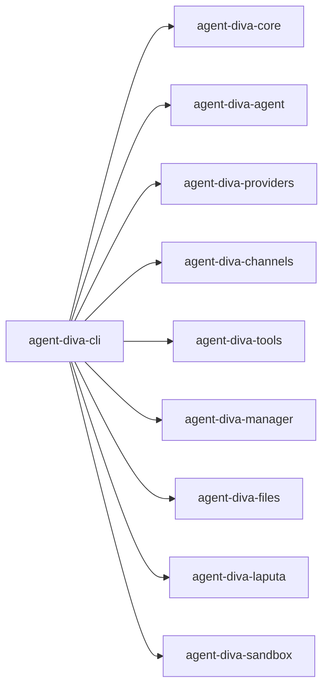

# CLI 概览与快速开始

<cite>
**本文引用的文件**
- [main.rs](file://agent-diva-cli/src/main.rs)
- [lib.rs](file://agent-diva-cli/src/lib.rs)
- [Cargo.toml](file://agent-diva-cli/Cargo.toml)
- [cli_runtime.rs](file://agent-diva-cli/src/cli_runtime.rs)
- [chat_commands.rs](file://agent-diva-cli/src/chat_commands.rs)
- [provider_commands.rs](file://agent-diva-cli/src/provider_commands.rs)
- [commands/mod.rs](file://agent-diva-cli/src/commands/mod.rs)
- [commands/workspace.rs](file://agent-diva-cli/src/commands/workspace.rs)
- [commands/todo.rs](file://agent-diva-cli/src/commands/todo.rs)
- [commands/mask.rs](file://agent-diva-cli/src/commands/mask.rs)
- [service.rs](file://agent-diva-cli/src/service.rs)
- [README.md](file://README.md)
</cite>

## 目录
1. [简介](#简介)
2. [项目结构](#项目结构)
3. [核心组件](#核心组件)
4. [架构总览](#架构总览)
5. [详细组件分析](#详细组件分析)
6. [依赖关系分析](#依赖关系分析)
7. [性能考量](#性能考量)
8. [故障排查指南](#故障排查指南)
9. [结论](#结论)
10. [附录：快速开始与常用命令](#附录快速开始与常用命令)

## 简介
本文件面向首次使用 agent-diva CLI 的用户，帮助你在最短时间内完成安装、基础配置并发起第一次对话。文档同时覆盖整体架构、主要命令分类（智能体交互、服务管理、配置管理、工作区管理等）、全局选项以及常见场景的最佳实践。

## 项目结构
CLI 入口位于 agent-diva-cli 包，通过 clap 解析命令行参数，并根据子命令路由到对应处理逻辑。核心职责包括：
- 解析全局选项与子命令
- 构建运行时环境（配置加载、工作区解析）
- 调用聊天/代理执行、提供商管理、工作区/待办/面具管理、服务等子模块
- 提供 TUI 与远程模式支持

图表来源
- [main.rs:59-205](file://agent-diva-cli/src/main.rs#L59-L205)
- [cli_runtime.rs:117-194](file://agent-diva-cli/src/cli_runtime.rs#L117-L194)
- [chat_commands.rs:79-144](file://agent-diva-cli/src/chat_commands.rs#L79-L144)
- [provider_commands.rs:25-153](file://agent-diva-cli/src/provider_commands.rs#L25-L153)
- [commands/workspace.rs:36-152](file://agent-diva-cli/src/commands/workspace.rs#L36-L152)
- [commands/todo.rs:38-99](file://agent-diva-cli/src/commands/todo.rs#L38-L99)
- [commands/mask.rs:60-193](file://agent-diva-cli/src/commands/mask.rs#L60-L193)
- [service.rs:52-121](file://agent-diva-cli/src/service.rs#L52-L121)

章节来源
- [main.rs:59-205](file://agent-diva-cli/src/main.rs#L59-L205)
- [lib.rs:1-9](file://agent-diva-cli/src/lib.rs#L1-L9)
- [Cargo.toml:1-24](file://agent-diva-cli/Cargo.toml#L1-L24)

## 核心组件
- CLI 入口与命令树：定义全局选项与所有子命令，负责分发与日志开关控制。
- 运行时装配器：统一加载配置、解析工作区、生成状态报告等。
- 聊天与代理执行：本地或远程模式运行 AgentLoop，组装工具、网络能力、计划与审批策略。
- 提供商管理：列出、设置、查询模型与登录流程。
- 工作区/待办/面具：对 workspace、todo、mask 的增删改查与切换。
- Windows 服务：在 Windows 上安装/启停/卸载 Gateway 服务。

章节来源
- [main.rs:59-205](file://agent-diva-cli/src/main.rs#L59-L205)
- [cli_runtime.rs:117-194](file://agent-diva-cli/src/cli_runtime.rs#L117-L194)
- [chat_commands.rs:79-144](file://agent-diva-cli/src/chat_commands.rs#L79-L144)
- [provider_commands.rs:25-153](file://agent-diva-cli/src/provider_commands.rs#L25-L153)
- [commands/workspace.rs:36-152](file://agent-diva-cli/src/commands/workspace.rs#L36-L152)
- [commands/todo.rs:38-99](file://agent-diva-cli/src/commands/todo.rs#L38-L99)
- [commands/mask.rs:60-193](file://agent-diva-cli/src/commands/mask.rs#L60-L193)
- [service.rs:52-121](file://agent-diva-cli/src/service.rs#L52-L121)

## 架构总览
CLI 作为用户入口，将请求路由到不同子系统；AgentLoop 是实际执行单元，连接 LLM Provider、工具与记忆/治理层；Gateway 提供持久化会话与通道桥接；TUI/GUI 提供可视化交互；Manager 提供 HTTP 控制面与远程模式。

图表来源
- [main.rs:441-773](file://agent-diva-cli/src/main.rs#L441-L773)
- [chat_commands.rs:79-144](file://agent-diva-cli/src/chat_commands.rs#L79-L144)
- [README.md:43-85](file://README.md#L43-L85)

## 详细组件分析

### 命令分类与职责
- 智能体交互
  - agent：单次消息执行，支持流式日志、Markdown 渲染、无头审批模式与 JSON 输出。
  - chat：轻量交互式对话，支持本地与远程模式。
  - tui：终端图形界面对话，支持本地与远程模式。
- 服务管理
  - gateway run：启动本地 Gateway。
  - service：Windows 服务安装/启停/卸载/状态查看。
- 配置管理
  - provider：列出、设置、查询模型与登录。
  - config：路径、初始化、刷新、校验、医生诊断、显示有效配置。
- 工作区管理
  - workspace：列出、创建、切换、删除受管工作区。
  - todo：列表、新增、更新状态、归档与清理。
  - mask：列出、切换、展示、创建、编辑、删除面具。

章节来源
- [main.rs:88-205](file://agent-diva-cli/src/main.rs#L88-L205)
- [provider_commands.rs:25-153](file://agent-diva-cli/src/provider_commands.rs#L25-L153)
- [commands/workspace.rs:36-152](file://agent-diva-cli/src/commands/workspace.rs#L36-L152)
- [commands/todo.rs:38-99](file://agent-diva-cli/src/commands/todo.rs#L38-L99)
- [commands/mask.rs:60-193](file://agent-diva-cli/src/commands/mask.rs#L60-L193)
- [service.rs:52-121](file://agent-diva-cli/src/service.rs#L52-L121)

### 全局选项
- --config：指定配置文件路径。
- --config-dir：指定配置目录。
- --workspace / -w：临时覆盖本次命令的工作区。
- --remote：以远程模式连接到 Manager 的 HTTP API。
- --api-url：远程 API 地址（默认 http://localhost:3000/api）。

这些选项由 CLI 入口解析后传递给 CliRuntime 与各子命令处理器，影响配置加载、工作区解析与通信目标。

章节来源
- [main.rs:67-86](file://agent-diva-cli/src/main.rs#L67-L86)
- [cli_runtime.rs:117-194](file://agent-diva-cli/src/cli_runtime.rs#L117-L194)

### 智能体交互流程（agent/chat/tui）
- 本地模式：CLI 构建 AgentLoop，装配 Provider、工具、计划、审批策略与 AskUser 协调器，执行单轮或多轮对话。
- 远程模式：CLI 通过 ApiClient 与 Manager 的 HTTP API 交互，实现消息发送、审批管理与结果回传。

图表来源
- [chat_commands.rs:79-144](file://agent-diva-cli/src/chat_commands.rs#L79-L144)
- [main.rs:489-553](file://agent-diva-cli/src/main.rs#L489-L553)

### 提供商管理（provider）
- list：列出可用提供商及其就绪状态、当前激活项。
- status：查看当前模型与提供商详情。
- set：设置默认提供商/模型与凭据（API Key/Base URL）。
- models：获取提供商可用模型清单。
- login：占位实现，提示未实现 OAuth/设备流。

图表来源
- [provider_commands.rs:25-153](file://agent-diva-cli/src/provider_commands.rs#L25-L153)
- [provider_commands.rs:177-200](file://agent-diva-cli/src/provider_commands.rs#L177-L200)

章节来源
- [provider_commands.rs:25-153](file://agent-diva-cli/src/provider_commands.rs#L25-L153)
- [provider_commands.rs:177-200](file://agent-diva-cli/src/provider_commands.rs#L177-L200)

### 工作区管理（workspace）
- list：列出受管工作区（config-dir/workspaces）。
- create：创建新工作区，可选择从源目录复制内容。
- switch：将配置中的工作区切换到指定名称。
- delete：删除工作区，防止删除当前活动工作区。

图表来源
- [commands/workspace.rs:36-152](file://agent-diva-cli/src/commands/workspace.rs#L36-L152)

章节来源
- [commands/workspace.rs:36-152](file://agent-diva-cli/src/commands/workspace.rs#L36-L152)

### 待办管理（todo）
- list：列出所有待办项。
- add：新增待办。
- update：更新状态（open/pending/active/done/completed/cancelled）。
- archive：归档超过指定天数的已完成项。
- purge：清理超过指定月数的归档文件。

章节来源
- [commands/todo.rs:38-99](file://agent-diva-cli/src/commands/todo.rs#L38-L99)

### 面具管理（mask）
- list：列出所有面具及当前激活项。
- switch：按名称或稳定 ID 切换面具。
- show：展示面具 frontmatter 与正文。
- create/edit：从 Markdown 文件创建或替换面具。
- delete：删除面具。

章节来源
- [commands/mask.rs:60-193](file://agent-diva-cli/src/commands/mask.rs#L60-L193)

### 服务管理（service）
- install/start/stop/restart/uninstall/status：在 Windows 平台管理 Gateway 服务。非 Windows 平台会返回不支持错误。

章节来源
- [service.rs:52-121](file://agent-diva-cli/src/service.rs#L52-L121)

## 依赖关系分析
CLI 依赖 core、agent、providers、channels、tools、manager、files、laputa、sandbox 等模块，形成“入口-运行时-业务”的分层结构。

图表来源
- [Cargo.toml:15-24](file://agent-diva-cli/Cargo.toml#L15-L24)

章节来源
- [Cargo.toml:15-24](file://agent-diva-cli/Cargo.toml#L15-L24)

## 性能考量
- 异步运行时：CLI 使用 Tokio 多线程运行时，适合并发 I/O（网络、文件、数据库）。
- 流式输出：agent/chat/tui 支持流式日志与响应，降低首屏延迟。
- 工具超时与预算：通过工具配置限制执行时间与预算，避免长时间阻塞。
- 远程模式：通过 Manager 集中调度，减少本地资源占用，便于横向扩展。

[本节为通用指导，不直接分析具体文件]

## 故障排查指南
- 配置问题：使用 config validate 与 config doctor 检查配置与运行时健康度。
- 提供商未就绪：使用 provider status 查看缺失字段与当前模型。
- 工作区异常：使用 workspace list/switch 确认当前工作区；必要时重新创建。
- 审批队列：使用 approvals 子命令查看与处理挂起审批。
- 日志与调试：根据命令类型决定是否启用终端日志；结合 config path 定位实例路径。

章节来源
- [main.rs:441-473](file://agent-diva-cli/src/main.rs#L441-L473)
- [cli_runtime.rs:117-194](file://agent-diva-cli/src/cli_runtime.rs#L117-L194)
- [provider_commands.rs:25-153](file://agent-diva-cli/src/provider_commands.rs#L25-L153)

## 结论
agent-diva CLI 提供了统一的入口来驱动智能体交互、服务管理、配置与工作区操作。通过合理的全局选项与子命令组合，你可以在本地或远程模式下高效地完成日常任务。建议从 onboard 开始，逐步掌握 provider、workspace、todo、mask 等管理能力，并结合 approvals 与 cron 实现自动化与协作。

[本节为总结，不直接分析具体文件]

## 附录：快速开始与常用命令

- 安装验证
  - 从源码构建并安装 CLI：参考 README 中的构建与安装步骤。
  - 验证版本：运行 agent-diva --version。

- 基础配置
  - 初始化配置与工作区模板：agent-diva onboard
  - 刷新配置与模板：agent-diva config refresh
  - 查看实例路径：agent-diva config path
  - 校验与诊断：agent-diva config validate / agent-diva config doctor

- 第一个对话示例
  - 轻量聊天：agent-diva chat
  - 终端图形界面：agent-diva tui
  - 单次消息：agent-diva agent --message "你好，请帮我整理一份本周待办"

- 常用场景
  - 启动网关：agent-diva gateway run
  - 查看状态：agent-diva status
  - 提供商管理：agent-diva provider list / status / set / models
  - 工作区管理：agent-diva workspace list / create / switch / delete
  - 待办管理：agent-diva todo list / add / update / archive / purge
  - 面具管理：agent-diva mask list / switch / show / create / edit / delete
  - 审批中心：agent-diva approvals list / decide / cancel / review
  - 定时任务：agent-diva cron add / list / run

- 全局选项最佳实践
  - 多实例：使用 --config 或 --config-dir 隔离不同实例。
  - 临时工作区：使用 -w/--workspace 在不修改配置的情况下测试不同工作区。
  - 远程模式：--remote + --api-url 指向 Manager，便于集中管理与自动化。

章节来源
- [README.md:116-242](file://README.md#L116-L242)
- [main.rs:67-86](file://agent-diva-cli/src/main.rs#L67-L86)
- [main.rs:489-553](file://agent-diva-cli/src/main.rs#L489-L553)
- [provider_commands.rs:25-153](file://agent-diva-cli/src/provider_commands.rs#L25-L153)
- [commands/workspace.rs:36-152](file://agent-diva-cli/src/commands/workspace.rs#L36-L152)
- [commands/todo.rs:38-99](file://agent-diva-cli/src/commands/todo.rs#L38-L99)
- [commands/mask.rs:60-193](file://agent-diva-cli/src/commands/mask.rs#L60-L193)