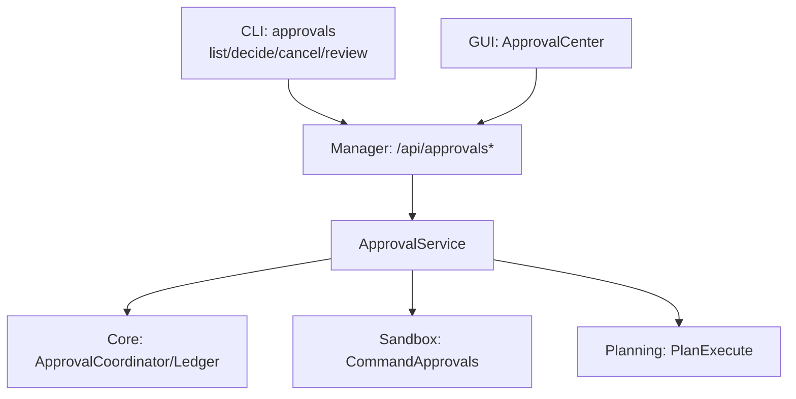
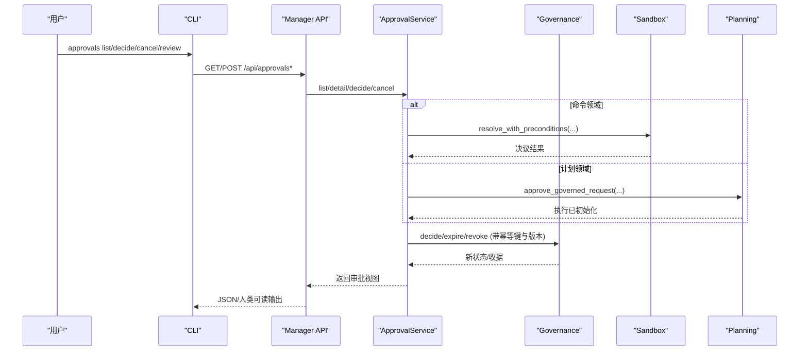
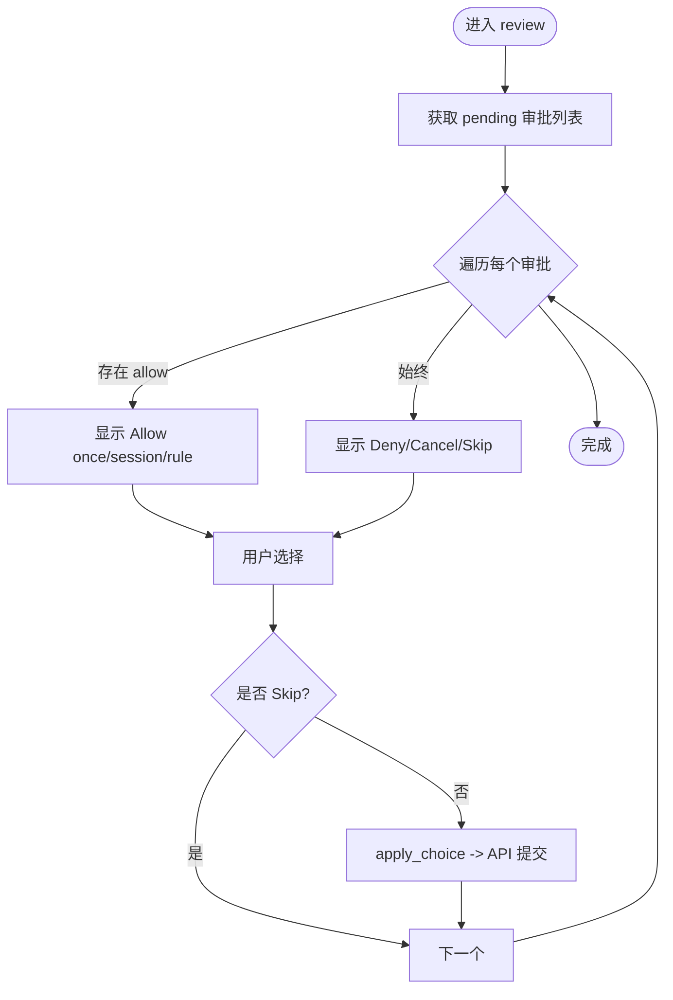
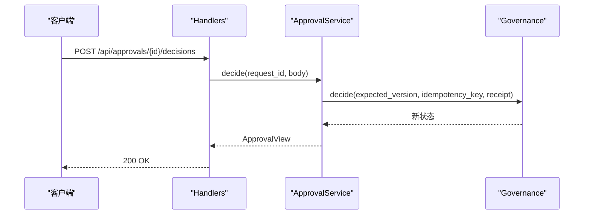
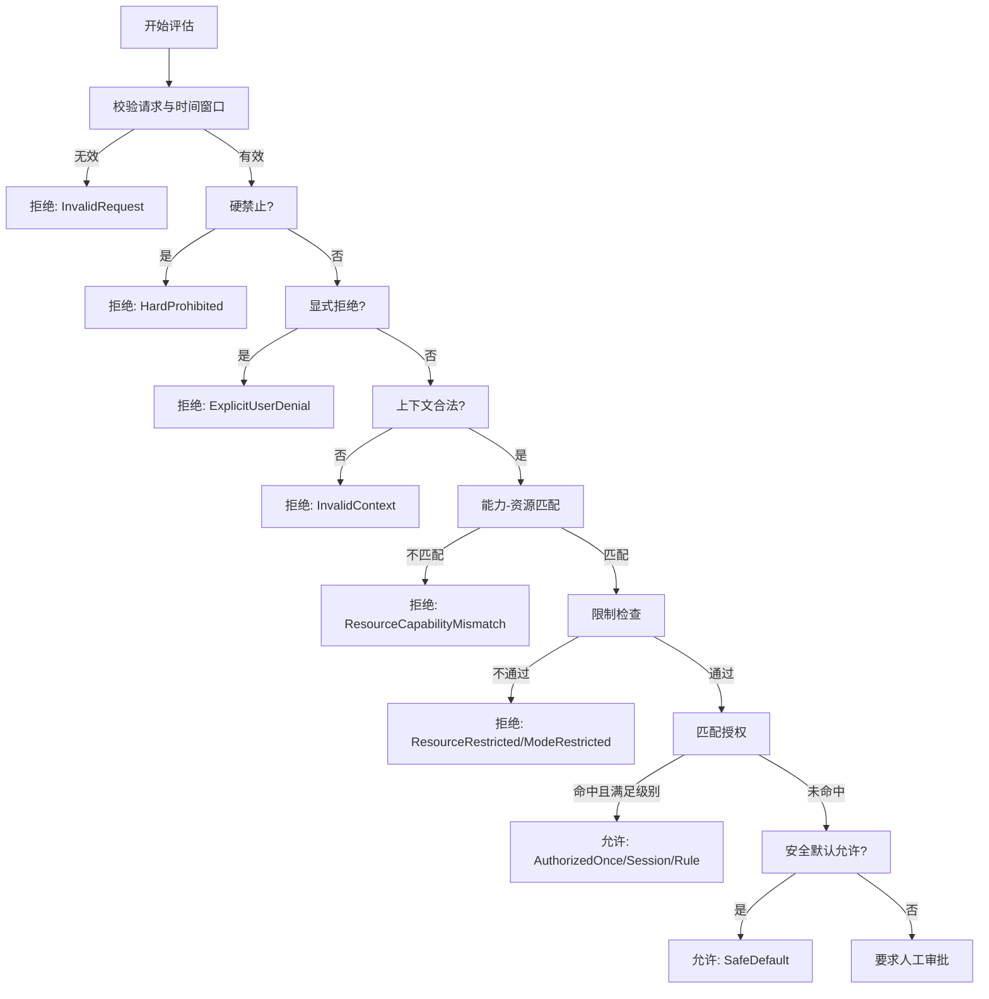
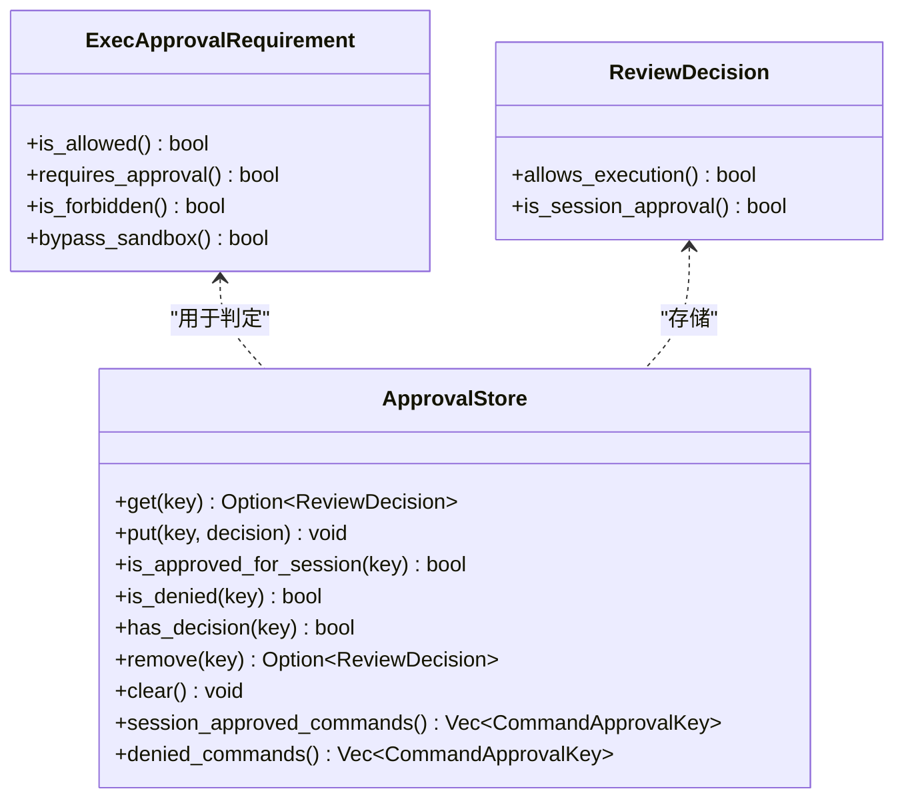
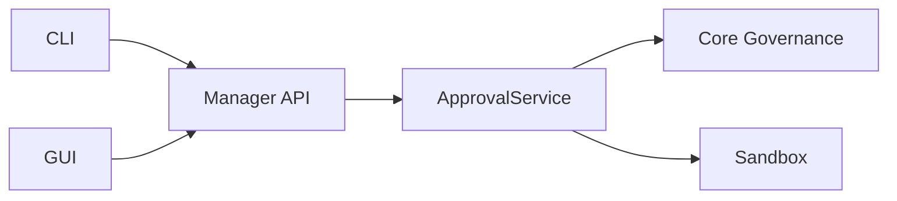
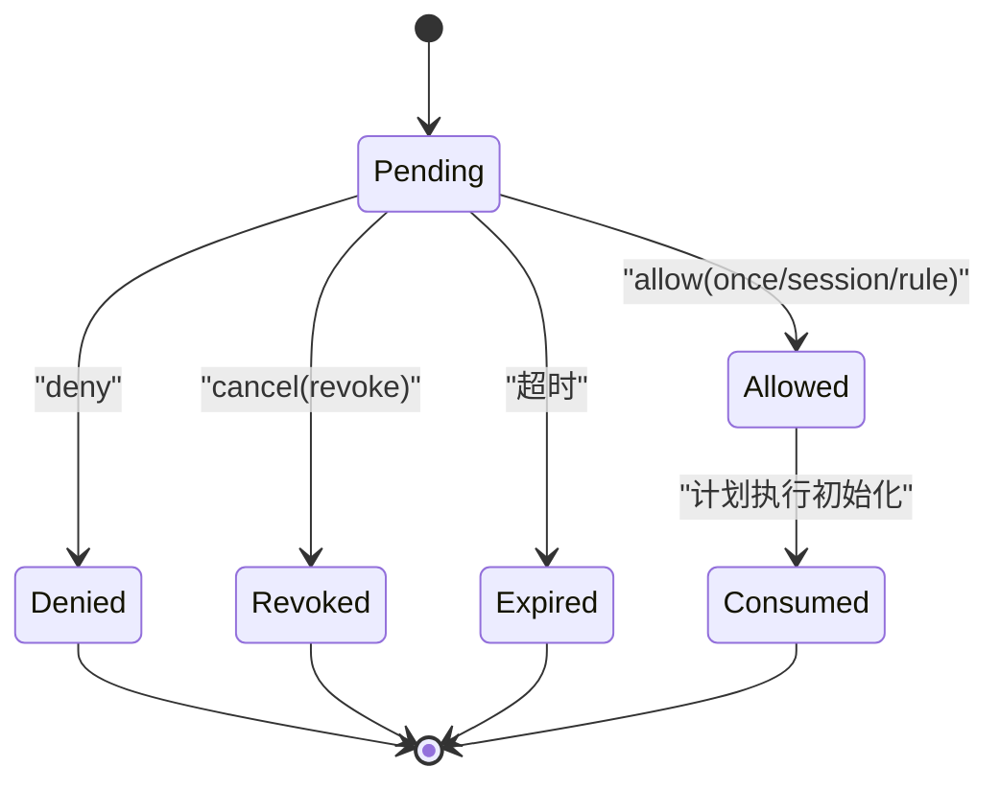

# 审批工作流

<cite>
**本文引用的文件**
- [agent-diva-cli/src/approval_commands.rs](file://agent-diva-cli/src/approval_commands.rs)
- [agent-diva-manager/src/handlers/approvals.rs](file://agent-diva-manager/src/handlers/approvals.rs)
- [agent-diva-manager/src/approval_service.rs](file://agent-diva-manager/src/approval_service.rs)
- [agent-diva-core/src/governance/policy.rs](file://agent-diva-core/src/governance/policy.rs)
- [agent-diva-core/src/planning/approval.rs](file://agent-diva-core/src/planning/approval.rs)
- [agent-diva-sandbox/src/approval.rs](file://agent-diva-sandbox/src/approval.rs)
- [agent-diva-gui/src/components/ApprovalCenterDrawer.vue](file://agent-diva-gui/src/components/ApprovalCenterDrawer.vue)
- [agent-diva-gui/src/components/ApprovalCenterCard.vue](file://agent-diva-gui/src/components/ApprovalCenterCard.vue)
</cite>

## 目录
1. [简介](#简介)
2. [项目结构](#项目结构)
3. [核心组件](#核心组件)
4. [架构总览](#架构总览)
5. [详细组件分析](#详细组件分析)
6. [依赖关系分析](#依赖关系分析)
7. [性能考虑](#性能考虑)
8. [故障排查指南](#故障排查指南)
9. [结论](#结论)
10. [附录](#附录)

## 简介
本文件面向“审批工作流”的完整说明，覆盖 CLI 命令 approvals（list、decide、cancel、review）与后端统一审批服务、策略评估、状态机与审计追踪。文档将解释：
- 审批流程的阶段与状态转换
- 不同审批模式（一次性、会话级、规则级）的配置与使用场景
- 人工审批与自动审批的配置方法
- 审批策略定义与权限控制
- 审计与追踪能力
- 常见审批场景的处理示例

## 项目结构
审批功能横跨多个模块：
- CLI 层：提供 approvals 子命令，负责列出、决策、取消与批量审查交互
- Manager 层：统一 HTTP API 与服务编排，封装领域（命令、计划）审批
- Core 治理层：策略评估、状态机、事件与收据模型
- Sandbox 层：命令执行前的审批缓存与需求判定
- GUI 层：审批中心界面，支持列表、详情、决策与取消

图表来源
- [agent-diva-cli/src/approval_commands.rs:1-312](file://agent-diva-cli/src/approval_commands.rs#L1-L312)
- [agent-diva-manager/src/handlers/approvals.rs:45-58](file://agent-diva-manager/src/handlers/approvals.rs#L45-L58)
- [agent-diva-manager/src/approval_service.rs:142-158](file://agent-diva-manager/src/approval_service.rs#L142-L158)

章节来源
- [agent-diva-cli/src/approval_commands.rs:1-312](file://agent-diva-cli/src/approval_commands.rs#L1-L312)
- [agent-diva-manager/src/handlers/approvals.rs:45-58](file://agent-diva-manager/src/handlers/approvals.rs#L45-L58)
- [agent-diva-manager/src/approval_service.rs:142-158](file://agent-diva-manager/src/approval_service.rs#L142-L158)

## 核心组件
- 统一审批视图与查询
  - 审批视图包含请求ID、版本、领域（命令/计划）、能力、资源范围、风险等级、状态、时间戳、证据、收据、动作提示等
  - 列表查询支持按领域、状态、会话过滤与游标分页
- 统一决策与取消
  - 决策体包含期望版本、幂等键、决策（允许/拒绝）与授权粒度（一次性/会话/规则）
  - 取消体包含期望版本与幂等键
- 领域适配
  - 命令审批：通过沙箱协调器进行决议，支持一次性、会话级、规则级
  - 计划审批：仅允许一次性授权，批准后触发计划执行初始化
- 策略评估
  - 基于自主级别、限制、已有授权与安全默认值进行无副作用评估
  - 输出稳定原因码与约束，便于审计与展示
- 事件与审计
  - 通过 SSE 推送审批事件，支持重连与游标
  - 结构化审计事件写入日志，供 GUI/CLI 消费

章节来源
- [agent-diva-manager/src/approval_service.rs:45-121](file://agent-diva-manager/src/approval_service.rs#L45-L121)
- [agent-diva-manager/src/handlers/approvals.rs:60-134](file://agent-diva-manager/src/handlers/approvals.rs#L60-L134)
- [agent-diva-core/src/governance/policy.rs:98-205](file://agent-diva-core/src/governance/policy.rs#L98-L205)
- [agent-diva-core/src/audit.rs:224-253](file://agent-diva-core/src/audit.rs#L224-L253)

## 架构总览
审批系统采用“统一契约 + 领域适配”的设计：
- CLI/GUI 调用统一的 /api/approvals 接口
- Manager 层根据领域路由到命令或计划处理路径
- Core 治理层维护状态机、事件与收据，保证幂等与一致性
- Sandbox 层缓存命令审批结果并驱动执行
- GUI 通过 SSE 订阅事件，实现实时审批中心

图表来源
- [agent-diva-manager/src/handlers/approvals.rs:94-134](file://agent-diva-manager/src/handlers/approvals.rs#L94-L134)
- [agent-diva-manager/src/approval_service.rs:239-304](file://agent-diva-manager/src/approval_service.rs#L239-L304)
- [agent-diva-sandbox/src/approval.rs:155-248](file://agent-diva-sandbox/src/approval.rs#L155-L248)

## 详细组件分析

### CLI 审批命令
- list：列出待处理或指定状态的审批，支持 JSON 输出与人类可读格式
- decide：对指定请求做出决策，携带版本与幂等键，防止并发冲突
- cancel：取消审批请求，同样需要版本与幂等键
- review：交互式批量审查，动态显示可用动作（允许一次/会话/规则、拒绝、取消、跳过）

图表来源
- [agent-diva-cli/src/approval_commands.rs:152-201](file://agent-diva-cli/src/approval_commands.rs#L152-L201)
- [agent-diva-cli/src/approval_commands.rs:79-131](file://agent-diva-cli/src/approval_commands.rs#L79-L131)

章节来源
- [agent-diva-cli/src/approval_commands.rs:1-312](file://agent-diva-cli/src/approval_commands.rs#L1-L312)

### Manager 审批 API
- GET /api/approvals：列表查询，支持 domain/status/session/limit/cursor
- GET /api/approvals/:request_id：详情
- POST /api/approvals/:request_id/decisions：决策
- POST /api/approvals/:request_id/cancel：取消
- GET /api/approvals/events：SSE 事件流，支持 cursor 与 limit

错误映射：
- 未找到、版本冲突、幂等冲突、过期、已解决、已消费、无效转移、无效授权、负载不可用、队列不可用、持久化失败、无效游标/查询/主体等

图表来源
- [agent-diva-manager/src/handlers/approvals.rs:94-134](file://agent-diva-manager/src/handlers/approvals.rs#L94-L134)
- [agent-diva-manager/src/approval_service.rs:239-304](file://agent-diva-manager/src/approval_service.rs#L239-L304)

章节来源
- [agent-diva-manager/src/handlers/approvals.rs:45-293](file://agent-diva-manager/src/handlers/approvals.rs#L45-L293)
- [agent-diva-manager/src/approval_service.rs:142-304](file://agent-diva-manager/src/approval_service.rs#L142-L304)

### 策略评估与权限控制
策略评估是无副作用的纯函数，依据以下顺序：
- 请求有效性校验与时间窗口
- 硬禁止（高风险/最高自主级别）
- 显式用户拒绝
- 上下文合法性（自主级别未知/决策未知）
- 能力与资源匹配矩阵
- 限制检查（资源/模式）
- 匹配授权（一次性/会话/规则），并验证授权粒度与自主级别
- 安全默认允许（低风险的 inspect/plan_mutate）
- 否则要求人工审批

图表来源
- [agent-diva-core/src/governance/policy.rs:98-205](file://agent-diva-core/src/governance/policy.rs#L98-L205)
- [agent-diva-core/src/governance/policy.rs:207-346](file://agent-diva-core/src/governance/policy.rs#L207-L346)

章节来源
- [agent-diva-core/src/governance/policy.rs:1-678](file://agent-diva-core/src/governance/policy.rs#L1-L678)

### 命令审批与缓存
- 执行前判定是否需要审批、可跳过或禁止
- 审批缓存存储命令+工作目录为键的决策（一次性/会话/拒绝）
- 支持查询会话内已批准、被拒绝的命令集合

图表来源
- [agent-diva-sandbox/src/approval.rs:63-153](file://agent-diva-sandbox/src/approval.rs#L63-L153)
- [agent-diva-sandbox/src/approval.rs:155-248](file://agent-diva-sandbox/src/approval.rs#L155-L248)

章节来源
- [agent-diva-sandbox/src/approval.rs:1-347](file://agent-diva-sandbox/src/approval.rs#L1-L347)

### 计划审批与 TODO 策略
- 计划提交需附带范围、验证方法与开放问题处理方式
- 用户发起的批准请求包含期望修订、审计批准者、TODO 策略与是否物化 TODO
- 成功批准后生成不可变收据，记录计划ID、修订、批准者与时间、策略与物化标记

章节来源
- [agent-diva-core/src/planning/approval.rs:1-84](file://agent-diva-core/src/planning/approval.rs#L1-L84)

### GUI 审批中心
- 抽屉组件承载审批列表、筛选（领域/状态/会话）、刷新与操作
- 卡片组件展示审批元数据、授权粒度选择与操作按钮
- 事件驱动更新，支持提交中、结果未知与错误提示

章节来源
- [agent-diva-gui/src/components/ApprovalCenterDrawer.vue:1-41](file://agent-diva-gui/src/components/ApprovalCenterDrawer.vue#L1-L41)
- [agent-diva-gui/src/components/ApprovalCenterCard.vue:427-459](file://agent-diva-gui/src/components/ApprovalCenterCard.vue#L427-L459)

## 依赖关系分析
- CLI 依赖 Manager API 进行审批操作
- Manager 依赖 Core 治理服务与 Sandbox 命令协调器
- GUI 通过 Manager API 与 SSE 事件流与后端交互
- 策略评估在 Core 中独立运行，确保一致性与可测试性

图表来源
- [agent-diva-manager/src/approval_service.rs:142-158](file://agent-diva-manager/src/approval_service.rs#L142-L158)
- [agent-diva-manager/src/handlers/approvals.rs:45-58](file://agent-diva-manager/src/handlers/approvals.rs#L45-L58)

章节来源
- [agent-diva-manager/src/approval_service.rs:1-552](file://agent-diva-manager/src/approval_service.rs#L1-L552)
- [agent-diva-manager/src/handlers/approvals.rs:1-725](file://agent-diva-manager/src/handlers/approvals.rs#L1-L725)

## 性能考虑
- 列表与事件流使用游标分页与限制，避免全量拉取
- SSE 事件流内部缓冲与轮询间隔，降低后端压力
- 策略评估为纯函数，无 I/O，适合高频调用
- 命令审批缓存减少重复交互，提升用户体验
- 幂等键与版本号保障并发安全，避免重复决策

[本节为通用指导，无需特定文件引用]

## 故障排查指南
常见问题与定位要点：
- 版本冲突：决策时 expected_version 不匹配，需重新获取最新状态
- 幂等冲突：同一幂等键重复提交导致冲突，检查客户端重试逻辑
- 过期：请求超过 expires_at，需重新发起审批
- 已解决/已消费：重复决策或消费，确认当前状态
- 无效授权：授权粒度与领域不匹配（如计划不允许会话/规则授权）
- 队列不可用：治理服务不可用，检查运行时健康状态
- 无效游标/查询：SSE 或列表参数非法，修正后重试

章节来源
- [agent-diva-manager/src/handlers/approvals.rs:206-293](file://agent-diva-manager/src/handlers/approvals.rs#L206-L293)
- [agent-diva-manager/src/approval_service.rs:113-134](file://agent-diva-manager/src/approval_service.rs#L113-L134)

## 结论
本审批工作流通过统一契约与领域适配，实现了命令与计划的跨域审批管理。CLI 与 GUI 提供一致的交互体验，Manager 层负责编排与错误映射，Core 治理层保证策略一致性与可审计性，Sandbox 层优化命令执行效率。结合 SSE 事件流与结构化审计，系统具备高可靠性与可观测性。

[本节为总结，无需特定文件引用]

## 附录

### 审批状态与转换
- Pending：等待决策
- Allowed：已允许（一次性/会话/规则）
- Denied：已拒绝
- Revoked：撤销
- Expired：过期
- Consumed：已消费（计划批准后执行初始化）

图表来源
- [agent-diva-manager/src/approval_service.rs:519-527](file://agent-diva-manager/src/approval_service.rs#L519-L527)

### 常见审批场景示例
- 命令执行高风险：策略评估要求人工审批；CLI 交互式选择 allow-once/allow-session/deny/cancel
- 计划提交：仅允许 once 授权；批准后触发执行初始化
- 批量审查：review_pending 循环处理 pending 列表，动态显示可用动作并提交决策
- 幂等重试：使用 idempotency_key 与 expected_version 确保重复提交安全

章节来源
- [agent-diva-cli/src/approval_commands.rs:152-201](file://agent-diva-cli/src/approval_commands.rs#L152-L201)
- [agent-diva-manager/src/approval_service.rs:239-304](file://agent-diva-manager/src/approval_service.rs#L239-L304)