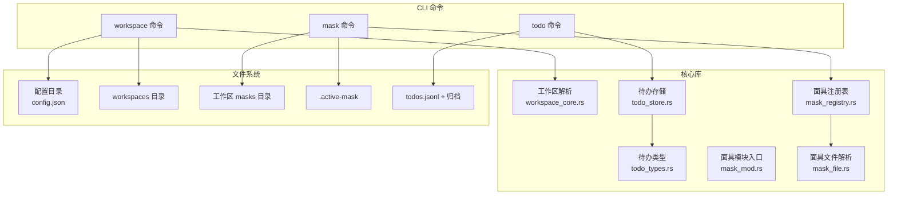
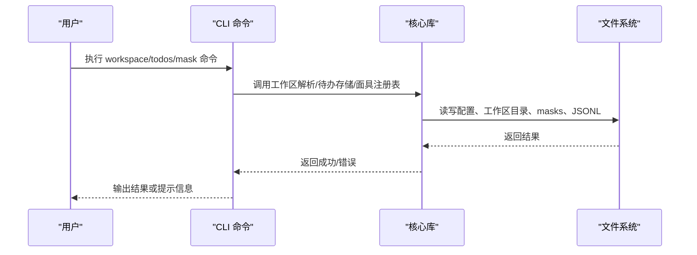
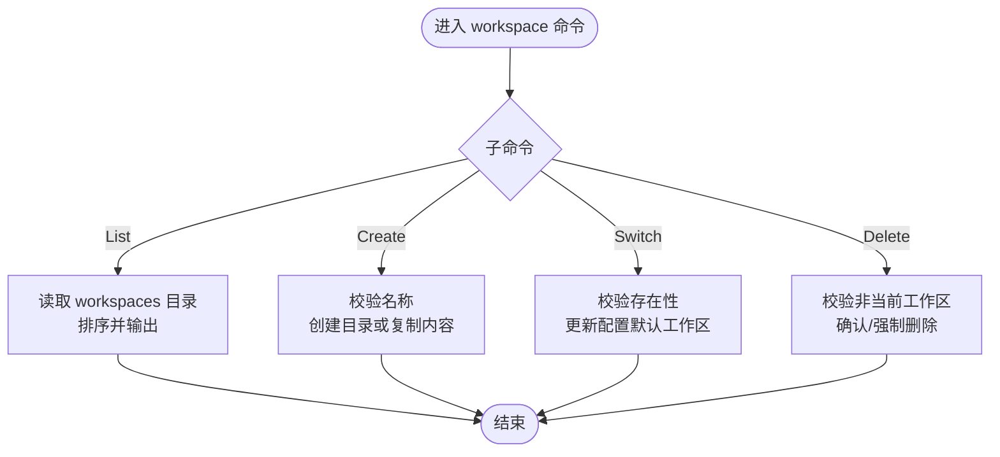
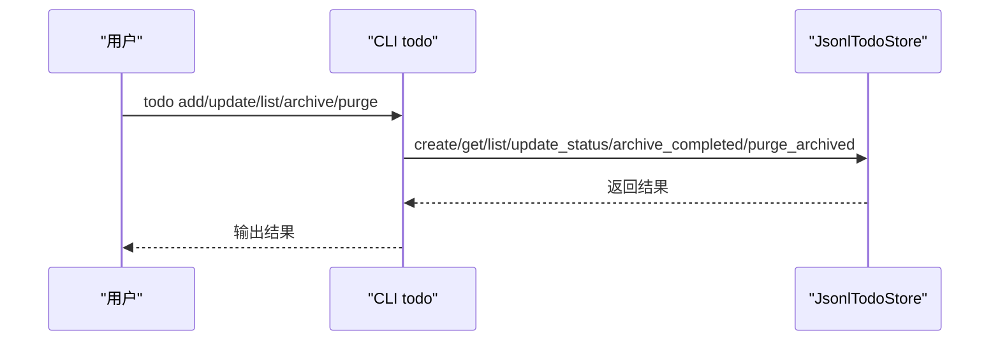
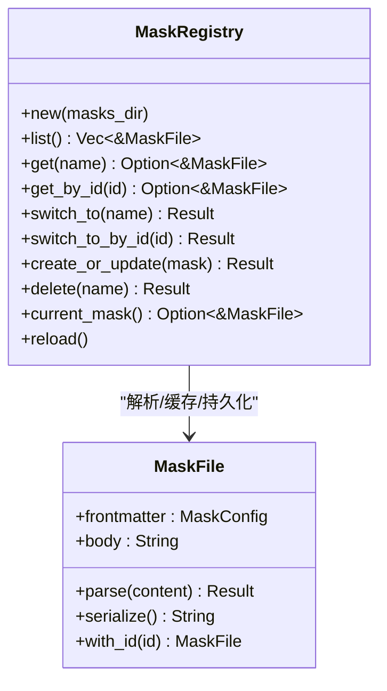
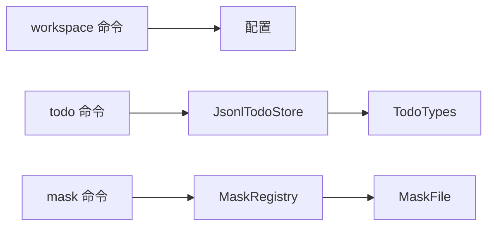

# 工作区与任务管理

<cite>
**本文引用的文件**
- [workspace.rs](file://agent-diva-cli/src/commands/workspace.rs)
- [todo.rs](file://agent-diva-cli/src/commands/todo.rs)
- [mask.rs](file://agent-diva-cli/src/commands/mask.rs)
- [workspace_core.rs](file://agent-diva-core/src/workspace.rs)
- [todo_types.rs](file://agent-diva-core/src/todo/types.rs)
- [todo_store.rs](file://agent-diva-core/src/todo/store.rs)
- [mask_mod.rs](file://agent-diva-agent/src/mask/mod.rs)
- [mask_registry.rs](file://agent-diva-agent/src/mask/mask_registry.rs)
- [mask_file.rs](file://agent-diva-agent/src/mask/mask_file.rs)
- [assistant.md](file://workspace/masks/assistant.md)
- [coder.md](file://workspace/masks/coder.md)
- [researcher.md](file://workspace/masks/researcher.md)
- [reviewer.md](file://workspace/masks/reviewer.md)
</cite>

## 目录
1. [简介](#简介)
2. [项目结构](#项目结构)
3. [核心组件](#核心组件)
4. [架构总览](#架构总览)
5. [详细组件分析](#详细组件分析)
6. [依赖关系分析](#依赖关系分析)
7. [性能考虑](#性能考虑)
8. [故障排查指南](#故障排查指南)
9. [结论](#结论)
10. [附录：使用示例与工作流集成](#附录使用示例与工作流集成)

## 简介
本文件面向“工作区、待办事项、面具”三类命令的使用与实现说明，覆盖以下目标：
- 工作区管理：创建、切换、查看工作区信息；工作区路径解析与配置文件联动。
- 待办事项管理：添加、完成、删除（归档/清理）、查询；状态机与持久化。
- 面具系统：创建、编辑、选择和使用不同角色面具；配置项与工具策略。
- 工作区结构与文件组织：masks 目录、active mask 标记、工作区根与配置目录的关系。
- 优先级与状态跟踪：通过状态枚举与过滤能力进行任务追踪。
- 实际使用示例与工作流集成：命令行到 GUI/服务端的衔接建议。

## 项目结构
围绕三个命令的实现位置与依赖如下：
- CLI 命令层：
  - workspace 命令：负责在配置目录下的 workspaces 子目录中管理工作区集合，并修改默认工作区配置。
  - todo 命令：基于 JSONL 追加存储的待办事项清单，提供增删改查与归档清理。
  - mask 命令：基于工作区 masks 目录的面具注册表，支持列出、切换、展示、创建、编辑、删除。
- 核心库：
  - 工作区解析：统一解析工作区根路径、来源标记与迁移提示。
  - 待办事项类型与存储：状态枚举、过滤器、JSONL 追加存储、并发锁、归档与清理。
  - 面具系统：面具文件解析、注册表扫描与缓存、当前激活面具持久化。
- 示例面具文件：
  - assistant.md、coder.md、researcher.md、reviewer.md 展示了 frontmatter 与 body 的组织方式。

图表来源
- [workspace.rs:36-152](file://agent-diva-cli/src/commands/workspace.rs#L36-L152)
- [todo.rs:38-99](file://agent-diva-cli/src/commands/todo.rs#L38-L99)
- [mask.rs:60-73](file://agent-diva-cli/src/commands/mask.rs#L60-L73)
- [workspace_core.rs:77-114](file://agent-diva-core/src/workspace.rs#L77-L114)
- [todo_store.rs:16-31](file://agent-diva-core/src/todo/store.rs#L16-L31)
- [mask_registry.rs:25-49](file://agent-diva-agent/src/mask/mask_registry.rs#L25-L49)
- [mask_file.rs:10-18](file://agent-diva-agent/src/mask/mask_file.rs#L10-L18)

章节来源
- [workspace.rs:36-152](file://agent-diva-cli/src/commands/workspace.rs#L36-L152)
- [todo.rs:38-99](file://agent-diva-cli/src/commands/todo.rs#L38-L99)
- [mask.rs:60-73](file://agent-diva-cli/src/commands/mask.rs#L60-L73)
- [workspace_core.rs:77-114](file://agent-diva-core/src/workspace.rs#L77-L114)
- [todo_store.rs:16-31](file://agent-diva-core/src/todo/store.rs#L16-L31)
- [mask_registry.rs:25-49](file://agent-diva-agent/src/mask/mask_registry.rs#L25-L49)
- [mask_file.rs:10-18](file://agent-diva-agent/src/mask/mask_file.rs#L10-L18)

## 核心组件
- 工作区命令：
  - 列表：读取配置目录下的 workspaces 子目录，输出所有已管理工作区名称。
  - 创建：在 workspaces 下创建新目录，可选从源路径复制内容。
  - 切换：将配置中的默认工作区指向目标工作区，提示重启生效。
  - 删除：校验非当前活动工作区，交互式确认或强制删除。
- 待办命令：
  - 列表：读取 todos.jsonl 并格式化输出 ID、状态、标题。
  - 新增：生成唯一 ID、时间戳，写入 JSONL。
  - 更新：按 ID 更新状态，支持 open/pending/active/done/completed/cancelled 等别名。
  - 归档：将已完成且超过指定天数的条目移动到按月归档文件。
  - 清理：删除超过指定月数的归档文件。
- 面具命令：
  - 列表：扫描 masks 目录，显示名称、图标、描述，标注当前激活。
  - 切换：通过 name 或 id 切换到指定面具，持久化 .active-mask。
  - 展示：输出面具 frontmatter 与 body。
  - 创建/编辑：从 Markdown 文件解析面具，确保稳定 id 并写入。
  - 删除：按 name 或 id 删除，避免删除默认面具。

章节来源
- [workspace.rs:36-152](file://agent-diva-cli/src/commands/workspace.rs#L36-L152)
- [todo.rs:38-99](file://agent-diva-cli/src/commands/todo.rs#L38-L99)
- [mask.rs:60-73](file://agent-diva-cli/src/commands/mask.rs#L60-L73)

## 架构总览
工作区、待办、面具三者在 CLI 层暴露命令，底层分别调用核心库的工作区解析、JSONL 存储与面具注册表。工作区路径由 CLI 命令写入配置，核心库在工作启动时解析为绝对路径并记录来源。面具系统以工作区内的 masks 目录为根，维护当前激活面具的文件标记。

图表来源
- [workspace_core.rs:77-114](file://agent-diva-core/src/workspace.rs#L77-L114)
- [todo_store.rs:16-31](file://agent-diva-core/src/todo/store.rs#L16-L31)
- [mask_registry.rs:25-49](file://agent-diva-agent/src/mask/mask_registry.rs#L25-L49)

## 详细组件分析

### 工作区命令（workspace）
- 功能要点：
  - List：列举 workspaces 目录下的子目录名。
  - Create：创建新工作区目录，可选复制源目录内容。
  - Switch：更新配置中的默认工作区路径，提示重启生效。
  - Delete：防止删除当前活动工作区，支持交互确认或强制删除。
- 路径解析与安全：
  - 工作区名称必须为单一目录名，禁止路径穿越。
  - 支持 ~ 展开与绝对/相对路径处理。
- 配置联动：
  - 切换后修改 agents.defaults.workspace，需重启网关生效。

图表来源
- [workspace.rs:36-152](file://agent-diva-cli/src/commands/workspace.rs#L36-L152)

章节来源
- [workspace.rs:36-152](file://agent-diva-cli/src/commands/workspace.rs#L36-L152)
- [workspace_core.rs:77-114](file://agent-diva-core/src/workspace.rs#L77-L114)

### 待办命令（todo）
- 数据模型：
  - TodoItem：包含 ID、标题、状态、来源、会话/运行关联、时间戳。
  - TodoStatus：pending、active、completed、cancelled；支持 open/done 别名。
  - TodoStatusFilter：open（pending+active）、done（completed）、精确状态。
- 存储机制：
  - JSONL 追加存储，读写加锁保证并发安全。
  - 更新状态会重写整个文件（原子替换）。
  - 归档：将超时的 completed 条目移至按月归档文件。
  - 清理：删除超过指定月数的归档文件。
- 命令流程：
  - List：读取并格式化输出。
  - Add：创建新条目。
  - Update：按 ID 更新状态。
  - Archive/Purge：归档与清理。

图表来源
- [todo.rs:38-99](file://agent-diva-cli/src/commands/todo.rs#L38-L99)
- [todo_store.rs:33-154](file://agent-diva-core/src/todo/store.rs#L33-L154)

章节来源
- [todo.rs:38-99](file://agent-diva-cli/src/commands/todo.rs#L38-L99)
- [todo_types.rs:6-79](file://agent-diva-core/src/todo/types.rs#L6-L79)
- [todo_store.rs:33-154](file://agent-diva-core/src/todo/store.rs#L33-L154)

### 面具命令（mask）
- 文件结构：
  - 每个面具为一个 Markdown 文件，包含 YAML frontmatter（name、icon、description、model、tool_limits 等）与正文（系统提示）。
  - 默认面具“我就是我”始终可用，无额外限制。
- 注册表：
  - 扫描 masks 目录递归加载 *.md，构建内存缓存。
  - 支持按 name 或 id 查找、切换、创建/更新、删除。
  - 当前激活面具通过 .active-mask 文件持久化。
- 命令流程：
  - List：显示所有面具及当前激活标记。
  - Switch：通过 name 或 id 切换，优先使用 id 以保证稳定性。
  - Show：输出面具 frontmatter 与 body。
  - Create/Edit：从文件解析并写入，确保 id 稳定。
  - Delete：按 name 或 id 删除，默认面具不可删除。

图表来源
- [mask_file.rs:10-18](file://agent-diva-agent/src/mask/mask_file.rs#L10-L18)
- [mask_registry.rs:25-49](file://agent-diva-agent/src/mask/mask_registry.rs#L25-L49)
- [mask_registry.rs:84-128](file://agent-diva-agent/src/mask/mask_registry.rs#L84-L128)
- [mask_registry.rs:130-181](file://agent-diva-agent/src/mask/mask_registry.rs#L130-L181)
- [mask_registry.rs:183-228](file://agent-diva-agent/src/mask/mask_registry.rs#L183-L228)

章节来源
- [mask.rs:60-73](file://agent-diva-cli/src/commands/mask.rs#L60-L73)
- [mask_mod.rs:1-17](file://agent-diva-agent/src/mask/mod.rs#L1-L17)
- [mask_file.rs:10-18](file://agent-diva-agent/src/mask/mask_file.rs#L10-L18)
- [mask_registry.rs:25-49](file://agent-diva-agent/src/mask/mask_registry.rs#L25-L49)
- [mask_registry.rs:84-128](file://agent-diva-agent/src/mask/mask_registry.rs#L84-L128)
- [mask_registry.rs:130-181](file://agent-diva-agent/src/mask/mask_registry.rs#L130-L181)
- [mask_registry.rs:183-228](file://agent-diva-agent/src/mask/mask_registry.rs#L183-L228)

## 依赖关系分析
- CLI 命令与核心库的耦合：
  - workspace 命令依赖配置加载与保存，以及工作区路径解析。
  - todo 命令依赖 JsonlTodoStore 与 TodoItem/TodoStatus。
  - mask 命令依赖 MaskRegistry、MaskFile 与 masks 目录结构。
- 内部依赖：
  - 面具注册表依赖面具文件解析器与错误类型。
  - 待办存储依赖类型定义与时间计算。
- 外部依赖：
  - 文件系统操作（目录扫描、文件读写、锁定）。
  - 配置格式（YAML frontmatter、JSONL）。

图表来源
- [workspace.rs:36-152](file://agent-diva-cli/src/commands/workspace.rs#L36-L152)
- [todo.rs:38-99](file://agent-diva-cli/src/commands/todo.rs#L38-L99)
- [mask.rs:60-73](file://agent-diva-cli/src/commands/mask.rs#L60-L73)
- [todo_store.rs:16-31](file://agent-diva-core/src/todo/store.rs#L16-L31)
- [mask_registry.rs:25-49](file://agent-diva-agent/src/mask/mask_registry.rs#L25-L49)
- [mask_file.rs:10-18](file://agent-diva-agent/src/mask/mask_file.rs#L10-L18)

章节来源
- [workspace.rs:36-152](file://agent-diva-cli/src/commands/workspace.rs#L36-L152)
- [todo.rs:38-99](file://agent-diva-cli/src/commands/todo.rs#L38-L99)
- [mask.rs:60-73](file://agent-diva-cli/src/commands/mask.rs#L60-L73)

## 性能考虑
- 工作区命令：
  - 列表与创建/删除为轻量文件系统操作，复杂度低。
  - 切换仅修改配置，注意重启生效。
- 待办存储：
  - JSONL 追加写入 O(1)，读取全量 O(N)。
  - 更新状态需要重写文件 O(N)，使用临时文件原子替换提升安全性。
  - 归档与清理按日期/月份筛选，适合定期执行。
  - 并发安全通过文件锁保障，避免竞态条件。
- 面具系统：
  - 注册表扫描一次性加载，后续操作为内存查找 O(1)。
  - 切换/创建/更新涉及文件 I/O，但频率较低。

[本节为通用性能讨论，不直接分析具体文件]

## 故障排查指南
- 工作区：
  - 无法删除当前活动工作区：需先切换到其他工作区再删除。
  - 无效工作区名称：名称必须为单一目录名，不允许路径穿越。
- 待办：
  - 更新状态失败：检查 ID 是否存在；终端状态（completed/cancelled）不可逆。
  - 归档/清理无效果：检查时间阈值与归档文件名格式。
- 面具：
  - 切换失败：确认 name/id 是否存在；重复名称时使用 id 切换。
  - 创建/编辑失败：检查 Markdown frontmatter 是否合法；避免文件冲突。
  - 当前面具丢失：检查 .active-mask 文件是否存在与内容是否正确。

章节来源
- [workspace.rs:97-148](file://agent-diva-cli/src/commands/workspace.rs#L97-L148)
- [todo.rs:61-95](file://agent-diva-cli/src/commands/todo.rs#L61-L95)
- [mask.rs:100-193](file://agent-diva-cli/src/commands/mask.rs#L100-L193)

## 结论
本仓库提供了完整的工作区、待办事项与面具管理系统：
- 工作区命令便于在多项目间快速切换与管理。
- 待办事项采用 JSONL 追加存储，具备状态管理与归档清理能力。
- 面具系统通过 Markdown frontmatter 灵活定义角色与工具策略，支持稳定 id 与持久化激活。
三者结合可形成高效的任务驱动工作流，适用于个人与团队协作场景。

[本节为总结性内容，不直接分析具体文件]

## 附录：使用示例与工作流集成
- 工作区示例：
  - 创建：在工作区目录下新建项目目录，或使用现有路径复制。
  - 切换：将默认工作区指向新项目，重启网关使配置生效。
  - 列表：查看已管理工作区，便于快速定位。
- 待办示例：
  - 新增：为每个任务创建待办，设置来源与标题。
  - 更新：任务开始设置为 active，完成后设置为 completed。
  - 归档：定期归档已完成任务，保持主清单简洁。
  - 清理：清理历史归档，控制存储空间。
- 面具示例：
  - 创建：编写 Markdown 面具文件，定义 name、icon、description 与 tool_limits。
  - 切换：根据任务角色切换面具，如研究员、审查员、程序员。
  - 展示：查看面具配置与系统提示，确保符合预期。
- 工作流集成建议：
  - 在 CI/CD 中执行待办归档与清理，保持数据整洁。
  - 在 GUI 或服务端集成面具切换与工作区切换，提升用户体验。
  - 结合计划与工具策略，实现自动化任务编排。

章节来源
- [workspace.rs:36-152](file://agent-diva-cli/src/commands/workspace.rs#L36-L152)
- [todo.rs:38-99](file://agent-diva-cli/src/commands/todo.rs#L38-L99)
- [mask.rs:60-73](file://agent-diva-cli/src/commands/mask.rs#L60-L73)
- [assistant.md:1-8](file://workspace/masks/assistant.md#L1-L8)
- [coder.md:1-8](file://workspace/masks/coder.md#L1-L8)
- [researcher.md:1-11](file://workspace/masks/researcher.md#L1-L11)
- [reviewer.md:1-12](file://workspace/masks/reviewer.md#L1-L12)