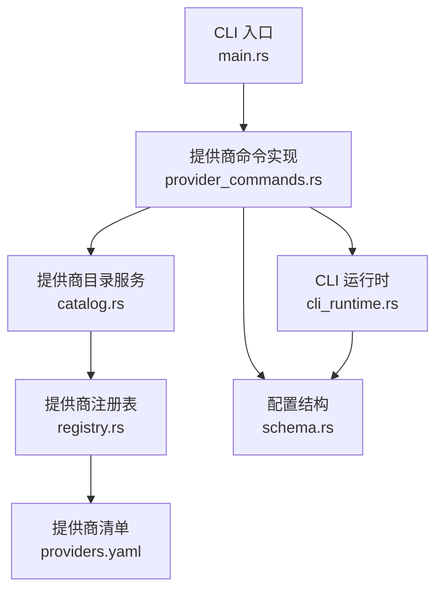
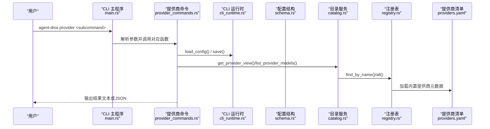
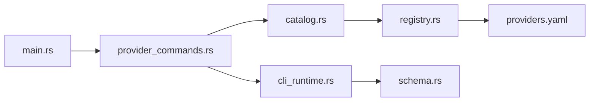
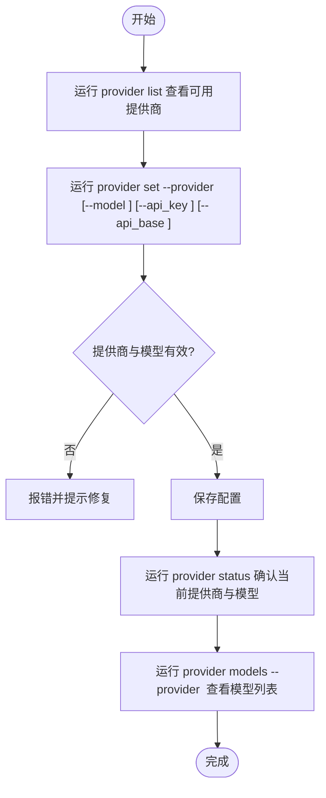

# 提供商管理命令

<cite>
**本文引用的文件**
- [agent-diva-cli/src/main.rs](file://agent-diva-cli/src/main.rs)
- [agent-diva-cli/src/provider_commands.rs](file://agent-diva-cli/src/provider_commands.rs)
- [agent-diva-providers/src/lib.rs](file://agent-diva-providers/src/lib.rs)
- [agent-diva-providers/src/catalog.rs](file://agent-diva-providers/src/catalog.rs)
- [agent-diva-providers/src/registry.rs](file://agent-diva-providers/src/registry.rs)
- [agent-diva-providers/src/providers.yaml](file://agent-diva-providers/src/providers.yaml)
- [agent-diva-core/src/config/schema.rs](file://agent-diva-core/src/config/schema.rs)
- [agent-diva-cli/src/cli_runtime.rs](file://agent-diva-cli/src/cli_runtime.rs)
</cite>

## 目录
1. [简介](#简介)
2. [项目结构](#项目结构)
3. [核心组件](#核心组件)
4. [架构总览](#架构总览)
5. [详细组件分析](#详细组件分析)
6. [依赖关系分析](#依赖关系分析)
7. [性能与可用性考虑](#性能与可用性考虑)
8. [故障排查指南](#故障排查指南)
9. [结论](#结论)
10. [附录：配置结构与验证规则](#附录：配置结构与验证规则)

## 简介
本文件面向“提供商管理”子命令，覆盖以下能力：
- list：列出可用提供商及其就绪状态、默认模型等
- status：查看当前激活的提供商与模型，以及各提供商缺失字段
- set：设置默认提供商、模型与凭据（API Key、API Base）
- models：获取某提供商支持的模型列表（支持运行时发现或静态回退）
- login：占位实现，提示尚未实现 OAuth/设备流认证流程

文档同时说明提供商配置结构、验证规则、不同 LLM 提供商的配置示例、API Key 的安全存储与管理方式，以及提供商切换与模型选择的完整流程。

## 项目结构
提供商管理命令由 CLI 层定义入口与参数解析，provider_commands 模块实现具体逻辑，providers 模块提供提供商目录、模型目录与访问抽象，core 模块提供配置结构与持久化。

图表来源
- [agent-diva-cli/src/main.rs:170-319](file://agent-diva-cli/src/main.rs#L170-L319)
- [agent-diva-cli/src/provider_commands.rs:25-233](file://agent-diva-cli/src/provider_commands.rs#L25-L233)
- [agent-diva-providers/src/catalog.rs:71-193](file://agent-diva-providers/src/catalog.rs#L71-L193)
- [agent-diva-providers/src/registry.rs:73-108](file://agent-diva-providers/src/registry.rs#L73-L108)
- [agent-diva-providers/src/providers.yaml:1-163](file://agent-diva-providers/src/providers.yaml#L1-L163)
- [agent-diva-core/src/config/schema.rs:1193-1350](file://agent-diva-core/src/config/schema.rs#L1193-L1350)
- [agent-diva-cli/src/cli_runtime.rs:14-72](file://agent-diva-cli/src/cli_runtime.rs#L14-L72)

章节来源
- [agent-diva-cli/src/main.rs:170-319](file://agent-diva-cli/src/main.rs#L170-L319)
- [agent-diva-cli/src/provider_commands.rs:25-233](file://agent-diva-cli/src/provider_commands.rs#L25-L233)
- [agent-diva-providers/src/catalog.rs:71-193](file://agent-diva-providers/src/catalog.rs#L71-L193)
- [agent-diva-providers/src/registry.rs:73-108](file://agent-diva-providers/src/registry.rs#L73-L108)
- [agent-diva-core/src/config/schema.rs:1193-1350](file://agent-diva-core/src/config/schema.rs#L1193-L1350)
- [agent-diva-cli/src/cli_runtime.rs:14-72](file://agent-diva-cli/src/cli_runtime.rs#L14-L72)

## 核心组件
- CLI 命令定义与路由：在 main.rs 中定义 ProviderCommands 子命令及参数，并分发到 provider_commands 中的对应函数。
- 提供商命令实现：provider_commands.rs 实现 list/status/set/models/login 的具体业务逻辑。
- 提供商目录服务：catalog.rs 提供 ProviderCatalogService，负责合并内置/自定义提供商视图、模型目录、模型增删、自定义提供商保存/删除等。
- 提供商注册表：registry.rs 加载 providers.yaml 构建 ProviderSpec 集合，支持按名称/模型查找。
- 配置结构：schema.rs 定义 ProvidersConfig、ProviderConfig、CustomProviderConfig 等，用于持久化提供商配置。
- CLI 运行时：cli_runtime.rs 提供 CliRuntime、ProviderStatusReport 等，辅助读取/保存配置、生成状态报告。

章节来源
- [agent-diva-cli/src/main.rs:170-319](file://agent-diva-cli/src/main.rs#L170-L319)
- [agent-diva-cli/src/provider_commands.rs:25-233](file://agent-diva-cli/src/provider_commands.rs#L25-L233)
- [agent-diva-providers/src/catalog.rs:71-193](file://agent-diva-providers/src/catalog.rs#L71-L193)
- [agent-diva-providers/src/registry.rs:73-108](file://agent-diva-providers/src/registry.rs#L73-L108)
- [agent-diva-core/src/config/schema.rs:1193-1350](file://agent-diva-core/src/config/schema.rs#L1193-L1350)
- [agent-diva-cli/src/cli_runtime.rs:14-72](file://agent-diva-cli/src/cli_runtime.rs#L14-L72)

## 架构总览
提供商管理命令的整体调用链如下：

图表来源
- [agent-diva-cli/src/main.rs:170-319](file://agent-diva-cli/src/main.rs#L170-L319)
- [agent-diva-cli/src/provider_commands.rs:25-233](file://agent-diva-cli/src/provider_commands.rs#L25-L233)
- [agent-diva-providers/src/catalog.rs:71-193](file://agent-diva-providers/src/catalog.rs#L71-L193)
- [agent-diva-providers/src/registry.rs:73-108](file://agent-diva-providers/src/registry.rs#L73-L108)
- [agent-diva-providers/src/providers.yaml:1-163](file://agent-diva-providers/src/providers.yaml#L1-L163)

## 详细组件分析

### 命令：provider list
- 功能：列出所有可管理的提供商，显示名称、是否已配置、默认模型、是否当前激活。
- 参数：
  - --json：以结构化 JSON 输出。
- 行为要点：
  - 通过 CLI 运行时加载配置，调用 provider_statuses 生成提供商状态列表。
  - 非 JSON 模式会打印人类可读的输出；JSON 模式直接序列化。

章节来源
- [agent-diva-cli/src/provider_commands.rs:25-52](file://agent-diva-cli/src/provider_commands.rs#L25-L52)
- [agent-diva-cli/src/cli_runtime.rs:32-72](file://agent-diva-cli/src/cli_runtime.rs#L32-L72)

### 命令：provider status
- 功能：查看当前激活的提供商与模型，以及各提供商的准备情况与缺失字段。
- 参数：
  - --json：以结构化 JSON 输出。
- 行为要点：
  - 使用 provider_status_report 生成包含 current_model、current_provider 与各提供商状态的报告。
  - 若缺少必要字段，会在输出中列出 missing_fields。

章节来源
- [agent-diva-cli/src/provider_commands.rs:54-88](file://agent-diva-cli/src/provider_commands.rs#L54-L88)
- [agent-diva-cli/src/cli_runtime.rs:67-72](file://agent-diva-cli/src/cli_runtime.rs#L67-L72)

### 命令：provider set
- 功能：设置默认提供商与模型，并可更新凭据（API Key、API Base）。
- 参数：
  - --provider：要激活的提供商名称（必填）。
  - --model：要存储的模型名（可选；若未提供则优先使用提供商默认模型或当前默认模型）。
  - --api_key：为所选提供商写入 API Key（可选）。
  - --api_base：为所选提供商写入 API Base（可选）。
  - --json：以结构化 JSON 输出。
- 行为要点：
  - 通过 ProviderCatalogService.get_provider_view 校验提供商是否存在。
  - 选择模型优先级：命令行 --model > 提供商默认模型 > 当前默认提供商对应的模型。
  - 更新 agents.defaults.provider 与 agents.defaults.model。
  - 若提供商存在固定槽位（如 openai/deepseek），则调用 set_provider_credentials 更新凭据；若是自定义提供商，则更新其 api_key/api_base。
  - 保存配置后返回 ProviderSetReport，包含 provider、model、config_path、configured、api_base。

章节来源
- [agent-diva-cli/src/provider_commands.rs:90-153](file://agent-diva-cli/src/provider_commands.rs#L90-L153)
- [agent-diva-providers/src/catalog.rs:101-145](file://agent-diva-providers/src/catalog.rs#L101-L145)
- [agent-diva-core/src/config/schema.rs:1193-1350](file://agent-diva-core/src/config/schema.rs#L1193-L1350)

### 命令：provider models
- 功能：获取指定提供商的模型列表，支持运行时发现或静态回退。
- 参数：
  - --provider：要查询的提供商名称（必填）。
  - --json：以结构化 JSON 输出。
  - --static-fallback：当运行时发现失败或不支持时，回退到内置静态模型列表。
- 行为要点：
  - 调用 ProviderCatalogService.list_provider_models，内部根据 include_runtime 决定是否尝试运行时发现。
  - 对 OpenAI 兼容端点且提供 api_base 的自定义提供商，支持运行时发现。
  - 合并自定义模型（custom_models）与运行时/静态模型，去重并标注来源（runtime/static/custom）。
  - 输出包含 provider、source、runtime_supported、api_base、models、model_entries、custom_models、warnings、error。

章节来源
- [agent-diva-cli/src/provider_commands.rs:177-233](file://agent-diva-cli/src/provider_commands.rs#L177-L233)
- [agent-diva-providers/src/catalog.rs:161-193](file://agent-diva-providers/src/catalog.rs#L161-L193)
- [agent-diva-providers/src/catalog.rs:389-435](file://agent-diva-providers/src/catalog.rs#L389-L435)
- [agent-diva-providers/src/providers.yaml:1-163](file://agent-diva-providers/src/providers.yaml#L1-L163)

### 命令：provider login
- 功能：占位实现，提示该构建中尚未实现提供商登录流程（如 OAuth/设备流）。
- 参数：
  - provider：提供商名称（必填）。
  - --json：以结构化 JSON 输出。
- 行为要点：
  - 返回 not_implemented 状态与提示信息，后续可按提供商实现认证流程。

章节来源
- [agent-diva-cli/src/provider_commands.rs:155-175](file://agent-diva-cli/src/provider_commands.rs#L155-L175)

### 提供商目录与模型发现
- 提供商视图（ProviderView）：包含 id、display_name、source（builtin/custom）、api_type、default_model、api_base、configured、ready、runtime_supported、supports_model_discovery。
- 模型目录（ProviderModelCatalogView）：包含 provider、catalog_source、runtime_supported、api_base、models、custom_models、warnings、error。
- 模型来源（ProviderModelSource）：runtime、static、custom。
- 自定义提供商（CustomProviderUpsert）：用于新增/更新自定义提供商，限制 api_type 仅支持 openai。

章节来源
- [agent-diva-providers/src/catalog.rs:24-69](file://agent-diva-providers/src/catalog.rs#L24-L69)
- [agent-diva-providers/src/catalog.rs:326-387](file://agent-diva-providers/src/catalog.rs#L326-L387)
- [agent-diva-providers/src/catalog.rs:438-488](file://agent-diva-providers/src/catalog.rs#L438-L488)

## 依赖关系分析
- CLI 层依赖 provider_commands 实现业务逻辑。
- provider_commands 依赖 cli_runtime 进行配置读写与状态报告。
- provider_commands 依赖 catalog 进行提供商视图与模型目录操作。
- catalog 依赖 registry 加载 providers.yaml 构建 ProviderSpec。
- schema 提供配置结构，供 cli_runtime 与 catalog 使用。

图表来源
- [agent-diva-cli/src/main.rs:170-319](file://agent-diva-cli/src/main.rs#L170-L319)
- [agent-diva-cli/src/provider_commands.rs:25-233](file://agent-diva-cli/src/provider_commands.rs#L25-L233)
- [agent-diva-providers/src/catalog.rs:71-193](file://agent-diva-providers/src/catalog.rs#L71-L193)
- [agent-diva-providers/src/registry.rs:73-108](file://agent-diva-providers/src/registry.rs#L73-L108)
- [agent-diva-core/src/config/schema.rs:1193-1350](file://agent-diva-core/src/config/schema.rs#L1193-L1350)

章节来源
- [agent-diva-cli/src/main.rs:170-319](file://agent-diva-cli/src/main.rs#L170-L319)
- [agent-diva-cli/src/provider_commands.rs:25-233](file://agent-diva-cli/src/provider_commands.rs#L25-L233)
- [agent-diva-providers/src/catalog.rs:71-193](file://agent-diva-providers/src/catalog.rs#L71-L193)
- [agent-diva-providers/src/registry.rs:73-108](file://agent-diva-providers/src/registry.rs#L73-L108)
- [agent-diva-core/src/config/schema.rs:1193-1350](file://agent-diva-core/src/config/schema.rs#L1193-L1350)

## 性能与可用性考虑
- 模型发现：对于 OpenAI 兼容端点且提供 api_base 的自定义提供商，支持运行时发现模型，减少维护成本；否则回退到静态列表。
- 去重与排序：模型列表与提供商视图均进行去重与排序，确保输出稳定。
- 配置保存：set 命令仅在必要时更新凭据并保存配置，避免频繁写盘。
- JSON 输出：所有命令支持 --json，便于自动化集成与脚本处理。

[本节为通用指导，不直接分析具体文件]

## 故障排查指南
- 未知提供商：set/models 命令若传入不存在提供商，将报错 Unknown provider。请检查提供商名称是否正确，或通过 list 查看可用提供商。
- 缺少默认模型：若提供商未暴露默认模型，set 命令要求显式传递 --model。
- 运行时发现失败：models 命令可通过 --static-fallback 回退到静态模型列表；若仍为空，检查提供商是否为 OpenAI 兼容且提供了 api_base。
- 凭据未生效：确认 set 命令是否成功保存配置，并通过 status 查看 missing_fields 与 configured 状态。
- 登录未实现：login 命令当前为占位实现，需后续按提供商实现 OAuth/设备流。

章节来源
- [agent-diva-cli/src/provider_commands.rs:90-153](file://agent-diva-cli/src/provider_commands.rs#L90-L153)
- [agent-diva-cli/src/provider_commands.rs:155-175](file://agent-diva-cli/src/provider_commands.rs#L155-L175)
- [agent-diva-providers/src/catalog.rs:161-193](file://agent-diva-providers/src/catalog.rs#L161-L193)

## 结论
提供商管理命令提供了完整的提供商与模型管理能力：
- list/status 帮助快速了解当前配置与就绪状态。
- set 支持一键切换默认提供商与模型，并安全更新凭据。
- models 支持运行时发现与静态回退，便于扩展新提供商与新模型。
- login 作为占位，为未来认证流程预留接口。
结合 providers.yaml 与 schema 的结构化配置，系统具备良好的可扩展性与可维护性。

[本节为总结，不直接分析具体文件]

## 附录：配置结构与验证规则

### 提供商配置结构
- ProvidersConfig：包含多个内置提供商（anthropic/openai/openrouter/deepseek/groq/zhipu/dashscope/vllm/gemini/moonshot/minimax/aihubmix/custom）与 custom_providers 映射。
- ProviderConfig：每个内置提供商的配置项包括 api_key、api_base、extra_headers、custom_models、reasoning_config、response_protocol。
- CustomProviderConfig：用户自定义提供商，包含 display_name、api_type（默认 openai）、api_key、api_base、default_model、models、extra_headers。

章节来源
- [agent-diva-core/src/config/schema.rs:1193-1350](file://agent-diva-core/src/config/schema.rs#L1193-L1350)

### 验证规则
- 自定义提供商仅支持 api_type=openai。
- 提供商 ID 不能与内置提供商冲突。
- 模型列表去重，空字符串被忽略。
- 提供商就绪判断：内置提供商需要 api_key 或 api_base；自定义提供商需要 api_base。

章节来源
- [agent-diva-providers/src/catalog.rs:239-276](file://agent-diva-providers/src/catalog.rs#L239-L276)
- [agent-diva-providers/src/catalog.rs:444-465](file://agent-diva-providers/src/catalog.rs#L444-L465)

### 不同 LLM 提供商的配置示例
- OpenAI：设置 provider=openai，可选 model=gpt-4o，api_key 通过环境变量或配置写入。
- Anthropic：设置 provider=anthropic，可选 model=claude-sonnet-4-5，api_key 通过环境变量或配置写入。
- DeepSeek：设置 provider=deepseek，可选 model=deepseek-v4-pro，api_key 通过环境变量或配置写入。
- 自定义 OpenAI 兼容端点：添加 custom_providers，设置 api_type=openai、api_base、models、default_model。

章节来源
- [agent-diva-providers/src/providers.yaml:106-163](file://agent-diva-providers/src/providers.yaml#L106-L163)
- [agent-diva-providers/src/providers.yaml:77-105](file://agent-diva-providers/src/providers.yaml#L77-L105)
- [agent-diva-providers/src/providers.yaml:140-163](file://agent-diva-providers/src/providers.yaml#L140-L163)
- [agent-diva-providers/src/catalog.rs:239-276](file://agent-diva-providers/src/catalog.rs#L239-L276)

### API Key 的安全存储与管理
- 存储位置：配置文件中对应提供商的 api_key 字段，或由环境变量注入（如 OPENAI_API_KEY、ANTHROPIC_API_KEY 等）。
- 管理方式：通过 provider set --api_key 更新；CLI 运行时负责保存配置。
- 安全建议：避免在日志中输出敏感信息；使用只读权限保护配置文件；定期轮换密钥。

章节来源
- [agent-diva-core/src/config/schema.rs:1226-1243](file://agent-diva-core/src/config/schema.rs#L1226-L1243)
- [agent-diva-cli/src/provider_commands.rs:90-153](file://agent-diva-cli/src/provider_commands.rs#L90-L153)

### 提供商切换与模型选择流程

图表来源
- [agent-diva-cli/src/provider_commands.rs:25-233](file://agent-diva-cli/src/provider_commands.rs#L25-L233)
- [agent-diva-providers/src/catalog.rs:161-193](file://agent-diva-providers/src/catalog.rs#L161-L193)