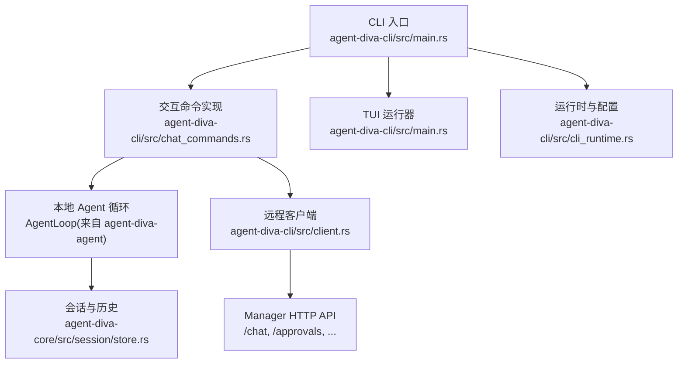
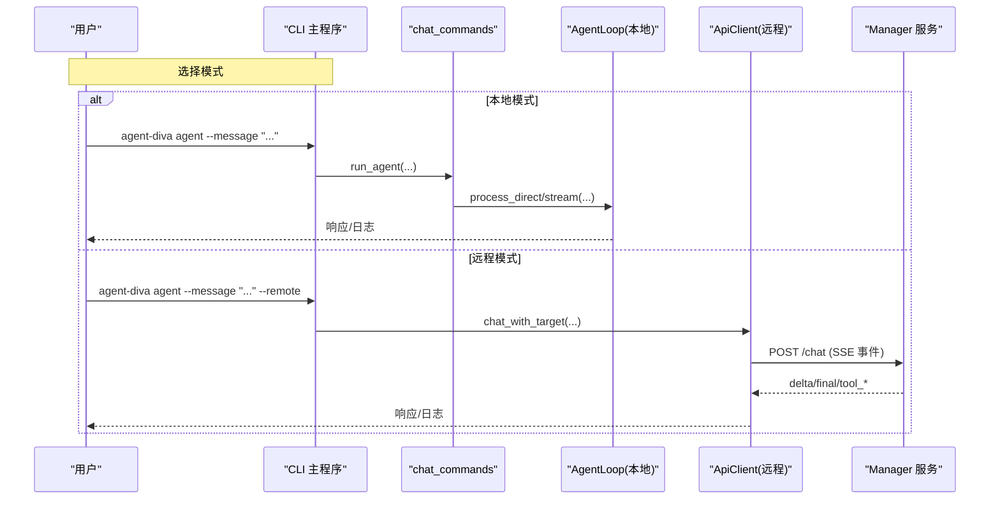
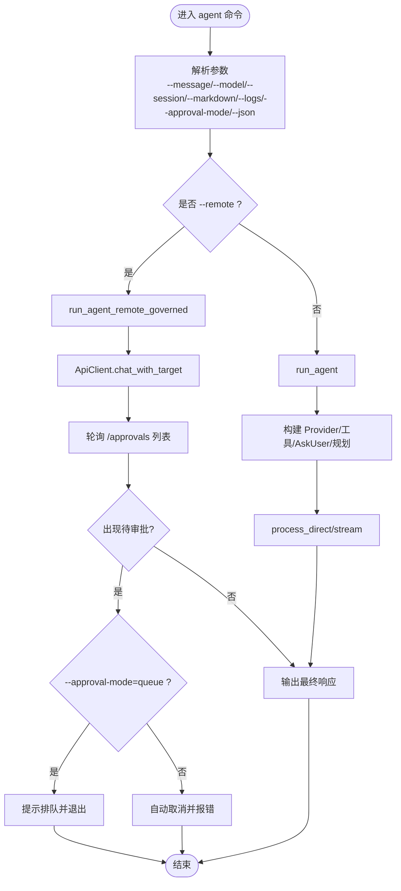
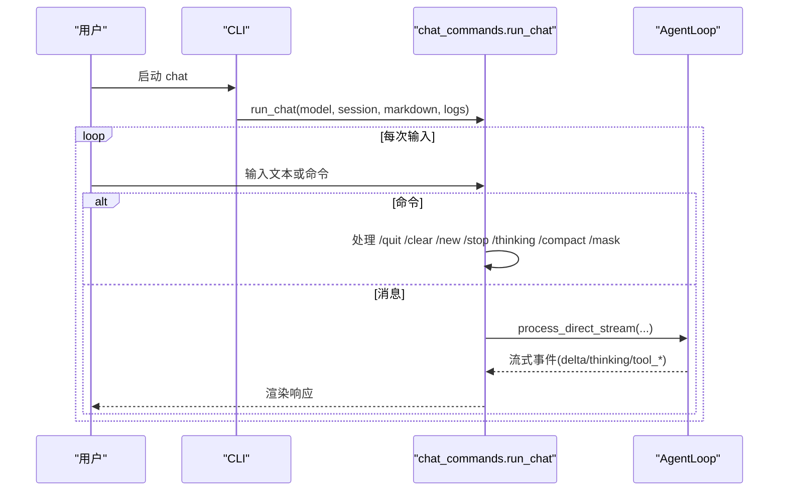
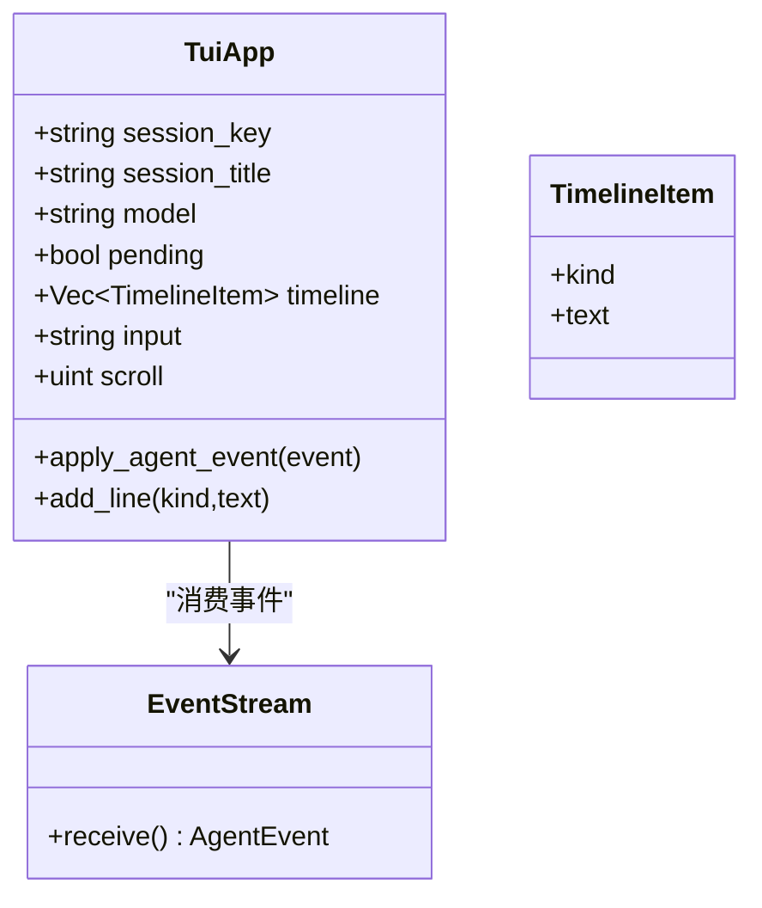
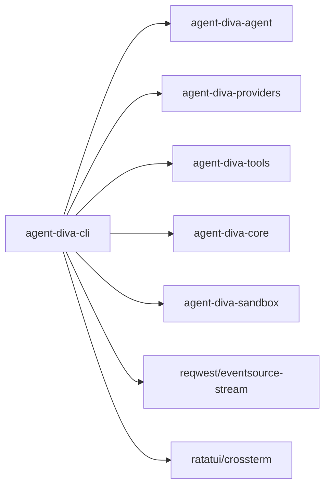
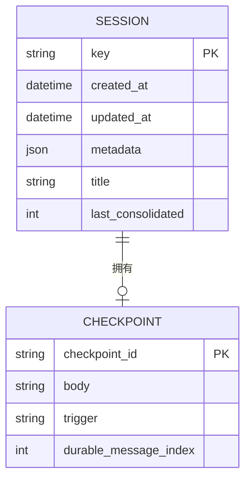

# 智能体交互命令

<cite>
**本文引用的文件**
- [main.rs](file://agent-diva-cli/src/main.rs)
- [chat_commands.rs](file://agent-diva-cli/src/chat_commands.rs)
- [client.rs](file://agent-diva-cli/src/client.rs)
- [cli_runtime.rs](file://agent-diva-cli/src/cli_runtime.rs)
- [Cargo.toml](file://agent-diva-cli/Cargo.toml)
- [store.rs](file://agent-diva-core/src/session/store.rs)
</cite>

## 目录
1. [简介](#简介)
2. [项目结构](#项目结构)
3. [核心组件](#核心组件)
4. [架构总览](#架构总览)
5. [详细组件分析](#详细组件分析)
6. [依赖关系分析](#依赖关系分析)
7. [性能与可用性](#性能与可用性)
8. [故障排查指南](#故障排查指南)
9. [结论](#结论)
10. [附录：命令示例与输出格式](#附录命令示例与输出格式)

## 简介
本文件面向使用 agent-diva CLI 的用户，系统性说明三大交互命令：agent、chat、tui。重点覆盖：
- agent 命令的参数选项（--message、--model、--session、--markdown、--logs、--approval-mode、--json 等）
- chat 命令的交互式聊天模式与内置命令
- tui 命令的终端用户界面特性与操作方法
- 本地模式与远程模式的差异与切换
- 会话管理与上下文保持机制
- 完整命令示例与输出格式说明

## 项目结构
CLI 入口位于 agent-diva-cli/src/main.rs，负责解析命令行参数并分发到具体子命令；交互逻辑集中在 chat_commands.rs；远程通信通过 client.rs 完成；运行时配置与提供者构建在 cli_runtime.rs；会话数据模型在 agent-diva-core/src/session/store.rs。

图表来源
- [main.rs:489-553](file://agent-diva-cli/src/main.rs#L489-L553)
- [chat_commands.rs:79-144](file://agent-diva-cli/src/chat_commands.rs#L79-L144)
- [client.rs:152-262](file://agent-diva-cli/src/client.rs#L152-L262)
- [cli_runtime.rs:117-194](file://agent-diva-cli/src/cli_runtime.rs#L117-L194)
- [store.rs:186-208](file://agent-diva-core/src/session/store.rs#L186-L208)

章节来源
- [main.rs:59-205](file://agent-diva-cli/src/main.rs#L59-L205)
- [Cargo.toml:11-24](file://agent-diva-cli/Cargo.toml#L11-L24)

## 核心组件
- CLI 命令定义与分发：Commands::Agent、Commands::Chat、Commands::Tui 及其参数
- 本地 Agent 运行：构建 Provider、工具集、规划、AskUser 协调器，驱动 AgentLoop
- 远程调用：通过 ApiClient 向 Manager 发送 /chat 事件流，并轮询审批队列
- TUI 界面：基于 ratatui/crossterm 的终端界面，支持滚动、输入、状态栏、时间线渲染
- 会话管理：以 channel:chat_id 形式的 session key 标识会话，持久化消息历史与检查点

章节来源
- [main.rs:88-205](file://agent-diva-cli/src/main.rs#L88-L205)
- [chat_commands.rs:79-144](file://agent-diva-cli/src/chat_commands.rs#L79-L144)
- [client.rs:12-54](file://agent-diva-cli/src/client.rs#L12-L54)
- [store.rs:186-208](file://agent-diva-core/src/session/store.rs#L186-L208)

## 架构总览
下图展示三种交互路径：本地直连、远程调用、TUI 界面。

图表来源
- [main.rs:489-553](file://agent-diva-cli/src/main.rs#L489-L553)
- [chat_commands.rs:260-364](file://agent-diva-cli/src/chat_commands.rs#L260-L364)
- [client.rs:152-262](file://agent-diva-cli/src/client.rs#L152-L262)

## 详细组件分析

### agent 命令
- 功能：一次性向智能体发送消息并获取回复，支持本地或远程执行，支持流式日志与结构化输出。
- 关键参数
  - --message：要发送的消息
  - --model：指定模型（未提供时使用默认模型）
  - --session：会话键（channel:chat_id），用于上下文延续
  - --markdown：将助手输出渲染为 Markdown 友好文本
  - --logs：显示推理与工具调用的流式日志
  - --approval-mode：非交互模式下的审批策略（fail/queue）
  - --json：输出机器可读的结构化结果（如审批相关错误）
- 行为要点
  - 本地模式：构建 AgentLoop，直接处理消息；若需要审批且未启用队列，则拒绝执行并返回错误码
  - 远程模式：通过 ApiClient 调用 /chat，并轮询 /approvals 列表；根据 approval-mode 决定自动取消或提示排队
  - 会话键解析：使用 session_channel_and_chat_id 拆分 channel 与 chat_id，便于跨会话隔离

图表来源
- [main.rs:489-553](file://agent-diva-cli/src/main.rs#L489-L553)
- [chat_commands.rs:375-448](file://agent-diva-cli/src/chat_commands.rs#L375-L448)
- [chat_commands.rs:552-663](file://agent-diva-cli/src/chat_commands.rs#L552-L663)
- [client.rs:56-150](file://agent-diva-cli/src/client.rs#L56-L150)

章节来源
- [main.rs:98-127](file://agent-diva-cli/src/main.rs#L98-L127)
- [chat_commands.rs:375-448](file://agent-diva-cli/src/chat_commands.rs#L375-L448)
- [chat_commands.rs:552-663](file://agent-diva-cli/src/chat_commands.rs#L552-L663)

### chat 命令
- 功能：启动轻量级交互式聊天循环，支持内置命令控制会话与行为。
- 交互能力
  - 持续读取用户输入，发送到本地 AgentLoop
  - 内置命令：/quit、/clear、/new、/stop、/thinking auto|on|off、/compact、/mask list/wear/off/status/reload
  - 会话键默认为 cli:chat，可通过 /new 生成新会话
- 运行流程
  - 构建本地 Agent（含 AskUser 协调器、工具集、规划）
  - 循环处理输入与命令，必要时通过 runtime control 停止会话或压缩上下文
  - 支持 logs/markdown 参数控制输出风格与调试信息

图表来源
- [chat_commands.rs:665-778](file://agent-diva-cli/src/chat_commands.rs#L665-L778)
- [chat_commands.rs:260-364](file://agent-diva-cli/src/chat_commands.rs#L260-L364)

章节来源
- [main.rs:128-148](file://agent-diva-cli/src/main.rs#L128-L148)
- [chat_commands.rs:665-778](file://agent-diva-cli/src/chat_commands.rs#L665-L778)

### tui 命令
- 功能：提供终端用户界面，实时显示时间线、状态栏与输入框，支持本地与远程两种后端。
- 界面特性
  - 顶部状态栏：显示 model、title、session、status
  - 中间时间线：按角色着色（user/assistant/tool/system/error/thinking/todo）
  - 底部输入框：Enter 发送，Shift+Enter 换行，Esc 或 Ctrl+C 退出
  - 滚动：PageUp/PageDown/Up/Down
  - 内置命令：/quit、/clear、/new、/stop（远程模式下调用 stop API）
- 运行模式
  - 本地模式：构建 AgentLoop，后台任务处理请求，事件驱动刷新 UI
  - 远程模式：通过 ApiClient.chat_with_target 接收 SSE 事件，UI 仅负责渲染与输入

图表来源
- [main.rs:1297-1496](file://agent-diva-cli/src/main.rs#L1297-L1496)
- [main.rs:2160-2359](file://agent-diva-cli/src/main.rs#L2160-L2359)

章节来源
- [main.rs:154-162](file://agent-diva-cli/src/main.rs#L154-L162)
- [main.rs:1297-1496](file://agent-diva-cli/src/main.rs#L1297-L1496)
- [main.rs:2160-2359](file://agent-diva-cli/src/main.rs#L2160-L2359)

### 本地模式与远程模式对比
- 本地模式
  - 优点：低延迟、可精细控制（runtime control）、无需外部服务
  - 限制：需本地具备 Provider 配置与工具环境
- 远程模式
  - 优点：集中化管理、统一审批队列、多实例共享
  - 限制：依赖网络与 Manager 服务可用；非交互下对审批有严格约束

章节来源
- [chat_commands.rs:537-550](file://agent-diva-cli/src/chat_commands.rs#L537-L550)
- [chat_commands.rs:552-663](file://agent-diva-cli/src/chat_commands.rs#L552-L663)
- [client.rs:152-262](file://agent-diva-cli/src/client.rs#L152-L262)

## 依赖关系分析
- CLI 依赖 agent-diva-agent（AgentLoop）、agent-diva-providers（LLMProvider）、agent-diva-tools（工具注册）、agent-diva-core（会话、规划、AskUser）、agent-diva-sandbox（审批规则）
- 远程模式依赖 reqwest/eventsource-stream 进行 HTTP 与 SSE 事件流处理
- TUI 依赖 ratatui/crossterm 进行终端渲染与事件处理

图表来源
- [Cargo.toml:15-24](file://agent-diva-cli/Cargo.toml#L15-L24)
- [Cargo.toml:44-57](file://agent-diva-cli/Cargo.toml#L44-L57)

章节来源
- [Cargo.toml:15-57](file://agent-diva-cli/Cargo.toml#L15-L57)

## 性能与可用性
- 流式输出：agent/chat/tui 均支持流式事件，减少首字延迟
- 上下文压缩：chat 支持 /compact，TUI 通过 runtime control 触发压缩，避免上下文过大导致失败
- 审批队列：远程模式下，非交互场景遇到审批会提示排队或自动取消，避免阻塞
- 资源占用：TUI 使用交替屏幕与事件轮询，适合长时间驻留；本地 AgentLoop 设置全局超时与工具迭代上限

[本节为通用指导，不直接分析具体文件]

## 故障排查指南
- 无消息：agent 命令未提供 --message 时会提示用法
- 审批阻塞：非交互模式遇到审批时，若未启用 queue，会返回明确错误码；远程模式会提示使用 approvals 列表查看与决策
- 远程不可用：连接 Manager 失败或 /approvals 不可用时，返回“队列不可用”类错误
- 会话问题：确保 --session 一致以维持上下文；/new 可创建新会话
- 工具与权限：本地模式若需要命令审批且未配置规则，会被拒绝

章节来源
- [main.rs:532-536](file://agent-diva-cli/src/main.rs#L532-L536)
- [chat_commands.rs:450-464](file://agent-diva-cli/src/chat_commands.rs#L450-L464)
- [client.rs:56-150](file://agent-diva-cli/src/client.rs#L56-L150)

## 结论
agent-diva CLI 提供了三种互补的交互方式：一次性的 agent 命令、轻量的 chat 交互、以及富交互的 tui 界面。通过统一的会话键与上下文管理机制，用户可在本地与远程模式间灵活切换，并在需要时借助审批队列保障安全可控的执行。结合流式输出与上下文压缩，系统兼顾了响应速度与长期对话的稳定性。

[本节为总结性内容，不直接分析具体文件]

## 附录：命令示例与输出格式

- 基本用法
  - 本地单次对话：agent-diva agent --message "你好"
  - 指定模型与会话：agent-diva agent --message "继续" --model "provider/model" --session "cli:direct"
  - 开启日志与 Markdown：agent-diva agent --message "解释一下" --logs --markdown
  - 远程模式：agent-diva agent --message "任务" --remote --api-url "http://localhost:3000/api"
  - 非交互审批：agent-diva agent --message "执行" --approval-mode queue --json

- 交互聊天
  - 启动：agent-diva chat
  - 常用命令：/quit、/clear、/new、/stop、/thinking auto|on|off、/compact、/mask list/wear/off/status/reload

- TUI 界面
  - 启动：agent-diva tui
  - 操作：Enter 发送、Shift+Enter 换行、Esc/Ctrl+C 退出、上下翻页滚动
  - 远程模式：agent-diva tui --remote --api-url "http://localhost:3000/api"

- 输出格式
  - 普通输出：带标题的响应文本；可选 Markdown 友好渲染
  - JSON 输出：当启用 --json 时，审批相关错误会以结构化 JSON 输出（包含 ok、reason_code、approval 字段）
  - 流式日志：--logs 时打印工具调用开始/结束、推理片段、最终响应

章节来源
- [main.rs:98-162](file://agent-diva-cli/src/main.rs#L98-L162)
- [chat_commands.rs:32-37](file://agent-diva-cli/src/chat_commands.rs#L32-L37)
- [chat_commands.rs:450-464](file://agent-diva-cli/src/chat_commands.rs#L450-L464)
- [client.rs:152-262](file://agent-diva-cli/src/client.rs#L152-L262)

## 会话管理与上下文保持机制
- 会话键：采用 channel:chat_id 形式，例如 cli:direct、cli:chat、cli:tui 等；通过 session_channel_and_chat_id 解析
- 会话存储：Session 结构维护消息历史、元数据、标题、检查点；支持最大消息窗口与对齐工具调用序列
- 上下文压缩：CanonicalCheckpoint 提供有界的历史摘要，避免上下文过大；支持自动/手动/反应式触发
- 标题与标记：会话支持自动生成或手动设置的标题，支持置顶等元数据

图表来源
- [store.rs:186-208](file://agent-diva-core/src/session/store.rs#L186-L208)
- [store.rs:92-121](file://agent-diva-core/src/session/store.rs#L92-L121)
- [store.rs:293-315](file://agent-diva-core/src/session/store.rs#L293-L315)

章节来源
- [cli_runtime.rs:345-347](file://agent-diva-cli/src/cli_runtime.rs#L345-L347)
- [store.rs:186-208](file://agent-diva-core/src/session/store.rs#L186-L208)
- [store.rs:293-315](file://agent-diva-core/src/session/store.rs#L293-L315)