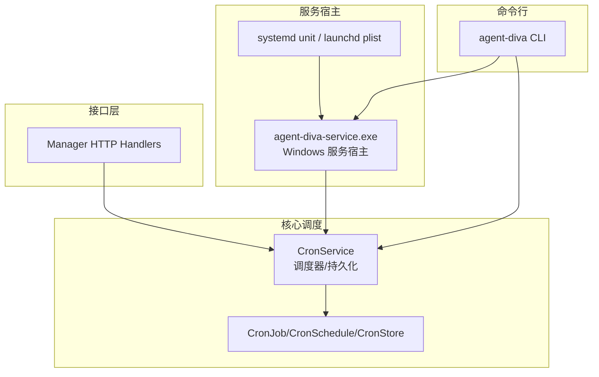
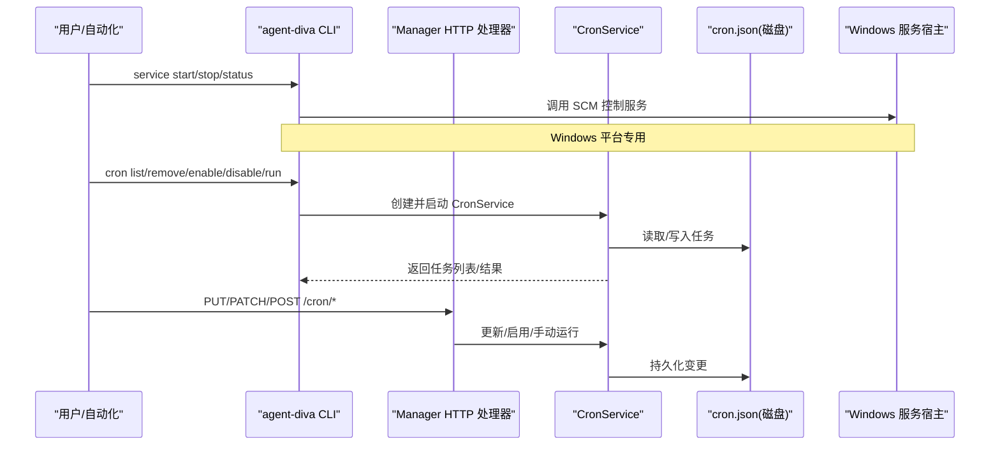
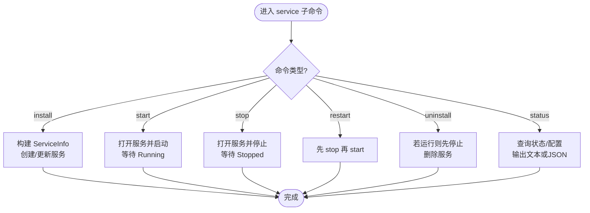
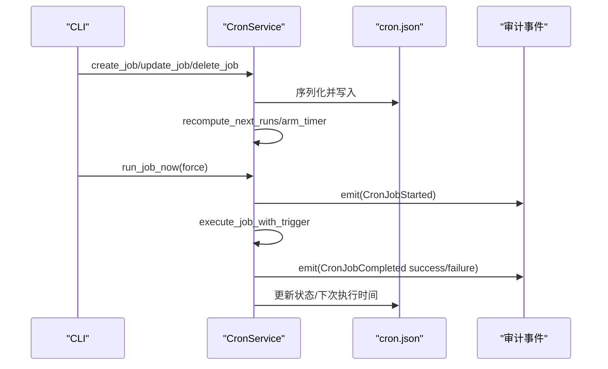
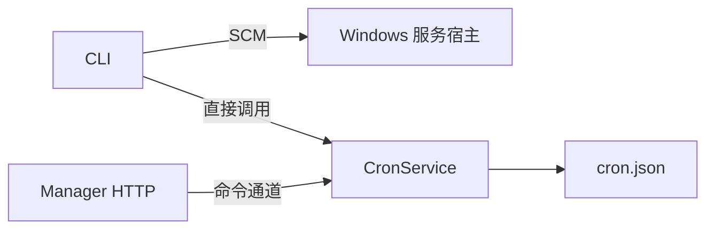

# 服务与定时任务

<cite>
**本文引用的文件**
- [agent-diva-cli/src/service.rs](file://agent-diva-cli/src/service.rs)
- [agent-diva-service/src/main.rs](file://agent-diva-service/src/main.rs)
- [contrib/systemd/agent-diva.service](file://contrib/systemd/agent-diva.service)
- [contrib/systemd/install.sh](file://contrib/systemd/install.sh)
- [agent-diva-core/src/cron/mod.rs](file://agent-diva-core/src/cron/mod.rs)
- [agent-diva-core/src/cron/types.rs](file://agent-diva-core/src/cron/types.rs)
- [agent-diva-core/src/cron/service.rs](file://agent-diva-core/src/cron/service.rs)
- [agent-diva-cli/src/main.rs](file://agent-diva-cli/src/main.rs)
- [agent-diva-manager/src/handlers.rs](file://agent-diva-manager/src/handlers.rs)
</cite>

## 目录
1. [简介](#简介)
2. [项目结构](#项目结构)
3. [核心组件](#核心组件)
4. [架构总览](#架构总览)
5. [详细组件分析](#详细组件分析)
6. [依赖关系分析](#依赖关系分析)
7. [性能考虑](#性能考虑)
8. [故障排查指南](#故障排查指南)
9. [结论](#结论)
10. [附录](#附录)

## 简介
本文件面向运维与开发者，系统化说明 Agent Diva 的“服务管理”和“定时任务”能力：
- 服务管理（service）：在 Windows 上通过 CLI 安装、启动、停止、重启、卸载、查询状态；Linux/macOS 可通过 systemd/launchd 进行进程守护。
- 定时任务（cron）：提供任务的增删改查、启用禁用、手动执行、调度表达式语法与执行策略，以及运行期监控、日志与错误处理。

## 项目结构
围绕服务与定时任务的关键代码分布如下：
- 服务管理（Windows）：CLI 命令定义与实现位于 agent-diva-cli/src/service.rs；服务宿主程序位于 agent-diva-service/src/main.rs。
- 服务部署（Linux/macOS）：systemd unit 与安装脚本位于 contrib/systemd/；macOS launchd 配置位于 contrib/launchd/。
- 定时任务内核：类型定义与调度服务位于 agent-diva-core/src/cron/*；CLI 与 API 层分别位于 agent-diva-cli/src/main.rs 与 agent-diva-manager/src/handlers.rs。



图表来源
- [agent-diva-cli/src/service.rs:103-121](file://agent-diva-cli/src/service.rs#L103-L121)
- [agent-diva-service/src/main.rs:92-146](file://agent-diva-service/src/main.rs#L92-L146)
- [agent-diva-core/src/cron/service.rs:98-188](file://agent-diva-core/src/cron/service.rs#L98-L188)
- [agent-diva-core/src/cron/types.rs:6-28](file://agent-diva-core/src/cron/types.rs#L6-L28)
- [agent-diva-manager/src/handlers.rs:1101-1155](file://agent-diva-manager/src/handlers.rs#L1101-L1155)

章节来源
- [agent-diva-cli/src/service.rs:1-67](file://agent-diva-cli/src/service.rs#L1-L67)
- [agent-diva-service/src/main.rs:1-27](file://agent-diva-service/src/main.rs#L1-L27)
- [contrib/systemd/agent-diva.service:1-28](file://contrib/systemd/agent-diva.service#L1-L28)
- [agent-diva-core/src/cron/mod.rs:1-11](file://agent-diva-core/src/cron/mod.rs#L1-L11)

## 核心组件
- Windows 服务管理命令（service）：支持 install/start/stop/restart/uninstall/status，具备 dry-run 模式与 JSON 输出。
- Linux/macOS 服务部署：systemd unit 模板与安装脚本，支持开机自启、失败重启、最小权限与安全沙箱。
- 定时任务服务（CronService）：内存+磁盘持久化的任务调度器，支持 at/every/cron 三种调度，支持启用/禁用、手动触发、运行快照与审计事件。
- CLI 与 API：CLI 提供 list/remove/enable/disable/run；API 暴露更新、启用、手动运行、停止运行等接口。

章节来源
- [agent-diva-cli/src/service.rs:5-50](file://agent-diva-cli/src/service.rs#L5-L50)
- [agent-diva-core/src/cron/types.rs:6-28](file://agent-diva-core/src/cron/types.rs#L6-L28)
- [agent-diva-core/src/cron/service.rs:98-188](file://agent-diva-core/src/cron/service.rs#L98-L188)
- [agent-diva-cli/src/main.rs:2000-2158](file://agent-diva-cli/src/main.rs#L2000-L2158)
- [agent-diva-manager/src/handlers.rs:1087-1155](file://agent-diva-manager/src/handlers.rs#L1087-L1155)

## 架构总览
下图展示从 CLI/API 到 CronService 的调用链，以及 Windows 服务宿主如何托管网关进程。



图表来源
- [agent-diva-cli/src/service.rs:103-121](file://agent-diva-cli/src/service.rs#L103-L121)
- [agent-diva-service/src/main.rs:92-146](file://agent-diva-service/src/main.rs#L92-L146)
- [agent-diva-core/src/cron/service.rs:119-188](file://agent-diva-core/src/cron/service.rs#L119-L188)
- [agent-diva-cli/src/main.rs:2000-2158](file://agent-diva-cli/src/main.rs#L2000-L2158)
- [agent-diva-manager/src/handlers.rs:1087-1155](file://agent-diva-manager/src/handlers.rs#L1087-L1155)

## 详细组件分析

### 服务管理（service 命令）
- 功能清单
  - install：注册或更新 Windows 服务，支持自动启动与 dry-run。
  - start/stop/restart：控制服务生命周期，带状态等待与超时。
  - uninstall：卸载前确保已停止。
  - status：输出文本或 JSON 状态，包含是否安装、运行状态、可执行路径。
- 关键行为
  - 非 Windows 平台会直接报错提示不支持。
  - 所有操作均先连接本地服务管理器，再打开目标服务句柄执行。
  - 启动/停止后轮询等待目标状态，避免竞态。
  - 支持 dry-run 打印计划动作，便于 CI 校验。



图表来源
- [agent-diva-cli/src/service.rs:103-121](file://agent-diva-cli/src/service.rs#L103-L121)
- [agent-diva-cli/src/service.rs:172-229](file://agent-diva-cli/src/service.rs#L172-L229)
- [agent-diva-cli/src/service.rs:231-291](file://agent-diva-cli/src/service.rs#L231-L291)
- [agent-diva-cli/src/service.rs:293-319](file://agent-diva-cli/src/service.rs#L293-L319)
- [agent-diva-cli/src/service.rs:321-375](file://agent-diva-cli/src/service.rs#L321-L375)

章节来源
- [agent-diva-cli/src/service.rs:1-67](file://agent-diva-cli/src/service.rs#L1-L67)
- [agent-diva-cli/src/service.rs:103-121](file://agent-diva-cli/src/service.rs#L103-L121)
- [agent-diva-cli/src/service.rs:172-229](file://agent-diva-cli/src/service.rs#L172-L229)
- [agent-diva-cli/src/service.rs:231-291](file://agent-diva-cli/src/service.rs#L231-L291)
- [agent-diva-cli/src/service.rs:293-319](file://agent-diva-cli/src/service.rs#L293-L319)
- [agent-diva-cli/src/service.rs:321-375](file://agent-diva-cli/src/service.rs#L321-L375)

### 定时任务（cron 命令）
- 功能清单
  - add：添加任务（通过工具或 API），支持一次性、周期、cron 表达式。
  - list：列出任务（可选包含禁用任务）。
  - remove：删除任务。
  - enable/disable：启用或禁用任务。
  - run：手动执行任务（支持 force 跳过启用检查）。
- 调度表达式与执行策略
  - at：指定毫秒时间戳的一次性任务，执行后可选择删除。
  - every：固定间隔（毫秒）重复执行。
  - cron：标准 cron 表达式（秒级精度补齐为 6 字段），支持可选时区；无效表达式会被记录警告并忽略。
  - 下次执行时间计算：每次加载/更新后重算 enabled 任务的 next_run_at_ms。
  - 执行流程：到达唤醒点 -> 注册活跃运行 -> 调用回调 -> 记录审计事件 -> 更新状态与下次执行时间 -> 保存存储 -> 重新设置定时器。
  - 取消与停止：每个运行携带 CancellationToken，支持外部停止运行。

```mermaid
classDiagram
class CronService {
+new(store_path, on_job)
+start()
+stop()
+list_jobs(include_disabled)
+get_job(job_id)
+create_job(request)
+update_job(job_id, request)
+delete_job(job_id)
+enable_job(job_id, enabled)
+run_job_now(job_id, force)
+stop_run(job_id)
+status()
}
class CronJob {
+id
+name
+enabled
+schedule
+payload
+state
+created_at_ms
+updated_at_ms
+delete_after_run
}
class CronSchedule {
<<enum>>
At{atMs}
Every{everyMs}
Cron{expr,tz}
}
class CronStore {
+version
+jobs
}
CronService --> CronStore : "读写"
CronStore --> CronJob : "包含"
CronJob --> CronSchedule : "使用"
```

图表来源
- [agent-diva-core/src/cron/service.rs:98-188](file://agent-diva-core/src/cron/service.rs#L98-L188)
- [agent-diva-core/src/cron/types.rs:91-122](file://agent-diva-core/src/cron/types.rs#L91-L122)
- [agent-diva-core/src/cron/types.rs:6-28](file://agent-diva-core/src/cron/types.rs#L6-L28)



图表来源
- [agent-diva-core/src/cron/service.rs:541-578](file://agent-diva-core/src/cron/service.rs#L541-L578)
- [agent-diva-core/src/cron/service.rs:686-708](file://agent-diva-core/src/cron/service.rs#L686-L708)
- [agent-diva-core/src/cron/service.rs:342-458](file://agent-diva-core/src/cron/service.rs#L342-L458)

章节来源
- [agent-diva-core/src/cron/types.rs:6-28](file://agent-diva-core/src/cron/types.rs#L6-L28)
- [agent-diva-core/src/cron/types.rs:91-122](file://agent-diva-core/src/cron/types.rs#L91-L122)
- [agent-diva-core/src/cron/service.rs:34-81](file://agent-diva-core/src/cron/service.rs#L34-L81)
- [agent-diva-core/src/cron/service.rs:176-233](file://agent-diva-core/src/cron/service.rs#L176-L233)
- [agent-diva-core/src/cron/service.rs:342-458](file://agent-diva-core/src/cron/service.rs#L342-L458)
- [agent-diva-cli/src/main.rs:2000-2158](file://agent-diva-cli/src/main.rs#L2000-L2158)
- [agent-diva-manager/src/handlers.rs:1087-1155](file://agent-diva-manager/src/handlers.rs#L1087-L1155)

### 调度表达式语法与执行策略
- 表达式形式
  - at：以毫秒时间戳表示的单一时刻。
  - every：固定间隔（毫秒）循环。
  - cron：标准 cron 表达式（秒级精度补齐为 6 字段），可选时区 tz；无效表达式将被记录警告且不会安排执行。
- 执行策略
  - 启动时加载存储并重算 enabled 任务的 next_run_at_ms。
  - 定时器根据最近唤醒时间休眠，到期后执行任务。
  - 任务执行期间维护活跃运行快照，支持外部停止。
  - 执行完成后更新 last_status/last_error/next_run_at_ms，并按 delete_after_run 决定是否删除一次性任务。
  - 所有开始/结束/失败事件通过审计事件记录。

章节来源
- [agent-diva-core/src/cron/service.rs:25-81](file://agent-diva-core/src/cron/service.rs#L25-L81)
- [agent-diva-core/src/cron/service.rs:212-233](file://agent-diva-core/src/cron/service.rs#L212-L233)
- [agent-diva-core/src/cron/service.rs:342-458](file://agent-diva-core/src/cron/service.rs#L342-L458)

### 服务部署与进程管理最佳实践
- Windows
  - 使用 CLI 的 service 子命令安装/启动/停止/重启/卸载/查看状态。
  - 建议开启自动启动并在系统启动后延迟启动，减少冷启动竞争。
  - 使用 dry-run 在 CI 中验证安装计划。
- Linux
  - 使用 systemd unit 模板与安装脚本进行部署，推荐最小权限用户、只读根文件系统、限制资源上限。
  - 配置 RUST_LOG 与 AGENT_DIVA_CONFIG 环境变量，数据与日志目录分离。
  - 通过 systemctl 管理生命周期，journalctl 查看日志。
- macOS
  - 使用 launchd plist 与安装脚本进行守护，遵循最小权限与隔离原则。

章节来源
- [agent-diva-cli/src/service.rs:154-229](file://agent-diva-cli/src/service.rs#L154-L229)
- [contrib/systemd/agent-diva.service:1-28](file://contrib/systemd/agent-diva.service#L1-L28)
- [contrib/systemd/install.sh:1-43](file://contrib/systemd/install.sh#L1-L43)

## 依赖关系分析
- CLI 与服务宿主的耦合
  - Windows 下 CLI 通过服务管理器与 agent-diva-service.exe 交互，后者负责拉起网关进程并管理生命周期。
- 定时任务与存储的耦合
  - CronService 将任务持久化为 JSON 文件，启动时加载，变更后写回；定时器基于最近唤醒时间驱动。
- API 与调度器的耦合
  - Manager HTTP 处理器通过通道向内部调度器发送命令，统一封装错误与响应。



图表来源
- [agent-diva-cli/src/service.rs:103-121](file://agent-diva-cli/src/service.rs#L103-L121)
- [agent-diva-service/src/main.rs:92-146](file://agent-diva-service/src/main.rs#L92-L146)
- [agent-diva-core/src/cron/service.rs:119-188](file://agent-diva-core/src/cron/service.rs#L119-L188)
- [agent-diva-manager/src/handlers.rs:1087-1155](file://agent-diva-manager/src/handlers.rs#L1087-L1155)

章节来源
- [agent-diva-cli/src/service.rs:103-121](file://agent-diva-cli/src/service.rs#L103-L121)
- [agent-diva-service/src/main.rs:92-146](file://agent-diva-service/src/main.rs#L92-L146)
- [agent-diva-core/src/cron/service.rs:119-188](file://agent-diva-core/src/cron/service.rs#L119-L188)
- [agent-diva-manager/src/handlers.rs:1087-1155](file://agent-diva-manager/src/handlers.rs#L1087-L1155)

## 性能考虑
- 定时器粒度
  - 调度器按毫秒级计算下次唤醒，避免频繁轮询；仅在存在 enabled 任务时设置定时器。
- 存储 I/O
  - 每次执行后写回存储，建议在高频任务场景下评估磁盘压力与并发写入影响。
- 并发执行
  - 同一任务不允许重复运行（活跃运行表保护），避免重复执行导致资源竞争。
- 资源限制
  - Linux 环境下通过 systemd 限制文件描述符、进程数，并启用安全沙箱选项。

[本节为通用指导，不直接分析具体文件]

## 故障排查指南
- 服务相关
  - Windows：确认服务已安装、二进制路径正确、SCM 权限足够；使用 status 查看当前状态与可执行路径。
  - Linux：检查 unit 文件是否正确安装、用户/组权限、日志目录可读；使用 journalctl 查看服务日志。
- 定时任务相关
  - 表达式无效：检查 cron 表达式与时区格式；无效表达式会记录警告且不安排执行。
  - 任务未执行：确认任务处于 enabled 状态，next_run_at_ms 已计算；必要时手动 run 测试。
  - 执行失败：查看 last_status/last_error；关注审计事件中的失败原因。
  - 无法停止运行：确认任务正在运行并通过 stop 接口传递 job_id 取消。

章节来源
- [agent-diva-cli/src/service.rs:321-375](file://agent-diva-cli/src/service.rs#L321-L375)
- [contrib/systemd/agent-diva.service:1-28](file://contrib/systemd/agent-diva.service#L1-L28)
- [agent-diva-core/src/cron/service.rs:50-81](file://agent-diva-core/src/cron/service.rs#L50-L81)
- [agent-diva-core/src/cron/service.rs:342-458](file://agent-diva-core/src/cron/service.rs#L342-L458)

## 结论
Agent Diva 在服务管理与定时任务方面提供了跨平台的可靠方案：
- Windows 通过 CLI 与系统服务管理器集成，提供完整的生命周期管理能力。
- Linux/macOS 通过 systemd/launchd 实现进程守护与安全加固。
- 定时任务内核具备灵活的调度表达式、完善的运行期状态与审计事件，便于监控与排障。
建议在生产环境结合系统服务机制与日志采集，建立统一的监控告警体系。

[本节为总结，不直接分析具体文件]

## 附录
- 常用命令参考
  - Windows 服务：install/start/stop/restart/uninstall/status（支持 --json 与 --dry-run）。
  - 定时任务：list/remove/enable/disable/run（CLI）；API 端提供更新、启用、手动运行、停止运行等接口。
- 调度表达式示例
  - at：一次性任务，指定毫秒时间戳。
  - every：每 N 秒执行一次。
  - cron：标准 cron 表达式，可选时区；例如“0 9 * * *”表示每天 9:00（UTC）。
- 配置与监控
  - Linux：通过 systemd 环境变量配置日志级别与配置目录；使用 journalctl 查看日志。
  - 定时任务：通过 status 接口获取运行概览；通过审计事件追踪任务开始/结束/失败。

章节来源
- [agent-diva-cli/src/service.rs:5-50](file://agent-diva-cli/src/service.rs#L5-L50)
- [agent-diva-cli/src/main.rs:2000-2158](file://agent-diva-cli/src/main.rs#L2000-L2158)
- [agent-diva-manager/src/handlers.rs:1087-1155](file://agent-diva-manager/src/handlers.rs#L1087-L1155)
- [contrib/systemd/agent-diva.service:1-28](file://contrib/systemd/agent-diva.service#L1-L28)