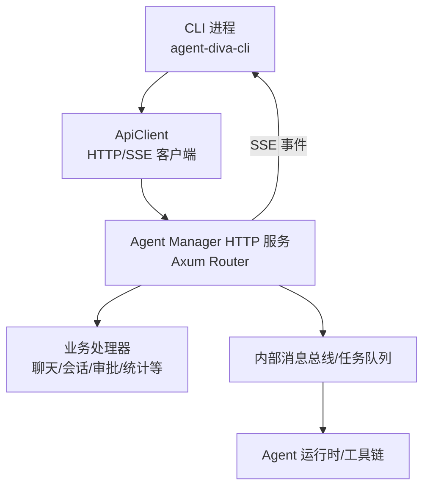
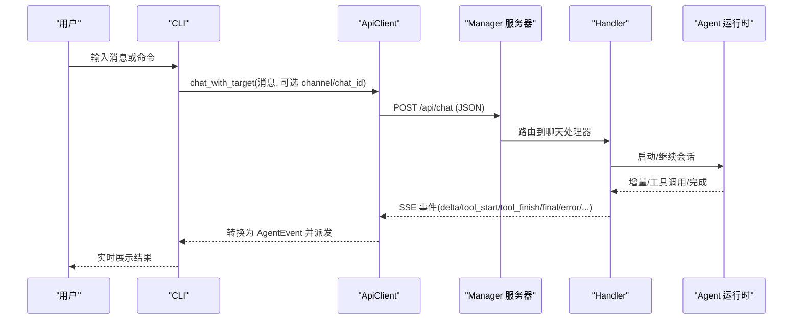
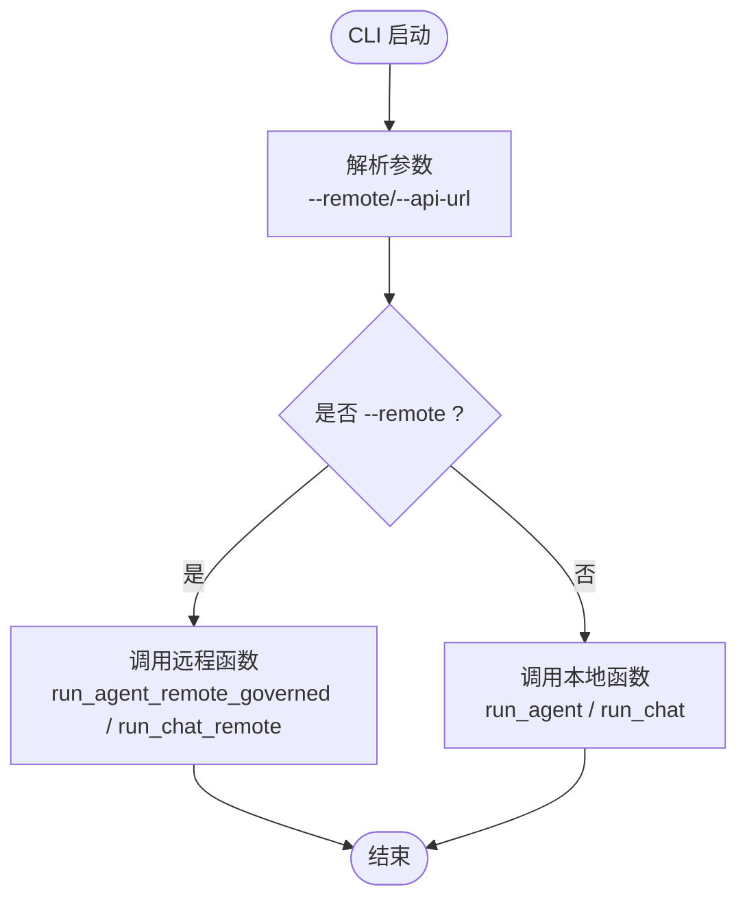
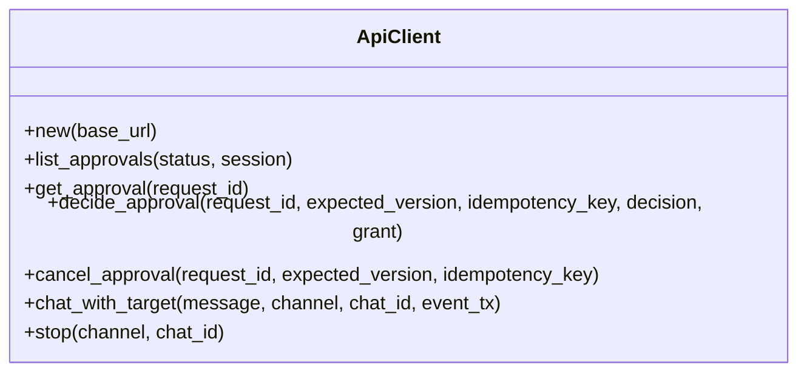
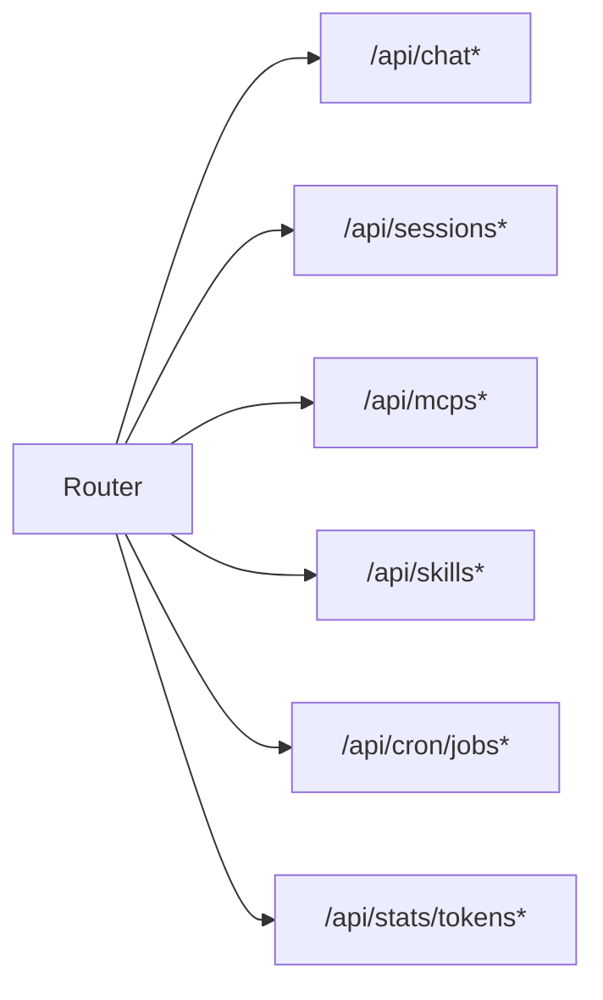
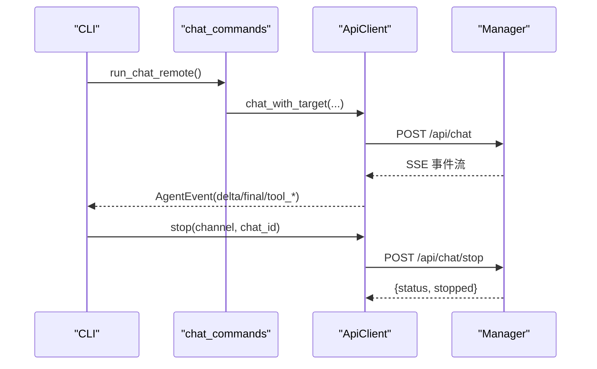
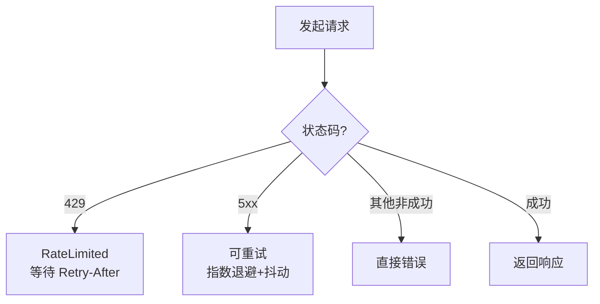
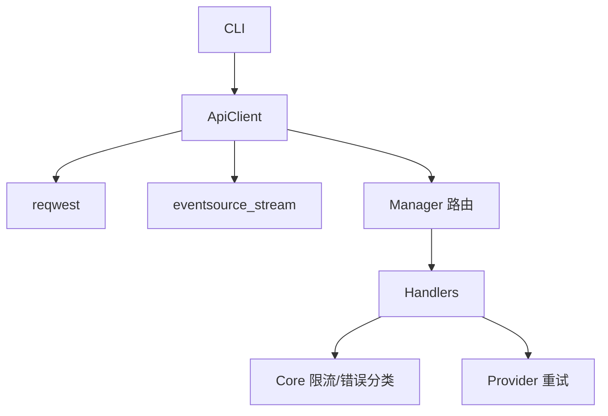

# 远程模式与 API 客户端

<cite>
**本文引用的文件**
- [agent-diva-cli/src/main.rs](file://agent-diva-cli/src/main.rs)
- [agent-diva-cli/src/client.rs](file://agent-diva-cli/src/client.rs)
- [agent-diva-cli/src/chat_commands.rs](file://agent-diva-cli/src/chat_commands.rs)
- [agent-diva-manager/src/server.rs](file://agent-diva-manager/src/server.rs)
- [agent-diva-manager/src/handlers.rs](file://agent-diva-manager/src/handlers.rs)
- [agent-diva-providers/src/retry.rs](file://agent-diva-providers/src/retry.rs)
- [agent-diva-core/src/rate_limiter.rs](file://agent-diva-core/src/rate_limiter.rs)
- [agent-diva-sandbox/src/guardian.rs](file://agent-diva-sandbox/src/guardian.rs)
- [agent-diva-tools/src/mcp_sdk.rs](file://agent-diva-tools/src/mcp_sdk.rs)
- [agent-diva-channels/src/qq.rs](file://agent-diva-channels/src/qq.rs)
</cite>

## 目录
1. [简介](#简介)
2. [项目结构](#项目结构)
3. [核心组件](#核心组件)
4. [架构总览](#架构总览)
5. [详细组件分析](#详细组件分析)
6. [依赖关系分析](#依赖关系分析)
7. [性能考虑](#性能考虑)
8. [故障排查指南](#故障排查指南)
9. [结论](#结论)
10. [附录](#附录)

## 简介
本文件聚焦“远程模式”和“API 客户端”的使用与实现，覆盖以下主题：
- --remote 选项的用法、连接配置与默认行为
- ApiClient 的职责：HTTP 请求封装、错误处理、SSE 事件流消费
- 远程模式下命令执行流程与响应处理
- API 端点调用示例与响应格式约定
- 认证与授权机制说明
- 网络故障处理与重试、连接池与代理策略
- 性能优化建议与调试方法
- 本地模式与远程模式的差异及适用场景

## 项目结构
远程模式由 CLI 作为入口，通过 ApiClient 访问 agent-diva-manager 提供的 HTTP API。Manager 内部将请求路由到具体业务处理器，并通过 SSE 向客户端推送实时事件（如对话增量、工具调用状态等）。

**图表来源**
- [agent-diva-cli/src/main.rs:79-85](file://agent-diva-cli/src/main.rs#L79-L85)
- [agent-diva-cli/src/client.rs:12-54](file://agent-diva-cli/src/client.rs#L12-L54)
- [agent-diva-manager/src/server.rs:94-113](file://agent-diva-manager/src/server.rs#L94-L113)

**章节来源**
- [agent-diva-cli/src/main.rs:79-85](file://agent-diva-cli/src/main.rs#L79-L85)
- [agent-diva-cli/src/client.rs:12-54](file://agent-diva-cli/src/client.rs#L12-L54)
- [agent-diva-manager/src/server.rs:94-113](file://agent-diva-manager/src/server.rs#L94-L113)

## 核心组件
- CLI 参数与远程切换
  - 全局开关 --remote 用于切换到远程模式；--api_url 可指定远端 API 基地址，未设置时使用默认值。
  - Agent/Chat/TUI 等子命令在检测到 --remote 时走远程路径，否则走本地路径。
- ApiClient
  - 基于 reqwest::Client 封装 HTTP 请求，支持 JSON 序列化/反序列化。
  - 对 loopback URL（127.0.0.1/localhost/[::1]）自动禁用系统代理，避免测试或本地网关被系统代理干扰。
  - 提供审批相关接口（列表、详情、决策、取消）、聊天发送与停止、以及 SSE 事件流消费。
- Manager HTTP 服务
  - Axum 构建路由，挂载聊天、会话、审批、MCP、技能、定时任务、统计等模块。
  - 统一 CORS 与 Trace 层，便于跨域与链路追踪。

**章节来源**
- [agent-diva-cli/src/main.rs:79-85](file://agent-diva-cli/src/main.rs#L79-L85)
- [agent-diva-cli/src/client.rs:39-54](file://agent-diva-cli/src/client.rs#L39-L54)
- [agent-diva-manager/src/server.rs:94-113](file://agent-diva-manager/src/server.rs#L94-L113)

## 架构总览
远程模式下的关键交互如下：
- CLI 解析参数并选择运行路径（本地 vs 远程）。
- 远程模式下，Cli 使用 ApiClient 发起 HTTP 请求，聊天接口返回 SSE 流。
- Manager 接收请求后，交由对应 handler 处理，必要时与 Agent 运行时交互，并将结果以 SSE 事件回推。
- 客户端根据事件类型渲染输出、工具调用进度、错误信息等。

**图表来源**
- [agent-diva-cli/src/client.rs:152-262](file://agent-diva-cli/src/client.rs#L152-L262)
- [agent-diva-manager/src/server.rs:94-113](file://agent-diva-manager/src/server.rs#L94-L113)

**章节来源**
- [agent-diva-cli/src/client.rs:152-262](file://agent-diva-cli/src/client.rs#L152-L262)
- [agent-diva-manager/src/server.rs:94-113](file://agent-diva-manager/src/server.rs#L94-L113)

## 详细组件分析

### 远程模式入口与参数
- 全局参数
  - --remote：启用远程模式。
  - --api-url：覆盖默认远端 API 地址，默认值为 http://localhost:3000/api。
- 命令分支
  - agent/chat/tui 等命令在检测到 --remote 时调用对应的远程函数，否则进入本地流程。

**图表来源**
- [agent-diva-cli/src/main.rs:79-85](file://agent-diva-cli/src/main.rs#L79-L85)
- [agent-diva-cli/src/main.rs:489-553](file://agent-diva-cli/src/main.rs#L489-L553)

**章节来源**
- [agent-diva-cli/src/main.rs:79-85](file://agent-diva-cli/src/main.rs#L79-L85)
- [agent-diva-cli/src/main.rs:489-553](file://agent-diva-cli/src/main.rs#L489-L553)

### ApiClient 功能详解
- 构造与连接策略
  - 默认 base_url 为 http://localhost:3000/api。
  - 当 base_url 指向 loopback 地址时，显式禁用系统代理，避免 Windows 上系统代理导致 502 等问题。
- 审批接口
  - list_approvals/get_approval/decide_approval/cancel_approval：分页拉取、获取详情、提交决策、取消请求。
  - 错误处理：网络异常映射为统一的“队列不可用”语义；非成功状态码会尝试解析 reason_code 并抛出错误。
- 聊天与停止
  - chat_with_target：POST /api/chat，返回 SSE 流，事件包括 delta、final、tool_start、tool_finish、tool_delta、error、turn_plan_updated、context_compaction。
  - stop：POST /api/chat/stop，返回 {status, stopped} 等字段，失败时抛出错误。
- 事件流处理
  - 使用 eventsource_stream 解析 SSE，将事件转换为 AgentEvent 并通过 mpsc 通道发送给上层 UI/控制台。

**图表来源**
- [agent-diva-cli/src/client.rs:12-54](file://agent-diva-cli/src/client.rs#L12-L54)
- [agent-diva-cli/src/client.rs:56-291](file://agent-diva-cli/src/client.rs#L56-L291)

**章节来源**
- [agent-diva-cli/src/client.rs:39-54](file://agent-diva-cli/src/client.rs#L39-L54)
- [agent-diva-cli/src/client.rs:56-291](file://agent-diva-cli/src/client.rs#L56-L291)

### Manager HTTP 路由与服务
- 路由组织
  - 通过 build_router 合并多个子路由：运行时、命令审批、ask_user、provider、planning、autodream、laputa、persona、memory、audit、token_stats、todo、misc。
  - 统一添加 CORS 与 Trace 层，便于前端与调试。
- 典型路由
  - 聊天：POST /api/chat（含 /stop 分支）
  - 会话：/api/sessions/*
  - MCP：/api/mcps/*
  - 技能：/api/skills/*
  - 定时任务：/api/cron/jobs/*
  - 统计：/api/stats/tokens/*

**图表来源**
- [agent-diva-manager/src/server.rs:94-113](file://agent-diva-manager/src/server.rs#L94-L113)
- [agent-diva-manager/src/server.rs:115-200](file://agent-diva-manager/src/server.rs#L115-L200)

**章节来源**
- [agent-diva-manager/src/server.rs:94-113](file://agent-diva-manager/src/server.rs#L94-L113)
- [agent-diva-manager/src/server.rs:115-200](file://agent-diva-manager/src/server.rs#L115-L200)

### 远程模式下的命令执行流程
- CLI 侧
  - run_chat_remote：创建 ApiClient，维护 session，循环读取用户输入，支持 /quit /clear /new /stop /compact 等快捷命令。
  - 对于普通消息，调用 run_remote_agent_turn（由 chat_commands 提供），最终通过 ApiClient.chat_with_target 发起 SSE 聊天。
- 服务端侧
  - Handler 接收聊天请求，调度 Agent 运行，按阶段产出 delta、工具调用事件、最终结果等，并以 SSE 形式返回。
- 客户端侧
  - 解析事件并转换为 AgentEvent，驱动 TUI/控制台输出。

**图表来源**
- [agent-diva-cli/src/chat_commands.rs:865-931](file://agent-diva-cli/src/chat_commands.rs#L865-L931)
- [agent-diva-cli/src/client.rs:152-291](file://agent-diva-cli/src/client.rs#L152-L291)

**章节来源**
- [agent-diva-cli/src/chat_commands.rs:865-931](file://agent-diva-cli/src/chat_commands.rs#L865-L931)
- [agent-diva-cli/src/client.rs:152-291](file://agent-diva-cli/src/client.rs#L152-L291)

### API 端点与响应格式
- 聊天
  - POST /api/chat：请求体包含 message、可选 channel/chat_id；响应为 SSE 流，事件类型包括 delta、final、tool_start、tool_finish、tool_delta、error、turn_plan_updated、context_compaction。
  - POST /api/chat/stop：请求体为空或包含 channel/chat_id；响应 JSON 包含 status 与 stopped。
- 审批
  - GET /api/approvals：支持 limit/status/session/cursor 查询参数；返回分页数据与 next_cursor。
  - GET /api/approvals/{request_id}：返回审批详情。
  - POST /api/approvals/{request_id}/decisions：提交决策，携带 expected_version、idempotency_key、decision、grant。
  - POST /api/approvals/{request_id}/cancel：取消审批，携带 expected_version、idempotency_key。
- 其他
  - /api/sessions/*、/api/mcps/*、/api/skills/*、/api/cron/jobs/*、/api/stats/tokens/* 等由 Manager 路由注册。

注意：以上端点定义来源于 CLI 调用方式与 Manager 路由注册位置。

**章节来源**
- [agent-diva-cli/src/client.rs:56-291](file://agent-diva-cli/src/client.rs#L56-L291)
- [agent-diva-manager/src/server.rs:94-200](file://agent-diva-manager/src/server.rs#L94-L200)

### 认证与授权
- 当前 CLI 到 Manager 的 HTTP 通信未内置鉴权头（如 Bearer Token）注入逻辑。
- 生产部署建议：
  - 在反向代理层（Nginx/Cloudflare 等）实施 IP 白名单、TLS 与访问控制。
  - 如需应用内鉴权，可在 ApiClient 构造时增加请求拦截器注入 token，或在 Manager 侧增加中间件校验。
- 安全注意事项：
  - 避免在日志中泄露敏感信息（参考审计记录中的凭据泄漏风险）。
  - 对 loopback 地址禁用系统代理，减少意外流量转发。

**章节来源**
- [agent-diva-cli/src/client.rs:39-54](file://agent-diva-cli/src/client.rs#L39-L54)
- [docs/dev/archive(old-docs-dont-read-me)/2026-08-docs-corpus-reset/legacy-batches/agent-diva-main/docs/dev/archive(old-docs-dont-read-me)/_audit_p0.md:63-73](file://docs/dev/archive(old-docs-dont-read-me)/2026-08-docs-corpus-reset/legacy-batches/agent-diva-main/docs/dev/archive(old-docs-dont-read-me)/_audit_p0.md#L63-L73)

### 网络故障处理与重试
- 提供者层重试
  - 指数退避 + 抖动，针对 429 限流与 5xx 服务器错误进行重试，并提供重试监听回调。
- 连接与代理
  - ApiClient 对 loopback URL 禁用系统代理，避免本地测试环境被代理污染。
- 熔断与限流
  - 沙箱守护器具备拒绝计数窗口与熔断触发能力，防止雪崩。
  - Core 提供令牌桶速率限制器，可用于上游调用限速。
- 外部服务重连
  - MCP SDK 在连接失败时采用指数退避重连，最多若干次尝试。
  - 渠道重连（如 QQ）也实现了退避策略与环境变量覆盖。

**图表来源**
- [agent-diva-providers/src/retry.rs:36-75](file://agent-diva-providers/src/retry.rs#L36-L75)
- [agent-diva-providers/src/retry.rs:172-181](file://agent-diva-providers/src/retry.rs#L172-L181)

**章节来源**
- [agent-diva-providers/src/retry.rs:36-75](file://agent-diva-providers/src/retry.rs#L36-L75)
- [agent-diva-providers/src/retry.rs:172-181](file://agent-diva-providers/src/retry.rs#L172-L181)
- [agent-diva-cli/src/client.rs:39-54](file://agent-diva-cli/src/client.rs#L39-L54)
- [agent-diva-sandbox/src/guardian.rs:497-540](file://agent-diva-sandbox/src/guardian.rs#L497-L540)
- [agent-diva-core/src/rate_limiter.rs:44-92](file://agent-diva-core/src/rate_limiter.rs#L44-L92)
- [agent-diva-tools/src/mcp_sdk.rs:398-427](file://agent-diva-tools/src/mcp_sdk.rs#L398-L427)
- [agent-diva-channels/src/qq.rs:378-419](file://agent-diva-channels/src/qq.rs#L378-L419)

### 性能优化建议
- 连接复用
  - 使用共享的 reqwest::Client 实例（ApiClient 已持有单例 Client），避免频繁握手开销。
- SSE 流式处理
  - 保持流式消费，避免一次性加载大响应；合理设置超时与背压。
- 重试与退避
  - 对幂等请求启用重试；对非幂等请求谨慎重试，结合业务幂等键。
- 代理与直连
  - 本地开发/测试时确保 loopback 直连；生产环境按需配置代理。
- 资源限制
  - 使用速率限制器保护后端；对长耗时任务设置超时与取消信号。

[本节为通用指导，不直接引用具体代码行]

### 调试方法
- 启用跟踪层
  - Manager 已启用 TraceLayer，可配合日志级别查看请求链路。
- 本地代理问题
  - 若出现 502，检查是否因系统代理影响 loopback 请求；ApiClient 已对 loopback 禁用代理。
- 事件流调试
  - 观察 SSE 事件类型与顺序，确认 tool_start/tool_finish/delta/final/error 是否符合预期。
- 审批队列
  - 使用 approvals 列表与详情接口定位卡住的审批项，必要时手动取消或决策。

**章节来源**
- [agent-diva-manager/src/server.rs:94-113](file://agent-diva-manager/src/server.rs#L94-L113)
- [agent-diva-cli/src/client.rs:39-54](file://agent-diva-cli/src/client.rs#L39-L54)
- [agent-diva-cli/src/client.rs:152-262](file://agent-diva-cli/src/client.rs#L152-L262)

## 依赖关系分析
- CLI 依赖 ApiClient 进行远程通信；ApiClient 依赖 reqwest 与 eventsource_stream。
- Manager 依赖 Axum 路由与 handlers，handlers 再与内部服务（会话、MCP、技能、cron、统计等）交互。
- 重试与限流分别位于 providers 与 core 层，供上层调用方复用。

**图表来源**
- [agent-diva-cli/src/client.rs:12-54](file://agent-diva-cli/src/client.rs#L12-L54)
- [agent-diva-manager/src/server.rs:94-113](file://agent-diva-manager/src/server.rs#L94-L113)
- [agent-diva-providers/src/retry.rs:36-75](file://agent-diva-providers/src/retry.rs#L36-L75)
- [agent-diva-core/src/rate_limiter.rs:44-92](file://agent-diva-core/src/rate_limiter.rs#L44-L92)

**章节来源**
- [agent-diva-cli/src/client.rs:12-54](file://agent-diva-cli/src/client.rs#L12-L54)
- [agent-diva-manager/src/server.rs:94-113](file://agent-diva-manager/src/server.rs#L94-L113)
- [agent-diva-providers/src/retry.rs:36-75](file://agent-diva-providers/src/retry.rs#L36-L75)
- [agent-diva-core/src/rate_limiter.rs:44-92](file://agent-diva-core/src/rate_limiter.rs#L44-L92)

## 性能考虑
- 使用共享 HTTP 客户端以减少连接建立成本。
- 对 SSE 流进行背压控制，避免 UI 阻塞。
- 合理设置超时与重试次数，避免长时间占用资源。
- 在生产环境中启用 TLS 与反向代理缓存静态资源。
- 对高频接口（如统计）考虑分页与聚合。

[本节为通用指导，不直接引用具体代码行]

## 故障排查指南
- 无法连接 Manager
  - 检查 --api-url 是否正确；确认端口与防火墙策略。
  - 若使用系统代理，确认 loopback 是否被正确绕过。
- 审批队列不可用
  - 检查网络连通性与 Manager 健康状态；查看 approvals 列表接口返回。
- SSE 事件缺失或中断
  - 检查服务端日志与 Trace；确认事件类型是否按预期发出。
- 重试风暴
  - 调整重试策略与退避时间；引入熔断与限流。
- 凭据泄露
  - 审查日志输出，避免打印敏感字段；使用脱敏层或过滤层。

**章节来源**
- [agent-diva-cli/src/client.rs:56-291](file://agent-diva-cli/src/client.rs#L56-L291)
- [agent-diva-manager/src/server.rs:94-113](file://agent-diva-manager/src/server.rs#L94-L113)
- [agent-diva-providers/src/retry.rs:36-75](file://agent-diva-providers/src/retry.rs#L36-L75)
- [agent-diva-sandbox/src/guardian.rs:497-540](file://agent-diva-sandbox/src/guardian.rs#L497-L540)

## 结论
- 远程模式通过 --remote 与 --api-url 灵活切换，适用于集中化部署与多客户端场景。
- ApiClient 提供了稳定的 HTTP 与 SSE 封装，简化了事件流消费与错误处理。
- Manager 通过 Axum 路由统一管理各类业务接口，便于扩展与维护。
- 在网络与可靠性方面，结合重试、限流与熔断策略，提升整体稳定性。
- 生产部署需关注认证、TLS、代理与日志脱敏等安全要点。

[本节为总结性内容，不直接引用具体代码行]

## 附录
- 本地模式与远程模式的区别
  - 本地模式：CLI 直接启动 Agent 运行时，适合单机开发与调试。
  - 远程模式：CLI 仅作为前端，通过 HTTP/SSE 与 Manager 交互，适合多机协作与集中管理。
- 适用场景
  - 本地模式：快速迭代、单用户、低延迟需求。
  - 远程模式：多客户端、集中化资源、需要统一权限与审计。

[本节为概念性内容，不直接引用具体代码行]