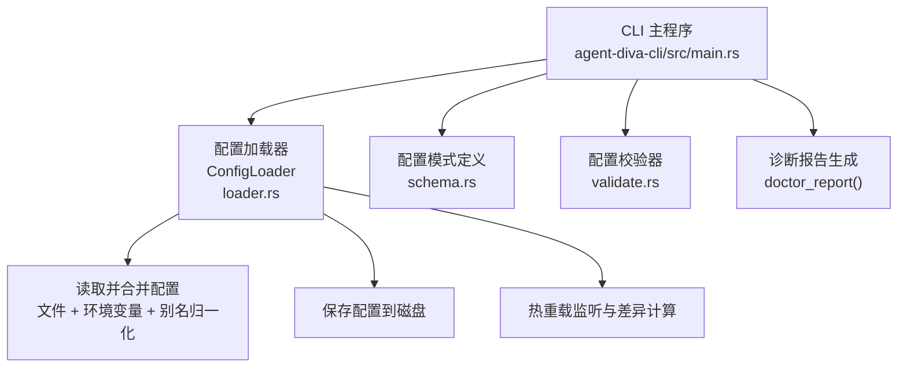
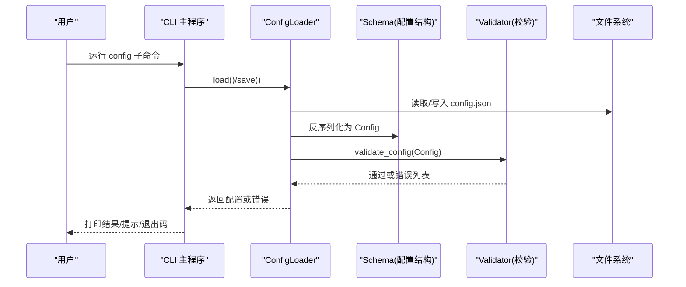
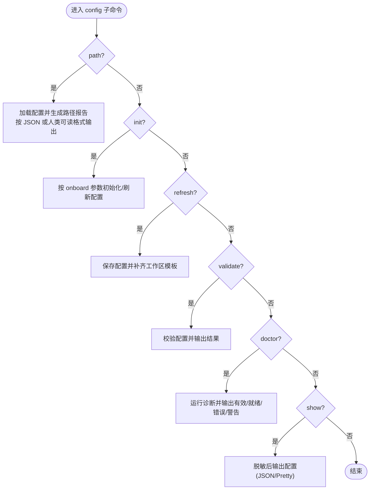
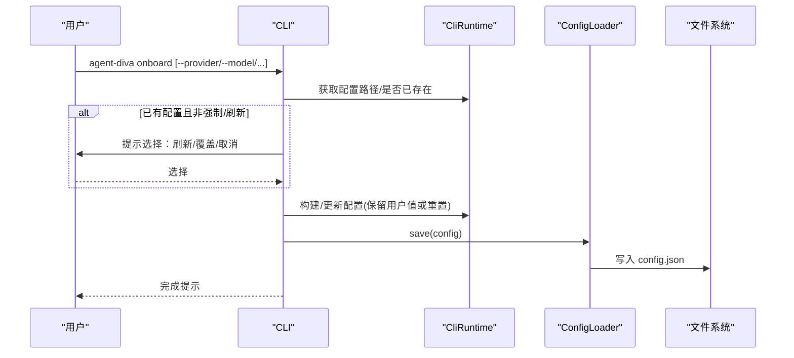
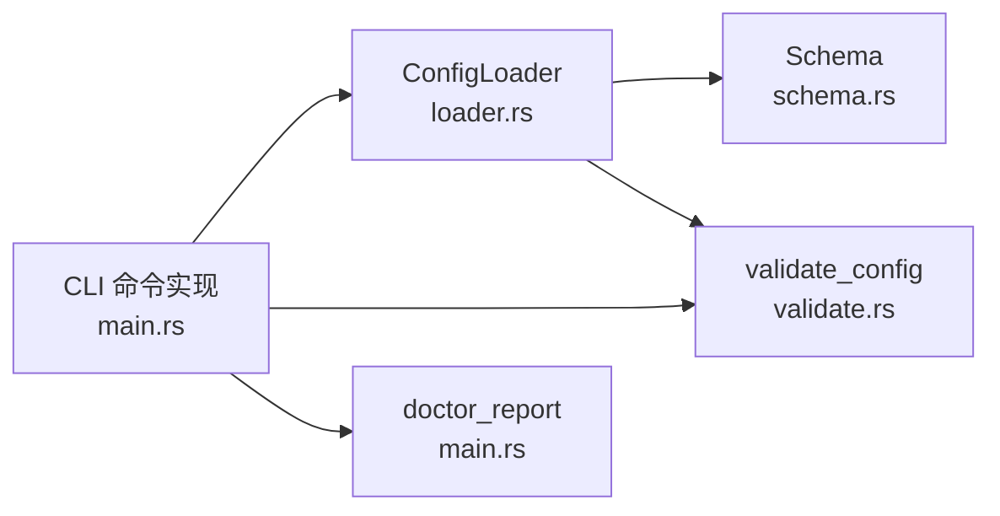

# 配置管理命令

<cite>
**本文引用的文件**
- [agent-diva-cli/src/main.rs](file://agent-diva-cli/src/main.rs)
- [agent-diva-core/src/config/mod.rs](file://agent-diva-core/src/config/mod.rs)
- [agent-diva-core/src/config/schema.rs](file://agent-diva-core/src/config/schema.rs)
- [agent-diva-core/src/config/validate.rs](file://agent-diva-core/src/config/validate.rs)
- [agent-diva-core/src/config/loader.rs](file://agent-diva-core/src/config/loader.rs)
</cite>

## 目录
1. [简介](#简介)
2. [项目结构](#项目结构)
3. [核心组件](#核心组件)
4. [架构总览](#架构总览)
5. [详细组件分析](#详细组件分析)
6. [依赖关系分析](#依赖关系分析)
7. [性能考量](#性能考量)
8. [故障排查指南](#故障排查指南)
9. [结论](#结论)
10. [附录](#附录)

## 简介
本文件面向 Agent Diva 的配置管理子系统，聚焦 CLI 的 config 子命令与 onboard 交互式向导。内容覆盖：
- config 子命令：path、init、refresh、validate、doctor、show 的功能说明与使用方式
- onboard 命令：交互式配置向导流程
- 配置文件结构与字段含义
- 配置验证规则与错误处理
- 配置迁移与升级建议（含热重载与重启要求）

## 项目结构
配置相关代码主要分布在 CLI 入口与 core 配置模块中：
- CLI 层负责命令解析、用户交互、输出格式化以及调用运行时能力
- Core 层提供配置的加载、合并、校验、持久化与热重载机制
- Schema 定义所有配置项的类型、默认值与别名兼容

图表来源
- [agent-diva-cli/src/main.rs:450-479](file://agent-diva-cli/src/main.rs#L450-L479)
- [agent-diva-core/src/config/loader.rs:57-82](file://agent-diva-core/src/config/loader.rs#L57-L82)
- [agent-diva-core/src/config/schema.rs:278-309](file://agent-diva-core/src/config/schema.rs#L278-L309)
- [agent-diva-core/src/config/validate.rs:5-99](file://agent-diva-core/src/config/validate.rs#L5-L99)

章节来源
- [agent-diva-cli/src/main.rs:450-479](file://agent-diva-cli/src/main.rs#L450-L479)
- [agent-diva-core/src/config/mod.rs:1-12](file://agent-diva-core/src/config/mod.rs#L1-L12)

## 核心组件
- 配置加载器 ConfigLoader：从默认或指定路径加载 config.json，合并环境变量与别名，执行校验后返回强类型配置对象；支持保存与热重载
- 配置模式 schema：定义根配置 Config 及其子段（agents、channels、providers、tools、reports、logging、sandbox、mate 等），并提供默认值与别名兼容
- 配置校验 validate：对必填字段、取值范围、枚举值等进行语义校验，聚合错误信息
- CLI 命令：config path/init/refresh/validate/doctor/show 与 onboard 向导

章节来源
- [agent-diva-core/src/config/loader.rs:12-82](file://agent-diva-core/src/config/loader.rs#L12-L82)
- [agent-diva-core/src/config/schema.rs:278-309](file://agent-diva-core/src/config/schema.rs#L278-L309)
- [agent-diva-core/src/config/validate.rs:5-99](file://agent-diva-core/src/config/validate.rs#L5-L99)
- [agent-diva-cli/src/main.rs:421-439](file://agent-diva-cli/src/main.rs#L421-L439)

## 架构总览
下图展示配置管理在 CLI 与 Core 之间的交互流程，包括加载、校验、保存与诊断。

图表来源
- [agent-diva-cli/src/main.rs:450-479](file://agent-diva-cli/src/main.rs#L450-L479)
- [agent-diva-core/src/config/loader.rs:57-82](file://agent-diva-core/src/config/loader.rs#L57-L82)
- [agent-diva-core/src/config/validate.rs:5-99](file://agent-diva-core/src/config/validate.rs#L5-L99)

## 详细组件分析

### config 子命令详解
- path：显示当前解析到的配置文件路径、运行时目录、工作区等路径信息；支持 JSON 输出
- init：以非交互方式基于 onboard 语义初始化配置；可强制覆盖或刷新填充缺失默认值
- refresh：重新保存当前配置并补齐工作区模板文件，不覆盖用户已填写的值
- validate：校验配置的结构与语义规则；JSON 输出包含 valid 与 errors
- doctor：在 validate 基础上进行运行时就绪检查（如 provider 可用性），输出有效性与就绪状态及错误/警告；根据结果设置不同退出码
- show：输出当前生效配置（敏感信息已脱敏），支持 pretty/json 两种格式

图表来源
- [agent-diva-cli/src/main.rs:421-439](file://agent-diva-cli/src/main.rs#L421-L439)
- [agent-diva-cli/src/main.rs:1705-1740](file://agent-diva-cli/src/main.rs#L1705-L1740)
- [agent-diva-cli/src/main.rs:1742-1818](file://agent-diva-cli/src/main.rs#L1742-L1818)

章节来源
- [agent-diva-cli/src/main.rs:421-439](file://agent-diva-cli/src/main.rs#L421-L439)
- [agent-diva-cli/src/main.rs:1705-1740](file://agent-diva-cli/src/main.rs#L1705-L1740)
- [agent-diva-cli/src/main.rs:1742-1818](file://agent-diva-cli/src/main.rs#L1742-L1818)

### onboard 交互式配置向导
onboard 用于首次或增量配置引导，行为如下：
- 若存在现有配置且未指定强制覆盖或刷新，则提供选择：刷新现有配置、覆盖为新配置、取消
- 支持通过参数直接指定 provider、model、api_key、api_base、workspace，减少交互
- 最终将配置保存到默认或指定的配置目录

图表来源
- [agent-diva-cli/src/main.rs:775-818](file://agent-diva-cli/src/main.rs#L775-L818)
- [agent-diva-core/src/config/loader.rs:76-82](file://agent-diva-core/src/config/loader.rs#L76-L82)

章节来源
- [agent-diva-cli/src/main.rs:775-818](file://agent-diva-cli/src/main.rs#L775-L818)

### 配置文件结构与字段说明
根配置 Config 包含以下主要段落（节选关键项）：
- agents.defaults：默认代理设置，包括 workspace、provider、model、max_tokens、temperature、max_tool_iterations、reasoning_effort、thinking_mode
- channels.*：各渠道（Telegram、Discord、WhatsApp、Feishu、DingTalk、Email、Slack、QQ、Matrix、neuro-link、IRC、Mattermost、Nextcloud Talk）开关与凭据
- providers.*：各模型提供商的 API Key/Base URL 等
- tools：工具集配置，包括 MCP 服务器、Web 搜索、预算与超时等
- reports.llm_curation：报告生成的 LLM 编排选项（语言、token 限制、超时、回退策略）
- logging：日志级别、格式、目录、保留天数与模块覆盖
- sandbox：沙箱模式、网络访问、审批策略、受保护路径、命令拒绝模式、超时
- mate：桌面伴侣（原 pet）的 ASR/TTS 提供商与速度、音量等

注意：
- 字段支持别名兼容（如 channels.neuro-link/neuro_link/generic_pipe、tools.mcpServers/mcp_servers、top-level mate/pet）
- 环境变量可通过 AGENT_DIVA__... 路径式覆盖任意配置项，或通过别名键（如 OPENAI_API_KEY）注入

章节来源
- [agent-diva-core/src/config/schema.rs:278-309](file://agent-diva-core/src/config/schema.rs#L278-L309)
- [agent-diva-core/src/config/schema.rs:559-642](file://agent-diva-core/src/config/schema.rs#L559-L642)
- [agent-diva-core/src/config/schema.rs:644-800](file://agent-diva-core/src/config/schema.rs#L644-L800)
- [agent-diva-core/src/config/loader.rs:371-463](file://agent-diva-core/src/config/loader.rs#L371-L463)

### 配置验证规则与错误处理
validate_config 对以下方面进行校验（部分示例）：
- agents.defaults.workspace 不能为空
- agents.defaults.max_tokens > 0
- agents.defaults.temperature ∈ [0.0, 2.0]
- agents.defaults.max_tool_iterations > 0
- agents.defaults.reasoning_effort ∈ {low, medium, high}
- tools.mcp_servers 每个条目必须提供 command 或 url
- tools.web.search.provider ∈ {brave, bocha, zhipu}，并根据 provider 限制 max_results 上限
- mate.asr_provider ∈ {web_speech, siliconflow}
- mate.tts_provider ∈ {browser, openai, siliconflow, minimax}
- mate.tts_speed > 0，tts_volume ∈ [0.0, 2.0]
- reports.llm_curation 的 timeout/max tokens/fallback 等约束

错误处理：
- validate 失败时聚合所有错误并以 Validation 错误返回
- CLI 的 validate 命令会输出 JSON 或人类可读的错误列表，并在无效时以非零退出码退出
- doctor 命令进一步检查运行时就绪性，并按 valid/ready 设置不同的退出码（1=无效，2=未就绪）

章节来源
- [agent-diva-core/src/config/validate.rs:5-99](file://agent-diva-core/src/config/validate.rs#L5-L99)
- [agent-diva-cli/src/main.rs:1742-1818](file://agent-diva-cli/src/main.rs#L1742-L1818)

### 配置迁移与升级
- 别名与键名迁移：
  - channels 下的 neuro-link/neuro_link/generic_pipe 统一为 neuro-link
  - tools 下的 mcpServers/mcp_servers 统一为 mcpServers
  - top-level pet 段迁移为 mate
- 环境变量覆盖优先级：AGENT_DIVA__... 路径式覆盖高于别名键与文件配置
- 热重载与重启：
  - 某些字段变更可在运行时热重载（如 agents.defaults.model/temperature/max_tool_iterations/reasoning_effort、tools.budget/exec.timeout、tools.web.search.enabled、sandbox.mode/approval_policy、logging.level）
  - 其他字段（如 providers/channels/MCP servers/端口/密钥等）需要重启服务才能生效
- 升级建议：
  - 使用 config refresh 补齐新字段与工作区模板，避免破坏用户自定义
  - 使用 config validate 快速发现配置问题
  - 使用 config doctor 检查运行时就绪情况
  - 通过 config show --json 查看当前生效配置（敏感信息已脱敏）

章节来源
- [agent-diva-core/src/config/loader.rs:371-463](file://agent-diva-core/src/config/loader.rs#L371-L463)
- [agent-diva-core/src/config/loader.rs:214-239](file://agent-diva-core/src/config/loader.rs#L214-L239)
- [agent-diva-cli/src/main.rs:1725-1740](file://agent-diva-cli/src/main.rs#L1725-L1740)
- [agent-diva-cli/src/main.rs:1742-1818](file://agent-diva-cli/src/main.rs#L1742-L1818)

## 依赖关系分析
- CLI 依赖 Core 的配置加载、模式与校验能力
- Loader 依赖 Schema 提供的类型与默认值，依赖 Validator 进行语义校验
- CLI 的命令实现通过 CliRuntime 调用 loader.save/load 与 doctor_report 等能力

图表来源
- [agent-diva-cli/src/main.rs:450-479](file://agent-diva-cli/src/main.rs#L450-L479)
- [agent-diva-core/src/config/loader.rs:57-82](file://agent-diva-core/src/config/loader.rs#L57-L82)
- [agent-diva-core/src/config/validate.rs:5-99](file://agent-diva-core/src/config/validate.rs#L5-L99)

章节来源
- [agent-diva-cli/src/main.rs:450-479](file://agent-diva-cli/src/main.rs#L450-L479)
- [agent-diva-core/src/config/loader.rs:57-82](file://agent-diva-core/src/config/loader.rs#L57-L82)

## 性能考量
- 配置加载与合并：默认配置 + 文件 + 环境变量 + 别名归一化，整体开销较小
- 热重载：后台任务每 5 秒轮询一次配置文件 mtime，检测到变化后去抖 500ms 再重新加载，避免频繁重读
- 差异计算：将新旧配置序列化为 JSON 并递归比较，分类为热重载与需重启两类变更，便于上层按需处理
- 建议：批量修改配置时尽量一次性保存，减少多次触发热重载

章节来源
- [agent-diva-core/src/config/loader.rs:94-166](file://agent-diva-core/src/config/loader.rs#L94-L166)
- [agent-diva-core/src/config/loader.rs:241-306](file://agent-diva-core/src/config/loader.rs#L241-L306)

## 故障排查指南
- 配置无效：
  - 使用 config validate 检查具体错误；关注 workspace、max_tokens、temperature、max_tool_iterations、reasoning_effort、MCP 传输、Web 搜索 provider 与 max_results、ASR/TTS 提供商与取值范围
- 运行时未就绪：
  - 使用 config doctor 查看 valid/ready 状态与错误/警告；根据提示补充凭据或调整配置
- 热重载未生效：
  - 确认变更字段是否在热重载白名单内；否则需重启服务
- 环境变量未生效：
  - 检查 AGENT_DIVA__... 路径是否正确；确认大小写与分隔符；确保没有拼写错误
- 别名冲突：
  - 确保只使用一个别名键（如不要同时设置 mcpServers 与 mcp_servers）

章节来源
- [agent-diva-core/src/config/validate.rs:5-99](file://agent-diva-core/src/config/validate.rs#L5-L99)
- [agent-diva-cli/src/main.rs:1742-1818](file://agent-diva-cli/src/main.rs#L1742-L1818)
- [agent-diva-core/src/config/loader.rs:214-239](file://agent-diva-core/src/config/loader.rs#L214-L239)
- [agent-diva-core/src/config/loader.rs:371-463](file://agent-diva-core/src/config/loader.rs#L371-L463)

## 结论
Agent Diva 的配置管理通过 CLI 与 Core 的清晰分层，提供了完善的加载、校验、保存、热重载与诊断能力。config 子命令覆盖了从路径查询、初始化、刷新、校验到诊断与显示的完整生命周期；onboard 向导降低了初始配置门槛。结合环境变量覆盖与别名兼容，既保证了灵活性又兼顾了向后兼容性。建议在日常使用中优先采用 config validate 与 config doctor 保障配置正确性与运行时就绪。

## 附录
- 常用命令速查
  - 显示路径：agent-diva config path [--json]
  - 初始化：agent-diva config init [--provider|--model|--api-key|--api-base|--workspace|--force|--refresh]
  - 刷新：agent-diva config refresh
  - 校验：agent-diva config validate [--json]
  - 诊断：agent-diva config doctor [--json]
  - 显示配置：agent-diva config show [--format json|pretty]
- 环境变量覆盖示例
  - AGENT_DIVA__AGENTS__DEFAULTS__MODEL=openai/gpt-4o
  - AGENT_DIVA__PROVIDERS__OPENAI__API_KEY=sk-xxx
  - AGENT_DIVA__CHANNELS__TELEGRAM__ENABLED=true
- 热重载字段（节选）
  - agents.defaults.model/temperature/max_tool_iterations/reasoning_effort
  - tools.budget/tools.exec.timeout
  - tools.web.search.enabled
  - sandbox.mode/sandbox.approval_policy
  - logging.level

章节来源
- [agent-diva-cli/src/main.rs:421-439](file://agent-diva-cli/src/main.rs#L421-L439)
- [agent-diva-core/src/config/loader.rs:214-239](file://agent-diva-core/src/config/loader.rs#L214-L239)
- [agent-diva-core/src/config/loader.rs:371-463](file://agent-diva-core/src/config/loader.rs#L371-L463)