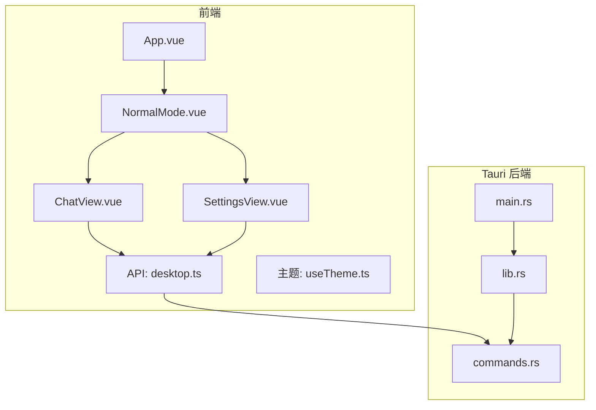
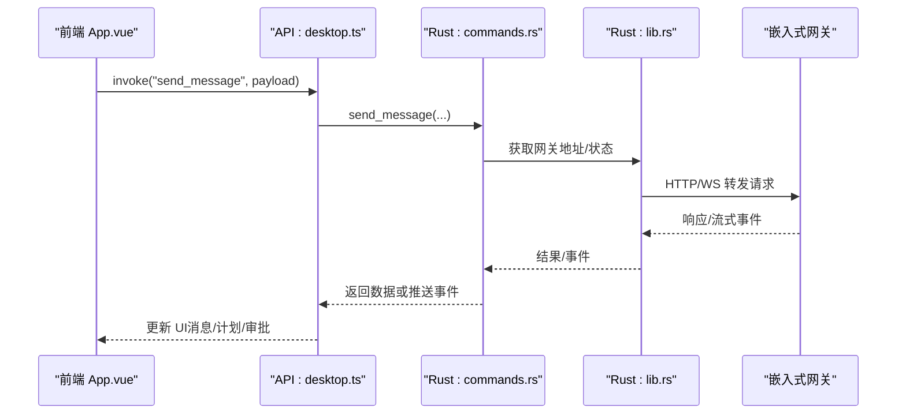
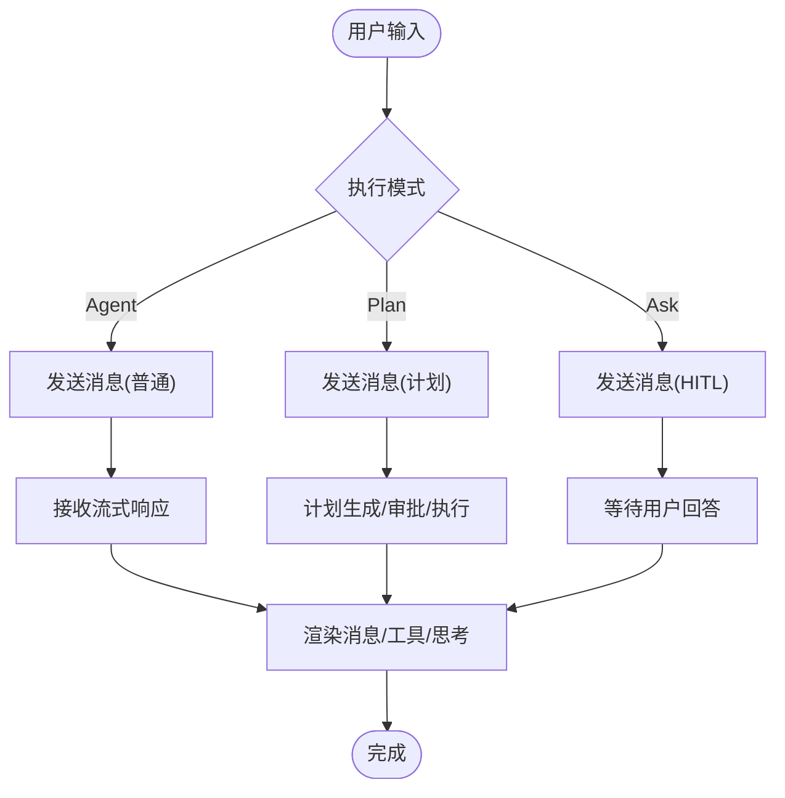
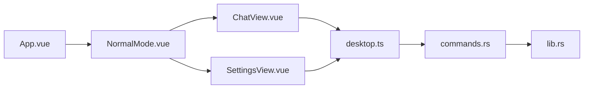

# GUI 桌面应用

<cite>
**本文引用的文件**
- [package.json](file://agent-diva-gui/package.json)
- [tauri.conf.json](file://agent-diva-gui/src-tauri/tauri.conf.json)
- [main.ts](file://agent-diva-gui/src/main.ts)
- [App.vue](file://agent-diva-gui/src/App.vue)
- [NormalMode.vue](file://agent-diva-gui/src/components/NormalMode.vue)
- [ChatView.vue](file://agent-diva-gui/src/components/ChatView.vue)
- [SettingsView.vue](file://agent-diva-gui/src/components/SettingsView.vue)
- [desktop.ts](file://agent-diva-gui/src/api/desktop.ts)
- [useTheme.ts](file://agent-diva-gui/src/composables/useTheme.ts)
- [tailwind.config.js](file://agent-diva-gui/tailwind.config.js)
- [vite.config.ts](file://agent-diva-gui/vite.config.ts)
- [main.rs](file://agent-diva-gui/src-tauri/src/main.rs)
- [lib.rs](file://agent-diva-gui/src-tauri/src/lib.rs)
- [commands.rs](file://agent-diva-gui/src-tauri/src/commands.rs)
</cite>

## 目录
1. [简介](#简介)
2. [项目结构](#项目结构)
3. [核心组件](#核心组件)
4. [架构总览](#架构总览)
5. [详细组件分析](#详细组件分析)
6. [依赖关系分析](#依赖关系分析)
7. [性能考量](#性能考量)
8. [故障排查指南](#故障排查指南)
9. [结论](#结论)
10. [附录](#附录)

## 简介
本项目是一个基于 Vue 3 + Tauri 构建的现代化 GUI 桌面应用，提供聊天界面、提供商管理、渠道配置、技能市场、记忆管理、设置中心等功能。前端通过 Tauri 命令与 Rust 后端通信，后端内嵌网关进程并暴露丰富的能力（会话、计划、审批、MCP、技能、记忆、自动进化等）。应用支持多窗口（主窗口、启动屏、桌面伙伴浮窗）、系统托盘、主题定制与本地化。

## 项目结构
- 前端工程位于 agent-diva-gui：
  - 入口与路由：index.html、desktop-mate.html、embedded-mate.html；Vite 多页构建
  - 应用壳：App.vue、NormalMode.vue、ChatView.vue、SettingsView.vue
  - API 层：src/api/desktop.ts 封装所有 Tauri 调用
  - 主题与样式：composables/useTheme.ts、tailwind.config.js、styles.css
  - 构建配置：vite.config.ts、package.json
- 后端工程位于 src-tauri：
  - 进程入口：main.rs -> lib.rs::run()
  - 命令注册：commands.rs 暴露大量 tauri::command
  - 生命周期与状态：lib.rs 管理嵌入式网关、工作区切换、托盘、关闭流程
  - 配置与打包：tauri.conf.json 定义窗口、资源、打包目标

图表来源
- [main.rs:1-7](file://agent-diva-gui/src-tauri/src/main.rs#L1-L7)
- [lib.rs:264-565](file://agent-diva-gui/src-tauri/src/lib.rs#L264-L565)
- [commands.rs:488-800](file://agent-diva-gui/src-tauri/src/commands.rs#L488-L800)
- [App.vue:1-120](file://agent-diva-gui/src/App.vue#L1-L120)
- [NormalMode.vue:1-120](file://agent-diva-gui/src/components/NormalMode.vue#L1-L120)
- [ChatView.vue:1-120](file://agent-diva-gui/src/components/ChatView.vue#L1-L120)
- [desktop.ts:1-120](file://agent-diva-gui/src/api/desktop.ts#L1-L120)

章节来源
- [package.json:1-54](file://agent-diva-gui/package.json#L1-L54)
- [tauri.conf.json:1-90](file://agent-diva-gui/src-tauri/tauri.conf.json#L1-L90)
- [vite.config.ts:1-51](file://agent-diva-gui/vite.config.ts#L1-L51)

## 核心组件
- 应用壳与导航
  - App.vue：全局状态、事件监听、审批流、会话与工作区上下文、欢迎向导、主题与国际化初始化
  - NormalMode.vue：侧边栏导航、模块路由（聊天、控制台、计划、记忆、技能、MCP、设置等）
- 聊天界面
  - ChatView.vue：消息渲染、工具卡片、计划执行进度、附件上传、权限模式、滚动跟随、Markdown 高亮
- 设置中心
  - SettingsView.vue：子页面路由（通用、网络、语言、主题、自进化、沙箱、审计、工作区、Masks 等）
- 主题与样式
  - useTheme.ts：主题状态、data-theme 注入、localStorage 持久化
  - tailwind.config.js：语义化颜色令牌、字号、圆角、阴影映射到 CSS 变量
- 构建与打包
  - vite.config.ts：多入口（主窗口、桌面伙伴浮窗、嵌入浮窗）
  - package.json：脚本、依赖、包管理器版本

章节来源
- [App.vue:1-120](file://agent-diva-gui/src/App.vue#L1-L120)
- [NormalMode.vue:1-120](file://agent-diva-gui/src/components/NormalMode.vue#L1-L120)
- [ChatView.vue:1-120](file://agent-diva-gui/src/components/ChatView.vue#L1-L120)
- [SettingsView.vue:1-200](file://agent-diva-gui/src/components/SettingsView.vue#L1-L200)
- [useTheme.ts:1-46](file://agent-diva-gui/src/composables/useTheme.ts#L1-L46)
- [tailwind.config.js:1-82](file://agent-diva-gui/tailwind.config.js#L1-L82)
- [vite.config.ts:1-51](file://agent-diva-gui/vite.config.ts#L1-L51)
- [package.json:1-54](file://agent-diva-gui/package.json#L1-L54)

## 架构总览
- 前后端通信机制
  - 前端通过 @tauri-apps/api/core.invoke 调用后端命令
  - 后端在 lib.rs 中集中注册命令，并在 commands.rs 实现具体逻辑
- 进程管理与系统集成
  - 主进程 main.rs 调用 lib.rs::run()
  - lib.rs 负责：日志初始化、插件加载、状态管理、嵌入式网关启动/停止、托盘初始化、窗口事件处理、退出流程
  - tauri.conf.json 定义多窗口（main、splashscreen、desktop-mate），以及打包目标与资源
- 工作区与网关
  - 根据环境变量决定是否由 GUI 管理网关生命周期
  - 工作区切换时校验阻塞条件（流式输出、计划执行、审批、HITL 问题）
  - 启动后保存端口并更新托盘状态

图表来源
- [App.vue:1-120](file://agent-diva-gui/src/App.vue#L1-L120)
- [desktop.ts:232-320](file://agent-diva-gui/src/api/desktop.ts#L232-L320)
- [commands.rs:488-800](file://agent-diva-gui/src-tauri/src/commands.rs#L488-L800)
- [lib.rs:264-565](file://agent-diva-gui/src-tauri/src/lib.rs#L264-L565)

章节来源
- [lib.rs:264-565](file://agent-diva-gui/src-tauri/src/lib.rs#L264-L565)
- [tauri.conf.json:1-90](file://agent-diva-gui/src-tauri/tauri.conf.json#L1-L90)

## 详细组件分析

### 聊天界面（ChatView）
- 功能要点
  - 消息渲染：支持 Markdown、代码高亮、工具卡片、思考块、原始元数据
  - 输入与发送：支持附件粘贴上传、多行输入、模式选择（agent/plan/ask）、权限模式（谨慎/智能/信任）
  - 计划执行：展示活动 TODO、进度文本、批准/撤销交互
  - 滚动行为：跟随最新消息、近底判定、切换会话重置
  - 上下文预算：计算历史占用百分比与环形指示器
- 关键交互
  - 发送消息触发后端命令，接收流式事件更新 UI
  - 附件上传通过 uploadFile 接口，成功后加入 attachments
  - 计划相关操作通过 approveActivePlanExecution、returnActivePlanToDraft 等

图表来源
- [ChatView.vue:215-460](file://agent-diva-gui/src/components/ChatView.vue#L215-L460)
- [desktop.ts:279-320](file://agent-diva-gui/src/api/desktop.ts#L279-L320)

章节来源
- [ChatView.vue:1-800](file://agent-diva-gui/src/components/ChatView.vue#L1-L800)
- [desktop.ts:232-320](file://agent-diva-gui/src/api/desktop.ts#L232-L320)

### 提供商管理（Providers）
- 能力概览
  - 列出内置与自定义提供商、模型目录、测试连通性
  - 创建/删除自定义提供商、添加/移除模型
- 后端命令
  - get_providers、create_custom_provider、delete_custom_provider、add_provider_model、remove_provider_model、test_provider_model
- 前端集成
  - 通过 desktop.ts 暴露的函数调用命令，设置中心 ProvidersSettings 进行配置

章节来源
- [commands.rs:490-572](file://agent-diva-gui/src-tauri/src/commands.rs#L490-L572)
- [desktop.ts:147-187](file://agent-diva-gui/src/api/desktop.ts#L147-L187)

### 渠道配置（Channels）
- 能力概览
  - 查看渠道就绪状态、缺失字段提示、启用/禁用
- 前端集成
  - SettingsView 中的 ChannelsSettings 子页面，结合 desktop.ts 的状态报告接口

章节来源
- [desktop.ts:162-187](file://agent-diva-gui/src/api/desktop.ts#L162-L187)
- [SettingsView.vue:1-200](file://agent-diva-gui/src/components/SettingsView.vue#L1-L200)

### 技能市场（Skills Marketplace）
- 能力概览
  - 列举技能、获取详情、更新/禁用/删除、历史版本、上传技能、搜索市场技能、安装特色技能
- 后端命令
  - get_skills、get_skill、update_skill、disable_skill、list_skill_history、upload_skill、search_marketplace_skills、install_marketplace_skills、featured_marketplace_skills
- 前端集成
  - SkillsSettings 子页面与 desktop.ts 的 SkillDto/SkillDocument 类型

章节来源
- [commands.rs:376-430](file://agent-diva-gui/src-tauri/src/commands.rs#L376-L430)
- [desktop.ts:11-84](file://agent-diva-gui/src/api/desktop.ts#L11-L84)

### 记忆管理（Memory）
- 能力概览
  - 记录 CRUD、Actmem 文档读写、胶囊列表/读取/删除、记忆规则读写、回忆反馈列表
- 后端命令
  - memory_list_records、memory_create_record、memory_get_record、memory_update_record、memory_delete_record、memory_get_actmem、memory_put_actmem、memory_list_capsules、memory_get_capsule、memory_delete_capsule、memory_get_memrules、memory_put_memrules、list_recall_feedback
- 前端集成
  - MemoryView 子页面与 desktop.ts 的记忆类型定义

章节来源
- [commands.rs:465-477](file://agent-diva-gui/src-tauri/src/commands.rs#L465-L477)
- [desktop.ts:588-670](file://agent-diva-gui/src/api/desktop.ts#L588-L670)

### 设置中心（Settings）
- 子页面
  - 仪表盘、通用、MCP、技能、提供商、渠道、网络、语言、桌面伙伴、关于、主题、自进化、沙箱、压缩、审计、工作区、Masks
- 功能要点
  - 统一标题与导航、返回按钮、Mask 编辑器集成
  - 通过 props 传入配置、工具配置、工作区状态等

章节来源
- [SettingsView.vue:1-200](file://agent-diva-gui/src/components/SettingsView.vue#L1-L200)

### 主题定制与界面配置
- 主题系统
  - useTheme.ts 维护当前主题 ID，写入 data-theme，持久化到 localStorage
  - Tailwind 配置将语义色、字号、圆角、阴影映射到 CSS 变量，便于主题切换
- 界面配置
  - 聊天显示偏好（清理模式、自动展开推理/工具细节、默认显示原始元数据）
  - 权限模式（谨慎/智能/信任）持久化到 localStorage
  - 工作区选择与切换（含阻塞检查）

章节来源
- [useTheme.ts:1-46](file://agent-diva-gui/src/composables/useTheme.ts#L1-L46)
- [tailwind.config.js:1-82](file://agent-diva-gui/tailwind.config.js#L1-L82)
- [ChatView.vue:255-264](file://agent-diva-gui/src/components/ChatView.vue#L255-L264)
- [commands.rs:199-221](file://agent-diva-gui/src-tauri/src/commands.rs#L199-L221)

### 开发环境搭建与生产构建
- 开发
  - 使用 pnpm dev 启动 Vite 服务（固定端口 1420）
  - Tauri 开发模式通过 beforeDevCommand 与 devUrl 联动
- 构建
  - 多入口构建：main、desktop-mate、embedded-mate
  - 打包目标：nsis、msi、app、dmg、deb、appimage
  - 资源与图标配置在 tauri.conf.json

章节来源
- [package.json:7-15](file://agent-diva-gui/package.json#L7-L15)
- [vite.config.ts:18-51](file://agent-diva-gui/vite.config.ts#L18-L51)
- [tauri.conf.json:5-90](file://agent-diva-gui/src-tauri/tauri.conf.json#L5-L90)

### 桌面集成功能（系统托盘、通知等）
- 系统托盘
  - 初始化托盘、更新状态、关闭窗口时根据配置隐藏到托盘或完全退出
- 窗口管理
  - 多窗口：主窗口、启动屏、桌面伙伴浮窗（透明、置顶、跳过任务栏）
- 通知与日志
  - 追加 GUI 日志、获取网关日志行、GUI 日志行

章节来源
- [lib.rs:322-368](file://agent-diva-gui/src-tauri/src/lib.rs#L322-L368)
- [tauri.conf.json:11-56](file://agent-diva-gui/src-tauri/tauri.conf.json#L11-L56)
- [desktop.ts:301-318](file://agent-diva-gui/src/api/desktop.ts#L301-L318)

## 依赖关系分析
- 前端依赖
  - Vue 3、TailwindCSS、i18n、CodeMirror、Three.js/VRM、Tauri 客户端 API
- 后端依赖
  - Tauri、Tokio、reqwest、eventsource_stream、native_tls、tracing 等
- 模块耦合
  - App.vue 聚合多个子视图与全局状态
  - NormalMode.vue 作为导航容器，协调各功能模块
  - ChatView.vue 聚焦聊天交互，依赖 API 层与后端命令
  - SettingsView.vue 组织设置子页面，复用工作区与配置状态

图表来源
- [App.vue:1-120](file://agent-diva-gui/src/App.vue#L1-L120)
- [NormalMode.vue:1-120](file://agent-diva-gui/src/components/NormalMode.vue#L1-L120)
- [ChatView.vue:1-120](file://agent-diva-gui/src/components/ChatView.vue#L1-L120)
- [SettingsView.vue:1-200](file://agent-diva-gui/src/components/SettingsView.vue#L1-L200)
- [desktop.ts:1-120](file://agent-diva-gui/src/api/desktop.ts#L1-L120)
- [commands.rs:488-800](file://agent-diva-gui/src-tauri/src/commands.rs#L488-L800)
- [lib.rs:264-565](file://agent-diva-gui/src-tauri/src/lib.rs#L264-L565)

章节来源
- [package.json:16-51](file://agent-diva-gui/package.json#L16-L51)
- [commands.rs:1-46](file://agent-diva-gui/src-tauri/src/commands.rs#L1-L46)

## 性能考量
- 流式渲染与滚动优化
  - ChatView 使用 nextTick 与滚动阈值判断，避免频繁重排
  - 清理模式下折叠非交互过程消息，减少渲染压力
- 上下文预算可视化
  - 计算历史占用百分比，帮助控制上下文大小
- 附件上传与缓存
  - 图片粘贴批量上传，避免阻塞主线程
- 后端并发
  - 使用 Tokio 异步运行时处理网关通信与事件流

[本节为通用指导，不直接分析具体文件]

## 故障排查指南
- 常见问题定位
  - 连接状态：App.vue 中 connectionStatus 反映后端可用性
  - 审批失败：unifiedActionErrors 与 approvalCenterError 提供错误信息
  - 工作区切换阻塞：validate_workspace_switch_guard 返回中文原因
- 日志与诊断
  - 追加 GUI 日志、获取网关日志行、GUI 日志行
  - 健康检查 check_health 快速验证后端可用
- 调试建议
  - 启用开发者工具（tauri.conf.json 中 devtools）
  - 使用 Tauri 事件监听（如 set_splash_complete）确认前后端就绪

章节来源
- [App.vue:267-353](file://agent-diva-gui/src/App.vue#L267-L353)
- [commands.rs:199-221](file://agent-diva-gui/src-tauri/src/commands.rs#L199-L221)
- [desktop.ts:319-319](file://agent-diva-gui/src/api/desktop.ts#L319-L319)
- [lib.rs:237-261](file://agent-diva-gui/src-tauri/src/lib.rs#L237-L261)

## 结论
该 GUI 桌面应用以 Vue 3 + Tauri 为核心，提供了完整的聊天、提供商管理、渠道配置、技能市场、记忆管理、设置中心等能力。前后端通过 Tauri 命令高效通信，后端内嵌网关并提供丰富的业务接口。应用具备多窗口、系统托盘、主题定制与本地化等桌面特性，适合复杂 AI 助手场景的本地化部署与使用。

[本节为总结，不直接分析具体文件]

## 附录
- 快速开始
  - 安装依赖：pnpm install
  - 开发运行：pnpm tauri dev（自动启动 Vite 与 Tauri）
  - 构建发布：pnpm tauri build（按 tauri.conf.json 目标打包）
- 参考路径
  - 前端入口：index.html、desktop-mate.html、embedded-mate.html
  - 后端入口：src-tauri/src/main.rs -> lib.rs::run()
  - 命令注册：src-tauri/src/commands.rs

章节来源
- [package.json:7-15](file://agent-diva-gui/package.json#L7-L15)
- [tauri.conf.json:5-90](file://agent-diva-gui/src-tauri/tauri.conf.json#L5-L90)
- [main.rs:1-7](file://agent-diva-gui/src-tauri/src/main.rs#L1-L7)
- [lib.rs:264-565](file://agent-diva-gui/src-tauri/src/lib.rs#L264-L565)