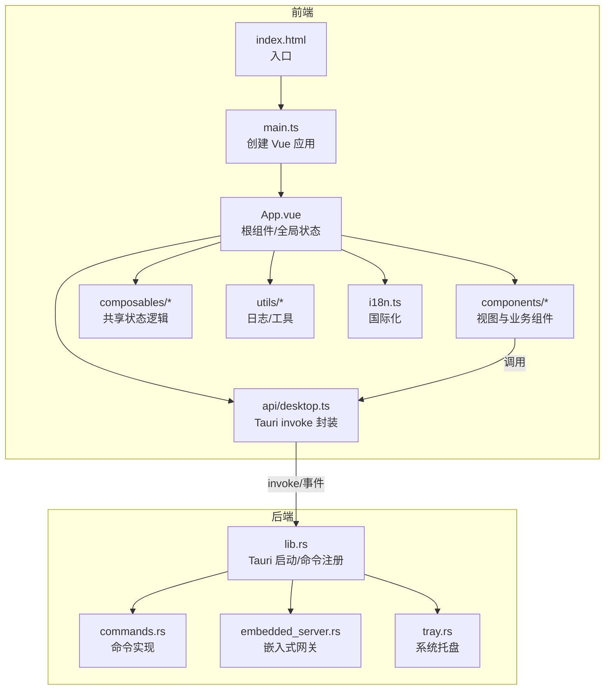
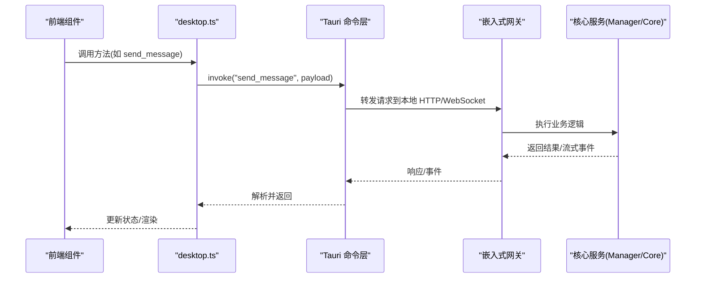
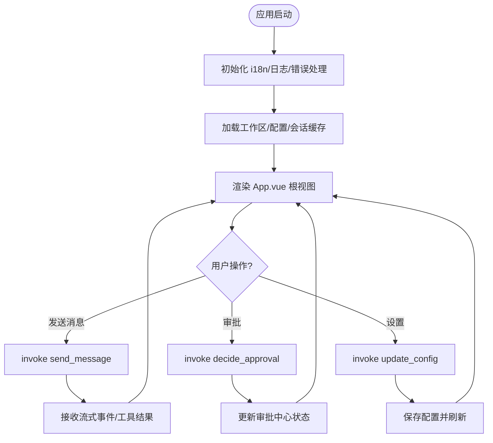
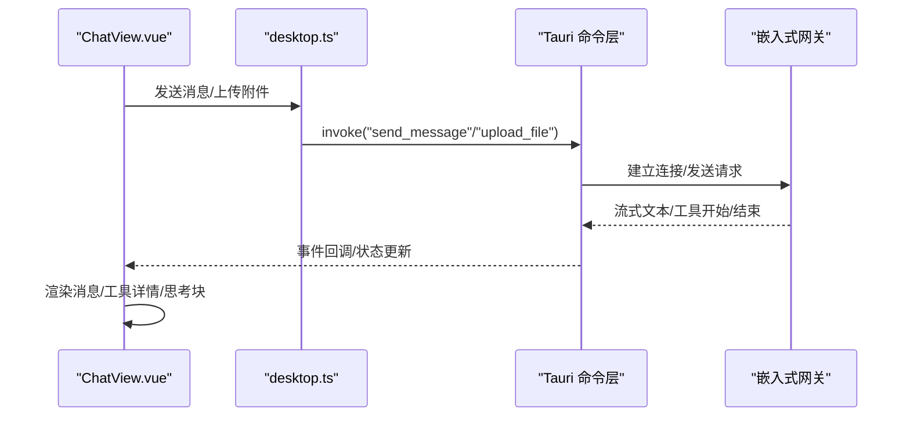
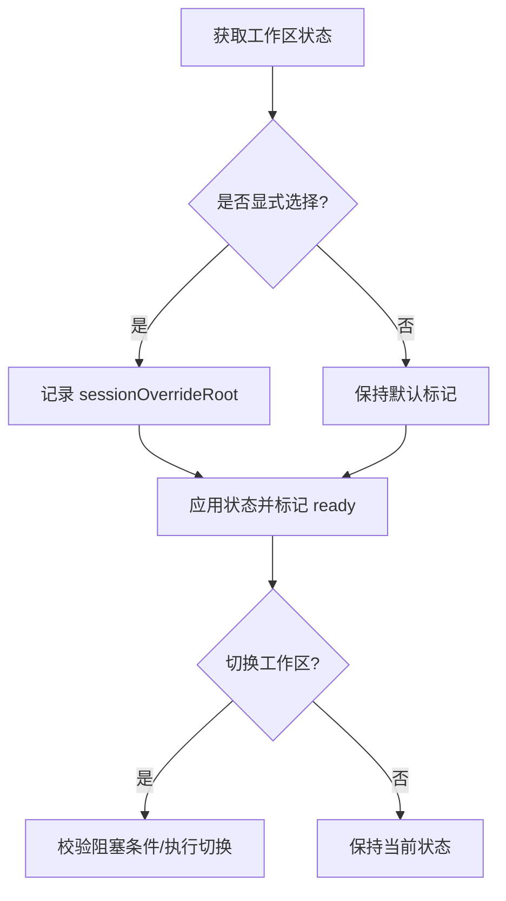
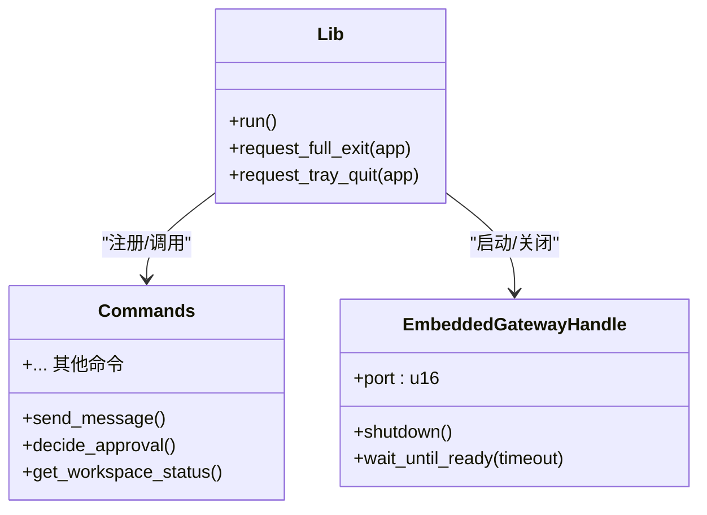
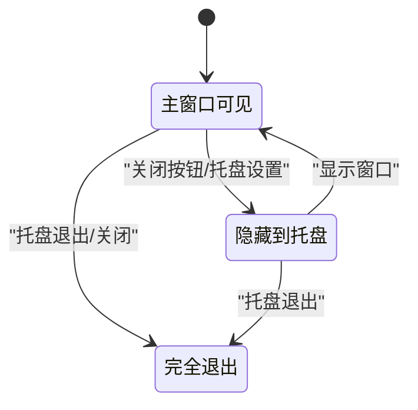
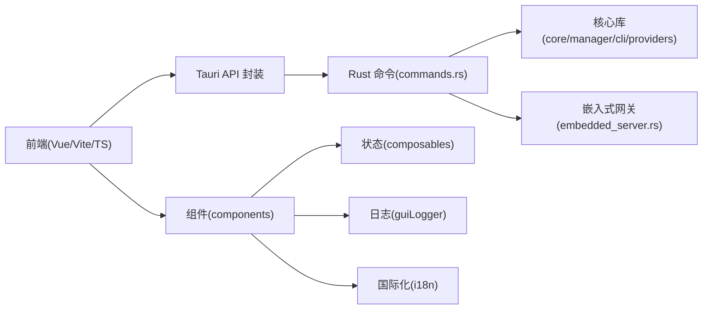

# 应用架构设计

<cite>
**本文引用的文件**
- [package.json](file://agent-diva-gui/package.json)
- [tauri.conf.json](file://agent-diva-gui/src-tauri/tauri.conf.json)
- [main.ts](file://agent-diva-gui/src/main.ts)
- [App.vue](file://agent-diva-gui/src/App.vue)
- [NormalMode.vue](file://agent-diva-gui/src/components/NormalMode.vue)
- [ChatView.vue](file://agent-diva-gui/src/components/ChatView.vue)
- [useWorkspaceContext.ts](file://agent-diva-gui/src/composables/useWorkspaceContext.ts)
- [desktop.ts](file://agent-diva-gui/src/api/desktop.ts)
- [vite.config.ts](file://agent-diva-gui/vite.config.ts)
- [guiLogger.ts](file://agent-diva-gui/src/utils/guiLogger.ts)
- [i18n.ts](file://agent-diva-gui/src/i18n.ts)
- [lib.rs](file://agent-diva-gui/src-tauri/src/lib.rs)
- [commands.rs](file://agent-diva-gui/src-tauri/src/commands.rs)
- [embedded_server.rs](file://agent-diva-gui/src-tauri/src/embedded_server.rs)
</cite>

## 目录
1. [简介](#简介)
2. [项目结构](#项目结构)
3. [核心组件](#核心组件)
4. [架构总览](#架构总览)
5. [详细组件分析](#详细组件分析)
6. [依赖关系分析](#依赖关系分析)
7. [性能考量](#性能考量)
8. [故障排查指南](#故障排查指南)
9. [结论](#结论)
10. [附录](#附录)

## 简介
本文件面向基于 Vue 3 + Tauri 的现代化桌面应用 Agent Diva，系统性阐述前后端分离的架构设计、进程管理、系统集成与安全模型，以及状态管理、路由与组件层次。文档同时覆盖构建配置、依赖管理与开发工作流，并提供架构图与关键设计决策说明，帮助读者快速理解并高效扩展该应用。

## 项目结构
Agent Diva GUI 采用“前端 Vue 单页应用 + 后端 Rust Tauri”的分层结构：
- 前端（agent-diva-gui/src）：Vue 3 + TypeScript + Vite，包含页面组件、API 封装、国际化、日志工具等。
- 后端（agent-diva-gui/src-tauri/src）：Rust 实现 Tauri 命令、嵌入式网关生命周期、系统托盘、窗口管理等。
- 构建与打包：Vite 负责前端构建，Tauri 负责将前端资源与 Rust 二进制打包为多平台安装包。

**图表来源**
- [main.ts:1-13](file://agent-diva-gui/src/main.ts#L1-L13)
- [App.vue:1-800](file://agent-diva-gui/src/App.vue#L1-L800)
- [desktop.ts:1-800](file://agent-diva-gui/src/api/desktop.ts#L1-L800)
- [lib.rs:264-565](file://agent-diva-gui/src-tauri/src/lib.rs#L264-L565)
- [commands.rs:1-200](file://agent-diva-gui/src-tauri/src/commands.rs#L1-L200)
- [embedded_server.rs:72-154](file://agent-diva-gui/src-tauri/src/embedded_server.rs#L72-L154)

**章节来源**
- [package.json:1-54](file://agent-diva-gui/package.json#L1-L54)
- [tauri.conf.json:1-90](file://agent-diva-gui/src-tauri/tauri.conf.json#L1-L90)
- [vite.config.ts:1-51](file://agent-diva-gui/vite.config.ts#L1-L51)

## 核心组件
- 前端入口与初始化
  - main.ts 创建 Vue 应用、安装 i18n、挂载错误处理器与 GUI 日志。
  - App.vue 作为根组件，集中管理会话、计划审批、工作区上下文、消息流、设置与通知等全局状态。
- 视图与交互
  - NormalMode.vue 提供主界面布局与导航，承载聊天、设置、控制台、笔记本、进化、记忆等子视图。
  - ChatView.vue 处理消息渲染、工具调用、计划执行卡片、HITL 问答、压缩状态等。
- API 层
  - desktop.ts 统一封装所有 Tauri 命令调用，定义 DTO 类型，屏蔽底层 invoke 细节。
- 状态与上下文
  - useWorkspaceContext.ts 提供工作区状态的读取、刷新与应用，支持显式选择与工作区切换保护。
- 日志与国际化
  - guiLogger.ts 捕获 console 输出并批量写入后端，自动脱敏敏感字段。
  - i18n.ts 维护中英文语言包与运行时语言切换。

**章节来源**
- [main.ts:1-13](file://agent-diva-gui/src/main.ts#L1-L13)
- [App.vue:1-800](file://agent-diva-gui/src/App.vue#L1-L800)
- [NormalMode.vue:1-200](file://agent-diva-gui/src/components/NormalMode.vue#L1-L200)
- [ChatView.vue:1-200](file://agent-diva-gui/src/components/ChatView.vue#L1-L200)
- [desktop.ts:1-800](file://agent-diva-gui/src/api/desktop.ts#L1-L800)
- [useWorkspaceContext.ts:1-94](file://agent-diva-gui/src/composables/useWorkspaceContext.ts#L1-L94)
- [guiLogger.ts:1-49](file://agent-diva-gui/src/utils/guiLogger.ts#L1-L49)
- [i18n.ts:1-359](file://agent-diva-gui/src/i18n.ts#L1-L359)

## 架构总览
Agent Diva 采用“前后端分离 + 嵌入式网关”的架构：
- 前端通过 Tauri 的 invoke 机制调用 Rust 命令，完成会话管理、计划审批、MCP、技能、记忆、Persona、AutoDream、Token 统计等功能。
- 后端在 lib.rs 中注册大量命令，并在启动时可选择内嵌 Gateway（embedded_server.rs），或运行外部 Gateway。
- 多窗口支持：主窗口、启动闪屏、桌面伴侣（透明无边框置顶窗口）。
- 安全模型：通过 Tauri 能力白名单、CSP 策略、最小权限原则控制前端可访问的系统能力。

**图表来源**
- [desktop.ts:232-319](file://agent-diva-gui/src/api/desktop.ts#L232-L319)
- [lib.rs:369-549](file://agent-diva-gui/src-tauri/src/lib.rs#L369-L549)
- [embedded_server.rs:72-154](file://agent-diva-gui/src-tauri/src/embedded_server.rs#L72-L154)

**章节来源**
- [lib.rs:264-565](file://agent-diva-gui/src-tauri/src/lib.rs#L264-L565)
- [tauri.conf.json:11-56](file://agent-diva-gui/src-tauri/tauri.conf.json#L11-L56)

## 详细组件分析

### 前端应用启动与根组件
- main.ts 负责创建 Vue 实例、安装 i18n、挂载全局错误处理器与 GUI 日志。
- App.vue 集中管理：
  - 会话与消息列表、流式输出、工具调用状态、计划执行与审批、HITL 问答、工作区上下文、Provider 配置、技能与 MCP、记忆与 Persona、AutoDream、Token 统计等。
  - 通过 invoke 调用后端命令，使用事件监听处理审批事件、流式文本、重试、压缩等。
  - 提供欢迎向导、模式切换、设置面板、控制台、笔记本、进化、记忆等视图集成。

**图表来源**
- [main.ts:1-13](file://agent-diva-gui/src/main.ts#L1-L13)
- [App.vue:1-800](file://agent-diva-gui/src/App.vue#L1-L800)
- [desktop.ts:232-319](file://agent-diva-gui/src/api/desktop.ts#L232-L319)

**章节来源**
- [main.ts:1-13](file://agent-diva-gui/src/main.ts#L1-L13)
- [App.vue:1-800](file://agent-diva-gui/src/App.vue#L1-L800)

### 聊天视图与消息流
- ChatView.vue 负责消息渲染、工具调用展示、思考块展开、计划执行卡片、HITL 问答、压缩状态、上传附件等。
- 通过 MarkdownIt 渲染内容，highlight.js 高亮代码；对工具结果进行预览与引用解析。
- 与后端通过 invoke 和事件通道协作，实现流式输出、重试、停滞检测、上下文压缩等。

**图表来源**
- [ChatView.vue:1-200](file://agent-diva-gui/src/components/ChatView.vue#L1-L200)
- [desktop.ts:232-319](file://agent-diva-gui/src/api/desktop.ts#L232-L319)
- [lib.rs:369-549](file://agent-diva-gui/src-tauri/src/lib.rs#L369-L549)

**章节来源**
- [ChatView.vue:1-200](file://agent-diva-gui/src/components/ChatView.vue#L1-L200)
- [desktop.ts:1-800](file://agent-diva-gui/src/api/desktop.ts#L1-L800)

### 工作区上下文与切换保护
- useWorkspaceContext.ts 提供工作区状态读取、刷新与应用，支持显式选择的工作区覆盖默认标记，避免后续刷新被覆盖。
- 规范化路径与大小写，确保跨平台一致性；在刷新过程中防止竞态条件。

**图表来源**
- [useWorkspaceContext.ts:1-94](file://agent-diva-gui/src/composables/useWorkspaceContext.ts#L1-L94)

**章节来源**
- [useWorkspaceContext.ts:1-94](file://agent-diva-gui/src/composables/useWorkspaceContext.ts#L1-L94)

### 后端命令与嵌入式网关
- lib.rs 注册大量 Tauri 命令，涵盖会话、计划、审批、MCP、技能、记忆、Persona、AutoDream、Token、服务管理等。
- embedded_server.rs 在独立线程启动嵌入式网关，绑定随机端口，提供优雅关闭与启动就绪信号。
- 支持外部 Gateway 模式（环境变量控制），便于部署与运维。

**图表来源**
- [lib.rs:264-565](file://agent-diva-gui/src-tauri/src/lib.rs#L264-L565)
- [commands.rs:1-200](file://agent-diva-gui/src-tauri/src/commands.rs#L1-L200)
- [embedded_server.rs:12-154](file://agent-diva-gui/src-tauri/src/embedded_server.rs#L12-L154)

**章节来源**
- [lib.rs:264-565](file://agent-diva-gui/src-tauri/src/lib.rs#L264-L565)
- [commands.rs:1-200](file://agent-diva-gui/src-tauri/src/commands.rs#L1-L200)
- [embedded_server.rs:72-154](file://agent-diva-gui/src-tauri/src/embedded_server.rs#L72-L154)

### 多窗口与系统托盘
- tauri.conf.json 定义主窗口、启动闪屏、桌面伴侣三个窗口，支持透明、置顶、无边框等特性。
- lib.rs 处理窗口关闭事件，根据托盘设置决定隐藏或退出；托盘用于后台驻留与退出。

**图表来源**
- [tauri.conf.json:11-56](file://agent-diva-gui/src-tauri/tauri.conf.json#L11-L56)
- [lib.rs:331-368](file://agent-diva-gui/src-tauri/src/lib.rs#L331-L368)

**章节来源**
- [tauri.conf.json:11-56](file://agent-diva-gui/src-tauri/tauri.conf.json#L11-L56)
- [lib.rs:331-368](file://agent-diva-gui/src-tauri/src/lib.rs#L331-L368)

## 依赖关系分析
- 前端依赖
  - Vue 3、TypeScript、Vite、TailwindCSS、i18n、CodeMirror、Three.js/VRM、Tauri API。
  - 本地模块别名指向 avatar-runtime-vrm 与 shared-avatar-protocol。
- 后端依赖
  - Tauri、Tokio、Tracing、Serde、Eventsource、WebSocket、Native TLS。
  - 内部模块：agent_diva_core、agent_diva_manager、agent_diva_cli、agent_diva_providers 等。

**图表来源**
- [package.json:16-51](file://agent-diva-gui/package.json#L16-L51)
- [vite.config.ts:11-16](file://agent-diva-gui/vite.config.ts#L11-L16)
- [commands.rs:1-45](file://agent-diva-gui/src-tauri/src/commands.rs#L1-L45)
- [embedded_server.rs:1-10](file://agent-diva-gui/src-tauri/src/embedded_server.rs#L1-L10)

**章节来源**
- [package.json:16-51](file://agent-diva-gui/package.json#L16-L51)
- [vite.config.ts:11-16](file://agent-diva-gui/vite.config.ts#L11-L16)
- [commands.rs:1-45](file://agent-diva-gui/src-tauri/src/commands.rs#L1-L45)

## 性能考量
- 流式渲染与增量更新：ChatView.vue 对工具结果、思考块、消息流进行增量渲染，减少重绘开销。
- 日志批处理：guiLogger.ts 使用队列与节流，批量写入后端，避免频繁 IO。
- 工作区切换保护：useWorkspaceContext.ts 防止并发刷新导致的竞态，提升稳定性。
- 嵌入式网关异步：embedded_server.rs 使用 Tokio 运行时与 watch channel，保证优雅关闭与低延迟。

[本节为通用性能建议，不直接分析具体文件]

## 故障排查指南
- 前端未捕获异常
  - main.ts 设置全局错误处理器，记录错误信息与上下文。
- 日志缺失或敏感信息泄露
  - guiLogger.ts 自动脱敏敏感键名，限制长度与队列大小，批量写入后端。
- 工作区切换失败
  - useWorkspaceContext.ts 提供错误状态与原因，检查路径合法性与权限。
- 后端命令调用失败
  - desktop.ts 封装 invoke，结合 App.vue 的错误提示与重试逻辑，定位命令参数与后端响应。

**章节来源**
- [main.ts:7-12](file://agent-diva-gui/src/main.ts#L7-L12)
- [guiLogger.ts:1-49](file://agent-diva-gui/src/utils/guiLogger.ts#L1-L49)
- [useWorkspaceContext.ts:44-83](file://agent-diva-gui/src/composables/useWorkspaceContext.ts#L44-L83)
- [desktop.ts:232-319](file://agent-diva-gui/src/api/desktop.ts#L232-L319)

## 结论
Agent Diva 通过 Vue 3 + Tauri 实现了前后端分离的现代化桌面应用架构。前端以组件化与组合式函数组织状态与交互，后端以 Rust 命令与嵌入式网关提供服务与系统集成。多窗口、托盘、安全模型与构建配置共同支撑了稳定的用户体验与可扩展的业务能力。建议在后续迭代中持续优化流式渲染、日志批处理与工作区切换保护，以提升性能与健壮性。

[本节为总结性内容，不直接分析具体文件]

## 附录
- 构建与开发工作流
  - 使用 Vite 进行前端开发与构建，固定端口 1420，忽略 src-tauri 变更监听。
  - Tauri 配置 beforeDevCommand 与 devUrl，支持热重载与调试。
  - 多页面构建支持主窗口、桌面伴侣与嵌入伴侣页面。
- 依赖管理
  - package.json 管理前端依赖与脚本，pnpm 作为包管理器。
  - Rust 侧通过 Cargo 管理 crate 依赖，Tauri 插件按需启用。

**章节来源**
- [vite.config.ts:18-49](file://agent-diva-gui/vite.config.ts#L18-L49)
- [tauri.conf.json:5-10](file://agent-diva-gui/src-tauri/tauri.conf.json#L5-L10)
- [package.json:7-15](file://agent-diva-gui/package.json#L7-L15)