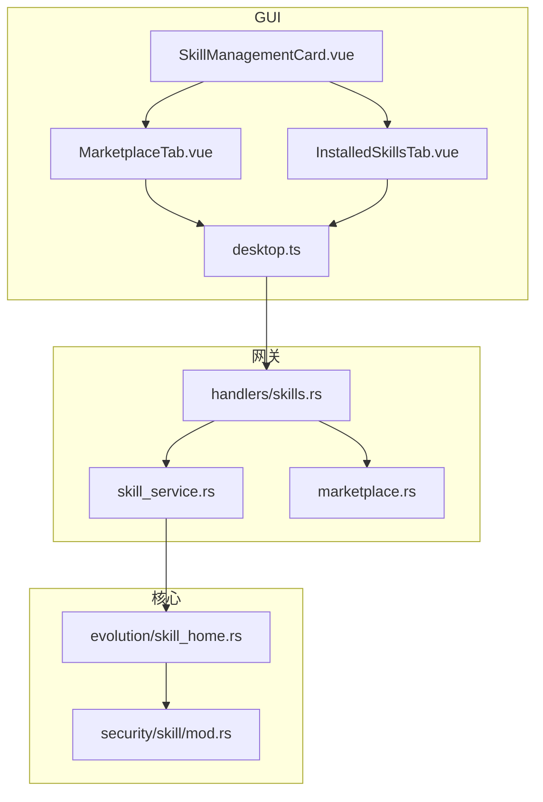
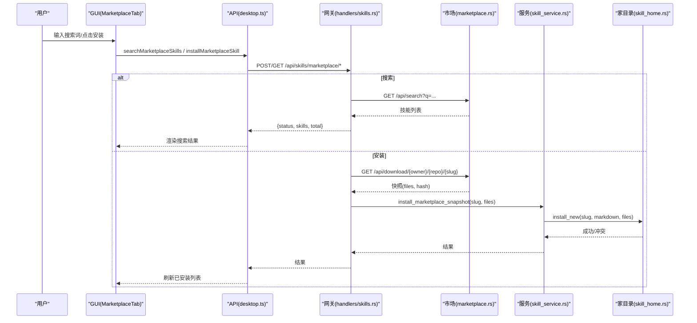
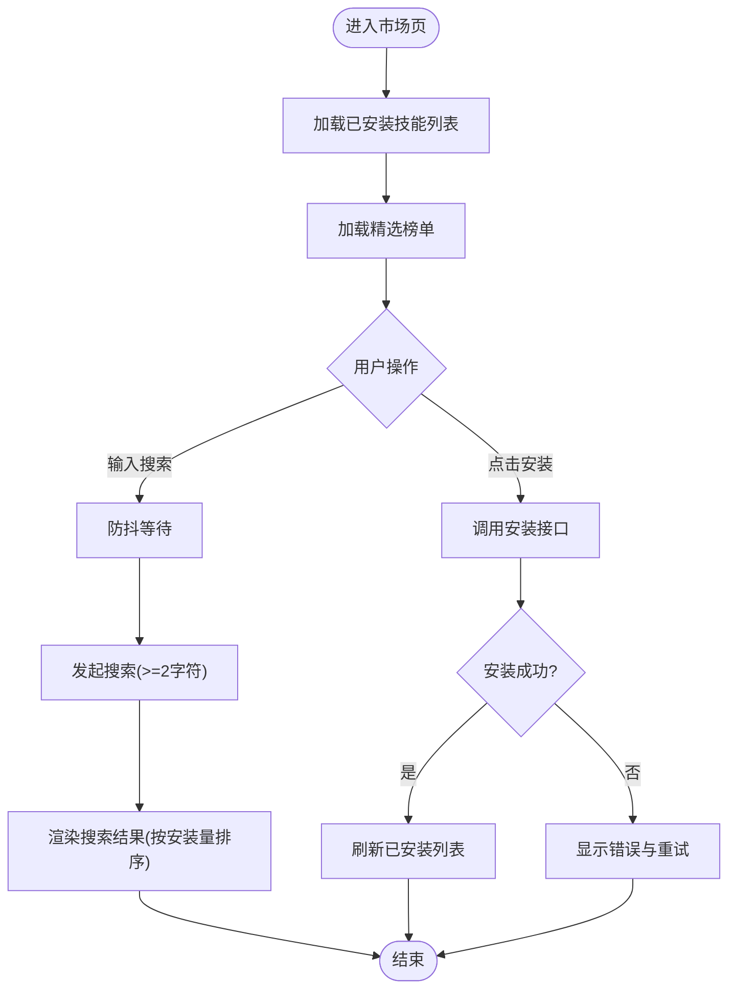
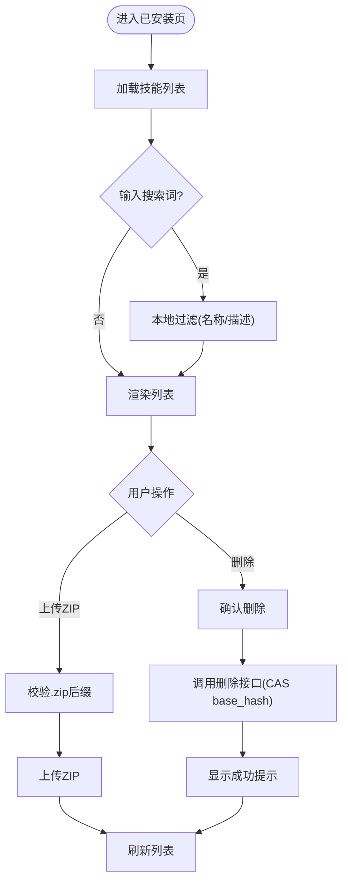
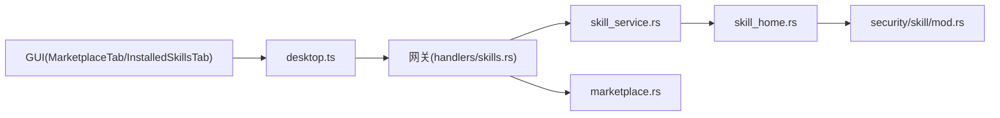

# 技能市场界面

<cite>
**本文引用的文件**
- [MarketplaceTab.vue](file://agent-diva-gui/src/components/settings/MarketplaceTab.vue)
- [InstalledSkillsTab.vue](file://agent-diva-gui/src/components/settings/InstalledSkillsTab.vue)
- [SkillManagementCard.vue](file://agent-diva-gui/src/components/settings/SkillManagementCard.vue)
- [desktop.ts](file://agent-diva-gui/src/api/desktop.ts)
- [skills.rs（网关处理器）](file://agent-diva-manager/src/handlers/skills.rs)
- [marketplace.rs（市场客户端与快照）](file://agent-diva-manager/src/marketplace.rs)
- [skill_service.rs（技能服务）](file://agent-diva-manager/src/skill_service.rs)
- [skill_home.rs（技能家目录与安装/删除）](file://agent-diva-core/src/evolution/skill_home.rs)
- [mod.rs（技能安全校验常量与错误）](file://agent-diva-core/src/security/skill/mod.rs)
- [skill_marketplace_e2e.rs（市场接口端到端测试）](file://agent-diva-manager/tests/skill_marketplace_e2e.rs)
</cite>

## 目录
1. [简介](#简介)
2. [项目结构](#项目结构)
3. [核心组件](#核心组件)
4. [架构总览](#架构总览)
5. [详细组件分析](#详细组件分析)
6. [依赖关系分析](#依赖关系分析)
7. [性能考虑](#性能考虑)
8. [故障排查指南](#故障排查指南)
9. [结论](#结论)
10. [附录：开发规范与发布流程](#附录：开发规范与发布流程)

## 简介
本文件面向“技能市场”界面的浏览、安装与管理能力，覆盖以下主题：
- 技能分类、搜索、评分与评论：当前实现以“热门精选榜单 + 关键词搜索”为主；评分与评论由上游市场提供数据字段，前端用于排序与展示。
- MarketplaceTab 与 InstalledSkillsTab：技能列表展示、详情查看、版本管理、安装/卸载、上传 ZIP、状态与来源标识。
- 安装流程、依赖检查与冲突解决：通过网关调用外部市场下载快照并写入本地技能家目录，冲突时返回明确状态码。
- 更新、卸载与备份：支持禁用、历史版本回滚；硬删除可恢复同名内置技能可见性。
- 后端数据同步与离线支持：使用嵌入式“精选榜单快照”在无网络时仍可展示；在线时可搜索并安装。
- 技能开发规范与发布流程：基于 SKILL.md 的包结构与大小/内容限制，以及上传/安装的安全校验。

## 项目结构
技能市场相关代码主要分布在三层：
- GUI 层（Vue 组件与 API 封装）：负责交互、列表渲染、搜索与安装触发。
- 网关层（Axum 处理器与服务）：聚合市场客户端与技能服务，暴露 REST API。
- 核心层（技能家目录与安全校验）：负责本地技能存储、版本控制、冲突检测与安全约束。

图表来源
- [MarketplaceTab.vue:1-248](file://agent-diva-gui/src/components/settings/MarketplaceTab.vue#L1-L248)
- [InstalledSkillsTab.vue:1-234](file://agent-diva-gui/src/components/settings/InstalledSkillsTab.vue#L1-L234)
- [SkillManagementCard.vue:1-51](file://agent-diva-gui/src/components/settings/SkillManagementCard.vue#L1-L51)
- [desktop.ts:1-800](file://agent-diva-gui/src/api/desktop.ts#L1-L800)
- [skills.rs（网关处理器）:1-331](file://agent-diva-manager/src/handlers/skills.rs#L1-L331)
- [marketplace.rs（市场客户端与快照）:1-365](file://agent-diva-manager/src/marketplace.rs#L1-L365)
- [skill_service.rs（技能服务）:43-196](file://agent-diva-manager/src/skill_service.rs#L43-L196)
- [skill_home.rs（技能家目录与安装/删除）:133-181](file://agent-diva-core/src/evolution/skill_home.rs#L133-L181)
- [mod.rs（技能安全校验常量与错误）:32-68](file://agent-diva-core/src/security/skill/mod.rs#L32-L68)

章节来源
- [MarketplaceTab.vue:1-248](file://agent-diva-gui/src/components/settings/MarketplaceTab.vue#L1-L248)
- [InstalledSkillsTab.vue:1-234](file://agent-diva-gui/src/components/settings/InstalledSkillsTab.vue#L1-L234)
- [SkillManagementCard.vue:1-51](file://agent-diva-gui/src/components/settings/SkillManagementCard.vue#L1-L51)
- [desktop.ts:1-800](file://agent-diva-gui/src/api/desktop.ts#L1-L800)
- [skills.rs（网关处理器）:1-331](file://agent-diva-manager/src/handlers/skills.rs#L1-L331)
- [marketplace.rs（市场客户端与快照）:1-365](file://agent-diva-manager/src/marketplace.rs#L1-L365)
- [skill_service.rs（技能服务）:43-196](file://agent-diva-manager/src/skill_service.rs#L43-L196)
- [skill_home.rs（技能家目录与安装/删除）:133-181](file://agent-diva-core/src/evolution/skill_home.rs#L133-L181)
- [mod.rs（技能安全校验常量与错误）:32-68](file://agent-diva-core/src/security/skill/mod.rs#L32-L68)

## 核心组件
- MarketplaceTab.vue：市场浏览与安装入口。支持搜索、热门榜单、已安装状态识别、安装进度与错误重试。
- InstalledSkillsTab.vue：已安装技能管理。支持刷新、ZIP 上传、删除、状态与来源标签、Evolution 托管提示。
- SkillManagementCard.vue：设置页中的技能管理容器，切换“已安装/市场”两个标签页。
- desktop.ts：Tauri 命令封装，定义 SkillDto、SkillDocument、上传/删除等接口类型。
- handlers/skills.rs：网关路由与请求处理，包括搜索、安装、列表、更新、禁用、删除、历史等。
- marketplace.rs：对外部 skills.sh 市场的 HTTP 客户端与嵌入式精选榜单快照。
- skill_service.rs：技能服务，封装对 SkillHome 的调用，包含上传 ZIP、安装市场快照等。
- evolution/skill_home.rs：技能家目录，负责本地技能的读取、写入、历史、提案、删除与冲突检测。
- security/skill/mod.rs：技能安全校验常量与错误模型，如 ZIP 大小上限、SKILL.md 最小长度、always 注入限制等。

章节来源
- [MarketplaceTab.vue:1-248](file://agent-diva-gui/src/components/settings/MarketplaceTab.vue#L1-L248)
- [InstalledSkillsTab.vue:1-234](file://agent-diva-gui/src/components/settings/InstalledSkillsTab.vue#L1-L234)
- [SkillManagementCard.vue:1-51](file://agent-diva-gui/src/components/settings/SkillManagementCard.vue#L1-L51)
- [desktop.ts:1-800](file://agent-diva-gui/src/api/desktop.ts#L1-L800)
- [skills.rs（网关处理器）:1-331](file://agent-diva-manager/src/handlers/skills.rs#L1-L331)
- [marketplace.rs（市场客户端与快照）:1-365](file://agent-diva-manager/src/marketplace.rs#L1-L365)
- [skill_service.rs（技能服务）:43-196](file://agent-diva-manager/src/skill_service.rs#L43-L196)
- [skill_home.rs（技能家目录与安装/删除）:133-181](file://agent-diva-core/src/evolution/skill_home.rs#L133-L181)
- [mod.rs（技能安全校验常量与错误）:32-68](file://agent-diva-core/src/security/skill/mod.rs#L32-L68)

## 架构总览
技能市场从 GUI 到后端的完整链路如下：
- 用户在 MarketplaceTab 输入关键词或浏览精选榜单，触发搜索或获取精选数据。
- GUI 通过 desktop.ts 调用 Tauri 命令，网关 handlers/skills.rs 接收请求。
- 搜索：网关通过 marketplace.rs 的 MarketplaceClient 访问外部市场 API，返回结果。
- 安装：网关下载技能快照，交由 skill_service.rs 写入本地 SkillHome，完成安装。
- 已安装列表：GUI 通过 get_skills 拉取本地技能清单，InstalledSkillsTab 渲染并可上传/删除。

图表来源
- [MarketplaceTab.vue:56-134](file://agent-diva-gui/src/components/settings/MarketplaceTab.vue#L56-L134)
- [desktop.ts:321-377](file://agent-diva-gui/src/api/desktop.ts#L321-L377)
- [skills.rs（网关处理器）:85-138](file://agent-diva-manager/src/handlers/skills.rs#L85-L138)
- [marketplace.rs（市场客户端与快照）:130-185](file://agent-diva-manager/src/marketplace.rs#L130-L185)
- [skill_service.rs（技能服务）:155-165](file://agent-diva-manager/src/skill_service.rs#L155-L165)
- [skill_home.rs（技能家目录与安装/删除）:362-395](file://agent-diva-core/src/evolution/skill_home.rs#L362-L395)

## 详细组件分析

### MarketplaceTab 组件
- 功能要点
  - 搜索：输入框带防抖，最少 2 字符才发起搜索；结果按安装量降序排列。
  - 精选榜单：无网络或无在线搜索时，显示嵌入式精选榜单（含生成时间）。
  - 已安装状态：加载本地技能列表，根据 slug 判断是否已安装，按钮文案与禁用态变化。
  - 安装：点击安装后调用后端安装接口，成功后刷新已安装列表；失败显示错误与重试。
- 关键实现路径
  - 搜索与安装：[MarketplaceTab.vue:56-134](file://agent-diva-gui/src/components/settings/MarketplaceTab.vue#L56-L134)
  - 已安装状态加载：[MarketplaceTab.vue:46-54](file://agent-diva-gui/src/components/settings/MarketplaceTab.vue#L46-L54)
  - 精选榜单加载：[MarketplaceTab.vue:110-123](file://agent-diva-gui/src/components/settings/MarketplaceTab.vue#L110-L123)
  - 模板渲染与按钮状态：[MarketplaceTab.vue:205-241](file://agent-diva-gui/src/components/settings/MarketplaceTab.vue#L205-L241)

图表来源
- [MarketplaceTab.vue:46-134](file://agent-diva-gui/src/components/settings/MarketplaceTab.vue#L46-L134)
- [MarketplaceTab.vue:205-241](file://agent-diva-gui/src/components/settings/MarketplaceTab.vue#L205-L241)

章节来源
- [MarketplaceTab.vue:1-248](file://agent-diva-gui/src/components/settings/MarketplaceTab.vue#L1-L248)

### InstalledSkillsTab 组件
- 功能要点
  - 列表展示：显示技能名称、描述、状态（active/available/unavailable）、来源（builtin/home）。
  - 搜索过滤：按名称与描述进行本地过滤。
  - 上传 ZIP：仅接受 .zip 文件，上传后刷新列表。
  - 删除技能：非 Evolution 托管且允许硬删除的技能显示删除按钮；确认后调用删除接口并刷新。
  - Evolution 托管提示：Evolution 生成的技能显示“Evolution 管理”，不可删除。
- 关键实现路径
  - 刷新与上传：[InstalledSkillsTab.vue:36-79](file://agent-diva-gui/src/components/settings/InstalledSkillsTab.vue#L36-L79)
  - 删除流程：[InstalledSkillsTab.vue:81-103](file://agent-diva-gui/src/components/settings/InstalledSkillsTab.vue#L81-L103)
  - 状态与来源标签：[InstalledSkillsTab.vue:105-119](file://agent-diva-gui/src/components/settings/InstalledSkillsTab.vue#L105-L119)
  - 模板渲染与按钮逻辑：[InstalledSkillsTab.vue:183-230](file://agent-diva-gui/src/components/settings/InstalledSkillsTab.vue#L183-L230)

图表来源
- [InstalledSkillsTab.vue:36-103](file://agent-diva-gui/src/components/settings/InstalledSkillsTab.vue#L36-L103)
- [InstalledSkillsTab.vue:183-230](file://agent-diva-gui/src/components/settings/InstalledSkillsTab.vue#L183-L230)

章节来源
- [InstalledSkillsTab.vue:1-234](file://agent-diva-gui/src/components/settings/InstalledSkillsTab.vue#L1-L234)

### 网关处理器与技能服务
- 搜索市场：校验查询长度，调用 MarketplaceClient.search，返回技能列表与总数。
- 安装市场技能：解析 id（owner/repo/slug），下载快照，调用 SkillService.install_marketplace_snapshot。
- 已安装列表：SkillService.list_skills 映射为 SkillDto，包含 evolution_managed、can_hard_delete 等字段。
- 删除技能：复用 delete_skill，底层调用 SkillHome.hard_delete，需要 CAS base_hash。
- 关键实现路径
  - 搜索与安装：[skills.rs（网关处理器）:85-138](file://agent-diva-manager/src/handlers/skills.rs#L85-L138)
  - 列表映射：[skill_service.rs（技能服务）:43-61](file://agent-diva-manager/src/skill_service.rs#L43-L61)
  - 删除兼容接口：[skill_service.rs（技能服务）:159-165](file://agent-diva-manager/src/skill_service.rs#L159-L165)

章节来源
- [skills.rs（网关处理器）:1-331](file://agent-diva-manager/src/handlers/skills.rs#L1-L331)
- [skill_service.rs（技能服务）:43-196](file://agent-diva-manager/src/skill_service.rs#L43-L196)

### 市场客户端与离线精选
- 市场客户端：默认基础 URL 为 https://skills.sh，支持环境变量覆盖；搜索与下载均有超时与错误包装。
- 离线精选：嵌入 YAML 快照，构建时打包，无需运行时网络即可展示热门榜单。
- 关键实现路径
  - 客户端与超时：[marketplace.rs（市场客户端与快照）:108-128](file://agent-diva-manager/src/marketplace.rs#L108-L128)
  - 搜索与下载：[marketplace.rs（市场客户端与快照）:130-185](file://agent-diva-manager/src/marketplace.rs#L130-L185)
  - 嵌入式快照：[marketplace.rs（市场客户端与快照）:35-60](file://agent-diva-manager/src/marketplace.rs#L35-L60)

章节来源
- [marketplace.rs（市场客户端与快照）:1-365](file://agent-diva-manager/src/marketplace.rs#L1-L365)

### 技能家目录与安全校验
- 安装新技能：install_new 拒绝重复 slug，禁止 history/ 等保留路径，落盘后标记待清理。
- 硬删除：hard_delete 要求 base_hash 匹配，删除目录并标记待清理，同时提升机器纪元。
- 安全约束：ZIP 最大 5MB，SKILL.md 最小字符数，always 注入总量与数量限制。
- 关键实现路径
  - 安装与删除：[skill_home.rs（技能家目录与安装/删除）:362-395](file://agent-diva-core/src/evolution/skill_home.rs#L362-L395)
  - 安全常量与错误：[mod.rs（技能安全校验常量与错误）:32-68](file://agent-diva-core/src/security/skill/mod.rs#L32-L68)

章节来源
- [skill_home.rs（技能家目录与安装/删除）:133-181](file://agent-diva-core/src/evolution/skill_home.rs#L133-L181)
- [mod.rs（技能安全校验常量与错误）:32-68](file://agent-diva-core/src/security/skill/mod.rs#L32-L68)

## 依赖关系分析
- GUI 依赖 desktop.ts 暴露的 Tauri 命令，这些命令在网关中实现。
- 网关依赖 marketplace.rs 的外部市场客户端与 skill_service.rs 的本地技能服务。
- 技能服务依赖 core 层的 skill_home.rs 进行本地读写与版本控制。
- 安全模块贯穿上传与安装过程，确保 ZIP 大小与内容合规。

图表来源
- [MarketplaceTab.vue:1-248](file://agent-diva-gui/src/components/settings/MarketplaceTab.vue#L1-L248)
- [InstalledSkillsTab.vue:1-234](file://agent-diva-gui/src/components/settings/InstalledSkillsTab.vue#L1-L234)
- [desktop.ts:1-800](file://agent-diva-gui/src/api/desktop.ts#L1-L800)
- [skills.rs（网关处理器）:1-331](file://agent-diva-manager/src/handlers/skills.rs#L1-L331)
- [skill_service.rs（技能服务）:43-196](file://agent-diva-manager/src/skill_service.rs#L43-L196)
- [marketplace.rs（市场客户端与快照）:1-365](file://agent-diva-manager/src/marketplace.rs#L1-L365)
- [skill_home.rs（技能家目录与安装/删除）:133-181](file://agent-diva-core/src/evolution/skill_home.rs#L133-L181)
- [mod.rs（技能安全校验常量与错误）:32-68](file://agent-diva-core/src/security/skill/mod.rs#L32-L68)

章节来源
- [skills.rs（网关处理器）:1-331](file://agent-diva-manager/src/handlers/skills.rs#L1-L331)
- [skill_service.rs（技能服务）:43-196](file://agent-diva-manager/src/skill_service.rs#L43-L196)
- [marketplace.rs（市场客户端与快照）:1-365](file://agent-diva-manager/src/marketplace.rs#L1-L365)
- [skill_home.rs（技能家目录与安装/删除）:133-181](file://agent-diva-core/src/evolution/skill_home.rs#L133-L181)
- [mod.rs（技能安全校验常量与错误）:32-68](file://agent-diva-core/src/security/skill/mod.rs#L32-L68)

## 性能考虑
- 搜索防抖：MarketplaceTab 使用 300ms 防抖减少频繁请求。
- 离线精选：embedded snapshot 避免无网络时的额外开销，保证基本浏览体验。
- 列表分页与限制：市场搜索默认限制 20，最大 50，防止大数据集导致 UI 卡顿。
- 本地过滤：InstalledSkillsTab 的搜索为本地过滤，降低后端压力。

[本节为通用指导，不直接分析具体文件]

## 故障排查指南
- 安装失败
  - 现象：MarketplaceTab 显示错误并支持重试。
  - 可能原因：上游市场错误、网络超时、本地冲突（重复安装）。
  - 定位：检查网关日志与市场客户端错误包装；E2E 测试验证冲突返回 CONFLICT。
  - 参考：[skills.rs（网关处理器）:322-330](file://agent-diva-manager/src/handlers/skills.rs#L322-L330)，[skill_marketplace_e2e.rs:175-184](file://agent-diva-manager/tests/skill_marketplace_e2e.rs#L175-L184)
- 无法搜索
  - 现象：搜索无结果或报错。
  - 可能原因：查询少于 2 字符、上游 API 不可用。
  - 定位：网关校验与 marketplace_upstream_error；检查环境变量 AGENT_DIVA_SKILLS_MARKETPLACE_URL。
  - 参考：[skills.rs（网关处理器）:85-104](file://agent-diva-manager/src/handlers/skills.rs#L85-L104)，[marketplace.rs（市场客户端与快照）:108-128](file://agent-diva-manager/src/marketplace.rs#L108-L128)
- 删除失败
  - 现象：InstalledSkillsTab 删除时报错。
  - 可能原因：base_hash 不匹配（CAS 冲突）、权限不足、IO 错误。
  - 定位：gateway 错误映射与 skill_home 错误枚举。
  - 参考：[skills.rs（网关处理器）:269-293](file://agent-diva-manager/src/handlers/skills.rs#L269-L293)，[skill_home.rs（技能家目录与安装/删除）:362-382](file://agent-diva-core/src/evolution/skill_home.rs#L362-L382)
- 上传 ZIP 被拒
  - 现象：InstalledSkillsTab 上传失败。
  - 可能原因：ZIP 过大、SKILL.md 内容过短、路径非法。
  - 定位：安全校验常量与错误；上传解析逻辑。
  - 参考：[mod.rs（技能安全校验常量与错误）:32-68](file://agent-diva-core/src/security/skill/mod.rs#L32-L68)，[skill_service.rs（技能服务）:185-196](file://agent-diva-manager/src/skill_service.rs#L185-L196)

章节来源
- [skills.rs（网关处理器）:269-330](file://agent-diva-manager/src/handlers/skills.rs#L269-L330)
- [skill_marketplace_e2e.rs:175-184](file://agent-diva-manager/tests/skill_marketplace_e2e.rs#L175-L184)
- [marketplace.rs（市场客户端与快照）:108-128](file://agent-diva-manager/src/marketplace.rs#L108-L128)
- [skill_home.rs（技能家目录与安装/删除）:362-382](file://agent-diva-core/src/evolution/skill_home.rs#L362-L382)
- [mod.rs（技能安全校验常量与错误）:32-68](file://agent-diva-core/src/security/skill/mod.rs#L32-L68)
- [skill_service.rs（技能服务）:185-196](file://agent-diva-manager/src/skill_service.rs#L185-L196)

## 结论
技能市场界面提供了直观的浏览、搜索与安装体验，并通过网关与核心层实现了安全的本地技能管理与版本控制。离线精选榜单保障了弱网环境下的可用性；安装冲突、上传校验与删除 CAS 机制确保了数据一致性与安全性。未来可在评分与评论维度增强展示，但当前以安装量作为质量信号已满足基本需求。

[本节为总结，不直接分析具体文件]

## 附录：开发规范与发布流程
- 技能包结构
  - 必须包含 SKILL.md，内容需满足最小字符数限制。
  - 可选资源文件与脚本，但不得包含保留路径（如 history/）。
  - ZIP 大小不得超过 5MB。
- 开发与调试
  - 使用 InstalledSkillsTab 上传 ZIP 进行本地测试。
  - 通过网关日志与市场客户端错误信息定位问题。
- 发布流程
  - 将技能发布至外部市场（skills.sh），确保 id 格式 owner/repo/slug。
  - 通过 MarketplaceTab 搜索或安装验证可用性。
  - 若需离线展示，更新嵌入式精选榜单快照。
- 安全与治理
  - 遵循 always 注入总量与数量限制，避免上下文膨胀。
  - 对于 Evolution 托管技能，通过提案与审批流程管理变更。

[本节为通用指导，不直接分析具体文件]