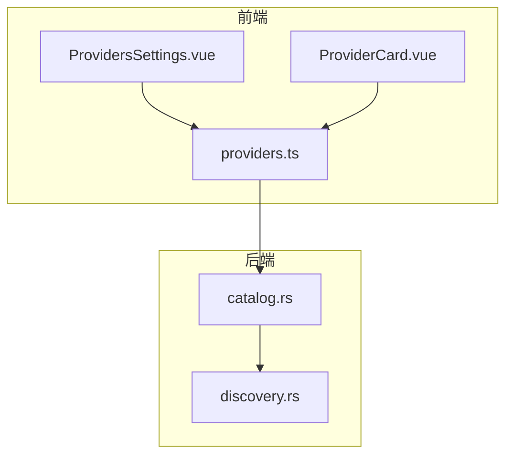
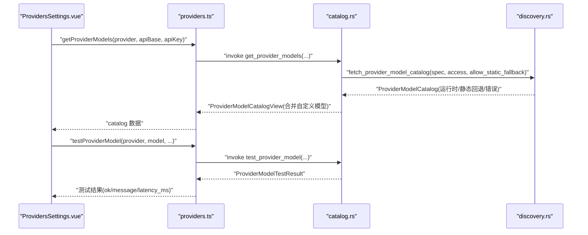
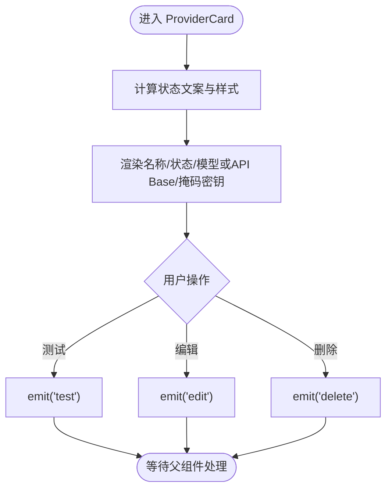
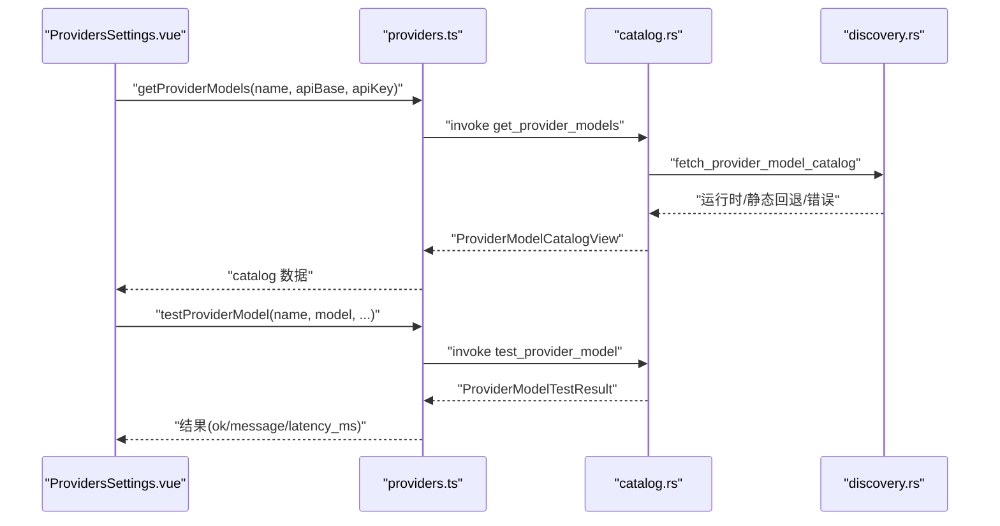
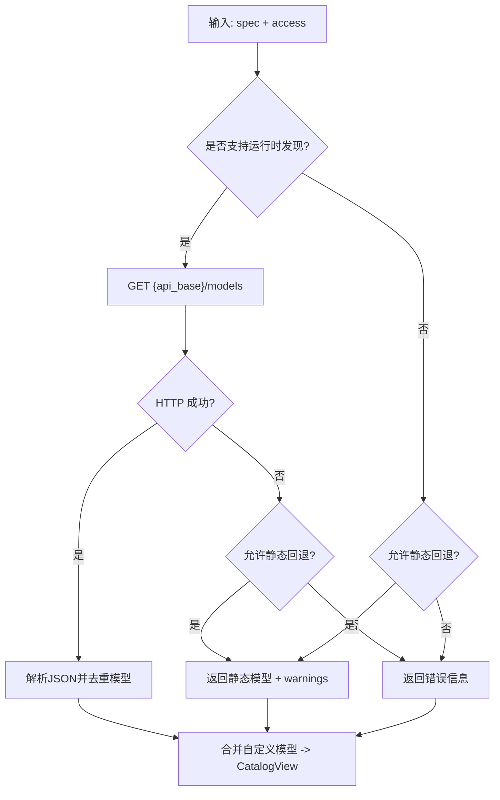
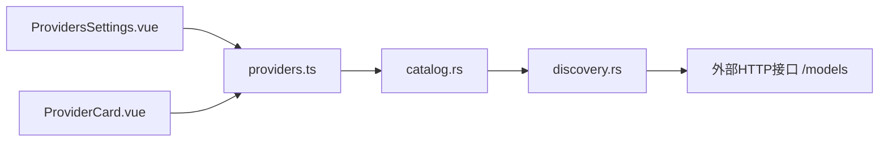

# 提供商管理界面

<cite>
**本文引用的文件**
- [ProviderCard.vue](file://agent-diva-gui/src/components/settings/ProviderCard.vue)
- [ProvidersSettings.vue](file://agent-diva-gui/src/components/settings/ProvidersSettings.vue)
- [providers.ts](file://agent-diva-gui/src/api/providers.ts)
- [discovery.rs](file://agent-diva-providers/src/discovery.rs)
- [catalog.rs](file://agent-diva-providers/src/catalog.rs)
</cite>

## 目录
1. [简介](#简介)
2. [项目结构](#项目结构)
3. [核心组件](#核心组件)
4. [架构总览](#架构总览)
5. [详细组件分析](#详细组件分析)
6. [依赖关系分析](#依赖关系分析)
7. [性能考虑](#性能考虑)
8. [故障排查指南](#故障排查指南)
9. [结论](#结论)
10. [附录：配置示例与模板](#附录：配置示例与模板)

## 简介
本文件面向“提供商管理界面”，聚焦 LLM 提供商的发现、连接测试、密钥管理、模型目录同步、批量操作、导入导出与配置模板等能力。文档从前端组件 ProviderCard 与 ProvidersSettings 出发，结合后端 providers 模块的目录发现与持久化逻辑，给出端到端的数据流、错误处理与最佳实践。

## 项目结构
- 前端（Vue + Tauri）
  - 设置页主容器：ProvidersSettings.vue，负责提供商列表、搜索折叠、运行时目录刷新、模型选择、自定义提供商创建/删除、连接测试状态管理等。
  - 卡片组件：ProviderCard.vue，展示单个提供商的状态、当前模型或 API Base、掩码后的密钥片段，并提供测试、编辑、删除等操作入口。
  - API 层：providers.ts，封装 Tauri invoke 调用，定义 ProviderModelCatalog、ProviderModelTestResult、ProviderSpecDto、CustomProviderPayload 等类型。
- 后端（Rust）
  - 目录发现：discovery.rs，实现 OpenAI 兼容模型的运行时发现、静态回退、错误聚合与 HTTP 错误摘要。
  - 目录服务：catalog.rs，提供 ProviderView、ProviderModelCatalogView、增删模型、保存/删除自定义提供商、合并模型来源等能力。

图表来源
- [ProvidersSettings.vue:1-120](file://agent-diva-gui/src/components/settings/ProvidersSettings.vue#L1-L120)
- [ProviderCard.vue:1-120](file://agent-diva-gui/src/components/settings/ProviderCard.vue#L1-L120)
- [providers.ts:1-94](file://agent-diva-gui/src/api/providers.ts#L1-L94)
- [catalog.rs:1-120](file://agent-diva-providers/src/catalog.rs#L1-L120)
- [discovery.rs:1-120](file://agent-diva-providers/src/discovery.rs#L1-L120)

章节来源
- [ProvidersSettings.vue:1-120](file://agent-diva-gui/src/components/settings/ProvidersSettings.vue#L1-L120)
- [ProviderCard.vue:1-120](file://agent-diva-gui/src/components/settings/ProviderCard.vue#L1-L120)
- [providers.ts:1-94](file://agent-diva-gui/src/api/providers.ts#L1-L94)
- [catalog.rs:1-120](file://agent-diva-providers/src/catalog.rs#L1-L120)
- [discovery.rs:1-120](file://agent-diva-providers/src/discovery.rs#L1-L120)

## 核心组件
- ProviderCard.vue
  - 职责：渲染单个提供商卡片，显示名称、状态（就绪/缺少配置/当前）、当前模型或 API Base、掩码后的密钥片段；提供“测试连接”“编辑”“删除（仅自定义）”按钮。
  - 交互：通过 emit 事件将 test/edit/delete 动作上抛给父组件处理。
  - 安全：对密钥进行掩码显示，避免明文泄露。
- ProvidersSettings.vue
  - 职责：提供商列表加载与去重、搜索与折叠、运行时目录刷新、模型选择与保存、自定义提供商创建/删除、连接测试状态管理、本地草稿与快照对比、批量操作入口等。
  - 数据流：通过 providers.ts 调用 Tauri 命令，获取提供商规格、模型目录、测试结果，并更新本地状态。
  - 错误处理：统一使用应用级 Toast 提示，区分成功/失败/延迟信息。
- providers.ts
  - 职责：封装 get_provider_models、test_provider_model、add/remove_provider_model、create/delete_custom_provider 等 Tauri 调用，定义前后端契约类型。
- catalog.rs / discovery.rs
  - 职责：构建 ProviderView/ProviderModelCatalogView，合并运行时与静态/自定义模型；OpenAI 兼容模型的运行时发现；HTTP 错误摘要与静态回退策略；自定义提供商的保存与删除校验。

章节来源
- [ProviderCard.vue:1-120](file://agent-diva-gui/src/components/settings/ProviderCard.vue#L1-L120)
- [ProvidersSettings.vue:1-120](file://agent-diva-gui/src/components/settings/ProvidersSettings.vue#L1-L120)
- [providers.ts:1-94](file://agent-diva-gui/src/api/providers.ts#L1-L94)
- [catalog.rs:1-120](file://agent-diva-providers/src/catalog.rs#L1-L120)
- [discovery.rs:1-120](file://agent-diva-providers/src/discovery.rs#L1-L120)

## 架构总览
前端通过 ProvidersSettings.vue 发起请求，调用 providers.ts 中的 Tauri 方法，后端 catalog.rs 协调 discovery.rs 完成模型目录发现与合并，最终返回视图对象供前端渲染。

图表来源
- [ProvidersSettings.vue:430-460](file://agent-diva-gui/src/components/settings/ProvidersSettings.vue#L430-L460)
- [providers.ts:42-64](file://agent-diva-gui/src/api/providers.ts#L42-L64)
- [catalog.rs:161-193](file://agent-diva-providers/src/catalog.rs#L161-L193)
- [discovery.rs:63-113](file://agent-diva-providers/src/discovery.rs#L63-L113)

## 详细组件分析

### ProviderCard 组件
- 状态显示
  - 根据 status 计算文案与样式：ready/missingConfig/active。
  - 显示当前模型或 API Base，以及掩码后的密钥片段。
- 交互与事件
  - 测试连接：触发父组件的连接测试流程。
  - 编辑：打开编辑对话框（由父组件控制）。
  - 删除：仅当 isCustom 为真时显示删除按钮。
- 错误处理
  - 组件本身不直接处理错误，通过 emit 将事件交给上层处理，便于集中式错误提示与状态管理。

图表来源
- [ProviderCard.vue:44-63](file://agent-diva-gui/src/components/settings/ProviderCard.vue#L44-L63)
- [ProviderCard.vue:94-122](file://agent-diva-gui/src/components/settings/ProviderCard.vue#L94-L122)

章节来源
- [ProviderCard.vue:1-120](file://agent-diva-gui/src/components/settings/ProviderCard.vue#L1-L120)

### ProvidersSettings 主界面
- 提供商列表与搜索
  - 加载提供商规格，支持按名称/显示名搜索，默认折叠部分提供商，支持展开更多。
- 运行时目录刷新
  - 针对选中的提供商，调用 getProviderModels 拉取运行时模型目录，并缓存到 runtimeCatalogs。
- 模型选择与保存
  - 切换模型时更新 localConfig 与本地 savedModels，并持久化配置。
  - 支持手动添加模型、删除自定义模型，并在删除后自动回退到可用模型。
- 自定义提供商
  - 创建：校验必填字段，调用 createCustomProvider，成功后刷新列表与状态。
  - 删除：二次确认后调用 deleteCustomProvider，清理本地缓存与 savedModels。
- 连接测试
  - 对指定模型执行 testProviderModel，展示测试中/成功/失败状态与延迟时间，支持定时清除状态。
- 密钥与 API Base 管理
  - 维护 providerApiKeys/providerApiBases，支持可见性切换，变更时同步到 savedModels 与 localConfig。

图表来源
- [ProvidersSettings.vue:430-460](file://agent-diva-gui/src/components/settings/ProvidersSettings.vue#L430-L460)
- [ProvidersSettings.vue:601-641](file://agent-diva-gui/src/components/settings/ProvidersSettings.vue#L601-L641)
- [providers.ts:42-64](file://agent-diva-gui/src/api/providers.ts#L42-L64)
- [catalog.rs:161-193](file://agent-diva-providers/src/catalog.rs#L161-L193)
- [discovery.rs:63-113](file://agent-diva-providers/src/discovery.rs#L63-L113)

章节来源
- [ProvidersSettings.vue:1-120](file://agent-diva-gui/src/components/settings/ProvidersSettings.vue#L1-L120)
- [ProvidersSettings.vue:430-460](file://agent-diva-gui/src/components/settings/ProvidersSettings.vue#L430-L460)
- [ProvidersSettings.vue:601-641](file://agent-diva-gui/src/components/settings/ProvidersSettings.vue#L601-L641)

### 后端目录发现与持久化
- 运行时发现
  - 对 OpenAI 兼容提供商，访问 {api_base}/models 接口，解析 JSON 数据并去重返回模型列表。
  - 若请求失败且允许静态回退，则返回内置模型作为 fallback，并将错误写入 warnings。
- 目录视图合并
  - 将运行时/静态/自定义模型合并为 ProviderModelCatalogView，标记来源与可选项。
- 自定义提供商
  - 保存时校验 id 非空、禁止覆盖内置提供商、仅支持 openai 类型；规范化 api_base 与 models。
  - 删除时移除 custom_providers 条目，若不存在则报错。

图表来源
- [discovery.rs:63-113](file://agent-diva-providers/src/discovery.rs#L63-L113)
- [discovery.rs:179-246](file://agent-diva-providers/src/discovery.rs#L179-L246)
- [catalog.rs:389-435](file://agent-diva-providers/src/catalog.rs#L389-L435)

章节来源
- [discovery.rs:63-113](file://agent-diva-providers/src/discovery.rs#L63-L113)
- [discovery.rs:179-246](file://agent-diva-providers/src/discovery.rs#L179-L246)
- [catalog.rs:161-193](file://agent-diva-providers/src/catalog.rs#L161-L193)
- [catalog.rs:239-292](file://agent-diva-providers/src/catalog.rs#L239-L292)
- [catalog.rs:389-435](file://agent-diva-providers/src/catalog.rs#L389-L435)

## 依赖关系分析
- 前端依赖
  - ProvidersSettings.vue 依赖 providers.ts 提供的 Tauri 调用封装。
  - ProviderCard.vue 通过事件与父组件解耦，降低耦合度。
- 后端依赖
  - catalog.rs 依赖 discovery.rs 完成运行时发现；两者共同依赖 ProviderRegistry 与 Config。
- 外部集成点
  - 通过 HTTP 访问提供商的 /models 接口，需正确配置 api_base 与鉴权头。
  - Tauri 命令桥接前端与 Rust 后端。

图表来源
- [ProvidersSettings.vue:1-120](file://agent-diva-gui/src/components/settings/ProvidersSettings.vue#L1-L120)
- [ProviderCard.vue:1-120](file://agent-diva-gui/src/components/settings/ProviderCard.vue#L1-L120)
- [providers.ts:1-94](file://agent-diva-gui/src/api/providers.ts#L1-L94)
- [catalog.rs:1-120](file://agent-diva-providers/src/catalog.rs#L1-L120)
- [discovery.rs:179-246](file://agent-diva-providers/src/discovery.rs#L179-L246)

章节来源
- [ProvidersSettings.vue:1-120](file://agent-diva-gui/src/components/settings/ProvidersSettings.vue#L1-L120)
- [ProviderCard.vue:1-120](file://agent-diva-gui/src/components/settings/ProviderCard.vue#L1-L120)
- [providers.ts:1-94](file://agent-diva-gui/src/api/providers.ts#L1-L94)
- [catalog.rs:1-120](file://agent-diva-providers/src/catalog.rs#L1-L120)
- [discovery.rs:179-246](file://agent-diva-providers/src/discovery.rs#L179-L246)

## 性能考虑
- 运行时目录缓存
  - 前端对每个提供商的运行时目录进行缓存（runtimeCatalogs），避免重复请求。
- 去重与过滤
  - 后端在合并模型时使用集合去重；前端对提供商列表与模型列表进行搜索与折叠，减少渲染压力。
- 超时与重试
  - 后端 HTTP 客户端设置超时；建议在后续版本增加重试与熔断机制以提升鲁棒性。
- 状态清理
  - 连接测试状态使用定时器自动重置，防止内存泄漏与状态残留。

[本节为通用性能建议，无需特定文件引用]

## 故障排查指南
- 无法发现模型
  - 检查提供商是否为 OpenAI 兼容类型，并确保已配置有效的 api_base。
  - 查看运行时目录的 warnings 与 error 字段，定位 HTTP 错误或认证失败。
- 连接测试失败
  - 确认 api_key 与 api_base 正确；观察测试状态与延迟信息；检查网络与防火墙。
- 自定义提供商保存失败
  - 确保 id 非空且不冲突；仅支持 openai 类型；api_base 需规范化。
- 删除模型后无回退
  - 系统会拒绝删除当前活动模型且无可用回退的情况；请先选择其他模型再删除。

章节来源
- [discovery.rs:179-246](file://agent-diva-providers/src/discovery.rs#L179-L246)
- [catalog.rs:239-292](file://agent-diva-providers/src/catalog.rs#L239-L292)
- [ProvidersSettings.vue:601-641](file://agent-diva-gui/src/components/settings/ProvidersSettings.vue#L601-L641)

## 结论
提供商管理界面通过清晰的前后端分层与模块化设计，实现了提供商发现、连接测试、密钥管理与模型目录同步等核心能力。ProviderCard 专注于状态展示与轻量交互，ProvidersSettings 承担复杂业务编排，后端 catalog 与 discovery 提供稳定的目录发现与持久化保障。整体架构易于扩展与维护，适合在多提供商场景下稳定运行。

[本节为总结性内容，无需特定文件引用]

## 附录：配置示例与模板
- 自定义提供商最小配置
  - id: 唯一标识符
  - displayName: 显示名称
  - apiType: 固定为 openai
  - apiKey: 提供商密钥
  - apiBase: 提供商 API Base（可选但推荐）
  - defaultModel: 默认模型
  - models: 初始模型列表（至少一个）
- 运行时目录来源
  - 优先使用运行时发现；若失败且允许回退，则使用静态模型并附带警告。
- 导入导出与模板
  - 可通过导出 savedModels 与 providerConfigs 进行批量迁移；导入时注意去重与冲突处理。
- 批量操作建议
  - 批量更新密钥或 API Base 时，先预览差异，再统一提交；对关键操作增加二次确认。

[本节为概念性说明，无需特定文件引用]