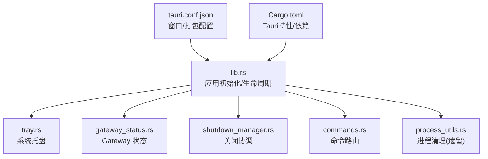
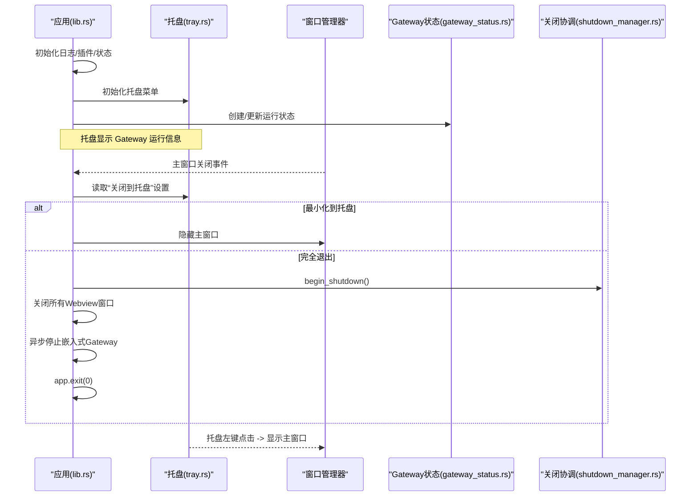
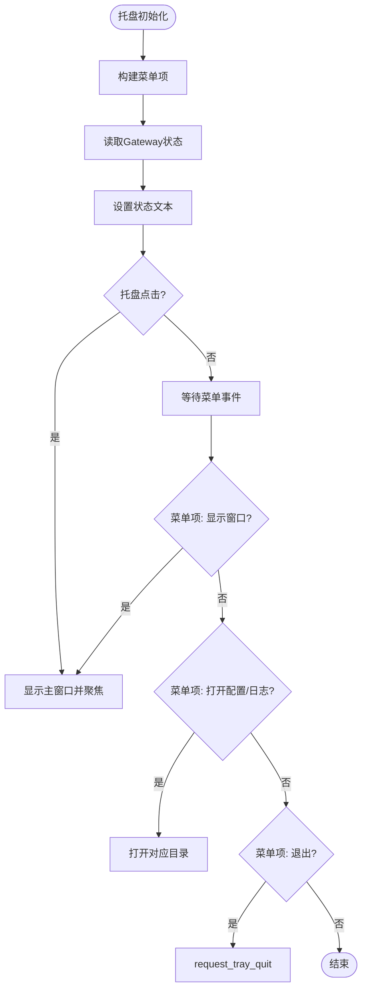
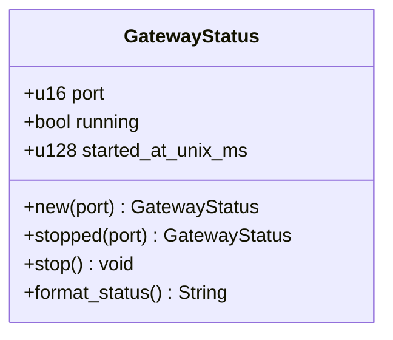
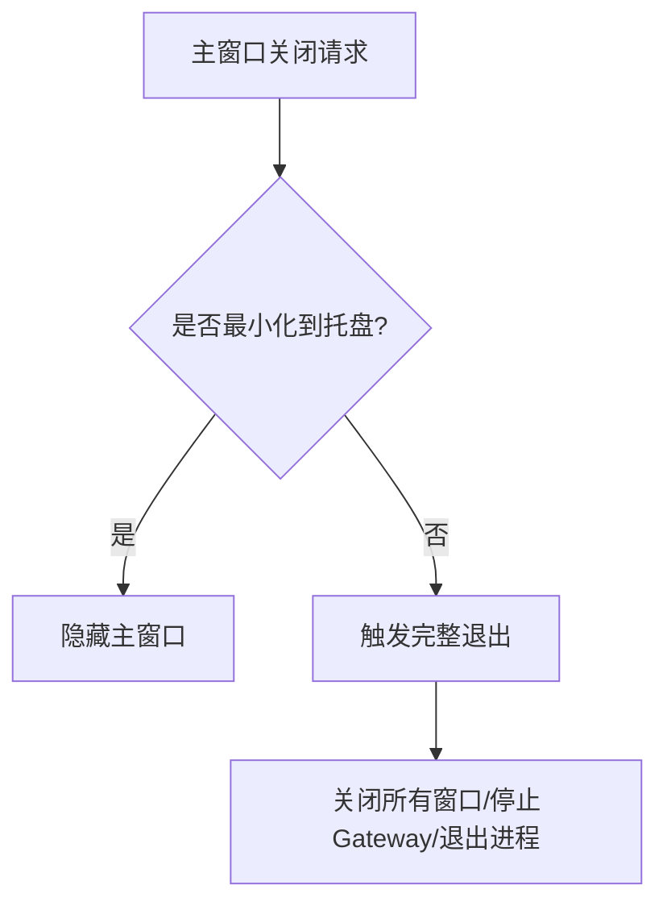
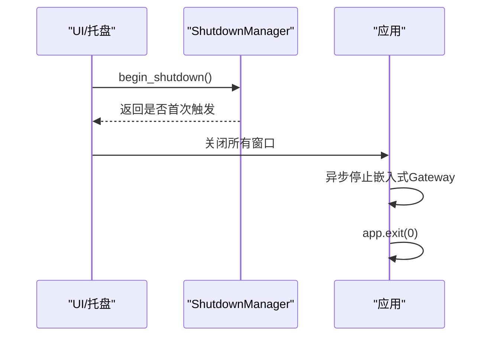
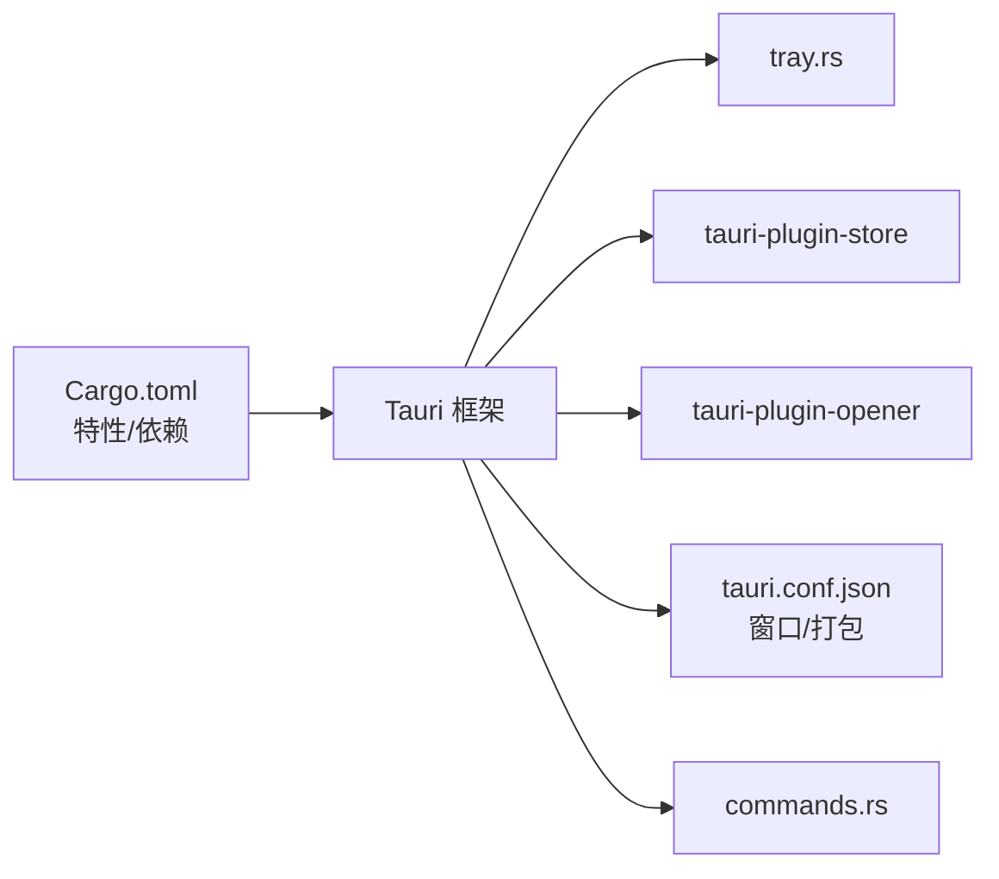

# 桌面集成功能

<cite>
**本文引用的文件**
- [agent-diva-gui/src-tauri/src/lib.rs](file://agent-diva-gui/src-tauri/src/lib.rs)
- [agent-diva-gui/src-tauri/src/tray.rs](file://agent-diva-gui/src-tauri/src/tray.rs)
- [agent-diva-gui/src-tauri/src/gateway_status.rs](file://agent-diva-gui/src-tauri/src/gateway_status.rs)
- [agent-diva-gui/src-tauri/src/process_utils.rs](file://agent-diva-gui/src-tauri/src/process_utils.rs)
- [agent-diva-gui/src-tauri/src/shutdown_manager.rs](file://agent-diva-gui/src-tauri/src/shutdown_manager.rs)
- [agent-diva-gui/src-tauri/tauri.conf.json](file://agent-diva-gui/src-tauri/tauri.conf.json)
- [agent-diva-gui/src-tauri/Cargo.toml](file://agent-diva-gui/src-tauri/Cargo.toml)
- [agent-diva-gui/src-tauri/src/commands.rs](file://agent-diva-gui/src-tauri/src/commands.rs)
</cite>

## 目录
1. [简介](#简介)
2. [项目结构](#项目结构)
3. [核心组件](#核心组件)
4. [架构总览](#架构总览)
5. [详细组件分析](#详细组件分析)
6. [依赖关系分析](#依赖关系分析)
7. [性能考虑](#性能考虑)
8. [故障排查指南](#故障排查指南)
9. [结论](#结论)
10. [附录](#附录)

## 简介
本章节面向 Tauri 桌面应用的“桌面集成”能力，聚焦系统托盘、窗口管理（含最小化到托盘）、Gateway 状态监控与进程管理、以及启动流程中的自启动相关配置。文档以代码为依据，提供可视化架构图与流程图，帮助读者快速理解并扩展桌面集成行为。

## 项目结构
Tauri 桌面应用位于 agent-diva-gui/src-tauri 目录，核心入口为 lib.rs，负责初始化日志、插件、状态、窗口、托盘、命令路由与应用退出流程；tray.rs 实现系统托盘菜单与事件处理；gateway_status.rs 提供 Gateway 运行状态的序列化表示；process_utils.rs 提供遗留外部 Gateway 的进程清理辅助；shutdown_manager.rs 协调后台任务关闭；tauri.conf.json 定义窗口、打包与资源等；Cargo.toml 声明 Tauri 特性与依赖。

图表来源
- [agent-diva-gui/src-tauri/src/lib.rs:263-565](file://agent-diva-gui/src-tauri/src/lib.rs#L263-L565)
- [agent-diva-gui/src-tauri/src/tray.rs:12-78](file://agent-diva-gui/src-tauri/src/tray.rs#L12-L78)
- [agent-diva-gui/src-tauri/src/gateway_status.rs:4-41](file://agent-diva-gui/src-tauri/src/gateway_status.rs#L4-L41)
- [agent-diva-gui/src-tauri/src/shutdown_manager.rs:5-45](file://agent-diva-gui/src-tauri/src/shutdown_manager.rs#L5-L45)
- [agent-diva-gui/src-tauri/src/process_utils.rs:31-53](file://agent-diva-gui/src-tauri/src/process_utils.rs#L31-L53)
- [agent-diva-gui/src-tauri/tauri.conf.json:11-53](file://agent-diva-gui/src-tauri/tauri.conf.json#L11-L53)
- [agent-diva-gui/src-tauri/Cargo.toml:15-18](file://agent-diva-gui/src-tauri/Cargo.toml#L15-L18)

章节来源
- [agent-diva-gui/src-tauri/src/lib.rs:263-565](file://agent-diva-gui/src-tauri/src/lib.rs#L263-L565)
- [agent-diva-gui/src-tauri/tauri.conf.json:11-53](file://agent-diva-gui/src-tauri/tauri.conf.json#L11-L53)
- [agent-diva-gui/src-tauri/Cargo.toml:15-18](file://agent-diva-gui/src-tauri/Cargo.toml#L15-L18)

## 核心组件
- 系统托盘：创建托盘图标与菜单项，监听点击事件显示主窗口，支持打开配置/日志目录，支持从托盘退出。
- Gateway 状态：维护端口、运行标志与启动时间，用于托盘状态文本更新。
- 窗口管理：主窗口关闭时根据设置最小化到托盘或完全退出；Splashscreen 与 Desktop Mate 窗口在启动与退出时受控。
- 关闭协调：确保只触发一次完整关闭，通知后台任务取消，并在退出前安全停止嵌入式 Gateway。
- 进程管理（遗留）：提供查找和终止遗留外部 Gateway 进程的辅助方法，便于数据清理等维护场景。
- 配置与打包：通过 tauri.conf.json 定义窗口、打包目标与资源；通过 Cargo.toml 启用 tray-icon 等 Tauri 特性。

章节来源
- [agent-diva-gui/src-tauri/src/tray.rs:12-78](file://agent-diva-gui/src-tauri/src/tray.rs#L12-L78)
- [agent-diva-gui/src-tauri/src/gateway_status.rs:4-41](file://agent-diva-gui/src-tauri/src/gateway_status.rs#L4-L41)
- [agent-diva-gui/src-tauri/src/lib.rs:331-368](file://agent-diva-gui/src-tauri/src/lib.rs#L331-L368)
- [agent-diva-gui/src-tauri/src/shutdown_manager.rs:5-45](file://agent-diva-gui/src-tauri/src/shutdown_manager.rs#L5-L45)
- [agent-diva-gui/src-tauri/src/process_utils.rs:31-53](file://agent-diva-gui/src-tauri/src/process_utils.rs#L31-L53)
- [agent-diva-gui/src-tauri/tauri.conf.json:11-53](file://agent-diva-gui/src-tauri/tauri.conf.json#L11-L53)
- [agent-diva-gui/src-tauri/Cargo.toml:15-18](file://agent-diva-gui/src-tauri/Cargo.toml#L15-L18)

## 架构总览
下图展示桌面集成的关键交互：应用启动时初始化日志、插件、状态与托盘；主窗口关闭事件根据设置决定隐藏到托盘或执行完整退出；托盘点击可恢复主窗口；Gateway 状态变化会同步至托盘菜单项。

图表来源
- [agent-diva-gui/src-tauri/src/lib.rs:263-368](file://agent-diva-gui/src-tauri/src/lib.rs#L263-L368)
- [agent-diva-gui/src-tauri/src/tray.rs:12-78](file://agent-diva-gui/src-tauri/src/tray.rs#L12-L78)
- [agent-diva-gui/src-tauri/src/gateway_status.rs:4-41](file://agent-diva-gui/src-tauri/src/gateway_status.rs#L4-L41)
- [agent-diva-gui/src-tauri/src/shutdown_manager.rs:5-45](file://agent-diva-gui/src-tauri/src/shutdown_manager.rs#L5-L45)

## 详细组件分析

### 系统托盘实现
- 菜单项：包含“显示窗口”、“Gateway 状态”、“打开配置目录”、“打开日志目录”、“退出”。
- 状态显示：从全局状态中读取 GatewayStatus 并格式化文本，后续可通过 update_tray_status 动态刷新。
- 快捷操作：托盘左键点击直接显示并聚焦主窗口；菜单项“退出”调用 request_tray_quit，依据设置决定是否完全退出。
- 目录打开：使用 opener 打开配置与日志目录，路径解析支持用户目录展开与相对路径拼接。

图表来源
- [agent-diva-gui/src-tauri/src/tray.rs:12-78](file://agent-diva-gui/src-tauri/src/tray.rs#L12-L78)
- [agent-diva-gui/src-tauri/src/tray.rs:80-97](file://agent-diva-gui/src-tauri/src/tray.rs#L80-L97)
- [agent-diva-gui/src-tauri/src/tray.rs:125-151](file://agent-diva-gui/src-tauri/src/tray.rs#L125-L151)
- [agent-diva-gui/src-tauri/src/tray.rs:153-184](file://agent-diva-gui/src-tauri/src/tray.rs#L153-L184)

章节来源
- [agent-diva-gui/src-tauri/src/tray.rs:12-78](file://agent-diva-gui/src-tauri/src/tray.rs#L12-L78)
- [agent-diva-gui/src-tauri/src/tray.rs:80-97](file://agent-diva-gui/src-tauri/src/tray.rs#L80-L97)
- [agent-diva-gui/src-tauri/src/tray.rs:125-151](file://agent-diva-gui/src-tauri/src/tray.rs#L125-L151)
- [agent-diva-gui/src-tauri/src/tray.rs:153-184](file://agent-diva-gui/src-tauri/src/tray.rs#L153-L184)

### Gateway 状态监控
- 数据结构：包含端口、运行标志与启动时间戳，支持 new/stopped/format_status。
- 集成点：应用启动时创建状态并注入全局状态；托盘初始化时读取状态文本；嵌入 Gateway 安装成功后更新状态并刷新托盘。
- 停止流程：应用退出时停止 Gateway 并更新托盘状态。

图表来源
- [agent-diva-gui/src-tauri/src/gateway_status.rs:4-41](file://agent-diva-gui/src-tauri/src/gateway_status.rs#L4-L41)

章节来源
- [agent-diva-gui/src-tauri/src/gateway_status.rs:4-41](file://agent-diva-gui/src-tauri/src/gateway_status.rs#L4-L41)
- [agent-diva-gui/src-tauri/src/lib.rs:277-306](file://agent-diva-gui/src-tauri/src/lib.rs#L277-L306)
- [agent-diva-gui/src-tauri/src/lib.rs:144-159](file://agent-diva-gui/src-tauri/src/lib.rs#L144-L159)

### 窗口管理与最小化到托盘
- 关闭事件：主窗口关闭时读取“关闭到托盘”设置，若开启则隐藏窗口；否则触发完整退出流程。
- Splashscreen：前后端均完成后关闭启动画面并显示主窗口。
- Desktop Mate：退出时会暂停渲染并关闭该窗口。

图表来源
- [agent-diva-gui/src-tauri/src/lib.rs:331-368](file://agent-diva-gui/src-tauri/src/lib.rs#L331-L368)
- [agent-diva-gui/src-tauri/src/lib.rs:237-261](file://agent-diva-gui/src-tauri/src/lib.rs#L237-L261)
- [agent-diva-gui/src-tauri/src/lib.rs:180-192](file://agent-diva-gui/src-tauri/src/lib.rs#L180-L192)

章节来源
- [agent-diva-gui/src-tauri/src/lib.rs:331-368](file://agent-diva-gui/src-tauri/src/lib.rs#L331-L368)
- [agent-diva-gui/src-tauri/src/lib.rs:237-261](file://agent-diva-gui/src-tauri/src/lib.rs#L237-L261)
- [agent-diva-gui/src-tauri/src/lib.rs:180-192](file://agent-diva-gui/src-tauri/src/lib.rs#L180-L192)

### 关闭协调与进程管理
- 关闭协调：ShutdownManager 保证仅触发一次关闭，并发出取消信号；应用退出事件标记退出已观察。
- 进程管理（遗留）：提供查找与终止遗留外部 Gateway 进程的方法，用于数据清理等维护流程。

图表来源
- [agent-diva-gui/src-tauri/src/shutdown_manager.rs:5-45](file://agent-diva-gui/src-tauri/src/shutdown_manager.rs#L5-L45)
- [agent-diva-gui/src-tauri/src/lib.rs:194-228](file://agent-diva-gui/src-tauri/src/lib.rs#L194-L228)

章节来源
- [agent-diva-gui/src-tauri/src/shutdown_manager.rs:5-45](file://agent-diva-gui/src-tauri/src/shutdown_manager.rs#L5-L45)
- [agent-diva-gui/src-tauri/src/process_utils.rs:31-53](file://agent-diva-gui/src-tauri/src/process_utils.rs#L31-L53)
- [agent-diva-gui/src-tauri/src/lib.rs:194-228](file://agent-diva-gui/src-tauri/src/lib.rs#L194-L228)

### 桌面通知
当前仓库未实现原生桌面通知 API 调用。如需扩展，可在命令层新增发送通知的命令并通过系统通知库（如 tauri-plugin-notification 或平台原生接口）实现，再在前端触发。

[本节为概念性说明，不直接分析具体文件]

### 开机自启动
仓库未在当前代码中发现显式的开机自启动注册逻辑。通常可通过系统服务或平台自启动机制（如 Windows 启动项、macOS LaunchAgents、Linux systemd）实现。仓库中包含 contrib/systemd 与 contrib/launchd 的服务脚本，可用于将 Gateway 作为系统服务运行，间接实现开机自启效果。

章节来源
- [contrib/systemd/agent-diva.service](file://contrib/systemd/agent-diva.service)
- [contrib/launchd/com.agent-diva.gateway.plist](file://contrib/launchd/com.agent-diva.gateway.plist)

## 依赖关系分析
- Tauri 特性：启用 tray-icon 与 macos-private-api，使托盘与 macOS 私有 API 可用。
- 插件：opener 用于打开目录；store 用于持久化设置（如 closeToTray）。
- 窗口配置：main、splashscreen、desktop-mate 三个窗口，分别承担主界面、启动画面与桌面伴侣功能。
- 命令路由：大量命令暴露给前端，包括 Gateway 状态查询、工作区切换、服务管理等。

图表来源
- [agent-diva-gui/src-tauri/Cargo.toml:15-18](file://agent-diva-gui/src-tauri/Cargo.toml#L15-L18)
- [agent-diva-gui/src-tauri/tauri.conf.json:11-53](file://agent-diva-gui/src-tauri/tauri.conf.json#L11-L53)
- [agent-diva-gui/src-tauri/src/commands.rs:369-549](file://agent-diva-gui/src-tauri/src/commands.rs#L369-L549)

章节来源
- [agent-diva-gui/src-tauri/Cargo.toml:15-18](file://agent-diva-gui/src-tauri/Cargo.toml#L15-L18)
- [agent-diva-gui/src-tauri/tauri.conf.json:11-53](file://agent-diva-gui/src-tauri/tauri.conf.json#L11-L53)
- [agent-diva-gui/src-tauri/src/commands.rs:369-549](file://agent-diva-gui/src-tauri/src/commands.rs#L369-L549)

## 性能考虑
- 托盘状态更新应尽量避免频繁重建菜单，采用 set_text 方式更高效。
- 关闭流程中使用异步任务与超时保护，避免阻塞主线程。
- 窗口关闭与隐藏操作需批量处理，减少多次重绘。
- 进程清理仅在维护场景使用，避免常规启动开销。

[本节提供通用指导，不直接分析具体文件]

## 故障排查指南
- 托盘无法初始化：检查托盘初始化错误日志，确认 Tauri 特性已启用。
- 托盘状态不更新：确认 GatewayStatus 状态已正确注入，且 update_tray_status 被调用。
- 主窗口关闭未隐藏：检查“关闭到托盘”设置是否正确读取。
- 目录无法打开：确认目录存在且 opener 权限正常。
- 遗留进程残留：使用进程清理工具进行清理，注意跨平台差异。

章节来源
- [agent-diva-gui/src-tauri/src/tray.rs:12-78](file://agent-diva-gui/src-tauri/src/tray.rs#L12-L78)
- [agent-diva-gui/src-tauri/src/tray.rs:125-151](file://agent-diva-gui/src-tauri/src/tray.rs#L125-L151)
- [agent-diva-gui/src-tauri/src/process_utils.rs:31-53](file://agent-diva-gui/src-tauri/src/process_utils.rs#L31-L53)

## 结论
本项目通过 Tauri 实现了完整的桌面集成能力：系统托盘菜单与状态显示、窗口最小化到托盘、Gateway 状态监控与进程管理、以及启动流程中的窗口控制。未来可扩展原生通知与更完善的开机自启动策略。建议优先通过命令层扩展通知能力，并结合平台服务脚本实现可靠的自启动。

[本节总结性内容，不直接分析具体文件]

## 附录
- 配置选项
  - 关闭到托盘：通过 store 的 closeToTray 字段控制主窗口关闭行为。
  - 日志目录：支持绝对路径与相对路径（相对于配置目录），托盘菜单可快速打开。
  - 窗口配置：主窗口、启动画面、桌面伴侣窗口的尺寸、可见性与装饰属性。
- 自定义扩展
  - 托盘菜单：可新增菜单项并绑定事件处理函数。
  - 通知：可在命令层新增通知命令，结合平台通知库实现。
  - 自启动：结合系统服务脚本（systemd/launchd）实现 Gateway 开机自启。

章节来源
- [agent-diva-gui/src-tauri/src/tray.rs:168-184](file://agent-diva-gui/src-tauri/src/tray.rs#L168-L184)
- [agent-diva-gui/src-tauri/src/tray.rs:115-151](file://agent-diva-gui/src-tauri/src/tray.rs#L115-L151)
- [agent-diva-gui/src-tauri/tauri.conf.json:11-53](file://agent-diva-gui/src-tauri/tauri.conf.json#L11-L53)
- [contrib/systemd/agent-diva.service](file://contrib/systemd/agent-diva.service)
- [contrib/launchd/com.agent-diva.gateway.plist](file://contrib/launchd/com.agent-diva.gateway.plist)