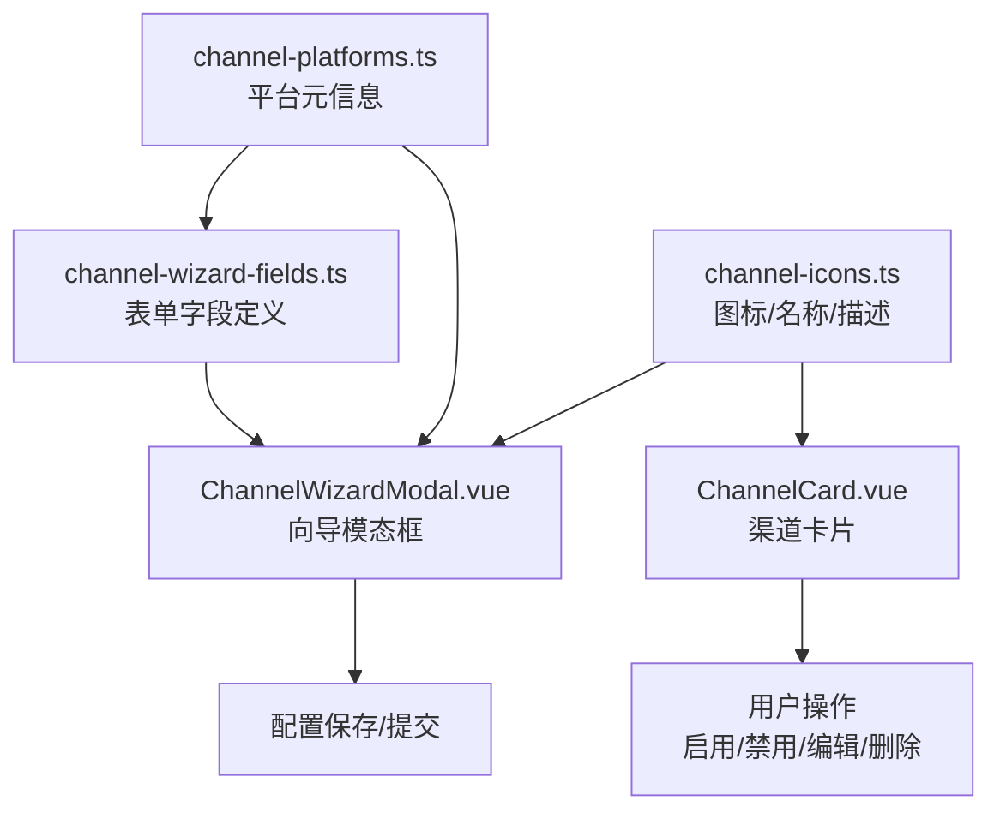
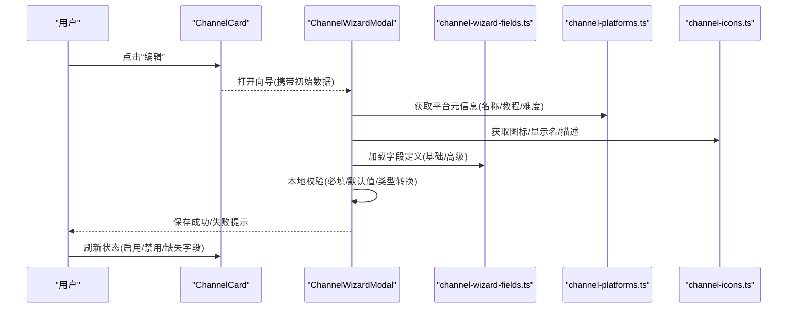
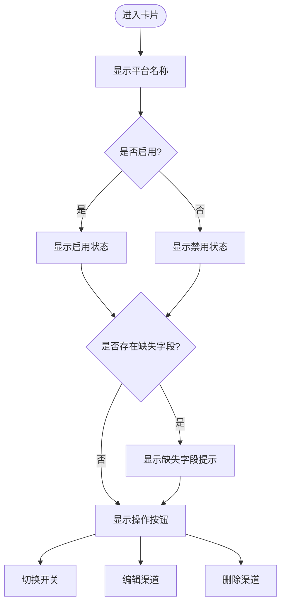
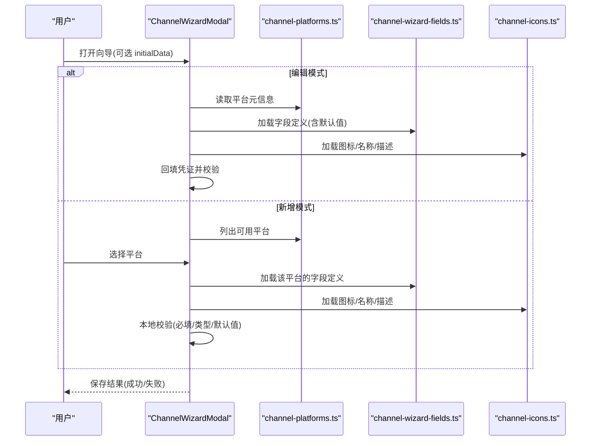
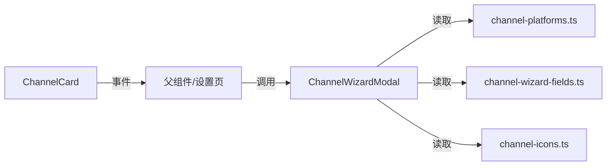

# 渠道配置界面

<cite>
**本文引用的文件**
- [channel-platforms.ts](file://agent-diva-gui/src/components/settings/channel-platforms.ts)
- [channel-wizard-fields.ts](file://agent-diva-gui/src/components/settings/channel-wizard-fields.ts)
- [channel-icons.ts](file://agent-diva-gui/src/components/settings/channel-icons.ts)
- [ChannelCard.test.ts](file://agent-diva-gui/src/components/settings/ChannelCard.test.ts)
- [ChannelWizardModal.test.ts](file://agent-diva-gui/src/components/settings/ChannelWizardModal.test.ts)
</cite>

## 目录
1. [简介](#简介)
2. [项目结构](#项目结构)
3. [核心组件](#核心组件)
4. [架构总览](#架构总览)
5. [详细组件分析](#详细组件分析)
6. [依赖关系分析](#依赖关系分析)
7. [性能与可用性考虑](#性能与可用性考虑)
8. [故障排查指南](#故障排查指南)
9. [结论](#结论)
10. [附录：各平台配置示例与常见问题](#附录各平台配置示例与常见问题)

## 简介
本文件面向“多渠道接入”的渠道配置界面，聚焦于 Telegram、Discord、QQ、钉钉等平台的接入配置。文档围绕 ChannelCard 组件与 ChannelWizardModal 向导模态框的实现，系统说明以下主题：
- 多渠道支持的配置管理（平台定义、字段定义、图标与展示）
- 认证流程、状态监控与错误处理（基于前端校验与后端状态反馈）
- 渠道能力检测与兼容性检查（必填字段、默认值、高级选项）
- 配置验证、测试连接与日志查看（前端表单校验与提示）
- 各平台的具体配置示例与常见问题解决方案

## 项目结构
渠道配置相关的前端实现集中在 GUI 的设置模块中，采用“数据驱动 + 向导式表单”的组织方式：
- 平台元信息：channel-platforms.ts 定义了各平台的名称、难度、接入方式、教程路径、快速引导步骤以及必填字段来源
- 表单字段定义：channel-wizard-fields.ts 统一声明了所有平台的凭证字段、类型、是否必填、默认值、分组（基础/高级）、选项等
- 图标与展示：channel-icons.ts 提供平台图标、显示名与描述映射，用于卡片和向导中的视觉呈现
- 组件与交互：ChannelCard.vue 负责展示单个渠道的状态与操作；ChannelWizardModal.vue 负责新增/编辑渠道的向导流程
- 测试用例：ChannelCard.test.ts 与 ChannelWizardModal.test.ts 覆盖了关键交互与边界行为



图表来源
- [channel-platforms.ts:40-147](file://agent-diva-gui/src/components/settings/channel-platforms.ts#L40-L147)
- [channel-wizard-fields.ts:25-401](file://agent-diva-gui/src/components/settings/channel-wizard-fields.ts#L25-L401)
- [channel-icons.ts:19-53](file://agent-diva-gui/src/components/settings/channel-icons.ts#L19-L53)

章节来源
- [channel-platforms.ts:1-175](file://agent-diva-gui/src/components/settings/channel-platforms.ts#L1-L175)
- [channel-wizard-fields.ts:1-511](file://agent-diva-gui/src/components/settings/channel-wizard-fields.ts#L1-L511)
- [channel-icons.ts:1-54](file://agent-diva-gui/src/components/settings/channel-icons.ts#L1-L54)

## 核心组件
- ChannelCard 组件
  - 职责：展示渠道名称、启用/禁用状态、缺失字段提示，并提供切换、编辑、删除等操作
  - 交互：点击触发 toggle/edit/delete 事件，由上层容器处理
  - 状态：根据传入的 status 对象渲染 missing_fields 提示
  - 参考测试覆盖：[ChannelCard.test.ts:29-65](file://agent-diva-gui/src/components/settings/ChannelCard.test.ts#L29-L65)

- ChannelWizardModal 向导模态框
  - 职责：新增或编辑渠道配置的向导流程，支持选择平台、填写凭证、高级选项、保存与关闭
  - 行为：编辑模式自动回填凭证；新增模式从平台选择开始；关闭后重置状态避免残留凭证
  - 参考测试覆盖：[ChannelWizardModal.test.ts:42-86](file://agent-diva-gui/src/components/settings/ChannelWizardModal.test.ts#L42-L86)

章节来源
- [ChannelCard.test.ts:29-65](file://agent-diva-gui/src/components/settings/ChannelCard.test.ts#L29-L65)
- [ChannelWizardModal.test.ts:42-86](file://agent-diva-gui/src/components/settings/ChannelWizardModal.test.ts#L42-L86)

## 架构总览
渠道配置界面的整体架构以“平台元信息 + 表单字段定义”为核心，驱动 UI 渲染与校验逻辑。向导模态框在新增/编辑时动态加载对应平台的字段集，并进行本地校验；卡片视图则展示当前渠道状态与缺失项提示。



图表来源
- [channel-platforms.ts:40-147](file://agent-diva-gui/src/components/settings/channel-platforms.ts#L40-L147)
- [channel-wizard-fields.ts:25-401](file://agent-diva-gui/src/components/settings/channel-wizard-fields.ts#L25-L401)
- [channel-icons.ts:19-53](file://agent-diva-gui/src/components/settings/channel-icons.ts#L19-L53)

## 详细组件分析

### ChannelCard 组件
- 展示内容
  - 平台显示名：优先使用平台映射，未知平台回退到原始名称
  - 启用状态：根据 enabled 字段显示启用/禁用文案
  - 缺失字段：根据 status.missing_fields 展示缺少的字段键名
- 交互行为
  - 切换：触发 toggle 事件，用于启用/禁用渠道
  - 编辑：触发 edit 事件，打开向导进行编辑
  - 删除：触发 delete 事件，用于移除渠道
- 可访问性与国际化
  - 文案通过 i18n 键渲染，便于多语言扩展



图表来源
- [ChannelCard.test.ts:29-65](file://agent-diva-gui/src/components/settings/ChannelCard.test.ts#L29-L65)

章节来源
- [ChannelCard.test.ts:29-65](file://agent-diva-gui/src/components/settings/ChannelCard.test.ts#L29-L65)

### ChannelWizardModal 向导模态框
- 初始化与模式
  - 编辑模式：当 initialData 存在时，自动填充凭证并跳过平台选择步骤
  - 新增模式：从平台选择开始，清空历史凭证
- 字段渲染与校验
  - 根据平台加载字段定义，区分基础与高级分组
  - 对 string-list、boolean、number 等类型进行规范化与默认值处理
  - 必填字段校验：未填写或缺失时阻止提交并提示
- 用户体验
  - 关闭后重置状态，避免残留凭证影响下一次新增
  - 提供教程链接与快速引导步骤，降低配置门槛



图表来源
- [channel-platforms.ts:40-147](file://agent-diva-gui/src/components/settings/channel-platforms.ts#L40-L147)
- [channel-wizard-fields.ts:25-401](file://agent-diva-gui/src/components/settings/channel-wizard-fields.ts#L25-L401)
- [channel-icons.ts:19-53](file://agent-diva-gui/src/components/settings/channel-icons.ts#L19-L53)

章节来源
- [ChannelWizardModal.test.ts:42-86](file://agent-diva-gui/src/components/settings/ChannelWizardModal.test.ts#L42-L86)

### 平台信息与字段定义
- 平台元信息（channel-platforms.ts）
  - 包含名称、显示名、教程路径、难度星级、是否需要公网 IP、接入方式、快速引导步骤
  - 提供 getRequiredFields 与 validateConfig 工具函数，用于必填字段提取与完整性校验
- 表单字段定义（channel-wizard-fields.ts）
  - 统一字段模型：key、label、type、secret、placeholder、required、default、hint、group、options
  - 按平台组织字段集合，支持基础/高级分组
  - 提供字段默认值生成、分组过滤、列表拆分/合并、类型强制转换、配置规范化等工具函数

```mermaid
classDiagram
class ChannelPlatformInfo {
+string name
+string displayName
+string tutorialPath
+difficulty difficulty
+boolean requiresPublicIP
+string accessMethod
+WizardFormField[] credentialFields
+string[] quickGuideSteps
}
class WizardFormField {
+string key
+string label
+string type
+boolean secret
+string placeholder
+boolean required
+unknown default
+string hint
+string group
+{label,value}[] options
}
ChannelPlatformInfo --> WizardFormField : "包含"
```

图表来源
- [channel-platforms.ts:9-18](file://agent-diva-gui/src/components/settings/channel-platforms.ts#L9-L18)
- [channel-wizard-fields.ts:7-18](file://agent-diva-gui/src/components/settings/channel-wizard-fields.ts#L7-L18)

章节来源
- [channel-platforms.ts:1-175](file://agent-diva-gui/src/components/settings/channel-platforms.ts#L1-L175)
- [channel-wizard-fields.ts:1-511](file://agent-diva-gui/src/components/settings/channel-wizard-fields.ts#L1-L511)

### 图标与展示映射
- channel-icons.ts 提供：
  - PLATFORM_ICONS：平台到 Vue 图标组件的映射
  - PLATFORM_DISPLAY_NAMES：平台到显示名的映射
  - PLATFORM_DESCRIPTIONS：平台到描述的映射
- 用途：
  - 卡片视图与向导中选择平台时的视觉呈现
  - 提升用户对不同平台的识别度

章节来源
- [channel-icons.ts:1-54](file://agent-diva-gui/src/components/settings/channel-icons.ts#L1-L54)

## 依赖关系分析
- 组件依赖
  - ChannelCard 依赖平台显示名与状态信息，并通过事件与父组件通信
  - ChannelWizardModal 依赖平台元信息、字段定义与图标映射，完成向导流程
- 数据流
  - 平台元信息决定向导步骤与展示文案
  - 字段定义决定表单渲染、校验规则与默认值
  - 图标映射决定视觉一致性
- 耦合与内聚
  - 平台与字段解耦：新增平台只需在元信息与字段定义中添加条目
  - 组件职责清晰：卡片仅负责展示与动作触发，向导负责复杂流程与校验



图表来源
- [channel-platforms.ts:40-147](file://agent-diva-gui/src/components/settings/channel-platforms.ts#L40-L147)
- [channel-wizard-fields.ts:25-401](file://agent-diva-gui/src/components/settings/channel-wizard-fields.ts#L25-L401)
- [channel-icons.ts:19-53](file://agent-diva-gui/src/components/settings/channel-icons.ts#L19-L53)

章节来源
- [channel-platforms.ts:1-175](file://agent-diva-gui/src/components/settings/channel-platforms.ts#L1-L175)
- [channel-wizard-fields.ts:1-511](file://agent-diva-gui/src/components/settings/channel-wizard-fields.ts#L1-L511)
- [channel-icons.ts:1-54](file://agent-diva-gui/src/components/settings/channel-icons.ts#L1-L54)

## 性能与可用性考虑
- 表单渲染性能
  - 字段定义集中管理，按需加载，减少重复计算
  - 类型强制转换与默认值预置，降低运行时分支判断
- 可用性优化
  - 基础/高级分组，降低新手用户的认知负担
  - 必填字段高亮与缺失提示，提高配置成功率
  - 教程链接与快速引导步骤，缩短上手时间
- 可扩展性
  - 新增平台仅需添加元信息与字段定义，无需改动组件逻辑
  - 图标与描述映射独立维护，便于品牌化与本地化

## 故障排查指南
- 常见配置问题
  - 必填字段缺失：使用 validateConfig 与 getRequiredFields 检查，确保 token/app_id/client_id 等关键字段已填写
  - 类型不匹配：利用 coerceChannelFieldValue 与字段类型定义，确保 boolean/number/string-list 正确转换
  - 默认值未生效：确认字段定义中包含 default，并在 normalizeChannelConfig 中应用
- 状态与错误提示
  - 卡片视图根据 status.missing_fields 显示缺失字段键名，定位具体配置项
  - 向导模态框在保存前进行本地校验，失败时给出明确提示
- 调试建议
  - 检查平台元信息是否正确（名称、接入方式、教程路径）
  - 核对字段分组与选项，确保高级选项仅在需要时暴露
  - 关注测试用例覆盖的关键交互，如编辑模式回填、新增模式清空状态

章节来源
- [channel-wizard-fields.ts:403-511](file://agent-diva-gui/src/components/settings/channel-wizard-fields.ts#L403-L511)
- [channel-platforms.ts:150-175](file://agent-diva-gui/src/components/settings/channel-platforms.ts#L150-L175)
- [ChannelCard.test.ts:47-65](file://agent-diva-gui/src/components/settings/ChannelCard.test.ts#L47-L65)
- [ChannelWizardModal.test.ts:42-86](file://agent-diva-gui/src/components/settings/ChannelWizardModal.test.ts#L42-L86)

## 结论
渠道配置界面通过“平台元信息 + 表单字段定义”的数据驱动模式，实现了多渠道接入的统一配置体验。ChannelCard 与 ChannelWizardModal 分别承担状态展示与向导流程的职责，结合图标映射与本地校验，提供了直观、易用且可扩展的配置能力。未来可在后端集成更丰富的能力检测与连通性测试，进一步提升配置成功率与运维效率。

## 附录：各平台配置示例与常见问题

### Telegram
- 接入方式：Long Polling
- 必填字段：token
- 快速引导：创建 Bot、获取 Token
- 常见问题：Token 无效或未启用机器人；允许的用户 ID 列表为空表示不限制

章节来源
- [channel-platforms.ts:41-55](file://agent-diva-gui/src/components/settings/channel-platforms.ts#L41-L55)
- [channel-wizard-fields.ts:26-50](file://agent-diva-gui/src/components/settings/channel-wizard-fields.ts#L26-L50)

### Discord
- 接入方式：WebSocket Gateway
- 必填字段：token
- 快速引导：开发者门户创建应用、生成 Bot Token
- 常见问题：Gateway URL 或 Intents 配置不正确；服务器 ID 限制导致消息无法接收

章节来源
- [channel-platforms.ts:56-70](file://agent-diva-gui/src/components/settings/channel-platforms.ts#L56-L70)
- [channel-wizard-fields.ts:51-112](file://agent-diva-gui/src/components/settings/channel-wizard-fields.ts#L51-L112)

### 飞书
- 接入方式：WebSocket 长连接
- 必填字段：app_id、app_secret
- 快速引导：企业自建应用、获取 App ID/Secret、开启机器人能力
- 常见问题：Verification Token/Encrypt Key 未配置；端口仅在 Webhook 模式需要

章节来源
- [channel-platforms.ts:71-86](file://agent-diva-gui/src/components/settings/channel-platforms.ts#L71-L86)
- [channel-wizard-fields.ts:113-159](file://agent-diva-gui/src/components/settings/channel-wizard-fields.ts#L113-L159)

### 钉钉
- 接入方式：Stream 模式 (WebSocket)
- 必填字段：client_id、client_secret
- 快速引导：企业内部应用、开启机器人功能、选择 Stream 模式
- 常见问题：私聊/群聊策略与白名单配置不当；机器人代码未设置导致功能受限

章节来源
- [channel-platforms.ts:87-102](file://agent-diva-gui/src/components/settings/channel-platforms.ts#L87-L102)
- [channel-wizard-fields.ts:160-212](file://agent-diva-gui/src/components/settings/channel-wizard-fields.ts#L160-L212)

### QQ
- 接入方式：QQ 开放平台 API
- 必填字段：app_id、secret
- 快速引导：创建机器人应用、获取 AppID/Secret、配置权限
- 常见问题：沙箱环境未配置；允许的用户 ID 列表为空表示不限制

章节来源
- [channel-platforms.ts:118-132](file://agent-diva-gui/src/components/settings/channel-platforms.ts#L118-L132)
- [channel-wizard-fields.ts:354-377](file://agent-diva-gui/src/components/settings/channel-wizard-fields.ts#L354-L377)

### Email
- 接入方式：IMAP/SMTP
- 必填字段：imap_host、imap_port、imap_username、imap_password、smtp_host、smtp_port、smtp_username、smtp_password、from_address
- 快速引导：开启 IMAP/SMTP、生成应用专用密码
- 常见问题：SSL/TLS 配置错误；授权未授予；自动回复与轮询间隔影响性能

章节来源
- [channel-platforms.ts:103-117](file://agent-diva-gui/src/components/settings/channel-platforms.ts#L103-L117)
- [channel-wizard-fields.ts:213-353](file://agent-diva-gui/src/components/settings/channel-wizard-fields.ts#L213-L353)

### Neuro-Link
- 接入方式：WebSocket 服务
- 必填字段：host、port
- 快速引导：配置监听地址与端口、启动服务
- 常见问题：端口占用或防火墙拦截；允许的客户端列表为空表示不限制

章节来源
- [channel-platforms.ts:133-147](file://agent-diva-gui/src/components/settings/channel-platforms.ts#L133-L147)
- [channel-wizard-fields.ts:378-401](file://agent-diva-gui/src/components/settings/channel-wizard-fields.ts#L378-L401)