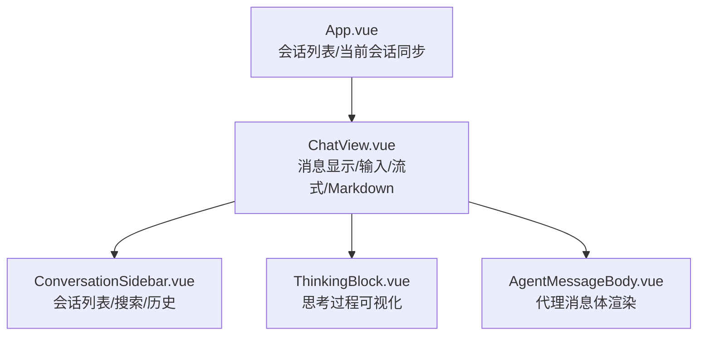
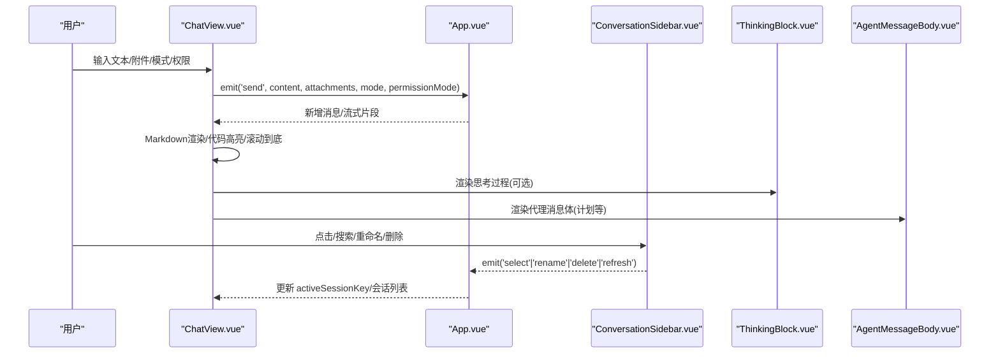
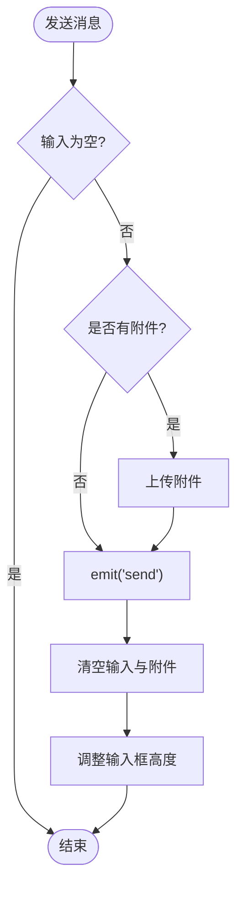
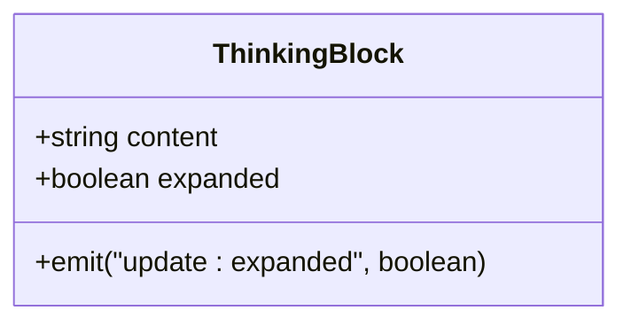
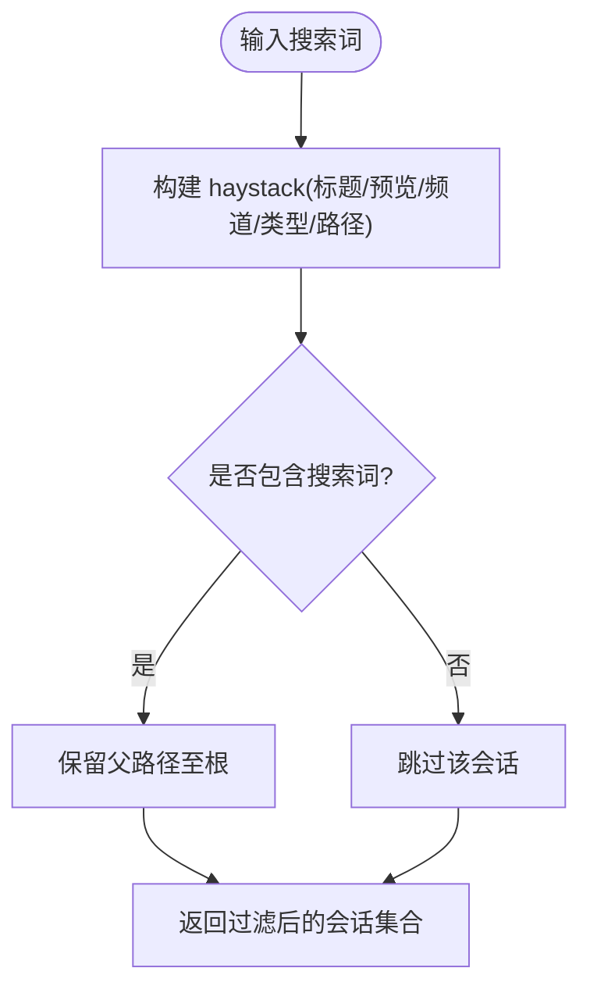
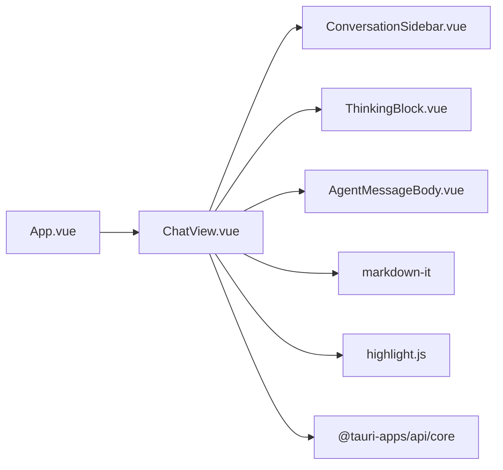

# 聊天界面模块

<cite>
**本文引用的文件**
- [ChatView.vue](file://agent-diva-gui/src/components/ChatView.vue)
- [ConversationSidebar.vue](file://agent-diva-gui/src/components/ConversationSidebar.vue)
- [ThinkingBlock.vue](file://agent-diva-gui/src/components/chat/ThinkingBlock.vue)
- [ThinkingBlock.test.ts](file://agent-diva-gui/src/components/chat/ThinkingBlock.test.ts)
- [AgentMessageBody.vue](file://agent-diva-gui/src/components/planning/AgentMessageBody.vue)
- [App.vue](file://agent-diva-gui/src/App.vue)
</cite>

## 目录
1. [简介](#简介)
2. [项目结构](#项目结构)
3. [核心组件](#核心组件)
4. [架构总览](#架构总览)
5. [详细组件分析](#详细组件分析)
6. [依赖关系分析](#依赖关系分析)
7. [性能考虑](#性能考虑)
8. [故障排查指南](#故障排查指南)
9. [结论](#结论)
10. [附录：接口与使用示例](#附录接口与使用示例)

## 简介
本模块为 Agent-Diva 桌面端的聊天界面，负责消息展示、用户输入处理、流式响应渲染、思考过程可视化（ThinkingBlock）、会话侧边栏（搜索、历史、层级组织）以及 Markdown 与代码高亮等能力。整体采用 Vue 单文件组件组织，通过事件与父级 App 进行通信，结合 Tauri 调用后端能力完成会话重置、文件上传等操作。

## 项目结构
- ChatView.vue：主聊天视图，承载消息列表、输入区、模式切换、权限模式、附件上传、滚动跟随、Markdown 渲染、工具卡片与治理卡片等。
- ConversationSidebar.vue：会话侧边栏，提供工作区分组、频道分组、层级树投影、搜索过滤、重命名、置顶、删除、刷新等。
- ThinkingBlock.vue：思考过程可视化组件，支持展开/收起与受控展开状态。
- AgentMessageBody.vue：代理消息体渲染，用于将特定内容（如计划块）拆分为独立的消息区块。
- App.vue：应用入口之一，维护会话列表、当前会话同步、标题生成与排序等。

图表来源
- [App.vue:824-866](file://agent-diva-gui/src/App.vue#L824-L866)
- [ChatView.vue:1-120](file://agent-diva-gui/src/components/ChatView.vue#L1-L120)
- [ConversationSidebar.vue:1-120](file://agent-diva-gui/src/components/ConversationSidebar.vue#L1-L120)
- [ThinkingBlock.vue](file://agent-diva-gui/src/components/chat/ThinkingBlock.vue)
- [AgentMessageBody.vue](file://agent-diva-gui/src/components/planning/AgentMessageBody.vue)

章节来源
- [App.vue:824-866](file://agent-diva-gui/src/App.vue#L824-L866)
- [ChatView.vue:1-120](file://agent-diva-gui/src/components/ChatView.vue#L1-L120)
- [ConversationSidebar.vue:1-120](file://agent-diva-gui/src/components/ConversationSidebar.vue#L1-L120)

## 核心组件
- ChatView.vue
  - 消息模型与渲染：定义 Message 类型，区分 user/agent/system/tool 角色，支持 reasoning、isThinking、isStreaming、toolStatus、rawMeta 等字段；根据角色与状态选择不同渲染路径。
  - 输入处理：发送消息、粘贴图片上传、附件管理、自动高度调整、Enter 发送、Shift+Enter 换行。
  - 流式响应：监听消息变化并滚动到底部；在 agent/system 且 isStreaming 时显示加载点与光标；对结构化内容（如计划）进行拆分渲染。
  - Markdown 与代码高亮：使用 markdown-it 并启用 linkify/breaks，禁用 HTML 防 XSS；通过 highlight.js 实现代码高亮，失败时回退到转义文本。
  - 交互与状态：模式菜单（agent/plan/ask）、权限模式（cautious/smart/trusted）、清理模式（cleanMode）影响默认展开策略。
  - 错误处理：统一 normalizeError，捕获上传/重置/触发自动化任务异常并提示。
- ConversationSidebar.vue
  - 会话层级：按 workspace -> channel -> session 构建只读层级投影，支持折叠/展开。
  - 搜索过滤：基于 title、last_message、snippet、branch_label、channel、kind、legacy、sessionPathText 等多字段模糊匹配，命中时保留父路径。
  - 操作：新建会话、重命名、置顶/取消置顶、删除、刷新；右键上下文菜单。
- ThinkingBlock.vue
  - 功能：以可折叠区块展示“思考过程”，支持展开/收起按钮与受控 expanded 属性；测试覆盖展开行为与 aria 状态。
- AgentMessageBody.vue
  - 功能：接收代理消息内容，将特定结构（如 proposed_plan）拆分为独立的计划消息块，便于单独渲染与交互。

章节来源
- [ChatView.vue:62-120](file://agent-diva-gui/src/components/ChatView.vue#L62-L120)
- [ChatView.vue:45-60](file://agent-diva-gui/src/components/ChatView.vue#L45-L60)
- [ChatView.vue:423-505](file://agent-diva-gui/src/components/ChatView.vue#L423-L505)
- [ChatView.vue:527-558](file://agent-diva-gui/src/components/ChatView.vue#L527-L558)
- [ConversationSidebar.vue:130-241](file://agent-diva-gui/src/components/ConversationSidebar.vue#L130-L241)
- [ThinkingBlock.test.ts:22-58](file://agent-diva-gui/src/components/chat/ThinkingBlock.test.ts#L22-L58)
- [AgentMessageBody.vue](file://agent-diva-gui/src/components/planning/AgentMessageBody.vue)

## 架构总览
聊天界面由 ChatView 作为中心协调者，向上通过事件与 App 通信，向下组合多个子组件完成具体渲染与交互。数据流包括：
- 输入 -> 校验 -> 发送事件 -> 父级创建消息 -> 流式更新 -> 渲染与滚动
- 侧边栏选择/新建/删除 -> 事件 -> 父级更新 activeSessionKey -> ChatView 重置或加载
- 思考过程/工具结果/原始元数据 -> 根据偏好与状态控制展开

图表来源
- [ChatView.vue:423-441](file://agent-diva-gui/src/components/ChatView.vue#L423-L441)
- [ChatView.vue:367-391](file://agent-diva-gui/src/components/ChatView.vue#L367-L391)
- [ConversationSidebar.vue:277-338](file://agent-diva-gui/src/components/ConversationSidebar.vue#L277-L338)
- [App.vue:824-866](file://agent-diva-gui/src/App.vue#L824-L866)

## 详细组件分析

### ChatView.vue 分析
- 消息模型与渲染策略
  - 角色分发：user/agent/system/tool 分别走不同渲染分支；agent/system 使用 AgentMessageBody 以支持计划块拆分。
  - 流式状态：当 role 为 agent/system 且 isStreaming 且无内容时显示加载点；存在内容时显示流式光标。
  - 结构化内容：解析 toolName 与 card 数据，识别治理卡片与计划相关工具，决定是否渲染交互卡片。
- 输入与附件
  - 发送逻辑：校验空内容与附件，发送后清空输入与附件，并调整输入框高度。
  - 粘贴图片：拦截剪贴板图片项，转换为字节数组并通过 uploadFile 上传，成功后加入附件列表。
  - 文件选择：读取文件为 ArrayBuffer，转为字节数组并上传。
- Markdown 与代码高亮
  - 配置：禁用 HTML 防止 XSS，启用 linkify 与 breaks；highlight 回调中优先使用 highlight.js 高亮，失败则回退为转义文本。
- 滚动与跟随
  - 监听 messages 变化，清理展开状态，根据偏好自动展开 reasoning/tool/rawMeta，并滚动到底部；仅在靠近底部时保持跟随。
- 错误处理
  - normalizeError 统一错误对象为字符串；重置会话、触发自动化任务等异步操作均包裹 try/catch 并提示。

图表来源
- [ChatView.vue:423-441](file://agent-diva-gui/src/components/ChatView.vue#L423-L441)
- [ChatView.vue:462-505](file://agent-diva-gui/src/components/ChatView.vue#L462-L505)

章节来源
- [ChatView.vue:62-120](file://agent-diva-gui/src/components/ChatView.vue#L62-L120)
- [ChatView.vue:45-60](file://agent-diva-gui/src/components/ChatView.vue#L45-L60)
- [ChatView.vue:367-391](file://agent-diva-gui/src/components/ChatView.vue#L367-L391)
- [ChatView.vue:423-505](file://agent-diva-gui/src/components/ChatView.vue#L423-L505)
- [ChatView.vue:527-558](file://agent-diva-gui/src/components/ChatView.vue#L527-L558)

### ThinkingBlock.vue 分析
- 功能要点
  - 展示“思考过程”的可折叠区块，包含展开/收起按钮与内容区域。
  - 支持受控展开：通过 v-model:expanded 与父组件联动，测试验证了展开/收起与 aria-expanded 状态。
  - 无障碍：按钮具备 aria-expanded 属性，便于屏幕阅读器识别。
- 使用场景
  - 在 ChatView 中，当消息包含 reasoning 或处于 isThinking 状态时，可嵌入 ThinkingBlock 以可视化模型的思考过程。

图表来源
- [ThinkingBlock.vue](file://agent-diva-gui/src/components/chat/ThinkingBlock.vue)
- [ThinkingBlock.test.ts:22-58](file://agent-diva-gui/src/components/chat/ThinkingBlock.test.ts#L22-L58)

章节来源
- [ThinkingBlock.test.ts:22-58](file://agent-diva-gui/src/components/chat/ThinkingBlock.test.ts#L22-L58)

### ConversationSidebar.vue 分析
- 会话层级与投影
  - 按 workspace_id 与 channel 分组，构建 workspace -> channel -> session 的层级树；支持折叠/展开。
  - 会话路径：通过 parent_session_key 回溯父节点，形成 sessionPathText，便于搜索时保留父路径。
- 搜索与过滤
  - 多字段模糊匹配：title、last_message、snippet、branch_label、channel、kind、legacy、sessionPathText。
  - 命中 child 时自动保留其父级路径，确保层级可见性。
- 交互与状态
  - 新建会话、重命名（内联编辑）、置顶/取消置顶、删除、刷新；右键上下文菜单集中操作。
  - 时间显示：相对时间格式化（刚刚、几分钟前、几小时前、几天前、日期）。

图表来源
- [ConversationSidebar.vue:130-162](file://agent-diva-gui/src/components/ConversationSidebar.vue#L130-L162)
- [ConversationSidebar.vue:118-128](file://agent-diva-gui/src/components/ConversationSidebar.vue#L118-L128)

章节来源
- [ConversationSidebar.vue:130-241](file://agent-diva-gui/src/components/ConversationSidebar.vue#L130-L241)
- [ConversationSidebar.vue:244-338](file://agent-diva-gui/src/components/ConversationSidebar.vue#L244-L338)

### AgentMessageBody.vue 分析
- 功能要点
  - 接收代理消息内容，将特定结构（如 proposed_plan）拆分为独立的计划消息块，便于单独渲染与交互。
  - 与 ChatView 配合，在 agent/system 角色下优先使用该组件进行内容分流。

章节来源
- [AgentMessageBody.vue](file://agent-diva-gui/src/components/planning/AgentMessageBody.vue)

## 依赖关系分析
- 组件耦合
  - ChatView 依赖 ConversationSidebar、ThinkingBlock、AgentMessageBody 等子组件，通过 props 与 events 解耦。
  - App 维护 sessions 与 activeSessionKey，向 ChatView 注入消息与会话上下文。
- 外部依赖
  - markdown-it：Markdown 渲染，linkify 与 breaks 增强可读性。
  - highlight.js：代码高亮，失败时回退为转义文本。
  - Tauri invoke：调用后端 reset_session 等命令。
  - Lucide Icons：图标库。
  - vue-i18n：国际化。

图表来源
- [ChatView.vue:1-35](file://agent-diva-gui/src/components/ChatView.vue#L1-L35)
- [App.vue:824-866](file://agent-diva-gui/src/App.vue#L824-L866)

章节来源
- [ChatView.vue:1-35](file://agent-diva-gui/src/components/ChatView.vue#L1-L35)
- [App.vue:824-866](file://agent-diva-gui/src/App.vue#L824-L866)

## 性能考虑
- 渲染优化
  - 使用 Map 缓存 parseCard 结果，避免重复解析 JSON，提升卡片渲染性能。
  - 仅当靠近底部时保持自动滚动，减少频繁滚动计算。
  - 清理模式下默认不展开 reasoning/tool/rawMeta，降低初始渲染复杂度。
- 输入与附件
  - 粘贴图片批量上传，减少多次 UI 更新；上传失败时局部错误提示，不影响其他附件。
- 搜索与层级
  - 搜索时构建 haystack 并一次性过滤，命中时保留父路径，避免深层嵌套导致的重绘。
- Markdown 与高亮
  - highlight.js 失败时回退为转义文本，避免异常中断渲染。

[本节为通用指导，无需引用具体文件]

## 故障排查指南
- 常见问题
  - 粘贴图片上传失败：检查 uploadFile 调用与网络状态；查看控制台错误日志。
  - 重置会话失败：检查 Tauri 命令 reset_session 是否可用；捕获异常并提示。
  - 自动化任务触发失败：normalizeError 统一错误信息，确认后端服务可用性。
- 调试建议
  - 打开浏览器控制台查看 console.error 输出。
  - 检查 ChatView 的 messages 变化与滚动行为是否符合预期。
  - 在 ConversationSidebar 中验证搜索过滤与层级投影是否正确。

章节来源
- [ChatView.vue:482-505](file://agent-diva-gui/src/components/ChatView.vue#L482-L505)
- [ChatView.vue:511-520](file://agent-diva-gui/src/components/ChatView.vue#L511-L520)
- [ChatView.vue:536-558](file://agent-diva-gui/src/components/ChatView.vue#L536-L558)

## 结论
聊天界面模块以 ChatView 为核心，整合了消息渲染、输入处理、流式响应、思考过程可视化与会话侧边栏等功能，具备良好的可扩展性与用户体验。通过 Markdown 与代码高亮、层级化会话管理、受控的思考过程展示，满足了复杂对话场景下的交互需求。建议在后续迭代中继续优化长消息渲染性能与搜索效率，并完善错误提示与可访问性。

[本节为总结，无需引用具体文件]

## 附录：接口与使用示例
- ChatView 事件与 Props
  - Props：messages、isTyping、themeMode、historyPrefs、sessions、workspaceRoot、toolsConfig、activeSessionKey、activePlanRuntime、pendingApprovalPlan、executingPlan、approvingPlan、planExecutionError、approvalCenterOpen、approvalPendingCount、askUserQuestions、compactionStatus
  - Events：send、approve-plan、resume-plan、revoke-plan、refresh-plan、refresh-sessions、clear、stop、select-session、delete-session、new-session、toggle-pin、rename-session、open-evolution、regenerate、update:approval-center-open、answer-ask-user、cancel-ask-user
- 使用示例
  - 在父组件中传入 messages 与 sessions，监听 send 事件以创建新消息；监听 select-session 以切换会话；监听 delete-session 以删除会话。
  - 在 ChatView 中，ThinkingBlock 可通过 v-model:expanded 与父组件联动，控制思考过程的展开状态。
  - 在 ConversationSidebar 中，监听 select、rename、delete、refresh 等事件，与 App 层同步会话状态。

章节来源
- [ChatView.vue:195-234](file://agent-diva-gui/src/components/ChatView.vue#L195-L234)
- [ThinkingBlock.test.ts:22-58](file://agent-diva-gui/src/components/chat/ThinkingBlock.test.ts#L22-L58)
- [ConversationSidebar.vue:56-71](file://agent-diva-gui/src/components/ConversationSidebar.vue#L56-L71)