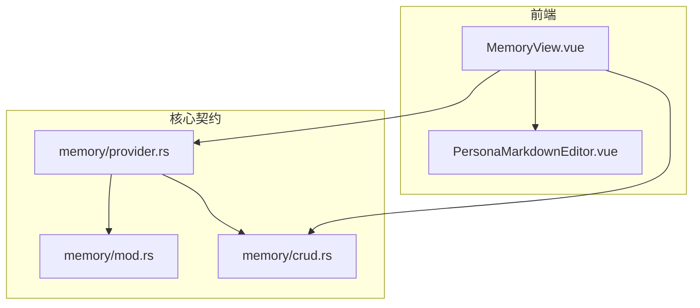
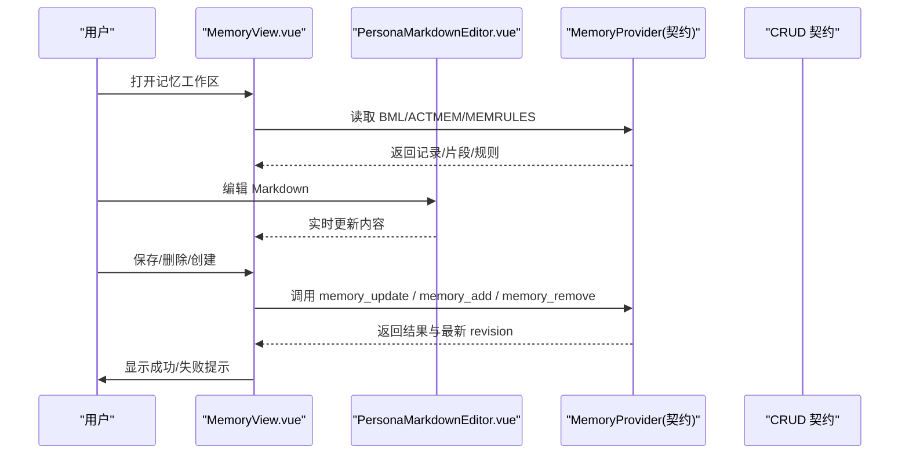
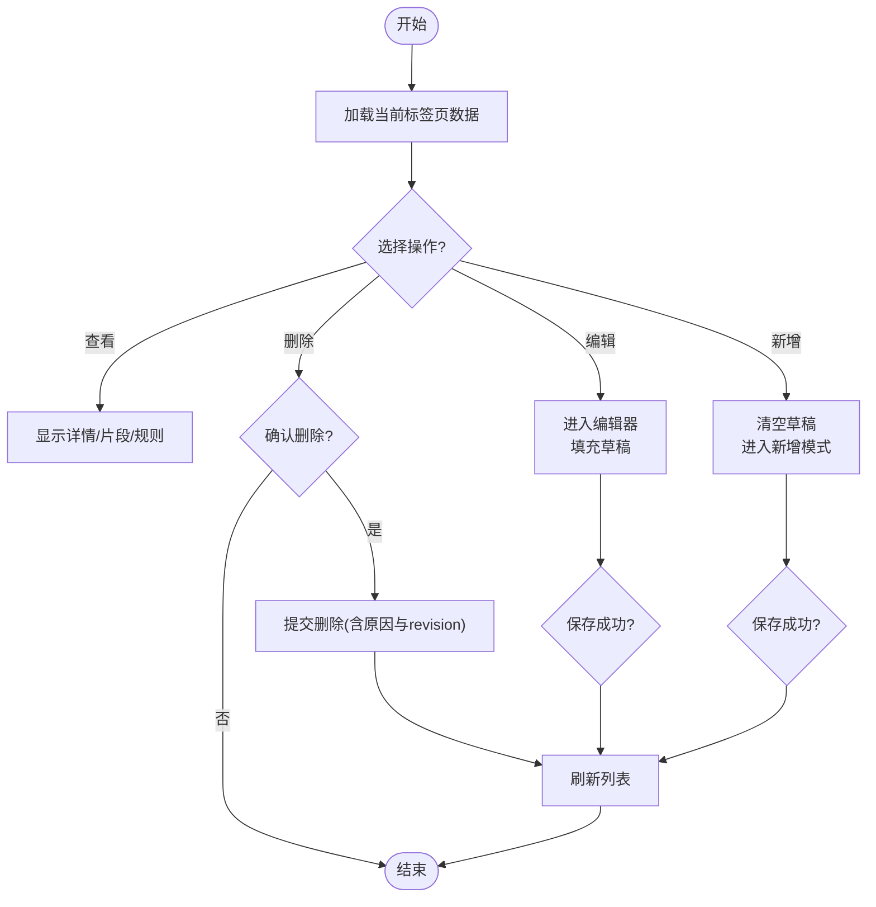
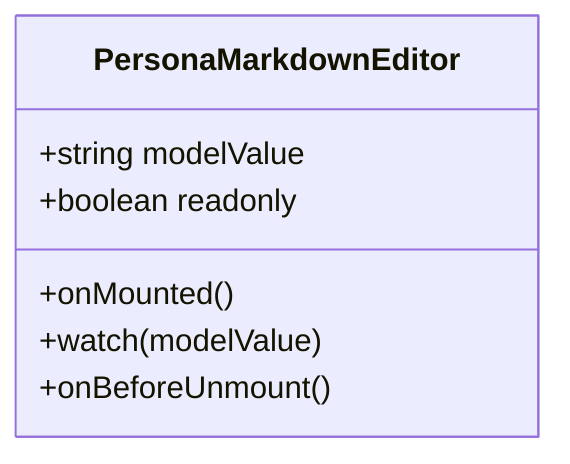
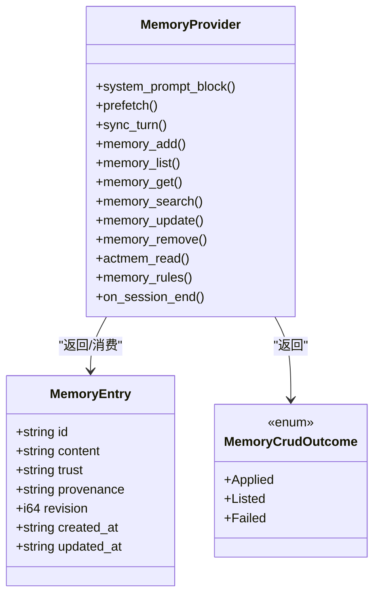
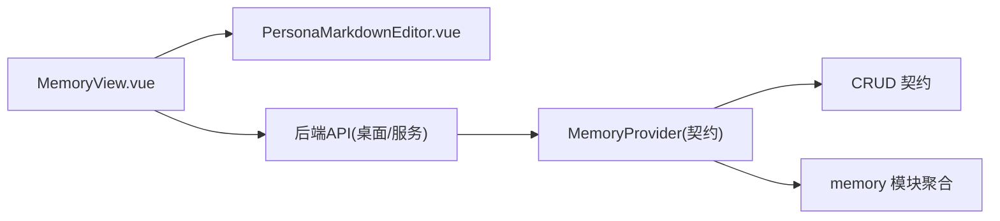

# 记忆管理界面

<cite>
**本文引用的文件**
- [MemoryView.vue](file://agent-diva-gui/src/components/memory/MemoryView.vue)
- [PersonaMarkdownEditor.vue](file://agent-diva-gui/src/components/persona-memory/PersonaMarkdownEditor.vue)
- [mod.rs](file://agent-diva-core/src/memory/mod.rs)
- [crud.rs](file://agent-diva-core/src/memory/crud.rs)
- [provider.rs](file://agent-diva-core/src/memory/provider.rs)
</cite>

## 目录
1. [简介](#简介)
2. [项目结构](#项目结构)
3. [核心组件](#核心组件)
4. [架构总览](#架构总览)
5. [详细组件分析](#详细组件分析)
6. [依赖关系分析](#依赖关系分析)
7. [性能考虑](#性能考虑)
8. [故障排查指南](#故障排查指南)
9. [结论](#结论)
10. [附录：最佳实践与使用示例](#附录最佳实践与使用示例)

## 简介
本文件面向 Agent-Diva 的记忆管理界面，聚焦于可视化的记忆查看、编辑、搜索与归档能力。文档围绕 MemoryView 组件的树形列表与详情面板、CRUD 操作与实时同步，以及 PersonaMarkdownEditor 富文本编辑器（Markdown 支持、语法高亮）展开；同时说明记忆的分类、标签与权限控制思路，并补充导入导出、版本历史与恢复的实践建议。

## 项目结构
记忆管理界面位于前端 GUI 层，核心由两个 Vue 组件构成：
- MemoryView：记忆工作区的主视图，提供 BML 记录、ACTMEM 片段与 MEMRULES 三类记忆的切换与管理。
- PersonaMarkdownEditor：基于 CodeMirror 的 Markdown 编辑器，提供行号、活跃行高亮、撤销/重做、Tab 缩进与只读模式等能力。

后端通过 agent-diva-core 暴露稳定的 MemoryProvider 契约，涵盖启动提示注入、意图感知预取、会话后同步、会话结束处理，以及面向代理的 CRUD、ACTMEM 读写与规则读取等能力。

图表来源
- [MemoryView.vue:1-417](file://agent-diva-gui/src/components/memory/MemoryView.vue#L1-L417)
- [PersonaMarkdownEditor.vue:1-59](file://agent-diva-gui/src/components/persona-memory/PersonaMarkdownEditor.vue#L1-L59)
- [mod.rs:1-47](file://agent-diva-core/src/memory/mod.rs#L1-L47)
- [crud.rs:1-192](file://agent-diva-core/src/memory/crud.rs#L1-L192)
- [provider.rs:1-770](file://agent-diva-core/src/memory/provider.rs#L1-L770)

章节来源
- [MemoryView.vue:1-417](file://agent-diva-gui/src/components/memory/MemoryView.vue#L1-L417)
- [PersonaMarkdownEditor.vue:1-59](file://agent-diva-gui/src/components/persona-memory/PersonaMarkdownEditor.vue#L1-L59)
- [mod.rs:1-47](file://agent-diva-core/src/memory/mod.rs#L1-L47)
- [crud.rs:1-192](file://agent-diva-core/src/memory/crud.rs#L1-L192)
- [provider.rs:1-770](file://agent-diva-core/src/memory/provider.rs#L1-L770)

## 核心组件
- MemoryView
  - 三栏工作区：BML 记录列表与详情、ACTMEM 片段与胶囊、MEMRULES 规则。
  - 支持创建、编辑、删除记忆记录；支持 ACTMEM 各分区的编辑保存；支持规则编辑保存。
  - 使用版本号进行乐观更新（CAS），避免并发覆盖。
  - 错误统一归一化与提示，加载状态与空态展示清晰。
- PersonaMarkdownEditor
  - 基于 CodeMirror 的 Markdown 编辑器，启用行号、活跃行高亮、历史栈、默认键位与 Tab 缩进。
  - 双向绑定 modelValue，支持只读模式，主题适配应用样式。
  - 在内容变更时触发 update:modelValue，便于上层组件即时保存或预览。

章节来源
- [MemoryView.vue:1-417](file://agent-diva-gui/src/components/memory/MemoryView.vue#L1-L417)
- [PersonaMarkdownEditor.vue:1-59](file://agent-diva-gui/src/components/persona-memory/PersonaMarkdownEditor.vue#L1-L59)

## 架构总览
记忆管理界面的数据流遵循“前端 UI → 后端契约 → 存储/提供者”的分层设计：
- 前端通过 API 调用后端提供的记忆能力（列表、获取、搜索、更新、删除、ACTMEM 读写、规则读取）。
- 后端以 MemoryProvider 为稳定边界，屏蔽具体实现细节，向上返回统一的领域对象与状态。
- CRUD 请求/响应类型集中在 crud.rs，确保前后端契约一致。

图表来源
- [MemoryView.vue:1-417](file://agent-diva-gui/src/components/memory/MemoryView.vue#L1-L417)
- [PersonaMarkdownEditor.vue:1-59](file://agent-diva-gui/src/components/persona-memory/PersonaMarkdownEditor.vue#L1-L59)
- [provider.rs:415-617](file://agent-diva-core/src/memory/provider.rs#L415-L617)
- [crud.rs:12-127](file://agent-diva-core/src/memory/crud.rs#L12-L127)

## 详细组件分析

### MemoryView 组件
- 功能要点
  - 三个工作区标签页：BML、ACTMEM、MEMRULES。
  - BML 记录：列表展示、详情查看、新建、编辑、删除；使用 revision 进行 CAS 更新。
  - ACTMEM：按分区（pulse/recap/work）展示与编辑；胶囊列表与详情查看、删除。
  - MEMRULES：规则查看与编辑保存。
  - 错误与加载：统一 error 状态、loading/saving 标志、空态占位。
- 交互流程
  - 选择记录 → 获取详情 → 进入编辑 → 保存（带 base_revision）→ 刷新列表。
  - 删除记录前弹出确认与原因输入，成功后从本地列表移除并提示。
  - ACTMEM 编辑采用覆盖式保存，携带 base_revision 保证一致性。
- 数据结构
  - 记录包含 id、content、revision、provenance、updated_at 等元信息。
  - ACTMEM 包含分区内容与胶囊集合。
  - MEMRULES 包含 content 与 source。

图表来源
- [MemoryView.vue:73-276](file://agent-diva-gui/src/components/memory/MemoryView.vue#L73-L276)

章节来源
- [MemoryView.vue:1-417](file://agent-diva-gui/src/components/memory/MemoryView.vue#L1-L417)

### PersonaMarkdownEditor 组件
- 功能要点
  - 基于 CodeMirror 的 Markdown 编辑器，启用行号、活跃行高亮、历史栈、默认键位与 Tab 缩进。
  - 支持只读模式，主题与应用变量对齐。
  - 双向绑定 modelValue，内容变化时触发 update:modelValue。
- 生命周期
  - 挂载时创建 EditorView，销毁时清理实例。
  - 监听外部 modelValue 变化，避免重复写入。

图表来源
- [PersonaMarkdownEditor.vue:1-59](file://agent-diva-gui/src/components/persona-memory/PersonaMarkdownEditor.vue#L1-L59)

章节来源
- [PersonaMarkdownEditor.vue:1-59](file://agent-diva-gui/src/components/persona-memory/PersonaMarkdownEditor.vue#L1-L59)

### 后端契约与数据模型
- MemoryProvider 契约
  - 启动提示注入、系统提示刷新、意图感知预取、会话后同步、会话结束钩子。
  - 代理侧 CRUD：add/list/get/search/update/remove/distill。
  - ACTMEM 读写、完成/丢弃条目、规则读取、脉冲/回顾记录、折叠会话。
  - 会话检查点读取与写入。
- CRUD 数据模型
  - 请求：MemoryAddRequest、MemoryListRequest、MemoryGetRequest、MemorySearchRequest、MemoryUpdateRequest、MemoryRemoveRequest、MemoryDistillRequest。
  - 实体：MemoryEntry（id、content、trust、provenance、evidence_refs、revision、created_at、updated_at）。
  - 结果：MemoryCrudOutcome（applied/listed/failed）。
- 模块组织
  - mod.rs 聚合导出 actmem、crud、provider、recall、record、working 等子模块。

图表来源
- [provider.rs:415-617](file://agent-diva-core/src/memory/provider.rs#L415-L617)
- [crud.rs:12-127](file://agent-diva-core/src/memory/crud.rs#L12-L127)

章节来源
- [mod.rs:1-47](file://agent-diva-core/src/memory/mod.rs#L1-L47)
- [crud.rs:1-192](file://agent-diva-core/src/memory/crud.rs#L1-L192)
- [provider.rs:1-770](file://agent-diva-core/src/memory/provider.rs#L1-L770)

## 依赖关系分析
- 前端依赖
  - MemoryView 依赖 PersonaMarkdownEditor 用于 Markdown 编辑。
  - MemoryView 通过 API 调用后端能力（列表、获取、搜索、更新、删除、ACTMEM、规则）。
- 后端契约
  - provider.rs 定义 MemoryProvider 接口，crud.rs 定义 CRUD 请求/响应与实体。
  - mod.rs 作为聚合入口，对外暴露子模块能力。
- 耦合与内聚
  - 前端与后端通过稳定的契约解耦，便于替换实现。
  - CRUD 与 Provider 职责清晰：CRUD 专注记录级操作，Provider 负责更高层的生命周期与会话同步。

图表来源
- [MemoryView.vue:1-417](file://agent-diva-gui/src/components/memory/MemoryView.vue#L1-L417)
- [provider.rs:415-617](file://agent-diva-core/src/memory/provider.rs#L415-L617)
- [crud.rs:12-127](file://agent-diva-core/src/memory/crud.rs#L12-L127)
- [mod.rs:1-47](file://agent-diva-core/src/memory/mod.rs#L1-L47)

章节来源
- [MemoryView.vue:1-417](file://agent-diva-gui/src/components/memory/MemoryView.vue#L1-L417)
- [provider.rs:415-617](file://agent-diva-core/src/memory/provider.rs#L415-L617)
- [crud.rs:12-127](file://agent-diva-core/src/memory/crud.rs#L12-L127)
- [mod.rs:1-47](file://agent-diva-core/src/memory/mod.rs#L1-L47)

## 性能考虑
- 前端渲染
  - 列表项仅展示摘要与更新时间，减少大文本渲染开销。
  - 编辑器按需挂载与销毁，避免不必要的 DOM 与事件绑定。
- 网络与并发
  - 使用 revision 进行 CAS 更新，降低冲突重试成本。
  - 错误归一化与快速失败，避免长时间阻塞。
- 后端契约
  - Provider 方法区分同步与异步路径，避免在同步上下文中执行 I/O。
  - 预取与会话同步分离，减少不必要的全量刷新。

[本节为通用指导，不直接分析具体文件]

## 故障排查指南
- 常见问题定位
  - 列表为空：检查加载状态与错误横幅，确认后端是否返回空集或报错。
  - 保存失败：确认 revision 是否正确传递，检查后端返回的失败原因。
  - 编辑器无响应：检查 CodeMirror 实例是否已创建与销毁，确认 v-model 绑定。
- 错误处理策略
  - 前端统一将异常对象转换为字符串消息，便于用户理解。
  - 删除操作要求输入原因，便于审计与回溯。
- 调试建议
  - 观察 loading/saving 状态流转，定位卡点。
  - 在编辑器中开启行号与活跃行高亮，辅助定位格式问题。

章节来源
- [MemoryView.vue:57-276](file://agent-diva-gui/src/components/memory/MemoryView.vue#L57-L276)
- [PersonaMarkdownEditor.vue:15-51](file://agent-diva-gui/src/components/persona-memory/PersonaMarkdownEditor.vue#L15-L51)

## 结论
记忆管理界面通过清晰的组件分层与稳定的后端契约，实现了记忆记录的可视化查看、编辑、搜索与归档。MemoryView 提供直观的工作区与完善的 CRUD 流程，PersonaMarkdownEditor 提供可靠的 Markdown 编辑体验。结合版本控制的乐观更新与统一的错误处理，整体具备较好的可用性与可维护性。

[本节为总结，不直接分析具体文件]

## 附录：最佳实践与使用示例
- 记忆分类与标签
  - 建议在内容中使用结构化标题与段落，配合关键词标注，便于检索与归类。
  - 对敏感信息添加信任级别或来源标记，便于权限控制与审计。
- 权限控制
  - 通过 provenance 与 trust 字段标识来源与可信度，结合后端策略限制可见范围。
  - 对高风险操作（如删除）强制输入原因，便于追踪。
- 导入导出
  - 导出：将记忆内容以 Markdown 形式导出，保留结构与元信息。
  - 导入：校验内容格式与必要字段，批量导入时注意去重与冲突处理。
- 版本历史与恢复
  - 利用 revision 字段构建版本链，支持回滚到指定版本。
  - 删除操作采用软删除并记录原因，便于恢复与审计。
- 使用示例
  - 新建记忆：点击新增，填写内容并保存，系统自动分配 id 与初始 revision。
  - 编辑记忆：选择记录进入编辑，修改后保存，系统校验 revision 并更新。
  - 删除记忆：选择记录点击删除，输入原因确认后执行，列表即时刷新。
  - ACTMEM 编辑：选择分区进入编辑，保存后更新对应片段。
  - 规则编辑：进入 MEMRULES 编辑规则，保存后生效。

[本节为实践建议，不直接分析具体文件]