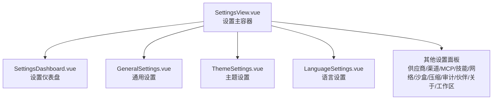
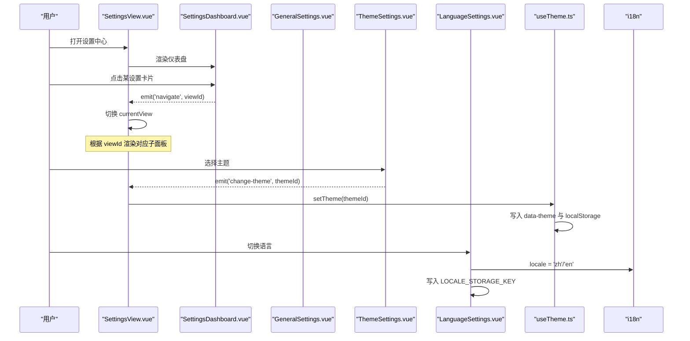
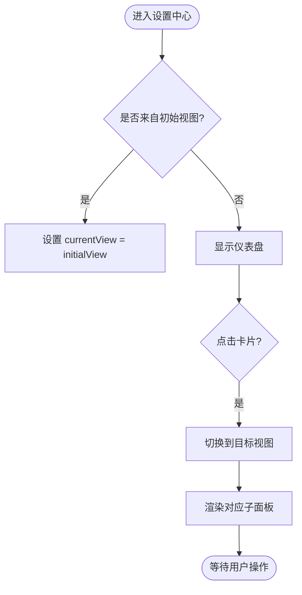
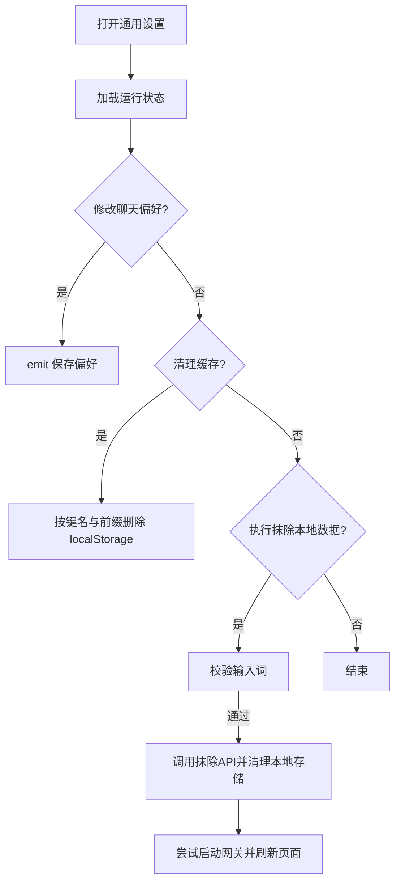
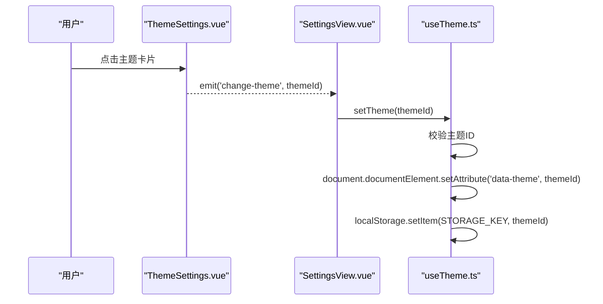
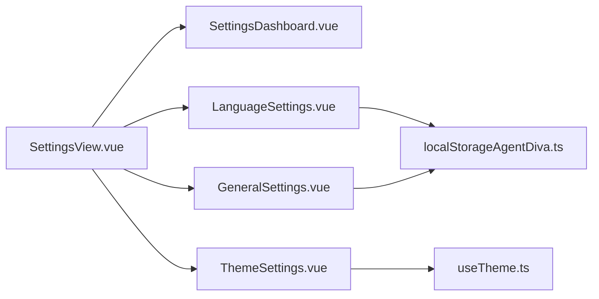

# 设置中心

<cite>
**本文引用的文件**
- [SettingsView.vue](file://agent-diva-gui/src/components/SettingsView.vue)
- [SettingsDashboard.vue](file://agent-diva-gui/src/components/settings/SettingsDashboard.vue)
- [GeneralSettings.vue](file://agent-diva-gui/src/components/settings/GeneralSettings.vue)
- [ThemeSettings.vue](file://agent-diva-gui/src/components/settings/ThemeSettings.vue)
- [LanguageSettings.vue](file://agent-diva-gui/src/components/settings/LanguageSettings.vue)
- [useTheme.ts](file://agent-diva-gui/src/composables/useTheme.ts)
- [localStorageAgentDiva.ts](file://agent-diva-gui/src/utils/localStorageAgentDiva.ts)
- [en.ts](file://agent-diva-gui/src/locales/en.ts)
- [zh.ts](file://agent-diva-gui/src/locales/zh.ts)
</cite>

## 目录
1. [简介](#简介)
2. [项目结构](#项目结构)
3. [核心组件](#核心组件)
4. [架构总览](#架构总览)
5. [详细组件分析](#详细组件分析)
6. [依赖关系分析](#依赖关系分析)
7. [性能与可维护性](#性能与可维护性)
8. [故障排查指南](#故障排查指南)
9. [结论](#结论)
10. [附录](#附录)

## 简介
本文件面向“设置中心”的全局设置管理，覆盖通用设置、主题配置、语言切换等能力；详细说明 SettingsView 主界面与各设置面板的组织方式；解释设置项的分组、验证与持久化机制；阐述主题系统的工作原理（深色模式、自定义样式、动态切换）；并给出设置导入导出、默认值管理与配置迁移的最佳实践建议。

## 项目结构
设置中心由一个主视图容器与多个子面板组成：
- 主视图容器负责路由到不同设置面板，并提供统一的标题栏与返回导航。
- 仪表盘提供入口卡片，快速跳转到各功能模块。
- 各设置面板聚焦单一领域（通用、主题、语言、供应商、渠道、网络、MCP、技能、沙盒、上下文压缩、审计、伙伴、关于、工作区）。

图表来源
- [SettingsView.vue:1-389](file://agent-diva-gui/src/components/SettingsView.vue#L1-L389)
- [SettingsDashboard.vue:1-58](file://agent-diva-gui/src/components/settings/SettingsDashboard.vue#L1-L58)

章节来源
- [SettingsView.vue:1-389](file://agent-diva-gui/src/components/SettingsView.vue#L1-L389)
- [SettingsDashboard.vue:1-58](file://agent-diva-gui/src/components/settings/SettingsDashboard.vue#L1-L58)

## 核心组件
- SettingsView：设置中心的主容器，集中管理当前视图状态、页面标题、返回逻辑，以及 Mask 编辑器弹窗。通过 props 接收上层配置与保存回调，并通过事件向上传递主题变更、聊天显示偏好更新等。
- SettingsDashboard：以卡片形式展示所有设置入口，点击后触发导航事件。
- GeneralSettings：聊天显示偏好、缓存清理、运行时状态概览、危险区域（抹除本地数据）等。
- ThemeSettings：主题选择与预览，触发父级主题切换事件。
- LanguageSettings：语言切换，持久化到本地存储。
- useTheme：主题状态、应用 data-theme、持久化到 localStorage。
- localStorageAgentDiva：本地存储键名、UI 缓存键集合、一键清除工具。

章节来源
- [SettingsView.vue:1-389](file://agent-diva-gui/src/components/SettingsView.vue#L1-L389)
- [SettingsDashboard.vue:1-58](file://agent-diva-gui/src/components/settings/SettingsDashboard.vue#L1-L58)
- [GeneralSettings.vue:1-274](file://agent-diva-gui/src/components/settings/GeneralSettings.vue#L1-L274)
- [ThemeSettings.vue:1-214](file://agent-diva-gui/src/components/settings/ThemeSettings.vue#L1-L214)
- [LanguageSettings.vue:1-61](file://agent-diva-gui/src/components/settings/LanguageSettings.vue#L1-L61)
- [useTheme.ts:1-46](file://agent-diva-gui/src/composables/useTheme.ts#L1-L46)
- [localStorageAgentDiva.ts:1-41](file://agent-diva-gui/src/utils/localStorageAgentDiva.ts#L1-L41)

## 架构总览
设置中心采用“容器 + 子面板”的分层架构：
- 容器（SettingsView）负责视图切换、标题渲染、事件派发与全局状态桥接。
- 子面板各自专注业务域，通过 props/emits 与容器通信。
- 主题与语言通过 composable 与 i18n 进行跨组件共享与持久化。
- 通用设置中的“危险区域”调用后端 API 完成数据擦除与服务重启。

图表来源
- [SettingsView.vue:1-389](file://agent-diva-gui/src/components/SettingsView.vue#L1-L389)
- [SettingsDashboard.vue:1-58](file://agent-diva-gui/src/components/settings/SettingsDashboard.vue#L1-L58)
- [ThemeSettings.vue:1-214](file://agent-diva-gui/src/components/settings/ThemeSettings.vue#L1-L214)
- [LanguageSettings.vue:1-61](file://agent-diva-gui/src/components/settings/LanguageSettings.vue#L1-L61)
- [useTheme.ts:1-46](file://agent-diva-gui/src/composables/useTheme.ts#L1-L46)

## 详细组件分析

### SettingsView 主界面
- 职责：
  - 维护当前子视图 currentView，支持从仪表盘或外部 initialView 进入特定面板。
  - 计算页面标题，统一返回按钮行为。
  - 透传各类保存回调（配置、工具配置、频道配置），并向上抛出主题变更与聊天显示偏好更新事件。
  - 管理 Mask 编辑器的弹出与关闭。
- 关键交互：
  - 仪表盘卡片点击 -> navigate 事件 -> 切换视图。
  - 主题设置 -> change-theme 事件 -> 父级处理。
  - 通用设置 -> save-chat-display-prefs 事件 -> 父级保存。

图表来源
- [SettingsView.vue:1-389](file://agent-diva-gui/src/components/SettingsView.vue#L1-L389)

章节来源
- [SettingsView.vue:1-389](file://agent-diva-gui/src/components/SettingsView.vue#L1-L389)

### 通用设置（GeneralSettings）
- 功能：
  - 聊天显示偏好：清爽模式、自动展开思考/工具详情/结构化元数据。
  - UI 缓存清理：按白名单与前缀清理本地缓存。
  - 运行时状态：读取 Doctor 健康、供应商就绪数、频道就绪数、解析路径等。
  - 危险区域：确认输入后执行抹除本地数据，可选保留语言设置，随后尝试重启网关并刷新页面。
- 验证与持久化：
  - 偏好变更通过 emit 上报父级保存。
  - 危险操作需二次确认（输入指定词），避免误删。

图表来源
- [GeneralSettings.vue:1-274](file://agent-diva-gui/src/components/settings/GeneralSettings.vue#L1-L274)
- [localStorageAgentDiva.ts:1-41](file://agent-diva-gui/src/utils/localStorageAgentDiva.ts#L1-L41)

章节来源
- [GeneralSettings.vue:1-274](file://agent-diva-gui/src/components/settings/GeneralSettings.vue#L1-L274)
- [localStorageAgentDiva.ts:1-41](file://agent-diva-gui/src/utils/localStorageAgentDiva.ts#L1-L41)

### 主题设置（ThemeSettings）与主题系统（useTheme）
- 主题设置：
  - 展示主题卡片与预览色板，选中时高亮边框与阴影。
  - 仅 love 主题提示浮动效果。
  - 通过 change-theme 事件将主题 ID 上报给父级。
- 主题系统：
  - 使用唯一主题 ID 列表进行校验，防止非法值。
  - 在根元素上设置 data-theme 属性，实现 CSS 变量与样式切换。
  - 将主题 ID 持久化到 localStorage，并在初始化时恢复。

图表来源
- [ThemeSettings.vue:1-214](file://agent-diva-gui/src/components/settings/ThemeSettings.vue#L1-L214)
- [useTheme.ts:1-46](file://agent-diva-gui/src/composables/useTheme.ts#L1-L46)

章节来源
- [ThemeSettings.vue:1-214](file://agent-diva-gui/src/components/settings/ThemeSettings.vue#L1-L214)
- [useTheme.ts:1-46](file://agent-diva-gui/src/composables/useTheme.ts#L1-L46)

### 语言设置（LanguageSettings）
- 功能：
  - 切换当前语言为 zh 或 en。
  - 将语言写入本地存储键 LOCALE_STORAGE_KEY。
  - 通过 i18n 的 locale 驱动界面文案即时切换。
- 最佳实践：
  - 切换后立即持久化，保证下次启动一致。
  - 与“危险区域”的“保留语言”选项配合，可在抹除数据时不丢失语言偏好。

章节来源
- [LanguageSettings.vue:1-61](file://agent-diva-gui/src/components/settings/LanguageSettings.vue#L1-L61)
- [localStorageAgentDiva.ts:1-41](file://agent-diva-gui/src/utils/localStorageAgentDiva.ts#L1-L41)

### 仪表盘（SettingsDashboard）
- 功能：
  - 以卡片网格展示所有设置入口，包含图标、标题与描述。
  - 点击卡片触发 navigate 事件，由 SettingsView 切换视图。
- 扩展点：
  - 新增设置项只需在卡片数组中追加条目，并在 SettingsView 中添加对应视图分支。

章节来源
- [SettingsDashboard.vue:1-58](file://agent-diva-gui/src/components/settings/SettingsDashboard.vue#L1-L58)
- [SettingsView.vue:1-389](file://agent-diva-gui/src/components/SettingsView.vue#L1-L389)

## 依赖关系分析
- SettingsView 依赖：
  - 各子面板组件（通用、主题、语言、供应商、渠道、网络、MCP、技能、沙盒、压缩、审计、伙伴、关于、工作区）。
  - i18n 用于标题与文案。
  - 类型定义（ToolsConfigShape、MaskEntryDto、WorkspaceStatus 等）。
- 主题与语言：
  - useTheme 提供主题状态与应用逻辑。
  - LanguageSettings 依赖 i18n 与本地存储键。
- 通用设置：
  - 依赖 API 获取运行状态与执行抹除、重启等操作。
  - 依赖本地存储工具进行缓存清理。

图表来源
- [SettingsView.vue:1-389](file://agent-diva-gui/src/components/SettingsView.vue#L1-L389)
- [ThemeSettings.vue:1-214](file://agent-diva-gui/src/components/settings/ThemeSettings.vue#L1-L214)
- [LanguageSettings.vue:1-61](file://agent-diva-gui/src/components/settings/LanguageSettings.vue#L1-L61)
- [GeneralSettings.vue:1-274](file://agent-diva-gui/src/components/settings/GeneralSettings.vue#L1-L274)
- [useTheme.ts:1-46](file://agent-diva-gui/src/composables/useTheme.ts#L1-L46)
- [localStorageAgentDiva.ts:1-41](file://agent-diva-gui/src/utils/localStorageAgentDiva.ts#L1-L41)

章节来源
- [SettingsView.vue:1-389](file://agent-diva-gui/src/components/SettingsView.vue#L1-L389)
- [useTheme.ts:1-46](file://agent-diva-gui/src/composables/useTheme.ts#L1-L46)
- [localStorageAgentDiva.ts:1-41](file://agent-diva-gui/src/utils/localStorageAgentDiva.ts#L1-L41)

## 性能与可维护性
- 视图切换动画：使用过渡组件减少重绘抖动，提升体验。
- 主题切换：通过 data-theme 属性批量切换样式，避免多次 DOM 操作。
- 本地存储：集中键名与清理逻辑，降低耦合度与出错概率。
- 可扩展性：仪表盘卡片与 SettingsView 的视图分支解耦，新增设置项成本低。
- 国际化：文案集中管理，便于多语言维护与一致性。

[本节为通用指导，无需具体文件引用]

## 故障排查指南
- 主题未生效：
  - 检查 useTheme 是否正确设置 data-theme 与 localStorage。
  - 确认 CSS 已监听 data-theme 并正确映射颜色变量。
- 语言切换无效：
  - 检查 i18n 的 locale 是否被正确赋值。
  - 确认 LOCALE_STORAGE_KEY 是否被写入且未被其他逻辑覆盖。
- 通用设置保存失败：
  - 检查父级保存回调是否正确绑定与调用。
  - 查看控制台错误信息，确认数据结构与类型匹配。
- 危险区域抹除失败：
  - 确认输入词校验通过。
  - 检查后端 API 是否可用，权限是否足够。
  - 若服务以系统服务运行，先停止或卸载服务再执行抹除。

章节来源
- [GeneralSettings.vue:1-274](file://agent-diva-gui/src/components/settings/GeneralSettings.vue#L1-L274)
- [useTheme.ts:1-46](file://agent-diva-gui/src/composables/useTheme.ts#L1-L46)
- [LanguageSettings.vue:1-61](file://agent-diva-gui/src/components/settings/LanguageSettings.vue#L1-L61)

## 结论
设置中心通过清晰的容器与子面板分工，实现了通用设置、主题与语言等核心能力的统一管理。主题系统基于 data-theme 与 localStorage 实现轻量而高效的动态切换；语言切换结合 i18n 与本地存储确保跨会话一致性；通用设置提供了强大的运行时状态与危险操作保护。整体架构易于扩展与维护，适合持续增加新的设置项与功能。

[本节为总结，无需具体文件引用]

## 附录

### 设置项分组与说明
- 通用设置：聊天显示偏好、缓存清理、运行时状态、危险区域。
- 主题设置：主题选择与预览、浮动效果提示。
- 语言设置：语言切换与持久化。
- 其他设置：供应商、渠道、网络、MCP、技能、沙盒、上下文压缩、审计、伙伴、关于、工作区。

章节来源
- [SettingsDashboard.vue:1-58](file://agent-diva-gui/src/components/settings/SettingsDashboard.vue#L1-L58)
- [SettingsView.vue:1-389](file://agent-diva-gui/src/components/SettingsView.vue#L1-L389)

### 验证与持久化机制
- 主题 ID 校验：限制为允许的主题集合，防止非法值。
- 语言持久化：写入 LOCALE_STORAGE_KEY，确保重启后一致。
- 通用偏好：通过事件上报父级保存，避免直接操作本地存储。
- 危险操作：二次确认与可选保留语言，降低误操作风险。

章节来源
- [useTheme.ts:1-46](file://agent-diva-gui/src/composables/useTheme.ts#L1-L46)
- [LanguageSettings.vue:1-61](file://agent-diva-gui/src/components/settings/LanguageSettings.vue#L1-L61)
- [GeneralSettings.vue:1-274](file://agent-diva-gui/src/components/settings/GeneralSettings.vue#L1-L274)
- [localStorageAgentDiva.ts:1-41](file://agent-diva-gui/src/utils/localStorageAgentDiva.ts#L1-L41)

### 主题系统工作原理
- 主题 ID 列表：限定合法主题集合。
- 应用主题：设置根节点 data-theme 属性。
- 持久化：写入 localStorage，初始化时恢复。
- 预览与提示：主题卡片展示预览与特性提示（如浮动效果）。

章节来源
- [useTheme.ts:1-46](file://agent-diva-gui/src/composables/useTheme.ts#L1-L46)
- [ThemeSettings.vue:1-214](file://agent-diva-gui/src/components/settings/ThemeSettings.vue#L1-L214)

### 设置导入导出与默认值管理
- 导入导出：
  - MCP 管理支持 JSON 导入/导出，便于批量配置与备份。
  - 供应商与渠道等复杂配置可通过 JSON 编辑器进行高级编辑。
- 默认值管理：
  - 主题默认值为 love。
  - 语言默认值由 i18n 初始化决定，可被用户覆盖。
  - 通用偏好默认值由各面板内部维护，必要时可从后端或配置文件加载。

章节来源
- [SettingsView.vue:1-389](file://agent-diva-gui/src/components/SettingsView.vue#L1-L389)
- [en.ts:164-230](file://agent-diva-gui/src/locales/en.ts#L164-L230)
- [zh.ts:164-230](file://agent-diva-gui/src/locales/zh.ts#L164-L230)

### 配置迁移与最佳实践
- 迁移策略：
  - 对旧版 key 进行兼容迁移（例如 mate 相关配置）。
  - 在合并核心与前端配置时优先保留前端覆盖值。
- 最佳实践：
  - 新增设置项时，同时补充仪表盘卡片与 SettingsView 视图分支。
  - 所有文案使用 i18n，避免硬编码。
  - 敏感操作（如抹除数据）必须二次确认，并提供回退方案。
  - 主题与语言等全局状态应集中管理，避免分散持久化。

章节来源
- [settings/mate-config.ts:58-141](file://agent-diva-gui/src/features/diva-mate/services/mate-config.ts#L58-L141)
- [SettingsDashboard.vue:1-58](file://agent-diva-gui/src/components/settings/SettingsDashboard.vue#L1-L58)
- [SettingsView.vue:1-389](file://agent-diva-gui/src/components/SettingsView.vue#L1-L389)
- [en.ts:164-230](file://agent-diva-gui/src/locales/en.ts#L164-L230)
- [zh.ts:164-230](file://agent-diva-gui/src/locales/zh.ts#L164-L230)