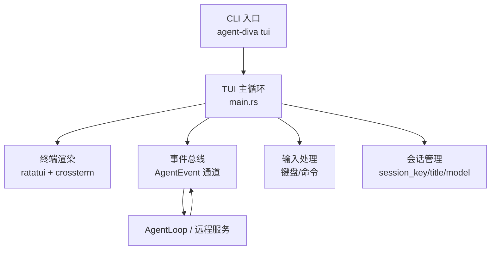
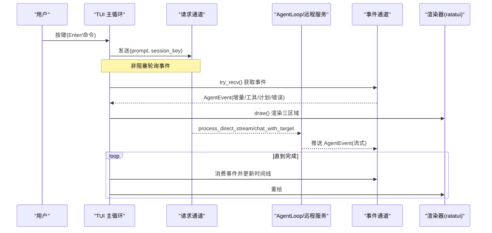
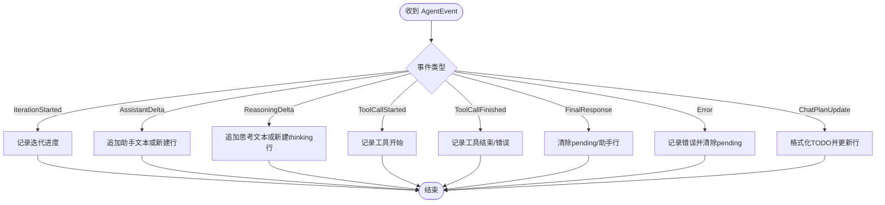
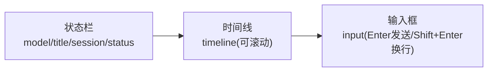
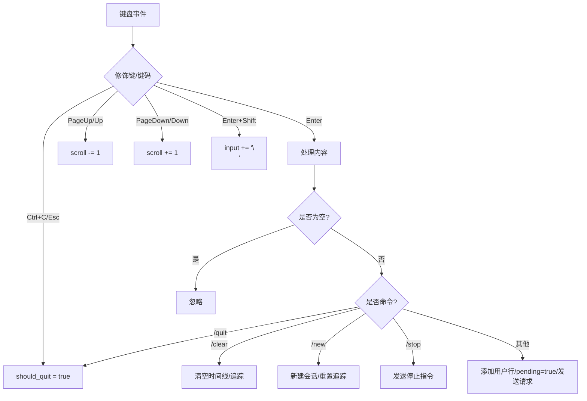
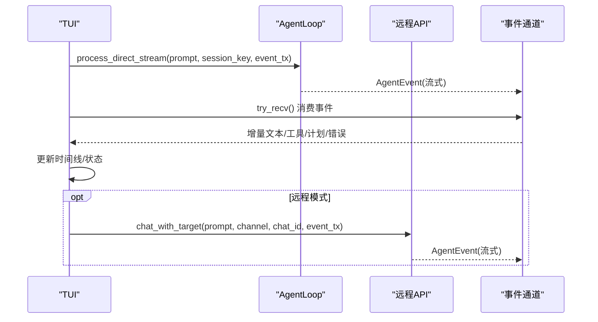
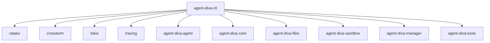

# TUI 终端界面

<cite>
**本文引用的文件**
- [agent-diva-cli/src/main.rs](file://agent-diva-cli/src/main.rs)
- [agent-diva-cli/Cargo.toml](file://agent-diva-cli/Cargo.toml)
- [agent-diva-tools/src/sanitize.rs](file://agent-diva-tools/src/sanitize.rs)
- [agent-diva-gui/src-tauri/src/commands.rs](file://agent-diva-gui/src-tauri/src/commands.rs)
</cite>

## 目录
1. [简介](#简介)
2. [项目结构](#项目结构)
3. [核心组件](#核心组件)
4. [架构总览](#架构总览)
5. [详细组件分析](#详细组件分析)
6. [依赖关系分析](#依赖关系分析)
7. [性能考虑](#性能考虑)
8. [故障排查指南](#故障排查指南)
9. [结论](#结论)
10. [附录](#附录)

## 简介
本文件面向使用 agent-diva 的 TUI（基于 ratatui）终端用户，系统性说明 TUI 模式下的聊天能力、实时消息显示、流式响应处理、布局与交互逻辑、键盘快捷键、与后端服务的通信机制和数据同步方式，以及配置选项、自定义方法与常见问题排查和性能优化建议。TUI 通过本地进程内 AgentLoop 或远程 Manager API 进行对话，支持流式增量输出、工具调用状态、计划清单更新、ask_user 问答等特性，并提供简洁易用的命令行入口。

## 项目结构
TUI 功能位于 CLI 子模块中，核心实现集中在 CLI 主程序里，负责：
- 解析命令参数并启动 TUI 循环
- 初始化终端（crossterm + ratatui）
- 维护应用状态（时间线、滚动位置、会话信息）
- 接收事件并渲染到屏幕
- 处理键盘输入与命令（发送消息、新建会话、停止、退出等）
- 与 AgentLoop 或远程服务通信以驱动对话流程

图表来源
- [agent-diva-cli/src/main.rs:154-162](file://agent-diva-cli/src/main.rs#L154-L162)
- [agent-diva-cli/src/main.rs:1363-1369](file://agent-diva-cli/src/main.rs#L1363-L1369)
- [agent-diva-cli/src/main.rs:1406-1475](file://agent-diva-cli/src/main.rs#L1406-L1475)

章节来源
- [agent-diva-cli/src/main.rs:154-162](file://agent-diva-cli/src/main.rs#L154-L162)
- [agent-diva-cli/src/main.rs:1363-1369](file://agent-diva-cli/src/main.rs#L1363-L1369)
- [agent-diva-cli/src/main.rs:1406-1475](file://agent-diva-cli/src/main.rs#L1406-L1475)

## 核心组件
- TuiApp：维护时间线、滚动位置、当前助手行索引、计划清单行索引、会话键/标题/模型、是否等待回复、ask_user 问答状态等。
- 事件处理 apply_agent_event：将 AgentEvent 转换为时间线条目，支持迭代开始、助手增量文本、思考增量、工具调用开始/结束、最终响应、错误、计划更新等。
- run_tui：TUI 主循环，负责终端初始化、绘制、事件轮询、输入处理、请求发送、退出清理。
- 命令与快捷键：Enter 发送、Shift+Enter 换行、方向键/PageUp/PageDown 滚动、Esc/Ctrl+C 退出、/new /clear /stop /quit 等命令。
- 与后端通信：本地通过 AgentLoop.process_direct_stream 流式推送事件；或通过 ApiClient.chat_with_target 走远程 Manager API。

章节来源
- [agent-diva-cli/src/main.rs:1050-1219](file://agent-diva-cli/src/main.rs#L1050-L1219)
- [agent-diva-cli/src/main.rs:1297-1556](file://agent-diva-cli/src/main.rs#L1297-L1556)
- [agent-diva-cli/src/main.rs:2175-2316](file://agent-diva-cli/src/main.rs#L2175-L2316)

## 架构总览
TUI 采用“事件驱动 + 渲染循环”的模式：
- 输入层：捕获键盘事件，解析命令或消息，发送到请求通道。
- 业务层：在后台任务中调用 AgentLoop 或远程 API，产生 AgentEvent 事件流。
- 渲染层：每帧从事件通道消费事件，更新 TuiApp 状态，再按三区域布局（状态栏、时间线、输入框）渲染。

图表来源
- [agent-diva-cli/src/main.rs:1354-1361](file://agent-diva-cli/src/main.rs#L1354-L1361)
- [agent-diva-cli/src/main.rs:1371-1373](file://agent-diva-cli/src/main.rs#L1371-L1373)
- [agent-diva-cli/src/main.rs:1406-1475](file://agent-diva-cli/src/main.rs#L1406-L1475)
- [agent-diva-cli/src/main.rs:2175-2181](file://agent-diva-cli/src/main.rs#L2175-L2181)

## 详细组件分析

### TUI 应用状态与事件处理
- 状态字段包括：输入缓冲、时间线列表、滚动偏移、助手行索引、计划清单行索引、会话键/标题/模型、是否 pending、ask_user 问答跟踪。
- apply_agent_event 将不同事件映射为时间线条目：
  - 迭代开始：记录迭代进度
  - 助手增量：追加到当前助手行或新建行
  - 思考增量：追加到 thinking 行
  - 工具调用开始/结束：记录工具名、参数预览、结果、错误标记
  - 最终响应：清除 pending 与助手行追踪
  - 错误：记录错误信息并清除 pending
  - 计划更新：格式化 TODO 清单并更新对应行

图表来源
- [agent-diva-cli/src/main.rs:1123-1219](file://agent-diva-cli/src/main.rs#L1123-L1219)

章节来源
- [agent-diva-cli/src/main.rs:1050-1219](file://agent-diva-cli/src/main.rs#L1050-L1219)

### 布局设计与渲染
- 三区域垂直布局：顶部状态栏（模型/标题/会话/状态）、中部时间线（可滚动）、底部输入框（提示操作）。
- 时间线按 kind 着色：user、assistant、tool、system、error、thinking、checklist。
- 多行文本通过 Line/Span 组合渲染，保持首行带标签前缀，后续行缩进对齐。
- 光标定位在输入框末尾。

图表来源
- [agent-diva-cli/src/main.rs:1406-1475](file://agent-diva-cli/src/main.rs#L1406-L1475)

章节来源
- [agent-diva-cli/src/main.rs:1406-1475](file://agent-diva-cli/src/main.rs#L1406-L1475)

### 交互逻辑与键盘快捷键
- 退出：Ctrl+C 或 Esc
- 滚动：PageUp/PageDown 或 Up/Down
- 输入：Enter 发送；Shift+Enter 插入换行；Backspace 删除；其他字符直接输入
- 命令：
  - /quit：退出
  - /clear：清空时间线与追踪行
  - /new：新建会话（生成新 session_key，重置追踪）
  - /stop：向运行时发送停止会话指令
- ask_user 问答：当存在待回答问题时，输入数字选择或自由文本（若允许），提交后更新状态。

图表来源
- [agent-diva-cli/src/main.rs:1477-1545](file://agent-diva-cli/src/main.rs#L1477-L1545)
- [agent-diva-cli/src/main.rs:1506-1534](file://agent-diva-cli/src/main.rs#L1506-L1534)

章节来源
- [agent-diva-cli/src/main.rs:1477-1545](file://agent-diva-cli/src/main.rs#L1477-L1545)
- [agent-diva-cli/src/main.rs:1506-1534](file://agent-diva-cli/src/main.rs#L1506-L1534)

### 与后端服务的通信机制与数据同步
- 本地模式：通过 AgentLoop.process_direct_stream 发起流式处理，事件经 mpsc 通道推送到 TUI 进行渲染。
- 远程模式：通过 ApiClient.chat_with_target 调用远程 Manager API，同样以事件形式回传。
- 会话标识：从 session_key 提取 chat_id，用于区分会话上下文。
- 数据同步：事件驱动，TUI 每帧消费事件并更新状态，保证 UI 与后端一致。

图表来源
- [agent-diva-cli/src/main.rs:1354-1361](file://agent-diva-cli/src/main.rs#L1354-L1361)
- [agent-diva-cli/src/main.rs:2175-2181](file://agent-diva-cli/src/main.rs#L2175-L2181)
- [agent-diva-cli/src/main.rs:1371-1373](file://agent-diva-cli/src/main.rs#L1371-L1373)

章节来源
- [agent-diva-cli/src/main.rs:1354-1361](file://agent-diva-cli/src/main.rs#L1354-L1361)
- [agent-diva-cli/src/main.rs:2175-2181](file://agent-diva-cli/src/main.rs#L2175-L2181)
- [agent-diva-cli/src/main.rs:1371-1373](file://agent-diva-cli/src/main.rs#L1371-L1373)

### TUI 模式的配置选项与自定义方法
- 启动参数：
  - model：指定使用的模型
  - session：指定会话键
- 运行期行为：
  - 工作区与工具配置由 CliRuntime 加载，包含执行超时、预算、MCP 服务器、Cron 服务等
  - ask_user 协调器集成，支持交互式问答
- 扩展点：
  - 可通过修改 apply_agent_event 增加新的事件类型渲染
  - 可在布局中添加新区域（如侧边栏）
  - 可自定义命令处理逻辑（如新增快捷命令）

章节来源
- [agent-diva-cli/src/main.rs:154-162](file://agent-diva-cli/src/main.rs#L154-L162)
- [agent-diva-cli/src/main.rs:1306-1348](file://agent-diva-cli/src/main.rs#L1306-L1348)
- [agent-diva-cli/src/main.rs:1123-1219](file://agent-diva-cli/src/main.rs#L1123-L1219)

## 依赖关系分析
- 外部库：
  - ratatui：终端 UI 框架
  - crossterm：终端事件与渲染后端
  - tokio：异步运行时
  - tracing/tracing-subscriber：日志与追踪
  - clap/console/dialoguer：CLI 与交互
  - reqwest/eventsource-stream：HTTP 与事件源
- 内部模块：
  - agent-diva-agent：AgentLoop、ToolConfig、RuntimeControlCommand、AgentEvent
  - agent-diva-core：MessageBus、Config、CronService、AskUserCoordinator
  - agent-diva-files：FileManager、FileConfig
  - agent-diva-sandbox：审批策略
  - agent-diva-manager：Gateway 与远程 API
  - agent-diva-tools：字符串清洗（ANSI/控制字符）

图表来源
- [agent-diva-cli/Cargo.toml:15-57](file://agent-diva-cli/Cargo.toml#L15-L57)

章节来源
- [agent-diva-cli/Cargo.toml:15-57](file://agent-diva-cli/Cargo.toml#L15-L57)

## 性能考虑
- 渲染频率：事件轮询间隔约 60ms，避免频繁重绘导致 CPU 占用过高。
- 增量更新：助手/思考文本采用追加写入，减少整段重建开销。
- 滚动优化：仅维护滚动偏移，不重建全部行。
- 文本清洗：对输出进行 ANSI 与控制字符清洗，避免渲染异常与 JSON 序列化问题。
- 资源释放：退出时恢复原始模式、离开备用屏幕、显示光标，确保终端状态正确。

章节来源
- [agent-diva-cli/src/main.rs:1477-1556](file://agent-diva-cli/src/main.rs#L1477-L1556)
- [agent-diva-tools/src/sanitize.rs:30-65](file://agent-diva-tools/src/sanitize.rs#L30-L65)

## 故障排查指南
- 无法进入 TUI：
  - 确认在非管道/非重定向的真实终端环境运行（管道关闭会导致错误）
  - 检查是否成功启用原始模式与备用屏幕
- 渲染错乱：
  - 检查输出是否包含未清洗的 ANSI/控制字符
  - 确认 Unicode 与多字节字符处理正常
- 无事件或卡死：
  - 检查事件通道是否被阻塞或消费者未及时消费
  - 确认 AgentLoop 或远程 API 是否正常返回事件
- ask_user 问答无效：
  - 确认问题仍存在且 question_id 匹配
  - 检查 choices 范围与 allow_other 设置
- 停止会话失败：
  - 检查 RuntimeControlCommand 是否正确发送
  - 查看错误日志定位原因

章节来源
- [agent-diva-cli/src/main.rs:1506-1534](file://agent-diva-cli/src/main.rs#L1506-L1534)
- [agent-diva-cli/src/main.rs:1223-1295](file://agent-diva-cli/src/main.rs#L1223-L1295)
- [agent-diva-tools/src/sanitize.rs:30-65](file://agent-diva-tools/src/sanitize.rs#L30-L65)

## 结论
TUI 提供了轻量、高效的终端交互体验，结合流式事件与清晰的三区域布局，能够直观展示对话、工具调用与计划进展。通过合理的输入处理、事件驱动渲染与后端通信机制，保证了良好的用户体验与可扩展性。配合配置项与自定义扩展点，可灵活适配不同场景需求。

## 附录
- 常用命令速查：
  - Enter：发送消息
  - Shift+Enter：换行
  - PageUp/PageDown 或 Up/Down：滚动时间线
  - Ctrl+C/Esc：退出
  - /new：新建会话
  - /clear：清空时间线
  - /stop：停止当前会话
  - /quit：退出程序
- 参考实现路径：
  - TUI 主循环与渲染：[agent-diva-cli/src/main.rs:1363-1556](file://agent-diva-cli/src/main.rs#L1363-L1556)
  - 事件处理与时间线更新：[agent-diva-cli/src/main.rs:1123-1219](file://agent-diva-cli/src/main.rs#L1123-L1219)
  - 远程聊天入口：[agent-diva-cli/src/main.rs:2175-2181](file://agent-diva-cli/src/main.rs#L2175-L2181)
  - 字符串清洗工具：[agent-diva-tools/src/sanitize.rs:30-65](file://agent-diva-tools/src/sanitize.rs#L30-L65)
  - GUI 端消息发送示例（对比参考）：[agent-diva-gui/src-tauri/src/commands.rs:1488-1505](file://agent-diva-gui/src-tauri/src/commands.rs#L1488-L1505)