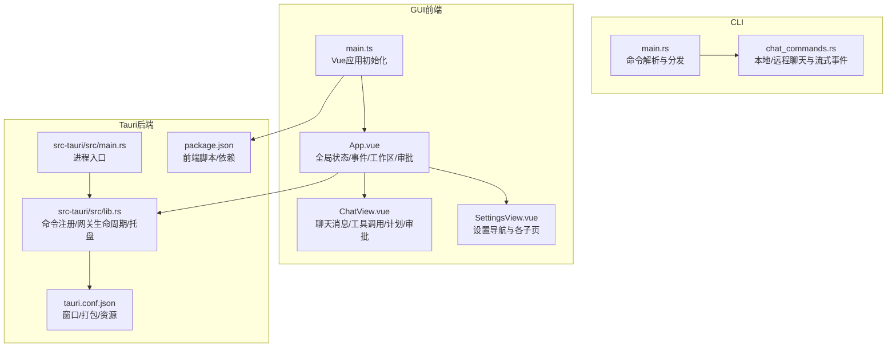
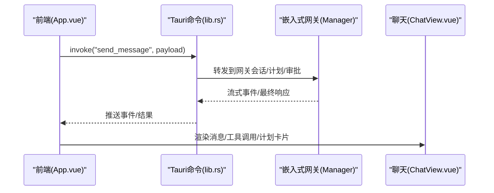
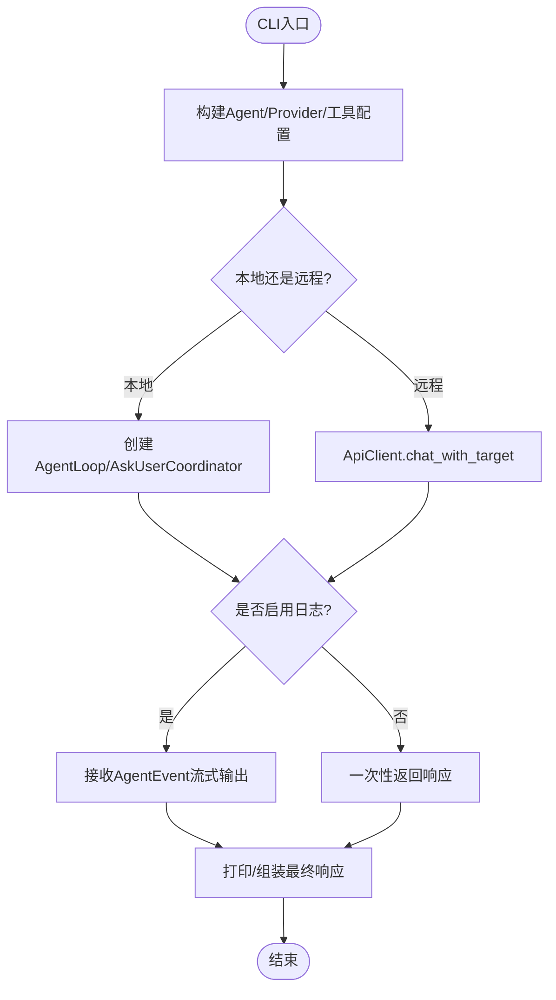
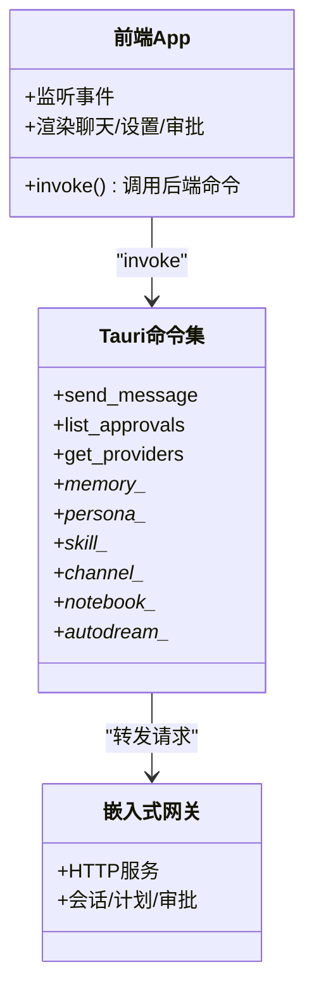
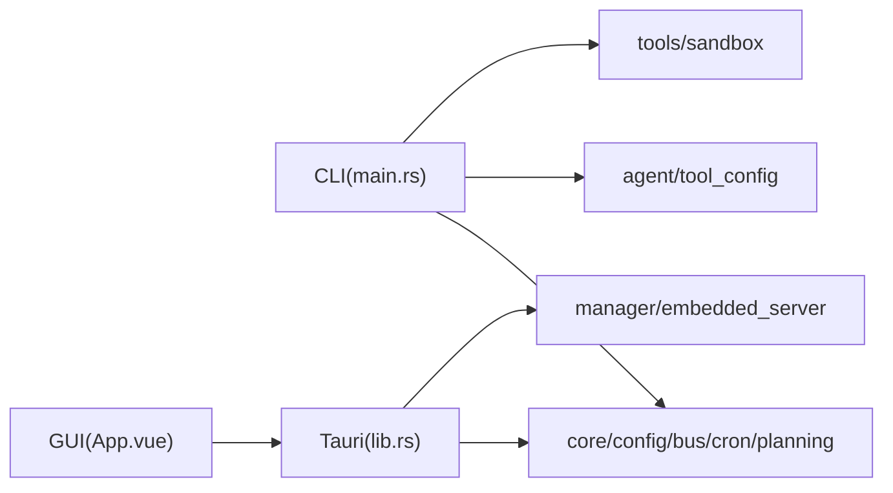

# 用户界面

<cite>
**本文引用的文件**
- [agent-diva-cli/src/main.rs](file://agent-diva-cli/src/main.rs)
- [agent-diva-cli/src/chat_commands.rs](file://agent-diva-cli/src/chat_commands.rs)
- [agent-diva-gui/src/main.ts](file://agent-diva-gui/src/main.ts)
- [agent-diva-gui/src/App.vue](file://agent-diva-gui/src/App.vue)
- [agent-diva-gui/src/components/ChatView.vue](file://agent-diva-gui/src/components/ChatView.vue)
- [agent-diva-gui/src/components/SettingsView.vue](file://agent-diva-gui/src/components/SettingsView.vue)
- [agent-diva-gui/package.json](file://agent-diva-gui/package.json)
- [agent-diva-gui/src-tauri/src/main.rs](file://agent-diva-gui/src-tauri/src/main.rs)
- [agent-diva-gui/src-tauri/src/lib.rs](file://agent-diva-gui/src-tauri/src/lib.rs)
- [agent-diva-gui/src-tauri/tauri.conf.json](file://agent-diva-gui/src-tauri/tauri.conf.json)
</cite>

## 目录
1. [简介](#简介)
2. [项目结构](#项目结构)
3. [核心组件](#核心组件)
4. [架构总览](#架构总览)
5. [详细组件分析](#详细组件分析)
6. [依赖关系分析](#依赖关系分析)
7. [性能考虑](#性能考虑)
8. [故障排查指南](#故障排查指南)
9. [结论](#结论)
10. [附录](#附录)

## 简介
本文件面向Agent Diva的用户界面层，覆盖三种交互形式：
- CLI 命令行工具：提供 agent、chat、gateway、cron、provider、config、workspace、todo、mask、channels、service、status、onboard、approvals 等命令。
- TUI 终端界面：基于 crossterm/ratatui 的交互式终端聊天与状态查看。
- GUI 桌面应用：基于 Vue 3 + Tauri 的前后端分离桌面程序，包含聊天、提供商管理、渠道配置、技能市场、记忆管理、审批中心、计划执行、日志与审计等模块。

同时说明Tauri应用的架构与前后端通信机制，并提供界面定制与主题配置指南，以及开发模式与生产构建说明。

## 项目结构
- CLI入口与命令路由位于 agent-diva-cli/src/main.rs，子命令通过 clap 定义；聊天与代理执行逻辑在 chat_commands.rs。
- GUI前端入口为 src/main.ts，主应用容器为 App.vue；聊天视图为 ChatView.vue；设置面板为 SettingsView.vue。
- Tauri后端入口为 src-tauri/src/main.rs，核心能力注册与命令绑定在 lib.rs；窗口与打包配置在 tauri.conf.json；前端脚本与依赖在 package.json。

图表来源
- [agent-diva-cli/src/main.rs:88-205](file://agent-diva-cli/src/main.rs#L88-L205)
- [agent-diva-cli/src/chat_commands.rs:79-144](file://agent-diva-cli/src/chat_commands.rs#L79-L144)
- [agent-diva-gui/src/main.ts:1-13](file://agent-diva-gui/src/main.ts#L1-L13)
- [agent-diva-gui/src/App.vue:1-120](file://agent-diva-gui/src/App.vue#L1-L120)
- [agent-diva-gui/src/components/ChatView.vue:1-60](file://agent-diva-gui/src/components/ChatView.vue#L1-L60)
- [agent-diva-gui/src/components/SettingsView.vue:1-100](file://agent-diva-gui/src/components/SettingsView.vue#L1-L100)
- [agent-diva-gui/src-tauri/src/main.rs:1-7](file://agent-diva-gui/src-tauri/src/main.rs#L1-L7)
- [agent-diva-gui/src-tauri/src/lib.rs:263-550](file://agent-diva-gui/src-tauri/src/lib.rs#L263-L550)
- [agent-diva-gui/src-tauri/tauri.conf.json:1-90](file://agent-diva-gui/src-tauri/tauri.conf.json#L1-L90)
- [agent-diva-gui/package.json:1-54](file://agent-diva-gui/package.json#L1-L54)

章节来源
- [agent-diva-cli/src/main.rs:88-205](file://agent-diva-cli/src/main.rs#L88-L205)
- [agent-diva-gui/src-tauri/src/lib.rs:263-550](file://agent-diva-gui/src-tauri/src/lib.rs#L263-L550)
- [agent-diva-gui/src-tauri/tauri.conf.json:1-90](file://agent-diva-gui/src-tauri/tauri.conf.json#L1-L90)
- [agent-diva-gui/package.json:1-54](file://agent-diva-gui/package.json#L1-L54)

## 核心组件
- CLI命令体系：通过 clap 枚举 Commands 组织子命令，包括 Onboard、Gateway、Agent、Chat、Approvals、Tui、Status、Channels、Provider、Config、Service、Cron、Workspace、Todo、Mask。
- 聊天与代理执行：支持本地 AgentLoop 与远程 Manager API 两种模式，支持流式输出、工具调用、ask_user 问答、计划执行与审批。
- GUI应用：以 Vue 3 组件化实现聊天、设置、审批中心、计划执行、记忆管理等；通过 Tauri invoke 调用 Rust 命令，Rust 侧启动或连接嵌入式网关并暴露大量能力。
- Tauri后端：负责窗口管理、系统托盘、嵌入式网关生命周期、配置与工作区、日志、审计、技能市场、MCP、渠道、记忆、自动梦境（Autodream）等命令。

章节来源
- [agent-diva-cli/src/main.rs:88-205](file://agent-diva-cli/src/main.rs#L88-L205)
- [agent-diva-cli/src/chat_commands.rs:79-144](file://agent-diva-cli/src/chat_commands.rs#L79-L144)
- [agent-diva-gui/src/App.vue:1-120](file://agent-diva-gui/src/App.vue#L1-L120)
- [agent-diva-gui/src-tauri/src/lib.rs:263-550](file://agent-diva-gui/src-tauri/src/lib.rs#L263-L550)

## 架构总览
GUI采用“前端Vue + Tauri后端”的双进程架构：
- 前端通过 @tauri-apps/api/core.invoke 调用后端命令，处理异步结果与错误。
- 后端在应用启动时可选择内嵌启动 Gateway（HTTP服务），或通过环境变量切换至外部 Gateway。
- 窗口包括主窗口、启动闪屏、桌面伙伴（透明无边框悬浮窗）。
- 系统托盘用于后台驻留与退出控制。

图表来源
- [agent-diva-gui/src/App.vue:1-120](file://agent-diva-gui/src/App.vue#L1-L120)
- [agent-diva-gui/src-tauri/src/lib.rs:263-550](file://agent-diva-gui/src-tauri/src/lib.rs#L263-L550)
- [agent-diva-gui/src/components/ChatView.vue:1-60](file://agent-diva-gui/src/components/ChatView.vue#L1-L60)

## 详细组件分析

### CLI 命令与参数
- 顶层命令
  - onboard：引导式配置初始化，可指定 provider/model/api_key/api_base/workspace，支持 force/refresh。
  - gateway：运行网关（当前仅 Run 子命令）。
  - agent：发送单条消息给代理，支持 --message/--model/--session/--markdown/--no-markdown/--logs/--no-logs/--approval-mode/--json；支持 --remote 与 --api-url。
  - chat：轻量交互式聊天，支持模型、会话、markdown、日志开关。
  - approvals：审批管理，支持 list/decide/cancel/review，支持 JSON 输出与 session 过滤。
  - tui：启动终端界面（TUI），支持 model/session。
  - status：显示状态信息，支持 JSON。
  - channels：通道登录与状态查询。
  - provider：提供商管理，支持 list/status/set/models/login。
  - config：配置管理，支持 path/init/refresh/validate/doctor/show。
  - service：Windows服务管理。
  - cron：定时任务管理，支持 add/list/remove/enable/run。
  - workspace/todo/mask：工作区、待办、面具管理。

- 关键参数要点
  - 通用：--config/--config-dir/--workspace/--remote/--api-url。
  - agent：--approval-mode 支持 headless 行为（fail/queue），--json 结构化输出。
  - chat：--markdown/--no-markdown 控制输出格式，--logs/--no-logs 控制流式日志。
  - provider set：--provider/--model/--api_key/--api_base/--json。
  - cron add：name/message/every/cron_expr/at/timezone/deliver/to/channel。

章节来源
- [agent-diva-cli/src/main.rs:88-205](file://agent-diva-cli/src/main.rs#L88-L205)
- [agent-diva-cli/src/main.rs:258-381](file://agent-diva-cli/src/main.rs#L258-L381)
- [agent-diva-cli/src/main.rs:396-439](file://agent-diva-cli/src/main.rs#L396-L439)
- [agent-diva-cli/src/main.rs:441-773](file://agent-diva-cli/src/main.rs#L441-L773)

### CLI 聊天与代理执行流程
- 本地模式：构建 Provider、Planning、AskUserCoordinator、ToolConfig、FileManager，创建 AgentLoop，支持直接处理或流式事件。
- 远程模式：通过 ApiClient 与 Manager 通信，监听 AgentEvent 流式输出。
- ask_user：后台轮询并提示用户选择或输入答案；非交互模式下取消未决问题避免阻塞。
- 审批：本地模式默认拒绝命令审批；远程模式支持队列或立即失败策略。

图表来源
- [agent-diva-cli/src/chat_commands.rs:79-144](file://agent-diva-cli/src/chat_commands.rs#L79-L144)
- [agent-diva-cli/src/chat_commands.rs:260-364](file://agent-diva-cli/src/chat_commands.rs#L260-L364)
- [agent-diva-cli/src/chat_commands.rs:466-535](file://agent-diva-cli/src/chat_commands.rs#L466-L535)
- [agent-diva-cli/src/chat_commands.rs:552-663](file://agent-diva-cli/src/chat_commands.rs#L552-L663)

章节来源
- [agent-diva-cli/src/chat_commands.rs:79-144](file://agent-diva-cli/src/chat_commands.rs#L79-L144)
- [agent-diva-cli/src/chat_commands.rs:260-364](file://agent-diva-cli/src/chat_commands.rs#L260-L364)
- [agent-diva-cli/src/chat_commands.rs:466-535](file://agent-diva-cli/src/chat_commands.rs#L466-L535)
- [agent-diva-cli/src/chat_commands.rs:552-663](file://agent-diva-cli/src/chat_commands.rs#L552-L663)

### TUI 终端界面
- 使用 crossterm 进入原始模式与备用屏幕，结合 ratatui 进行布局与渲染。
- 通过 main.rs 中的 Tui 子命令触发，支持 model/session 参数。
- 适合无图形环境的快速交互与调试。

章节来源
- [agent-diva-cli/src/main.rs:154-162](file://agent-diva-cli/src/main.rs#L154-L162)
- [agent-diva-cli/src/main.rs:636-644](file://agent-diva-cli/src/main.rs#L636-L644)

### GUI 功能模块
- 聊天界面（ChatView.vue）
  - 展示用户/助手/工具/系统消息，支持 Markdown 高亮、工具调用展开、思考过程折叠、重试状态、附件、情绪等。
  - 集成计划执行与审批卡片、治理卡片、ask_user 问答卡片。
  - 通过 invoke 调用后端能力：发送消息、获取会话历史、上传文件、触发自动梦境等。
- 提供商管理（ProvidersSettings.vue）
  - 在设置面板中管理内置/自定义提供商、模型列表、API Key/Base、测试连通性。
- 渠道配置（ChannelsSettings.vue）
  - 管理各渠道（如 Telegram、WhatsApp、Slack 等）的登录与状态。
- 技能市场（Skills/MCP/Marketplace）
  - 通过 Tauri 命令搜索、安装、管理技能与 MCP 服务器，支持上传与历史记录。
- 记忆管理（Memory）
  - 提供记录 CRUD、活动记忆（ActMem）、胶囊（Capsule）、记忆规则（MemRules）等操作。
- 其他
  - 审批中心（ApprovalCenterDrawer.vue）：统一审批列表与详情，支持允许/拒绝/撤销。
  - 计划执行（PlanSidebarPanel.vue 等）：查看/批准/继续执行计划，跟踪 TODO。
  - 日志与审计：查看网关日志、GUI日志、审计事件。
  - 桌面伙伴（Desktop Mate）：透明悬浮窗、VRM 模型、语音合成等。

章节来源
- [agent-diva-gui/src/components/ChatView.vue:1-200](file://agent-diva-gui/src/components/ChatView.vue#L1-L200)
- [agent-diva-gui/src/components/SettingsView.vue:1-200](file://agent-diva-gui/src/components/SettingsView.vue#L1-L200)
- [agent-diva-gui/src/App.vue:1-120](file://agent-diva-gui/src/App.vue#L1-L120)
- [agent-diva-gui/src-tauri/src/lib.rs:416-548](file://agent-diva-gui/src-tauri/src/lib.rs#L416-L548)

### Tauri 应用架构与前后端通信
- 前端通过 @tauri-apps/api/core.invoke 调用后端命令，例如 send_message、list_approvals、get_providers、memory_*、persona_*、skill_*、channel_*、notebook_*、autodream_* 等。
- 后端在 lib.rs 中集中注册命令，并在 setup 阶段根据环境变量决定是否启动嵌入式网关；若未启动则期望外部 Gateway。
- 窗口配置在 tauri.conf.json，包含主窗口、闪屏、桌面伙伴窗口及打包目标（nsis/msi/app/dmg/deb/appimage）。
- 前端脚本在 package.json 中定义 dev/build/test/preview 等命令，并使用 Vite 构建。

图表来源
- [agent-diva-gui/src-tauri/src/lib.rs:263-550](file://agent-diva-gui/src-tauri/src/lib.rs#L263-L550)
- [agent-diva-gui/src-tauri/tauri.conf.json:1-90](file://agent-diva-gui/src-tauri/tauri.conf.json#L1-L90)
- [agent-diva-gui/package.json:1-54](file://agent-diva-gui/package.json#L1-L54)

章节来源
- [agent-diva-gui/src-tauri/src/lib.rs:263-550](file://agent-diva-gui/src-tauri/src/lib.rs#L263-L550)
- [agent-diva-gui/src-tauri/tauri.conf.json:1-90](file://agent-diva-gui/src-tauri/tauri.conf.json#L1-L90)
- [agent-diva-gui/package.json:1-54](file://agent-diva-gui/package.json#L1-L54)

## 依赖关系分析
- CLI依赖
  - clap：命令行解析。
  - crossterm/ratatui：TUI渲染。
  - agent_diva_agent/manager/core/tools/sandbox：代理、网关、核心能力、工具与安全沙箱。
- GUI依赖
  - vue/vue-i18n：前端框架与国际化。
  - @tauri-apps/*：与Tauri后端通信。
  - tailwind/postcss/vite：样式与构建。
  - three/three-vrm/spark：虚拟形象与动画。
- Tauri后端依赖
  - tauri/tauri-plugin-opener/store：窗口、插件与存储。
  - agent_diva_core/manager/cli：配置、日志、网关运行时。

图表来源
- [agent-diva-cli/src/main.rs:1-58](file://agent-diva-cli/src/main.rs#L1-L58)
- [agent-diva-gui/src/App.vue:1-120](file://agent-diva-gui/src/App.vue#L1-L120)
- [agent-diva-gui/src-tauri/src/lib.rs:1-22](file://agent-diva-gui/src-tauri/src/lib.rs#L1-L22)

章节来源
- [agent-diva-cli/src/main.rs:1-58](file://agent-diva-cli/src/main.rs#L1-L58)
- [agent-diva-gui/src/App.vue:1-120](file://agent-diva-gui/src/App.vue#L1-L120)
- [agent-diva-gui/src-tauri/src/lib.rs:1-22](file://agent-diva-gui/src-tauri/src/lib.rs#L1-L22)

## 性能考虑
- CLI流式输出：使用事件通道与 tokio::select! 并行处理响应与事件，减少阻塞；日志输出按需开启以避免 I/O 瓶颈。
- GUI长会话：聊天消息与工具详情支持折叠/展开，减少DOM压力；Markdown与代码高亮按需渲染。
- 审批与计划：批量拉取与分页加载，避免一次性加载过多数据；超时与重试策略防止长时间挂起。
- 嵌入式网关：启动时限制最大连接数与超时，关闭时有序释放资源，避免内存泄漏。

[本节为通用指导，不直接分析具体文件]

## 故障排查指南
- CLI
  - 无消息：agent 命令需 --message；否则提示用法。
  - 审批阻塞：headless 模式下遇到需要审批的命令会失败或入队；可通过 approvals 子命令处理。
  - 远程连接：--remote/--api-url 指向 Manager；网络错误将抛出异常。
- GUI
  - 连接状态：App.vue 维护 connectionStatus；若为 error/connecting，检查后端端口与服务状态。
  - 审批中心：刷新列表与详情，处理 outcome_unknown 与 stale 版本冲突。
  - 工作区切换：存在流式输出或未结束的计划/审批时会阻止切换。
- Tauri后端
  - 嵌入式网关：若环境变量指示外部网关，则不会启动内嵌服务；需确保外部服务可达。
  - 窗口关闭：支持隐藏到托盘或完全退出；托盘菜单可控制退出行为。
  - 日志：通过 tail_logs/get_gateway_log_lines 获取日志行，定位问题。

章节来源
- [agent-diva-cli/src/main.rs:489-537](file://agent-diva-cli/src/main.rs#L489-L537)
- [agent-diva-cli/src/chat_commands.rs:552-663](file://agent-diva-cli/src/chat_commands.rs#L552-L663)
- [agent-diva-gui/src/App.vue:267-380](file://agent-diva-gui/src/App.vue#L267-L380)
- [agent-diva-gui/src-tauri/src/lib.rs:144-228](file://agent-diva-gui/src-tauri/src/lib.rs#L144-L228)

## 结论
Agent Diva 提供了完整的三层用户界面：CLI用于自动化与脚本化操作，TUI用于终端交互，GUI用于丰富的可视化体验。CLI命令覆盖代理、聊天、网关、定时任务、提供商、配置、工作区、待办、面具、渠道、服务等全生命周期场景；GUI通过Tauri与后端深度集成，提供聊天、提供商管理、渠道配置、技能市场、记忆管理、审批中心、计划执行、日志与审计等功能。Tauri架构清晰，前后端职责明确，便于扩展与维护。

[本节为总结，不直接分析具体文件]

## 附录

### 界面定制与主题配置
- 主题
  - 设置面板中包含 ThemeSettings 子页，可在 GUI 中切换主题模式。
  - 前端样式基于 Tailwind，可通过样式文件与主题变量调整外观。
- 语言
  - 使用 vue-i18n 进行多语言支持，可在 LanguageSettings 中切换语言。
- 工作区与模板
  - 通过 Config 与 Workspace 管理工作区路径与模板；GUI 支持默认工作区归一化与切换。
- 偏好设置
  - 聊天显示偏好（cleanMode、自动展开思考/工具细节、默认显示原始元数据）保存在本地存储。

章节来源
- [agent-diva-gui/src/components/SettingsView.vue:1-200](file://agent-diva-gui/src/components/SettingsView.vue#L1-L200)
- [agent-diva-gui/src/App.vue:312-343](file://agent-diva-gui/src/App.vue#L312-L343)

### 开发模式与生产构建
- 开发模式
  - 前端：pnpm dev（Vite 热重载）。
  - Tauri：tauri dev（自动启动前端 dev server 并加载 devUrl）。
  - 窗口：主窗口启用 devtools，便于调试。
- 生产构建
  - 前端：pnpm build（TypeScript 类型检查与 Vite 构建）。
  - Tauri：tauri build（生成 nsis/msi/app/dmg/deb/appimage 等多平台安装包）。
  - 资源：icons/resources 打包进应用。
- 脚本
  - package.json 提供 bundle:prepare 等脚本，配合 CI 准备打包资源。

章节来源
- [agent-diva-gui/package.json:1-54](file://agent-diva-gui/package.json#L1-L54)
- [agent-diva-gui/src-tauri/tauri.conf.json:1-90](file://agent-diva-gui/src-tauri/tauri.conf.json#L1-L90)