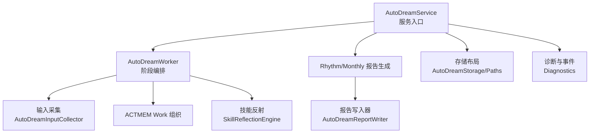
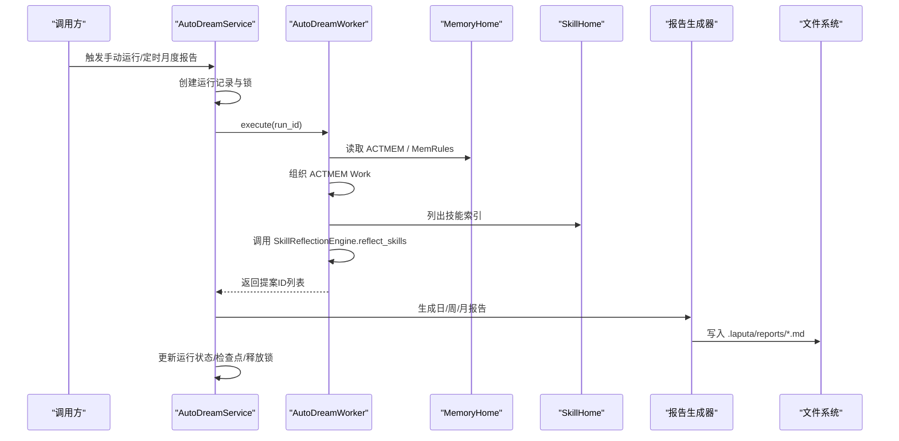
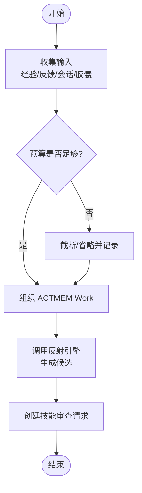
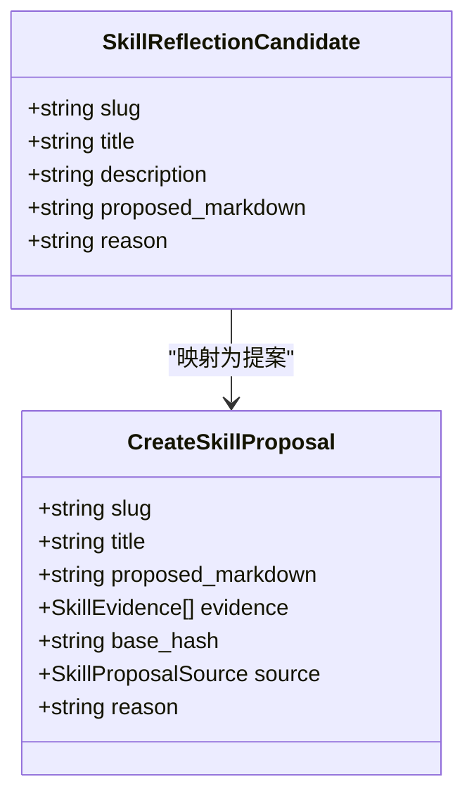
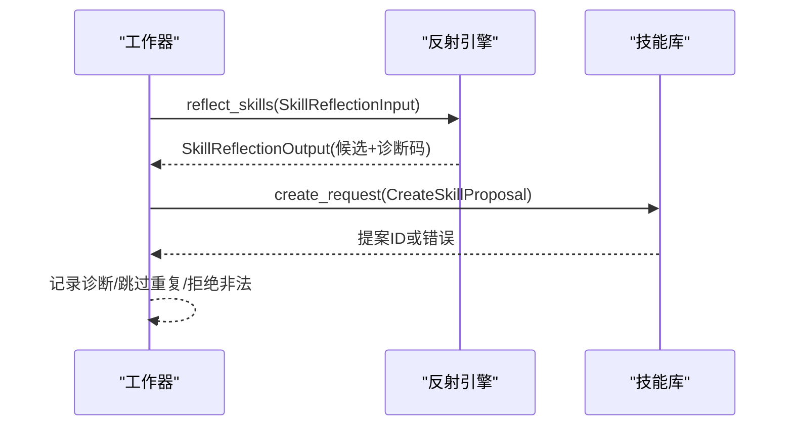

# AutoDream 自动蒸馏

<cite>
**本文引用的文件**
- [lib.rs](file://agent-diva-autodream/src/lib.rs)
- [Cargo.toml](file://agent-diva-autodream/Cargo.toml)
- [agents.md](file://agent-diva-autodream/agents.md)
- [service.rs](file://agent-diva-autodream/src/service.rs)
- [worker.rs](file://agent-diva-autodream/src/worker.rs)
- [reflection.rs](file://agent-diva-autodream/src/reflection.rs)
- [inputs.rs](file://agent-diva-autodream/src/inputs.rs)
- [rhythm.rs](file://agent-diva-autodream/src/rhythm.rs)
- [reports.rs](file://agent-diva-autodream/src/reports.rs)
- [layout.rs](file://agent-diva-autodream/src/layout.rs)
- [curation.rs](file://agent-diva-autodream/src/curation.rs)
- [diagnostics.rs](file://agent-diva-autodream/src/diagnostics.rs)
</cite>

## 目录
1. [简介](#简介)
2. [项目结构](#项目结构)
3. [核心组件](#核心组件)
4. [架构总览](#架构总览)
5. [详细组件分析](#详细组件分析)
6. [依赖关系分析](#依赖关系分析)
7. [性能与资源管理](#性能与资源管理)
8. [故障排查指南](#故障排查指南)
9. [结论](#结论)
10. [附录：配置与使用示例](#附录：配置与使用示例)

## 简介
AutoDream 自动蒸馏系统负责从大量记忆数据中收集、分析与提炼有价值的信息，并生成结构化提案与节奏报告。其核心目标是：
- 以“文件优先”的方式持久化运行记录、事件与报告；
- 通过工作流编排完成“收集—组织—反思—提案”的完整流程；
- 将权限变更以“提案”形式交由 Laputa 治理层审批，避免直接写入权威存储；
- 提供日/周/月节奏报告，支持 LLM 叙事或确定性回退；
- 基于用户反馈与上下文进行自我改进（反射机制）。

本仓库中的 autodream 模块对外暴露服务入口、工作器、输入采集、反射引擎接口、报告生成与存储布局等能力，供上层管理器或服务进程调用。

**章节来源**
- [agents.md:1-37](file://agent-diva-autodream/agents.md#L1-L37)
- [lib.rs:1-43](file://agent-diva-autodream/src/lib.rs#L1-L43)

## 项目结构
autodream 模块采用按职责划分的文件组织方式：
- 服务与生命周期：service.rs
- 工作器与阶段编排：worker.rs
- 输入采集与预算控制：inputs.rs
- 技能反射接口与数据结构：reflection.rs
- 节奏报告生成与落盘：rhythm.rs、reports.rs
- 存储布局与迁移：layout.rs
- 叙事编排与回退：curation.rs
- 诊断与事件：diagnostics.rs



**图表来源**
- [service.rs:124-200](file://agent-diva-autodream/src/service.rs#L124-L200)
- [worker.rs:152-210](file://agent-diva-autodream/src/worker.rs#L152-L210)
- [inputs.rs:75-151](file://agent-diva-autodream/src/inputs.rs#L75-L151)
- [rhythm.rs:16-151](file://agent-diva-autodream/src/rhythm.rs#L16-L151)
- [reports.rs:76-137](file://agent-diva-autodream/src/reports.rs#L76-L137)
- [layout.rs:114-143](file://agent-diva-autodream/src/layout.rs#L114-L143)
- [diagnostics.rs:11-79](file://agent-diva-autodream/src/diagnostics.rs#L11-L79)

**章节来源**
- [lib.rs:1-43](file://agent-diva-autodream/src/lib.rs#L1-L43)
- [Cargo.toml:1-27](file://agent-diva-autodream/Cargo.toml#L1-L27)

## 核心组件
- AutoDreamService：服务门面，负责运行触发、状态查询、锁恢复、报告生成调度、月度报告计划执行、指标快照等。
- AutoDreamWorker：四阶段工作器（Orient/Gather/Consolidate/Propose），负责读取 ACTMEM、组织 Work、调用反射引擎、创建技能审查请求。
- AutoDreamInputCollector：多源输入采集器，按优先级与字节预算裁剪经验日志、会话、压缩胶囊与回忆反馈。
- SkillReflectionEngine：可插拔的技能反射提供者接口，输入包含组织后的 ACTMEM、证据与技能索引，输出候选提案。
- Rhythm/Monthly Report Generator：根据触发器生成日/周/月报告，支持 LLM 叙事与确定性回退。
- AutoDreamReportWriter：将报告渲染为 Markdown，写入 .laputa/reports 下的指定路径。
- AutoDreamStorage/Paths：统一的路径管理与初始化，含历史迁移与事件日志文件。

**章节来源**
- [service.rs:124-200](file://agent-diva-autodream/src/service.rs#L124-L200)
- [worker.rs:152-210](file://agent-diva-autodream/src/worker.rs#L152-L210)
- [inputs.rs:75-151](file://agent-diva-autodream/src/inputs.rs#L75-L151)
- [reflection.rs:24-70](file://agent-diva-autodream/src/reflection.rs#L24-L70)
- [rhythm.rs:16-151](file://agent-diva-autodream/src/rhythm.rs#L16-L151)
- [reports.rs:76-137](file://agent-diva-autodream/src/reports.rs#L76-L137)
- [layout.rs:114-143](file://agent-diva-autodream/src/layout.rs#L114-L143)

## 架构总览
AutoDream 的运行时由“服务—工作器—外部权威”三层构成：
- 服务层：接收手动/定时触发，维护运行记录、锁、事件与检查点。
- 工作器层：分阶段推进蒸馏流程，严格限制可执行动作，仅产出提案与中间产物。
- 外部权威层：通过 MemoryHome/SkillHome 读写 ACTMEM 与工作寄存器，并通过 Laputa 提案通道提交权限变更。



**图表来源**
- [service.rs:202-255](file://agent-diva-autodream/src/service.rs#L202-L255)
- [worker.rs:214-375](file://agent-diva-autodream/src/worker.rs#L214-L375)
- [rhythm.rs:135-151](file://agent-diva-autodream/src/rhythm.rs#L135-L151)
- [reports.rs:86-137](file://agent-diva-autodream/src/reports.rs#L86-L137)

## 详细组件分析

### 蒸馏流程：数据收集、分析、提炼、提案生成
- 数据收集：AutoDreamInputCollector 按优先级顺序收集经验日志、回忆反馈、最近会话、压缩胶囊，并在总字节预算内截断与省略，记录遗漏原因。
- 分析：工作器在 Gather 阶段汇总输入摘要，Consolidate 阶段将组织后的 Work 写回 ACTMEM（带重试与冲突处理）。
- 提炼：Propose 阶段构造 SkillReflectionInput，包含组织后的 Work、Pulse、Recap、证据与技能索引，调用反射引擎生成候选提案。
- 提案生成：对每个候选，通过 SkillHome.create_request 创建技能审查请求，记录提案 ID 并写入运行记录。



**图表来源**
- [inputs.rs:94-151](file://agent-diva-autodream/src/inputs.rs#L94-L151)
- [worker.rs:214-375](file://agent-diva-autodream/src/worker.rs#L214-L375)

**章节来源**
- [inputs.rs:94-151](file://agent-diva-autodream/src/inputs.rs#L94-L151)
- [worker.rs:214-375](file://agent-diva-autodream/src/worker.rs#L214-L375)

### 提案类型与格式
- 提案类型：当前实现聚焦“技能审查请求”，用于提议修改某技能的 slug、标题、Markdown 内容与理由，附带证据来源与基础版本哈希。
- 适用场景：当蒸馏发现现有技能不足以覆盖近期经验或会话模式时，自动生成改进建议并提交审批。
- 提案格式：由 SkillHome.create_request 封装，包含 slug、title、proposed_markdown、evidence、base_hash、source、reason 等字段。



**图表来源**
- [reflection.rs:45-62](file://agent-diva-autodream/src/reflection.rs#L45-L62)
- [worker.rs:450-508](file://agent-diva-autodream/src/worker.rs#L450-L508)

**章节来源**
- [worker.rs:450-508](file://agent-diva-autodream/src/worker.rs#L450-L508)
- [reflection.rs:45-62](file://agent-diva-autodream/src/reflection.rs#L45-L62)

### 反射机制：基于反馈与上下文的自我改进
- 输入构造：反射输入包含 schema_version、run_id、organized_work、pulse、recap、evidence、memrules、skills、max_candidates。
- 约束校验：输出必须满足 schema_version=1 且候选数不超过上限，否则视为无效。
- 反馈闭环：证据来自经验日志、会话、压缩胶囊与回忆反馈；若失败则降级为诊断记录，不影响整体运行成功。



**图表来源**
- [worker.rs:377-508](file://agent-diva-autodream/src/worker.rs#L377-L508)
- [reflection.rs:31-70](file://agent-diva-autodream/src/reflection.rs#L31-L70)

**章节来源**
- [worker.rs:377-508](file://agent-diva-autodream/src/worker.rs#L377-L508)
- [reflection.rs:31-70](file://agent-diva-autodream/src/reflection.rs#L31-L70)

### 蒸馏策略配置：频率控制、质量阈值、优先级排序
- 频率控制：
  - 手动触发：ManualRunTriggerRequest 标记触发来源。
  - 定时月度报告：execute_scheduled_monthly_report 依据日期窗口与错误标记决定是否触发。
  - 锁机制：同一时间仅允许一个运行，防止并发竞争。
- 质量阈值：
  - 输入预算：total_bytes_budget 控制总字节，各来源有独立 limit/bytes 限制。
  - 反射输出：schema_version 与 max_candidates 校验，超限即失败。
- 优先级排序：
  - 输入来源优先级：经验日志 > 回忆反馈 > 最近会话 > 压缩胶囊。
  - 报告生成：日/周/月分别对应不同触发器与聚合逻辑。

**章节来源**
- [service.rs:491-526](file://agent-diva-autodream/src/service.rs#L491-L526)
- [inputs.rs:35-57](file://agent-diva-autodream/src/inputs.rs#L35-L57)
- [worker.rs:137-150](file://agent-diva-autodream/src/worker.rs#L137-L150)
- [rhythm.rs:135-151](file://agent-diva-autodream/src/rhythm.rs#L135-L151)

### 蒸馏结果的使用与集成
- 运行状态：get_run_status/list_runs/resumable_runs 提供运行元数据、活动锁与可恢复任务。
- 事件追踪：list_run_events 读取 JSONL 事件，支持分页与过滤。
- 报告消费：日/周/月报告写入 .laputa/reports，可由上层系统读取展示或归档。
- 提案消费：提案 ID 写入运行记录，可通过 Laputa 治理流程审批与合并。

**章节来源**
- [service.rs:257-347](file://agent-diva-autodream/src/service.rs#L257-L347)
- [service.rs:264-286](file://agent-diva-autodream/src/service.rs#L264-L286)
- [reports.rs:86-137](file://agent-diva-autodream/src/reports.rs#L86-L137)
- [worker.rs:596-632](file://agent-diva-autodream/src/worker.rs#L596-L632)

## 依赖关系分析
autodream 模块依赖 core 与 laputa 提供的通用能力：
- agent-diva-core：配置、报告叙事、会话管理、经验日志、演化类型等。
- agent-diva-laputa：MemoryHome、ActmemPatch、MemRules、提案与治理边界。

```mermaid
graph LR
AD["agent-diva-autodream"] --> CORE["agent-diva-core"]
AD --> LAPUTA["agent-diva-laputa"]
CORE --> |会话/经验/报告| AD
LAPUTA|ACTMEM/提案| AD
```

**图表来源**
- [Cargo.toml:11-22](file://agent-diva-autodream/Cargo.toml#L11-L22)

**章节来源**
- [Cargo.toml:11-22](file://agent-diva-autodream/Cargo.toml#L11-L22)

## 性能与资源管理
- 输入预算与截断：按来源限制条目数与字节数，超出部分截断并标记 truncated，保证总体可控。
- 报告证据上限：证据引用最多保留固定数量，避免报告过大。
- 原子写入：运行记录与检查点使用原子写入，降低损坏风险。
- 锁与恢复：锁文件检测过期与进程差异，自动恢复中断运行并重新排队。
- 重试与冲突：ACTMEM Work 写入遇到修订冲突时重试一次，确保幂等性。
- 叙事回退：LLM 叙事失败时自动切换确定性回退，保障报告可用性。

**章节来源**
- [inputs.rs:417-462](file://agent-diva-autodream/src/inputs.rs#L417-L462)
- [reports.rs:10-12](file://agent-diva-autodream/src/reports.rs#L10-L12)
- [layout.rs:120-139](file://agent-diva-autodream/src/layout.rs#L120-L139)
- [service.rs:656-706](file://agent-diva-autodream/src/service.rs#L656-L706)
- [worker.rs:527-565](file://agent-diva-autodream/src/worker.rs#L527-L565)
- [curation.rs:15-52](file://agent-diva-autodream/src/curation.rs#L15-L52)

## 故障排查指南
- 常见失败码：
  - input_unavailable：所有强制输入被省略，无可用证据。
  - worker_timeout/worker_failed：工作器超时或内部错误。
  - report_generation_failed：报告生成失败。
  - provider_unavailable/provider_timeout/provider_failed：反射或叙事提供者异常。
  - invalid_candidate：反射输出不符合预期。
- 定位方法：
  - 查看运行事件 JSONL：list_run_events 获取阶段级诊断。
  - 检查锁文件：确认是否存在残留锁或进程不匹配。
  - 核对输入来源：经验日志、会话、胶囊是否存在或损坏。
  - 验证报告键格式：日/周/周键需符合 YYYY-MM-DD 或 YYYY-Www。
- 修复建议：
  - 补充缺失输入或清理损坏文件。
  - 调整输入预算与限制参数。
  - 重试月度报告或等待提供者恢复。
  - 修正报告键或触发器名称。

**章节来源**
- [diagnostics.rs:99-113](file://agent-diva-autodream/src/diagnostics.rs#L99-L113)
- [service.rs:288-328](file://agent-diva-autodream/src/service.rs#L288-L328)
- [reports.rs:139-198](file://agent-diva-autodream/src/reports.rs#L139-L198)
- [worker.rs:745-795](file://agent-diva-autodream/src/worker.rs#L745-L795)

## 结论
AutoDream 自动蒸馏系统通过严格的阶段编排、输入预算控制与提案边界，实现了从海量记忆数据到结构化提案与节奏报告的可靠流水线。其设计强调：
- 文件优先与幂等迁移，确保可观测性与可恢复性；
- 权限变更一律走提案，避免越权写入；
- 可插拔反射与叙事，兼顾灵活性与鲁棒性；
- 完善的诊断与事件体系，便于问题定位与持续优化。

## 附录：配置与使用示例
- 启动服务与触发运行：
  - 打开存储：AutoDreamStorage::open(workspace_root)
  - 触发手动运行：AutoDreamService.trigger_manual_run(ManualRunTriggerRequest{trigger})
  - 执行工作器：AutoDreamService.execute_reflection_worker(run_id)
  - 生成报告：AutoDreamService.execute_report_trigger(run_id)
- 月度报告计划：
  - 定时调用：AutoDreamService.execute_scheduled_monthly_report(date)
- 读取状态与事件：
  - 状态查询：get_run_status/list_runs/resumable_runs
  - 事件读取：list_run_events(run_id, limit)
- 报告写入：
  - 日/周报告：AutoDreamReportWriter.write_daily_report/write_weekly_report
  - 月度报告：AutoDreamMonthlyReportGenerator.generate_for_month/generate_current_month

**章节来源**
- [service.rs:150-200](file://agent-diva-autodream/src/service.rs#L150-L200)
- [service.rs:202-255](file://agent-diva-autodream/src/service.rs#L202-L255)
- [service.rs:415-489](file://agent-diva-autodream/src/service.rs#L415-L489)
- [service.rs:491-526](file://agent-diva-autodream/src/service.rs#L491-L526)
- [reports.rs:110-137](file://agent-diva-autodream/src/reports.rs#L110-L137)
- [rhythm.rs:43-151](file://agent-diva-autodream/src/rhythm.rs#L43-L151)