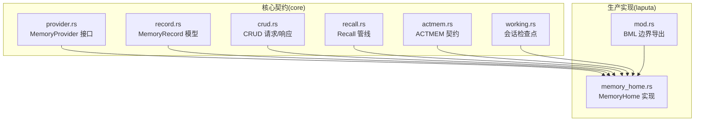
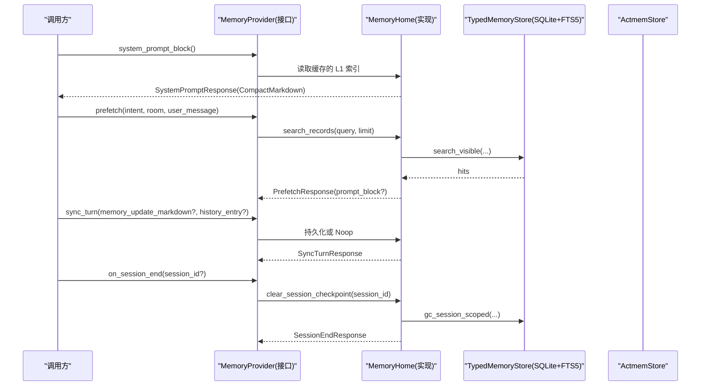
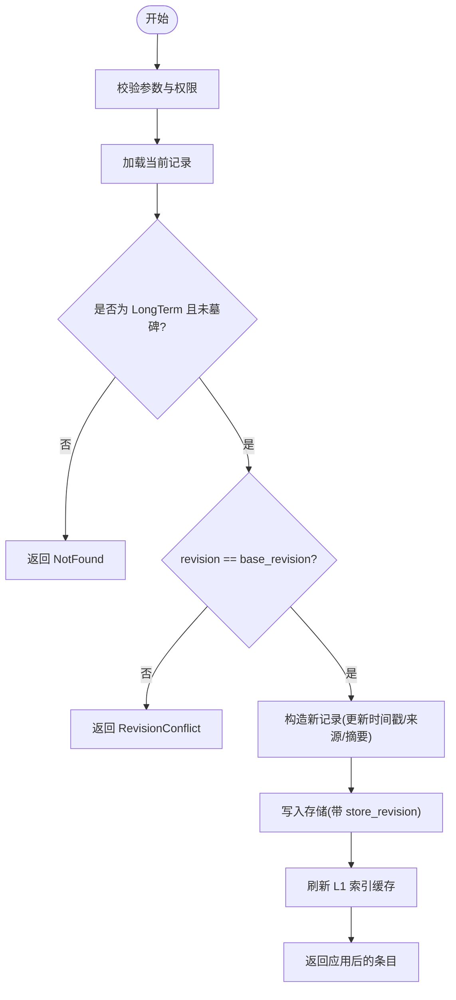
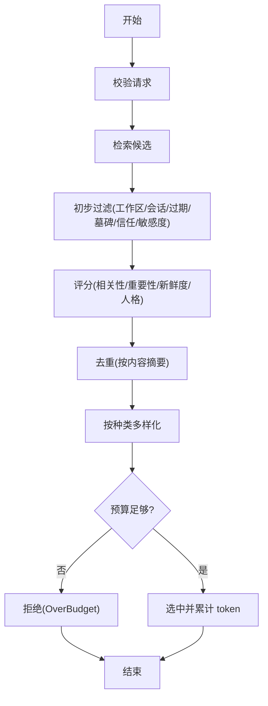
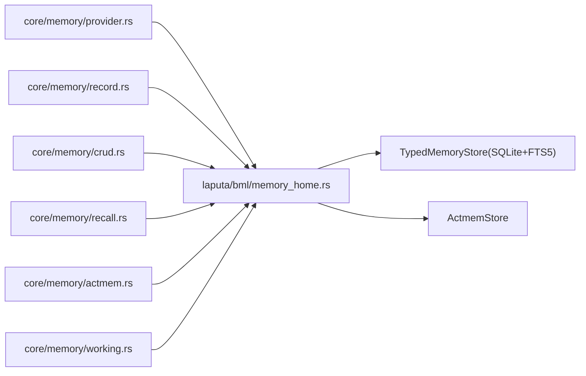

# BML 存储层

<cite>
**本文引用的文件**
- [agent-diva-core/src/memory/mod.rs](file://agent-diva-core/src/memory/mod.rs)
- [agent-diva-core/src/memory/provider.rs](file://agent-diva-core/src/memory/provider.rs)
- [agent-diva-core/src/memory/record.rs](file://agent-diva-core/src/memory/record.rs)
- [agent-diva-core/src/memory/crud.rs](file://agent-diva-core/src/memory/crud.rs)
- [agent-diva-core/src/memory/recall.rs](file://agent-diva-core/src/memory/recall.rs)
- [agent-diva-core/src/memory/actmem.rs](file://agent-diva-core/src/memory/actmem.rs)
- [agent-diva-core/src/memory/working.rs](file://agent-diva-core/src/memory/working.rs)
- [agent-diva-laputa/src/bml/mod.rs](file://agent-diva-laputa/src/bml/mod.rs)
- [agent-diva-laputa/src/bml/memory_home.rs](file://agent-diva-laputa/src/bml/memory_home.rs)
</cite>

## 目录
1. [简介](#简介)
2. [项目结构](#项目结构)
3. [核心组件](#核心组件)
4. [架构总览](#架构总览)
5. [详细组件分析](#详细组件分析)
6. [依赖关系分析](#依赖关系分析)
7. [性能与优化](#性能与优化)
8. [故障排查指南](#故障排查指南)
9. [结论](#结论)
10. [附录：API 使用示例](#附录api-使用示例)

## 简介
本文件系统性说明 BML（基础记忆层）存储层的设计与实现，聚焦于 MemoryProvider 接口、MemoryRecord 数据模型、CRUD 操作、生命周期管理、索引与查询优化、缓存机制、事务与错误处理，以及数据迁移与版本兼容性策略。BML 在 agent-diva-core 中定义领域契约与数据结构，在 agent-diva-laputa 中提供生产级实现（SQLite + FTS5），并通过 MemoryHome 暴露统一的机器级权威存储。

## 项目结构
- 领域契约与数据模型位于 agent-diva-core/memory：
  - provider.rs：MemoryProvider 接口及启动/预取/同步/会话结束等边界协议
  - record.rs：MemoryRecord 稳定记录、来源、信任、完整性校验
  - crud.rs：面向 Agent 的 CRUD 请求/响应类型
  - recall.rs：Recall v2 选择管线、预算、评分与去重
  - actmem.rs：ACTMEM 工具契约
  - working.rs：会话级工作检查点
- 生产实现位于 agent-diva-laputa/bml：
  - mod.rs：BML 逻辑边界说明与导出
  - memory_home.rs：MemoryHome 实现 MemoryProvider，封装 SQLite + FTS5、L1 索引缓存、会话清理、规则文档等

图表来源
- [agent-diva-core/src/memory/provider.rs:414-617](file://agent-diva-core/src/memory/provider.rs#L414-L617)
- [agent-diva-core/src/memory/record.rs:103-120](file://agent-diva-core/src/memory/record.rs#L103-L120)
- [agent-diva-core/src/memory/crud.rs:11-103](file://agent-diva-core/src/memory/crud.rs#L11-L103)
- [agent-diva-core/src/memory/recall.rs:214-359](file://agent-diva-core/src/memory/recall.rs#L214-L359)
- [agent-diva-core/src/memory/actmem.rs:3-50](file://agent-diva-core/src/memory/actmem.rs#L3-L50)
- [agent-diva-core/src/memory/working.rs:20-52](file://agent-diva-core/src/memory/working.rs#L20-L52)
- [agent-diva-laputa/src/bml/mod.rs:1-37](file://agent-diva-laputa/src/bml/mod.rs#L1-L37)
- [agent-diva-laputa/src/bml/memory_home.rs:85-125](file://agent-diva-laputa/src/bml/memory_home.rs#L85-L125)

章节来源
- [agent-diva-core/src/memory/mod.rs:1-47](file://agent-diva-core/src/memory/mod.rs#L1-L47)
- [agent-diva-laputa/src/bml/mod.rs:1-37](file://agent-diva-laputa/src/bml/mod.rs#L1-L37)

## 核心组件
- MemoryProvider：Agent-Diva 与长时记忆后端的解耦边界，包含系统提示块构建、意图预取、回合同步、会话结束钩子、ACTMEM 读写、工作检查点、记忆规则等能力。
- MemoryRecord：稳定的记忆记录模型，包含种类、内容、来源、证据、置信度、敏感度、信任、作用域、时间戳、覆盖链、墓碑标记等。
- CRUD 契约：面向 Agent 的直接记忆写入/读取/搜索/更新/删除/蒸馏等操作类型与结果。
- Recall v2：确定性候选检索、评分、去重、多样性、预算控制与可审计追踪。
- ACTMEM：Pulse/Recap/Work/Capsules 等会话内短周期记忆的工具契约。
- Working：会话级检查点，用于临时状态注入，不进入长期权威。

章节来源
- [agent-diva-core/src/memory/provider.rs:414-617](file://agent-diva-core/src/memory/provider.rs#L414-L617)
- [agent-diva-core/src/memory/record.rs:103-120](file://agent-diva-core/src/memory/record.rs#L103-L120)
- [agent-diva-core/src/memory/crud.rs:11-103](file://agent-diva-core/src/memory/crud.rs#L11-L103)
- [agent-diva-core/src/memory/recall.rs:214-359](file://agent-diva-core/src/memory/recall.rs#L214-L359)
- [agent-diva-core/src/memory/actmem.rs:3-50](file://agent-diva-core/src/memory/actmem.rs#L3-L50)
- [agent-diva-core/src/memory/working.rs:20-52](file://agent-diva-core/src/memory/working.rs#L20-L52)

## 架构总览
MemoryProvider 是跨传输（CLI/MCP/HTTP）的稳定领域契约；MemoryHome 是该契约的生产实现，基于 SQLite + FTS5，提供：
- 启动期 L1 索引缓存（仅指针，不含全文）
- 会话检查点（volatile，session-scoped）
- 直接 CRUD（无治理审批路径）
- 规则文档 MEMRULES 的读写
- 会话结束清理与 GC

图表来源
- [agent-diva-core/src/memory/provider.rs:414-617](file://agent-diva-core/src/memory/provider.rs#L414-L617)
- [agent-diva-laputa/src/bml/memory_home.rs:494-905](file://agent-diva-laputa/src/bml/memory_home.rs#L494-L905)

## 详细组件分析

### MemoryProvider 接口设计与职责
- 启动阶段：system_prompt_block/system_prompt_revision/refresh_system_prompt_projection
- 回合阶段：prefetch（意图感知召回）、sync_turn（成功后持久化）、record_recall_outcome
- 会话阶段：on_session_end（清理工作区/检查点）
- 直接记忆操作：memory_add/list/get/search/update/remove/distill
- 工作记忆：session_checkpoint_block/write
- ACTMEM：read/edit_work/complete/drop/rules
- 用户脉冲与会话折叠：record_user_pulse/record_assistant_recap/fold_actmem_session

关键约束：
- system_prompt_block 必须同步且无副作用
- prefetch 仅召回，不做持久化
- sync_turn 仅持久化，不做召回
- on_session_end 幂等

章节来源
- [agent-diva-core/src/memory/provider.rs:22-111](file://agent-diva-core/src/memory/provider.rs#L22-L111)
- [agent-diva-core/src/memory/provider.rs:237-390](file://agent-diva-core/src/memory/provider.rs#L237-L390)
- [agent-diva-core/src/memory/provider.rs:414-617](file://agent-diva-core/src/memory/provider.rs#L414-L617)

### MemoryRecord 数据模型与验证
- 字段要点：
  - id、kind、content、provenance、evidence_refs、confidence_bps、sensitivity、trust、scope、created_at、effective_at、expires_at、supersedes、tombstone
- 验证规则（validate_at）：
  - 必填字段校验、未知枚举拒绝
  - content 与 provenance.content_digest 一致性
  - 置信度上限、时钟偏差、时间顺序、过期时间合法性
  - 自覆盖禁止、墓碑内容与目标匹配性
  - 权威信任的来源与证据限制
  - 工作区隔离校验（validate_workspace）
- 安全渲染：escape_memory_for_prompt 将内容包裹为不可执行的数据边界

复杂度与影响：
- 验证 O(n) 主要受 supersedes/tombstone/evidence 列表长度影响
- 内容摘要计算依赖底层哈希，保证跨进程一致性

章节来源
- [agent-diva-core/src/memory/record.rs:103-120](file://agent-diva-core/src/memory/record.rs#L103-L120)
- [agent-diva-core/src/memory/record.rs:193-289](file://agent-diva-core/src/memory/record.rs#L193-L289)
- [agent-diva-core/src/memory/record.rs:291-385](file://agent-diva-core/src/memory/record.rs#L291-L385)

### CRUD 操作与生命周期
- 创建（add）：生成唯一 id、计算 digest、写入记录、刷新 L1 索引
- 读取（get/list/search）：过滤被覆盖/墓碑/会话范围，返回可见条目
- 更新（update）：CAS 基于 base_revision，更新内容/证据/时间戳/来源
- 删除（remove）：软删除，写入墓碑记录并关联 supersedes
- 蒸馏（distill）：将经验提炼为技能工件（通过 provider 默认不支持，由实现扩展）

完整流程（以 update 为例）：

图表来源
- [agent-diva-laputa/src/bml/memory_home.rs:238-282](file://agent-diva-laputa/src/bml/memory_home.rs#L238-L282)
- [agent-diva-laputa/src/bml/memory_home.rs:394-418](file://agent-diva-laputa/src/bml/memory_home.rs#L394-L418)

章节来源
- [agent-diva-core/src/memory/crud.rs:11-103](file://agent-diva-core/src/memory/crud.rs#L11-L103)
- [agent-diva-laputa/src/bml/memory_home.rs:205-346](file://agent-diva-laputa/src/bml/memory_home.rs#L205-L346)

### 启动提示与 L1 索引缓存
- 启动提示块由 MEMRULES 指针与 L1 索引组成，仅包含指针与首行预览，不包含全文
- 写入后异步刷新缓存，原子递增 revision 供上层判断是否变更
- 默认预算 DEFAULT_L1_INDEX_LINES 控制索引行数

章节来源
- [agent-diva-core/src/memory/record.rs:314-350](file://agent-diva-core/src/memory/record.rs#L314-L350)
- [agent-diva-laputa/src/bml/memory_home.rs:394-418](file://agent-diva-laputa/src/bml/memory_home.rs#L394-L418)
- [agent-diva-laputa/src/bml/memory_home.rs:997-999](file://agent-diva-laputa/src/bml/memory_home.rs#L997-L999)

### 会话检查点（Working Memory）
- 会话级键值存在，非权威，随会话结束清理
- 支持渲染结构化 Markdown 块注入到回合上下文
- 写入时进行记录校验，避免非法时间/内容

章节来源
- [agent-diva-core/src/memory/working.rs:1-52](file://agent-diva-core/src/memory/working.rs#L1-L52)
- [agent-diva-core/src/memory/working.rs:54-76](file://agent-diva-core/src/memory/working.rs#L54-L76)
- [agent-diva-laputa/src/bml/memory_home.rs:439-491](file://agent-diva-laputa/src/bml/memory_home.rs#L439-L491)
- [agent-diva-laputa/src/bml/memory_home.rs:845-883](file://agent-diva-laputa/src/bml/memory_home.rs#L845-L883)

### ACTMEM 与记忆规则
- ACTMEM 提供 Pulse/Recap/Work/Capsules 等读/写能力，支持 CAS 编辑
- 记忆规则（MEMRULES）默认内置，用户可覆盖；写入前需读取规则

章节来源
- [agent-diva-core/src/memory/actmem.rs:3-50](file://agent-diva-core/src/memory/actmem.rs#L3-L50)
- [agent-diva-laputa/src/bml/memory_home.rs:348-372](file://agent-diva-laputa/src/bml/memory_home.rs#L348-L372)
- [agent-diva-laputa/src/bml/memory_home.rs:712-796](file://agent-diva-laputa/src/bml/memory_home.rs#L712-L796)

### 召回管线（Recall v2）
- 输入：RecallRequest（query、scope、correlation、now、token_budget、max_candidates、policy）
- 输出：RecallOutcome（status、selected_records、prompt_block、budget、trace）
- 选择阶段：初步过滤（工作区/会话/过期/墓碑/信任/敏感度）→ 评分排序 → 去重 → 多样性 → 预算裁剪
- 评分权重：相关性、重要性、新鲜度、人格相关词匹配
- 预算估算：保守 Unicode 估计器，可替换

图表来源
- [agent-diva-core/src/memory/recall.rs:214-359](file://agent-diva-core/src/memory/recall.rs#L214-L359)
- [agent-diva-core/src/memory/recall.rs:400-489](file://agent-diva-core/src/memory/recall.rs#L400-L489)
- [agent-diva-core/src/memory/recall.rs:509-583](file://agent-diva-core/src/memory/recall.rs#L509-L583)

章节来源
- [agent-diva-core/src/memory/recall.rs:214-359](file://agent-diva-core/src/memory/recall.rs#L214-L359)

## 依赖关系分析
- core/memory 提供稳定领域契约与数据结构，laputa/bml 实现具体存储细节
- MemoryHome 依赖 TypedMemoryStore（SQLite + FTS5）与 ActmemStore
- 启动提示与 L1 索引缓存降低频繁 I/O，提高系统提示组装速度
- 会话检查点与 GC 保障资源回收与内存占用可控

图表来源
- [agent-diva-core/src/memory/provider.rs:414-617](file://agent-diva-core/src/memory/provider.rs#L414-L617)
- [agent-diva-laputa/src/bml/memory_home.rs:85-125](file://agent-diva-laputa/src/bml/memory_home.rs#L85-L125)

章节来源
- [agent-diva-laputa/src/bml/mod.rs:1-37](file://agent-diva-laputa/src/bml/mod.rs#L1-L37)
- [agent-diva-laputa/src/bml/memory_home.rs:85-125](file://agent-diva-laputa/src/bml/memory_home.rs#L85-L125)

## 性能与优化
- 索引设计
  - FTS5 全文检索用于 search_visible，提升查询效率
  - L1 索引仅保留指针与首行预览，减少系统提示体积
- 查询优化
  - 预取阶段限制返回数量（如 8 条），避免过大上下文
  - 过滤墓碑/过期/工作区/会话范围，减少无效候选
- 缓存机制
  - 启动提示块本地缓存，写入后增量刷新并递增 revision
  - 会话检查点按 session_id 隔离，支持快速读取与清理
- 预算控制
  - Recall 管线使用 token 预算与保守估计器，防止上下文溢出
- 并发与锁
  - 存储访问通过 tokio::sync::Mutex 保护，避免并发打开冲突

[本节为通用指导，不直接分析具体文件]

## 故障排查指南
- 常见错误码与含义
  - bml_unavailable：存储不可用（数据库缺失/无法打开）
  - memory_not_found：记录不存在或被墓碑/覆盖
  - memory_revision_conflict：CAS 失败，base_revision 不匹配
  - memory_kind_forbidden：生产环境禁止写入非 LongTerm 类型
  - memory_invalid_request：参数为空或不合法
  - memory_io_error：I/O 失败（文件写入/读取）
- 定位建议
  - 检查 database_path 是否存在与可写
  - 确认 workspace_root 与 scope.workspace_id 一致
  - 核对 base_revision 与当前 revision
  - 查看 MEMRULES 是否被正确加载与覆盖
  - 对 Recall 失败，检查 policy 允许的 trust/sensitivity 与 token_budget

章节来源
- [agent-diva-laputa/src/bml/memory_home.rs:39-70](file://agent-diva-laputa/src/bml/memory_home.rs#L39-L70)
- [agent-diva-laputa/src/bml/memory_home.rs:238-346](file://agent-diva-laputa/src/bml/memory_home.rs#L238-L346)
- [agent-diva-laputa/src/bml/memory_home.rs:583-710](file://agent-diva-laputa/src/bml/memory_home.rs#L583-L710)

## 结论
BML 存储层通过清晰的领域契约（core/memory）与稳健的实现（laputa/bml）实现了可扩展、可审计、可回滚的记忆系统。MemoryProvider 将启动、预取、同步、会话管理等生命周期抽象出来；MemoryRecord 提供强一致的模型与校验；CRUD 与 Recall 管线确保高效、安全的读写与检索；L1 索引与工作检查点提升了性能与用户体验；SQLite + FTS5 提供了可靠的持久化与检索能力。

[本节为总结，不直接分析具体文件]

## 附录：API 使用示例
以下示例展示典型用法与注意事项（以伪代码形式描述，实际调用请参考对应模块的接口定义）。

- 创建记忆（add）
  - 输入：content、可选 evidence_refs
  - 行为：生成 id、计算摘要、写入、刷新 L1 索引
  - 返回：Applied(entry)，若缺少证据会附带 advisory
  - 参考路径
    - [agent-diva-core/src/memory/crud.rs:11-19](file://agent-diva-core/src/memory/crud.rs#L11-L19)
    - [agent-diva-laputa/src/bml/memory_home.rs:205-236](file://agent-diva-laputa/src/bml/memory_home.rs#L205-L236)
    - [agent-diva-laputa/src/bml/memory_home.rs:583-605](file://agent-diva-laputa/src/bml/memory_home.rs#L583-L605)

- 读取记忆（list/get/search）
  - list：limit 控制返回数量；过滤墓碑/覆盖/会话范围
  - get：按 id 获取单条；不存在返回 Failed
  - search：空查询返回 Failed；限制返回数量
  - 参考路径
    - [agent-diva-core/src/memory/crud.rs:21-42](file://agent-diva-core/src/memory/crud.rs#L21-L42)
    - [agent-diva-laputa/src/bml/memory_home.rs:179-203](file://agent-diva-laputa/src/bml/memory_home.rs#L179-L203)
    - [agent-diva-laputa/src/bml/memory_home.rs:607-663](file://agent-diva-laputa/src/bml/memory_home.rs#L607-L663)

- 更新记忆（update）
  - 输入：record_id、content、base_revision、可选 evidence_refs
  - 行为：CAS 校验、更新内容/证据/时间戳/来源、刷新 L1 索引
  - 错误：RevisionConflict、NotFound
  - 参考路径
    - [agent-diva-core/src/memory/crud.rs:44-56](file://agent-diva-core/src/memory/crud.rs#L44-L56)
    - [agent-diva-laputa/src/bml/memory_home.rs:238-282](file://agent-diva-laputa/src/bml/memory_home.rs#L238-L282)
    - [agent-diva-laputa/src/bml/memory_home.rs:665-689](file://agent-diva-laputa/src/bml/memory_home.rs#L665-L689)

- 删除记忆（remove）
  - 输入：record_id、reason、base_revision
  - 行为：写入墓碑记录，关联 supersedes，刷新 L1 索引
  - 错误：RevisionConflict、NotFound
  - 参考路径
    - [agent-diva-core/src/memory/crud.rs:58-67](file://agent-diva-core/src/memory/crud.rs#L58-L67)
    - [agent-diva-laputa/src/bml/memory_home.rs:284-346](file://agent-diva-laputa/src/bml/memory_home.rs#L284-L346)
    - [agent-diva-laputa/src/bml/memory_home.rs:691-710](file://agent-diva-laputa/src/bml/memory_home.rs#L691-L710)

- 批量操作
  - 通过多次调用 add/update/remove 实现；注意每次调用均会刷新 L1 索引，建议在批处理后统一刷新（如需）
  - 参考路径
    - [agent-diva-laputa/src/bml/memory_home.rs:394-418](file://agent-diva-laputa/src/bml/memory_home.rs#L394-L418)

- 事务处理
  - 当前 CRUD 为逐条提交；如需跨记录事务，可在调用方组织重试与补偿逻辑
  - 参考路径
    - [agent-diva-laputa/src/bml/memory_home.rs:238-346](file://agent-diva-laputa/src/bml/memory_home.rs#L238-L346)

- 错误处理
  - 统一通过 MemoryCrudOutcome.Failed(reason) 返回；reason 包含错误码与消息
  - 参考路径
    - [agent-diva-core/src/memory/crud.rs:105-136](file://agent-diva-core/src/memory/crud.rs#L105-L136)
    - [agent-diva-laputa/src/bml/memory_home.rs:39-70](file://agent-diva-laputa/src/bml/memory_home.rs#L39-L70)

- 数据迁移与版本兼容
  - 迁移入口与 manifest/plan/test 类型在 BML 模块导出，用于离线导入与对比
  - 工作区身份迁移状态也在此模块导出，便于升级过程跟踪
  - 参考路径
    - [agent-diva-laputa/src/bml/mod.rs:27-36](file://agent-diva-laputa/src/bml/mod.rs#L27-L36)