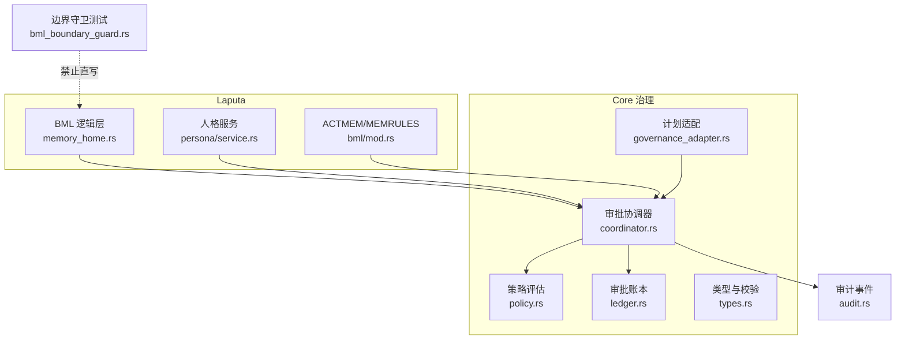
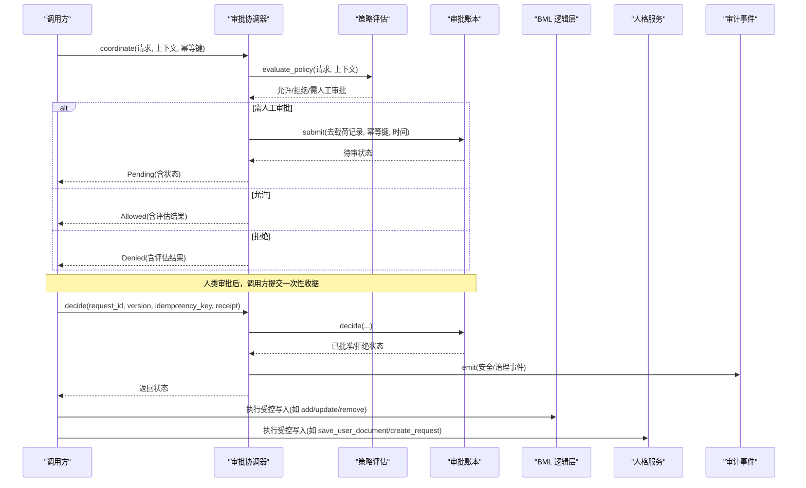
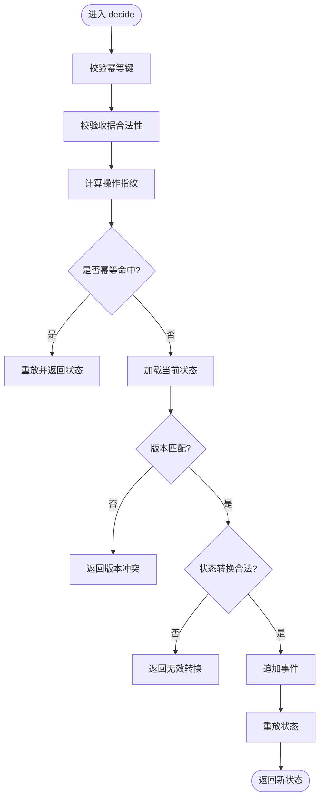
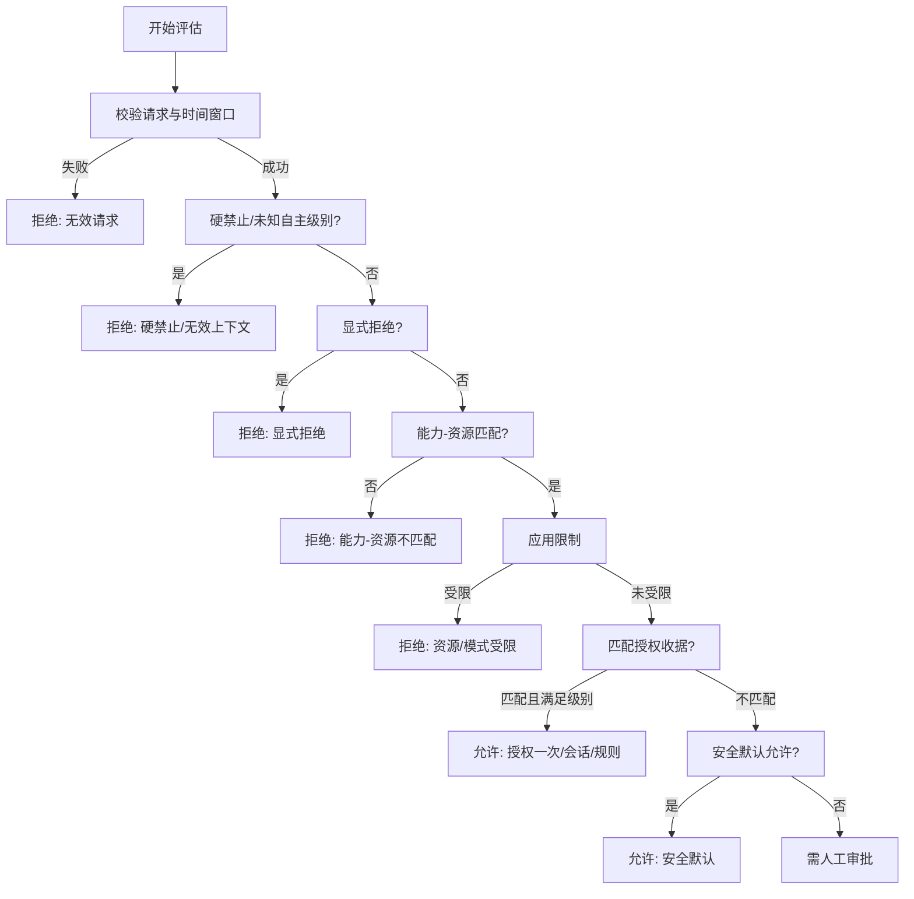
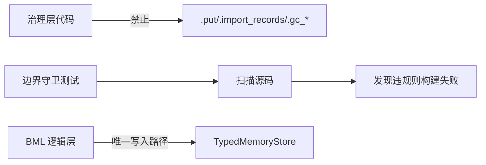
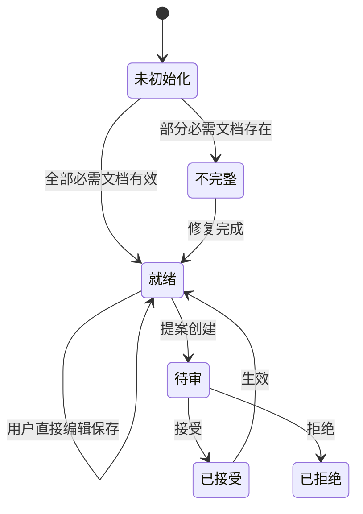
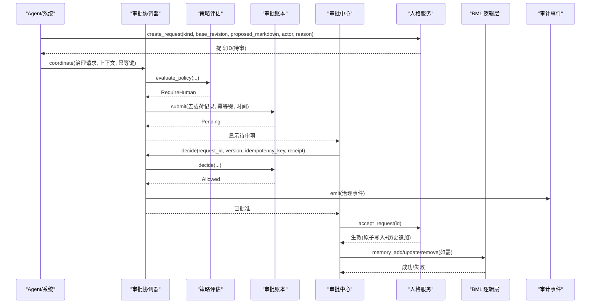

# Laputa 治理层

<cite>
**本文引用的文件**
- [agent-diva-laputa/src/lib.rs](file://agent-diva-laputa/src/lib.rs)
- [agent-diva-laputa/src/bml/mod.rs](file://agent-diva-laputa/src/bml/mod.rs)
- [agent-diva-laputa/src/bml/memory_home.rs](file://agent-diva-laputa/src/bml/memory_home.rs)
- [agent-diva-laputa/src/persona/mod.rs](file://agent-diva-laputa/src/persona/mod.rs)
- [agent-diva-laputa/src/persona/service.rs](file://agent-diva-laputa/src/persona/service.rs)
- [agent-diva-core/src/governance/mod.rs](file://agent-diva-core/src/governance/mod.rs)
- [agent-diva-core/src/governance/coordinator.rs](file://agent-diva-core/src/governance/coordinator.rs)
- [agent-diva-core/src/governance/ledger.rs](file://agent-diva-core/src/governance/ledger.rs)
- [agent-diva-core/src/governance/policy.rs](file://agent-diva-core/src/governance/policy.rs)
- [agent-diva-core/src/governance/types.rs](file://agent-diva-core/src/governance/types.rs)
- [agent-diva-core/src/planning/governance_adapter.rs](file://agent-diva-core/src/planning/governance_adapter.rs)
- [agent-diva-core/src/audit.rs](file://agent-diva-core/src/audit.rs)
- [agent-diva-laputa/tests/bml_boundary_guard.rs](file://agent-diva-laputa/tests/bml_boundary_guard.rs)
</cite>

## 目录
1. [简介](#简介)
2. [项目结构](#项目结构)
3. [核心组件](#核心组件)
4. [架构总览](#架构总览)
5. [详细组件分析](#详细组件分析)
6. [依赖关系分析](#依赖关系分析)
7. [性能与一致性](#性能与一致性)
8. [故障恢复与回滚审计](#故障恢复与回滚审计)
9. [合规性与审计日志](#合规性与审计日志)
10. [治理流程示例](#治理流程示例)
11. [结论](#结论)

## 简介
本文件系统化说明 Laputa 作为“记忆治理层”的架构与机制：提案生成、审批流、回滚审计、人格（Persona）生命周期管理、BML 边界守卫、治理策略配置、完整治理流程示例，以及审计日志与合规性检查。Laputa 将机器级记忆权威（BML）、人格 Markdown 权威、ACTMEM/MEMRULES 等关键资产纳入统一治理面，并通过跨域共享的通用审批协调器实现可审计、可回滚、幂等的变更控制。

## 项目结构
Laputa 治理相关代码主要分布在两个 crate：
- agent-diva-laputa：提供 BML 逻辑层、人格文档工作区、ACTMEM/MEMRULES 等权威存储与访问边界。
- agent-diva-core：提供领域无关的治理契约（请求/收据/策略/账本），以及计划（Plan）到治理层的适配。



图表来源
- [agent-diva-laputa/src/bml/memory_home.rs:102-177](file://agent-diva-laputa/src/bml/memory_home.rs#L102-L177)
- [agent-diva-core/src/governance/coordinator.rs:67-186](file://agent-diva-core/src/governance/coordinator.rs#L67-L186)
- [agent-diva-core/src/governance/policy.rs:98-205](file://agent-diva-core/src/governance/policy.rs#L98-L205)
- [agent-diva-core/src/governance/ledger.rs:314-482](file://agent-diva-core/src/governance/ledger.rs#L314-L482)
- [agent-diva-core/src/planning/governance_adapter.rs:30-78](file://agent-diva-core/src/planning/governance_adapter.rs#L30-L78)
- [agent-diva-core/src/audit.rs:224-253](file://agent-diva-core/src/audit.rs#L224-L253)
- [agent-diva-laputa/tests/bml_boundary_guard.rs:7-29](file://agent-diva-laputa/tests/bml_boundary_guard.rs#L7-L29)

章节来源
- [agent-diva-laputa/src/lib.rs:1-56](file://agent-diva-laputa/src/lib.rs#L1-L56)
- [agent-diva-core/src/governance/mod.rs:1-17](file://agent-diva-core/src/governance/mod.rs#L1-L17)

## 核心组件
- 审批协调器（ApprovalCoordinator）：统一入口，负责策略评估、持久化待审请求、消费一次性收据、撤销/过期、分页查询状态与事件。
- 策略评估器（Policy）：无副作用、确定性决策，依据能力-资源矩阵、自主级别、显式用户决定、限制与授权收据进行判定。
- 审批账本（Ledger）：基于 SQLite 的追加式事件日志，支持幂等提交、版本冲突检测、状态重放、游标翻页。
- 类型与校验（Types）：稳定的请求/收据/错误类型，确保跨进程/跨语言契约稳定。
- 计划适配（Planning Adapter）：将旧版 Plan 审批请求包装为通用治理请求，绑定修订号与资源边界。
- BML 逻辑层（MemoryHome）：机器级记忆权威，提供长时记忆 CRUD、会话检查点、启动索引刷新、规则读写等。
- 人格服务（PersonaService）：人格 Markdown 权威，提供初始化、修复、读取、保存、提案创建、接受/拒绝、历史快照与差异。
- 边界守卫：通过静态扫描禁止治理层直接调用 BML 写接口，防止越权与数据污染。

章节来源
- [agent-diva-core/src/governance/coordinator.rs:67-186](file://agent-diva-core/src/governance/coordinator.rs#L67-L186)
- [agent-diva-core/src/governance/policy.rs:98-205](file://agent-diva-core/src/governance/policy.rs#L98-L205)
- [agent-diva-core/src/governance/ledger.rs:244-482](file://agent-diva-core/src/governance/ledger.rs#L244-L482)
- [agent-diva-core/src/governance/types.rs:121-161](file://agent-diva-core/src/governance/types.rs#L121-L161)
- [agent-diva-core/src/planning/governance_adapter.rs:30-78](file://agent-diva-core/src/planning/governance_adapter.rs#L30-L78)
- [agent-diva-laputa/src/bml/memory_home.rs:102-177](file://agent-diva-laputa/src/bml/memory_home.rs#L102-L177)
- [agent-diva-laputa/src/persona/service.rs:24-230](file://agent-diva-laputa/src/persona/service.rs#L24-L230)
- [agent-diva-laputa/tests/bml_boundary_guard.rs:7-29](file://agent-diva-laputa/tests/bml_boundary_guard.rs#L7-L29)

## 架构总览
Laputa 采用“策略即法、账本即真”的设计：所有高风险或跨域变更必须经过策略评估与审批账本；BML 与人格权威仅通过受控 API 暴露；审计事件贯穿始终。



图表来源
- [agent-diva-core/src/governance/coordinator.rs:73-131](file://agent-diva-core/src/governance/coordinator.rs#L73-L131)
- [agent-diva-core/src/governance/policy.rs:98-205](file://agent-diva-core/src/governance/policy.rs#L98-L205)
- [agent-diva-core/src/governance/ledger.rs:486-574](file://agent-diva-core/src/governance/ledger.rs#L486-L574)
- [agent-diva-core/src/audit.rs:224-253](file://agent-diva-core/src/audit.rs#L224-L253)
- [agent-diva-laputa/src/bml/memory_home.rs:205-346](file://agent-diva-laputa/src/bml/memory_home.rs#L205-L346)
- [agent-diva-laputa/src/persona/service.rs:258-385](file://agent-diva-laputa/src/persona/service.rs#L258-L385)

## 详细组件分析

### 审批协调器与账本
- 协调器职责：
  - 对每个请求进行策略评估，仅在需要人工审批时持久化去载荷记录。
  - 提供 decide/revoke/consume_once/expire/states_page/events_page 等原子操作。
- 账本特性：
  - 追加式事件存储，SQLite 触发器禁止更新/删除。
  - 幂等提交：相同幂等键+指纹重复提交返回一致结果。
  - 版本冲突：并发写入通过版本号保护。
  - 状态重放：按 evaluated_at 时间点重放事件得到当前状态。



图表来源
- [agent-diva-core/src/governance/ledger.rs:520-574](file://agent-diva-core/src/governance/ledger.rs#L520-L574)
- [agent-diva-core/src/governance/ledger.rs:314-482](file://agent-diva-core/src/governance/ledger.rs#L314-L482)

章节来源
- [agent-diva-core/src/governance/coordinator.rs:67-186](file://agent-diva-core/src/governance/coordinator.rs#L67-L186)
- [agent-diva-core/src/governance/ledger.rs:244-574](file://agent-diva-core/src/governance/ledger.rs#L244-L574)

### 策略评估
- 输入：请求（能力、资源、风险、内容摘要、策略版本、有效期）+ 上下文（自主级别、显式用户决定、限制、授权收据）。
- 决策优先级：硬禁止 > 显式拒绝 > 上下文非法 > 能力-资源不匹配 > 资源/模式受限 > 授权匹配 > 安全默认允许 > 需人工审批。
- 输出：决策、原因码、约束、证据引用。



图表来源
- [agent-diva-core/src/governance/policy.rs:98-205](file://agent-diva-core/src/governance/policy.rs#L98-L205)
- [agent-diva-core/src/governance/types.rs:27-83](file://agent-diva-core/src/governance/types.rs#L27-L83)

章节来源
- [agent-diva-core/src/governance/policy.rs:98-205](file://agent-diva-core/src/governance/policy.rs#L98-L205)
- [agent-diva-core/src/governance/types.rs:121-161](file://agent-diva-core/src/governance/types.rs#L121-L161)

### BML 边界守卫
- 设计目标：非 BML 模块不得直接调用原始写接口（put/import_records/gc/backup/restore 等），防止越权与数据污染。
- 实施手段：
  - 在 bml/mod.rs 中声明生产实体为 MemoryHome，明确写 API 边界。
  - 通过 tests/bml_boundary_guard.rs 扫描源码，禁止治理层调用被禁用的写方法。
  - 保留已退役的 put_governed/rollback_governed 名称作为“反引入针”，避免未来误恢复。



图表来源
- [agent-diva-laputa/src/bml/mod.rs:1-37](file://agent-diva-laputa/src/bml/mod.rs#L1-L37)
- [agent-diva-laputa/tests/bml_boundary_guard.rs:7-29](file://agent-diva-laputa/tests/bml_boundary_guard.rs#L7-L29)

章节来源
- [agent-diva-laputa/src/bml/mod.rs:1-37](file://agent-diva-laputa/src/bml/mod.rs#L1-L37)
- [agent-diva-laputa/tests/bml_boundary_guard.rs:7-29](file://agent-diva-laputa/tests/bml_boundary_guard.rs#L7-L29)

### 人格（Persona）生命周期管理
- 状态机：未初始化 → 不完整 → 就绪。
- 关键操作：
  - 初始化：批量写入人格文档，原子落盘，生成历史。
  - 修复：仅允许修补缺失或不完整的必需文档。
  - 读取：获取当前文档与状态视图。
  - 保存：用户直接编辑保存，生成变更历史与审计元数据。
  - 提案：Agent/AutoDream 提出变更，进入待审队列。
  - 接受/拒绝：接受后原子 CAS 写入、追加历史、终结请求；拒绝后标记状态。
  - 历史：只读快照与差异，支持回看与比较。



图表来源
- [agent-diva-laputa/src/persona/service.rs:42-121](file://agent-diva-laputa/src/persona/service.rs#L42-L121)
- [agent-diva-laputa/src/persona/service.rs:123-230](file://agent-diva-laputa/src/persona/service.rs#L123-L230)
- [agent-diva-laputa/src/persona/service.rs:258-385](file://agent-diva-laputa/src/persona/service.rs#L258-L385)
- [agent-diva-laputa/src/persona/service.rs:399-580](file://agent-diva-laputa/src/persona/service.rs#L399-L580)

章节来源
- [agent-diva-laputa/src/persona/service.rs:42-580](file://agent-diva-laputa/src/persona/service.rs#L42-L580)

### 计划（Plan）到治理层的适配
- 将旧版 Plan 审批请求包装为通用治理请求，携带工作区/会话/内容摘要/策略版本/风险等信息。
- 将历史收据转换为一次性授权收据，保持向后兼容。

章节来源
- [agent-diva-core/src/planning/governance_adapter.rs:30-78](file://agent-diva-core/src/planning/governance_adapter.rs#L30-L78)

## 依赖关系分析
- Laputa 对外暴露 BML 与人格权威，内部通过 MemoryHome 与 PersonaService 组织。
- 治理层（core）提供跨域共享的协调器、策略与账本，被 Manager/Agent/AutoDream 共同使用。
- 计划子系统通过适配器接入治理层，保证修订号与资源边界绑定。
- 审计系统独立于治理链，但接收来自协调器的安全/治理事件。

```mermaid
graph TB
Laputa["Laputa"] --> CoreGov["Core 治理"]
Laputa --> BML["BML 逻辑层"]
Laputa --> Persona["人格服务"]
CoreGov --> Policy["策略"]
CoreGov --> Ledger["账本"]
Planning["计划子系统"] --> CoreGov
Audit["审计系统"] <- --> CoreGov
```

图表来源
- [agent-diva-core/src/governance/mod.rs:1-17](file://agent-diva-core/src/governance/mod.rs#L1-L17)
- [agent-diva-core/src/governance/coordinator.rs:67-186](file://agent-diva-core/src/governance/coordinator.rs#L67-L186)
- [agent-diva-core/src/governance/policy.rs:98-205](file://agent-diva-core/src/governance/policy.rs#L98-L205)
- [agent-diva-core/src/governance/ledger.rs:314-482](file://agent-diva-core/src/governance/ledger.rs#L314-L482)
- [agent-diva-core/src/audit.rs:224-253](file://agent-diva-core/src/audit.rs#L224-L253)

章节来源
- [agent-diva-core/src/governance/mod.rs:1-17](file://agent-diva-core/src/governance/mod.rs#L1-L17)
- [agent-diva-core/src/governance/coordinator.rs:67-186](file://agent-diva-core/src/governance/coordinator.rs#L67-L186)

## 性能与一致性
- 账本重放：通过按 request_id 排序的事件流与 evaluated_at 时间点重放，保证状态一致性。
- 幂等提交：idempotency_key + operation_fingerprint 双重保护，避免重复提交导致的状态漂移。
- 版本冲突：每次写入递增版本号，CAS 语义防止覆盖。
- 边界守卫：编译期/运行期扫描阻止非法写路径，降低维护成本与风险。
- 启动索引：BML 启动时预热 L1 索引，减少冷启动延迟。

章节来源
- [agent-diva-core/src/governance/ledger.rs:314-482](file://agent-diva-core/src/governance/ledger.rs#L314-L482)
- [agent-diva-laputa/src/bml/memory_home.rs:394-418](file://agent-diva-laputa/src/bml/memory_home.rs#L394-L418)
- [agent-diva-laputa/tests/bml_boundary_guard.rs:7-29](file://agent-diva-laputa/tests/bml_boundary_guard.rs#L7-L29)

## 故障恢复与回滚审计
- 恢复机制：
  - 启动时从账本事件重放推导状态，支持断点续跑与幂等恢复。
  - 若缺少权威收据的已批准提案，进入“需关注”状态等待人工处理。
- 回滚审计：
  - 人格服务在写入前生成快照与差异，历史只读不可变。
  - BML 移除记录以墓碑形式持久化，保留删除原因与关联信息。
  - 账本事件包含操作指纹、时间戳、行为主体，便于事后审计。

章节来源
- [agent-diva-core/src/governance/ledger.rs:717-795](file://agent-diva-core/src/governance/ledger.rs#L717-L795)
- [agent-diva-laputa/src/persona/service.rs:535-580](file://agent-diva-laputa/src/persona/service.rs#L535-L580)
- [agent-diva-laputa/src/bml/memory_home.rs:284-346](file://agent-diva-laputa/src/bml/memory_home.rs#L284-L346)

## 合规性与审计日志
- 审计事件：通过统一 emit 接口输出结构化 JSON 行，供 GUI/CLI 过滤与重建事件流。
- 合规检查：
  - 策略评估输出稳定原因码与约束，便于自动化合规判断。
  - 边界守卫持续扫描，确保治理层不绕过 BML 写边界。
  - 人格与 BML 写入均附带来源、时间、内容摘要与证据引用，满足可追溯要求。

章节来源
- [agent-diva-core/src/audit.rs:224-253](file://agent-diva-core/src/audit.rs#L224-L253)
- [agent-diva-core/src/governance/policy.rs:98-205](file://agent-diva-core/src/governance/policy.rs#L98-L205)
- [agent-diva-laputa/tests/bml_boundary_guard.rs:7-29](file://agent-diva-laputa/tests/bml_boundary_guard.rs#L7-L29)

## 治理流程示例
以下示例展示从提案创建到最终生效的全过程，涵盖策略评估、审批、幂等与审计。



图表来源
- [agent-diva-laputa/src/persona/service.rs:258-385](file://agent-diva-laputa/src/persona/service.rs#L258-L385)
- [agent-diva-core/src/governance/coordinator.rs:73-131](file://agent-diva-core/src/governance/coordinator.rs#L73-L131)
- [agent-diva-core/src/governance/ledger.rs:486-574](file://agent-diva-core/src/governance/ledger.rs#L486-L574)
- [agent-diva-core/src/audit.rs:224-253](file://agent-diva-core/src/audit.rs#L224-L253)
- [agent-diva-laputa/src/bml/memory_home.rs:205-346](file://agent-diva-laputa/src/bml/memory_home.rs#L205-L346)

## 结论
Laputa 治理层通过“策略即法、账本即真”的架构，实现了跨域一致的权限控制与变更治理。BML 边界守卫确保记忆权威不被绕过；人格服务提供安全的 Markdown 权威与完整生命周期管理；审批协调器与账本提供幂等、可重放、可审计的审批流。配合审计日志与合规检查，系统在安全性、可追溯性与可恢复性方面具备坚实基础。