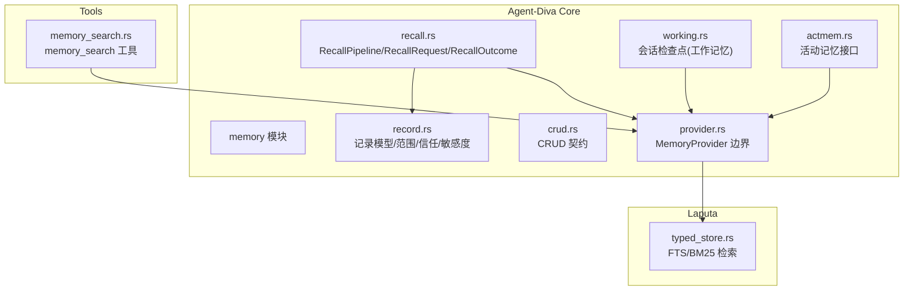
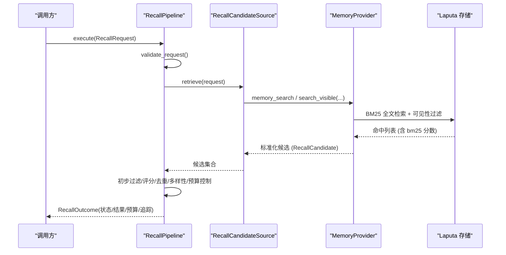
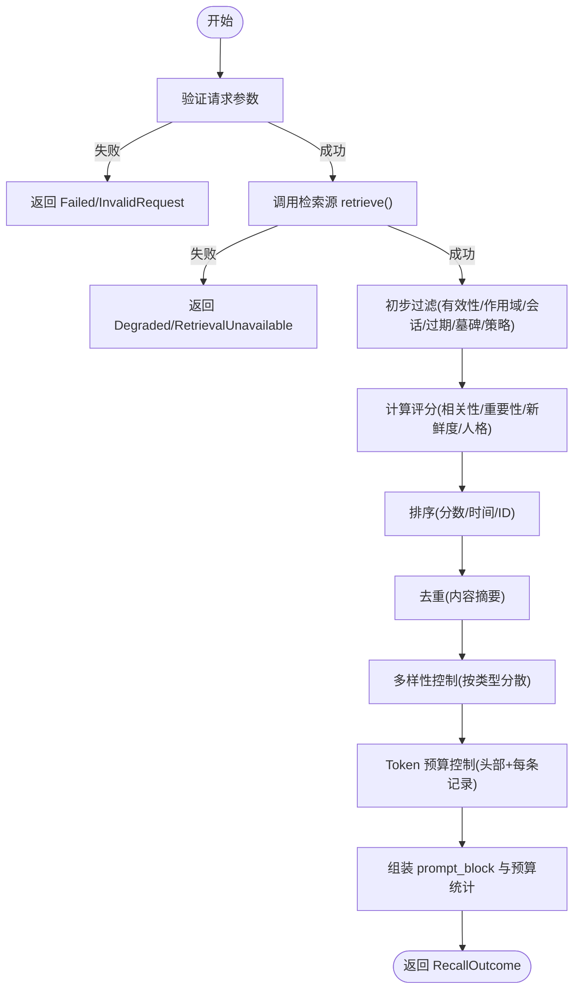
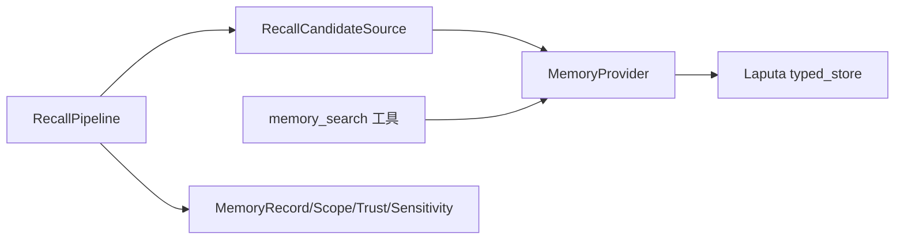
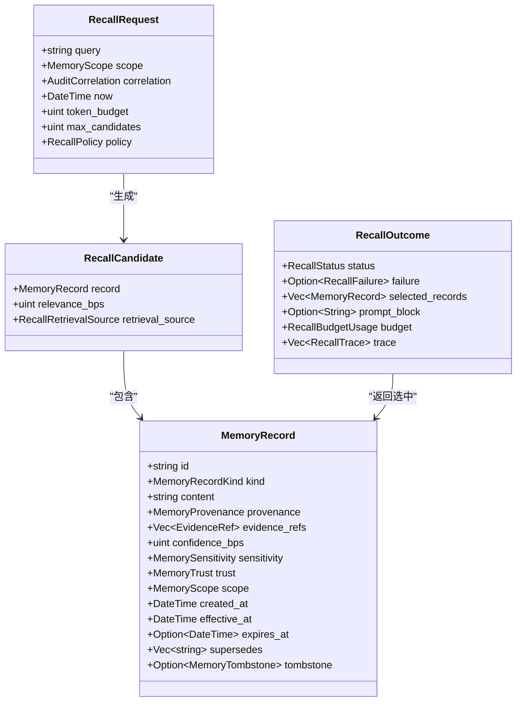

# 检索与召回

<cite>
**本文引用的文件**
- [agent-diva-core/src/memory/mod.rs](file://agent-diva-core/src/memory/mod.rs)
- [agent-diva-core/src/memory/recall.rs](file://agent-diva-core/src/memory/recall.rs)
- [agent-diva-core/src/memory/working.rs](file://agent-diva-core/src/memory/working.rs)
- [agent-diva-core/src/memory/actmem.rs](file://agent-diva-core/src/memory/actmem.rs)
- [agent-diva-core/src/memory/provider.rs](file://agent-diva-core/src/memory/provider.rs)
- [agent-diva-core/src/memory/crud.rs](file://agent-diva-core/src/memory/crud.rs)
- [agent-diva-core/src/memory/record.rs](file://agent-diva-core/src/memory/record.rs)
- [agent-diva-tools/src/memory_search.rs](file://agent-diva-tools/src/memory_search.rs)
- [agent-diva-laputa/src/typed_store.rs](file://agent-diva-laputa/src/typed_store.rs)
</cite>

## 目录
1. [简介](#简介)
2. [项目结构](#项目结构)
3. [核心组件](#核心组件)
4. [架构总览](#架构总览)
5. [详细组件分析](#详细组件分析)
6. [依赖关系分析](#依赖关系分析)
7. [性能考量](#性能考量)
8. [故障排查指南](#故障排查指南)
9. [结论](#结论)
10. [附录](#附录)

## 简介
本文件面向“记忆检索与召回系统”的设计与实现，聚焦 RecallPipeline 的端到端处理链路：从请求到结果的完整流程；工作记忆、活动记忆（Actmem）、长期记忆的检索策略；语义搜索的实现方式（向量检索、关键词匹配、混合搜索）；召回预算管理与 Token 估算；候选选择、相关性评分与去重策略；检索 API 的使用示例与调优建议；以及检索效果评估与监控指标。

## 项目结构
记忆子系统位于 agent-diva-core 的 memory 模块，提供统一的领域契约与编排逻辑；工具层在 agent-diva-tools 暴露 memory_search 等工具；Laputa 提供底层存储与检索能力（BM25 FTS）。

图表来源
- [agent-diva-core/src/memory/recall.rs:1-120](file://agent-diva-core/src/memory/recall.rs#L1-L120)
- [agent-diva-core/src/memory/provider.rs:414-617](file://agent-diva-core/src/memory/provider.rs#L414-L617)
- [agent-diva-core/src/memory/working.rs:10-76](file://agent-diva-core/src/memory/working.rs#L10-L76)
- [agent-diva-core/src/memory/actmem.rs:1-51](file://agent-diva-core/src/memory/actmem.rs#L1-L51)
- [agent-diva-core/src/memory/crud.rs:1-192](file://agent-diva-core/src/memory/crud.rs#L1-L192)
- [agent-diva-core/src/memory/record.rs:14-120](file://agent-diva-core/src/memory/record.rs#L14-L120)
- [agent-diva-tools/src/memory_search.rs:1-105](file://agent-diva-tools/src/memory_search.rs#L1-L105)
- [agent-diva-laputa/src/typed_store.rs:93-98](file://agent-diva-laputa/src/typed_store.rs#L93-L98)

章节来源
- [agent-diva-core/src/memory/mod.rs:1-47](file://agent-diva-core/src/memory/mod.rs#L1-L47)

## 核心组件
- RecallPipeline：无状态编排器，负责调用检索源、执行筛选、评分、去重、多样性控制、预算控制并产出结果与审计追踪。
- MemoryProvider：统一边界，封装启动注入、预取、同步、会话结束钩子及 CRUD/ACTMEM/工作记忆等能力。
- 工作记忆（Working Memory）：会话级检查点，用于短期上下文，不持久化为权威数据。
- 活动记忆（Actmem）：读/写/编辑工作区片段、完成条目、折叠会话等能力。
- 长期记忆：通过 provider 与 Laputa 存储交互，支持 BM25 全文检索与可见性过滤。
- 记录模型：包含类型、信任、敏感度、作用域、时间戳、证据引用等元信息，支撑安全与质量约束。

章节来源
- [agent-diva-core/src/memory/recall.rs:18-156](file://agent-diva-core/src/memory/recall.rs#L18-L156)
- [agent-diva-core/src/memory/provider.rs:414-617](file://agent-diva-core/src/memory/provider.rs#L414-L617)
- [agent-diva-core/src/memory/working.rs:10-76](file://agent-diva-core/src/memory/working.rs#L10-L76)
- [agent-diva-core/src/memory/actmem.rs:1-51](file://agent-diva-core/src/memory/actmem.rs#L1-L51)
- [agent-diva-core/src/memory/record.rs:14-120](file://agent-diva-core/src/memory/record.rs#L14-L120)

## 架构总览
下图展示一次“检索与召回”的端到端流程：上层工具或编排器构造 RecallRequest，RecallPipeline 调用 RecallCandidateSource（由具体 provider 实现），获取候选后进入确定性筛选阶段，最终输出 RecallOutcome。

图表来源
- [agent-diva-core/src/memory/recall.rs:218-359](file://agent-diva-core/src/memory/recall.rs#L218-L359)
- [agent-diva-core/src/memory/provider.rs:501-508](file://agent-diva-core/src/memory/provider.rs#L501-L508)
- [agent-diva-laputa/src/typed_store.rs:1166-1205](file://agent-diva-laputa/src/typed_store.rs#L1166-L1205)

## 详细组件分析

### RecallPipeline：设计与工作流程
- 输入：RecallRequest（查询、作用域、审计关联、当前时间、token 预算、最大候选数、策略）。
- 检索：通过 RecallCandidateSource.retrieve 异步获取候选；若不可用则降级为“空结果+Degraded”。
- 筛选与评分：
  - 初步过滤：有效性、作用域/会话匹配、过期/墓碑、信任/敏感度策略。
  - 评分：综合相关性、重要性、新鲜度、人格相关度，得到 final_score_bps。
  - 排序：按分数降序，再按有效时间与 ID 稳定排序。
  - 去重：基于内容摘要去重。
  - 多样性：按记录类型做种类分散。
  - 预算控制：使用保守 Token 估算器估计头部与每条记录的 token，累计不超过 token_budget。
- 输出：RecallOutcome（状态、失败原因、选中记录、提示块、预算使用、追踪明细）。

图表来源
- [agent-diva-core/src/memory/recall.rs:218-359](file://agent-diva-core/src/memory/recall.rs#L218-L359)
- [agent-diva-core/src/memory/recall.rs:400-489](file://agent-diva-core/src/memory/recall.rs#L400-L489)
- [agent-diva-core/src/memory/recall.rs:509-597](file://agent-diva-core/src/memory/recall.rs#L509-L597)

章节来源
- [agent-diva-core/src/memory/recall.rs:58-156](file://agent-diva-core/src/memory/recall.rs#L58-L156)
- [agent-diva-core/src/memory/recall.rs:218-359](file://agent-diva-core/src/memory/recall.rs#L218-L359)
- [agent-diva-core/src/memory/recall.rs:400-489](file://agent-diva-core/src/memory/recall.rs#L400-L489)
- [agent-diva-core/src/memory/recall.rs:509-597](file://agent-diva-core/src/memory/recall.rs#L509-L597)

### 不同层次的记忆检索策略
- 工作记忆（Working Memory）
  - 会话级检查点，用于短期上下文，渲染为 Markdown 块注入上下文。
  - 写入通过 SessionCheckpointWriteRequest，读取通过 SessionCheckpointRequest。
  - 策略强调“动作验证写入”“非易失状态不入长期记忆”“最小指针原则”。
- 活动记忆（Actmem）
  - 提供 Pulse/Recap/Work/Head/Capsules 等目标读取，以及 Work 子节替换、条目完成/删除等变更操作。
  - 通过 MemoryProvider.actmem_* 系列方法暴露。
- 长期记忆
  - 通过 MemoryProvider.memory_search 或 Laputa 的 search_visible 进行 BM25 全文检索，结合作用域（租户/工作区/会话）与墓碑/过期过滤。
  - 返回的候选经 RecallPipeline 进一步筛选与评分。

章节来源
- [agent-diva-core/src/memory/working.rs:10-76](file://agent-diva-core/src/memory/working.rs#L10-L76)
- [agent-diva-core/src/memory/actmem.rs:1-51](file://agent-diva-core/src/memory/actmem.rs#L1-L51)
- [agent-diva-core/src/memory/provider.rs:501-508](file://agent-diva-core/src/memory/provider.rs#L501-L508)
- [agent-diva-laputa/src/typed_store.rs:1166-1205](file://agent-diva-laputa/src/typed_store.rs#L1166-L1205)

### 语义搜索的实现：向量检索、关键词匹配、混合搜索
- 关键词匹配（BM25）
  - Laputa 使用 SQLite FTS5 对 memory_fts 表执行 MATCH 查询，并按 bm25(memory_fts) 排序，同时按 effective_at 与 memory_id 稳定排序。
  - 可见性过滤：限定 tenant_id、workspace_id，且 session_id 为空或与当前会话一致。
- 向量检索
  - 代码库中未发现显式向量检索实现；当前检索以 BM25 为主。
- 混合搜索
  - 当前未实现向量与关键词的融合打分；可通过扩展 RecallCandidateSource 将外部向量结果合并为候选，再由 RecallPipeline 统一评分与预算控制。

章节来源
- [agent-diva-laputa/src/typed_store.rs:1166-1205](file://agent-diva-laputa/src/typed_store.rs#L1166-L1205)
- [agent-diva-core/src/memory/recall.rs:218-359](file://agent-diva-core/src/memory/recall.rs#L218-L359)

### 召回预算管理与 Token 估算
- Token 估算器
  - 默认 ConservativeRecallRecallTokenEstimator 使用保守 Unicode 估算：字符数除以 3 向上取整。
  - 可替换为自定义估算器，便于接入真实 tokenizer。
- 预算控制
  - 头部提示块（固定前缀）占用若干 token。
  - 逐条记录渲染后估算其 token，累加直至达到 token_budget；超出则拒绝后续候选。
  - 预算使用统计包含 budget_tokens、used_tokens、selected_count、rejected_count。

章节来源
- [agent-diva-core/src/memory/recall.rs:199-212](file://agent-diva-core/src/memory/recall.rs#L199-L212)
- [agent-diva-core/src/memory/recall.rs:309-359](file://agent-diva-core/src/memory/recall.rs#L309-L359)
- [agent-diva-core/src/memory/recall.rs:394-398](file://agent-diva-core/src/memory/recall.rs#L394-L398)

### 召回决策机制：候选选择、相关性评分、去重策略
- 候选选择
  - 初步过滤：有效性、作用域/会话匹配、过期/墓碑、信任/敏感度策略。
  - 评分：相关性权重 55、重要性权重 20、新鲜度权重 15、人格相关度权重 10，归一化后得到 final_score_bps。
  - 排序：分数降序，次级按 effective_at 降序，再次按 ID 升序保证稳定性。
- 去重策略
  - 基于内容摘要（content_digest）去重，保留首次出现的记录。
- 多样性控制
  - 按记录类型（identity/relationship/preference/long_term/history/daily/weekly/monthly/journal/learning/session_checkpoint）做种类分散，避免同质化结果过多。

章节来源
- [agent-diva-core/src/memory/recall.rs:400-489](file://agent-diva-core/src/memory/recall.rs#L400-L489)
- [agent-diva-core/src/memory/recall.rs:509-597](file://agent-diva-core/src/memory/recall.rs#L509-L597)

### 检索 API 使用示例
- memory_search 工具
  - 名称：memory_search
  - 描述：搜索已应用的记忆权威中以匹配查询的条目。
  - 参数：query（必填），limit（可选）。
  - 行为：若无 provider 或 workspace，返回失败；否则调用 MemoryProvider.memory_search 并返回结构化结果。
- 典型调用路径
  - 上层编排器构造 MemorySearchRequest -> MemorySearchTool.execute -> MemoryProvider.memory_search -> Laputa search_visible -> 返回结果。

章节来源
- [agent-diva-tools/src/memory_search.rs:1-105](file://agent-diva-tools/src/memory_search.rs#L1-L105)
- [agent-diva-core/src/memory/provider.rs:501-508](file://agent-diva-core/src/memory/provider.rs#L501-L508)
- [agent-diva-laputa/src/typed_store.rs:1166-1205](file://agent-diva-laputa/src/typed_store.rs#L1166-L1205)

### 性能调优建议
- 调整 max_candidates：限制候选数量，减少后续评分与预算压力。
- 优化 token_budget：根据上下文窗口与成本目标设定合理预算，避免过度召回。
- 利用作用域过滤：精确指定 tenant/workspace/session，缩小检索范围。
- 引入更精确的 Token 估算器：替换默认估算器，提高预算控制的准确性。
- 扩展混合检索：在 RecallCandidateSource 中融合向量与关键词结果，提升召回质量。

[本节为通用指导，无需特定文件来源]

## 依赖关系分析
- 耦合与内聚
  - RecallPipeline 与 MemoryRecord/Scope/Trust/Sensitivity 强内聚，确保记录模型一致性。
  - MemoryProvider 作为边界，解耦上层编排与底层存储实现。
- 直接/间接依赖
  - RecallPipeline -> RecallCandidateSource -> MemoryProvider -> Laputa typed_store。
  - 工具层 memory_search -> MemoryProvider.memory_search。
- 循环依赖
  - 未见循环依赖；模块间通过 trait 与数据结构解耦。
- 外部依赖
  - Laputa 的 FTS5/BM25 检索；chrono 时间处理；serde 序列化。

图表来源
- [agent-diva-core/src/memory/recall.rs:18-156](file://agent-diva-core/src/memory/recall.rs#L18-L156)
- [agent-diva-core/src/memory/provider.rs:414-617](file://agent-diva-core/src/memory/provider.rs#L414-L617)
- [agent-diva-laputa/src/typed_store.rs:1166-1205](file://agent-diva-laputa/src/typed_store.rs#L1166-L1205)

章节来源
- [agent-diva-core/src/memory/recall.rs:18-156](file://agent-diva-core/src/memory/recall.rs#L18-L156)
- [agent-diva-core/src/memory/provider.rs:414-617](file://agent-diva-core/src/memory/provider.rs#L414-L617)

## 性能考量
- 检索阶段
  - BM25 全文检索在 SQLite FTS5 上高效，注意 LIMIT 与 WHERE 条件以减少扫描。
- 评分与去重
  - 评分复杂度 O(n log n)（排序），去重使用哈希/集合 O(n)。
- 预算控制
  - 每次记录渲染后进行 Token 估算，尽量复用估算器以避免重复开销。
- 可扩展性
  - 通过 RecallCandidateSource 抽象，可并行聚合多路检索结果（如向量+关键词）。

[本节为通用指导，无需特定文件来源]

## 故障排查指南
- 常见错误分类
  - 请求校验失败：缺少必填字段、未知信任/敏感度、候选上限无效。
  - 检索不可用：RecallSourceError，导致整体降级为 Degraded。
  - 作用域/会话不匹配：WorkspaceMismatch/SessionMismatch。
  - 过期/墓碑/被替代：Expired/Tombstoned/Superseded。
  - 预算不足：OverBudget。
- 诊断要点
  - 查看 RecallTrace 中的 reason 与 estimated_tokens，定位拒绝原因。
  - 检查 MemoryProvider 的 prefetch/sync_turn/on_session_end 状态，确认生命周期钩子是否正常。
  - 核对 Laputa 存储完整性与索引状态。

章节来源
- [agent-diva-core/src/memory/recall.rs:171-188](file://agent-diva-core/src/memory/recall.rs#L171-L188)
- [agent-diva-core/src/memory/recall.rs:509-597](file://agent-diva-core/src/memory/recall.rs#L509-L597)
- [agent-diva-core/src/memory/provider.rs:22-111](file://agent-diva-core/src/memory/provider.rs#L22-L111)

## 结论
RecallPipeline 提供了确定性强、可审计、可预算控制的记忆召回管线。通过分层记忆（工作记忆、活动记忆、长期记忆）与 provider 边界，系统实现了灵活可扩展的检索策略。当前以 BM25 关键词匹配为主，未来可通过混合检索进一步提升召回质量。合理的预算管理与评分去重策略，保障了检索成本与质量平衡。

[本节为总结，无需特定文件来源]

## 附录

### 关键数据结构概览

图表来源
- [agent-diva-core/src/memory/recall.rs:58-156](file://agent-diva-core/src/memory/recall.rs#L58-L156)
- [agent-diva-core/src/memory/record.rs:14-120](file://agent-diva-core/src/memory/record.rs#L14-L120)

### 检索效果评估与监控指标
- 指标建议
  - 召回率/准确率：基于业务标注集评估。
  - 预算使用：budget_tokens vs used_tokens，selected_count vs rejected_count。
  - 降级比例：Degraded/Failed 占比。
  - 去重率/多样性：重复记录比例、类型分布。
- 监控点
  - RecallTrace 中的 reason 分布。
  - 各阶段的耗时（检索、评分、预算控制）。
  - 存储健康度（FTS 索引大小、命中率）。

[本节为通用指导，无需特定文件来源]