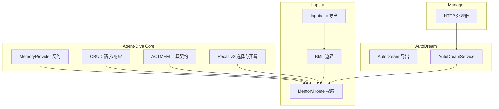
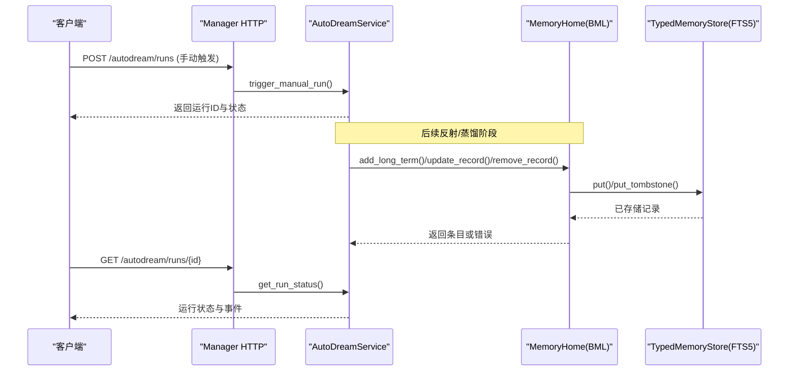
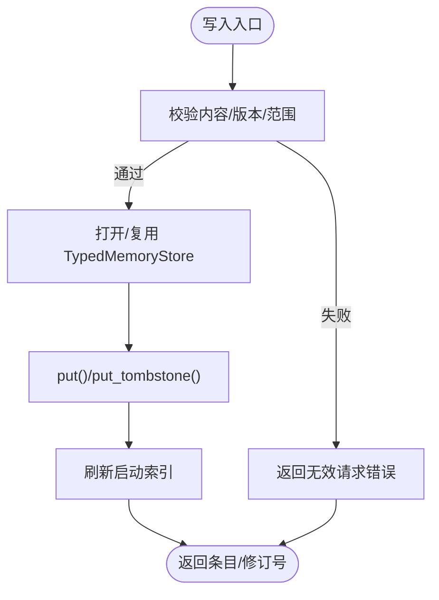
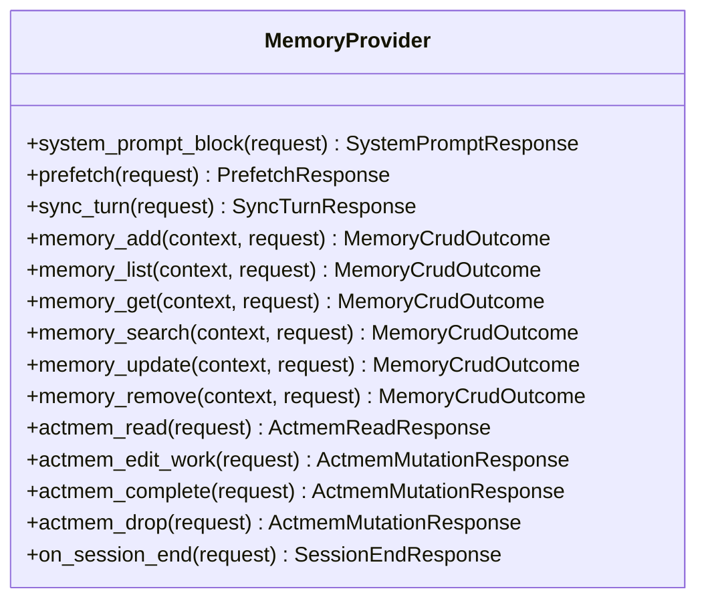
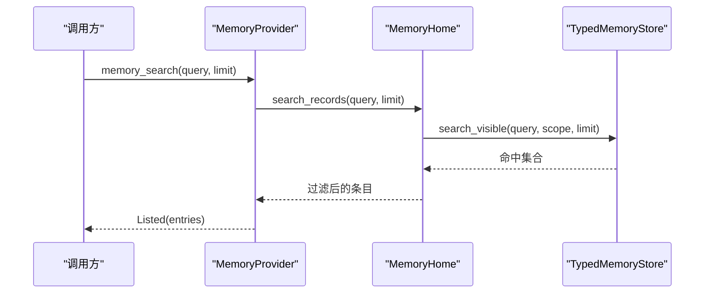
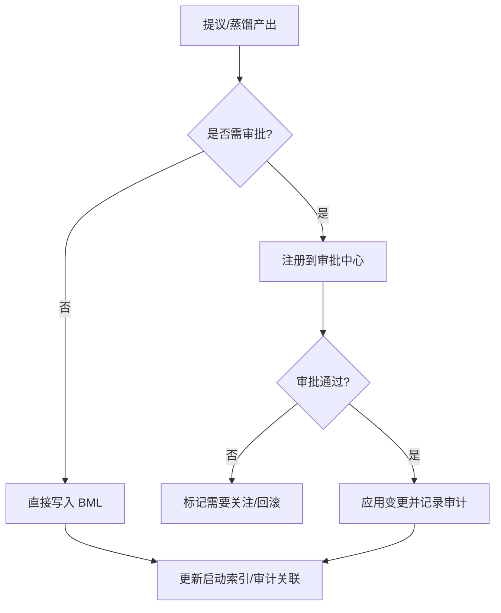
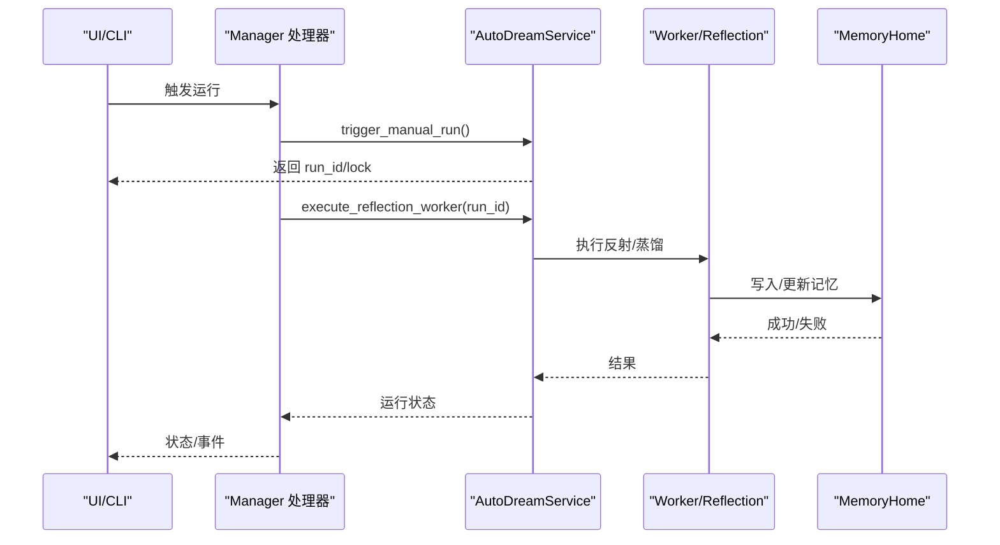

# 记忆系统

<cite>
**本文引用的文件**
- [agent-diva-laputa/src/lib.rs](file://agent-diva-laputa/src/lib.rs)
- [agent-diva-laputa/src/bml/mod.rs](file://agent-diva-laputa/src/bml/mod.rs)
- [agent-diva-laputa/src/bml/memory_home.rs](file://agent-diva-laputa/src/bml/memory_home.rs)
- [agent-diva-core/src/memory/mod.rs](file://agent-diva-core/src/memory/mod.rs)
- [agent-diva-core/src/memory/provider.rs](file://agent-diva-core/src/memory/provider.rs)
- [agent-diva-core/src/memory/crud.rs](file://agent-diva-core/src/memory/crud.rs)
- [agent-diva-core/src/memory/actmem.rs](file://agent-diva-core/src/memory/actmem.rs)
- [agent-diva-core/src/memory/recall.rs](file://agent-diva-core/src/memory/recall.rs)
- [agent-diva-autodream/src/lib.rs](file://agent-diva-autodream/src/lib.rs)
- [agent-diva-autodream/src/service.rs](file://agent-diva-autodream/src/service.rs)
- [agent-diva-manager/src/handlers/autodream.rs](file://agent-diva-manager/src/handlers/autodream.rs)
</cite>

## 目录
1. [简介](#简介)
2. [项目结构](#项目结构)
3. [核心组件](#核心组件)
4. [架构总览](#架构总览)
5. [详细组件分析](#详细组件分析)
6. [依赖关系分析](#依赖关系分析)
7. [性能考量](#性能考量)
8. [故障排查指南](#故障排查指南)
9. [结论](#结论)
10. [附录：API 与配置示例](#附录api-与配置示例)

## 简介
本文件面向“记忆系统”的完整说明，覆盖 BML（基础记忆层）与 Laputa（人格治理层）的分层架构、记忆数据的存储结构与 CRUD、语义搜索、Laputa 的治理机制（提案生成、审批流程、回滚审计）、AutoDream 的自动蒸馏与提案生命周期，以及记忆管理的最佳实践（数据迁移、备份恢复、性能优化），并提供 API 使用示例与配置选项。

## 项目结构
记忆系统由三个关键模块组成：
- agent-diva-core：定义 MemoryProvider 契约、CRUD 请求/响应、ACTMEM 工具契约、Recall v2 选择与预算管线等通用领域模型。
- agent-diva-laputa：实现机器级 BML 权威（TypedMemoryStore + FTS5）、ACTMEM、MEMRULES、Persona 工作区与冻结快照；对外暴露 MemoryHome 作为唯一生产写入权威。
- agent-diva-autodream：提供自动蒸馏编排服务、运行记录、事件日志、月度报告与技能反思引擎集成。
- agent-diva-manager：通过 HTTP 处理器暴露 AutoDream 的运行触发、状态查询、事件列表与取消等接口。

图表来源
- [agent-diva-core/src/memory/provider.rs:414-617](file://agent-diva-core/src/memory/provider.rs#L414-L617)
- [agent-diva-laputa/src/bml/mod.rs:1-37](file://agent-diva-laputa/src/bml/mod.rs#L1-L37)
- [agent-diva-laputa/src/bml/memory_home.rs:85-177](file://agent-diva-laputa/src/bml/memory_home.rs#L85-L177)
- [agent-diva-autodream/src/lib.rs:17-43](file://agent-diva-autodream/src/lib.rs#L17-L43)
- [agent-diva-autodream/src/service.rs:124-133](file://agent-diva-autodream/src/service.rs#L124-L133)
- [agent-diva-manager/src/handlers/autodream.rs:12-90](file://agent-diva-manager/src/handlers/autodream.rs#L12-L90)

章节来源
- [agent-diva-core/src/memory/mod.rs:1-47](file://agent-diva-core/src/memory/mod.rs#L1-L47)
- [agent-diva-laputa/src/lib.rs:1-56](file://agent-diva-laputa/src/lib.rs#L1-L56)
- [agent-diva-autodream/src/lib.rs:1-43](file://agent-diva-autodream/src/lib.rs#L1-L43)

## 核心组件
- MemoryProvider（Core）：定义启动注入、意图感知预取、回合同步、会话结束钩子、CRUD、ACTMEM 读写、经验蒸馏、会话检查点等能力边界。默认不支持的方法返回“未支持”，由具体提供者（如 Laputa MemoryHome）覆写。
- BML 权威（Laputa）：Machine-wide TypedMemoryStore + FTS5，唯一生产写入权威；提供 list/get/add/update/remove/search、ACTMEM 读取与编辑、MEMRULES 读写、会话检查点写入与清理、启动索引刷新。
- Recall v2（Core）：确定性候选检索、评分与预算控制，输出选择结果、提示块、预算使用与审计追踪。
- AutoDream（Autodream）：运行生命周期管理、锁与恢复、事件追加、报告与反思执行、与 MemoryHome 集成以产出持久化变更。
- Manager HTTP（Manager）：触发/查询/取消 AutoDream 运行，映射错误码与状态。

章节来源
- [agent-diva-core/src/memory/provider.rs:414-617](file://agent-diva-core/src/memory/provider.rs#L414-L617)
- [agent-diva-laputa/src/bml/memory_home.rs:179-491](file://agent-diva-laputa/src/bml/memory_home.rs#L179-L491)
- [agent-diva-core/src/memory/recall.rs:1-200](file://agent-diva-core/src/memory/recall.rs#L1-L200)
- [agent-diva-autodream/src/service.rs:202-489](file://agent-diva-autodream/src/service.rs#L202-L489)
- [agent-diva-manager/src/handlers/autodream.rs:12-139](file://agent-diva-manager/src/handlers/autodream.rs#L12-L139)

## 架构总览
BML 是机器级权威存储，Laputa 在其之上提供逻辑边界与治理相关能力（ACTMEM、MEMRULES、Persona 工作区与冻结快照）。Core 通过 MemoryProvider 抽象解耦 Agent 运行时与后端存储；AutoDream 通过服务编排调用 MemoryHome 完成持久化变更，并由 Manager 暴露 HTTP 接口进行外部控制。

图表来源
- [agent-diva-manager/src/handlers/autodream.rs:12-90](file://agent-diva-manager/src/handlers/autodream.rs#L12-L90)
- [agent-diva-autodream/src/service.rs:202-255](file://agent-diva-autodream/src/service.rs#L202-L255)
- [agent-diva-laputa/src/bml/memory_home.rs:205-346](file://agent-diva-laputa/src/bml/memory_home.rs#L205-L346)

## 详细组件分析

### BML（基础记忆层）
- 存储形态：SQLite + FTS5，路径位于配置目录 memory 子目录，文件名 memory.sqlite3；MEMRULES.MD 为可编辑规则文件。
- 权威边界：非 BML 模块不得直接调用原始写入 API（put/import_records/gc/backup/restore），通过 MemoryHome 统一入口。
- 主要能力：
  - 长时记忆：add/update/remove（CAS 版本控制）、list/get、search（FTS5 全文检索）。
  - ACTMEM：Pulse/Recap/Work/Capsules 读取与工作区 CAS 编辑。
  - 会话检查点：按 session_id 写入/清理。
  - 启动索引：维护 L1 索引块并缓存 Markdown 片段用于系统提示注入。
- 错误与一致性：RevisionConflict、KindForbidden、NotFound、Io 等错误分类清晰；tombstone 标记软删除并保留审计线索。

图表来源
- [agent-diva-laputa/src/bml/memory_home.rs:205-346](file://agent-diva-laputa/src/bml/memory_home.rs#L205-L346)
- [agent-diva-laputa/src/bml/memory_home.rs:394-418](file://agent-diva-laputa/src/bml/memory_home.rs#L394-L418)

章节来源
- [agent-diva-laputa/src/bml/mod.rs:1-37](file://agent-diva-laputa/src/bml/mod.rs#L1-L37)
- [agent-diva-laputa/src/bml/memory_home.rs:85-177](file://agent-diva-laputa/src/bml/memory_home.rs#L85-L177)
- [agent-diva-laputa/src/bml/memory_home.rs:179-491](file://agent-diva-laputa/src/bml/memory_home.rs#L179-L491)

### MemoryProvider（Core 契约）
- 启动注入：system_prompt_block 同步返回紧凑 Markdown；system_prompt_revision 提供版本；refresh_system_prompt_projection 在外部写入后刷新。
- 回合流：prefetch（意图感知召回）、sync_turn（成功后持久化）、record_recall_outcome（记录召回结果）。
- CRUD 工具：memory_add/list/get/search/update/remove，默认返回“未支持”，由 MemoryHome 实现。
- ACTMEM：actmem_read/edit_work/complete/drop，默认不可用。
- 会话检查点：session_checkpoint_block/write，默认不可用。
- 会话结束：on_session_end 钩子，幂等处理。

图表来源
- [agent-diva-core/src/memory/provider.rs:414-617](file://agent-diva-core/src/memory/provider.rs#L414-L617)

章节来源
- [agent-diva-core/src/memory/provider.rs:22-381](file://agent-diva-core/src/memory/provider.rs#L22-L381)
- [agent-diva-core/src/memory/provider.rs:414-617](file://agent-diva-core/src/memory/provider.rs#L414-L617)

### CRUD 与语义搜索
- 请求类型：MemoryAddRequest、MemoryListRequest、MemoryGetRequest、MemorySearchRequest、MemoryUpdateRequest、MemoryRemoveRequest、MemoryDistillRequest。
- 结果类型：MemoryEntry（含 id/content/trust/provenance/evidence_refs/revision/timestamps）、MemoryCrudOutcome（Applied/Listed/Failed）。
- 语义搜索：MemoryHome.search_records 基于 FTS5 对可见记录检索，过滤被替代/墓碑项，限制 limit。

图表来源
- [agent-diva-core/src/memory/crud.rs:11-81](file://agent-diva-core/src/memory/crud.rs#L11-L81)
- [agent-diva-core/src/memory/crud.rs:83-127](file://agent-diva-core/src/memory/crud.rs#L83-L127)
- [agent-diva-laputa/src/bml/memory_home.rs:420-437](file://agent-diva-laputa/src/bml/memory_home.rs#L420-L437)
- [agent-diva-core/src/memory/provider.rs:501-508](file://agent-diva-core/src/memory/provider.rs#L501-L508)

章节来源
- [agent-diva-core/src/memory/crud.rs:11-127](file://agent-diva-core/src/memory/crud.rs#L11-L127)
- [agent-diva-laputa/src/bml/memory_home.rs:420-437](file://agent-diva-laputa/src/bml/memory_home.rs#L420-L437)

### ACTMEM 与 MEMRULES
- ACTMEM：Pulse/Recap/Work/Capsules 读取，Work 子节 CAS 替换，Open 项完成/删除，均带 revision 保护。
- MEMRULES：读/写规则文档，空内容拒绝，原子写入。

章节来源
- [agent-diva-core/src/memory/actmem.rs:1-51](file://agent-diva-core/src/memory/actmem.rs#L1-L51)
- [agent-diva-laputa/src/bml/memory_home.rs:348-372](file://agent-diva-laputa/src/bml/memory_home.rs#L348-L372)
- [agent-diva-laputa/src/bml/memory_home.rs:712-796](file://agent-diva-laputa/src/bml/memory_home.rs#L712-L796)

### Laputa 治理机制（提案、审批、回滚审计）
- 生产写入路径：当前 BML 直接写入，不再走 governed-apply 管道；但审计与一致性通过 tombstone、correlation、content_digest 等字段保障。
- 回滚审计：remove_record 创建 tombstone，记录目标 ID、原因摘要、操作者、时间戳，供审计与可视化。
- 治理协调：Manager 侧 ApprovalCoordinator 作为统一审批权威；Laputa 列表/详情/Persona 工作区读取投影现有治理状态，不提交新审批事件。
- 提案生命周期（AutoDream）：运行记录包含 orchestration 阶段、attempt、deadline；事件追加记录 gate_code/proposal_id/failure_code；失败重试与恢复策略明确。

图表来源
- [agent-diva-laputa/src/bml/memory_home.rs:284-346](file://agent-diva-laputa/src/bml/memory_home.rs#L284-L346)
- [agent-diva-autodream/src/service.rs:202-489](file://agent-diva-autodream/src/service.rs#L202-L489)

章节来源
- [agent-diva-laputa/src/bml/mod.rs:1-37](file://agent-diva-laputa/src/bml/mod.rs#L1-L37)
- [agent-diva-autodream/src/service.rs:202-489](file://agent-diva-autodream/src/service.rs#L202-L489)

### AutoDream 自动蒸馏与提案生命周期
- 运行生命周期：trigger_manual_run 创建运行记录与锁；execute_reflection_worker 执行反射/蒸馏；execute_report_trigger 生成节奏报告；cancel_run 终止并清理锁。
- 恢复与重试：recover_stale_lock_if_needed 检测过期锁并重新排队；月度报告最多尝试次数；事件 JSONL 追加审计轨迹。
- 与 MemoryHome 集成：反射/蒸馏完成后调用 MemoryHome 写入持久化变更（add/update/remove），并刷新启动索引。

图表来源
- [agent-diva-manager/src/handlers/autodream.rs:12-139](file://agent-diva-manager/src/handlers/autodream.rs#L12-L139)
- [agent-diva-autodream/src/service.rs:202-489](file://agent-diva-autodream/src/service.rs#L202-L489)
- [agent-diva-laputa/src/bml/memory_home.rs:205-346](file://agent-diva-laputa/src/bml/memory_home.rs#L205-L346)

章节来源
- [agent-diva-autodream/src/lib.rs:17-43](file://agent-diva-autodream/src/lib.rs#L17-L43)
- [agent-diva-autodream/src/service.rs:202-800](file://agent-diva-autodream/src/service.rs#L202-L800)
- [agent-diva-manager/src/handlers/autodream.rs:12-139](file://agent-diva-manager/src/handlers/autodream.rs#L12-L139)

## 依赖关系分析
- Core 对 Laputa：仅依赖 MemoryProvider 契约；Laputa 实现该契约并通过 MemoryHome 暴露能力。
- Autodream 对 Core/Laputa：依赖 Core 的报告/演化类型与 Laputa 的 MemoryHome；通过服务装配注入 SkillHome、SkillReflectionEngine、LlmCurationConfig。
- Manager 对 Autodream：通过 HTTP 处理器调用服务方法，映射错误码与状态。

图表来源
- [agent-diva-core/src/memory/provider.rs:414-617](file://agent-diva-core/src/memory/provider.rs#L414-L617)
- [agent-diva-laputa/src/bml/memory_home.rs:85-177](file://agent-diva-laputa/src/bml/memory_home.rs#L85-L177)
- [agent-diva-autodream/src/service.rs:124-133](file://agent-diva-autodream/src/service.rs#L124-L133)
- [agent-diva-manager/src/handlers/autodream.rs:12-90](file://agent-diva-manager/src/handlers/autodream.rs#L12-L90)

章节来源
- [agent-diva-core/src/memory/provider.rs:414-617](file://agent-diva-core/src/memory/provider.rs#L414-L617)
- [agent-diva-laputa/src/bml/memory_home.rs:85-177](file://agent-diva-laputa/src/bml/memory_home.rs#L85-L177)
- [agent-diva-autodream/src/service.rs:124-133](file://agent-diva-autodream/src/service.rs#L124-L133)
- [agent-diva-manager/src/handlers/autodream.rs:12-90](file://agent-diva-manager/src/handlers/autodream.rs#L12-L90)

## 性能考量
- 启动索引缓存：MemoryHome 维护 startup_markdown 与 atomic revision，避免每次读取都扫描数据库；写入后增量刷新。
- 会话检查点 GC：run_startup_gc 清理过期会话作用域记录，减少噪声与体积。
- 搜索限制：search 与 prefetch 均限制返回数量，防止上下文膨胀。
- 原子写入：所有关键文件写入采用原子写入，降低崩溃不一致风险。
- 锁与恢复：AutoDream 使用文件锁与超时恢复，避免僵尸进程阻塞。

[本节为通用指导，无需特定文件引用]

## 故障排查指南
- 常见错误码：
  - bml_unavailable：底层存储不可用（如数据库缺失/损坏）。
  - memory_not_found：记录不存在或被墓碑化。
  - memory_revision_conflict：CAS 版本冲突，需先获取最新 revision。
  - memory_kind_forbidden：非 LongTerm 写入被拒绝。
  - invalid_state：AutoDream 运行状态非法（如不可取消）。
  - run_not_found：运行记录不存在。
  - active_run_exists：已有活跃运行。
- 诊断建议：
  - 查看 AutoDream 事件 JSONL 获取最近事件与失败代码。
  - 检查 lock 文件是否存在且过期，必要时清理。
  - 验证 MEMRULES 是否为空或格式异常。
  - 确认数据库文件存在且可访问。

章节来源
- [agent-diva-laputa/src/bml/memory_home.rs:39-70](file://agent-diva-laputa/src/bml/memory_home.rs#L39-L70)
- [agent-diva-manager/src/handlers/autodream.rs:92-113](file://agent-diva-manager/src/handlers/autodream.rs#L92-L113)
- [agent-diva-autodream/src/service.rs:656-705](file://agent-diva-autodream/src/service.rs#L656-L705)

## 结论
记忆系统通过 Core 的 MemoryProvider 契约将 Agent 运行时与存储解耦；Laputa 的 BML 提供机器级权威存储与 ACTMEM/MEMRULES 能力；AutoDream 负责自动蒸馏与报告的生命周期编排；Manager 暴露 HTTP 接口便于外部控制。整体设计强调一致性（CAS、tombstone、审计关联）、可观测性（事件 JSONL、指标）与健壮性（锁恢复、降级策略）。

[本节为总结，无需特定文件引用]

## 附录：API 与配置示例

- 启动注入（MemoryProvider.system_prompt_block）
  - 输入：SystemPromptRequest{ workspace_root }
  - 输出：SystemPromptResponse{ status, prompt_block }
  - 行为：返回紧凑 Markdown，用于系统提示拼接。

- 预取召回（MemoryProvider.prefetch）
  - 输入：PrefetchRequest{ workspace_root, intent, current_room, user_message }
  - 输出：PrefetchResponse{ status, prompt_block }
  - 行为：基于意图/消息进行语义搜索，返回可选提示块。

- 回合同步（MemoryProvider.sync_turn）
  - 输入：SyncTurnRequest{ workspace_root, memory_update_markdown, history_entry }
  - 输出：SyncTurnResponse{ status }
  - 行为：成功后持久化记忆更新或历史条目。

- CRUD 示例（MemoryProvider.memory_*）
  - 添加：memory_add(MemoryAddRequest{ content, evidence_refs }) -> Applied(entry?)
  - 列出：memory_list(MemoryListRequest{ limit? }) -> Listed(entries)
  - 获取：memory_get(MemoryGetRequest{ record_id }) -> Listed([entry]) or Failed
  - 搜索：memory_search(MemorySearchRequest{ query, limit? }) -> Listed(entries)
  - 更新：memory_update(MemoryUpdateRequest{ record_id, content, base_revision, evidence_refs? }) -> Applied(entry)
  - 删除：memory_remove(MemoryRemoveRequest{ record_id, reason, base_revision }) -> Applied(entry)

- ACTMEM 示例（MemoryProvider.actmem_*）
  - 读取：actmem_read(ActmemReadRequest{ target, capsule_name? }) -> ActmemReadResponse{ revision, content }
  - 编辑工作：actmem_edit_work(ActmemEditWorkRequest{ section, replacement, base_revision }) -> ActmemMutationResponse
  - 完成/删除：actmem_complete/drop(ActmemItemRequest{ section, item_index, base_revision }) -> ActmemMutationResponse

- AutoDream HTTP 示例（Manager）
  - 触发运行：POST /autodream/runs { trigger? } -> { status, run, lock, auto_mode_enabled, session_threshold_enabled }
  - 查询运行：GET /autodream/runs/{id} -> { status, run, lock, ... }
  - 事件列表：GET /autodream/runs/{id}/events -> { events }
  - 取消运行：DELETE /autodream/runs/{id} -> { status, run, lock, ... }

- 配置要点
  - MemoryHome：config_dir 决定 memory 目录与数据库位置；l1_index_lines 控制启动索引行数。
  - AutoDreamService：with_memory_home/MemoryHome 注入；with_skill_home/SkillHome；with_report_curation(LlmCurationConfig)；stale_lock_after 控制锁过期阈值。
  - 运行时：确保 .laputa 工作区存在且可打开；若无法打开应返回降级状态而非静默回退。

章节来源
- [agent-diva-core/src/memory/provider.rs:237-381](file://agent-diva-core/src/memory/provider.rs#L237-L381)
- [agent-diva-core/src/memory/provider.rs:414-617](file://agent-diva-core/src/memory/provider.rs#L414-L617)
- [agent-diva-core/src/memory/actmem.rs:1-51](file://agent-diva-core/src/memory/actmem.rs#L1-L51)
- [agent-diva-laputa/src/bml/memory_home.rs:102-177](file://agent-diva-laputa/src/bml/memory_home.rs#L102-L177)
- [agent-diva-autodream/src/service.rs:150-200](file://agent-diva-autodream/src/service.rs#L150-L200)
- [agent-diva-manager/src/handlers/autodream.rs:12-90](file://agent-diva-manager/src/handlers/autodream.rs#L12-L90)