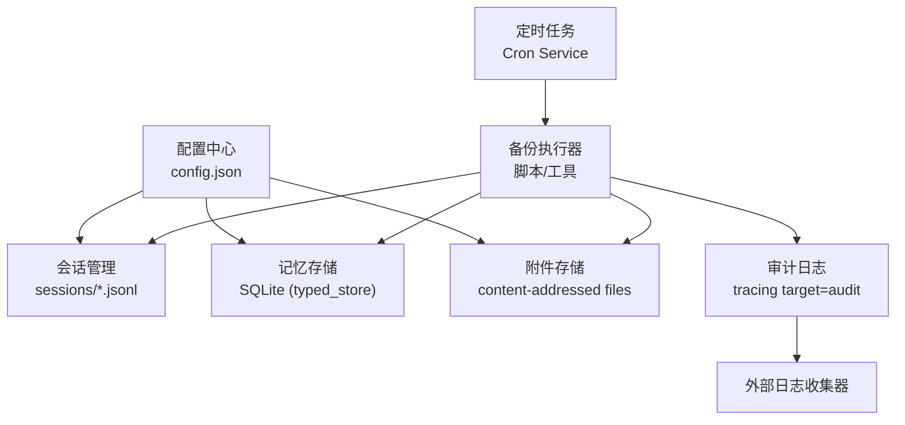
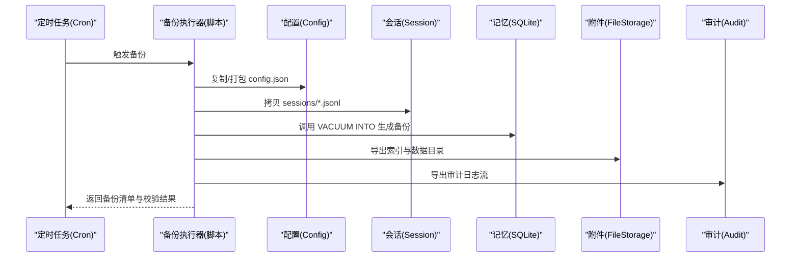
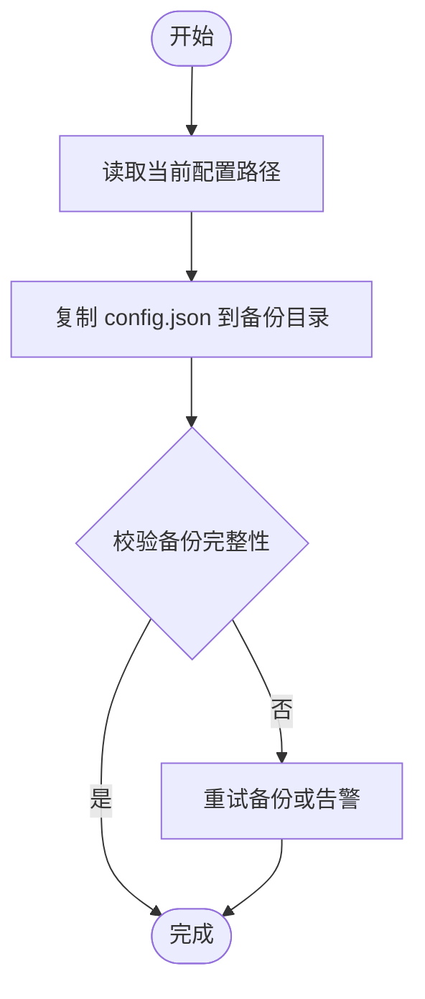
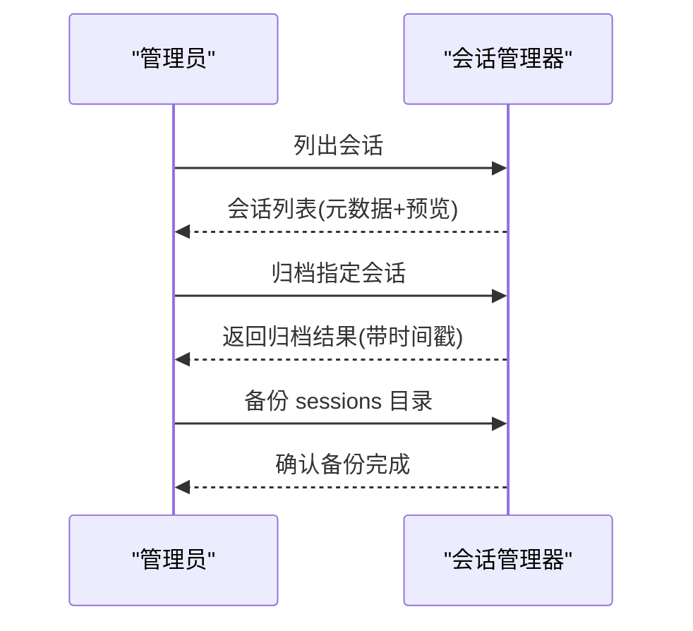
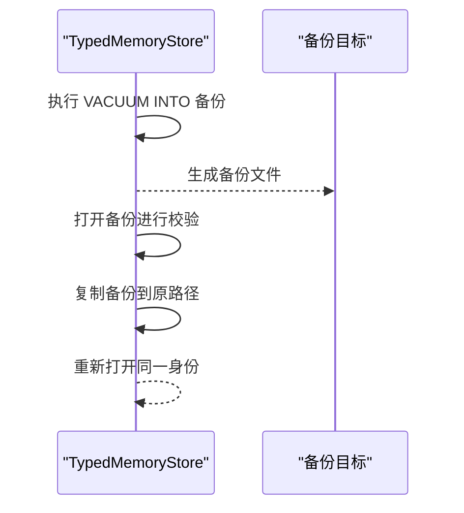
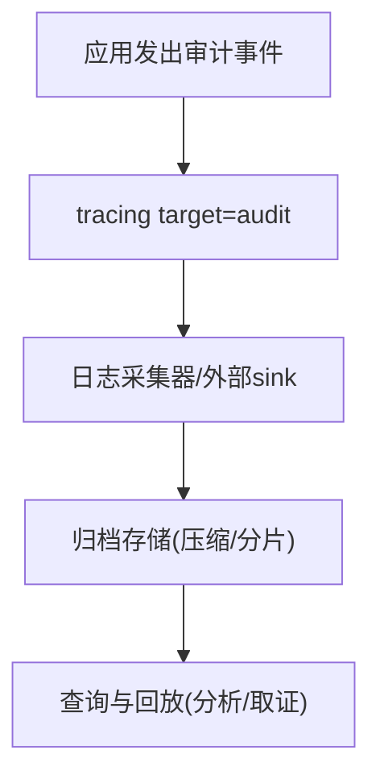
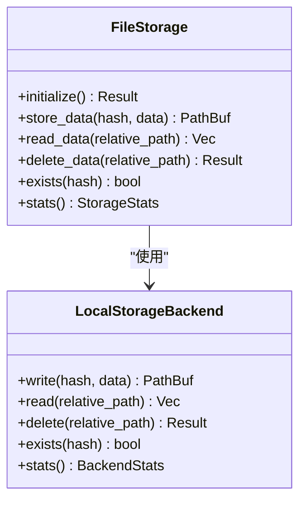
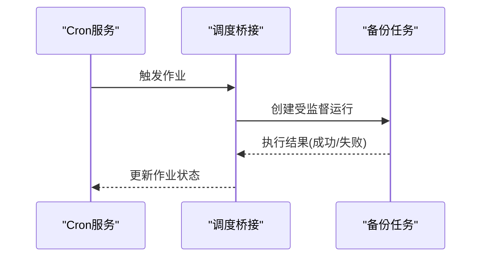
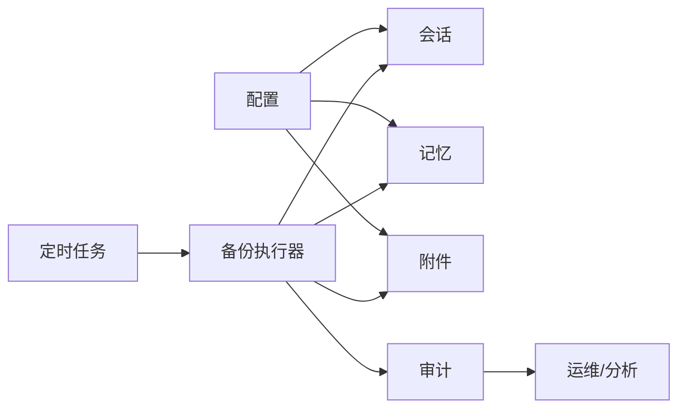

# 备份恢复

<cite>
**本文引用的文件**
- [agent-diva-core/src/config/loader.rs](file://agent-diva-core/src/config/loader.rs)
- [agent-diva-core/src/session/manager.rs](file://agent-diva-core/src/session/manager.rs)
- [agent-diva-core/src/audit.rs](file://agent-diva-core/src/audit.rs)
- [agent-diva-core/src/memory/mod.rs](file://agent-diva-core/src/memory/mod.rs)
- [agent-diva-laputa/src/typed_store.rs](file://agent-diva-laputa/src/typed_store.rs)
- [agent-diva-files/src/storage.rs](file://agent-diva-files/src/storage.rs)
- [agent-diva-files/src/config.rs](file://agent-diva-files/src/config.rs)
- [agent-diva-core/src/cron/types.rs](file://agent-diva-core/src/cron/types.rs)
- [agent-diva-core/src/cron/service.rs](file://agent-diva-core/src/cron/service.rs)
- [agent-diva-core/src/scheduler/bridge.rs](file://agent-diva-core/src/scheduler/bridge.rs)
- [contrib/systemd/agent-diva.service](file://contrib/systemd/agent-diva.service)
</cite>

## 目录
1. [简介](#简介)
2. [项目结构](#项目结构)
3. [核心组件](#核心组件)
4. [架构总览](#架构总览)
5. [详细组件分析](#详细组件分析)
6. [依赖关系分析](#依赖关系分析)
7. [性能考虑](#性能考虑)
8. [故障排查指南](#故障排查指南)
9. [结论](#结论)
10. [附录](#附录)

## 简介
本文件为 Agent-Diva 的备份与恢复策略文档，覆盖配置、会话数据、记忆存储（含 BML/Laputa 持久化）、审计日志、附件存储等关键数据的备份范围；提供自动化备份脚本与定时任务配置建议；说明全量与增量备份策略、数据恢复流程与验证方法；给出灾难恢复计划与业务连续性保障方案；并补充数据迁移与版本升级时的备份注意事项。

## 项目结构
Agent-Diva 的数据与备份相关能力分布在多个模块：
- 配置：JSON 配置文件加载与热重载，保存路径位于用户目录或工作区。
- 会话：会话以 JSONL 形式落盘，采用原子替换写入，支持归档与重置。
- 记忆：BML/Laputa 通过 SQLite 持久化，提供 VACUUM INTO 的全量备份与 restore 校验恢复。
- 审计：结构化事件通过 tracing target "audit" 输出，可被外部 sink 收集。
- 附件：内容寻址的文件存储，支持本地后端与统计信息。
- 定时任务：内置 cron 服务与调度桥接，可用于编排备份任务。
- 系统服务：systemd 单元定义运行环境与读写路径，便于在 Linux 上部署。

图表来源
- [agent-diva-core/src/config/loader.rs:57-82](file://agent-diva-core/src/config/loader.rs#L57-L82)
- [agent-diva-core/src/session/manager.rs:190-250](file://agent-diva-core/src/session/manager.rs#L190-L250)
- [agent-diva-laputa/src/typed_store.rs:1272-1303](file://agent-diva-laputa/src/typed_store.rs#L1272-L1303)
- [agent-diva-core/src/audit.rs:224-253](file://agent-diva-core/src/audit.rs#L224-L253)
- [agent-diva-files/src/storage.rs:32-106](file://agent-diva-files/src/storage.rs#L32-L106)
- [agent-diva-core/src/cron/service.rs:1-567](file://agent-diva-core/src/cron/service.rs#L1-L567)

章节来源
- [agent-diva-core/src/config/loader.rs:57-82](file://agent-diva-core/src/config/loader.rs#L57-L82)
- [agent-diva-core/src/session/manager.rs:190-250](file://agent-diva-core/src/session/manager.rs#L190-L250)
- [agent-diva-laputa/src/typed_store.rs:1272-1303](file://agent-diva-laputa/src/typed_store.rs#L1272-L1303)
- [agent-diva-core/src/audit.rs:224-253](file://agent-diva-core/src/audit.rs#L224-L253)
- [agent-diva-files/src/storage.rs:32-106](file://agent-diva-files/src/storage.rs#L32-L106)
- [agent-diva-core/src/cron/service.rs:1-567](file://agent-diva-core/src/cron/service.rs#L1-L567)

## 核心组件
- 配置加载与保存：负责读取 config.json、环境变量合并、热重载与差异分类。
- 会话管理器：会话 JSONL 文件的原子写入、归档、列表与搜索。
- 记忆存储（Laputa）：基于 SQLite 的记忆记录表，提供 VACUUM INTO 备份与 restore 校验。
- 审计事件：统一 emit 入口，输出结构化 JSON 行到 tracing pipeline。
- 文件存储：内容寻址存储，提供统计信息与后端抽象。
- 定时任务：Cron 类型、服务与调度桥接，用于触发备份等周期性任务。
- 系统服务：systemd 单元定义运行参数与安全限制。

章节来源
- [agent-diva-core/src/config/loader.rs:57-82](file://agent-diva-core/src/config/loader.rs#L57-L82)
- [agent-diva-core/src/session/manager.rs:190-250](file://agent-diva-core/src/session/manager.rs#L190-L250)
- [agent-diva-laputa/src/typed_store.rs:1272-1303](file://agent-diva-laputa/src/typed_store.rs#L1272-L1303)
- [agent-diva-core/src/audit.rs:224-253](file://agent-diva-core/src/audit.rs#L224-L253)
- [agent-diva-files/src/storage.rs:32-106](file://agent-diva-files/src/storage.rs#L32-L106)
- [agent-diva-core/src/cron/types.rs:1-262](file://agent-diva-core/src/cron/types.rs#L1-L262)
- [agent-diva-core/src/cron/service.rs:1-567](file://agent-diva-core/src/cron/service.rs#L1-L567)
- [contrib/systemd/agent-diva.service:1-28](file://contrib/systemd/agent-diva.service#L1-L28)

## 架构总览
下图展示备份恢复的关键交互：定时任务触发备份执行器，依次对配置、会话、记忆、附件与审计日志进行快照或导出；恢复时按顺序校验并回滚至目标状态。

图表来源
- [agent-diva-core/src/cron/service.rs:1-567](file://agent-diva-core/src/cron/service.rs#L1-L567)
- [agent-diva-core/src/config/loader.rs:57-82](file://agent-diva-core/src/config/loader.rs#L57-L82)
- [agent-diva-core/src/session/manager.rs:190-250](file://agent-diva-core/src/session/manager.rs#L190-L250)
- [agent-diva-laputa/src/typed_store.rs:1272-1303](file://agent-diva-laputa/src/typed_store.rs#L1272-L1303)
- [agent-diva-files/src/storage.rs:32-106](file://agent-diva-files/src/storage.rs#L32-L106)
- [agent-diva-core/src/audit.rs:224-253](file://agent-diva-core/src/audit.rs#L224-L253)

## 详细组件分析

### 配置备份与恢复
- 备份范围：config.json 及关联的环境变量映射（如 AGENT_DIVA__*）。
- 备份方式：直接复制配置文件；如需一致性，可在进程暂停写入窗口内执行。
- 恢复方式：将备份的 config.json 放回原路径，必要时重启服务以应用需重启的配置项。
- 注意事项：部分配置变更支持热重载，但涉及 provider、端口、通道等需重启生效。

图表来源
- [agent-diva-core/src/config/loader.rs:57-82](file://agent-diva-core/src/config/loader.rs#L57-L82)

章节来源
- [agent-diva-core/src/config/loader.rs:57-82](file://agent-diva-core/src/config/loader.rs#L57-L82)

### 会话数据备份与恢复
- 备份范围：sessions 目录下所有 .jsonl 会话文件。
- 备份方式：拷贝整个 sessions 目录；或使用归档功能将活跃会话重命名为带时间戳的归档文件。
- 恢复方式：将备份的 sessions 目录还原；启动后由会话管理器加载。
- 原子性：会话保存使用临时文件 + rename + 父目录同步，降低崩溃风险。

图表来源
- [agent-diva-core/src/session/manager.rs:190-250](file://agent-diva-core/src/session/manager.rs#L190-L250)
- [agent-diva-core/src/session/manager.rs:260-322](file://agent-diva-core/src/session/manager.rs#L260-L322)

章节来源
- [agent-diva-core/src/session/manager.rs:190-250](file://agent-diva-core/src/session/manager.rs#L190-L250)
- [agent-diva-core/src/session/manager.rs:260-322](file://agent-diva-core/src/session/manager.rs#L260-L322)

### 记忆存储备份与恢复（Laputa/SQLite）
- 备份范围：Laputa typed_store 的 SQLite 数据库文件。
- 备份方式：使用 VACUUM INTO 生成一致的备份副本。
- 恢复方式：restore 会先打开备份进行校验，再复制到原路径并重新打开。
- 一致性：VACUUM INTO 提供一致快照；建议在低写入负载时执行。

图表来源
- [agent-diva-laputa/src/typed_store.rs:1272-1303](file://agent-diva-laputa/src/typed_store.rs#L1272-L1303)

章节来源
- [agent-diva-laputa/src/typed_store.rs:1272-1303](file://agent-diva-laputa/src/typed_store.rs#L1272-L1303)

### 审计日志备份与恢复
- 备份范围：target="audit" 的结构化日志流。
- 备份方式：通过日志采集器持续收集并归档；也可在需要时导出历史日志。
- 恢复方式：审计日志主要用于回溯与取证，通常不需要“恢复”到运行时；但可重建事件流用于分析。
- 注意：审计失败不应中断业务逻辑，确保高可用。

图表来源
- [agent-diva-core/src/audit.rs:224-253](file://agent-diva-core/src/audit.rs#L224-L253)

章节来源
- [agent-diva-core/src/audit.rs:224-253](file://agent-diva-core/src/audit.rs#L224-L253)

### 附件存储备份与恢复
- 备份范围：文件存储的数据目录与索引（index.jsonl）。
- 备份方式：拷贝 data 目录与 index 文件；或使用后端提供的 stats 接口评估规模。
- 恢复方式：将数据目录与索引恢复到配置路径；确保后端初始化成功。
- 内容寻址：通过 SHA256 哈希定位文件，减少重复存储。

图表来源
- [agent-diva-files/src/storage.rs:32-106](file://agent-diva-files/src/storage.rs#L32-L106)

章节来源
- [agent-diva-files/src/storage.rs:32-106](file://agent-diva-files/src/storage.rs#L32-L106)
- [agent-diva-files/src/config.rs:1-91](file://agent-diva-files/src/config.rs#L1-L91)

### 定时任务与自动化备份
- 内置 Cron：支持 at、every、cron 表达式三种调度；可创建作业并持久化。
- 调度桥接：将 cron 触发转换为受监督运行的任务，支持重试与死信队列。
- 自动化备份：通过 cron 作业触发备份脚本，定期执行全量/增量备份。
- 系统服务：systemd 单元定义运行环境、安全限制与日志路径。

图表来源
- [agent-diva-core/src/cron/types.rs:1-262](file://agent-diva-core/src/cron/types.rs#L1-L262)
- [agent-diva-core/src/cron/service.rs:1-567](file://agent-diva-core/src/cron/service.rs#L1-L567)
- [agent-diva-core/src/scheduler/bridge.rs:1-41](file://agent-diva-core/src/scheduler/bridge.rs#L1-L41)
- [contrib/systemd/agent-diva.service:1-28](file://contrib/systemd/agent-diva.service#L1-L28)

章节来源
- [agent-diva-core/src/cron/types.rs:1-262](file://agent-diva-core/src/cron/types.rs#L1-L262)
- [agent-diva-core/src/cron/service.rs:1-567](file://agent-diva-core/src/cron/service.rs#L1-L567)
- [agent-diva-core/src/scheduler/bridge.rs:1-41](file://agent-diva-core/src/scheduler/bridge.rs#L1-L41)
- [contrib/systemd/agent-diva.service:1-28](file://contrib/systemd/agent-diva.service#L1-L28)

## 依赖关系分析
- 配置依赖：config.json 决定工作区、提供者、通道等；影响会话、记忆、附件的路径与行为。
- 会话依赖：会话文件位于工作区 sessions 目录；原子写入避免损坏。
- 记忆依赖：SQLite 数据库由 Laputa typed_store 管理；备份与恢复通过 API 封装。
- 附件依赖：FileStorage 抽象后端，默认本地存储；索引与数据目录需一起备份。
- 审计依赖：tracing target "audit" 输出，可由外部 sink 收集；不影响主流程。
- 定时任务依赖：Cron 服务与调度桥接驱动备份任务；systemd 提供运行环境。

图表来源
- [agent-diva-core/src/config/loader.rs:57-82](file://agent-diva-core/src/config/loader.rs#L57-L82)
- [agent-diva-core/src/session/manager.rs:190-250](file://agent-diva-core/src/session/manager.rs#L190-L250)
- [agent-diva-laputa/src/typed_store.rs:1272-1303](file://agent-diva-laputa/src/typed_store.rs#L1272-L1303)
- [agent-diva-files/src/storage.rs:32-106](file://agent-diva-files/src/storage.rs#L32-L106)
- [agent-diva-core/src/audit.rs:224-253](file://agent-diva-core/src/audit.rs#L224-L253)
- [agent-diva-core/src/cron/service.rs:1-567](file://agent-diva-core/src/cron/service.rs#L1-L567)

章节来源
- [agent-diva-core/src/config/loader.rs:57-82](file://agent-diva-core/src/config/loader.rs#L57-L82)
- [agent-diva-core/src/session/manager.rs:190-250](file://agent-diva-core/src/session/manager.rs#L190-L250)
- [agent-diva-laputa/src/typed_store.rs:1272-1303](file://agent-diva-laputa/src/typed_store.rs#L1272-L1303)
- [agent-diva-files/src/storage.rs:32-106](file://agent-diva-files/src/storage.rs#L32-L106)
- [agent-diva-core/src/audit.rs:224-253](file://agent-diva-core/src/audit.rs#L224-L253)
- [agent-diva-core/src/cron/service.rs:1-567](file://agent-diva-core/src/cron/service.rs#L1-L567)

## 性能考虑
- 会话原子写入：临时文件 + rename + 父目录同步，降低崩溃风险；在高并发场景下注意锁与目录 fsync。
- 记忆备份：VACUUM INTO 可能占用 I/O；建议在低负载时段执行。
- 审计日志：emit 设计为低开销；外部 sink 应异步处理以避免阻塞。
- 附件存储：内容寻址减少重复；统计接口可用于容量规划。
- 定时任务：cron 作业应避免与高峰写入重叠；合理设置重试与退避。

[本节为通用指导，不直接分析具体文件]

## 故障排查指南
- 配置加载失败：检查 config.json 语法与环境变量；查看热重载日志中的差异分类。
- 会话写入失败：检查 sessions 目录权限与磁盘空间；确认原子写入流程未中断。
- 记忆备份失败：检查 SQLite 连接与权限；确认 VACUUM INTO 目标路径可写。
- 审计日志缺失：确认 tracing 配置与外部 sink 注册；检查 target="audit" 过滤。
- 附件存储异常：检查后端初始化与路径；使用 stats 接口评估状态。
- 定时任务未执行：检查 cron 作业状态与调度桥接；查看系统日志与重试记录。

章节来源
- [agent-diva-core/src/config/loader.rs:57-82](file://agent-diva-core/src/config/loader.rs#L57-L82)
- [agent-diva-core/src/session/manager.rs:190-250](file://agent-diva-core/src/session/manager.rs#L190-L250)
- [agent-diva-laputa/src/typed_store.rs:1272-1303](file://agent-diva-laputa/src/typed_store.rs#L1272-L1303)
- [agent-diva-core/src/audit.rs:224-253](file://agent-diva-core/src/audit.rs#L224-L253)
- [agent-diva-files/src/storage.rs:32-106](file://agent-diva-files/src/storage.rs#L32-L106)
- [agent-diva-core/src/cron/service.rs:1-567](file://agent-diva-core/src/cron/service.rs#L1-L567)

## 结论
Agent-Diva 提供了多层次的备份与恢复能力：配置的简单复制、会话的原子写入与归档、记忆的 SQLite 一致快照、附件的内容寻址存储、审计日志的结构化输出，以及内置定时任务驱动的自动化备份。结合 systemd 服务与合理的调度策略，可实现高可用的数据保护与快速恢复。在生产环境中，建议根据数据增长与访问模式制定全量与增量备份策略，并定期进行恢复演练与验证。

[本节为总结，不直接分析具体文件]

## 附录

### 备份范围清单
- 配置文件：config.json（含环境变量映射）。
- 会话数据：sessions 目录下的 .jsonl 文件。
- 记忆存储：Laputa typed_store 的 SQLite 数据库。
- 审计日志：target="audit" 的日志流。
- 附件存储：data 目录与 index.jsonl。

章节来源
- [agent-diva-core/src/config/loader.rs:57-82](file://agent-diva-core/src/config/loader.rs#L57-L82)
- [agent-diva-core/src/session/manager.rs:190-250](file://agent-diva-core/src/session/manager.rs#L190-L250)
- [agent-diva-laputa/src/typed_store.rs:1272-1303](file://agent-diva-laputa/src/typed_store.rs#L1272-L1303)
- [agent-diva-core/src/audit.rs:224-253](file://agent-diva-core/src/audit.rs#L224-L253)
- [agent-diva-files/src/storage.rs:32-106](file://agent-diva-files/src/storage.rs#L32-L106)

### 自动化备份脚本与定时任务配置建议
- 脚本步骤：
  - 复制 config.json 到备份目录。
  - 拷贝 sessions 目录。
  - 调用 typed_store.backup 生成 SQLite 备份。
  - 导出附件 data 与 index。
  - 导出审计日志流。
  - 生成校验清单（文件大小、哈希）。
- 定时任务：
  - 使用 cron 作业每天凌晨执行全量备份。
  - 每小时执行增量备份（仅变更文件）。
  - 失败重试与告警通知。

章节来源
- [agent-diva-core/src/cron/types.rs:1-262](file://agent-diva-core/src/cron/types.rs#L1-L262)
- [agent-diva-core/src/cron/service.rs:1-567](file://agent-diva-core/src/cron/service.rs#L1-L567)

### 数据恢复流程与验证方法
- 恢复流程：
  - 停止写入（可选）：暂停服务或锁定写入。
  - 恢复配置：替换 config.json。
  - 恢复会话：还原 sessions 目录。
  - 恢复记忆：使用 restore 校验并复制数据库。
  - 恢复附件：还原 data 与 index。
  - 重启服务并验证。
- 验证方法：
  - 检查会话列表与消息数量。
  - 检查记忆存储计数与内容摘要。
  - 检查附件索引与随机抽样读取。
  - 检查审计日志连续性。

章节来源
- [agent-diva-core/src/session/manager.rs:190-250](file://agent-diva-core/src/session/manager.rs#L190-L250)
- [agent-diva-laputa/src/typed_store.rs:1272-1303](file://agent-diva-laputa/src/typed_store.rs#L1272-L1303)
- [agent-diva-files/src/storage.rs:32-106](file://agent-diva-files/src/storage.rs#L32-L106)
- [agent-diva-core/src/audit.rs:224-253](file://agent-diva-core/src/audit.rs#L224-L253)

### 增量备份与全量备份策略
- 全量备份：每日一次，包含配置、会话、记忆、附件与审计日志。
- 增量备份：每小时一次，仅备份变更文件（基于 mtime 或哈希）。
- 保留策略：保留最近 7 天增量与每周全量；归档旧备份。
- 触发时机：避开高峰写入；结合 cron 作业与系统负载监控。

[本节为通用策略，不直接分析具体文件]

### 灾难恢复计划与业务连续性保障
- RTO/RPO 目标：RTO ≤ 1 小时，RPO ≤ 15 分钟（基于增量备份频率）。
- 应急流程：检测故障 → 切换备用实例 → 恢复最新备份 → 验证服务 → 切回生产。
- 演练计划：每月进行一次恢复演练；记录问题并优化流程。
- 监控告警：备份失败、存储容量不足、服务不可用等告警。

[本节为通用计划，不直接分析具体文件]

### 数据迁移与版本升级时的备份注意事项
- 迁移前备份：在执行任何迁移或升级前，先执行全量备份。
- 兼容性检查：确认新版本对配置、会话、记忆、附件格式的兼容性。
- 回滚策略：保留旧版本备份与迁移脚本；失败时立即回滚。
- 验证步骤：迁移后验证会话加载、记忆查询、附件读取与审计日志连续性。

章节来源
- [agent-diva-core/src/config/loader.rs:57-82](file://agent-diva-core/src/config/loader.rs#L57-L82)
- [agent-diva-core/src/session/manager.rs:190-250](file://agent-diva-core/src/session/manager.rs#L190-L250)
- [agent-diva-laputa/src/typed_store.rs:1272-1303](file://agent-diva-laputa/src/typed_store.rs#L1272-L1303)
- [agent-diva-files/src/storage.rs:32-106](file://agent-diva-files/src/storage.rs#L32-L106)
- [agent-diva-core/src/audit.rs:224-253](file://agent-diva-core/src/audit.rs#L224-L253)