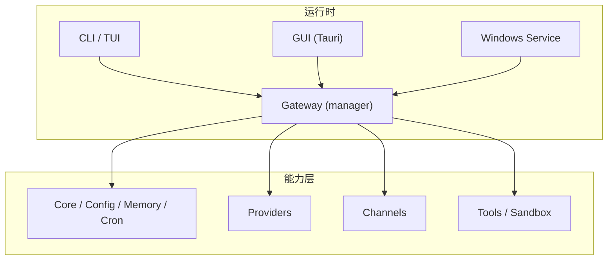
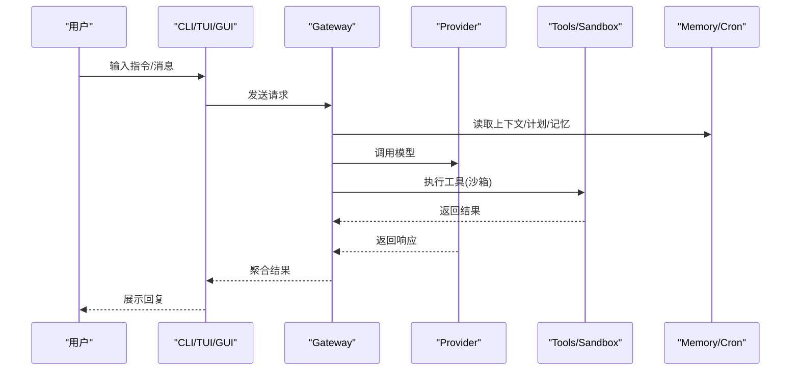
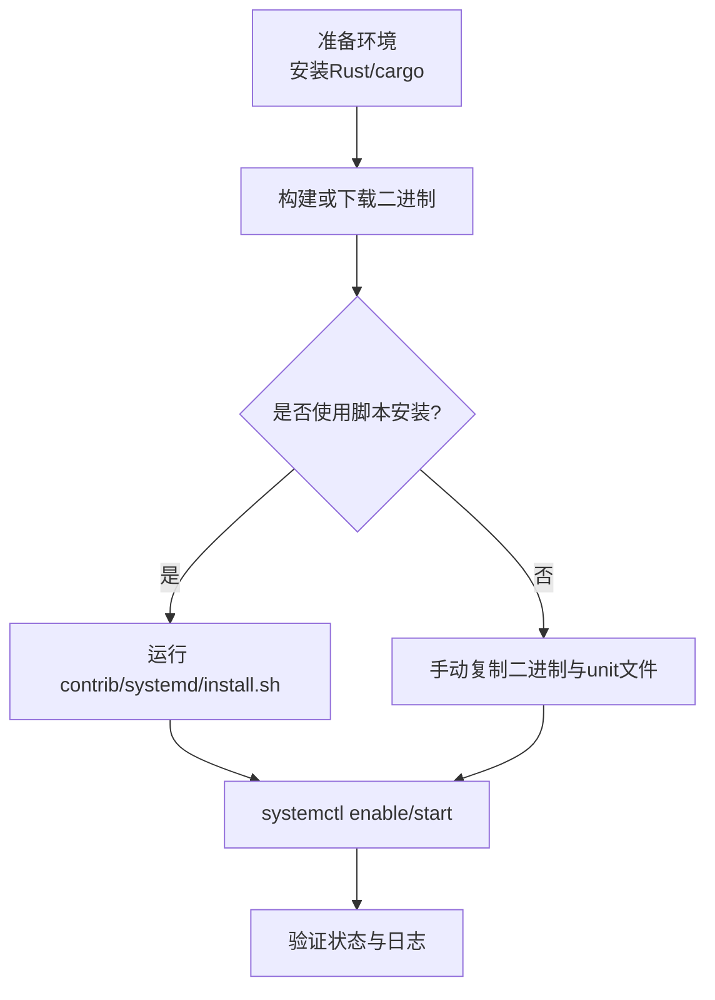
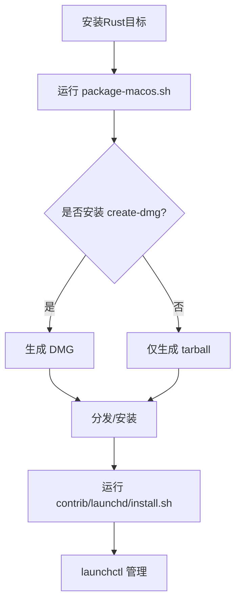
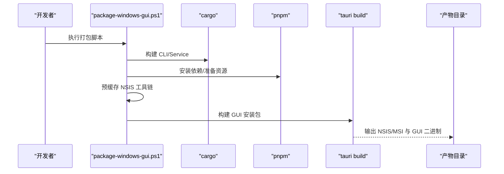
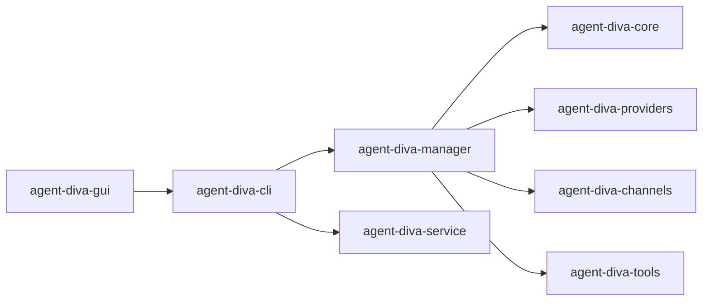

# 平台部署

<cite>
**本文引用的文件**
- [README.md](file://README.md)
- [Cargo.toml](file://Cargo.toml)
- [package-linux.sh](file://scripts/package-linux.sh)
- [package-macos.sh](file://scripts/package-macos.sh)
- [package-windows-gui.ps1](file://scripts/package-windows-gui.ps1)
- [agent-diva.service](file://contrib/systemd/agent-diva.service)
- [install.sh (systemd)](file://contrib/systemd/install.sh)
- [com.agent-diva.gateway.plist](file://contrib/launchd/com.agent-diva.gateway.plist)
- [install.sh (launchd)](file://contrib/launchd/install.sh)
- [loader.rs](file://agent-diva-core/src/config/loader.rs)
- [main.rs (Windows Service)](file://agent-diva-service/src/main.rs)
</cite>

## 目录
1. [简介](#简介)
2. [项目结构](#项目结构)
3. [核心组件](#核心组件)
4. [架构总览](#架构总览)
5. [详细组件分析](#详细组件分析)
6. [依赖关系分析](#依赖关系分析)
7. [性能考虑](#性能考虑)
8. [故障排查指南](#故障排查指南)
9. [结论](#结论)
10. [附录](#附录)

## 简介
本指南面向在 Windows、Linux、macOS 上部署 Agent Diva Gateway（服务）与桌面 GUI 的运维与开发者。内容涵盖系统要求、依赖安装、环境变量配置、各平台安装包构建脚本使用、服务注册与开机自启动、权限与安全建议，以及常见问题解决方案。

## 项目结构
Agent Diva 采用多 crate 工作区组织，CLI、Gateway、GUI、工具链等模块职责清晰：
- CLI/Gateway：agent-diva-cli、agent-diva-manager、agent-diva-service（Windows 服务封装）
- GUI：agent-diva-gui（Tauri + Vue 3）
- 核心能力：agent-diva-core、agent-diva-providers、agent-diva-channels、agent-diva-tools、agent-diva-sandbox 等
- 打包与发布：scripts 下的 Linux/macOS/Windows 打包脚本；contrib 下 systemd/launchd 服务模板与安装脚本

图表来源
- [README.md:87-108](file://README.md#L87-L108)
- [Cargo.toml:1-20](file://Cargo.toml#L1-L20)

章节来源
- [README.md:87-108](file://README.md#L87-L108)
- [Cargo.toml:1-20](file://Cargo.toml#L1-L20)

## 核心组件
- 配置加载与环境变量覆盖：支持从配置文件与环境变量合并，路径式键名覆盖，别名与路径替换，校验后生成最终配置。
- 服务化运行：Linux 通过 systemd 管理；macOS 通过 launchd 管理；Windows 通过 agent-diva-service 作为 Windows 服务托管 Gateway 进程。
- 打包产物：Linux tarball + systemd unit；macOS DMG/tarball；Windows NSIS/MSI 安装包（GUI）。

章节来源
- [loader.rs:57-74](file://agent-diva-core/src/config/loader.rs#L57-L74)
- [agent-diva.service:1-28](file://contrib/systemd/agent-diva.service#L1-L28)
- [com.agent-diva.gateway.plist:1-32](file://contrib/launchd/com.agent-diva.gateway.plist#L1-L32)
- [main.rs (Windows Service):83-148](file://agent-diva-service/src/main.rs#L83-L148)

## 架构总览
Gateway 是会话、路由与通道连接的唯一事实源。消息从通道进入总线，经 Agent Loop 调用 LLM 与工具，再回送至对应通道。CLI/TUI/GUI 均通过 Gateway 交互。

图表来源
- [README.md:43-58](file://README.md#L43-L58)

## 详细组件分析

### 环境要求与依赖
- Rust 1.80+（MSRV），可选 just 提升体验
- GUI 开发/构建需要 Node.js v18+ 与 pnpm/npm
- Linux 打包需 cargo 与标准 Unix 工具；macOS 打包需 create-dmg（可选）；Windows 打包需 PowerShell、cargo、pnpm、Python

章节来源
- [README.md:110-115](file://README.md#L110-L115)
- [README.md:287-319](file://README.md#L287-L319)
- [package-macos.sh:24-33](file://scripts/package-macos.sh#L24-L33)
- [package-windows-gui.ps1:144-147](file://scripts/package-windows-gui.ps1#L144-L147)

### 环境变量与配置
- 默认配置文件位置：~/.agent-diva/config.json
- 支持结构化与环境变量覆盖，例如 AGENT_DIVA__AGENTS__DEFAULTS__MODEL、OPENAI_API_KEY、ANTHROPIC_API_KEY 等
- 可通过 --config 指定实例路径，并支持 config validate/doctor 诊断

章节来源
- [README.md:150-199](file://README.md#L150-L199)
- [loader.rs:57-74](file://agent-diva-core/src/config/loader.rs#L57-L74)

### Linux 部署
- 系统要求：Linux 发行版，具备 systemd
- 安装方式：
  - 源码构建：cargo build --release -p agent-diva-cli
  - 使用脚本打包：scripts/package-linux.sh 生成 tarball，内含二进制、示例配置、systemd unit
  - 使用 contrib/systemd/install.sh 将二进制与服务单元安装到系统目录，自动创建专用用户/组、数据与日志目录，启用并启动服务
- 环境变量：可在 service 文件中设置 RUST_LOG、AGENT_DIVA_CONFIG 等
- 安全加固：NoNewPrivileges、ProtectSystem=strict、ProtectHome=true、PrivateTmp、ReadWritePaths 限制读写范围

图表来源
- [package-linux.sh:26-85](file://scripts/package-linux.sh#L26-L85)
- [install.sh (systemd):1-68](file://contrib/systemd/install.sh#L1-L68)
- [agent-diva.service:1-28](file://contrib/systemd/agent-diva.service#L1-L28)

章节来源
- [package-linux.sh:1-101](file://scripts/package-linux.sh#L1-L101)
- [install.sh (systemd):1-68](file://contrib/systemd/install.sh#L1-L68)
- [agent-diva.service:1-28](file://contrib/systemd/agent-diva.service#L1-L28)

### macOS 部署
- 系统要求：macOS，Rust 目标 x86_64-apple-darwin 与 aarch64-apple-darwin
- 构建通用二进制：scripts/package-macos.sh 编译双架构并生成 tarball；若安装 create-dmg，可生成 DMG 安装包
- 开机自启动：使用 contrib/launchd/install.sh 安装 LaunchAgent plist，自动替换二进制路径与日志目录，并加载服务
- GUI 构建：agent-diva-gui 下 pnpm tauri dev/build

图表来源
- [package-macos.sh:24-64](file://scripts/package-macos.sh#L24-L64)
- [package-macos.sh:65-122](file://scripts/package-macos.sh#L65-L122)
- [install.sh (launchd):1-67](file://contrib/launchd/install.sh#L1-L67)
- [com.agent-diva.gateway.plist:1-32](file://contrib/launchd/com.agent-diva.gateway.plist#L1-L32)

章节来源
- [package-macos.sh:1-130](file://scripts/package-macos.sh#L1-L130)
- [install.sh (launchd):1-67](file://contrib/launchd/install.sh#L1-L67)
- [com.agent-diva.gateway.plist:1-32](file://contrib/launchd/com.agent-diva.gateway.plist#L1-L32)

### Windows 部署
- 系统要求：PowerShell 5.1+、Rust、pnpm、Python（用于 GUI 打包）
- 服务化运行：agent-diva-service 作为 Windows 服务托管 Gateway 进程，负责生命周期管理与状态上报
- GUI 打包：scripts/package-windows-gui.ps1 完成 CLI/Service 构建、资源预取、NSIS 工具链预缓存、Tauri 构建，输出 NSIS/MSI 安装包
- 开发模式：scripts/make-diva.ps1 打开 GUI 开发窗口并内嵌启动 Gateway

图表来源
- [package-windows-gui.ps1:1-204](file://scripts/package-windows-gui.ps1#L1-L204)
- [main.rs (Windows Service):83-148](file://agent-diva-service/src/main.rs#L83-L148)

章节来源
- [package-windows-gui.ps1:1-204](file://scripts/package-windows-gui.ps1#L1-L204)
- [main.rs (Windows Service):83-148](file://agent-diva-service/src/main.rs#L83-L148)

### 服务注册与开机自启动
- Linux：使用 contrib/systemd/install.sh 安装并启用 systemd 服务；或通过 systemclt 手动 enable/start
- macOS：使用 contrib/launchd/install.sh 安装 LaunchAgent；通过 launchctl 管理
- Windows：使用 agent-diva-service 注册为 Windows 服务；或通过包管理器/安装程序集成

章节来源
- [install.sh (systemd):1-68](file://contrib/systemd/install.sh#L1-L68)
- [install.sh (launchd):1-67](file://contrib/launchd/install.sh#L1-L67)
- [main.rs (Windows Service):83-148](file://agent-diva-service/src/main.rs#L83-L148)

### 权限与安全配置建议
- Linux：
  - 使用独立用户/组运行服务（install.sh 已处理）
  - 启用 NoNewPrivileges、ProtectSystem=strict、ProtectHome=true、PrivateTmp
  - 仅开放必要的 ReadWritePaths（数据与日志目录）
  - 最小化端口暴露，必要时配合防火墙
- macOS：
  - 以普通用户身份运行 LaunchAgent
  - 限制日志目录写入权限
  - 谨慎授予应用访问敏感资源的权限
- Windows：
  - 使用专用账户运行服务，避免管理员权限
  - 限制网络出站策略，仅允许必要域名/IP
  - 定期更新依赖与证书，防范 TLS 问题（项目已使用 rustls 降低原生 TLS 差异风险）

章节来源
- [agent-diva.service:16-25](file://contrib/systemd/agent-diva.service#L16-L25)
- [Cargo.toml:59-63](file://Cargo.toml#L59-L63)

### 常见平台相关问题与解决
- Linux
  - 无法启动服务：检查二进制路径、unit 文件 ExecStart、日志目录权限；查看 journalctl 或 /var/log/agent-diva
  - 权限不足：确认服务用户拥有数据/日志目录写权限
- macOS
  - DMG 未签名导致无法打开：按提示在“安全性与隐私”中放行
  - 通用二进制不生效：确认同时存在 x86_64 与 ARM64 目标并正确 lipo
- Windows
  - GUI 打包失败：确保 PATH 包含 cargo/pnpm/python；检查 NSIS 工具链预缓存是否成功
  - 服务启动失败：检查 agent-diva-service 日志与 Windows 事件查看器；确认 CLI 路径与服务可执行文件匹配

章节来源
- [package-linux.sh:26-85](file://scripts/package-linux.sh#L26-L85)
- [install.sh (systemd):1-68](file://contrib/systemd/install.sh#L1-L68)
- [package-macos.sh:24-64](file://scripts/package-macos.sh#L24-L64)
- [package-windows-gui.ps1:74-116](file://scripts/package-windows-gui.ps1#L74-L116)

## 依赖关系分析
- 工作区成员由 Cargo.toml 声明，CLI、Service、GUI、Manager、Core 等相互依赖
- 关键外部依赖：tokio、reqwest（rustls-tls）、sqlx（sqlite）、tracing、config/dirs 等

图表来源
- [Cargo.toml:1-20](file://Cargo.toml#L1-L20)

章节来源
- [Cargo.toml:1-20](file://Cargo.toml#L1-L20)

## 性能考虑
- 使用 release profile（LTO、strip）减小体积并提升性能
- 合理设置日志级别（RUST_LOG）避免生产环境过度日志
- 控制并发与超时：根据 Provider 与网络情况调整 tokio 与 HTTP 客户端参数
- 数据库：SQLite 单文件存储适合单机场景，注意 WAL 与备份策略

章节来源
- [Cargo.toml:101-110](file://Cargo.toml#L101-L110)
- [agent-diva.service:23-25](file://contrib/systemd/agent-diva.service#L23-L25)

## 故障排查指南
- 配置问题：使用 agent-diva config validate/doctor 诊断；检查环境变量覆盖是否正确
- 日志定位：
  - Linux：journalctl -u agent-diva 或 /var/log/agent-diva
  - macOS：~/Library/Logs/agent-diva/gateway.log
  - Windows：Windows 事件查看器或服务日志
- 网络与TLS：确认代理/防火墙设置；项目默认使用 rustls 减少平台差异
- 服务状态：
  - Linux：systemctl status agent-diva
  - macOS：launchctl list | grep agent-diva
  - Windows：services.msc 或 sc query

章节来源
- [README.md:176-199](file://README.md#L176-L199)
- [agent-diva.service:1-28](file://contrib/systemd/agent-diva.service#L1-L28)
- [com.agent-diva.gateway.plist:1-32](file://contrib/launchd/com.agent-diva.gateway.plist#L1-L32)

## 结论
通过统一的工作区与跨平台打包脚本，Agent Diva 可在 Linux、macOS、Windows 上快速构建与部署。结合 systemd/launchd/Windows Service 实现服务化与开机自启动，并通过严格的安全策略保障运行环境。遵循本指南可高效完成安装、配置、发布与排障。

## 附录
- 快速开始（源码）：just build && just install；或直接 cargo build/install
- 初始化配置：agent-diva onboard；至少配置一个 Provider
- 启动 Gateway：agent-diva gateway run
- 启动 GUI：agent-diva-gui 下 pnpm tauri dev/build

章节来源
- [README.md:116-149](file://README.md#L116-L149)
- [README.md:287-319](file://README.md#L287-L319)