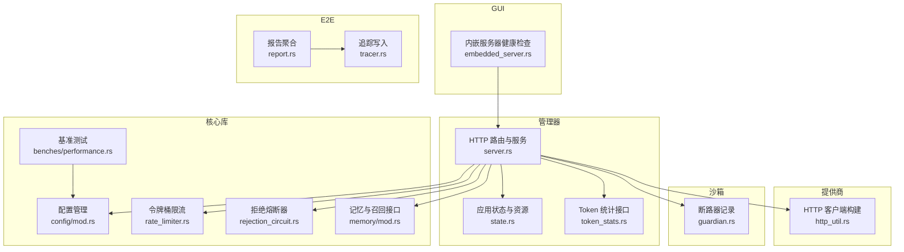
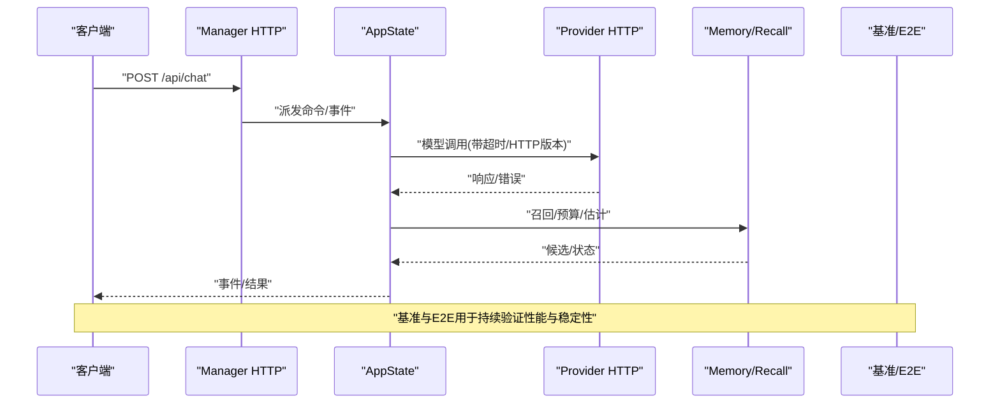
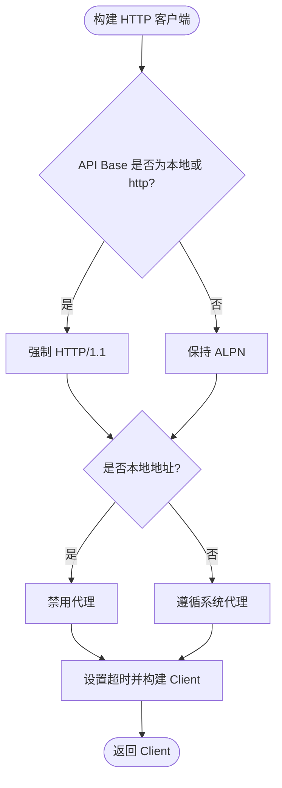
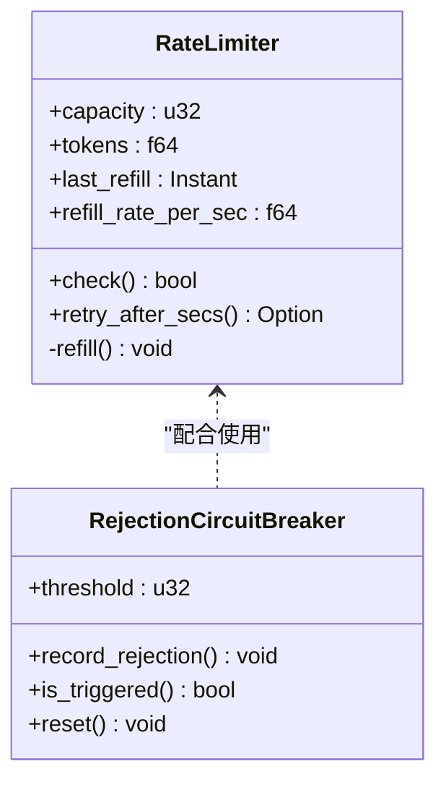
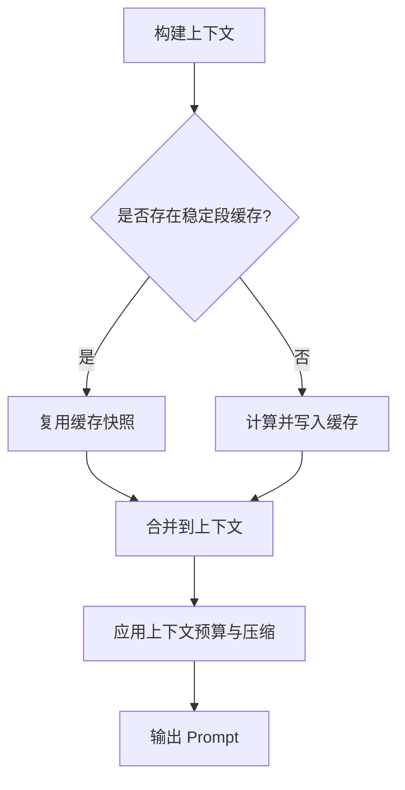
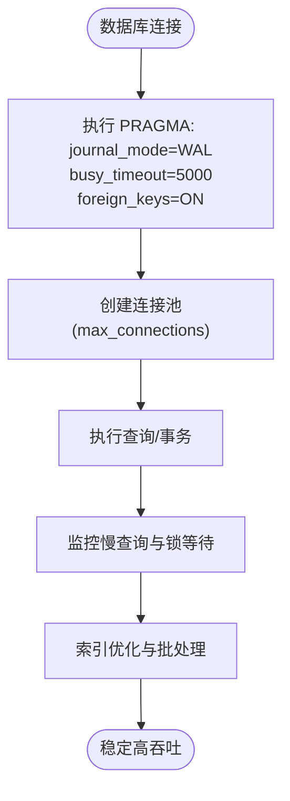
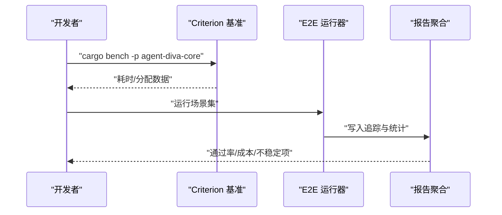
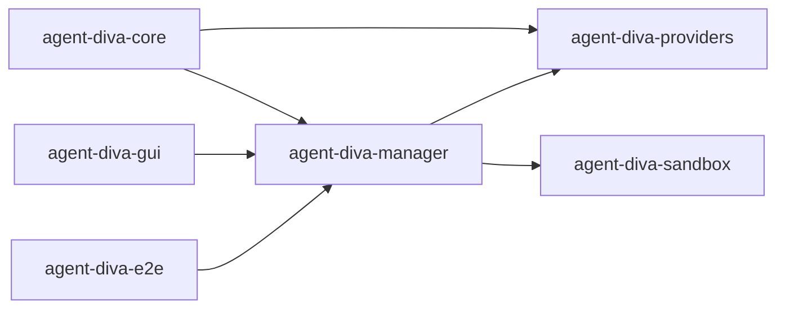

# 性能调优

<cite>
**本文引用的文件**
- [agent-diva-core/Cargo.toml](file://agent-diva-core/Cargo.toml)
- [agent-diva-manager/Cargo.toml](file://agent-diva-manager/Cargo.toml)
- [agent-diva-providers/Cargo.toml](file://agent-diva-providers/Cargo.toml)
- [agent-diva-manager/src/server.rs](file://agent-diva-manager/src/server.rs)
- [agent-diva-manager/src/state.rs](file://agent-diva-manager/src/state.rs)
- [agent-diva-manager/src/handlers/token_stats.rs](file://agent-diva-manager/src/handlers/token_stats.rs)
- [agent-diva-providers/src/http_util.rs](file://agent-diva-providers/src/http_util.rs)
- [agent-diva-core/src/rate_limiter.rs](file://agent-diva-core/src/rate_limiter.rs)
- [agent-diva-core/src/security/rejection_circuit.rs](file://agent-diva-core/src/security/rejection_circuit.rs)
- [agent-diva-sandbox/src/guardian.rs](file://agent-diva-sandbox/src/guardian.rs)
- [agent-diva-gui/src-tauri/src/embedded_server.rs](file://agent-diva-gui/src-tauri/src/embedded_server.rs)
- [agent-diva-core/benches/performance.rs](file://agent-diva-core/benches/performance.rs)
- [agent-diva-e2e/src/report.rs](file://agent-diva-e2e/src/report.rs)
- [agent-diva-e2e/src/tracer.rs](file://agent-diva-e2e/src/tracer.rs)
- [agent-diva-core/src/memory/mod.rs](file://agent-diva-core/src/memory/mod.rs)
- [agent-diva-core/src/config/mod.rs](file://agent-diva-core/src/config/mod.rs)
- [agent-diva-core/src/quality/mod.rs](file://agent-diva-core/src/quality/mod.rs)
- [docs/logs/2026-08-context-management-enhancement/v0.0.5-c1c-session-section-cache/summary.md](file://docs/logs/2026-08-context-management-enhancement/v0.0.5-c1c-session-section-cache/summary.md)
- [docs/dev/archive(old-docs-dont-read-me)/2026-08-docs-corpus-reset/legacy-batches/agent-diva-pro-dev/20260611-general-audit-pro/P1-8-sqlite-wal.md](file://docs/dev/archive(old-docs-dont-read-me)/2026-08-docs-corpus-reset/legacy-batches/agent-diva-pro-dev/20260611-general-audit-pro/P1-8-sqlite-wal.md)
</cite>

## 目录
1. [简介](#简介)
2. [项目结构](#项目结构)
3. [核心组件](#核心组件)
4. [架构总览](#架构总览)
5. [详细组件分析](#详细组件分析)
6. [依赖关系分析](#依赖关系分析)
7. [性能考虑](#性能考虑)
8. [故障排查指南](#故障排查指南)
9. [结论](#结论)
10. [附录](#附录)

## 简介
本指南面向 Agent Diva 多代理系统的性能调优，覆盖内存使用、CPU 利用率、磁盘 I/O、数据库与索引策略、网络请求与连接池、缓存与上下文压缩、负载测试与基准测试、水平扩展与负载均衡，以及常见瓶颈识别与解决方案。内容基于仓库中的实际实现与文档进行提炼，确保可操作且与代码一致。

## 项目结构
Agent Diva 采用多 crate 的 Rust 工程组织：
- agent-diva-core：核心类型、配置、安全、质量追踪、限流、熔断等基础能力
- agent-diva-manager：HTTP API 服务（Axum），聚合各子系统能力
- agent-diva-providers：LLM 提供商 HTTP 客户端与重试、协议适配
- agent-diva-sandbox：沙箱执行与断路器保护
- agent-diva-gui：桌面端 Tauri 应用，内嵌服务器与健康检查
- agent-diva-e2e：端到端测试与报告生成
- 其他模块：agent、tools、channels、files、laputa 等

图表来源
- [agent-diva-manager/src/server.rs:94-113](file://agent-diva-manager/src/server.rs#L94-L113)
- [agent-diva-manager/src/state.rs:64-95](file://agent-diva-manager/src/state.rs#L64-L95)
- [agent-diva-manager/src/handlers/token_stats.rs:188-340](file://agent-diva-manager/src/handlers/token_stats.rs#L188-L340)
- [agent-diva-providers/src/http_util.rs:25-39](file://agent-diva-providers/src/http_util.rs#L25-L39)
- [agent-diva-core/src/rate_limiter.rs:44-84](file://agent-diva-core/src/rate_limiter.rs#L44-L84)
- [agent-diva-core/src/security/rejection_circuit.rs:33-56](file://agent-diva-core/src/security/rejection_circuit.rs#L33-L56)
- [agent-diva-sandbox/src/guardian.rs:502-540](file://agent-diva-sandbox/src/guardian.rs#L502-L540)
- [agent-diva-gui/src-tauri/src/embedded_server.rs:248-283](file://agent-diva-gui/src-tauri/src/embedded_server.rs#L248-L283)
- [agent-diva-core/benches/performance.rs:1-50](file://agent-diva-core/benches/performance.rs#L1-L50)
- [agent-diva-e2e/src/report.rs:1-88](file://agent-diva-e2e/src/report.rs#L1-L88)
- [agent-diva-e2e/src/tracer.rs:146-183](file://agent-diva-e2e/src/tracer.rs#L146-L183)

章节来源
- [agent-diva-manager/src/server.rs:94-113](file://agent-diva-manager/src/server.rs#L94-L113)
- [agent-diva-manager/src/state.rs:64-95](file://agent-diva-manager/src/state.rs#L64-L95)

## 核心组件
- HTTP 服务层：Axum Router 组装，统一挂载 CORS、TraceLayer，提供健康、会话、记忆、技能、计划、审计等路由；支持上传大小限制与优雅关闭。
- 应用状态：集中持有消息总线、工作区上下文、记忆家、技能家、AutoDream、Persona、治理、计划服务等运行时资源。
- Token 统计：按时间段聚合 token 用量、成本估算、时间线分组，用于性能与成本观测。
- 提供商 HTTP：根据 API base 自动选择 HTTP/1.1 或 ALPN，本地地址禁用代理，设置连接与请求超时。
- 限流与熔断：令牌桶限流控制调用速率；拒绝熔断器在连续拒绝时快速失败，避免雪崩。
- 记忆与召回：提供记忆 CRUD、ACTMEM、召回预算与估计，支撑上下文构建与压缩。
- 基准与 E2E：Criterion 基准测试 PII 脱敏与注入检测；E2E 报告聚合场景通过率与成本估算。

章节来源
- [agent-diva-manager/src/server.rs:94-113](file://agent-diva-manager/src/server.rs#L94-L113)
- [agent-diva-manager/src/state.rs:64-95](file://agent-diva-manager/src/state.rs#L64-L95)
- [agent-diva-manager/src/handlers/token_stats.rs:188-340](file://agent-diva-manager/src/handlers/token_stats.rs#L188-L340)
- [agent-diva-providers/src/http_util.rs:25-39](file://agent-diva-providers/src/http_util.rs#L25-L39)
- [agent-diva-core/src/rate_limiter.rs:44-84](file://agent-diva-core/src/rate_limiter.rs#L44-L84)
- [agent-diva-core/src/security/rejection_circuit.rs:33-56](file://agent-diva-core/src/security/rejection_circuit.rs#L33-L56)
- [agent-diva-core/src/memory/mod.rs:1-47](file://agent-diva-core/src/memory/mod.rs#L1-L47)
- [agent-diva-core/benches/performance.rs:1-50](file://agent-diva-core/benches/performance.rs#L1-L50)
- [agent-diva-e2e/src/report.rs:1-88](file://agent-diva-e2e/src/report.rs#L1-L88)

## 架构总览
系统以 Manager 为入口，通过 Axum 暴露 REST API；内部通过消息总线协调 AgentLoop、记忆、技能、计划、审计等子系统；对外通过 Providers 访问 LLM；GUI 内嵌服务器负责健康探测与生命周期管理；E2E 套件产出追踪与报告。

图表来源
- [agent-diva-manager/src/server.rs:94-113](file://agent-diva-manager/src/server.rs#L94-L113)
- [agent-diva-manager/src/state.rs:64-95](file://agent-diva-manager/src/state.rs#L64-L95)
- [agent-diva-providers/src/http_util.rs:25-39](file://agent-diva-providers/src/http_util.rs#L25-L39)
- [agent-diva-core/src/memory/mod.rs:1-47](file://agent-diva-core/src/memory/mod.rs#L1-L47)
- [agent-diva-core/benches/performance.rs:1-50](file://agent-diva-core/benches/performance.rs#L1-L50)
- [agent-diva-e2e/src/report.rs:1-88](file://agent-diva-e2e/src/report.rs#L1-L88)

## 详细组件分析

### 网络请求优化与连接池配置
- HTTP 客户端构建：对 http:// 或本地 https:// 强制 HTTP/1.1，避免 ALPN 问题；对本地地址禁用代理；设置连接超时与请求超时，提升稳定性与可预测性。
- GUI 内嵌健康检查：短超时轮询后端健康接口，快速失败并优雅关闭，减少启动阻塞。
- 建议：
  - 在高并发场景下复用 reqwest::Client，避免频繁创建销毁连接。
  - 合理设置 connect_timeout 与 timeout，结合重试与熔断，降低尾部延迟。
  - 对远端 HTTPS 保持 ALPN 以获得更好的吞吐与兼容性。

图表来源
- [agent-diva-providers/src/http_util.rs:25-39](file://agent-diva-providers/src/http_util.rs#L25-L39)
- [agent-diva-providers/src/http_util.rs:41-56](file://agent-diva-providers/src/http_util.rs#L41-L56)
- [agent-diva-gui/src-tauri/src/embedded_server.rs:248-283](file://agent-diva-gui/src-tauri/src/embedded_server.rs#L248-L283)

章节来源
- [agent-diva-providers/src/http_util.rs:25-39](file://agent-diva-providers/src/http_util.rs#L25-L39)
- [agent-diva-gui/src-tauri/src/embedded_server.rs:248-283](file://agent-diva-gui/src-tauri/src/embedded_server.rs#L248-L283)

### 限流与熔断
- 令牌桶限流：按容量与填充速率平滑控制调用频率，避免突发流量导致下游过载。
- 拒绝熔断器：滑动窗口内连续拒绝达到阈值即触发，阻止进一步调用，保护系统稳定。
- 建议：
  - 将限流与熔断组合使用，先限流再熔断，形成多级防护。
  - 根据业务 QPS 与下游能力调整 capacity 与 refill_rate，以及 rejection_window_secs 与 threshold。

图表来源
- [agent-diva-core/src/rate_limiter.rs:44-84](file://agent-diva-core/src/rate_limiter.rs#L44-L84)
- [agent-diva-core/src/security/rejection_circuit.rs:33-56](file://agent-diva-core/src/security/rejection_circuit.rs#L33-L56)
- [agent-diva-sandbox/src/guardian.rs:502-540](file://agent-diva-sandbox/src/guardian.rs#L502-L540)

章节来源
- [agent-diva-core/src/rate_limiter.rs:44-84](file://agent-diva-core/src/rate_limiter.rs#L44-L84)
- [agent-diva-core/src/security/rejection_circuit.rs:33-56](file://agent-diva-core/src/security/rejection_circuit.rs#L33-L56)
- [agent-diva-sandbox/src/guardian.rs:502-540](file://agent-diva-sandbox/src/guardian.rs#L502-L540)

### 缓存策略与上下文压缩
- 会话段缓存：按 session_key 缓存稳定的 PromptSection、渲染结果与单调 prefix_version，无显式事件时复用快照，减少重复计算与 I/O。
- 记忆与召回：提供保守的召回预算估计与候选来源，结合上下文预算控制，避免上下文膨胀。
- 建议：
  - 对稳定片段启用缓存，变更时仅刷新受影响部分。
  - 使用上下文预算与压缩策略，控制 prompt 长度与 token 消耗。

图表来源
- [docs/logs/2026-08-context-management-enhancement/v0.0.5-c1c-session-section-cache/summary.md:1-18](file://docs/logs/2026-08-context-management-enhancement/v0.0.5-c1c-session-section-cache/summary.md#L1-L18)
- [agent-diva-core/src/memory/mod.rs:1-47](file://agent-diva-core/src/memory/mod.rs#L1-L47)

章节来源
- [docs/logs/2026-08-context-management-enhancement/v0.0.5-c1c-session-section-cache/summary.md:1-18](file://docs/logs/2026-08-context-management-enhancement/v0.0.5-c1c-session-section-cache/summary.md#L1-L18)
- [agent-diva-core/src/memory/mod.rs:1-47](file://agent-diva-core/src/memory/mod.rs#L1-L47)

### 数据库性能优化与索引策略
- SQLite WAL 模式：建议启用 WAL 以提升并发读写性能与恢复能力；设置 busy_timeout 降低锁竞争；必要时开启外键约束。
- 连接池：收敛至 store 内部构造，确保每个新连接执行 PRAGMA 初始化；合理设置 max_connections。
- 建议：
  - 对高频查询字段建立索引，避免全表扫描。
  - 使用事务批量写入，减少 fsync 次数。
  - 监控慢查询日志，定期分析执行计划。

图表来源
- [docs/dev/archive(old-docs-dont-read-me)/2026-08-docs-corpus-reset/legacy-batches/agent-diva-pro-dev/20260611-general-audit-pro/P1-8-sqlite-wal.md:31-62](file://docs/dev/archive(old-docs-dont-read-me)/2026-08-docs-corpus-reset/legacy-batches/agent-diva-pro-dev/20260611-general-audit-pro/P1-8-sqlite-wal.md#L31-L62)

章节来源
- [docs/dev/archive(old-docs-dont-read-me)/2026-08-docs-corpus-reset/legacy-batches/agent-diva-pro-dev/20260611-general-audit-pro/P1-8-sqlite-wal.md:31-62](file://docs/dev/archive(old-docs-dont-read-me)/2026-08-docs-corpus-reset/legacy-batches/agent-diva-pro-dev/20260611-general-audit-pro/P1-8-sqlite-wal.md#L31-L62)

### 负载测试方法与性能基准测试
- 基准测试：使用 Criterion 对关键路径（如 PII 脱敏、注入检测）进行微基准，评估输入规模变化对性能的影响。
- E2E 报告：聚合场景追踪，统计通过率、成本估算与不稳定场景，辅助回归与性能回归定位。
- 建议：
  - 将基准纳入 CI，防止性能退化。
  - 使用不同负载模型（均匀、突发、长尾）进行压测，观察限流与熔断行为。

图表来源
- [agent-diva-core/benches/performance.rs:1-50](file://agent-diva-core/benches/performance.rs#L1-L50)
- [agent-diva-e2e/src/report.rs:1-88](file://agent-diva-e2e/src/report.rs#L1-L88)
- [agent-diva-e2e/src/tracer.rs:146-183](file://agent-diva-e2e/src/tracer.rs#L146-L183)

章节来源
- [agent-diva-core/benches/performance.rs:1-50](file://agent-diva-core/benches/performance.rs#L1-L50)
- [agent-diva-e2e/src/report.rs:1-88](file://agent-diva-e2e/src/report.rs#L1-L88)
- [agent-diva-e2e/src/tracer.rs:146-183](file://agent-diva-e2e/src/tracer.rs#L146-L183)

### 水平扩展与负载均衡配置
- 当前实现以单进程 Manager 为主，通过消息总线与子服务协作；可通过多实例部署与外部负载均衡器横向扩展。
- 建议：
  - 使用无状态 API 设计，会话与状态持久化到外部存储。
  - 通过反向代理（如 Nginx/Traefik）进行请求分发与健康检查。
  - 对 Provider 调用增加重试与熔断，避免级联失败。

[本节为概念性说明，不直接分析具体文件]

## 依赖关系分析
- Cargo 依赖：core 引入 tokio、tracing、sqlx、chrono 等；manager 引入 axum、tower-http、reqwest；providers 引入 reqwest、tokio-tungstenite。
- 运行时依赖：Manager 依赖 core 的配置、质量、安全、记忆；Providers 依赖 core 的类型；GUI 依赖 manager 的健康接口；E2E 依赖 tracer 与 report。

图表来源
- [agent-diva-core/Cargo.toml:12-56](file://agent-diva-core/Cargo.toml#L12-L56)
- [agent-diva-manager/Cargo.toml:11-44](file://agent-diva-manager/Cargo.toml#L11-L44)
- [agent-diva-providers/Cargo.toml:12-44](file://agent-diva-providers/Cargo.toml#L12-L44)

章节来源
- [agent-diva-core/Cargo.toml:12-56](file://agent-diva-core/Cargo.toml#L12-L56)
- [agent-diva-manager/Cargo.toml:11-44](file://agent-diva-manager/Cargo.toml#L11-L44)
- [agent-diva-providers/Cargo.toml:12-44](file://agent-diva-providers/Cargo.toml#L12-L44)

## 性能考虑
- 内存使用：
  - 控制上下文大小，使用缓存与压缩减少重复构建。
  - 避免大对象长时间驻留，及时释放临时缓冲区。
- CPU 利用率：
  - 热点路径使用基准测试定位，优化正则与字符串处理。
  - 合理使用异步任务，避免阻塞线程。
- 磁盘 I/O：
  - 启用 WAL 与批量写入，减少 fsync。
  - 对日志与审计文件进行轮转与压缩。
- 网络请求：
  - 复用 Client，设置合理超时，启用重试与熔断。
  - 对本地地址禁用代理，避免额外开销。
- 数据库：
  - 索引优化、事务批处理、慢查询监控。
- 缓存：
  - 会话段缓存、记忆召回缓存，注意失效策略。
- 限流与熔断：
  - 令牌桶与拒绝熔断器组合，保护下游与自身。

[本节提供通用指导，不直接分析具体文件]

## 故障排查指南
- 健康检查失败：
  - 检查内嵌服务器的健康轮询逻辑与超时配置，确认后端端口与路由可用。
- 限流触发：
  - 查看令牌桶参数与调用频率，适当调整 capacity 与 refill_rate。
- 熔断触发：
  - 检查拒绝计数与窗口，确认下游稳定性，必要时重置熔断器。
- 数据库锁等待：
  - 启用 WAL，调整 busy_timeout，分析慢查询与锁竞争。
- 基准回归：
  - 对比历史基准结果，定位最近变更，复现实验环境。

章节来源
- [agent-diva-gui/src-tauri/src/embedded_server.rs:248-283](file://agent-diva-gui/src-tauri/src/embedded_server.rs#L248-L283)
- [agent-diva-core/src/rate_limiter.rs:44-84](file://agent-diva-core/src/rate_limiter.rs#L44-L84)
- [agent-diva-core/src/security/rejection_circuit.rs:33-56](file://agent-diva-core/src/security/rejection_circuit.rs#L33-L56)
- [docs/dev/archive(old-docs-dont-read-me)/2026-08-docs-corpus-reset/legacy-batches/agent-diva-pro-dev/20260611-general-audit-pro/P1-8-sqlite-wal.md:31-62](file://docs/dev/archive(old-docs-dont-read-me)/2026-08-docs-corpus-reset/legacy-batches/agent-diva-pro-dev/20260611-general-audit-pro/P1-8-sqlite-wal.md#L31-L62)
- [agent-diva-core/benches/performance.rs:1-50](file://agent-diva-core/benches/performance.rs#L1-L50)

## 结论
Agent Diva 在 HTTP 服务、提供商调用、限流熔断、记忆与缓存等方面提供了良好的性能基础。通过启用 WAL、合理配置连接池与超时、使用会话段缓存与上下文预算、结合基准与 E2E 报告，可有效提升吞吐、降低延迟与成本。建议在多实例部署中结合外部负载均衡与无状态设计，持续监控与优化。

[本节为总结性内容，不直接分析具体文件]

## 附录
- 配置管理：通过 config 模块加载与校验配置，支持差异计算与字段变更追踪。
- 质量追踪：UsageRecord/UsageSource 用于用量采集，结合 Token 统计接口进行成本与性能分析。

章节来源
- [agent-diva-core/src/config/mod.rs:1-12](file://agent-diva-core/src/config/mod.rs#L1-L12)
- [agent-diva-core/src/quality/mod.rs:1-6](file://agent-diva-core/src/quality/mod.rs#L1-L6)
- [agent-diva-manager/src/handlers/token_stats.rs:188-340](file://agent-diva-manager/src/handlers/token_stats.rs#L188-L340)