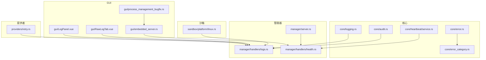
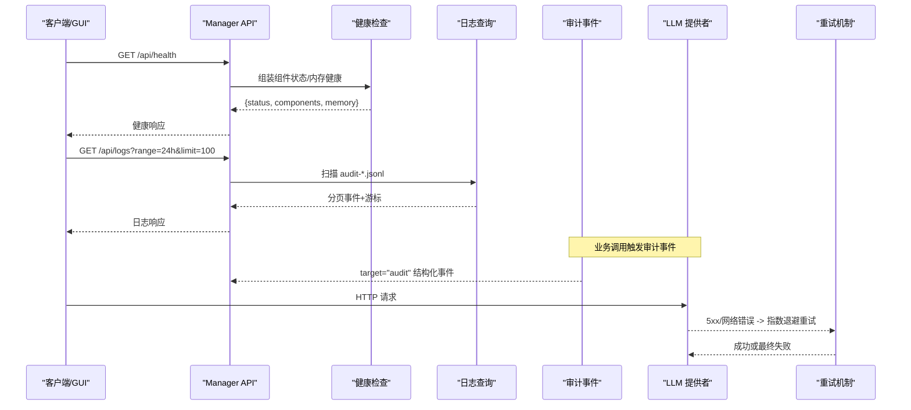
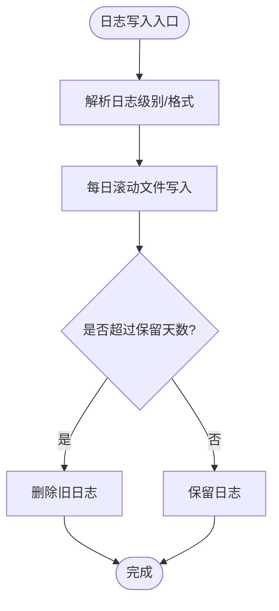
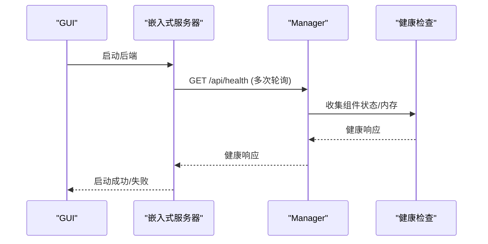
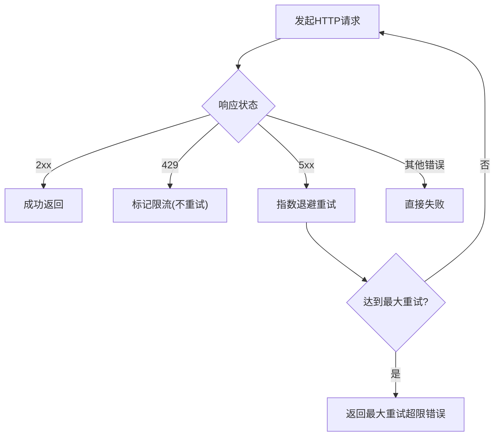
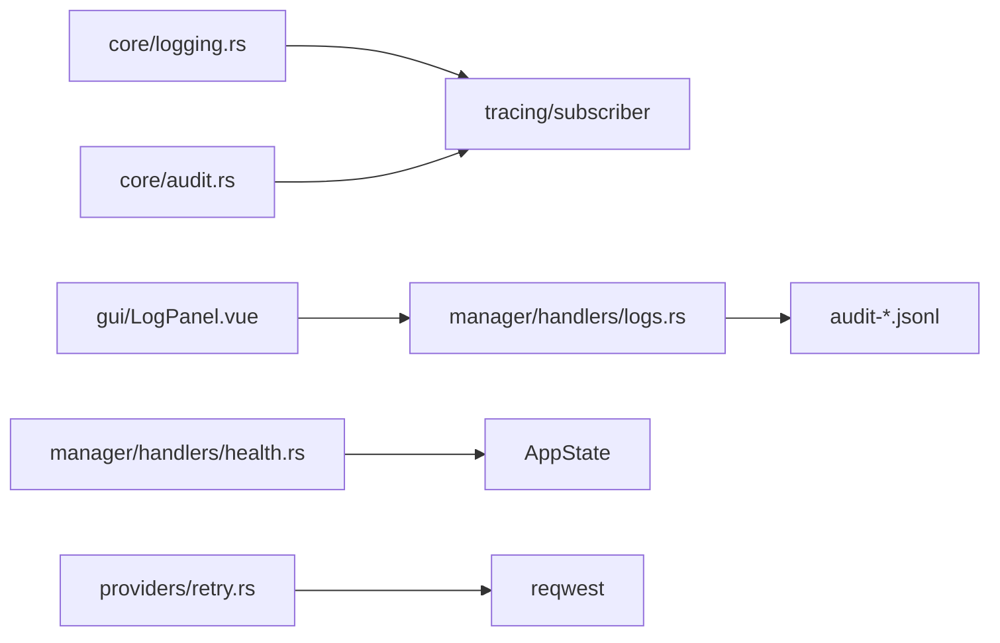

# 故障排查

<cite>
**本文引用的文件**
- [agent-diva-core/src/logging.rs](file://agent-diva-core/src/logging.rs)
- [agent-diva-manager/src/handlers/logs.rs](file://agent-diva-manager/src/handlers/logs.rs)
- [agent-diva-core/src/audit.rs](file://agent-diva-core/src/audit.rs)
- [agent-diva-core/src/error.rs](file://agent-diva-core/src/error.rs)
- [agent-diva-core/src/error_category.rs](file://agent-diva-core/src/error_category.rs)
- [agent-diva-providers/src/retry.rs](file://agent-diva-providers/src/retry.rs)
- [agent-diva-autodream/src/diagnostics.rs](file://agent-diva-autodream/src/diagnostics.rs)
- [agent-diva-gui/src/components/console/LogPanel.vue](file://agent-diva-gui/src/components/console/LogPanel.vue)
- [agent-diva-gui/src/components/settings/audit/RawLogTab.vue](file://agent-diva-gui/src/components/settings/audit/RawLogTab.vue)
- [agent-diva-gui/src-tauri/src/embedded_server.rs](file://agent-diva-gui/src-tauri/src/embedded_server.rs)
- [agent-diva-manager/src/handlers/health.rs](file://agent-diva-manager/src/handlers/health.rs)
- [agent-diva-core/src/heartbeat/service.rs](file://agent-diva-core/src/heartbeat/service.rs)
- [agent-diva-gui/src-tauri/tests/gateway_process_management_bugfix.rs](file://agent-diva-gui/src-tauri/tests/gateway_process_management_bugfix.rs)
- [agent-diva-sandbox/src/platform/linux.rs](file://agent-diva-sandbox/src/platform/linux.rs)
- [agent-diva-manager/src/server.rs](file://agent-diva-manager/src/server.rs)
</cite>

## 目录
1. [简介](#简介)
2. [项目结构](#项目结构)
3. [核心组件](#核心组件)
4. [架构总览](#架构总览)
5. [详细组件分析](#详细组件分析)
6. [依赖关系分析](#依赖关系分析)
7. [性能注意事项](#性能注意事项)
8. [故障排查指南](#故障排查指南)
9. [结论](#结论)
10. [附录](#附录)

## 简介
本手册面向运维与研发人员，提供 Agent-Diva 系统的故障诊断方法、日志分析方法、调试工具与命令使用指南，覆盖错误日志、访问日志、审计日志的解读；包含性能问题定位、资源泄漏检测、网络连接与超时处理、系统级故障（进程管理、文件权限、端口冲突）等。同时给出故障报告模板与应急响应流程，帮助快速恢复服务并沉淀根因。

## 项目结构
Agent-Diva 由多个 Rust crate 组成，关键与故障排查相关的模块分布如下：
- 日志与审计：core/logging、core/audit、manager/handlers/logs
- 健康检查与心跳：manager/handlers/health、core/heartbeat/service
- 网络重试与超时：providers/retry
- GUI 日志面板与嵌入式服务器健康探测：gui LogPanel、RawLogTab、embedded_server
- 系统安全与权限：sandbox/platform/linux
- 进程管理与端口占用：gui tests/gateway_process_management_bugfix

图表来源
- [agent-diva-core/src/logging.rs:1-114](file://agent-diva-core/src/logging.rs#L1-L114)
- [agent-diva-manager/src/handlers/logs.rs:1-297](file://agent-diva-manager/src/handlers/logs.rs#L1-L297)
- [agent-diva-core/src/audit.rs:1-253](file://agent-diva-core/src/audit.rs#L1-L253)
- [agent-diva-manager/src/handlers/health.rs:1-111](file://agent-diva-manager/src/handlers/health.rs#L1-L111)
- [agent-diva-providers/src/retry.rs:1-181](file://agent-diva-providers/src/retry.rs#L1-L181)
- [agent-diva-gui/src/components/console/LogPanel.vue:57-85](file://agent-diva-gui/src/components/console/LogPanel.vue#L57-L85)
- [agent-diva-gui/src/components/settings/audit/RawLogTab.vue:76-101](file://agent-diva-gui/src/components/settings/audit/RawLogTab.vue#L76-L101)
- [agent-diva-gui/src-tauri/src/embedded_server.rs:248-283](file://agent-diva-gui/src-tauri/src/embedded_server.rs#L248-L283)
- [agent-diva-gui/src-tauri/tests/gateway_process_management_bugfix.rs:13-36](file://agent-diva-gui/src-tauri/tests/gateway_process_management_bugfix.rs#L13-L36)
- [agent-diva-sandbox/src/platform/linux.rs:356-388](file://agent-diva-sandbox/src/platform/linux.rs#L356-L388)
- [agent-diva-manager/src/server.rs:170-369](file://agent-diva-manager/src/server.rs#L170-L369)

章节来源
- [agent-diva-core/src/logging.rs:1-114](file://agent-diva-core/src/logging.rs#L1-L114)
- [agent-diva-manager/src/handlers/logs.rs:1-297](file://agent-diva-manager/src/handlers/logs.rs#L1-L297)
- [agent-diva-core/src/audit.rs:1-253](file://agent-diva-core/src/audit.rs#L1-L253)
- [agent-diva-manager/src/handlers/health.rs:1-111](file://agent-diva-manager/src/handlers/health.rs#L1-L111)
- [agent-diva-providers/src/retry.rs:1-181](file://agent-diva-providers/src/retry.rs#L1-L181)
- [agent-diva-gui/src/components/console/LogPanel.vue:57-85](file://agent-diva-gui/src/components/console/LogPanel.vue#L57-L85)
- [agent-diva-gui/src/components/settings/audit/RawLogTab.vue:76-101](file://agent-diva-gui/src/components/settings/audit/RawLogTab.vue#L76-L101)
- [agent-diva-gui/src-tauri/src/embedded_server.rs:248-283](file://agent-diva-gui/src-tauri/src/embedded_server.rs#L248-L283)
- [agent-diva-gui/src-tauri/tests/gateway_process_management_bugfix.rs:13-36](file://agent-diva-gui/src-tauri/tests/gateway_process_management_bugfix.rs#L13-L36)
- [agent-diva-sandbox/src/platform/linux.rs:356-388](file://agent-diva-sandbox/src/platform/linux.rs#L356-L388)
- [agent-diva-manager/src/server.rs:170-369](file://agent-diva-manager/src/server.rs#L170-L369)

## 核心组件
- 日志子系统：支持按模块设置级别、JSON/文本格式、每日滚动、自动清理旧日志、非阻塞写入。
- 审计事件：统一通过 target="audit" 输出结构化 JSON 事件，便于 GUI/CLI 过滤与回放。
- 健康检查：/api/health 返回版本、运行时长、组件就绪状态与内存健康信息。
- 心跳服务：周期性读取 HEARTBEAT.md 决定执行任务，支持暂停/调整频率。
- 网络重试：对 5xx 和临时网络错误进行指数退避重试，识别 429 限流。
- GUI 日志面板：解析行级日志、脱敏敏感信息、按级别过滤。
- 嵌入式服务器健康探测：启动后轮询 /api/health，带超时与最大重试次数。
- 系统权限与隔离：Linux 下通过 tmpfs 或只读绑定屏蔽敏感路径。
- 进程与端口：测试中体现端口占用检测与进程存活判断逻辑。

章节来源
- [agent-diva-core/src/logging.rs:10-114](file://agent-diva-core/src/logging.rs#L10-L114)
- [agent-diva-core/src/audit.rs:1-253](file://agent-diva-core/src/audit.rs#L1-L253)
- [agent-diva-manager/src/handlers/health.rs:10-72](file://agent-diva-manager/src/handlers/health.rs#L10-L72)
- [agent-diva-core/src/heartbeat/service.rs:36-192](file://agent-diva-core/src/heartbeat/service.rs#L36-L192)
- [agent-diva-providers/src/retry.rs:17-181](file://agent-diva-providers/src/retry.rs#L17-L181)
- [agent-diva-gui/src/components/console/LogPanel.vue:57-85](file://agent-diva-gui/src/components/console/LogPanel.vue#L57-L85)
- [agent-diva-gui/src-tauri/src/embedded_server.rs:248-283](file://agent-diva-gui/src-tauri/src/embedded_server.rs#L248-L283)
- [agent-diva-sandbox/src/platform/linux.rs:356-388](file://agent-diva-sandbox/src/platform/linux.rs#L356-L388)
- [agent-diva-gui/src-tauri/tests/gateway_process_management_bugfix.rs:13-36](file://agent-diva-gui/src-tauri/tests/gateway_process_management_bugfix.rs#L13-L36)

## 架构总览
下图展示从请求到健康检查、日志查询、审计事件与重试的整体链路。

图表来源
- [agent-diva-manager/src/handlers/health.rs:32-72](file://agent-diva-manager/src/handlers/health.rs#L32-L72)
- [agent-diva-manager/src/handlers/logs.rs:244-297](file://agent-diva-manager/src/handlers/logs.rs#L244-L297)
- [agent-diva-core/src/audit.rs:224-253](file://agent-diva-core/src/audit.rs#L224-L253)
- [agent-diva-providers/src/retry.rs:86-181](file://agent-diva-providers/src/retry.rs#L86-L181)

## 详细组件分析

### 日志子系统与审计日志
- 日志初始化：支持环境变量覆盖级别与格式，按日滚动，自动清理过期日志，非阻塞写入。
- 审计事件：统一以 target="audit" 输出结构化 JSON，GUI/CLI 可过滤目标获取事件流。
- 日志查询接口：/api/logs 支持时间范围、事件类型过滤、分页游标，统计畸形行与未知事件。

图表来源
- [agent-diva-core/src/logging.rs:20-114](file://agent-diva-core/src/logging.rs#L20-L114)
- [agent-diva-core/src/logging.rs:116-163](file://agent-diva-core/src/logging.rs#L116-L163)

章节来源
- [agent-diva-core/src/logging.rs:10-163](file://agent-diva-core/src/logging.rs#L10-L163)
- [agent-diva-core/src/audit.rs:1-253](file://agent-diva-core/src/audit.rs#L1-L253)
- [agent-diva-manager/src/handlers/logs.rs:19-297](file://agent-diva-manager/src/handlers/logs.rs#L19-L297)

### 健康检查与心跳服务
- 健康端点：返回版本、运行时长、组件就绪状态与内存健康，关键组件不可用则返回降级状态。
- 心跳服务：周期性读取 HEARTBEAT.md，基于回调决定是否执行任务；支持暂停与间隔调整。

图表来源
- [agent-diva-gui/src-tauri/src/embedded_server.rs:248-283](file://agent-diva-gui/src-tauri/src/embedded_server.rs#L248-L283)
- [agent-diva-manager/src/handlers/health.rs:32-72](file://agent-diva-manager/src/handlers/health.rs#L32-L72)

章节来源
- [agent-diva-manager/src/handlers/health.rs:10-111](file://agent-diva-manager/src/handlers/health.rs#L10-L111)
- [agent-diva-core/src/heartbeat/service.rs:36-192](file://agent-diva-core/src/heartbeat/service.rs#L36-L192)

### 网络重试与超时处理
- 重试策略：对 5xx 与网络错误进行指数退避重试，识别 429 限流并立即返回；支持监听器上报每次重试详情。
- 分类与降级：结合错误分类将超时归为可重试类别，便于上层统一处理。

图表来源
- [agent-diva-providers/src/retry.rs:49-181](file://agent-diva-providers/src/retry.rs#L49-L181)
- [agent-diva-core/src/error_category.rs:34-50](file://agent-diva-core/src/error_category.rs#L34-L50)

章节来源
- [agent-diva-providers/src/retry.rs:17-181](file://agent-diva-providers/src/retry.rs#L17-L181)
- [agent-diva-core/src/error_category.rs:7-50](file://agent-diva-core/src/error_category.rs#L7-L50)

### GUI 日志面板与原始日志解析
- 日志面板：支持 ANSI 转义去除、HTML 转义防 XSS、敏感信息脱敏、级别检测与过滤。
- 原始日志标签页：按正则解析行级字段（时间戳、级别、线程、模块、源位置、消息链），便于定位问题。

章节来源
- [agent-diva-gui/src/components/console/LogPanel.vue:57-85](file://agent-diva-gui/src/components/console/LogPanel.vue#L57-L85)
- [agent-diva-gui/src/components/settings/audit/RawLogTab.vue:76-101](file://agent-diva-gui/src/components/settings/audit/RawLogTab.vue#L76-L101)

### 系统级故障：进程管理、文件权限、端口冲突
- 进程管理：测试中包含端口占用检测与进程存活判断逻辑，用于保障 Gateway 进程生命周期管理。
- 文件权限：Linux 平台通过 tmpfs 或只读绑定屏蔽敏感目录/文件，防止越权写入。
- 端口冲突：通过 netstat/lsof 检测端口占用，避免重复监听导致启动失败。

章节来源
- [agent-diva-gui/src-tauri/tests/gateway_process_management_bugfix.rs:13-36](file://agent-diva-gui/src-tauri/tests/gateway_process_management_bugfix.rs#L13-L36)
- [agent-diva-sandbox/src/platform/linux.rs:356-388](file://agent-diva-sandbox/src/platform/linux.rs#L356-L388)

## 依赖关系分析
- 日志子系统依赖 tracing/tracing-subscriber，输出至文件与可选终端，受配置与环境变量控制。
- 审计事件通过 tracing 管道统一输出，GUI/CLI 通过 target 过滤消费。
- 健康检查依赖 AppState 中的组件状态与内存健康探针。
- 日志查询依赖 audit-*.jsonl 文件结构与游标分页。
- 重试机制依赖 reqwest 响应状态与头部信息，结合错误分类进行统一处理。

图表来源
- [agent-diva-core/src/logging.rs:1-114](file://agent-diva-core/src/logging.rs#L1-L114)
- [agent-diva-core/src/audit.rs:1-253](file://agent-diva-core/src/audit.rs#L1-L253)
- [agent-diva-manager/src/handlers/logs.rs:1-297](file://agent-diva-manager/src/handlers/logs.rs#L1-L297)
- [agent-diva-manager/src/handlers/health.rs:1-111](file://agent-diva-manager/src/handlers/health.rs#L1-L111)
- [agent-diva-providers/src/retry.rs:1-181](file://agent-diva-providers/src/retry.rs#L1-L181)
- [agent-diva-gui/src/components/console/LogPanel.vue:57-85](file://agent-diva-gui/src/components/console/LogPanel.vue#L57-L85)

章节来源
- [agent-diva-core/src/logging.rs:1-114](file://agent-diva-core/src/logging.rs#L1-L114)
- [agent-diva-core/src/audit.rs:1-253](file://agent-diva-core/src/audit.rs#L1-L253)
- [agent-diva-manager/src/handlers/logs.rs:1-297](file://agent-diva-manager/src/handlers/logs.rs#L1-L297)
- [agent-diva-manager/src/handlers/health.rs:1-111](file://agent-diva-manager/src/handlers/health.rs#L1-L111)
- [agent-diva-providers/src/retry.rs:1-181](file://agent-diva-providers/src/retry.rs#L1-L181)
- [agent-diva-gui/src/components/console/LogPanel.vue:57-85](file://agent-diva-gui/src/components/console/LogPanel.vue#L57-L85)

## 性能注意事项
- 日志写入采用非阻塞模式，降低主流程开销；合理设置保留天数避免磁盘膨胀。
- 日志查询接口限制 limit 上限，避免大结果集拖慢响应；游标分页提升大数据量下的稳定性。
- 重试机制使用指数退避与抖动，避免雪崩；对 429 限流立即返回，减少无效重试。
- 健康检查轻量，仅聚合必要组件状态与内存健康，避免高负载时放大压力。

[本节为通用指导，不直接分析具体文件]

## 故障排查指南

### 常见问题诊断方法与解决步骤
- 服务不可用
  - 检查 /api/health 返回 status 与 components，关注 critical 组件是否 ready。
  - 若 memory 状态为 degraded，检查内存健康探针与依赖可用性。
  - 参考：[健康检查处理器:32-72](file://agent-diva-manager/src/handlers/health.rs#L32-L72)

- 日志缺失或无法查询
  - 确认日志目录存在且可写，日志格式与级别配置正确。
  - 使用 /api/logs 指定 range 与 event_type，检查 next_cursor 进行翻页。
  - 参考：[日志查询接口:244-297](file://agent-diva-manager/src/handlers/logs.rs#L244-L297)

- 审计事件异常
  - 在 GUI 中查看 RawLogTab 解析结果，核对时间戳、级别、模块与消息链。
  - 关注 malformed_lines 与 unknown_events 统计，定位数据漂移或格式问题。
  - 参考：[审计事件定义:33-222](file://agent-diva-core/src/audit.rs#L33-L222)、[日志查询统计:55-97](file://agent-diva-manager/src/handlers/logs.rs#L55-L97)

- 网络请求频繁失败
  - 观察重试日志，确认是否命中 5xx 或网络错误；检查 429 限流与 retry-after。
  - 调整重试策略或上游服务容量，避免持续重试造成拥塞。
  - 参考：[重试机制:86-181](file://agent-diva-providers/src/retry.rs#L86-L181)

- 心跳未执行任务
  - 检查 HEARTBEAT.md 是否存在且非空，回调是否注册。
  - 查看心跳服务状态与运行标志，必要时手动触发一次 tick。
  - 参考：[心跳服务:125-192](file://agent-diva-core/src/heartbeat/service.rs#L125-L192)

- 端口冲突或进程异常
  - 使用 netstat/lsof 检测端口占用，终止残留进程后重启。
  - 参考：[端口占用检测:13-36](file://agent-diva-gui/src-tauri/tests/gateway_process_management_bugfix.rs#L13-L36)

- 文件权限问题
  - Linux 下确认敏感路径被 tmpfs 或只读绑定屏蔽，避免越权写入。
  - 参考：[Linux 权限屏蔽:356-388](file://agent-diva-sandbox/src/platform/linux.rs#L356-L388)

章节来源
- [agent-diva-manager/src/handlers/health.rs:32-72](file://agent-diva-manager/src/handlers/health.rs#L32-L72)
- [agent-diva-manager/src/handlers/logs.rs:244-297](file://agent-diva-manager/src/handlers/logs.rs#L244-L297)
- [agent-diva-core/src/audit.rs:33-222](file://agent-diva-core/src/audit.rs#L33-L222)
- [agent-diva-manager/src/handlers/logs.rs:55-97](file://agent-diva-manager/src/handlers/logs.rs#L55-L97)
- [agent-diva-providers/src/retry.rs:86-181](file://agent-diva-providers/src/retry.rs#L86-L181)
- [agent-diva-core/src/heartbeat/service.rs:125-192](file://agent-diva-core/src/heartbeat/service.rs#L125-L192)
- [agent-diva-gui/src-tauri/tests/gateway_process_management_bugfix.rs:13-36](file://agent-diva-gui/src-tauri/tests/gateway_process_management_bugfix.rs#L13-L36)
- [agent-diva-sandbox/src/platform/linux.rs:356-388](file://agent-diva-sandbox/src/platform/linux.rs#L356-L388)

### 日志分析方法（错误日志、访问日志、审计日志）
- 错误日志
  - 通过 GUI LogPanel 过滤 ERROR/WARN 级别，脱敏敏感信息后快速定位堆栈与上下文。
  - 参考：[日志面板脱敏与级别检测:57-85](file://agent-diva-gui/src/components/console/LogPanel.vue#L57-L85)

- 访问日志
  - 使用 /api/logs 查询最近 24 小时的事件，按 event_type 过滤特定操作（如 tool_invoked）。
  - 利用 next_cursor 翻页，关注 malformed_lines 与 unknown_events 统计。
  - 参考：[日志查询参数与响应:19-47](file://agent-diva-manager/src/handlers/logs.rs#L19-L47)

- 审计日志
  - 通过 target="audit" 过滤结构化事件，还原关键业务流程与安全决策。
  - 参考：[审计事件发射:224-253](file://agent-diva-core/src/audit.rs#L224-L253)

章节来源
- [agent-diva-gui/src/components/console/LogPanel.vue:57-85](file://agent-diva-gui/src/components/console/LogPanel.vue#L57-L85)
- [agent-diva-manager/src/handlers/logs.rs:19-47](file://agent-diva-manager/src/handlers/logs.rs#L19-L47)
- [agent-diva-core/src/audit.rs:224-253](file://agent-diva-core/src/audit.rs#L224-L253)

### 调试工具与诊断命令使用指南
- 健康检查
  - 调用 GET /api/health，检查 status、components、memory 字段。
  - 参考：[健康响应结构:10-30](file://agent-diva-manager/src/handlers/health.rs#L10-L30)

- 日志查询
  - 调用 GET /api/logs?range=24h&limit=100，根据 next_cursor 翻页。
  - 参考：[日志查询路由:294-297](file://agent-diva-manager/src/handlers/logs.rs#L294-L297)

- 嵌入式服务器健康探测
  - GUI 启动后轮询 /api/health，超时与最大重试次数内置保护。
  - 参考：[健康探测循环:248-283](file://agent-diva-gui/src-tauri/src/embedded_server.rs#L248-L283)

- 端口与进程
  - 使用 netstat/lsof 检查端口占用，终止残留进程后重启。
  - 参考：[端口占用检测:13-36](file://agent-diva-gui/src-tauri/tests/gateway_process_management_bugfix.rs#L13-L36)

章节来源
- [agent-diva-manager/src/handlers/health.rs:10-30](file://agent-diva-manager/src/handlers/health.rs#L10-L30)
- [agent-diva-manager/src/handlers/logs.rs:294-297](file://agent-diva-manager/src/handlers/logs.rs#L294-L297)
- [agent-diva-gui/src-tauri/src/embedded_server.rs:248-283](file://agent-diva-gui/src-tauri/src/embedded_server.rs#L248-L283)
- [agent-diva-gui/src-tauri/tests/gateway_process_management_bugfix.rs:13-36](file://agent-diva-gui/src-tauri/tests/gateway_process_management_bugfix.rs#L13-L36)

### 性能问题定位与资源泄漏检测
- 性能指标
  - 关注心跳间隔、重试延迟与健康检查耗时，避免高频调用。
  - 参考：[心跳服务状态:177-192](file://agent-diva-core/src/heartbeat/service.rs#L177-L192)、[重试延迟计算:39-47](file://agent-diva-providers/src/retry.rs#L39-L47)

- 资源泄漏
  - 检查日志文件保留策略，避免磁盘占满；监控审计事件数量增长。
  - 参考：[日志清理](file://agent-diva-core/src/logging.rs:116-163)

- 内存健康
  - 通过 /api/health 的 memory 字段判断是否降级，结合组件状态定位瓶颈。
  - 参考：[内存健康探针](file://agent-diva-manager/src/handlers/health.rs:74-92)

章节来源
- [agent-diva-core/src/heartbeat/service.rs:177-192](file://agent-diva-core/src/heartbeat/service.rs#L177-L192)
- [agent-diva-providers/src/retry.rs:39-47](file://agent-diva-providers/src/retry.rs#L39-L47)
- [agent-diva-core/src/logging.rs:116-163](file://agent-diva-core/src/logging.rs#L116-L163)
- [agent-diva-manager/src/handlers/health.rs:74-92](file://agent-diva-manager/src/handlers/health.rs#L74-L92)

### 网络连接问题与超时处理
- 连接失败
  - 检查重试日志与错误分类，区分超时与不可重试错误。
  - 参考：[错误分类](file://agent-diva-core/src/error_category.rs:34-50)

- 超时处理
  - 对 IO 超时归类为 Timeout，上层可按需重试或告警。
  - 参考：[IO 超时分类](file://agent-diva-core/src/error_category.rs:34-50)

- 限流处理
  - 识别 429 并读取 retry-after，避免立即重试。
  - 参考：[限流识别](file://agent-diva-providers/src/retry.rs:77-84)

章节来源
- [agent-diva-core/src/error_category.rs:34-50](file://agent-diva-core/src/error_category.rs#L34-L50)
- [agent-diva-providers/src/retry.rs:77-84](file://agent-diva-providers/src/retry.rs#L77-L84)

### 系统级故障排查：进程管理、文件权限、端口冲突
- 进程管理
  - 验证 Gateway 进程存活与 PID 显示，必要时重启。
  - 参考：[进程状态展示](file://agent-diva-gui/src-tauri/tests/gateway_process_management_bugfix.rs:442-471)

- 文件权限
  - 确认敏感路径被屏蔽，避免越权写入导致异常。
  - 参考：[权限屏蔽实现](file://agent-diva-sandbox/src/platform/linux.rs:356-388)

- 端口冲突
  - 检测端口占用并清理残留进程，确保服务正常启动。
  - 参考：[端口占用检测](file://agent-diva-gui/src-tauri/tests/gateway_process_management_bugfix.rs:13-36)

章节来源
- [agent-diva-gui/src-tauri/tests/gateway_process_management_bugfix.rs:442-471](file://agent-diva-gui/src-tauri/tests/gateway_process_management_bugfix.rs#L442-L471)
- [agent-diva-sandbox/src/platform/linux.rs:356-388](file://agent-diva-sandbox/src/platform/linux.rs#L356-L388)
- [agent-diva-gui/src-tauri/tests/gateway_process_management_bugfix.rs:13-36](file://agent-diva-gui/src-tauri/tests/gateway_process_management_bugfix.rs#L13-L36)

### 故障报告模板与应急响应流程
- 故障报告模板
  - 基本信息：时间、环境、版本、影响范围
  - 现象描述：症状、复现步骤、相关日志片段
  - 诊断过程：健康检查、日志查询、重试情况、端口与进程状态
  - 根因分析：错误分类、审计事件、组件状态
  - 处置措施：临时缓解、长期修复、回滚方案
  - 后续改进：监控增强、告警优化、演练计划

- 应急响应流程
  - 发现与分级：依据健康状态与错误级别定级
  - 快速止血：重启服务、回滚配置、隔离故障组件
  - 深入排查：日志与审计事件分析、重试与限流调优
  - 恢复验证：健康检查通过、关键功能回归
  - 复盘总结：根因归档、改进项落地

[本节为通用流程，不直接分析具体文件]

## 结论
本手册基于代码库中的日志、审计、健康检查、重试与系统权限等能力，提供了系统化的故障排查方法与实践建议。通过标准化的日志分析、健康探测与重试策略，结合系统级故障排查手段，能够快速定位并恢复服务。建议在日常运维中持续完善监控与告警，沉淀常见问题的处置预案，提升整体稳定性。

[本节为总结性内容，不直接分析具体文件]

## 附录
- 常用端点
  - GET /api/health：健康检查
  - GET /api/logs：日志查询（支持 range、limit、cursor）
- 关键配置
  - RUST_LOG：日志级别
  - LOG_FORMAT：日志格式（json/text）
  - 日志保留天数：按配置清理旧日志

[本节为补充信息，不直接分析具体文件]