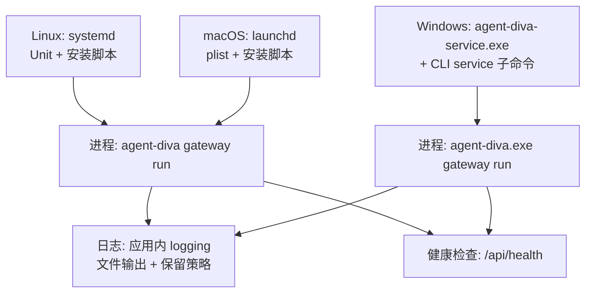
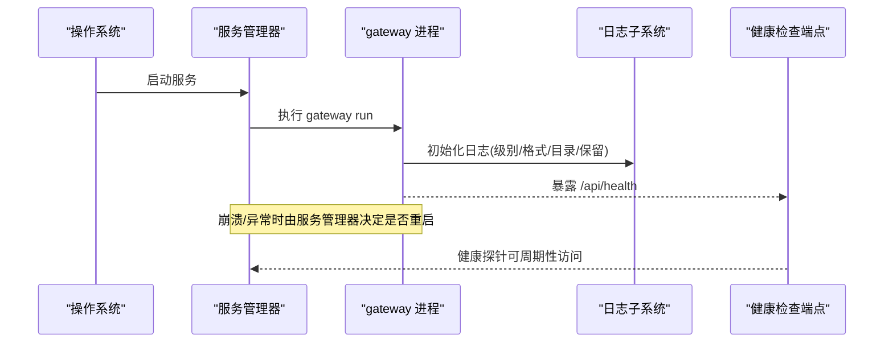
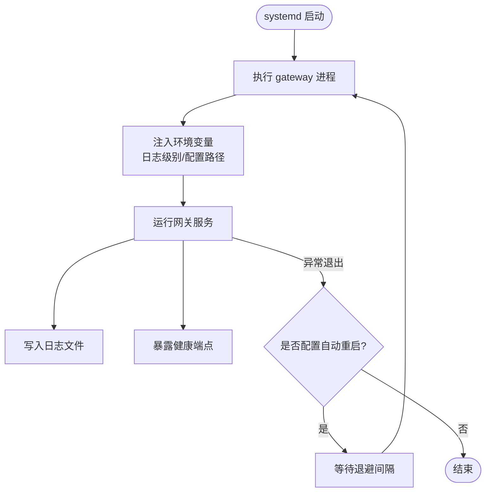
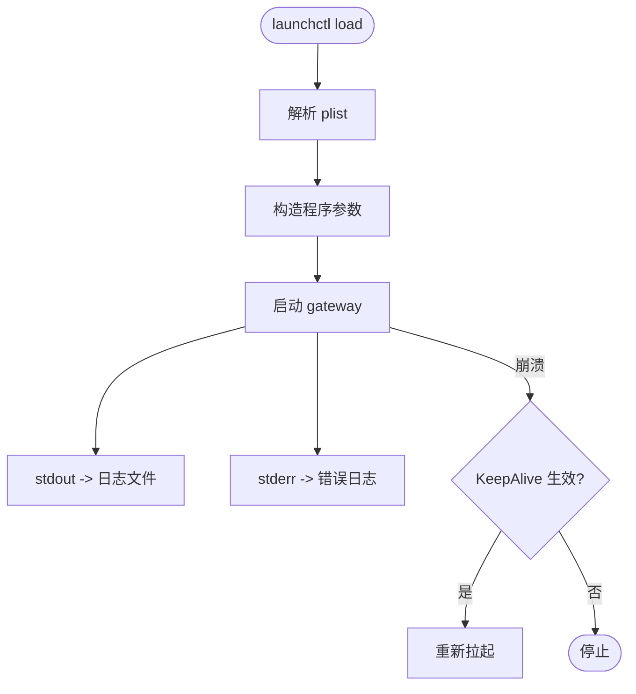
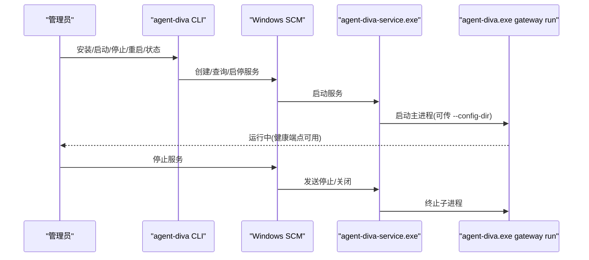
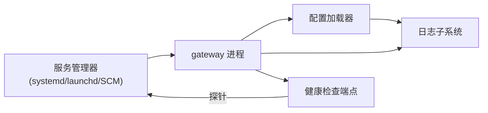

# 服务配置

<cite>
**本文引用的文件**
- [agent-diva.service](file://contrib/systemd/agent-diva.service)
- [install.sh](file://contrib/systemd/install.sh)
- [uninstall.sh](file://contrib/systemd/uninstall.sh)
- [com.agent-diva.gateway.plist](file://contrib/launchd/com.agent-diva.gateway.plist)
- [com.agent-diva.gateway.daemon.plist](file://contrib/launchd/com.agent-diva.gateway.daemon.plist)
- [install.sh](file://contrib/launchd/install.sh)
- [uninstall.sh](file://contrib/launchd/uninstall.sh)
- [main.rs](file://agent-diva-service/src/main.rs)
- [service.rs](file://agent-diva-cli/src/service.rs)
- [schema.rs](file://agent-diva-core/src/config/schema.rs)
- [loader.rs](file://agent-diva-core/src/config/loader.rs)
- [logging.rs](file://agent-diva-core/src/logging.rs)
- [health.rs](file://agent-diva-manager/src/handlers/health.rs)
</cite>

## 目录
1. [简介](#简介)
2. [项目结构](#项目结构)
3. [核心组件](#核心组件)
4. [架构总览](#架构总览)
5. [详细组件分析](#详细组件分析)
6. [依赖关系分析](#依赖关系分析)
7. [性能考虑](#性能考虑)
8. [故障排查指南](#故障排查指南)
9. [结论](#结论)
10. [附录](#附录)

## 简介
本文件面向运维与平台工程师，提供 Agent Diva 在 Linux（systemd）、macOS（launchd）与 Windows（Windows Service）上的服务化部署、参数配置、生命周期管理、日志输出与轮转、监控与健康检查、以及故障恢复与自动重启的完整实践指南。文档同时覆盖命令行入口与服务管理器之间的交互方式，帮助你在不同平台上以一致的方式运行和管理网关进程。

## 项目结构
本项目在服务化方面提供了三类系统级集成：
- Linux：systemd Unit 文件与安装/卸载脚本
- macOS：launchd plist 模板与用户级安装/卸载脚本
- Windows：专用服务包装器与 CLI 子命令，用于安装、启停、状态查询等

图表来源
- [agent-diva.service:1-28](file://contrib/systemd/agent-diva.service#L1-L28)
- [install.sh:1-68](file://contrib/systemd/install.sh#L1-L68)
- [com.agent-diva.gateway.plist:1-32](file://contrib/launchd/com.agent-diva.gateway.plist#L1-L32)
- [install.sh:1-67](file://contrib/launchd/install.sh#L1-L67)
- [main.rs:23-181](file://agent-diva-service/src/main.rs#L23-L181)
- [service.rs:1-120](file://agent-diva-cli/src/service.rs#L1-L120)
- [logging.rs:63-106](file://agent-diva-core/src/logging.rs#L63-L106)
- [health.rs:32-40](file://agent-diva-manager/src/handlers/health.rs#L32-L40)

章节来源
- [agent-diva.service:1-28](file://contrib/systemd/agent-diva.service#L1-L28)
- [install.sh:1-68](file://contrib/systemd/install.sh#L1-L68)
- [com.agent-diva.gateway.plist:1-32](file://contrib/launchd/com.agent-diva.gateway.plist#L1-L32)
- [install.sh:1-67](file://contrib/launchd/install.sh#L1-L67)
- [main.rs:23-181](file://agent-diva-service/src/main.rs#L23-L181)
- [service.rs:1-120](file://agent-diva-cli/src/service.rs#L1-L120)

## 核心组件
- 服务单元定义
  - Linux：systemd Unit 定义了进程类型、启动命令、环境变量、安全隔离、重启策略与停止超时。
  - macOS：launchd plist 定义了程序参数、开机自启、崩溃重启、标准输出/错误输出路径。
  - Windows：通过专用服务二进制封装并调用主进程；CLI 提供安装、启动、停止、重启、卸载与状态查询。
- 配置加载
  - 配置文件由核心模块加载，支持默认值、合并与环境变量覆盖，并提供热更新与重启需求分类。
- 日志系统
  - 统一使用 tracing 层，支持文本或 JSON 格式、模块级别过滤、文件输出与按天保留清理。
- 健康检查
  - 暴露 HTTP 健康端点，返回版本、运行时长、组件就绪情况与内存健康信息。

章节来源
- [agent-diva.service:1-28](file://contrib/systemd/agent-diva.service#L1-L28)
- [com.agent-diva.gateway.plist:1-32](file://contrib/launchd/com.agent-diva.gateway.plist#L1-L32)
- [main.rs:23-181](file://agent-diva-service/src/main.rs#L23-L181)
- [service.rs:1-120](file://agent-diva-cli/src/service.rs#L1-L120)
- [loader.rs:45-73](file://agent-diva-core/src/config/loader.rs#L45-L73)
- [schema.rs:511-557](file://agent-diva-core/src/config/schema.rs#L511-L557)
- [logging.rs:63-106](file://agent-diva-core/src/logging.rs#L63-L106)
- [health.rs:32-40](file://agent-diva-manager/src/handlers/health.rs#L32-L40)

## 架构总览
下图展示了在不同操作系统上，服务管理器如何拉起网关进程，以及进程内部日志与健康检查的流向。

图表来源
- [agent-diva.service:6-14](file://contrib/systemd/agent-diva.service#L6-L14)
- [com.agent-diva.gateway.plist:8-29](file://contrib/launchd/com.agent-diva.gateway.plist#L8-L29)
- [main.rs:92-146](file://agent-diva-service/src/main.rs#L92-L146)
- [logging.rs:63-106](file://agent-diva-core/src/logging.rs#L63-L106)
- [health.rs:32-40](file://agent-diva-manager/src/handlers/health.rs#L32-L40)

## 详细组件分析

### Linux：systemd 服务配置
- 关键要点
  - 进程类型：simple，工作目录与用户/组隔离
  - 启动命令：gateway 子命令
  - 重启策略：失败时自动重启，带退避间隔
  - 停止超时：优雅停止窗口
  - 安全设置：最小权限、只读文件系统、私有临时目录、受限读写路径
  - 环境变量：日志级别、配置文件路径
- 生命周期操作
  - 启动/停止/重启/状态：使用 systemctl 管理
  - 开机自启：enable 目标
- 日志与轮转
  - 应用内日志写入指定目录，可通过配置控制级别、格式与保留天数
  - 如需外部轮转，可结合 logrotate 对日志目录进行归档

图表来源
- [agent-diva.service:6-25](file://contrib/systemd/agent-diva.service#L6-L25)
- [logging.rs:63-106](file://agent-diva-core/src/logging.rs#L63-L106)

章节来源
- [agent-diva.service:1-28](file://contrib/systemd/agent-diva.service#L1-L28)
- [install.sh:1-68](file://contrib/systemd/install.sh#L1-L68)
- [uninstall.sh:1-28](file://contrib/systemd/uninstall.sh#L1-L28)

### macOS：launchd 服务配置
- 关键要点
  - 程序参数：gateway run
  - 开机自启：RunAtLoad
  - 崩溃重启：KeepAlive 针对崩溃场景
  - 日志输出：标准输出/错误输出到独立文件
- 生命周期操作
  - 加载/卸载：launchctl load/unload
  - 查看状态：launchctl list
- 日志与轮转
  - 日志位于用户目录 Logs 下，可按需配合系统工具进行归档

图表来源
- [com.agent-diva.gateway.plist:8-29](file://contrib/launchd/com.agent-diva.gateway.plist#L8-L29)
- [install.sh:1-67](file://contrib/launchd/install.sh#L1-L67)

章节来源
- [com.agent-diva.gateway.plist:1-32](file://contrib/launchd/com.agent-diva.gateway.plist#L1-L32)
- [com.agent-diva.gateway.daemon.plist:1-37](file://contrib/launchd/com.agent-diva.gateway.daemon.plist#L1-L37)
- [install.sh:1-67](file://contrib/launchd/install.sh#L1-L67)
- [uninstall.sh:1-21](file://contrib/launchd/uninstall.sh#L1-L21)

### Windows：服务管理与命令行参数
- 服务包装器
  - 专用服务二进制负责注册服务、处理停止/关闭信号、启动并守护主进程
  - 控制台模式便于本地验证
- CLI 子命令
  - 安装/更新服务定义、启动、停止、重启、卸载、状态查询（支持 JSON 输出）
  - 支持 dry-run 模式用于 CI 校验
- 参数传递
  - 服务启动时可传入配置目录参数，传递给主进程
- 生命周期
  - 通过 SCM 控制服务状态，服务状态变化会映射到主进程生命周期

图表来源
- [main.rs:23-181](file://agent-diva-service/src/main.rs#L23-L181)
- [service.rs:1-120](file://agent-diva-cli/src/service.rs#L1-L120)

章节来源
- [main.rs:23-181](file://agent-diva-service/src/main.rs#L23-L181)
- [service.rs:1-120](file://agent-diva-cli/src/service.rs#L1-L120)

### 配置选项与命令行参数
- 配置文件
  - 根配置包含网关、日志、沙箱、报告等多个子项
  - 日志配置包括级别、格式、目录、模块覆盖与保留天数
- 配置加载
  - 从文件与环境变量合并，支持别名与路径替换，并进行校验
  - 变更分为“热重载”与“需要重启”两类
- 命令行
  - Linux/macOS：通过服务管理器注入环境变量与启动参数
  - Windows：CLI 子命令与服务的参数传递（如配置目录）

章节来源
- [schema.rs:278-309](file://agent-diva-core/src/config/schema.rs#L278-L309)
- [schema.rs:511-557](file://agent-diva-core/src/config/schema.rs#L511-L557)
- [loader.rs:45-73](file://agent-diva-core/src/config/loader.rs#L45-L73)
- [loader.rs:183-219](file://agent-diva-core/src/config/loader.rs#L183-L219)
- [main.rs:164-181](file://agent-diva-service/src/main.rs#L164-L181)
- [service.rs:144-170](file://agent-diva-cli/src/service.rs#L144-L170)

### 日志输出与轮转策略
- 输出位置与格式
  - 支持文本与 JSON 两种格式，可附加时间戳、线程、文件与行号
  - 文件输出采用非阻塞写入
- 级别与模块覆盖
  - 全局级别与模块级覆盖，便于精细化调试
- 保留策略
  - 启动时清理过期日志，保留天数可配置
- 平台差异
  - Linux：systemd 将 stdout/stderr 交由服务管理器，也可由应用写入文件
  - macOS：launchd 将 stdout/stderr 重定向到日志文件
  - Windows：服务模式下子进程标准流被丢弃，建议应用内文件日志

章节来源
- [logging.rs:63-106](file://agent-diva-core/src/logging.rs#L63-L106)
- [logging.rs:108-163](file://agent-diva-core/src/logging.rs#L108-L163)
- [agent-diva.service:23-25](file://contrib/systemd/agent-diva.service#L23-L25)
- [com.agent-diva.gateway.plist:26-29](file://contrib/launchd/com.agent-diva.gateway.plist#L26-L29)
- [main.rs:164-181](file://agent-diva-service/src/main.rs#L164-L181)

### 服务监控与健康检查
- 健康端点
  - 返回服务版本、运行时长、组件就绪情况与内存健康
  - 可用于负载均衡、编排系统与告警探针
- 组件就绪
  - 审计输出、事件总线、定时任务、内存等组件的状态聚合
- 建议
  - 定期访问健康端点，结合指标系统进行可视化与告警

章节来源
- [health.rs:32-40](file://agent-diva-manager/src/handlers/health.rs#L32-L40)

### 故障恢复与自动重启机制
- Linux（systemd）
  - 配置失败自动重启与重启间隔，避免频繁抖动
  - 优雅停止超时，确保资源释放
- macOS（launchd）
  - KeepAlive 针对崩溃场景自动重启
- Windows
  - 服务包装器监听停止/关闭信号，终止子进程后上报服务状态
  - CLI 支持 dry-run 与状态查询，便于自动化排障

章节来源
- [agent-diva.service:12-14](file://contrib/systemd/agent-diva.service#L12-L14)
- [com.agent-diva.gateway.plist:18-24](file://contrib/launchd/com.agent-diva.gateway.plist#L18-L24)
- [main.rs:92-146](file://agent-diva-service/src/main.rs#L92-L146)

## 依赖关系分析
- 服务管理器与进程
  - systemd/launchd/SCM 负责进程生命周期与重启策略
  - 主进程负责业务逻辑、日志与健康检查
- 配置与日志
  - 配置加载影响日志级别与输出路径
  - 日志子系统依赖配置中的目录与保留策略
- 健康检查
  - 健康端点依赖各组件就绪状态，供外部系统探测

图表来源
- [agent-diva.service:6-14](file://contrib/systemd/agent-diva.service#L6-L14)
- [com.agent-diva.gateway.plist:8-29](file://contrib/launchd/com.agent-diva.gateway.plist#L8-L29)
- [main.rs:92-146](file://agent-diva-service/src/main.rs#L92-L146)
- [loader.rs:45-73](file://agent-diva-core/src/config/loader.rs#L45-L73)
- [logging.rs:63-106](file://agent-diva-core/src/logging.rs#L63-L106)
- [health.rs:32-40](file://agent-diva-manager/src/handlers/health.rs#L32-L40)

章节来源
- [agent-diva.service:6-14](file://contrib/systemd/agent-diva.service#L6-L14)
- [com.agent-diva.gateway.plist:8-29](file://contrib/launchd/com.agent-diva.gateway.plist#L8-L29)
- [main.rs:92-146](file://agent-diva-service/src/main.rs#L92-L146)
- [loader.rs:45-73](file://agent-diva-core/src/config/loader.rs#L45-L73)
- [logging.rs:63-106](file://agent-diva-core/src/logging.rs#L63-L106)
- [health.rs:32-40](file://agent-diva-manager/src/handlers/health.rs#L32-L40)

## 性能考虑
- 日志写入采用非阻塞方式，减少 I/O 阻塞
- 合理设置日志级别与模块覆盖，降低生产环境开销
- 健康检查应轻量，避免高频访问造成额外负载
- 重启间隔与停止超时需根据实际业务调整，避免雪崩

[本节为通用指导，不直接分析具体文件]

## 故障排查指南
- 无法启动
  - 检查二进制路径、Unit/plist 配置是否正确
  - 确认环境变量与配置文件路径存在且可读
- 日志为空或无输出
  - 确认日志目录存在且可写
  - 检查日志级别与格式配置
  - Windows 服务模式下注意标准流被丢弃，需依赖应用内文件日志
- 健康检查不可用
  - 确认端口未被占用，服务已正常启动
  - 检查组件就绪状态，定位具体组件问题
- 自动重启频繁
  - 检查崩溃原因与日志，调整重启间隔与停止超时
  - 必要时增加健康检查与告警阈值

章节来源
- [agent-diva.service:6-25](file://contrib/systemd/agent-diva.service#L6-L25)
- [com.agent-diva.gateway.plist:8-29](file://contrib/launchd/com.agent-diva.gateway.plist#L8-L29)
- [logging.rs:63-106](file://agent-diva-core/src/logging.rs#L63-L106)
- [health.rs:32-40](file://agent-diva-manager/src/handlers/health.rs#L32-L40)

## 结论
通过在 Linux、macOS 与 Windows 上使用各自的服务管理器，Agent Diva 可以实现一致的进程生命周期管理、安全的运行环境与可观测性。结合配置加载、日志轮转与健康检查，能够在生产环境中稳定运行并快速定位问题。建议在生产部署时明确日志策略、健康探针与自动重启策略，并结合监控与告警形成闭环。

[本节为总结性内容，不直接分析具体文件]

## 附录
- 常用操作速查
  - Linux：systemctl start/stop/restart/status agent-diva
  - macOS：launchctl load/unload com.agent-diva.gateway
  - Windows：agent-diva service install/start/stop/restart/status
- 关键配置项
  - 日志级别、格式、目录与保留天数
  - 配置文件路径与环境变量
  - 服务重启策略与停止超时

[本节为补充说明，不直接分析具体文件]