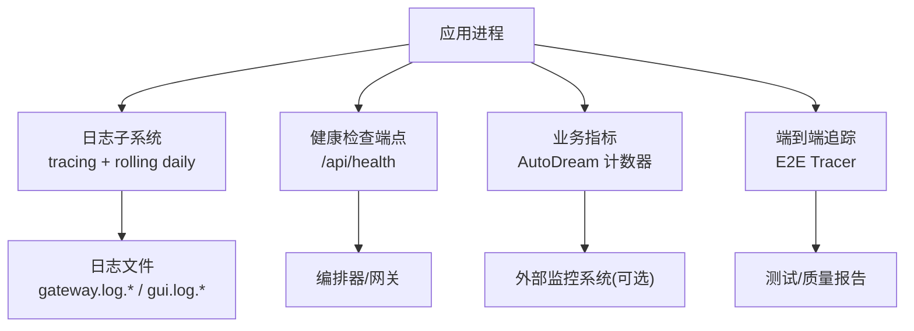
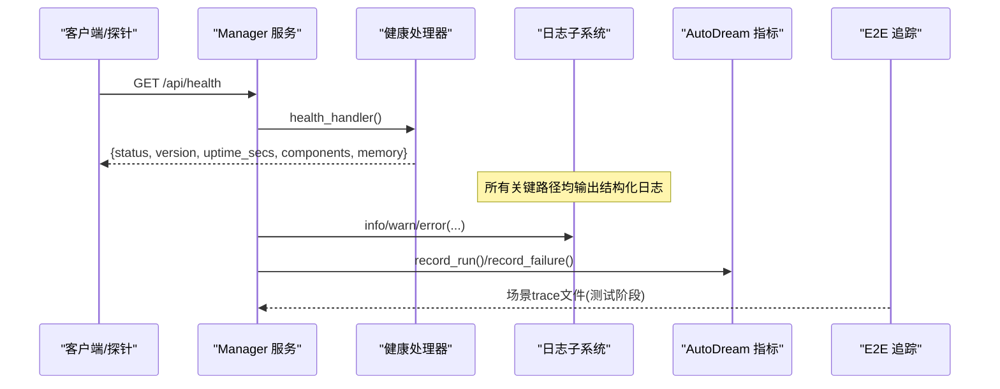
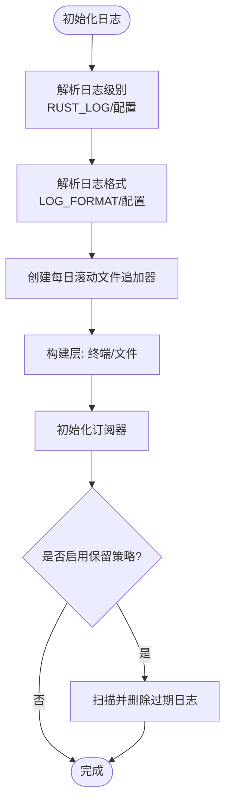
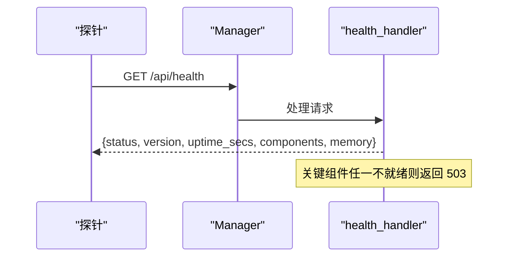
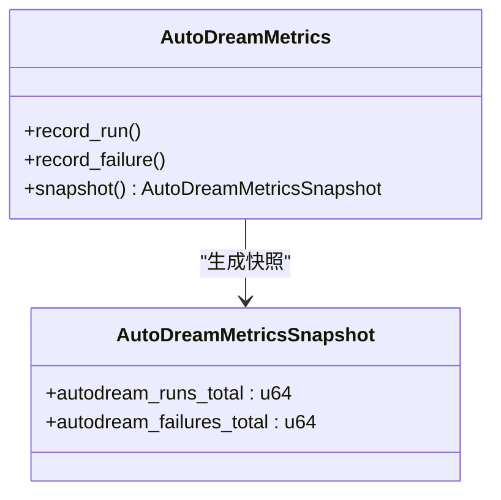
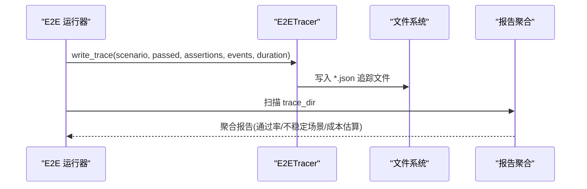
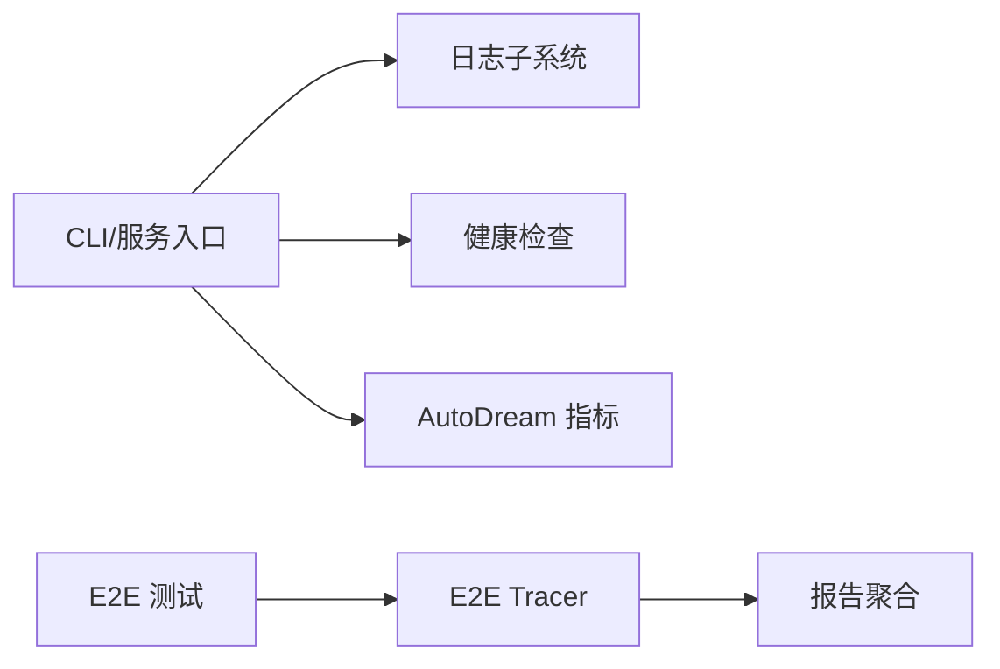

# 监控告警

<cite>
**本文引用的文件**
- [agent-diva-core/src/logging.rs](file://agent-diva-core/src/logging.rs)
- [agent-diva-core/src/config/schema.rs](file://agent-diva-core/src/config/schema.rs)
- [agent-diva-manager/src/handlers/health.rs](file://agent-diva-manager/src/handlers/health.rs)
- [agent-diva-autodream/src/metrics.rs](file://agent-diva-autodream/src/metrics.rs)
- [agent-diva-e2e/src/tracer.rs](file://agent-diva-e2e/src/tracer.rs)
- [agent-diva-e2e/src/report.rs](file://agent-diva-e2e/src/report.rs)
- [agent-diva-manager/src/handlers/audit.rs](file://agent-diva-manager/src/handlers/audit.rs)
- [agent-diva-agent/src/agent_loop.rs](file://agent-diva-agent/src/agent_loop.rs)
</cite>

## 目录
1. [简介](#简介)
2. [项目结构](#项目结构)
3. [核心组件](#核心组件)
4. [架构总览](#架构总览)
5. [详细组件分析](#详细组件分析)
6. [依赖关系分析](#依赖关系分析)
7. [性能考虑](#性能考虑)
8. [故障排查指南](#故障排查指南)
9. [结论](#结论)
10. [附录](#附录)

## 简介
本指南面向生产运维与平台工程团队，提供 Agent-Diva 的监控、日志、健康检查、指标与告警、以及分布式追踪的配置与实践建议。内容基于仓库中现有实现进行提炼，并给出可操作的配置项、端点说明与最佳实践，帮助快速搭建稳定可靠的观测体系。

## 项目结构
Agent-Diva 在“日志”“健康检查”“指标”“追踪”四个维度具备内建能力：
- 日志：通过 core/logging 初始化结构化日志（支持 JSON/文本）、按日滚动、保留策略清理；CLI 与服务启动时统一接入。
- 健康检查：manager 暴露 /api/health，聚合组件就绪状态、内存健康与运行时长。
- 指标：autodream 模块提供原子计数器快照；E2E tracer 输出场景级 trace 文件并汇总报告。
- 追踪：agent loop 使用 tracing span 注入 trace_id；审计日志可通过 manager API 读取。

**章节来源**
- [agent-diva-core/src/logging.rs:10-114](file://agent-diva-core/src/logging.rs#L10-L114)
- [agent-diva-manager/src/handlers/health.rs:32-72](file://agent-diva-manager/src/handlers/health.rs#L32-L72)
- [agent-diva-autodream/src/metrics.rs:3-45](file://agent-diva-autodream/src/metrics.rs#L3-L45)
- [agent-diva-e2e/src/tracer.rs:73-85](file://agent-diva-e2e/src/tracer.rs#L73-L85)

## 核心组件
- 日志子系统
  - 支持环境变量覆盖日志级别与格式；按日滚动写入；自动清理过期日志；支持终端输出开关。
- 健康检查
  - 返回服务整体状态、版本、运行时长、关键组件就绪情况与内存健康信息。
- 指标采集
  - AutoDream 模块维护运行次数与失败次数等原子指标，并提供快照接口。
- 端到端追踪
  - 测试阶段将场景执行结果、断言、工具调用统计等序列化为 JSON 文件，并生成聚合报告。

**章节来源**
- [agent-diva-core/src/logging.rs:20-114](file://agent-diva-core/src/logging.rs#L20-L114)
- [agent-diva-manager/src/handlers/health.rs:32-72](file://agent-diva-manager/src/handlers/health.rs#L32-L72)
- [agent-diva-autodream/src/metrics.rs:15-45](file://agent-diva-autodream/src/metrics.rs#L15-L45)
- [agent-diva-e2e/src/report.rs:12-34](file://agent-diva-e2e/src/report.rs#L12-L34)

## 架构总览
下图展示从请求进入、日志记录、健康检查到指标与追踪的数据流。

**图表来源**
- [agent-diva-manager/src/handlers/health.rs:32-72](file://agent-diva-manager/src/handlers/health.rs#L32-L72)
- [agent-diva-core/src/logging.rs:20-114](file://agent-diva-core/src/logging.rs#L20-L114)
- [agent-diva-autodream/src/metrics.rs:15-45](file://agent-diva-autodream/src/metrics.rs#L15-L45)
- [agent-diva-e2e/src/tracer.rs:73-85](file://agent-diva-e2e/src/tracer.rs#L73-L85)

## 详细组件分析

### 日志收集与导出
- 日志级别与格式
  - 通过环境变量 RUST_LOG 覆盖默认级别；LOG_FORMAT 控制输出格式为 JSON 或文本。
  - 支持模块级日志级别覆盖，便于精细化调试。
- 文件输出与轮转
  - 使用每日滚动写入 gateway.log.*；同时支持 gui.log.* 清理。
  - 非阻塞写入，避免阻塞主流程。
- 保留策略
  - 根据 retention_days 清理过期日志；设置为 0 表示不清理。
- 终端输出
  - 可按需启用/禁用终端输出，便于容器化环境只落盘。

**图表来源**
- [agent-diva-core/src/logging.rs:20-114](file://agent-diva-core/src/logging.rs#L20-L114)
- [agent-diva-core/src/logging.rs:116-163](file://agent-diva-core/src/logging.rs#L116-L163)

**章节来源**
- [agent-diva-core/src/logging.rs:20-114](file://agent-diva-core/src/logging.rs#L20-L114)
- [agent-diva-core/src/logging.rs:116-163](file://agent-diva-core/src/logging.rs#L116-L163)

### 健康检查端点与探针
- 端点
  - GET /api/health
- 响应字段
  - status: ok 或 degraded
  - version: 编译期版本号
  - uptime_secs: 运行秒数
  - components: 各组件就绪状态（如 audit_sink、cron、event_bus、workspace、memory）
  - memory: 内存健康状态及降级原因
- HTTP 状态码
  - 全部关键组件就绪返回 200；否则返回 503。
- 探针建议
  - 存活探针：周期性访问 /api/health，关注 200/503 变化。
  - 就绪探针：结合 components 中的 critical 组件 ready 字段判断。

**图表来源**
- [agent-diva-manager/src/handlers/health.rs:32-72](file://agent-diva-manager/src/handlers/health.rs#L32-L72)

**章节来源**
- [agent-diva-manager/src/handlers/health.rs:32-72](file://agent-diva-manager/src/handlers/health.rs#L32-L72)

### 指标定义与阈值建议
- 内置指标
  - AutoDream 运行总数、失败总数（原子计数器）。
- 指标快照
  - 提供 snapshot 接口获取当前计数值，便于集成外部监控系统。
- 建议阈值（示例）
  - 失败率 = failures_total / runs_total，建议设置 > 5% 触发告警。
  - 运行速率异常下降（单位时间 runs_total 增量低于基线）可作为容量预警。
- 扩展建议
  - 将指标导出为 Prometheus 格式或推送到时序数据库，以便可视化与告警。

**图表来源**
- [agent-diva-autodream/src/metrics.rs:3-45](file://agent-diva-autodream/src/metrics.rs#L3-L45)

**章节来源**
- [agent-diva-autodream/src/metrics.rs:15-45](file://agent-diva-autodream/src/metrics.rs#L15-L45)

### 审计日志与可读性
- 审计日志端点
  - 提供只读接口读取由 core/logging 写入的审计日志，便于问题回溯。
- 数据模型
  - 事件类型、数据体、时间戳等字段便于查询与聚合。

**章节来源**
- [agent-diva-manager/src/handlers/audit.rs:1-47](file://agent-diva-manager/src/handlers/audit.rs#L1-L47)

### 端到端追踪与链路跟踪
- 测试阶段追踪
  - E2E Tracer 将场景名称、是否通过、耗时、断言、错误、工具调用次数等写入 JSON 文件。
  - 报告聚合器统计通过率、成本估算与不稳定场景识别。
- 运行时链路追踪
  - agent loop 使用 tracing span 注入 trace_id，便于跨模块关联日志与调用链。

**图表来源**
- [agent-diva-e2e/src/tracer.rs:73-85](file://agent-diva-e2e/src/tracer.rs#L73-L85)
- [agent-diva-e2e/src/report.rs:12-34](file://agent-diva-e2e/src/report.rs#L12-L34)

**章节来源**
- [agent-diva-e2e/src/tracer.rs:73-85](file://agent-diva-e2e/src/tracer.rs#L73-L85)
- [agent-diva-e2e/src/report.rs:12-34](file://agent-diva-e2e/src/report.rs#L12-L34)
- [agent-diva-agent/src/agent_loop.rs:952-953](file://agent-diva-agent/src/agent_loop.rs#L952-L953)

## 依赖关系分析
- 日志子系统依赖 tracing 生态与 rolling appender；CLI/服务启动时统一初始化。
- 健康检查依赖 AppState 中的组件就绪状态与内存健康探测。
- 指标模块独立于日志，提供轻量级计数器。
- E2E 追踪与报告模块用于测试质量保障，不影响生产运行时。

**图表来源**
- [agent-diva-core/src/logging.rs:20-114](file://agent-diva-core/src/logging.rs#L20-L114)
- [agent-diva-manager/src/handlers/health.rs:32-72](file://agent-diva-manager/src/handlers/health.rs#L32-L72)
- [agent-diva-autodream/src/metrics.rs:15-45](file://agent-diva-autodream/src/metrics.rs#L15-L45)
- [agent-diva-e2e/src/tracer.rs:73-85](file://agent-diva-e2e/src/tracer.rs#L73-L85)
- [agent-diva-e2e/src/report.rs:12-34](file://agent-diva-e2e/src/report.rs#L12-L34)

**章节来源**
- [agent-diva-core/src/logging.rs:20-114](file://agent-diva-core/src/logging.rs#L20-L114)
- [agent-diva-manager/src/handlers/health.rs:32-72](file://agent-diva-manager/src/handlers/health.rs#L32-L72)
- [agent-diva-autodream/src/metrics.rs:15-45](file://agent-diva-autodream/src/metrics.rs#L15-L45)
- [agent-diva-e2e/src/tracer.rs:73-85](file://agent-diva-e2e/src/tracer.rs#L73-L85)
- [agent-diva-e2e/src/report.rs:12-34](file://agent-diva-e2e/src/report.rs#L12-L34)

## 性能考虑
- 日志写入采用非阻塞模式，降低对主流程的影响。
- 健康检查端点包含基准测试用例，确保在高并发下仍满足预算。
- 日志保留策略避免磁盘无限增长，建议根据存储容量与合规要求调整 retention_days。
- 指标计数器为原子操作，开销极低，适合高频上报。

[本节为通用指导，无需特定文件引用]

## 故障排查指南
- 日志无法写入
  - 检查日志目录权限与磁盘空间；确认 retention_days 未误设为 0 导致历史文件过多。
- 健康检查持续 503
  - 查看 components 中 critical 组件的 ready 状态；定位具体组件（如 audit_sink、cron、memory）并检查其依赖。
- 指标异常
  - 对比 runs_total 与 failures_total，计算失败率；若失败率突增，结合日志与审计日志定位根因。
- 追踪缺失
  - 确认 E2E 测试是否启用了 tracer；检查 trace_dir 是否存在且可写；验证报告聚合逻辑是否正确扫描文件。

**章节来源**
- [agent-diva-core/src/logging.rs:116-163](file://agent-diva-core/src/logging.rs#L116-L163)
- [agent-diva-manager/src/handlers/health.rs:32-72](file://agent-diva-manager/src/handlers/health.rs#L32-L72)
- [agent-diva-e2e/src/report.rs:12-34](file://agent-diva-e2e/src/report.rs#L12-L34)

## 结论
Agent-Diva 已具备完善的日志、健康检查、指标与测试追踪能力。通过合理配置日志级别与保留策略、利用健康端点进行探针与告警、结合指标快照与审计日志进行问题定位，可在生产环境中建立高效稳定的观测体系。建议在后续迭代中引入统一的指标导出与告警规则引擎，以进一步提升可观测性与自动化运维能力。

[本节为总结性内容，无需特定文件引用]

## 附录

### 配置项速查
- 日志
  - RUST_LOG：日志级别（覆盖默认）
  - LOG_FORMAT：json 或 text（覆盖默认）
  - logging.dir：日志目录
  - logging.level：默认级别
  - logging.format：默认格式
  - logging.retention_days：保留天数（0 表示不清理）
  - logging.overrides：模块级日志级别覆盖
- 健康检查
  - 端点：GET /api/health
  - 关键字段：status、version、uptime_secs、components、memory

**章节来源**
- [agent-diva-core/src/config/schema.rs:302-302](file://agent-diva-core/src/config/schema.rs#L302-L302)
- [agent-diva-core/src/config/schema.rs:513-547](file://agent-diva-core/src/config/schema.rs#L513-L547)
- [agent-diva-manager/src/handlers/health.rs:32-72](file://agent-diva-manager/src/handlers/health.rs#L32-L72)