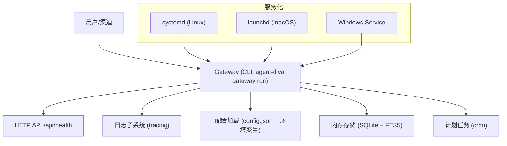
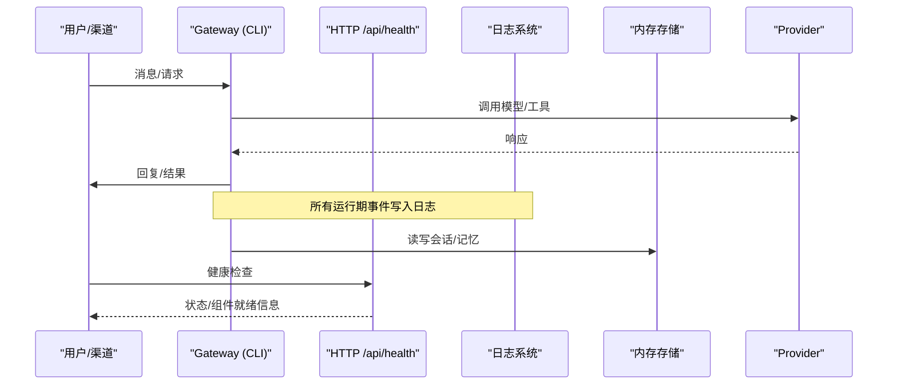
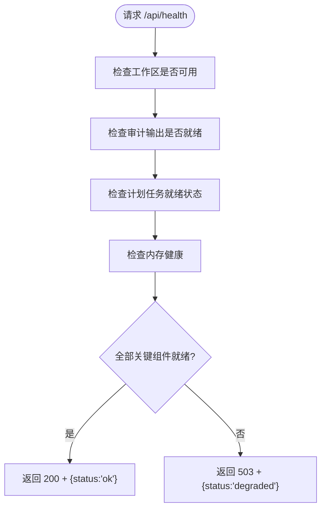
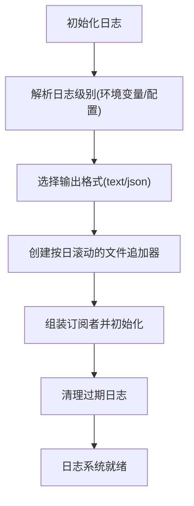
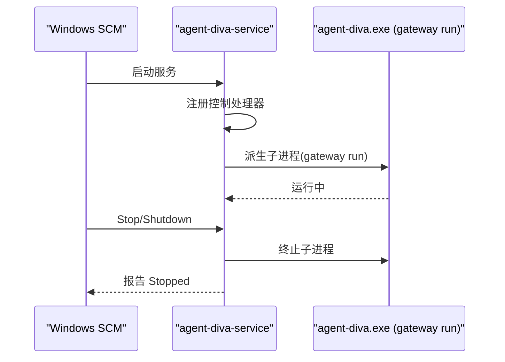
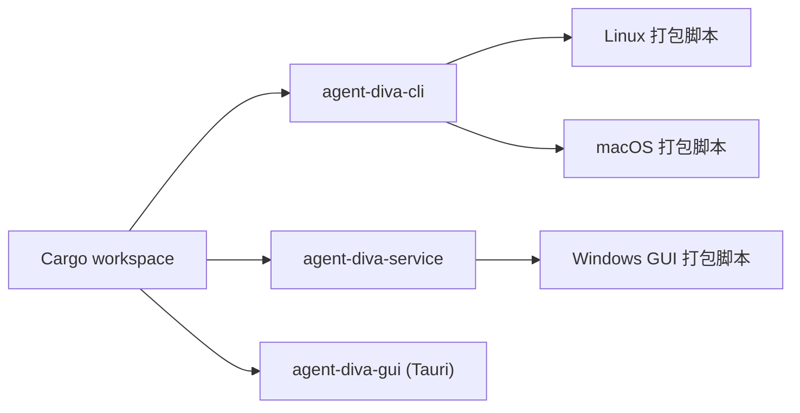

# 部署运维

<cite>
**本文引用的文件**
- [README.md](file://README.md)
- [Cargo.toml](file://Cargo.toml)
- [agent-diva-service/src/main.rs](file://agent-diva-service/src/main.rs)
- [contrib/systemd/agent-diva.service](file://contrib/systemd/agent-diva.service)
- [contrib/systemd/install.sh](file://contrib/systemd/install.sh)
- [contrib/launchd/com.agent-diva.gateway.plist](file://contrib/launchd/com.agent-diva.gateway.plist)
- [contrib/launchd/install.sh](file://contrib/launchd/install.sh)
- [scripts/package-linux.sh](file://scripts/package-linux.sh)
- [scripts/package-macos.sh](file://scripts/package-macos.sh)
- [scripts/package-windows-gui.ps1](file://scripts/package-windows-gui.ps1)
- [agent-diva-core/src/logging.rs](file://agent-diva-core/src/logging.rs)
- [agent-diva-core/src/config/schema.rs](file://agent-diva-core/src/config/schema.rs)
- [agent-diva-manager/src/handlers/health.rs](file://agent-diva-manager/src/handlers/health.rs)
- [agent-diva-migration/src/typed_memory.rs](file://agent-diva-migration/src/typed_memory.rs)
- [agent-diva-laputa/src/typed_store.rs](file://agent-diva-laputa/src/typed_store.rs)
</cite>

## 目录
1. [简介](#简介)
2. [项目结构](#项目结构)
3. [核心组件](#核心组件)
4. [架构总览](#架构总览)
5. [详细组件分析](#详细组件分析)
6. [依赖关系分析](#依赖关系分析)
7. [性能与容量规划](#性能与容量规划)
8. [监控与告警](#监控与告警)
9. [日志与可观测性](#日志与可观测性)
10. [备份与恢复](#备份与恢复)
11. [平台部署指南](#平台部署指南)
12. [容器化与生产最佳实践](#容器化与生产最佳实践)
13. [故障排查与常见问题](#故障排查与常见问题)
14. [结论](#结论)

## 简介
本指南面向生产环境的 Agent Diva Gateway 部署与运维，覆盖 Windows、Linux、macOS 的部署要求与服务管理方式（systemd、launchd、Windows Service），并提供容器化方案、监控告警、日志收集、备份恢复、灾难恢复、性能调优与容量规划、以及常见故障排查方法。Agent Diva 是一个自托管的个人 AI 网关，负责将聊天渠道与 LLM Provider 连接，内置会话、调度、审批、记忆与人格治理等能力。

## 项目结构
仓库采用多 crate 工作区组织，Gateway 由 CLI 启动，GUI 通过 Tauri 打包，服务化包装在 service crate 中；系统级服务单元文件位于 contrib 目录，平台打包脚本位于 scripts 目录。

图表来源
- [agent-diva-service/src/main.rs:23-68](file://agent-diva-service/src/main.rs#L23-L68)
- [contrib/systemd/agent-diva.service:1-28](file://contrib/systemd/agent-diva.service#L1-L28)
- [contrib/launchd/com.agent-diva.gateway.plist:1-32](file://contrib/launchd/com.agent-diva.gateway.plist#L1-L32)
- [agent-diva-manager/src/handlers/health.rs:32-72](file://agent-diva-manager/src/handlers/health.rs#L32-L72)

章节来源
- [README.md:87-108](file://README.md#L87-L108)
- [Cargo.toml:1-20](file://Cargo.toml#L1-L20)

## 核心组件
- Gateway 进程：通过 CLI 命令启动，承载 HTTP API、渠道接入、Agent Loop、工具执行、计划任务等。
- 服务化封装：Windows 提供专用 service 二进制以注册为 Windows Service；Linux/macOS 使用 systemd/launchd。
- 健康检查：HTTP 接口暴露 /api/health，用于就绪与健康度探测。
- 日志系统：基于 tracing，支持按日滚动、保留策略、JSON/文本格式。
- 配置系统：集中式 JSON 配置与环境变量覆盖，包含日志、沙箱、渠道、Provider 等。

章节来源
- [agent-diva-service/src/main.rs:23-68](file://agent-diva-service/src/main.rs#L23-L68)
- [agent-diva-manager/src/handlers/health.rs:32-72](file://agent-diva-manager/src/handlers/health.rs#L32-L72)
- [agent-diva-core/src/logging.rs:10-114](file://agent-diva-core/src/logging.rs#L10-L114)
- [agent-diva-core/src/config/schema.rs:278-309](file://agent-diva-core/src/config/schema.rs#L278-L309)

## 架构总览
Gateway 作为单一事实源，统一处理消息路由、会话状态、渠道连接与计划任务；Agent Loop 调用 LLM Provider 与工具，结果回传至对应渠道。GUI/TUI/CLI 均通过 Gateway 提供的能力进行交互。

图表来源
- [agent-diva-manager/src/handlers/health.rs:32-72](file://agent-diva-manager/src/handlers/health.rs#L32-L72)
- [agent-diva-core/src/logging.rs:10-114](file://agent-diva-core/src/logging.rs#L10-L114)

## 详细组件分析

### 健康检查与就绪探针
- 端点：GET /api/health
- 返回字段包括整体 status、版本、运行时长、各组件就绪情况与内存健康状态。
- 关键组件：审计输出、计划任务、事件总线、工作区、内存。
- 当关键组件未就绪时返回 503，否则返回 200。

图表来源
- [agent-diva-manager/src/handlers/health.rs:32-72](file://agent-diva-manager/src/handlers/health.rs#L32-L72)

章节来源
- [agent-diva-manager/src/handlers/health.rs:32-72](file://agent-diva-manager/src/handlers/health.rs#L32-L72)

### 日志系统与保留策略
- 初始化：根据配置与 RUST_LOG 设置级别，支持模块级覆盖。
- 输出：同时输出到终端与文件；文件按日滚动，默认前缀 gateway.log。
- 清理：启动时清理超过 retention_days 的旧日志文件。
- 格式：支持 text/json，可通过 LOG_FORMAT 覆盖。

图表来源
- [agent-diva-core/src/logging.rs:10-114](file://agent-diva-core/src/logging.rs#L10-L114)

章节来源
- [agent-diva-core/src/logging.rs:10-114](file://agent-diva-core/src/logging.rs#L10-L114)
- [agent-diva-core/src/config/schema.rs:511-557](file://agent-diva-core/src/config/schema.rs#L511-L557)

### 配置系统
- 根配置对象包含 agents、channels、providers、gateway、tools、memory、self_evolution、reports、logging、sandbox、mate 等子配置。
- 支持环境变量覆盖，便于不同环境差异化部署。
- 日志配置项：level、format、dir、overrides、retention_days。

章节来源
- [agent-diva-core/src/config/schema.rs:278-309](file://agent-diva-core/src/config/schema.rs#L278-L309)
- [agent-diva-core/src/config/schema.rs:511-557](file://agent-diva-core/src/config/schema.rs#L511-L557)

### 服务化封装（Windows）
- 非 Windows 平台直接报错提示不支持。
- Windows 下注册服务名 AgentDivaGateway，启动后派生 gateway 子进程，监听停止/关闭信号，优雅终止子进程。
- 控制台模式可用于本地验证。

图表来源
- [agent-diva-service/src/main.rs:23-68](file://agent-diva-service/src/main.rs#L23-L68)
- [agent-diva-service/src/main.rs:92-146](file://agent-diva-service/src/main.rs#L92-L146)

章节来源
- [agent-diva-service/src/main.rs:23-68](file://agent-diva-service/src/main.rs#L23-L68)
- [agent-diva-service/src/main.rs:92-146](file://agent-diva-service/src/main.rs#L92-L146)

## 依赖关系分析
- 构建与发布：workspace 定义了 Rust 版本、依赖与发布优化选项（LTO、strip）。
- GUI 打包：Windows 通过 PowerShell 脚本完成 CLI/Service 构建、资源准备与 NSIS/MSI 打包。
- Linux/macOS 打包：分别生成 tarball/DMG，并附带安装脚本与服务单元。

图表来源
- [Cargo.toml:1-20](file://Cargo.toml#L1-L20)
- [scripts/package-linux.sh:1-101](file://scripts/package-linux.sh#L1-L101)
- [scripts/package-macos.sh:1-130](file://scripts/package-macos.sh#L1-L130)
- [scripts/package-windows-gui.ps1:1-204](file://scripts/package-windows-gui.ps1#L1-L204)

章节来源
- [Cargo.toml:101-110](file://Cargo.toml#L101-L110)
- [scripts/package-linux.sh:63-80](file://scripts/package-linux.sh#L63-L80)
- [scripts/package-macos.sh:66-122](file://scripts/package-macos.sh#L66-L122)
- [scripts/package-windows-gui.ps1:154-183](file://scripts/package-windows-gui.ps1#L154-L183)

## 性能与容量规划
- 并发与异步：基于 tokio 运行时，启用多线程 RT、时间、IO 等特性，适合高并发场景。
- 发布优化：release profile 开启 LTO、单代码单元、strip，减小体积并提升性能。
- 日志开销：按日滚动与非阻塞写入降低 IO 压力；合理设置 retention_days 避免磁盘膨胀。
- 健康检查：/api/health 轻量且快速，适合作为负载均衡或编排系统的探针。
- 容量建议：
  - 磁盘：预留日志与 SQLite 数据空间，结合 retention_days 评估增长。
  - 内存：关注 Agent Loop、工具执行与 Provider 调用峰值。
  - CPU：在高并发消息路由与工具执行时注意线程池与超时配置。

章节来源
- [Cargo.toml:27-32](file://Cargo.toml#L27-L32)
- [Cargo.toml:101-110](file://Cargo.toml#L101-L110)
- [agent-diva-core/src/logging.rs:41-49](file://agent-diva-core/src/logging.rs#L41-L49)
- [agent-diva-manager/src/handlers/health.rs:32-72](file://agent-diva-manager/src/handlers/health.rs#L32-L72)

## 监控与告警
- 健康探针：定期轮询 /api/health，依据 status 与 components 判断服务可用性。
- 指标采集：可将日志转为结构化 JSON，配合日志聚合系统进行指标提取（如错误率、延迟）。
- 告警规则建议：
  - /api/health 连续失败 N 次触发告警。
  - 日志中出现 error/fatal 级别阈值。
  - 磁盘使用率接近 retention 上限。
  - 计划任务长时间未就绪。

章节来源
- [agent-diva-manager/src/handlers/health.rs:32-72](file://agent-diva-manager/src/handlers/health.rs#L32-L72)
- [agent-diva-core/src/logging.rs:37-49](file://agent-diva-core/src/logging.rs#L37-L49)

## 日志与可观测性
- 日志级别：RUST_LOG 或配置 level；支持模块级 overrides。
- 日志格式：LOG_FORMAT=text|json；推荐生产使用 json 以便聚合。
- 日志目录：配置 dir；默认 logs；按日滚动，文件名 gateway.log.*。
- 保留策略：retention_days 控制清理阈值；0 表示永久保留。
- 可观测性增强：
  - 结合 tracing 目标与线程 ID、文件行号。
  - 将健康检查纳入外部监控系统。
  - 对关键路径（Provider 调用、工具执行）增加结构化日志。

章节来源
- [agent-diva-core/src/logging.rs:10-114](file://agent-diva-core/src/logging.rs#L10-L114)
- [agent-diva-core/src/config/schema.rs:511-557](file://agent-diva-core/src/config/schema.rs#L511-L557)

## 备份与恢复
- 数据位置：工作区下的 .laputa/memory.sqlite3 为生产记忆权威存储。
- 迁移与恢复：迁移流程会先备份 memory-before.sqlite3，导入后校验完整性；失败则自动回滚。
- 恢复步骤：
  - 停止 Gateway 进程。
  - 从备份恢复 memory.sqlite3。
  - 重启 Gateway，确认健康检查通过。
- 灾难恢复建议：
  - 定期快照工作区目录（含 .laputa）。
  - 保留最近 N 份迁移清单与备份。
  - 演练恢复流程，确保可验证。

章节来源
- [agent-diva-migration/src/typed_memory.rs:123-170](file://agent-diva-migration/src/typed_memory.rs#L123-L170)
- [agent-diva-laputa/src/typed_store.rs:371-401](file://agent-diva-laputa/src/typed_store.rs#L371-L401)

## 平台部署指南

### Linux（systemd）
- 安装：
  - 使用 contrib/systemd/install.sh 安装二进制、服务单元，并启动服务。
  - 或通过 scripts/package-linux.sh 生成安装包与示例服务单元。
- 服务单元：
  - 指定 User/Group、WorkingDirectory、ExecStart、Restart、安全限制与环境变量。
- 日志：
  - 默认输出到标准输出/错误；也可通过 logging.dir 配置文件日志。
- 常用命令：
  - systemctl start/stop/restart/status agent-diva
  - journalctl -u agent-diva 查看系统日志

章节来源
- [contrib/systemd/install.sh:1-68](file://contrib/systemd/install.sh#L1-L68)
- [contrib/systemd/agent-diva.service:1-28](file://contrib/systemd/agent-diva.service#L1-L28)
- [scripts/package-linux.sh:63-80](file://scripts/package-linux.sh#L63-L80)

### macOS（launchd）
- 安装：
  - 使用 contrib/launchd/install.sh 安装 LaunchAgent plist，自动替换路径并加载服务。
- plist：
  - ProgramArguments 指定 gateway run；KeepAlive 配置崩溃重启；StandardOut/ErrorPath 输出日志。
- 常用命令：
  - launchctl list | grep com.agent-diva.gateway
  - launchctl unload/load 管理

章节来源
- [contrib/launchd/install.sh:1-67](file://contrib/launchd/install.sh#L1-L67)
- [contrib/launchd/com.agent-diva.gateway.plist:1-32](file://contrib/launchd/com.agent-diva.gateway.plist#L1-L32)

### Windows（Windows Service）
- 安装：
  - 使用 agent-diva-service 注册为 Windows Service，名称 AgentDivaGateway。
  - 可通过 scripts/package-windows-gui.ps1 构建 GUI 与安装包。
- 管理：
  - services.msc 或 sc 命令管理启停。
  - console 模式用于本地验证。
- 日志：
  - 服务模式下 stdout/stderr 重定向为空；建议启用文件日志并通过 logging.dir 输出。

章节来源
- [agent-diva-service/src/main.rs:23-68](file://agent-diva-service/src/main.rs#L23-L68)
- [scripts/package-windows-gui.ps1:154-183](file://scripts/package-windows-gui.ps1#L154-L183)

## 容器化与生产最佳实践
- 镜像构建：
  - 基于官方 Rust 镜像编译 release 二进制。
  - 仅复制必要文件（二进制、配置文件、工作区）。
- 运行参数：
  - 使用 agent-diva gateway run 启动。
  - 通过环境变量注入敏感信息与配置覆盖。
- 健康检查：
  - 容器编排层轮询 /api/health。
- 日志与存储：
  - 挂载持久卷存放工作区与日志目录。
  - 使用 sidecar 或日志采集器转发日志。
- 安全：
  - 最小权限运行用户。
  - 只读文件系统，仅允许写入必要路径。
- 扩缩容：
  - Gateway 无状态部分可水平扩展；有状态数据（工作区）需共享存储或分片。

[本节为通用指导，不直接引用具体源码]

## 故障排查与常见问题
- 无法连接 Gateway：
  - 检查是否有旧进程占用端口；确认 gateway.port 与启动日志。
- typed Memory degraded：
  - 查看 health/Evolution reason、workspace identity、备份清单；立即标记失败并保留副本。
- SQLite/PDB/端口占用：
  - 正常退出进程后重试；不要删除数据库/WAL。
- 提案状态不刷新：
  - 检查两窗口状态、事件重连、刷新后服务端状态；避免重复写操作。
- apply/rollback 超时：
  - 确认 changelog/audit 是否已落盘；先刷新只读状态，再决定幂等结果。
- AutoDream 无候选：
  - 检查 run 终态、failure code、input omissions；provider/error 必须明确显示。
- Recall 回滚后仍命中：
  - 检查 record ID、会话是否为新建、rollback 状态；必要时停止验收并登记缺陷。

章节来源
- [docs/dev/archive(old-docs-dont-read-me)/2026-08-docs-corpus-reset/legacy-dev/active-packages/g2d-plus-desktop-acceptance/troubleshooting.md:23-43](file://docs/dev/archive(old-docs-dont-read-me)/2026-08-docs-corpus-reset/legacy-dev/active-packages/g2d-plus-desktop-acceptance/troubleshooting.md#L23-L43)

## 结论
Agent Diva 提供了跨平台的 Gateway 部署能力，配套 systemd/launchd/Windows Service 管理方式，具备完善的健康检查、日志与配置体系。生产环境中应结合容器化、监控告警、日志聚合、备份恢复与容量规划，形成稳定可靠的运行基线。通过本文档的流程与最佳实践，可在多平台上高效部署与运维 Agent Diva。