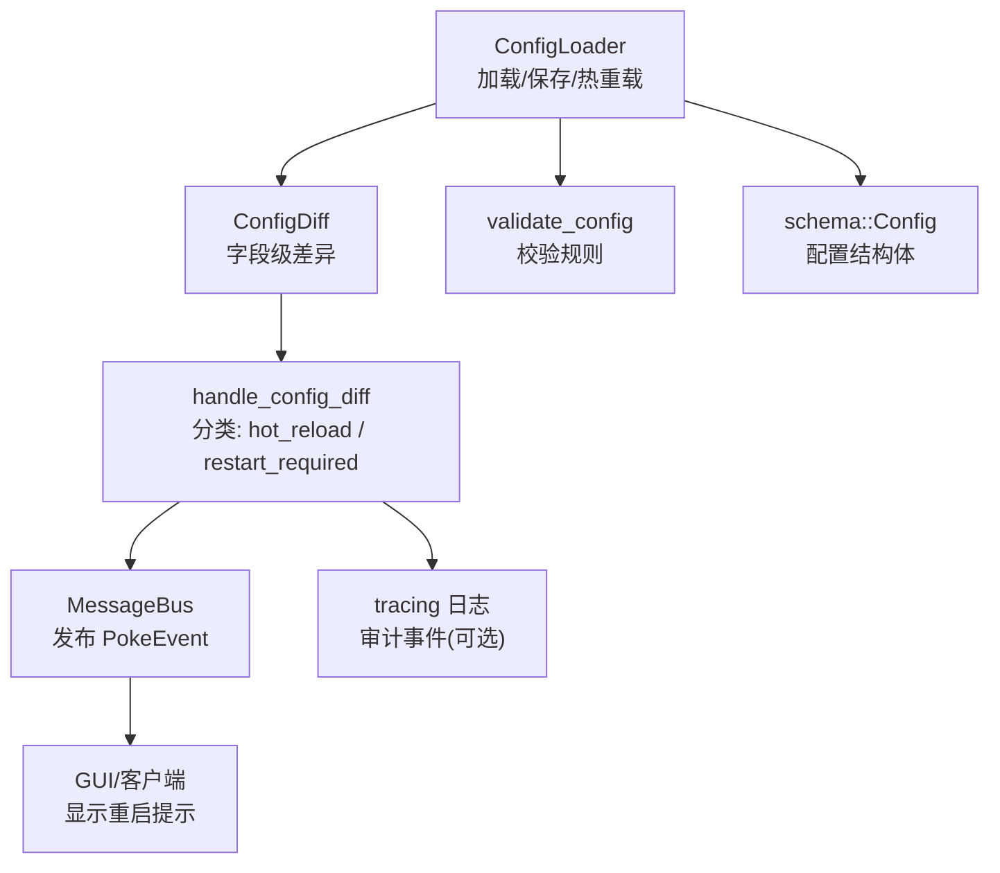
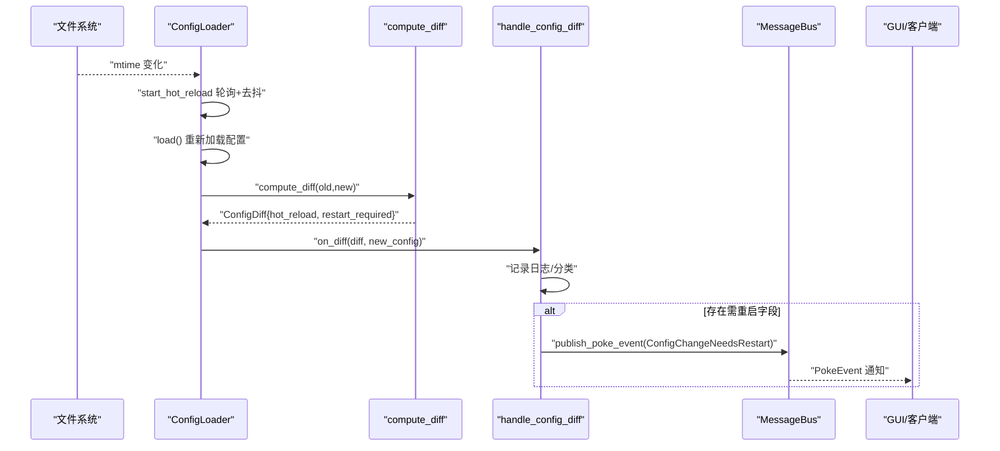
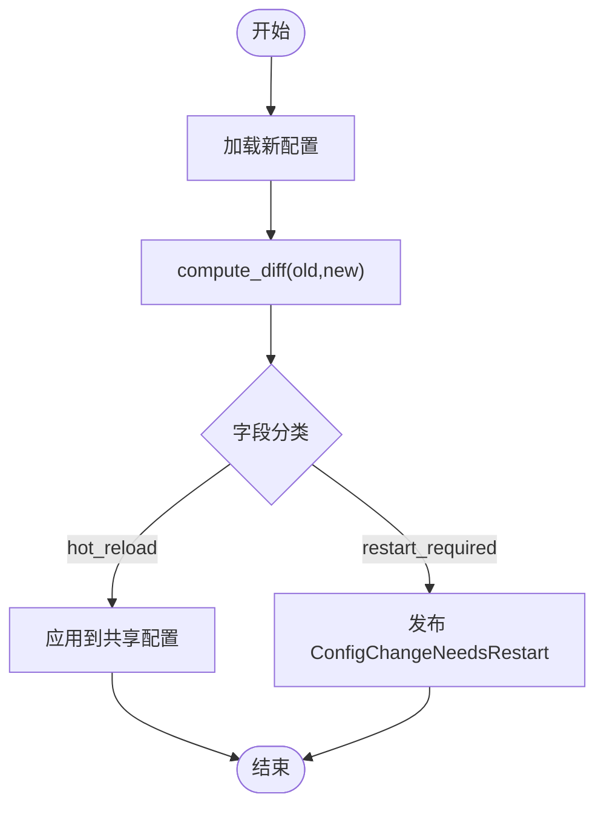
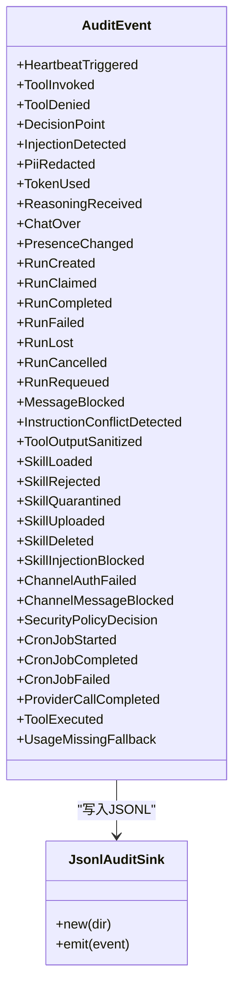
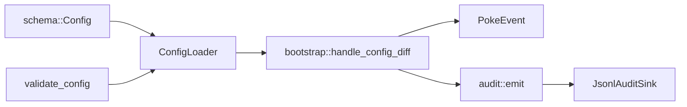
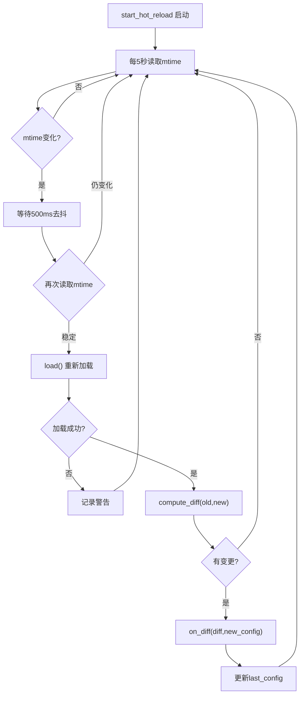
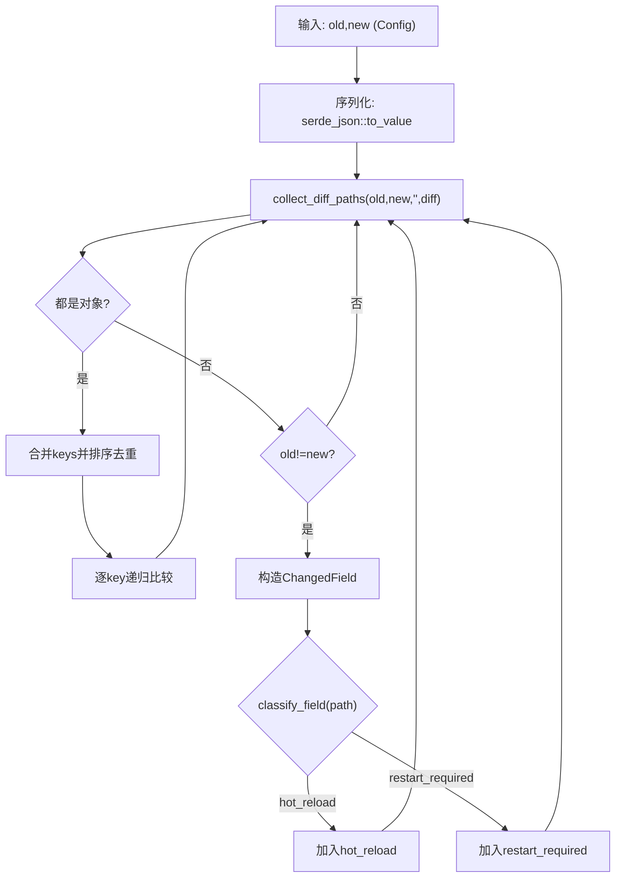

# 动态配置

<cite>
**本文引用的文件**
- [loader.rs](file://agent-diva-core/src/config/loader.rs)
- [schema.rs](file://agent-diva-core/src/config/schema.rs)
- [validate.rs](file://agent-diva-core/src/config/validate.rs)
- [bootstrap.rs](file://agent-diva-manager/src/runtime/bootstrap.rs)
- [events.rs](file://agent-diva-core/src/bus/events.rs)
- [audit.rs](file://agent-diva-core/src/audit.rs)
- [audit_sink.rs](file://agent-diva-core/src/audit_sink.rs)
</cite>

## 目录
1. [简介](#简介)
2. [项目结构](#项目结构)
3. [核心组件](#核心组件)
4. [架构总览](#架构总览)
5. [详细组件分析](#详细组件分析)
6. [依赖关系分析](#依赖关系分析)
7. [性能考量](#性能考量)
8. [故障排查指南](#故障排查指南)
9. [结论](#结论)
10. [附录](#附录)

## 简介
本文件围绕 Agent-Diva 的动态配置能力，系统性说明以下主题：
- 配置热重载机制与变更检测（基于文件 mtime 轮询、去抖）
- 配置差异计算与增量更新（字段级 diff、热更/重启分类）
- 回滚机制与错误处理策略（加载失败不中断、校验失败阻断）
- 运行时配置更新示例（通过 CLI/GUI 保存并触发热重载）
- 配置版本管理与兼容性检查（别名归一化、向后兼容迁移）
- 审计日志与通知机制（PokeEvent 通知 GUI、结构化审计事件落盘）

该方案以“最小侵入”的方式实现：在启动时开启后台任务监听配置文件变化，检测到变更后重新加载并计算差异，按字段安全级别决定“热更”或“需重启”，并通过消息总线向 GUI 发出提示。

## 项目结构
与动态配置相关的代码主要分布在 core 层的配置模块以及 manager 层的运行时引导中：
- agent-diva-core/src/config：配置加载、Schema 定义、校验规则、差异计算与热重载
- agent-diva-manager/src/runtime/bootstrap：启动时注册热重载回调、发布 PokeEvent
- agent-diva-core/src/bus/events：PokeEvent 类型定义（含配置变更需重启事件）
- agent-diva-core/src/audit*：审计事件与审计落盘（JSONL 每日滚动）

图表来源
- [loader.rs:94-166](file://agent-diva-core/src/config/loader.rs#L94-L166)
- [bootstrap.rs:26-75](file://agent-diva-manager/src/runtime/bootstrap.rs#L26-L75)
- [events.rs:361-394](file://agent-diva-core/src/bus/events.rs#L361-L394)

章节来源
- [loader.rs:1-172](file://agent-diva-core/src/config/loader.rs#L1-L172)
- [bootstrap.rs:1-75](file://agent-diva-manager/src/runtime/bootstrap.rs#L1-L75)
- [events.rs:361-394](file://agent-diva-core/src/bus/events.rs#L361-L394)

## 核心组件
- ConfigLoader：负责从文件与环境变量合并加载配置、持久化保存、启动热重载后台任务
- ConfigDiff/ChangedField：描述两次配置之间的差异，并按字段路径分类为“可热更”或“需重启”
- validate_config：集中式校验规则，覆盖模型参数、工具、语音等关键项
- handle_config_diff：管理器侧回调，记录日志、发送 PokeEvent 通知 GUI
- AuditSink：将审计事件写入 JSONL 文件（按日滚动），供外部消费

章节来源
- [loader.rs:12-172](file://agent-diva-core/src/config/loader.rs#L12-L172)
- [loader.rs:180-306](file://agent-diva-core/src/config/loader.rs#L180-L306)
- [validate.rs:1-100](file://agent-diva-core/src/config/validate.rs#L1-L100)
- [bootstrap.rs:26-75](file://agent-diva-manager/src/runtime/bootstrap.rs#L26-L75)
- [audit_sink.rs:145-160](file://agent-diva-core/src/audit_sink.rs#L145-L160)

## 架构总览
下图展示了配置热重载的端到端流程：从文件变更到差异计算、再到通知与审计。

图表来源
- [loader.rs:94-166](file://agent-diva-core/src/config/loader.rs#L94-L166)
- [loader.rs:243-306](file://agent-diva-core/src/config/loader.rs#L243-L306)
- [bootstrap.rs:26-75](file://agent-diva-manager/src/runtime/bootstrap.rs#L26-L75)
- [events.rs:361-394](file://agent-diva-core/src/bus/events.rs#L361-L394)

## 详细组件分析

### 配置加载与热重载
- 加载顺序：默认值 -> 配置文件 -> 环境变量别名映射 -> 路径式环境变量覆盖 -> 键名归一化 -> 反序列化为结构体 -> 校验
- 热重载：后台任务每 5 秒检查一次配置文件 mtime；若发现变化，等待 500ms 去抖后再次确认，然后重新加载并计算差异
- 错误处理：加载失败仅记录警告，不会中断轮询；保证服务可用性

章节来源
- [loader.rs:57-82](file://agent-diva-core/src/config/loader.rs#L57-L82)
- [loader.rs:94-172](file://agent-diva-core/src/config/loader.rs#L94-L172)
- [loader.rs:308-463](file://agent-diva-core/src/config/loader.rs#L308-L463)

### 配置差异计算与增量更新
- 差异计算：将两个 Config 实例序列化为 JSON Value，递归比较所有路径，收集变更点
- 字段分类：白名单字段允许热更（如 agents.defaults.model、tools.budget、logging.level 等），其余一律标记为“需重启”
- 增量应用：当前阶段热更字段直接反映到共享配置 Arc，读取该配置的模块将看到新值；需重启字段通过 PokeEvent 提示用户

图表来源
- [loader.rs:243-306](file://agent-diva-core/src/config/loader.rs#L243-L306)
- [loader.rs:214-239](file://agent-diva-core/src/config/loader.rs#L214-L239)
- [bootstrap.rs:26-75](file://agent-diva-manager/src/runtime/bootstrap.rs#L26-L75)

章节来源
- [loader.rs:180-306](file://agent-diva-core/src/config/loader.rs#L180-L306)
- [bootstrap.rs:26-75](file://agent-diva-manager/src/runtime/bootstrap.rs#L26-L75)

### 回滚机制与错误处理策略
- 回滚策略：当前未实现自动回滚；当新配置加载失败时，保持上次成功加载的配置不变，避免服务降级
- 校验失败：validate_config 返回聚合错误，阻止无效配置生效
- 健壮性：热重载任务对异常进行容错，确保轮询持续运行

章节来源
- [loader.rs:140-166](file://agent-diva-core/src/config/loader.rs#L140-L166)
- [validate.rs:1-100](file://agent-diva-core/src/config/validate.rs#L1-L100)

### 配置验证规则与错误处理
- 校验范围：工作区路径非空、max_tokens/max_tool_iterations > 0、temperature 范围、reasoning_effort 枚举、MCP 服务器传输必填、Web 搜索 provider 与 max_results 限制、ASR/TTS 提供者与参数范围、报告生成器约束等
- 错误聚合：将所有错误拼接为单一 Validation 错误，便于前端展示

章节来源
- [validate.rs:1-100](file://agent-diva-core/src/config/validate.rs#L1-L100)

### 运行时配置更新示例
- 通过 CLI/GUI 调用保存接口写入 config.json，随后热重载任务将在下一个周期检测到变更并触发回调
- 若变更包含需重启字段，GUI 会收到 PokeEvent 并提示用户重启

章节来源
- [loader.rs:76-82](file://agent-diva-core/src/config/loader.rs#L76-L82)
- [bootstrap.rs:121-126](file://agent-diva-manager/src/runtime/bootstrap.rs#L121-L126)
- [events.rs:361-394](file://agent-diva-core/src/bus/events.rs#L361-L394)

### 配置版本管理与兼容性检查
- 别名与迁移：支持多组键名别名（如 channels.neuro-link/neuro_link/generic_pipe、tools.mcpServers/mcp_servers、mate/pet），并在加载时归一化为标准键
- 兼容性：旧版键会被转换为新版键，序列化输出也使用标准键，保证向后兼容

章节来源
- [loader.rs:429-463](file://agent-diva-core/src/config/loader.rs#L429-L463)
- [schema.rs:278-309](file://agent-diva-core/src/config/schema.rs#L278-L309)

### 审计日志与通知机制
- 审计事件：系统关键事件通过 audit::emit 输出结构化 JSON 行，目标为 "audit"，可由外部消费者过滤
- 审计落盘：JsonlAuditSink 按日滚动写入 JSONL 文件，支持可插拔工厂与时间时钟
- 通知机制：当配置变更需要重启时，manager 层通过 MessageBus 发布 PokeEvent::ConfigChangeNeedsRestart，GUI 订阅后可展示提示

图表来源
- [audit.rs:33-222](file://agent-diva-core/src/audit.rs#L33-L222)
- [audit_sink.rs:145-160](file://agent-diva-core/src/audit_sink.rs#L145-L160)

章节来源
- [audit.rs:1-253](file://agent-diva-core/src/audit.rs#L1-L253)
- [audit_sink.rs:145-160](file://agent-diva-core/src/audit_sink.rs#L145-L160)
- [bootstrap.rs:26-75](file://agent-diva-manager/src/runtime/bootstrap.rs#L26-L75)
- [events.rs:361-394](file://agent-diva-core/src/bus/events.rs#L361-L394)

## 依赖关系分析
- ConfigLoader 依赖 schema::Config 与 validate_config，提供 load/save/start_hot_reload/compute_diff
- bootstrap 依赖 ConfigLoader 与 MessageBus，注册热重载回调并发布 PokeEvent
- audit 与 audit_sink 提供审计事件统一入口与持久化

图表来源
- [loader.rs:1-172](file://agent-diva-core/src/config/loader.rs#L1-L172)
- [bootstrap.rs:26-75](file://agent-diva-manager/src/runtime/bootstrap.rs#L26-L75)
- [audit.rs:224-253](file://agent-diva-core/src/audit.rs#L224-L253)
- [audit_sink.rs:145-160](file://agent-diva-core/src/audit_sink.rs#L145-L160)

章节来源
- [loader.rs:1-172](file://agent-diva-core/src/config/loader.rs#L1-L172)
- [bootstrap.rs:26-75](file://agent-diva-manager/src/runtime/bootstrap.rs#L26-L75)
- [audit.rs:224-253](file://agent-diva-core/src/audit.rs#L224-L253)
- [audit_sink.rs:145-160](file://agent-diva-core/src/audit_sink.rs#L145-L160)

## 性能考量
- 轮询间隔与去抖：5 秒轮询 + 500ms 去抖，平衡响应速度与 I/O 压力
- 差异计算复杂度：O(N) 遍历 JSON 树，N 为配置节点数；对于典型配置规模开销较小
- 日志与审计：tracing 低开销；审计事件异步写入 JSONL，不影响主流程
- 内存与并发：共享配置使用 Arc/RwLock，热重载回调轻量，避免阻塞

[本节为通用指导，无需具体文件引用]

## 故障排查指南
- 配置加载失败：查看日志中的警告信息，确认配置文件语法与环境变量覆盖是否正确
- 校验失败：根据 Validation 错误定位字段（如 temperature、max_tokens、provider 等）
- 热重载未生效：确认文件 mtime 是否变化、是否存在频繁保存导致去抖跳过、回调是否被正确注册
- 需重启字段未生效：确认是否已重启服务；可通过 GUI 的“需重启”提示判断
- 审计日志缺失：检查审计 sink 是否注册、日志目录权限、JSONL 文件是否按日滚动

章节来源
- [loader.rs:140-166](file://agent-diva-core/src/config/loader.rs#L140-L166)
- [validate.rs:1-100](file://agent-diva-core/src/config/validate.rs#L1-L100)
- [audit_sink.rs:145-160](file://agent-diva-core/src/audit_sink.rs#L145-L160)

## 结论
Agent-Diva 的动态配置体系以“安全优先、最小侵入”为原则：
- 通过白名单明确哪些字段可热更，其他字段强制重启，降低运行时风险
- 差异计算精细到字段级，便于审计与可视化
- 错误处理稳健，加载失败不中断服务，校验失败阻断无效配置
- 审计与通知完善，便于运维监控与用户交互

未来可扩展方向：
- 引入配置版本化与快照回滚
- 扩展热更字段白名单，逐步减少重启需求
- 增强 GUI 对配置变更的实时反馈与一键回滚

[本节为总结，无需具体文件引用]

## 附录

### 热重载流程图（代码级）

图表来源
- [loader.rs:94-172](file://agent-diva-core/src/config/loader.rs#L94-L172)
- [loader.rs:243-306](file://agent-diva-core/src/config/loader.rs#L243-L306)

### 配置差异计算算法（代码级）

图表来源
- [loader.rs:243-306](file://agent-diva-core/src/config/loader.rs#L243-L306)
- [loader.rs:214-239](file://agent-diva-core/src/config/loader.rs#L214-L239)